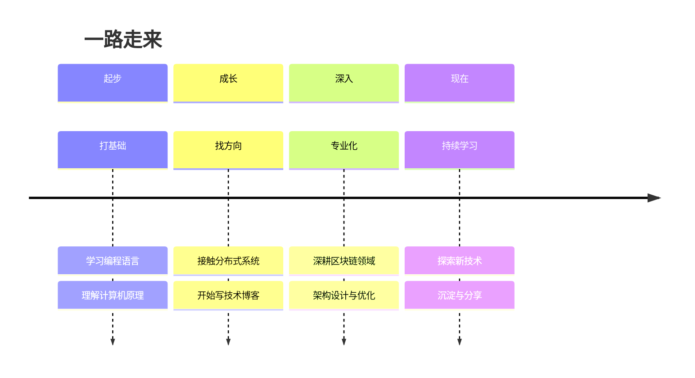

  
  
Cloaks｜Yiiewang

  
区块链架构师 · 技术博主

  

    <a href="https://github.com/yiiewang" target="_blank"><svg xmlns="http://www.w3.org/2000/svg" viewBox="0 0 496 512" width="16" height="16" fill="currentColor"><path d="M165.9 397.4c0 2-2.3 3.6-5.2 3.6-3.3.3-5.6-1.3-5.6-3.6 0-2 2.3-3.6 5.2-3.6 3-.3 5.6 1.3 5.6 3.6zm-31.1-4.5c-.7 2 1.3 4.3 4.3 4.9 2.6 1 5.6 0 6.2-2s-1.3-4.3-4.3-5.2c-2.6-.7-5.5.3-6.2 2.3zm44.2-1.7c-2.9.7-4.9 2.6-4.6 4.9.3 2 2.9 3.3 5.9 2.6 2.9-.7 4.9-2.6 4.6-4.6-.3-1.9-3-3.2-5.9-2.9zM244.8 8C106.1 8 0 113.3 0 252c0 110.9 69.8 205.8 169.5 239.2 12.8 2.3 17.3-5.6 17.3-12.1 0-6.2-.3-40.4-.3-61.4 0 0-70 15-84.7-29.8 0 0-11.4-29.1-27.8-36.6 0 0-22.9-15.7 1.6-15.4 0 0 24.9 2 38.6 25.8 21.9 38.6 58.6 27.5 72.9 20.9 2.3-16 8.8-27.1 16-33.7-55.9-6.2-112.3-14.3-112.3-110.5 0-27.5 7.6-41.3 23.6-58.9-2.6-6.5-11.1-33.3 2.6-67.9 20.9-6.5 69 27 69 27 20-5.6 41.5-8.5 62.8-8.5s42.8 2.9 62.8 8.5c0 0 48.1-33.6 69-27 13.7 34.7 5.2 61.4 2.6 67.9 16 17.7 25.8 31.5 25.8 58.9 0 96.5-58.9 104.2-114.8 110.5 9.2 7.9 17 22.9 17 46.4 0 33.7-.3 75.4-.3 83.6 0 6.5 4.6 14.4 17.3 12.1C428.2 457.8 496 362.9 496 252 496 113.3 383.5 8 244.8 8z"/></svg> GitHub</a>
    <a href="https://hub.docker.com/u/cloaks" target="_blank"><svg xmlns="http://www.w3.org/2000/svg" viewBox="0 0 640 512" width="16" height="16" fill="currentColor"><path d="M349.9 236.3h-66.1v-59.4h66.1v59.4zm0-204.3h-66.1v60.7h66.1V32zm78.2 144.8H362v59.4h66.1v-59.4zm-156.3-72.1h-66.1v60.1h66.1v-60.1zm78.1 0h-66.1v60.1h66.1v-60.1zm276.8 100c-14.4-9.7-47.6-13.2-73.1-8.4-3.3-24-16.7-44.9-41.1-63.7l-14-9.3-9.3 14c-18.4 27.8-23.4 73.6-3.7 103.8-8.7 4.7-25.8 11.1-48.4 10.7H2.4c-8.7 50.8 5.8 116.8 44 162.1 37.1 43.9 92.7 66.2 165.4 66.2 157.4 0 273.9-72.5 328.4-204.2 21.4.4 67.6.1 91.3-45.2 1.5-2.5 6.6-13.2 8.5-17.1l-13.3-8.9zm-511.1-27.9h-66v59.4h66.1v-59.4zm78.1 0h-66.1v59.4h66.1v-59.4zm78.1 0h-66.1v59.4h66.1v-59.4zm-78.1-72.1h-66.1v60.1h66.1v-60.1z"/></svg> Docker</a>
    <a href="mailto:cloaks@qq.com"><svg xmlns="http://www.w3.org/2000/svg" viewBox="0 0 24 24" width="16" height="16" fill="currentColor"><path d="M20 4H4c-1.1 0-1.99.9-1.99 2L2 18c0 1.1.9 2 2 2h16c1.1 0 2-.9 2-2V6c0-1.1-.9-2-2-2zm0 4l-8 5-8-5V6l8 5 8-5v2z"/></svg> 联系我</a>
  

## :wave: 你好！

我是 Cloaks｜Yiiewang，一个在技术世界里不断探索的开发者。

写代码这件事，从最初的「让它跑起来」，到后来追求「让它跑得优雅」，再到现在思考「让它跑得有意义」——这个过程本身就很有趣。

这个博客是我整理思路的地方。写下来的东西，比光想要清晰得多；分享出来，偶尔还能帮到别人，挺好的。

---

## :briefcase: 我在做什么

目前专注于 **区块链技术** 和 **分布式系统** 方向。

=== "日常工作"

    - 设计和优化区块链网络架构
    - 智能合约的开发与安全审计
    - 探索区块链在企业场景的落地方案

=== "业余折腾"

    - 写技术博客（就是你现在看到的这个）
    - 捣鼓一些有趣的开源项目
    - 偶尔骑车、听听老歌

---

## :rocket: 技术历程

回头看看，走过的路大概是这样的：

---

## :hammer_and_wrench: 技术栈

| 方向 | 技术 |
|------|------|
| **区块链** | 智能合约 · 共识算法 · 分布式账本 |
| **后端** | Golang · Java · Python |
| **云原生** | Docker · Kubernetes · CI/CD |
| **数据存储** | MySQL · PostgreSQL · Redis · MongoDB |

---

## :mailbox: 找到我

-   :material-email:{ .lg .middle } **邮箱**

    ---
    
    有任何问题或合作意向，欢迎邮件联系
    
    **cloaks@qq.com**

-   :fontawesome-brands-github:{ .lg .middle } **GitHub**

    ---
    
    代码都在这里，欢迎 Star ⭐
    
    [github.com/yiiewang](https://github.com/yiiewang)

---

## :link: 友情链接

一些我常逛的博客，都是很棒的创作者：

-   **黑山羊日志**

    ---
    
    一个有游戏梦、喜欢设计的前端工程师
    
    [:octicons-link-external-16: z2devil.cn/note](https://z2devil.cn/note)

-   **易水哲.**

    ---
    
    天生我材必有用，千金散尽还复来
    
    [:octicons-link-external-16: anheng.tech](https://anheng.tech/)

-   **春水煎茶**

    ---
    
    王超的技术博客，内容很硬核
    
    [:octicons-link-external-16: writings.sh](https://writings.sh)

-   **陈皓 (左耳朵耗子)**

    ---
    
    CoolShell，技术人的精神家园
    
    [:octicons-link-external-16: coolshell.cn](https://coolshell.cn/articles/author/haoel)

---

  <strong>「为众人抱薪者，不可使其冻毙于风雪」</strong>

