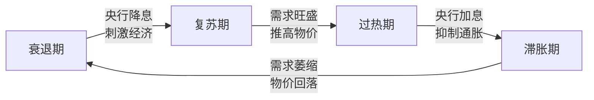

# 什么是美林时钟？

美林证券（Merrill Lynch）基于 30 多年的数据统计分析发现：虽然每个经济周期都有其独特性，但其中确实隐藏着一些相似的规律。如果能合理运用这些规律，投资者将取得更好的收益。

于是，美林将「**资产配置**」、「**行业轮动**」、「**债券收益率曲线**」与「**经济周期四阶段**」联系起来，提出了著名的 **美林时钟投资模型**。

<!-- more -->

!!! tip "核心价值"
    美林时钟帮助投资者识别经济周期的重要转折点，是一个非常实用的资产配置指导工具。

---

## 经济周期的四个阶段

美林时钟基于两个核心宏观指标：

- **GDP（经济增长率）**：衡量经济是否在增长
- **CPI（通货膨胀率）**：衡量物价是否在上涨

根据这两个指标的「高」和「低」，经济周期被划分为四个阶段：

```
                    高 GDP
                      ↑
         ┌───────────┬───────────┐
         │           │           │
         │  复苏期   │   过热期  │
         │  📈 股票  │  🛢️ 大宗  │
         │           │           │
低 CPI ←─┼───────────┼───────────┼─→ 高 CPI
         │           │           │
         │  衰退期   │   滞胀期  │
         │  📊 债券  │  💵 现金  │
         │           │           │
         └───────────┴───────────┘
                      ↓
                    低 GDP
```

---

## 四阶段详解

=== "📊 衰退期（低 GDP + 低 CPI）"

    **经济特征**：
    
    - GDP 增长缓慢或停滞
    - 过剩产能导致商品价格下跌
    - 通胀水平走低
    - 企业盈利走弱
    
    **政策环境**：
    
    - 央行降息刺激经济
    - 收益率曲线急剧下行
    
    **最佳资产**：**债券** 🏆
    
    !!! note "为什么选债券？"
        降息环境下，已持有的高利率债券价格上涨；同时股票因企业盈利下滑表现不佳。

=== "📈 复苏期（高 GDP + 低 CPI）"

    **经济特征**：
    
    - 宽松政策开始奏效
    - 经济增长加速
    - 通胀水平仍然较低
    - 企业盈利大幅提升
    
    **政策环境**：
    
    - 央行仍保持宽松
    - 收益率曲线处于低位
    
    **最佳资产**：**股票** 🏆
    
    !!! note "为什么选股票？"
        企业盈利改善 + 经济向好预期 = 股市最佳的投资窗口期。

=== "🛢️ 过热期（高 GDP + 高 CPI）"

    **经济特征**：
    
    - GDP 保持高增长
    - 产能利用率高
    - 通货膨胀上升
    - 商品需求旺盛
    
    **政策环境**：
    
    - 央行加息抑制过热
    - 收益率曲线上移并趋平
    
    **最佳资产**：**大宗商品** 🏆
    
    !!! note "为什么选大宗商品？"
        加息降低债券吸引力；通胀上升推高商品价格；股票虽仍可配置，但商品表现更优。

=== "💵 滞胀期（低 GDP + 高 CPI）"

    **经济特征**：
    
    - GDP 增长放缓
    - 但通胀仍居高不下
    - 企业利润率下降
    - 供过于求
    
    **政策环境**：
    
    - 央行进退两难（降息怕通胀，加息怕衰退）
    - 只有等通胀见顶才能放松货币政策
    
    **最佳资产**：**现金（货币基金）** 🏆
    
    !!! note "为什么选现金？"
        股票因企业盈利恶化表现差；债券因通胀高企难有回报；大宗商品需求下降。现金是最安全的避风港。

---

## 周期轮动的逻辑

经济周期的轮动遵循一定的内在逻辑：



| 转换 | 驱动因素 |
|------|----------|
| 衰退 → 复苏 | 宽松货币政策刺激经济回暖 |
| 复苏 → 过热 | 高 GDP 增长推高通胀（CPI） |
| 过热 → 滞胀 | 紧缩货币政策抑制 GDP 增长 |
| 滞胀 → 衰退 | 紧缩政策传导至 CPI，通胀下降 |

---

## 资产配置速查表

| 经济阶段 | GDP | CPI | 最佳资产 | 次优资产 | 避免资产 |
|----------|-----|-----|----------|----------|----------|
| **衰退期** | 低 | 低 | 债券 | 现金 | 股票、商品 |
| **复苏期** | 高 | 低 | 股票 | 债券 | 现金 |
| **过热期** | 高 | 高 | 大宗商品 | 股票 | 债券 |
| **滞胀期** | 低 | 高 | 现金 | 商品 | 股票、债券 |

---

## 如何正确使用美林时钟？

### 理解其本质

美林时钟本质上是一种 **基于需求侧变化的经济周期波动理论**。

核心逻辑：

> **基本面** + **货币政策** → 形成短期经济周期 → 影响大类资产走势

### 使用时的注意事项

!!! warning "美林时钟不是万能的"
    
    **理论假设**：
    
    - 经济主导金融
    - 短期经济围绕长期趋势波动
    - 政府逆周期调控能熨平波动
    
    **现实情况**：
    
    - 时钟不会简单按经典周期轮动
    - 可能向后移动或跳过某个阶段
    - 政策干预可能扭曲周期节奏

### 实践建议

1. **结合实际** —— 不要机械套用，需结合当前市场环境分析
2. **多指标验证** —— 除了 GDP 和 CPI，还要关注 PMI、利率、就业等数据
3. **保持灵活** —— 周期切换往往滞后于市场反应，不要等「确认」后再行动
4. **分散配置** —— 即使判断了周期阶段，也不要把所有资金押注单一资产

---

## 延伸阅读

- 原版论文：*The Investment Clock*（Merrill Lynch, 2004）
- 了解更多周期理论：康波周期、朱格拉周期、基钦周期
