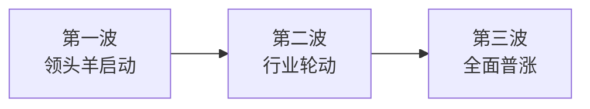

# 本轮牛市的风险与机会

2024 年 9 月底，A 股迎来了一轮罕见的暴涨。这不仅仅是市场反弹，很可能是新一轮牛市的起点。

<!-- more -->

## 为什么说这是牛市的起点？

判断牛市启动，可以从以下几个信号观察：

| 信号 | 说明 |
|------|------|
| **交易量暴增** | 成交额从 5000 亿飙升至 2 万亿以上 |
| **情绪见底** | 恐慌性下跌后，GDP、CPI 等数据全线触底 |
| **汇率企稳** | 人民币止跌回升，外资信心恢复 |
| **政策组合拳** | 降准、降息、房地产松绑多管齐下 |

!!! note "一个观察"
    我们的经济政策通常非常保守，一旦开始「组合拳」式的刺激，往往意味着高层已下定决心。

---

## 牛市的三波上涨规律

历史上的牛市往往呈现三波上涨的节奏：



=== "🚀 第一波：龙头启动"

    **特征**：最先启动的是牛市「旗手」板块
    
    上涨顺序：
    
    1. **券商** → 互联网券商 → 券商上游（IT 系统、金融数据）
    2. **超跌反弹**：消费、房地产、科技、新能源等前期跌幅最大的板块
    3. **周期龙头**：煤炭、有色等资源股

=== "📈 第二波：行业轮动"

    **特征**：资金开始在各行业之间轮动
    
    - 涨幅落后的板块补涨
    - 题材热点频繁切换
    - 赚钱效应扩散

=== "🎢 第三波：全面普涨"

    **特征**：最后的疯狂
    
    - 垃圾股、滞涨股开始补涨
    - 「消灭低价股」行情
    - ⚠️ **风险最高的阶段**

---

## 资金入场的节奏

不同阶段进场的资金类型不同，了解这个规律能帮你判断当前所处的位置：

| 阶段 | 入场资金 | 卖出资金 |
|------|----------|----------|
| **第一波** | 国家队、聪明散户、私募 | 套牢的老散户「解套卖出」 |
| **第二波** | 跟风资金、机构、外资 | 早期获利盘 |
| **第三波** | 小白散户、杠杆资金、基金新手 | 机构和老手「高位派发」 |

!!! warning "规律"
    当你身边从不炒股的人开始讨论股票时，往往是第三波的信号。

---

## 当前市场的几个关键特征

**（写于 2024 年 10 月）**

1. **对冲基金平仓逼空** —— A 股和港股的空头被迫回补
2. **长债资金搬家** —— 债券牛市结束，资金流向股市
3. **全球资金踏空** —— 外资普遍低配中国，补仓需求大
4. **财政放水预期** —— 大概率还有增量政策（也是短期波动风险点）

---

## 我的交易策略建议

### 核心原则

> **多头思维、抓住主线、积极应对颠簸**

- ✅ 已经不是熊市了，别再用熊市思维操作
- ✅ 短期回调 = 上车机会（小跌小买，大跌大买）
- ✅ 中期空间暂不设限，资金可能源源不断
- ✅ 国内财富向股市再配置的趋势才刚刚开始

### 仓位配置建议

```
┌─────────────────────────────────────┐
│  80% 仓位：稳健型 ETF               │
│  ├── 宽基指数（沪深300、中证500）   │
│  ├── 行业ETF（券商、消费、科技）    │
│  └── 红利ETF（稳定现金流）          │
├─────────────────────────────────────┤
│  20% 仓位：个股博收益               │
│  └── 用固定的钱炒股，学会资产再平衡 │
└─────────────────────────────────────┘
```

!!! tip "不会选股怎么办？"
    等待回调，用定投的方式参与，降低择时难度。

---

## 三种定投方法

| 方法 | 原理 | 适用场景 |
|------|------|----------|
| **估值法** | 低估时多投，高估时少投或不投 | 适合有耐心的长期投资者 |
| **周期法** | 在市场低位周期定期投入 | 适合相信均值回归的人 |
| **趋势法** | 底部趋势确认后开始定投 | 适合想降低「抄底抄在半山腰」风险的人 |

---

## 最后的话

牛市赚钱看起来容易，但大部分人最终都是「坐电梯」—— 涨上去又跌回来。

记住几点：

1. **有纪律** —— 设好止盈点，到了就执行
2. **控仓位** —— 别 All in，留有余地
3. **别加杠杆** —— 牛市死于杠杆的人比熊市还多

祝投资顺利！🍀
