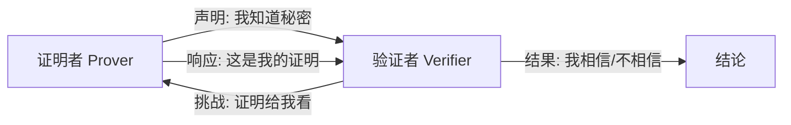

# 零知识证明：不泄露秘密的证明艺术

你能证明自己知道某个秘密，却不透露秘密本身吗？

这听起来像是悖论，但零知识证明（Zero-Knowledge Proof, ZKP）让这成为现实。它是密码学领域最优雅的发明之一，正在重塑区块链隐私、身份认证和数据安全的未来。

<!-- more -->

## 从一个经典故事开始

想象一个场景：

> 阿里巴巴发现了强盗的藏宝洞穴，洞门需要念咒语「芝麻开门」才能打开。现在，阿里巴巴想向你证明他知道咒语，但又不想让你听到咒语本身——万一你也去开门呢？

这就是零知识证明要解决的核心问题：**在不泄露信息的前提下，证明信息的存在**。

### 洞穴协议

密码学家常用「洞穴问题」来解释 ZKP：

```
            入口
              |
         _____|_____
        /           \
       /             \
      A               B
       \             /
        \___门(D)___/
```

假设洞穴是环形的，中间有一扇门 D，只有知道密码才能打开。

**证明过程**：

1. 阿里巴巴随机选择走 A 路或 B 路进入（你看不到他选了哪条）
2. 你站在入口喊：「从 A 路出来！」（或「从 B 路出来！」）
3. 如果阿里巴巴真的知道密码，无论他走的哪条路，都能从你指定的路出来
4. 如果他不知道密码，只有 50% 的概率碰巧走对

重复这个过程 20 次，骗子蒙对的概率降到 $(\frac{1}{2})^{20} \approx 0.0001\%$。

!!! tip "关键洞察"
    这个过程中，你只知道「他能从指定出口出来」，但完全不知道密码是什么。这就是「零知识」的含义——验证者获得的知识为零。

---

## 零知识证明的三大特性

任何合格的零知识证明系统必须满足三个条件：

| 特性 | 含义 | 类比 |
|------|------|------|
| **完备性** | 真命题一定能被证明 | 真正会开门的人，一定能通过测试 |
| **可靠性** | 假命题不能被证明 | 不会开门的人，几乎不可能蒙混过关 |
| **零知识性** | 验证者学不到任何额外信息 | 你确信他会开门，但永远不知道密码 |



---

## 交互式 vs 非交互式

零知识证明有两种主要形式：

=== "交互式 ZKP"

    **特点**：证明者和验证者需要多轮「问答」。
    
    **流程**：
    
    1. **承诺**：证明者发送初始信息
    2. **挑战**：验证者发送随机挑战
    3. **响应**：证明者根据挑战计算响应
    4. **验证**：验证者检查响应是否合法
    
    **典型协议**：Schnorr 身份认证、Feige-Fiat-Shamir
    
    **局限**：需要双方同时在线，不适合区块链等异步场景。

=== "非交互式 ZKP (NIZKP)"

    **特点**：一次通信完成证明，无需来回交互。
    
    **核心技术**：
    
    - **Fiat-Shamir 变换**：用哈希函数模拟验证者的随机挑战
    - **公共参考串 (CRS)**：预先生成的公共参数
    
    **典型协议**：zk-SNARKs、zk-STARKs、Bulletproofs
    
    **优势**：适合区块链、可离线验证、证明可复用。

!!! note "为什么区块链偏爱非交互式？"
    区块链是去中心化的，交易验证不能依赖「问答」。非交互式证明可以写入区块，任何人任何时候都能验证。

---

## 主流 ZKP 协议对比

当前最重要的三个协议家族：

### zk-SNARKs

**全称**：Zero-Knowledge Succinct Non-Interactive Argument of Knowledge

**核心优势**：

- ✅ **证明极小**：约 200-300 字节
- ✅ **验证极快**：毫秒级
- ✅ **成熟生态**：Zcash、以太坊广泛使用

**关键限制**：

- ⚠️ **可信设置**：需要初始化仪式生成参数，参数泄露会破坏安全性
- ⚠️ **不抗量子**：依赖椭圆曲线密码学

```
生成证明: O(n log n) | 验证: O(1) | 证明大小: ~300 bytes
```

### zk-STARKs

**全称**：Zero-Knowledge Scalable Transparent Argument of Knowledge

**核心优势**：

- ✅ **无需可信设置**：透明性更强
- ✅ **抗量子攻击**：基于哈希函数
- ✅ **可扩展性好**：证明生成随输入规模对数增长

**关键限制**：

- ⚠️ **证明较大**：数十到数百 KB
- ⚠️ **验证稍慢**：但仍可接受

```
生成证明: O(n log² n) | 验证: O(log² n) | 证明大小: ~50-500 KB
```

### Bulletproofs

**核心优势**：

- ✅ **无需可信设置**
- ✅ **证明尺寸对数增长**：非常适合范围证明
- ✅ **已在 Monero 生产环境使用**

**关键限制**：

- ⚠️ **验证时间线性**：不适合复杂计算

```
证明大小: O(log n) | 验证: O(n) | 典型用途: 范围证明
```

### 协议选型指南

| 场景 | 推荐协议 | 原因 |
|------|----------|------|
| 隐私交易（如 Zcash） | zk-SNARKs | 证明小、验证快、链上成本低 |
| 高安全要求、抗量子 | zk-STARKs | 无可信设置、未来安全 |
| 简单范围证明 | Bulletproofs | 实现简单、证明紧凑 |
| Layer 2 扩容 | zk-SNARKs/STARKs | 批量验证、降低 Gas |

---

## 零知识证明的数学直觉

不深入数学细节，但理解核心思想很重要。

### 多项式承诺

ZKP 的核心技巧是把「我知道 X」转化为「我知道满足某个多项式的值」。

```
原始问题: 证明我知道 x，使得 f(x) = y
转化问题: 证明我知道一个多项式 P，使得 P(某点) = 期望值
```

为什么这样做？因为多项式有一个神奇性质：

!!! quote "Schwartz-Zippel 引理"
    两个不同的 n 次多项式，最多有 n 个交点。如果在随机点上它们相等，那么它们几乎肯定是同一个多项式。

这意味着验证者只需要检查**一个随机点**，就能以极高概率确认证明的正确性。

### 同态隐藏

另一个关键技术是「同态加密」——在密文上做计算，结果和在明文上做计算一致。

```
加密(a) + 加密(b) = 加密(a + b)
```

这让证明者可以在不暴露原始数据的情况下，展示计算结果的正确性。

---

## 真实应用场景

### 1. 区块链隐私交易

**Zcash** 是最早大规模使用 ZKP 的加密货币：

```
普通交易: 公开 发送方 | 接收方 | 金额
Zcash:   隐藏 发送方 | 接收方 | 金额 + ZK证明（交易合法）
```

验证者能确认交易有效（没有双花、金额正确），却看不到任何交易细节。

### 2. Layer 2 扩容（zkRollup）

以太坊 Layer 2 解决方案的核心：

```
传统方式: 每笔交易 → 主链验证 → 高 Gas
zkRollup: 1000 笔交易 → 生成 1 个 ZKP → 主链验证 ZKP → 极低 Gas
```

**典型项目**：zkSync、StarkNet、Polygon zkEVM

### 3. 隐私身份认证

**场景**：证明你已年满 18 岁，但不透露具体年龄。

```
传统方式: 出示身份证 → 泄露姓名、地址、生日...
ZKP 方式: 生成证明「我的生日早于 2008 年」→ 只暴露「已成年」这一事实
```

**应用**：

- 去中心化身份（DID）
- 隐私 KYC
- 匿名投票

### 4. 机器学习隐私

证明 AI 模型的推理结果正确，但不暴露模型参数：

```
用户: 我想知道这张图片的分类结果
服务方: 分类是「猫」+ ZK证明（证明是用某个模型算出来的）
结果: 用户得到可信结果，服务方保护了模型知识产权
```

---

## 开发者工具生态

如果你想动手实践，这些工具值得了解：

| 工具 | 类型 | 特点 |
|------|------|------|
| **Circom** | DSL 编译器 | 用于编写 zk-SNARKs 电路，生态最成熟 |
| **snarkjs** | JS 库 | 配合 Circom，浏览器可运行 |
| **libsnark** | C++ 库 | 高性能 zk-SNARKs 实现 |
| **Cairo** | 语言 | StarkWare 的 zk-STARKs 专用语言 |
| **Noir** | 语言 | Aztec 推出的 ZK DSL，语法友好 |
| **RISC Zero** | 框架 | 通用 zkVM，可证明任意 Rust 程序 |

### 一个简单的 Circom 示例

```javascript title="multiplier.circom"
pragma circom 2.0.0;

// 证明：我知道两个数 a 和 b，它们的乘积是 c
template Multiplier() {
    signal input a;
    signal input b;
    signal output c;
    
    c <== a * b;
}

component main = Multiplier();
```

这个电路证明「我知道 c 的因数分解」，而不透露 a 和 b 的具体值。

---

## 挑战与未来

### 当前挑战

| 挑战 | 说明 | 进展 |
|------|------|------|
| **计算开销** | 证明生成需要大量计算 | GPU/FPGA 加速、递归证明 |
| **可信设置** | zk-SNARKs 需要初始化仪式 | Plonk 等通用设置、STARKs 无需设置 |
| **开发门槛** | 需要密码学专业知识 | 高级语言（Noir、Leo）降低门槛 |
| **证明大小** | STARKs 证明较大 | 递归证明压缩 |

### 未来趋势

1. **zkEVM 成熟**：让现有以太坊智能合约直接获得 ZK 隐私和扩容能力
2. **硬件加速**：专用 ZK 芯片（ASIC）将大幅降低证明成本
3. **抗量子迁移**：从 SNARKs 逐步迁移到 STARKs 等抗量子方案
4. **跨链隐私**：不同区块链间的隐私资产桥接
5. **通用 zkVM**：证明任意程序执行的正确性，而非特定电路

!!! tip "关注方向"
    如果你对 ZKP 感兴趣，建议关注：Scroll、zkSync、StarkNet 的技术博客，以及 0xPARC 的学习资源。

---

## 总结

零知识证明的核心思想可以用一句话概括：

> **让验证者相信某件事是真的，却学不到任何额外信息。**

它不是魔法，而是巧妙的数学构造。从洞穴问题的直觉，到多项式承诺的数学，再到 zk-SNARKs/STARKs 的工程实现，ZKP 正在成为数字世界隐私保护的基石。

无论你是开发者、投资者还是技术爱好者，理解 ZKP 都将帮助你更好地把握区块链隐私、去中心化身份、安全计算等领域的未来。

---

## 延伸阅读

- [Zcash 技术白皮书](https://z.cash/technology/)
- [Vitalik: An Incomplete Guide to Rollups](https://vitalik.ca/general/2021/01/05/rollup.html)
- [zkSNARKs in a Nutshell](https://blog.ethereum.org/2016/12/05/zksnarks-in-a-nutshell/)
- [Cairo 语言文档](https://www.cairo-lang.org/docs/)
