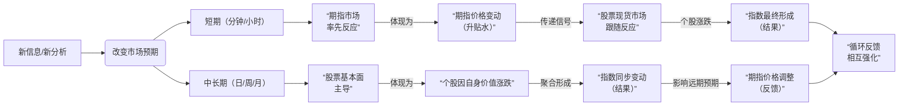

# 股票上涨的本质

股票的涨跌最根本的动能是“预期”，而交易是预期变现的过程，期指是预期的“温度计”和“放大器”。市场参与者对未来的“预期”+真金白银的“资金”+交易行为，就构成了股票市场。

* 预期（基本面）：一家公司业绩会不会好转？一个行业会不会得到政策支持？宏观经济会不会复苏？这些关于未来的看法形成了“预期”。预期决定了资金愿意以什么价格交易。
* 资金（供需关系）：看好的预期会导致买入行为，看空的预期会导致卖出行为。当买入资金 > 卖出资金，价格上涨；反之，则下跌。资金是推动价格运动的直接物理力量。

所以，链条是这样的：新信息/新分析 -> 改变市场预期 -> 引发买卖决策 -> 资金流入/流出 -> 股价变动 -> 新信息/新分析 -> ...

<!-- more -->

## 期指与股票：谁驱动谁？

是“因为股票涨了指数才涨“，还是”因为指数有上涨的要求股票才会被动上涨“？

答案是：两者互为因果，但在不同时间尺度和场景下，主导力量不同。​ 这不是一个单向的驱动关系，而是一个双向反馈循环。

在短期（几分钟、几小时）——期指引领现货，原因是期指市场率先反应，期指价格变动（升贴水）传递信号，股票现货市场跟随反应，个股涨跌，指数最终形成（结果）。

1. 效率更高：期指是单一产品，交易便捷，能瞬间消化新信息。而股票指数是几百只股票的集合，反应必然更慢。
2. 机制灵活：期指可以T+0和多空双向交易，机构和大资金在收到消息后，会首先在期指市场建立头寸。
3. 心理影响：期指开盘比股市早15分钟，这15分钟的走势为全天定下基调。当股民9：30看到期指大涨，开盘后自然倾向于买入股票，从而“实现”了期指的上涨预期。

过程：利好出现 → 期指快速拉升（升水）→ 投机者和套利者看到机会 → 买入一篮子股票（尤其是权重股）→ 股价上涨，指数跟上。在这个场景下，可以说是“期指的上涨要求，被动的带动了股票的上涨”。拉长时间来看，指数的走势绝对是由成分股公司的整体质量决定的。主要原因是价值回归和基本面主导。

1. 价值回归：期指价格最终必须向现货指数价格收敛（到期交割）。如果期指因为投机而长期偏离现货指数，套利资金会入场将其拉回。
2. 基本面主导：一家公司股价的长期趋势取决于其盈利能力、成长性等基本面因素。几百家公司基本面的集合，决定了指数的长期趋势。

过程：公司业绩持续向好 → 投资者长期看好，买入并持有股票 → 股价稳步上涨 → 指数水涨船高 → 期指价格也随之稳步上行。

所以，作为一名投资者，既要关注期指这个“温度计”来把握短期市场情绪，又要深耕个股基本面这个“压舱石”来获取长期收益。