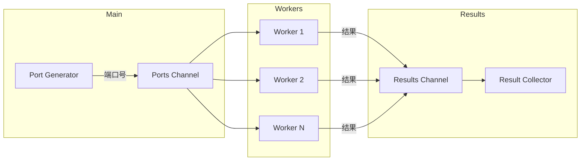

# Go TCP 网络编程实战：Echo、Proxy、Scanner

!!! info "AI 辅助生成"
    本文由 CodeBuddy AI 辅助整理生成，代码来源于作者的学习实践。

TCP 是网络编程的基础，掌握 TCP 编程能让你更好地理解网络通信原理。本文通过三个经典案例，带你从零实现 TCP 服务端、代理和扫描器。

<!-- more -->

## 一、TCP Echo Server

Echo Server 是最简单的 TCP 服务器——收到什么就返回什么，非常适合入门学习。

### 1.1 基础版本：手动读写

```go title="tcp_echo_server.go"
package main

import (
	"bufio"
	"fmt"
	"io"
	"log"
	"net"
)

func echo(conn net.Conn, connId string) {
	defer conn.Close()

	b := make([]byte, 1024)
	for {
		n, err := conn.Read(b[0:])
		if err == io.EOF {
			log.Println("client disconnected.")
			break
		}
		if err != nil {
			log.Println("unexpected error.")
			break
		}
		log.Printf("received %d bytes: %s\n", n, string(b))

		msg := fmt.Sprintf("[%s] echo: %s", connId, b[0:n])
		if _, err = conn.Write([]byte(msg)); err != nil {
			log.Fatalln("unable to write data.")
		}
	}
}

func main() {
	listener, err := net.Listen("tcp", ":8080")
	if err != nil {
		log.Fatalln("unable to bind to port")
	}
	log.Println("Listening on :8080")

	connId := 0
	for {
		conn, err := listener.Accept()
		if err != nil {
			log.Fatalln("unable to accept connection")
		}
		connId++
		go echo(conn, fmt.Sprintf("conn-%d", connId))
	}
}
```

### 1.2 简化版本：io.Copy

Go 标准库提供了 `io.Copy`，可以大大简化代码：

```go title="tcp_echo_simple.go"
func echoWithIOCopy(conn net.Conn) {
	defer conn.Close()
	// 把 conn 读到的内容直接写回 conn
	if _, err := io.Copy(conn, conn); err != nil {
		log.Fatalln("unable to copy conn, err: ", err)
	}
}
```

!!! tip "io.Copy 的妙用"
    `io.Copy(dst, src)` 会从 `src` 读取数据写入 `dst`，直到 EOF 或发生错误。
    
    由于 `net.Conn` 同时实现了 `io.Reader` 和 `io.Writer`，所以可以把同一个连接作为源和目标。

### 1.3 带缓冲版本：bufio

使用 `bufio` 可以减少系统调用次数，提升性能：

```go title="tcp_echo_bufio.go"
func echoWithBufIO(conn net.Conn, connId string) {
	defer conn.Close()

	reader := bufio.NewReader(conn)
	writer := bufio.NewWriter(conn)

	for {
		s, err := reader.ReadString('\n')
		if err != nil {
			log.Println("unable to read data.")
			break
		}
		log.Printf("[%s] received: %s", connId, s)

		msg := fmt.Sprintf("[%s] echo: %s", connId, s)
		if _, err := writer.WriteString(msg); err != nil {
			log.Fatalln("unable to write data.")
		}
		writer.Flush() // 别忘了刷新缓冲区！
	}
}
```

---

## 二、TCP Proxy（代理）

TCP Proxy 用于转发流量，是负载均衡、代理服务器的基础。

### 2.1 实现原理

```
Client ──────> Proxy ──────> Target Server
       <──────       <──────
```

代理服务器需要：

1. 监听客户端连接
2. 建立到目标服务器的连接
3. 双向转发数据

### 2.2 代码实现

```go title="tcp_proxy.go"
package main

import (
	"io"
	"log"
	"net"
)

func handler(src net.Conn) {
	// 连接目标服务器
	dst, err := net.Dial("tcp", "target-server:20080")
	if err != nil {
		log.Fatalln("Unable to connect to target server")
	}
	defer dst.Close()

	// 双向转发
	go func() {
		// Client -> Target
		if _, err = io.Copy(dst, src); err != nil {
			log.Fatalln(err)
		}
	}()

	// Target -> Client
	if _, err = io.Copy(src, dst); err != nil {
		log.Fatalln(err)
	}
}

func main() {
	listener, err := net.Listen("tcp", ":8080")
	if err != nil {
		log.Fatalln("Unable to bind to port")
	}
	log.Println("Proxy listening on :8080")

	for {
		conn, err := listener.Accept()
		if err != nil {
			log.Fatalln("Unable to accept connection")
		}
		go handler(conn)
	}
}
```

!!! warning "注意双向转发"
    必须用两个 goroutine 分别处理两个方向的数据流，否则会阻塞。

---

## 三、TCP Port Scanner（端口扫描器）

端口扫描器用于检测目标主机上哪些端口是开放的。

### 3.1 基础扫描函数

```go title="tcp_scanner.go"
package main

import (
	"fmt"
	"net"
	"time"
)

func Scanner(addr string) error {
	conn, err := net.DialTimeout("tcp", addr, 2*time.Second)
	if err != nil {
		return err
	}
	defer conn.Close()
	return nil
}
```

### 3.2 并发扫描（Worker Pool 模式）

扫描大量端口时，需要并发执行以提升效率：

```go title="tcp_scanner_concurrent.go"
package main

import (
	"fmt"
	"log"
	"net"
	"sync"
	"time"
)

func worker(id int, addr string, ports, results chan int) {
	for port := range ports {
		target := fmt.Sprintf("%s:%d", addr, port)
		
		conn, err := net.DialTimeout("tcp", target, 2*time.Second)
		if err != nil {
			results <- 0 // 端口关闭
			continue
		}
		conn.Close()
		
		log.Printf("worker[%d] found open port: %d\n", id, port)
		results <- port // 端口开放
	}
}

func main() {
	addr := "scanme.nmap.org"
	workerCount := 100
	
	ports := make(chan int, 100)
	results := make(chan int)
	
	// 启动 worker
	var wg sync.WaitGroup
	for i := 0; i < workerCount; i++ {
		wg.Add(1)
		go func(id int) {
			defer wg.Done()
			worker(id, addr, ports, results)
		}(i)
	}
	
	// 发送端口任务
	go func() {
		for port := 1; port <= 1024; port++ {
			ports <- port
		}
		close(ports)
	}()
	
	// 等待所有 worker 完成后关闭 results
	go func() {
		wg.Wait()
		close(results)
	}()
	
	// 收集结果
	var openPorts []int
	for port := range results {
		if port != 0 {
			openPorts = append(openPorts, port)
		}
	}
	
	fmt.Printf("\nOpen ports: %v\n", openPorts)
}
```

### 3.3 架构图



---

## 四、三种实现的对比

| 案例 | 核心技术 | 应用场景 |
|------|----------|----------|
| **Echo Server** | `net.Listen`、`net.Accept` | 学习 TCP 基础、测试工具 |
| **TCP Proxy** | `io.Copy`、双向转发 | 负载均衡、流量转发、中间人 |
| **Port Scanner** | `net.DialTimeout`、Worker Pool | 安全扫描、服务发现 |

## 五、总结

本文介绍了三个经典的 TCP 网络编程案例：

1. **Echo Server** —— TCP 服务端入门，理解连接处理流程
2. **TCP Proxy** —— 双向数据转发，`io.Copy` 的妙用
3. **Port Scanner** —— 并发编程实战，Worker Pool 模式

这三个案例涵盖了 TCP 编程的核心知识点，掌握它们后，你就可以构建更复杂的网络应用了。

## 相关链接

- [Go net 包文档](https://pkg.go.dev/net)
- [Go io 包文档](https://pkg.go.dev/io)
