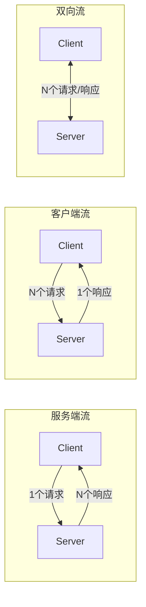

# gRPC Stream 三种模式详解：服务端流、客户端流、双向流

gRPC 除了简单的一元 RPC（Unary RPC）外，还支持三种流式调用模式。本文将详细介绍这三种模式的使用场景和实现方式。

<!-- more -->

## 一、为什么需要 Stream？

传统的 HTTP 请求是「一问一答」模式：

```
Client ──请求──> Server
Client <──响应── Server
```

但在实际场景中，我们经常需要：

| 场景 | 需求 |
|------|------|
| 实时数据推送 | 服务端持续向客户端发送数据（股票行情、日志） |
| 文件上传 | 客户端分块发送大文件 |
| 聊天室 | 双方同时收发消息 |

gRPC Stream 正是为这些场景设计的。

## 二、三种 Stream 模式



| 模式 | 客户端 | 服务端 | 典型场景 |
|------|--------|--------|----------|
| **Server Streaming** | 1 个请求 | N 个响应 | 实时推送、订阅 |
| **Client Streaming** | N 个请求 | 1 个响应 | 文件上传、批量提交 |
| **Bidirectional Streaming** | N 个请求 | N 个响应 | 聊天、实时协作 |

## 三、Proto 定义

```protobuf title="stream.proto"
syntax = "proto3";

package stream;
option go_package = "stream/proto/v1";

service Greeter {
    // 服务端流：客户端发一个请求，服务端返回多个响应
    rpc GetStream(StreamReqData) returns (stream StreamResData);
    
    // 客户端流：客户端发多个请求，服务端返回一个响应
    rpc PutStream(stream StreamReqData) returns (StreamResData);
    
    // 双向流：双方同时收发
    rpc AllStream(stream StreamReqData) returns (stream StreamResData);
}

message StreamReqData {
    string data = 1;
}

message StreamResData {
    string data = 1;
}
```

## 四、服务端流（Server Streaming）

### 4.1 使用场景

- 实时行情推送
- 日志流
- 进度通知

### 4.2 服务端实现

```go title="server.go"
func (s *Server) GetStream(req *stream.StreamReqData, res stream.Greeter_GetStreamServer) error {
    // 先响应一次请求
    err := res.Send(&stream.StreamResData{
        Data: fmt.Sprintf("收到请求: %s", req.Data),
    })
    if err != nil {
        return err
    }
    
    // 持续推送数据
    for {
        err = res.Send(&stream.StreamResData{
            Data: fmt.Sprintf("服务端推送: %v", time.Now().Unix()),
        })
        if err != nil {
            fmt.Printf("发送失败: %s\n", err)
            break
        }
        time.Sleep(time.Second)
    }
    return nil
}
```

### 4.3 客户端实现

```go title="client.go"
func getStream(gc stream.GreeterClient) {
    res, err := gc.GetStream(context.Background(), &stream.StreamReqData{
        Data: "订阅请求",
    })
    if err != nil {
        panic(err)
    }
    
    // 持续接收服务端推送
    for {
        data, err := res.Recv()
        if err != nil {
            fmt.Printf("接收结束: %s\n", err)
            break
        }
        fmt.Println(data.Data)
    }
}
```

---

## 五、客户端流（Client Streaming）

### 5.1 使用场景

- 文件上传（分块）
- 批量数据提交
- 传感器数据采集

### 5.2 服务端实现

```go title="server.go"
func (s *Server) PutStream(req stream.Greeter_PutStreamServer) error {
    for {
        data, err := req.Recv()
        if err == io.EOF {
            // 客户端发送完毕，返回响应
            return req.SendAndClose(&stream.StreamResData{
                Data: "接收完成",
            })
        }
        if err != nil {
            fmt.Printf("接收错误: %s\n", err)
            break
        }
        fmt.Printf("收到数据: %s\n", data.Data)
    }
    return nil
}
```

### 5.3 客户端实现

```go title="client.go"
func putStream(gc stream.GreeterClient) {
    stream, err := gc.PutStream(context.Background())
    if err != nil {
        panic(err)
    }
    
    // 持续发送数据
    for i := 0; i < 10; i++ {
        err = stream.Send(&stream.StreamReqData{
            Data: fmt.Sprintf("客户端数据 #%d", i),
        })
        if err != nil {
            fmt.Printf("发送失败: %s\n", err)
            break
        }
        time.Sleep(time.Second)
    }
    
    // 关闭发送并等待响应
    res, err := stream.CloseAndRecv()
    if err != nil {
        panic(err)
    }
    fmt.Println("服务端响应:", res.Data)
}
```

---

## 六、双向流（Bidirectional Streaming）

### 6.1 使用场景

- 聊天室
- 实时协作编辑
- 游戏同步

### 6.2 服务端实现

```go title="server.go"
func (s *Server) AllStream(stream stream.Greeter_AllStreamServer) error {
    wg := sync.WaitGroup{}
    wg.Add(2)
    
    // 接收客户端数据
    go func() {
        defer wg.Done()
        for {
            data, err := stream.Recv()
            if err != nil {
                fmt.Printf("接收结束: %s\n", err)
                break
            }
            fmt.Printf("收到客户端: %s\n", data.Data)
        }
    }()
    
    // 向客户端推送数据
    go func() {
        defer wg.Done()
        for {
            err := stream.Send(&stream.StreamResData{
                Data: fmt.Sprintf("服务端消息: %v", time.Now().Unix()),
            })
            if err != nil {
                fmt.Printf("发送结束: %s\n", err)
                break
            }
            time.Sleep(time.Second)
        }
    }()
    
    wg.Wait()
    return nil
}
```

### 6.3 客户端实现

```go title="client.go"
func allStream(gc stream.GreeterClient) {
    stream, err := gc.AllStream(context.Background())
    if err != nil {
        panic(err)
    }
    
    wg := sync.WaitGroup{}
    wg.Add(2)
    
    // 接收服务端数据
    go func() {
        defer wg.Done()
        for {
            data, err := stream.Recv()
            if err != nil {
                fmt.Printf("接收结束: %s\n", err)
                break
            }
            fmt.Printf("收到服务端: %s\n", data.Data)
        }
    }()
    
    // 向服务端发送数据
    go func() {
        defer wg.Done()
        for {
            err = stream.Send(&stream.StreamReqData{
                Data: fmt.Sprintf("客户端消息: %v", time.Now().Unix()),
            })
            if err != nil {
                fmt.Printf("发送结束: %s\n", err)
                break
            }
            time.Sleep(time.Second)
        }
    }()
    
    wg.Wait()
}
```

---

## 七、完整服务端代码

```go title="server/main.go"
package main

import (
    "fmt"
    "net"
    "sync"
    "time"

    "google.golang.org/grpc"
    stream "example.com/demo/stream/proto/v1"
)

type Server struct {
    stream.UnimplementedGreeterServer
}

// GetStream, PutStream, AllStream 方法...

func main() {
    listener, err := net.Listen("tcp", ":8080")
    if err != nil {
        panic(err)
    }
    
    server := grpc.NewServer()
    stream.RegisterGreeterServer(server, &Server{})
    
    fmt.Println("gRPC Server listening on :8080")
    if err := server.Serve(listener); err != nil {
        panic(err)
    }
}
```

---

## 八、三种模式对比

| 特性 | 服务端流 | 客户端流 | 双向流 |
|------|----------|----------|--------|
| **请求数** | 1 | N | N |
| **响应数** | N | 1 | N |
| **并发** | 服务端单向 | 客户端单向 | 双方并发 |
| **复杂度** | 低 | 中 | 高 |
| **典型用途** | 推送、订阅 | 上传、采集 | 聊天、协作 |

## 九、最佳实践

!!! tip "流的生命周期管理"
    1. **优雅关闭**：使用 `context.WithCancel` 控制流的生命周期
    2. **错误处理**：检查 `io.EOF` 判断对端是否正常关闭
    3. **超时控制**：使用 `context.WithTimeout` 避免无限等待

!!! warning "常见陷阱"
    1. **忘记用 goroutine**：双向流必须用两个 goroutine 分别收发
    2. **忘记 CloseAndRecv**：客户端流结束时必须调用以获取响应
    3. **阻塞问题**：发送方如果不及时发送，接收方会阻塞

## 十、总结

gRPC Stream 为实时通信场景提供了强大的支持：

- **服务端流**：适合订阅、推送场景
- **客户端流**：适合上传、批量提交场景
- **双向流**：适合聊天、实时协作场景

理解这三种模式的使用场景和实现方式，可以帮助你构建更灵活的分布式系统。

## 相关链接

- [gRPC 官方文档](https://grpc.io/docs/)
- [Protocol Buffers](https://protobuf.dev/)
