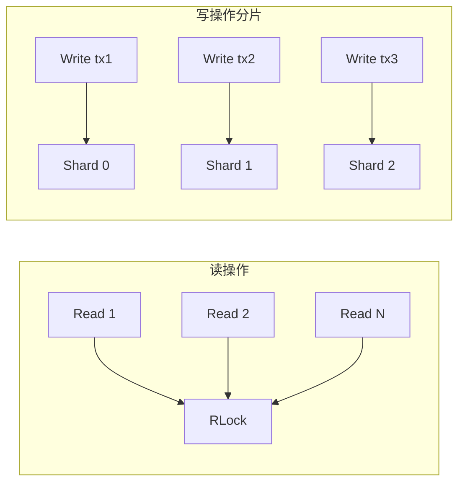

# 高性能滑动窗口缓存设计：环形缓冲区 + 分片锁

!!! info "AI 辅助生成"
    本文由 CodeBuddy AI 辅助整理生成，代码来源于作者的学习实践。

在区块链、日志系统等场景中，我们经常需要缓存「最近 N 条」数据，并支持按 ID 快速查询。本文介绍一个高性能的滑动窗口缓存实现，支持 O(1) 时间复杂度的查询和高并发写入。

<!-- more -->

## 一、需求分析

### 1.1 业务场景

假设我们在开发一个区块链节点，需要：

1. 缓存最近 1000 个区块
2. 支持按区块高度查询
3. 支持按交易 ID 查询所在区块
4. 支持高并发读写

### 1.2 设计目标

| 目标 | 要求 |
|------|------|
| **时间复杂度** | 查询 O(1)，插入 O(T)，T 为交易数 |
| **空间复杂度** | 固定内存，自动淘汰旧数据 |
| **并发性能** | 支持高并发读，减少锁竞争 |
| **监控能力** | 命中率、响应时间等指标 |

## 二、架构设计

### 2.1 整体架构

```
┌─────────────────────────────────────────────────────────────┐
│                 StandardRollingWindowCache                  │
├─────────────────────────────────────────────────────────────┤
│  环形缓冲区 (Ring Buffer)                                    │
│  ┌─────┬─────┬─────┬─────┬─────┬─────┬─────┬─────┐          │
│  │Block│Block│Block│Block│Block│     │     │     │          │
│  │  0  │  1  │  2  │  3  │  4  │     │     │     │          │
│  └─────┴─────┴─────┴─────┴─────┴─────┴─────┴─────┘          │
│     ↑                               ↑                        │
│   tail                            head                       │
├─────────────────────────────────────────────────────────────┤
│  高度索引 (Height Index)                                     │
│  height -> ring_buffer_index                                │
├─────────────────────────────────────────────────────────────┤
│  分片交易索引 (Sharded Transaction Index)                    │
│  ┌─────────┬─────────┬─────────┬─────────┐                  │
│  │ Shard 0 │ Shard 1 │ Shard 2 │ Shard 3 │                  │
│  │ tx->h   │ tx->h   │ tx->h   │ tx->h   │                  │
│  └─────────┴─────────┴─────────┴─────────┘                  │
└─────────────────────────────────────────────────────────────┘
```

### 2.2 核心数据结构

```go title="cache.go"
// BlockEntry 区块条目
type BlockEntry struct {
    Height       uint64   `json:"height"`
    Hash         string   `json:"hash"`
    Timestamp    int64    `json:"timestamp"`
    Transactions []string `json:"transactions"`
    TxCount      int      `json:"tx_count"`
}

// CacheShard 缓存分片，减少锁竞争
type CacheShard struct {
    txIndex map[string]uint64 // 交易ID -> 区块高度
    mu      sync.RWMutex
}

// StandardRollingWindowCache 标准滑动窗口缓存
type StandardRollingWindowCache struct {
    // 分片存储
    shards []*CacheShard
    
    // 环形缓冲区
    ringBuffer []*BlockEntry
    capacity   int
    head       int // 最新数据位置
    tail       int // 最旧数据位置
    size       int
    
    // 高度索引
    heightIndex map[uint64]int
    
    // 配置
    maxBlocks  int
    shardCount int
    windowSize time.Duration
    
    // 监控指标
    metrics *CacheMetrics
    
    mu sync.RWMutex
}
```

## 三、核心实现

### 3.1 分片哈希

通过哈希将交易 ID 映射到不同的分片，减少锁竞争：

```go
func (c *StandardRollingWindowCache) getShard(txID string) *CacheShard {
    h := fnv.New32a()
    h.Write([]byte(txID))
    return c.shards[h.Sum32()%uint32(len(c.shards))]
}
```

!!! tip "为什么用分片？"
    如果所有交易索引共用一把锁，高并发时锁竞争严重。
    
    分片后，不同交易 ID 大概率落在不同分片，可以并行访问。

### 3.2 添加区块

```go
func (c *StandardRollingWindowCache) AddBlock(block *BlockEntry) error {
    c.mu.Lock()
    defer c.mu.Unlock()
    
    // 检查是否已存在
    if _, exists := c.heightIndex[block.Height]; exists {
        return fmt.Errorf("block height %d already exists", block.Height)
    }
    
    // 缓存已满，淘汰最旧的
    if c.size >= c.capacity {
        c.evictOldest()
    }
    
    // 添加到环形缓冲区
    c.ringBuffer[c.head] = block
    c.heightIndex[block.Height] = c.head
    
    // 更新交易索引
    for _, txID := range block.Transactions {
        shard := c.getShard(txID)
        shard.mu.Lock()
        shard.txIndex[txID] = block.Height
        shard.mu.Unlock()
    }
    
    // 更新指针
    c.head = (c.head + 1) % c.capacity
    if c.size < c.capacity {
        c.size++
    }
    
    return nil
}
```

### 3.3 按高度查询

```go
func (c *StandardRollingWindowCache) GetBlockByHeight(height uint64) (*BlockEntry, bool) {
    c.mu.RLock()
    defer c.mu.RUnlock()
    
    if index, exists := c.heightIndex[height]; exists {
        return c.ringBuffer[index], true
    }
    return nil, false
}
```

### 3.4 按交易 ID 查询

```go
func (c *StandardRollingWindowCache) GetBlockByTxID(txID string) (*BlockEntry, bool) {
    // 从分片查找高度
    shard := c.getShard(txID)
    shard.mu.RLock()
    height, exists := shard.txIndex[txID]
    shard.mu.RUnlock()
    
    if !exists {
        return nil, false
    }
    
    // 再按高度查询
    return c.GetBlockByHeight(height)
}
```

### 3.5 淘汰最旧数据

```go
func (c *StandardRollingWindowCache) evictOldest() {
    if c.size == 0 {
        return
    }
    
    oldBlock := c.ringBuffer[c.tail]
    if oldBlock == nil {
        c.tail = (c.tail + 1) % c.capacity
        return
    }
    
    // 从索引中移除
    delete(c.heightIndex, oldBlock.Height)
    
    // 从交易索引中移除
    for _, txID := range oldBlock.Transactions {
        shard := c.getShard(txID)
        shard.mu.Lock()
        delete(shard.txIndex, txID)
        shard.mu.Unlock()
    }
    
    c.ringBuffer[c.tail] = nil
    c.tail = (c.tail + 1) % c.capacity
}
```

## 四、监控指标

### 4.1 指标定义

```go
type CacheMetrics struct {
    TotalRequests uint64 `json:"total_requests"`
    CacheHits     uint64 `json:"cache_hits"`
    CacheMisses   uint64 `json:"cache_misses"`
    Insertions    uint64 `json:"insertions"`
    Evictions     uint64 `json:"evictions"`
    AvgLookupTime int64  `json:"avg_lookup_time_ns"`
    AvgInsertTime int64  `json:"avg_insert_time_ns"`
    CurrentSize   uint64 `json:"current_size"`
    MaxSize       uint64 `json:"max_size"`
    ShardCount    int    `json:"shard_count"`
}
```

### 4.2 命中率计算

```go
func (c *StandardRollingWindowCache) GetHitRate() float64 {
    totalRequests := atomic.LoadUint64(&c.metrics.TotalRequests)
    if totalRequests == 0 {
        return 0.0
    }
    cacheHits := atomic.LoadUint64(&c.metrics.CacheHits)
    return float64(cacheHits) / float64(totalRequests)
}
```

## 五、使用示例

```go
package main

import (
    "fmt"
    "time"
)

func main() {
    // 创建缓存：最大1000个区块，16个分片，1小时时间窗口
    cache := NewStandardRollingWindowCache(1000, 16, time.Hour)
    
    // 添加区块
    block := &BlockEntry{
        Height:       12345,
        Hash:         "0x1234567890abcdef",
        Timestamp:    time.Now().Unix(),
        Transactions: []string{"tx1", "tx2", "tx3"},
        TxCount:      3,
    }
    cache.AddBlock(block)
    
    // 按高度查询
    if b, found := cache.GetBlockByHeight(12345); found {
        fmt.Printf("Found block: %s\n", b.Hash)
    }
    
    // 按交易ID查询
    if b, found := cache.GetBlockByTxID("tx1"); found {
        fmt.Printf("Transaction tx1 in block: %d\n", b.Height)
    }
    
    // 获取最近5个区块
    recent := cache.GetRecentBlocks(5)
    fmt.Printf("Recent blocks: %d\n", len(recent))
    
    // 查看缓存指标
    fmt.Printf("Hit rate: %.2f%%\n", cache.GetHitRate()*100)
}
```

## 六、性能分析

### 6.1 时间复杂度

| 操作 | 时间复杂度 | 说明 |
|------|------------|------|
| 添加区块 | O(T) | T 为交易数量 |
| 按高度查询 | O(1) | 直接哈希表查找 |
| 按交易ID查询 | O(1) | 分片哈希表查找 |
| 获取最近N个 | O(N) | 环形缓冲区遍历 |

### 6.2 空间复杂度

| 组件 | 空间复杂度 |
|------|------------|
| 环形缓冲区 | O(maxBlocks) |
| 高度索引 | O(maxBlocks) |
| 交易索引 | O(总交易数) |

### 6.3 并发性能



- **读操作**：使用读写锁，支持无限并发读
- **写操作**：分片级别并发，不同分片可以并行写入

## 七、配置建议

### 7.1 分片数量选择

```go
// 根据并发度选择
var shardCount int
switch {
case concurrency <= 10:
    shardCount = 4
case concurrency <= 50:
    shardCount = 16
case concurrency <= 200:
    shardCount = 64
default:
    shardCount = 256
}
```

### 7.2 缓存大小选择

```go
// 根据数据特征选择
blockRate := 1000 // 每秒产生的区块数
windowHours := 24 // 缓存24小时的数据
maxBlocks := blockRate * 3600 * windowHours
```

## 八、最佳实践

!!! tip "预热缓存"
    ```go
    // 应用启动时预加载热点数据
    func warmupCache(cache *StandardRollingWindowCache) {
        recentBlocks := loadRecentBlocksFromDB(1000)
        for _, block := range recentBlocks {
            cache.AddBlock(block)
        }
    }
    ```

!!! tip "监控命中率"
    ```go
    // 命中率低于90%考虑增加缓存大小
    if cache.GetHitRate() < 0.9 {
        log.Warn("Cache hit rate is low")
    }
    ```

!!! warning "注意事项"
    1. **内存使用**：缓存占用固定内存，根据系统资源合理设置
    2. **数据一致性**：缓存可能与数据库不同步，需要合适的更新策略
    3. **分片均衡**：确保交易 ID 的哈希分布均匀

## 九、总结

本文介绍了一个高性能滑动窗口缓存的设计和实现：

| 特性 | 实现方式 |
|------|----------|
| **固定内存** | 环形缓冲区，自动淘汰 |
| **O(1) 查询** | 双重索引（高度 + 交易ID） |
| **高并发** | 分片锁减少竞争 |
| **可观测** | 内置监控指标 |

这种设计适用于区块链、日志系统、消息队列等需要缓存「最近 N 条」数据的场景。

## 相关链接

- [Go sync 包文档](https://pkg.go.dev/sync)
- [Go atomic 包文档](https://pkg.go.dev/sync/atomic)
