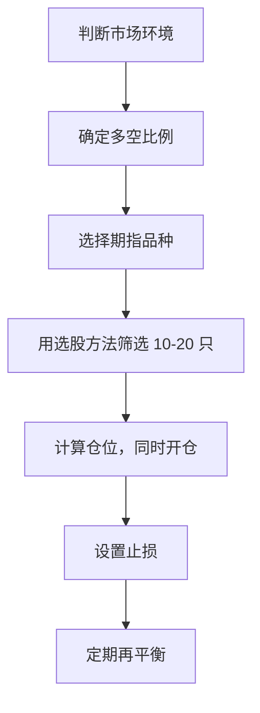

# 货币中性策略：不看大盘也能赚钱的交易方法

你是否厌倦了每天盯着大盘涨跌，心情随着 K 线起伏？有一种策略可以让你「不管大盘涨跌都能赚钱」——这就是 **货币中性策略**（Dollar-Neutral Strategy）。

本文将从最基础的概念讲起，带你一步步掌握这种专业投资者常用的对冲交易方法。

<!-- more -->

---

## 一、什么是货币中性策略？

### 1.1 一句话解释

$$
做多金额 = 做空金额
$$

**做多** 你看好的股票，同时 **做空** 等额的指数或个股，让组合对大盘涨跌「免疫」。

!!! example "最简单的例子"
    - **做多** 100 万 A 股票（预期跑赢大盘）
    - **做空** 100 万股指期货（对冲大盘风险）
    - 净敞口 = 0，不怕大盘涨跌

### 1.2 赚什么钱？

传统做多赚的是 **绝对收益** ——股票涨了你就赚。

货币中性赚的是 **相对收益** ——你的股票比指数强你就赚。

| 市场环境 | 你的股票 | 指数 | 你的收益 |
|---------|---------|------|---------|
| 🐂 牛市 | +20% | +10% | **+10%** ✅ |
| 🐻 熊市 | -5% | -15% | **+10%** ✅ |
| 🔀 震荡 | +5% | -5% | **+10%** ✅ |

!!! success "核心洞察"
    **不管大盘涨跌，只要你的股票跑赢指数，你就赚钱。**

---

## 二、两种做空方式对比

在 A 股实现货币中性，主要有两种做空方式：

| 对比项 | 融券 | 股指期货 |
|--------|------|----------|
| **成本** | 年化 8-10%（按天计息） | 仅手续费（约 0.0023%） |
| **流动性** | 券源紧张，热门股难借 | 充足 |
| **做空对象** | 个股 | 整个指数 |
| **灵活性** | 只能 1:1 对冲 | 可灵活调整多空比例 |
| **门槛** | 50 万 + 半年经验 | 50 万 + 考试 |

??? example "📊 成本对比：同样对冲 100 万，持仓 30 天"
    
    | 方式 | 成本计算 | 总成本 |
    |------|---------|--------|
    | 融券 | 100万 × 8% ÷ 365 × 30 | **6,575 元** |
    | 股指期货 | 120万 × 0.0023% × 2 | **55 元** |
    
    **结论**：股指期货成本仅为融券的 **0.8%**！

!!! tip "推荐方案"
    **优先使用股指期货**，成本低、流动性好、还能灵活调整牛熊配置。
    
    下文将以股指期货为主介绍具体操作方法。

---

## 三、股指期货基础知识

### 3.1 四大品种

| 品种 | 代码 | 合约乘数 | 保证金 | 适配股票 |
|------|------|----------|--------|----------|
| 沪深 300 | IF | 300 元/点 | 12% | 大盘蓝筹 |
| 上证 50 | IH | 300 元/点 | 12% | 超大盘 |
| 中证 500 | IC | 200 元/点 | 14% | 中盘股 |
| 中证 1000 | IM | 200 元/点 | 15% | 小盘股 |

### 3.2 期指与股票要匹配

!!! warning "这是最常见的错误！"
    做多的股票类型必须与做空的期指匹配，否则对冲无效。

| 你做多的股票 | 应做空的期指 |
|-------------|-------------|
| 沪深 300 成分股（大盘蓝筹） | **IF** |
| 上证 50 成分股（银行、保险等） | **IH** |
| 中证 500 成分股（中盘成长） | **IC** |
| 中证 1000 成分股（小盘股） | **IM** |

**错误示范**：做多一堆小盘股，却做空 IF

- 小盘股涨 20%，沪深 300 涨 5% → 你只赚 15%（少赚了）
- 小盘股涨 5%，沪深 300 涨 15% → 你亏 10%（对冲失效）

---

## 四、选股方法（核心章节）

用期指做空时，选股逻辑与传统配对交易不同：

```
你的收益 = 个股涨跌 - 指数涨跌 = α（超额收益）
```

**核心目标**：选择能 **跑赢指数** 的股票。

### 4.1 行业龙头法

选择具有竞争优势的公司，它们更容易跑赢指数。

| 筛选维度 | 具体标准 | 逻辑 |
|---------|---------|------|
| 行业地位 | 市占率第一、品牌力强 | 强者恒强 |
| 盈利能力 | ROE > 15% | 护城河深 |
| 成长性 | 营收增速 > 行业均值 | 有 α 来源 |
| 估值 | PE < 行业中位数 | 安全边际 |

??? example "示例：消费行业龙头筛选"
    ```
    筛选条件：
    - 申万消费行业
    - ROE > 20%
    - 近 3 年营收复合增长 > 10%
    - PE < 行业中位数
    
    可能筛出：茅台、海天、伊利等
    ```

### 4.2 动量选股法

选择近期跑赢指数的股票，趋势往往会延续。

```python
# 计算相对强度
相对强度 = 个股 20 日涨幅 - 指数 20 日涨幅

# 选股规则
if 相对强度 > 5%:
    纳入做多池
```

**操作步骤**：

1. 确定股票池（如沪深 300 成分股）
2. 计算每只股票过去 20 天的相对强度
3. 选相对强度排名前 20% 的股票
4. 每 1-2 周重新调仓

!!! warning "注意"
    动量策略在趋势行情中表现好，但市场反转时可能亏损。务必配合止损。

### 4.3 事件驱动法

利用特定事件带来的短期超额收益。

| 事件类型 | 预期效果 | 持有周期 |
|---------|---------|---------|
| 业绩超预期 | 短期跑赢指数 | 1-4 周 |
| 纳入指数 | 被动资金买入 | 公告到生效 |
| 股权激励 | 管理层利益绑定 | 1-3 月 |
| 回购/增持 | 信心信号 | 1-2 周 |

### 4.4 低相关性法

选择与指数相关性较低、有独立上涨逻辑的股票。

| 低相关性来源 | 示例 |
|-------------|------|
| 独特商业模式 | 分众传媒、爱尔眼科 |
| 政策驱动 | 新能源、半导体 |
| 重组预期 | 央企整合标的 |
| 困境反转 | 周期底部行业龙头 |

### 4.5 组合构建建议

| 维度 | 建议 |
|------|------|
| 股票数量 | 10-20 只，分散风险 |
| 行业分布 | 单一行业不超过 3 只 |
| 市值匹配 | 与做空的期指对应 |
| 调仓频率 | 动量法 2-4 周，基本面法 1-3 月 |

---

## 五、牛熊市灵活配置

这是股指期货的 **核心优势** ——不必严格保持「做多=做空」，可根据市场环境调整。

=== "🐂 牛市配置"

    **思路**：偏重做多，少量对冲
    
    | 项目 | 配置 |
    |------|------|
    | 做多（个股） | 100 万 |
    | 做空（期指） | 30-50 万 |
    | 净敞口 | +50-70 万（看多） |
    
    **选股重点**：弹性大、跑赢大盘的进攻型股票

=== "🐻 熊市配置"

    **思路**：偏重做空，精选做多
    
    | 项目 | 配置 |
    |------|------|
    | 做多（防御股） | 30-50 万 |
    | 做空（期指） | 100 万 |
    | 净敞口 | -50-70 万（看空） |
    
    **选股重点**：高股息、必需消费等抗跌品种

=== "🔀 震荡市配置"

    **思路**：回归中性，赚取 α
    
    | 项目 | 配置 |
    |------|------|
    | 做多（强势股） | 100 万 |
    | 做空（期指） | 100 万 |
    | 净敞口 | 0（货币中性） |
    
    **选股重点**：有独立行情的个股（重组、业绩超预期等）

### 判断牛熊的简单方法

| 指标 | 牛市信号 | 熊市信号 |
|------|----------|----------|
| 均线 | 指数站上 60 日均线 | 指数跌破 60 日均线 |
| 成交量 | 持续放量 | 持续缩量 |
| 板块 | 多数板块上涨 | 多数板块下跌 |
| 两融余额 | 持续上升 | 持续下降 |

---

## 六、实战操作流程

### 6.1 完整流程



### 6.2 仓位计算

**原则**：做多市值与做空市值按设定比例匹配。

```
示例（震荡市，1:1 配置）：

做多端：
- 计划做多 100 万，分配到 15 只股票
- 每只约 6.7 万

做空端：
- IF 价格 4000 点，1 手市值 = 4000 × 300 = 120 万
- 需要空 1 手 IF，保证金 = 120 万 × 12% = 14.4 万
- 实际对冲市值略大于 100 万，可接受
```

### 6.3 止损设置

| 类型 | 规则 |
|------|------|
| 单只股票 | 亏损达 8% 止损 |
| 单日 | 组合亏损达 3% 停止交易 |
| 单月 | 组合亏损达 8% 暂停复盘 |

### 6.4 调仓周期

| 选股方法 | 建议调仓频率 |
|---------|-------------|
| 动量法 | 每 2 周 |
| 事件驱动 | 事件结束即平仓 |
| 基本面法 | 每 1-3 月 |
| 低相关性法 | 逻辑失效时调整 |

---

## 七、风险管理

### 7.1 主要风险

| 风险类型 | 说明 | 应对 |
|----------|------|------|
| 选股失败 | 股票跑输指数 | 分散持仓、严格止损 |
| 基差风险 | 期货与现货价差波动 | 关注基差变化 |
| 流动性风险 | 大单冲击成本 | 选择高成交量标的 |
| 极端行情 | 黑天鹅导致单边大波动 | 控制总仓位 |

### 7.2 仓位管理建议

| 维度 | 建议 |
|------|------|
| 单只股票仓位 | ≤ 总资金的 10% |
| 单一行业 | ≤ 总资金的 25% |
| 保留现金 | ≥ 20%（应对保证金追加） |

---

## 八、策略的缺点

货币中性策略听起来很美好，但为什么大多数投资者不选择它？以下是主要原因：

### 8.1 收益天花板明显

!!! danger "最大的问题：错过大牛市"
    
    | 场景 | 纯做多 | 货币中性 |
    |------|--------|----------|
    | 牛市（指数 +50%） | 赚 50%+ | 只赚 α（可能 10-15%） |
    | 熊市（指数 -30%） | 亏 30% | 可能赚 5-10% |
    
    **痛点**：2024 年 9 月大牛市，指数一个月涨 30%，你的货币中性组合可能只赚 5%。
    
    看着别人翻倍，你心态能稳住吗？

### 8.2 门槛高

| 门槛类型 | 具体要求 |
|---------|---------|
| 资金门槛 | 50 万起（融资融券/股指期货） |
| 知识门槛 | 需懂期货、对冲、选股、风控 |
| 时间门槛 | 需要持续研究和调仓 |
| 心理门槛 | 能接受「别人赚大钱你赚小钱」 |

### 8.3 复杂度高，容易出错

```
常见的翻车场景：

❌ 期指与股票不匹配 → 对冲失效
❌ 选股跑输指数 → 两头亏钱
❌ 忘记移仓换月 → 被动平仓
❌ 保证金不足 → 强制平仓
❌ 牛熊判断错误 → 方向做反
```

### 8.4 成本侵蚀收益

即使用成本较低的股指期货，仍有以下成本：

| 成本项 | 说明 |
|--------|------|
| 交易手续费 | 股票 + 期货双边 |
| 冲击成本 | 大资金成交的滑点 |
| 展期成本 | 期货移仓换月的价差 |
| 基差成本 | 期货贴水时的隐性成本 |
| 研究成本 | 时间精力也是成本 |

!!! warning "现实情况"
    策略年化收益 15%，扣除各种成本后可能只剩 10%。
    
    而同期买入沪深 300 ETF 躺平，可能也有 8-10%……

### 8.5 心理压力大

| 压力来源 | 具体表现 |
|---------|---------|
| 跑输大盘 | 牛市别人赚 50%，你赚 10% |
| 操作复杂 | 多空两端都要管理 |
| 持续研究 | 需要不断寻找新的 α 来源 |
| 孤独感 | 周围没人用这个策略，无法交流 |

### 8.6 适合谁？不适合谁？

| ✅ 适合 | ❌ 不适合 |
|--------|----------|
| 追求稳定、低波动 | 追求高收益、能承受高波动 |
| 有时间精力研究 | 没时间看盘、希望躺平 |
| 资金量较大（100万+） | 资金量小（不到50万） |
| 心态稳、不 FOMO | 看到别人赚钱就眼红 |
| 已有稳定收入，投资是锦上添花 | 靠投资暴富改变命运 |

!!! quote "灵魂拷问"
    如果你的答案是「我想在牛市赚更多」，那货币中性策略可能不适合你。
    
    这个策略的本质是 **用收益上限换取波动下限**，你必须接受这个 trade-off。

---

## 九、常见问题

??? question "没有 50 万怎么办？"
    可以用「仓位调整法」替代：
    
    - 看好的股票配置 60-70%
    - 保留 30-40% 现金
    
    虽然不是严格中性，但也能降低大盘波动影响。

??? question "收益预期是多少？"
    - 专业量化基金：年化 10-20%，波动率低
    - 个人投资者：年化 10-15% 是合理预期
    
    **记住**：这是追求稳定的策略，不是暴富工具。

??? question "需要一直盯盘吗？"
    不需要频繁盯盘，但需要：
    
    - 每日收盘检查一次组合
    - 按调仓周期定期再平衡
    - 突发事件及时评估影响

---

## 十、总结

### 核心要点

1. **货币中性 = 做多股票 + 做空等额指数**，对冲大盘风险
2. **赚的是超额收益（α）**，股票跑赢指数就赚钱
3. **股指期货是首选做空工具**，成本低、灵活性高
4. **选股是核心**，目标是找能跑赢指数的股票
5. **牛熊灵活配置**：牛市偏多、熊市偏空、震荡中性

### 行动建议


1. **第一周**：理解概念，学习选股方法
2. **第二周**：用模拟盘测试
3. **第一个月**：小资金实盘（单只不超过 1 万）
4. **三个月后**：根据实盘表现决定是否加大投入

!!! success "最后的话"
    货币中性策略的价值在于：**让你从「猜大盘」的焦虑中解脱，专注于研究公司的相对价值。**
    
    这种思维方式的转变，可能比策略本身更有价值。

---

## 相关阅读

- [《量化交易》读书笔记](7.md) - Ernest P. Chan 的量化交易入门经典
- [配对交易实战：GLD 与 GDX 的均值回归策略](9.md) - 用 Golang 实现完整的配对交易策略，详解数学公式原理
