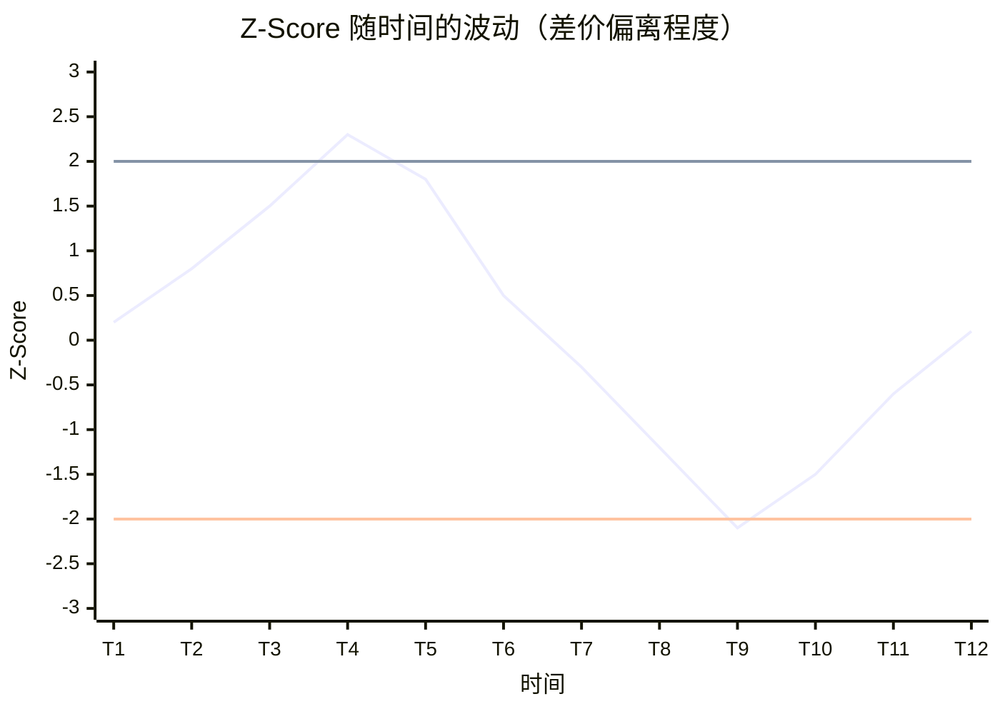

# 配对交易实战：GLD 与 GDX 的均值回归策略

本文是《量化交易》第三章的案例实践，用 **Golang** 从零实现一个完整的配对交易策略。重点不是代码本身，而是讲清楚 **每个数学公式的含义和为什么要这么计算**。

<!-- more -->

---

## 一、什么是配对交易？

### 1.1 核心思想

配对交易（Pairs Trading）是一种 **市场中性策略**，基于两个高度相关资产的价差会回归均值的假设。

```
当价差偏离均值太多 → 预期回归 → 买入低估的，卖出高估的 → 价差回归时获利
```

### 1.2 为什么选择 GLD 和 GDX？

| ETF | 全称 | 追踪标的 |
|-----|------|---------|
| **GLD** | SPDR Gold Shares | 黄金现货价格 |
| **GDX** | VanEck Gold Miners ETF | 采金企业股票 |

**相关性逻辑**：金价上涨 → 采金企业收益增加 → GDX 上涨

两者价格走势高度相关，但短期会出现偏离，这就是我们套利的机会。

??? note "📚 ETF 配对交易背景知识（点击展开）"
    
    **ETF 之间为什么会相关？**
    
    ETF 配对交易不是「ETF 和某个东西相关」，而是 **两个 ETF 因为共同的驱动因素而相关**：
    
    ```mermaid
    flowchart LR
        A[黄金价格] -->|直接持有| B[GLD 黄金 ETF]
        A -->|影响利润| C[金矿公司]
        C -->|股价反映| D[GDX 金矿 ETF]
    ```
    
    | 配对类型 | 例子 | 共同驱动因素 |
    |----------|------|--------------|
    | **同一商品/不同环节** | GLD vs GDX | 黄金价格 |
    | **同一市场/不同市值** | SPY vs IWM | 美国经济 |
    | **同一商品/不同国家** | EWA vs EWC | 资源出口国经济 |
    | **上下游产业链** | XLE vs XLI | 油价 |
    | **替代品关系** | USO vs UNG | 能源需求 |
    
    ---
    
    **GLD 和 GDX 的关系详解**
    
    | ETF | 与黄金的关系 | 特点 |
    |-----|--------------|------|
    | **GLD** | 直接持有实物黄金，1:1 跟踪金价 | 波动较小 |
    | **GDX** | 持有金矿公司股票，间接受益 | 有经营杠杆，波动较大 |
    
    **为什么会有价差波动？**
    
    - 金矿公司有 **经营成本**（开采、人工、能源），成本波动影响利润
    - 金矿股受 **股票市场情绪** 影响（如恐慌抛售）
    - 短期会偏离理论关系，长期会回归
    
    ---
    
    **为什么 ETF 比个股更适合配对交易？**
    
    | 优势 | 说明 |
    |------|------|
    | **分散风险** | ETF 是一篮子股票，不会因单一公司暴雷崩盘 |
    | **流动性好** | 主流 ETF 交易量大，买卖价差小 |
    | **关系稳定** | 不会像个股那样因业绩/丑闻突然脱钩 |
    | **费用低** | 管理费低，长期持有成本可控 |
    | **可做空** | 大部分券商都支持 ETF 融券做空 |
    
    ---
    
    **其他经典 ETF 配对组合**
    
    | 配对 | 逻辑 |
    |------|------|
    | SPY vs QQQ | 标普500 vs 纳斯达克，都是美股大盘 |
    | EEM vs EFA | 新兴市场 vs 发达市场，全球经济驱动 |
    | GLD vs SLV | 黄金 vs 白银，贵金属板块 |
    | TLT vs IEF | 长期国债 vs 中期国债，利率驱动 |
    | USO vs XLE | 原油 vs 能源股，油价驱动 |

---

## 二、模拟数据准备

为了便于理解，我们先用模拟数据演示整个流程。

### 2.1 生成模拟价格数据

假设我们有 20 天的交易数据：

| 日期 | GLD 价格 | GDX 价格 |
|------|---------|---------|
| Day 1 | 100.00 | 30.00 |
| Day 2 | 101.20 | 30.50 |
| Day 3 | 102.50 | 31.20 |
| Day 4 | 101.80 | 30.80 |
| Day 5 | 103.00 | 31.50 |
| Day 6 | 104.50 | 31.80 |
| Day 7 | 103.20 | 31.00 |
| Day 8 | 105.00 | 32.20 |
| Day 9 | 106.50 | 32.80 |
| Day 10 | 105.80 | 32.50 |
| Day 11 | 107.20 | 33.00 |
| Day 12 | 108.50 | 33.50 |
| Day 13 | 107.00 | 32.80 |
| Day 14 | 109.00 | 34.00 |
| Day 15 | 110.50 | 34.50 |
| Day 16 | 109.80 | 34.20 |
| Day 17 | 111.20 | 34.80 |
| Day 18 | 112.50 | 35.20 |
| Day 19 | 111.00 | 34.50 |
| Day 20 | 113.00 | 35.50 |

```go title="data.go"
package main

// 模拟 GLD 价格数据
var gldPrices = []float64{
    100.00, 101.20, 102.50, 101.80, 103.00,
    104.50, 103.20, 105.00, 106.50, 105.80,
    107.20, 108.50, 107.00, 109.00, 110.50,
    109.80, 111.20, 112.50, 111.00, 113.00,
}

// 模拟 GDX 价格数据
var gdxPrices = []float64{
    30.00, 30.50, 31.20, 30.80, 31.50,
    31.80, 31.00, 32.20, 32.80, 32.50,
    33.00, 33.50, 32.80, 34.00, 34.50,
    34.20, 34.80, 35.20, 34.50, 35.50,
}
```

---

## 三、对冲比率（Hedge Ratio）

### 3.1 为什么需要对冲比率？

直接用 `GLD价格 - GDX价格` 作为差价是不对的，因为：

1. **单位不同**：GLD 约 100 元，GDX 约 30 元，量级不同
2. **波动性不同**：两者的价格波动幅度不同

我们需要找到一个 **对冲比率** $\beta$，使得：

$$
差价 = GLD - \beta \times GDX
$$

这个差价应该在 **0 附近波动**，且 **波动幅度稳定**。

!!! success "套利逻辑"
    差价偏离 0 就意味着套利机会：
    
    - **差价 > 0（偏高）**：GLD 相对 GDX 被高估 → 做空 GLD，做多 GDX → 等差价回归 0 时平仓获利
    - **差价 < 0（偏低）**：GLD 相对 GDX 被低估 → 做多 GLD，做空 GDX → 等差价回归 0 时平仓获利
    
    核心假设：差价会 **均值回归**，偏离越大，回归的概率越高、利润空间越大。

### 3.2 如何计算对冲比率？—— OLS 线性回归

??? note "📚 前置知识：从散点图到最佳拟合线（点击展开）"
    假设我们有 GLD 和 GDX 的历史价格数据，画成图表：

    ```mermaid
    xychart-beta
        title "GLD vs GDX 价格关系"
        x-axis "GDX价格" [28, 29, 30, 31, 32, 33, 34, 35, 36]
        y-axis "GLD价格" 85 --> 125
        line "拟合线" [90, 93, 96, 99, 102, 105, 108, 111, 114]
        bar "实际数据" [91, 92, 97, 98, 103, 104, 109, 112, 115]
    ```

    可以看到，GLD 和 GDX 的价格呈现 **正相关** 关系——GDX 涨，GLD 也涨。

    **问题**：如何用一条直线来描述这种关系？

    - **蓝色柱状**：实际的 GLD 价格数据点
    - **绿色线条**：OLS 拟合出的「最佳直线」

    **OLS（Ordinary Least Squares，普通最小二乘法）** 就是找这条「最佳拟合线」的方法。

    ---

    **🎯 OLS 的核心思想**

    OLS 的目标很简单：**让所有点到直线的垂直距离（误差）的平方和最小**。

    ```mermaid
    flowchart LR
        subgraph 误差示意
            A["实际值 (GLD=103)"] -->|"误差 = +1"| B["预测值 (GLD=102)"]
            C["实际值 (GLD=97)"] -->|"误差 = +1"| D["预测值 (GLD=96)"]
            E["实际值 (GLD=109)"] -->|"误差 = +1"| F["预测值 (GLD=108)"]
        end
    ```

    | 概念 | 说明 |
    |------|------|
    | **误差（残差）** | 实际数据点与拟合线上对应点的垂直距离 |
    | **OLS 目标** | 找到 $\alpha$ 和 $\beta$，使 $\sum(\text{误差})^2$ 最小 |
    | **为什么用平方** | 正负误差会相互抵消，平方后都是正数 |

    ---

    **什么是线性回归？**

    **线性回归** 是统计学中最基础的预测模型，用于描述两个变量之间的 **线性关系**。
    
    简单来说，就是在散点图上画一条「最佳拟合直线」，使得这条线能最好地代表数据的趋势。
    
    - **因变量（Y）**：我们想要预测或解释的变量（这里是 GLD 价格）
    - **自变量（X）**：用来预测的变量（这里是 GDX 价格）
    - **回归方程**：$Y = \alpha + \beta X$，其中 $\alpha$ 是截距，$\beta$ 是斜率

    ---

    **为什么用 OLS 线性回归计算对冲比率？**

    **OLS（Ordinary Least Squares，普通最小二乘法）** 是计算线性回归参数的标准方法，有以下优点：
    
    1. **数学上最优**：在所有线性无偏估计中，OLS 的方差最小（高斯-马尔可夫定理）
    2. **计算简单**：有解析解，无需迭代优化
    3. **可解释性强**：$\beta$ 直接表示 X 变动 1 单位时 Y 的平均变动量
    4. **统计检验方便**：可以计算 $R^2$、t 检验等指标评估模型质量
    
    在配对交易中，通过 GLD 对 GDX 做回归，得到的斜率 $\beta$ 就是最优对冲比率——它使得对冲后的残差（差价）方差最小。

#### 📐 数学表达

$$
GLD = \alpha + \beta \times GDX + \epsilon
$$

其中：

- $\alpha$：截距（常数项）
- $\beta$：**对冲比率**（斜率）
- $\epsilon$：残差（误差项）

**OLS 的目标**：找到 $\alpha$ 和 $\beta$，使得残差平方和最小：

$$
\min \sum_{i=1}^{n} (GLD_i - \alpha - \beta \times GDX_i)^2
$$

??? note "📖 前置概念：Cov 和 Var（点击展开）"
    在推导公式之前，先理解两个统计学概念：

    ---

    **方差（Variance）**

    **方差** 衡量数据的 **离散程度**——数据点偏离均值的程度。
    
    $$
    Var(X) = \frac{1}{n}\sum_{i=1}^{n}(x_i - \bar{x})^2
    $$
    
    - $\bar{x}$ 是均值（所有数据的平均值）
    - $(x_i - \bar{x})$ 是每个点与均值的偏差
    - 平方后求和再平均，得到「平均偏差的平方」
    
    **直观理解**：方差越大，数据越分散；方差越小，数据越集中。

    ---

    **协方差（Covariance）**

    **协方差** 衡量两个变量的 **共同变化趋势**。
    
    $$
    Cov(X, Y) = \frac{1}{n}\sum_{i=1}^{n}(x_i - \bar{x})(y_i - \bar{y})
    $$
    
    - 当 X 高于均值时，Y 也高于均值 → $(x_i - \bar{x})(y_i - \bar{y}) > 0$
    - 当 X 高于均值时，Y 低于均值 → $(x_i - \bar{x})(y_i - \bar{y}) < 0$
    
    **直观理解**：
    
    - $Cov > 0$：X 涨 Y 也涨（正相关）
    - $Cov < 0$：X 涨 Y 跌（负相关）
    - $Cov ≈ 0$：X 和 Y 没有线性关系

??? note "📐 OLS 公式推导（点击展开）"
    **目标**：最小化残差平方和 $S(\alpha, \beta) = \sum_{i=1}^{n}(y_i - \alpha - \beta x_i)^2$

    **方法**：对 $\alpha$ 和 $\beta$ 分别求偏导，令其等于 0。

    ---

    **Step 1：对 $\alpha$ 求偏导**

    $$
    \frac{\partial S}{\partial \alpha} = -2\sum_{i=1}^{n}(y_i - \alpha - \beta x_i) = 0
    $$

    展开得：

    $$
    \sum y_i - n\alpha - \beta\sum x_i = 0
    $$

    两边除以 $n$：

    $$
    \bar{y} - \alpha - \beta\bar{x} = 0
    $$

    得到 $\alpha$ 的表达式：

    $$
    \boxed{\alpha = \bar{y} - \beta\bar{x}}
    $$

    ---

    **Step 2：对 $\beta$ 求偏导**

    $$
    \frac{\partial S}{\partial \beta} = -2\sum_{i=1}^{n}x_i(y_i - \alpha - \beta x_i) = 0
    $$

    展开得：

    $$
    \sum x_i y_i - \alpha\sum x_i - \beta\sum x_i^2 = 0
    $$

    将 $\alpha = \bar{y} - \beta\bar{x}$ 代入：

    $$
    \sum x_i y_i - (\bar{y} - \beta\bar{x})\sum x_i - \beta\sum x_i^2 = 0
    $$

    $$
    \sum x_i y_i - \bar{y}\sum x_i + \beta\bar{x}\sum x_i - \beta\sum x_i^2 = 0
    $$

    $$
    \sum x_i y_i - n\bar{x}\bar{y} = \beta(\sum x_i^2 - n\bar{x}^2)
    $$

    注意到：

    - $\sum x_i y_i - n\bar{x}\bar{y} = \sum(x_i - \bar{x})(y_i - \bar{y})$（协方差的分子）
    - $\sum x_i^2 - n\bar{x}^2 = \sum(x_i - \bar{x})^2$（方差的分子）

    因此：

    $$
    \boxed{\beta = \frac{\sum(x_i - \bar{x})(y_i - \bar{y})}{\sum(x_i - \bar{x})^2} = \frac{Cov(X, Y)}{Var(X)}}
    $$

**最终公式**：

$$
\beta = \frac{Cov(X, Y)}{Var(X)} \quad , \quad \alpha = \bar{y} - \beta\bar{x}
$$

| 公式 | 含义 |
|------|------|
| $\beta = \frac{Cov(X,Y)}{Var(X)}$ | **斜率** = X 和 Y 的共同变化程度 ÷ X 自身的变化程度 |
| $\alpha = \bar{y} - \beta\bar{x}$ | **截距** = Y 的均值 - 斜率 × X 的均值（保证拟合线过点 $(\bar{x}, \bar{y})$） |

!!! tip "为什么 β = Cov/Var？"
    - **分子 Cov(X,Y)**：X 变化时，Y 跟着变化多少
    - **分母 Var(X)**：X 自身变化多少
    - **比值**：消除 X 自身变化的影响，得到「X 每变化 1 单位，Y 平均变化多少」

!!! info "直观理解"
    对冲比率 $\beta$ 表示：**GDX 每变动 1 元，GLD 平均变动 $\beta$ 元**。
    
    如果 $\beta$ = 3.2，意味着做多 1 股 GLD 需要做空 3.2 股 GDX 才能对冲。

### 3.3 Golang 实现

```go title="hedge_ratio.go"
package main

import "fmt"

// 计算切片的均值
func mean(data []float64) float64 {
    sum := 0.0
    for _, v := range data {
        sum += v
    }
    return sum / float64(len(data))
}

// 计算对冲比率（OLS 线性回归）
// y = alpha + beta * x
// 返回 beta（对冲比率）和 alpha（截距）
func calcHedgeRatio(x, y []float64) (beta, alpha float64) {
    n := len(x)
    if n != len(y) || n == 0 {
        return 0, 0
    }

    meanX := mean(x)
    meanY := mean(y)

    // 计算协方差和方差
    var covariance, variance float64
    for i := 0; i < n; i++ {
        dx := x[i] - meanX
        dy := y[i] - meanY
        covariance += dx * dy  // Σ(x-x̄)(y-ȳ)
        variance += dx * dx    // Σ(x-x̄)²
    }

    // β = Cov(X,Y) / Var(X)
    beta = covariance / variance
    
    // α = ȳ - β * x̄
    alpha = meanY - beta*meanX

    return beta, alpha
}
```

### 3.4 计算示例

用前 10 天（训练集）计算对冲比率：

| 步骤 | 计算 | 结果 |
|------|------|------|
| GDX 均值 | $(30+30.5+...+32.5)/10$ | **31.43** |
| GLD 均值 | $(100+101.2+...+105.8)/10$ | **103.35** |
| Cov(GDX, GLD) | $\sum(GDX_i - 31.43)(GLD_i - 103.35)$ | **22.89** |
| Var(GDX) | $\sum(GDX_i - 31.43)^2$ | **7.56** |
| **对冲比率** $\beta$ | $22.89 / 7.56$ | **3.03** |
| **截距** $\alpha$ | $103.35 - 3.03 \times 31.43$ | **8.12** |

**解读**：GDX 每上涨 1 元，GLD 平均上涨 3.03 元。

---

## 四、差价（Spread）计算

!!! question "为什么要计算差价？"
    差价是配对交易的 **核心信号**，它告诉我们两个资产之间的相对价值关系：
    
    1. **消除共同趋势**：GLD 和 GDX 都受黄金价格驱动，单独看任何一个都有趋势。差价通过对冲抵消了这个共同趋势，只留下两者的 **相对偏离**
    2. **创造均值回归特性**：原始价格可能持续上涨或下跌，但对冲后的差价理论上应该围绕均值波动，这才能做 **低买高卖**
    3. **量化交易信号**：通过观察差价偏离均值的程度（用标准差衡量），可以客观判断何时开仓、何时平仓
    
    简单来说：**差价 = 可交易的信号**，没有差价就没有配对交易。

### 4.1 计算公式

$$
Spread = GLD - \beta \times GDX
$$

有时也写成（包含截距）：

$$
Spread = GLD - \alpha - \beta \times GDX
$$

!!! tip "为什么用减法？"
    这个差价本质上是 **回归残差**，即 GLD 的实际价格与「基于 GDX 预测的 GLD 价格」之间的偏差。
    
    - 差价 > 0：GLD 相对于 GDX **被高估**
    - 差价 < 0：GLD 相对于 GDX **被低估**

### 4.2 Golang 实现

```go title="spread.go"
// 计算差价序列
func calcSpread(gld, gdx []float64, beta float64) []float64 {
    spread := make([]float64, len(gld))
    for i := range gld {
        spread[i] = gld[i] - beta*gdx[i]
    }
    return spread
}
```

### 4.3 计算示例

使用 $\beta$ = 3.03 计算差价：

| 日期 | GLD | GDX | Spread = GLD - 3.03×GDX |
|------|-----|-----|------------------------|
| Day 1 | 100.00 | 30.00 | 100 - 90.90 = **9.10** |
| Day 2 | 101.20 | 30.50 | 101.2 - 92.42 = **8.78** |
| Day 3 | 102.50 | 31.20 | 102.5 - 94.54 = **7.96** |
| Day 4 | 101.80 | 30.80 | 101.8 - 93.32 = **8.48** |
| Day 5 | 103.00 | 31.50 | 103 - 95.45 = **7.55** |
| ... | ... | ... | ... |

---

## 五、Z-Score 标准化

### 5.1 为什么需要 Z-Score？

差价的绝对值没有意义，我们需要知道 **当前差价偏离均值多少个标准差**。

- 差价 = 8.5 → 是大还是小？不知道
- Z-Score = 2.0 → 偏离均值 2 个标准差，明确知道是较大的偏离

### 5.2 计算公式

$$
Z\text{-}Score = \frac{Spread - \mu}{\sigma}
$$

其中：

- $\mu$：差价的均值（训练集）
- $\sigma$：差价的标准差（训练集）

!!! warning "关键点"
    均值和标准差必须用 **训练集** 数据计算，然后应用到测试集。否则就是「偷看未来数据」（前视偏差）。

### 5.3 标准差公式详解

$$
\sigma = \sqrt{\frac{1}{n-1} \sum_{i=1}^{n} (x_i - \bar{x})^2}
$$

**为什么除以 n-1 而不是 n？**

这是 **贝塞尔校正**（Bessel's correction），用于得到无偏估计：

- 样本标准差是对总体标准差的估计
- 除以 n 会低估真实的波动性
- 除以 n-1 可以修正这个偏差

### 5.4 Golang 实现

```go title="zscore.go"
import "math"

// 计算标准差（样本标准差，除以 n-1）
func stdDev(data []float64) float64 {
    n := len(data)
    if n < 2 {
        return 0
    }
    
    m := mean(data)
    var sumSquares float64
    for _, v := range data {
        diff := v - m
        sumSquares += diff * diff
    }
    
    // 使用 n-1（贝塞尔校正）
    return math.Sqrt(sumSquares / float64(n-1))
}

// 计算 Z-Score 序列
func calcZScore(spread []float64, meanSpread, stdSpread float64) []float64 {
    zscores := make([]float64, len(spread))
    for i, s := range spread {
        zscores[i] = (s - meanSpread) / stdSpread
    }
    return zscores
}
```

### 5.5 计算示例

假设训练集（前 10 天）的差价：

| 统计量 | 计算 | 结果 |
|--------|------|------|
| 差价均值 μ | $(9.10+8.78+...)/10$ | **8.32** |
| 差价标准差 σ | $\sqrt{\sum(spread_i - 8.32)^2 / 9}$ | **0.58** |

然后计算每天的 Z-Score：

| 日期 | Spread | Z-Score = (Spread - 8.32) / 0.58 |
|------|--------|----------------------------------|
| Day 1 | 9.10 | (9.10 - 8.32) / 0.58 = **1.34** |
| Day 2 | 8.78 | (8.78 - 8.32) / 0.58 = **0.79** |
| Day 3 | 7.96 | (7.96 - 8.32) / 0.58 = **-0.62** |
| Day 4 | 8.48 | (8.48 - 8.32) / 0.58 = **0.28** |
| ... | ... | ... |

---

## 六、交易信号生成

!!! question "Z-Score 到底在「预测」什么？"
    **常见误解**：Z-Score 是用历史数据预测未来价格。
    
    **正确理解**：Z-Score 不预测价格，而是衡量 **当前差价偏离「正常范围」的程度**。



| Z-Score 区域 | 含义 | 交易信号 |
|-------------|------|----------|
| **> +2** | 差价偏高，GLD 相对高估 | 做空 GLD + 做多 GDX |
| **-2 ~ +2** | 正常波动范围 | 持有或观望 |
| **< -2** | 差价偏低，GLD 相对低估 | 做多 GLD + 做空 GDX |

!!! tip "核心假设：均值回归"
    差价会 **均值回归**——偏离越大，回归的概率越高。
    
    - 我们 **不预测** GLD 或 GDX 明天涨到多少
    - 我们 **预测** 两者的「相对价值关系」会回归正常
    - 历史数据用于：计算 $\beta$、差价均值、标准差（这些参数假设短期内稳定）

??? example "交易逻辑举例（点击展开）"
    假设历史数据计算出：
    
    - $\beta = 3.0$（对冲比率）
    - 差价均值 $\mu = 10$
    - 差价标准差 $\sigma = 2$
    
    **今天的市场数据**：
    
    - GLD = 105
    - GDX = 30
    - 差价 = 105 - 3.0 × 30 = **15**
    - Z-Score = (15 - 10) / 2 = **+2.5**
    
    **交易决策**：
    
    | 分析 | 结论 |
    |------|------|
    | Z-Score = +2.5 > 2 | 差价显著偏高 |
    | 含义 | GLD 相对 GDX **被高估** |
    | 操作 | 做空 GLD + 做多 GDX |
    | 预期 | 差价会从 15 回归到 10 附近 |
    | 盈利来源 | 差价收敛时平仓，赚取回归利润 |
    
    **简单说**：我们赌的是「GLD 和 GDX 的价格差会回到正常范围」，而不是赌「GLD 明天涨还是跌」。

### 6.1 交易规则

基于 Z-Score 生成交易信号：

| Z-Score 条件 | 操作 | 头寸 | 含义 |
|-------------|------|------|------|
| `Z <= -2` | 做多差价 | GLD: +1, GDX: -1 | 差价过低，预期回升 |
| `Z >= 2` | 做空差价 | GLD: -1, GDX: +1 | 差价过高，预期回落 |
| `|Z| <= 1` | 清仓 | GLD: 0, GDX: 0 | 差价回归，获利了结 |

!!! info "为什么用 ±2 和 ±1？"
    - **±2 标准差**：在正态分布中，落在 $\pm 2\sigma$ 之外的概率约为 **4.5%**，属于较极端的偏离
    - **±1 标准差**：落在 $\pm 1\sigma$ 之内的概率约为 **68%**，表示差价已经「正常化」
    
    这是常用的经验值，实际使用中可以根据回测结果调整。

### 6.2 Golang 实现

```go title="signal.go"
// Position 表示头寸
type Position struct {
    GLD int // +1: 做多, -1: 做空, 0: 空仓
    GDX int
}

// 生成交易信号
func generateSignals(zscores []float64) []Position {
    positions := make([]Position, len(zscores))
    currentPos := Position{0, 0}

    for i, z := range zscores {
        if z <= -2 {
            // 差价过低，做多差价组合
            // 做多 GLD，做空 GDX
            currentPos = Position{GLD: 1, GDX: -1}
        } else if z >= 2 {
            // 差价过高，做空差价组合
            // 做空 GLD，做多 GDX
            currentPos = Position{GLD: -1, GDX: 1}
        } else if math.Abs(z) <= 1 {
            // 差价回归，清仓
            currentPos = Position{GLD: 0, GDX: 0}
        }
        // 其他情况保持原有头寸
        
        positions[i] = currentPos
    }

    return positions
}
```

---

## 七、收益计算

### 7.1 日收益率

单个资产的日收益率：

$$
r_t = \frac{P_t - P_{t-1}}{P_{t-1}} = \frac{P_t}{P_{t-1}} - 1
$$

### 7.2 组合日收益

由于我们同时持有 GLD 和 GDX 的头寸，组合收益为：

$$
PnL_t = Position_{GLD} \times r_{GLD,t} + Position_{GDX} \times r_{GDX,t}
$$

!!! example "示例"
    假设 Day 5 的头寸是 GLD: +1, GDX: -1（做多差价）
    
    - GLD 日收益率：+1.2%
    - GDX 日收益率：+0.8%
    - 组合收益：$1 \times 1.2\% + (-1) \times 0.8\% = +0.4\%$
    
    GLD 涨得比 GDX 多，所以做多差价是赚钱的。

### 7.3 Golang 实现

```go title="pnl.go"
// 计算日收益率
func calcDailyReturns(prices []float64) []float64 {
    returns := make([]float64, len(prices))
    returns[0] = 0 // 第一天没有收益率
    
    for i := 1; i < len(prices); i++ {
        returns[i] = (prices[i] - prices[i-1]) / prices[i-1]
    }
    return returns
}

// 计算组合 PnL
// 注意：使用前一天的头寸乘以当天的收益（避免前视偏差）
func calcPnL(positions []Position, gldReturns, gdxReturns []float64) []float64 {
    pnl := make([]float64, len(positions))
    pnl[0] = 0
    
    for i := 1; i < len(positions); i++ {
        // 使用 t-1 时刻的头寸，乘以 t 时刻的收益
        prevPos := positions[i-1]
        pnl[i] = float64(prevPos.GLD)*gldReturns[i] + 
                 float64(prevPos.GDX)*gdxReturns[i]
    }
    return pnl
}
```

!!! warning "避免前视偏差"
    计算第 t 天的收益时，必须使用 **第 t-1 天的头寸**。
    
    因为在现实中，我们是在第 t-1 天收盘时决定头寸，然后在第 t 天获得收益。
    
    ```go
    // ❌ 错误：使用当天头寸（前视偏差）
    pnl[i] = positions[i].GLD * gldReturns[i]
    
    // ✅ 正确：使用前一天头寸
    pnl[i] = positions[i-1].GLD * gldReturns[i]
    ```

---

## 八、夏普比率（Sharpe Ratio）

### 8.1 为什么需要夏普比率？

光看总收益不够，还要考虑 **风险**。

- 策略 A：年收益 20%，波动率 10%
- 策略 B：年收益 30%，波动率 40%

哪个更好？夏普比率可以告诉我们。

### 8.2 计算公式

$$
夏普比率 = \frac{E[R] - R_f}{\sigma_R}
$$

其中：

- $E[R]$：策略的平均收益率
- $R_f$：无风险利率（如国债收益率）
- $\sigma_R$：策略收益率的标准差

**年化夏普比率**：

$$
年化夏普比率 = 日夏普比率 \times \sqrt{252}
$$

!!! info "为什么乘以 √252？"
    一年约有 252 个交易日。
    
    - 年化收益率 = 日均收益率 × 252
    - 年化标准差 = 日标准差 × √252（假设收益率独立同分布）
    - 年化夏普 = (日均收益 × 252) / (日标准差 × √252) = 日夏普 × √252

### 8.3 Golang 实现

```go title="sharpe.go"
// 计算夏普比率
// riskFreeRate: 日无风险利率（年化 4% 约等于日 0.04/252）
func calcSharpeRatio(pnl []float64, riskFreeRate float64) float64 {
    if len(pnl) < 2 {
        return 0
    }

    // 计算超额收益
    excessReturns := make([]float64, len(pnl))
    for i, r := range pnl {
        excessReturns[i] = r - riskFreeRate
    }

    meanReturn := mean(excessReturns)
    stdReturn := stdDev(excessReturns)

    if stdReturn == 0 {
        return 0
    }

    // 日夏普比率
    dailySharpe := meanReturn / stdReturn
    
    // 年化夏普比率
    return dailySharpe * math.Sqrt(252)
}
```

### 8.4 夏普比率评级

| 评级 | 夏普比率范围 | 说明 |
|------|-------------|------|
| ❌ 较差 | < 0.5 | 风险调整后收益不佳 |
| ⚠️ 一般 | 0.5 - 1.0 | 可接受 |
| ✅ 良好 | 1.0 - 2.0 | 较好的策略 |
| 🌟 优秀 | > 2.0 | 非常优秀的策略 |

---

## 九、完整代码实现

```go title="main.go"
package main

import (
    "fmt"
    "math"
)

// ========== 数据 ==========

var gldPrices = []float64{
    100.00, 101.20, 102.50, 101.80, 103.00,
    104.50, 103.20, 105.00, 106.50, 105.80,
    107.20, 108.50, 107.00, 109.00, 110.50,
    109.80, 111.20, 112.50, 111.00, 113.00,
}

var gdxPrices = []float64{
    30.00, 30.50, 31.20, 30.80, 31.50,
    31.80, 31.00, 32.20, 32.80, 32.50,
    33.00, 33.50, 32.80, 34.00, 34.50,
    34.20, 34.80, 35.20, 34.50, 35.50,
}

// ========== 工具函数 ==========

func mean(data []float64) float64 {
    if len(data) == 0 {
        return 0
    }
    sum := 0.0
    for _, v := range data {
        sum += v
    }
    return sum / float64(len(data))
}

func stdDev(data []float64) float64 {
    n := len(data)
    if n < 2 {
        return 0
    }
    m := mean(data)
    var sumSquares float64
    for _, v := range data {
        diff := v - m
        sumSquares += diff * diff
    }
    return math.Sqrt(sumSquares / float64(n-1))
}

// ========== 核心函数 ==========

// 计算对冲比率（OLS 回归）
func calcHedgeRatio(x, y []float64) (beta, alpha float64) {
    n := len(x)
    if n != len(y) || n == 0 {
        return 0, 0
    }
    meanX, meanY := mean(x), mean(y)
    var covariance, variance float64
    for i := 0; i < n; i++ {
        dx := x[i] - meanX
        dy := y[i] - meanY
        covariance += dx * dy
        variance += dx * dx
    }
    beta = covariance / variance
    alpha = meanY - beta*meanX
    return
}

// 计算差价
func calcSpread(gld, gdx []float64, beta float64) []float64 {
    spread := make([]float64, len(gld))
    for i := range gld {
        spread[i] = gld[i] - beta*gdx[i]
    }
    return spread
}

// 计算 Z-Score
func calcZScore(spread []float64, meanSpread, stdSpread float64) []float64 {
    zscores := make([]float64, len(spread))
    for i, s := range spread {
        zscores[i] = (s - meanSpread) / stdSpread
    }
    return zscores
}

// Position 头寸
type Position struct {
    GLD int
    GDX int
}

// 生成交易信号
func generateSignals(zscores []float64) []Position {
    positions := make([]Position, len(zscores))
    currentPos := Position{0, 0}
    for i, z := range zscores {
        if z <= -2 {
            currentPos = Position{GLD: 1, GDX: -1}
        } else if z >= 2 {
            currentPos = Position{GLD: -1, GDX: 1}
        } else if math.Abs(z) <= 1 {
            currentPos = Position{GLD: 0, GDX: 0}
        }
        positions[i] = currentPos
    }
    return positions
}

// 计算日收益率
func calcDailyReturns(prices []float64) []float64 {
    returns := make([]float64, len(prices))
    for i := 1; i < len(prices); i++ {
        returns[i] = (prices[i] - prices[i-1]) / prices[i-1]
    }
    return returns
}

// 计算组合 PnL
func calcPnL(positions []Position, gldRet, gdxRet []float64) []float64 {
    pnl := make([]float64, len(positions))
    for i := 1; i < len(positions); i++ {
        prev := positions[i-1]
        pnl[i] = float64(prev.GLD)*gldRet[i] + float64(prev.GDX)*gdxRet[i]
    }
    return pnl
}

// 计算夏普比率
func calcSharpeRatio(pnl []float64) float64 {
    if len(pnl) < 2 {
        return 0
    }
    m := mean(pnl)
    s := stdDev(pnl)
    if s == 0 {
        return 0
    }
    return (m / s) * math.Sqrt(252)
}

// ========== 主函数 ==========

func main() {
    // 划分训练集和测试集
    trainSize := 10
    trainGLD := gldPrices[:trainSize]
    trainGDX := gdxPrices[:trainSize]

    fmt.Println("========== 配对交易策略回测 ==========")
    fmt.Println()

    // 1. 计算对冲比率（仅用训练集）
    beta, alpha := calcHedgeRatio(trainGDX, trainGLD)
    fmt.Printf("【对冲比率】β = %.4f, α = %.4f\n", beta, alpha)
    fmt.Println()

    // 2. 计算全部数据的差价
    spread := calcSpread(gldPrices, gdxPrices, beta)
    fmt.Println("【差价序列】")
    fmt.Println("日期\tGLD\tGDX\tSpread")
    for i := 0; i < len(spread); i++ {
        fmt.Printf("Day %d\t%.2f\t%.2f\t%.4f\n", 
            i+1, gldPrices[i], gdxPrices[i], spread[i])
    }
    fmt.Println()

    // 3. 计算 Z-Score（使用训练集参数）
    trainSpread := spread[:trainSize]
    spreadMean := mean(trainSpread)
    spreadStd := stdDev(trainSpread)
    fmt.Printf("【训练集统计】均值 = %.4f, 标准差 = %.4f\n", spreadMean, spreadStd)

    zscores := calcZScore(spread, spreadMean, spreadStd)
    fmt.Println()
    fmt.Println("【Z-Score 序列】")
    fmt.Println("日期\tSpread\tZ-Score\t信号")
    for i, z := range zscores {
        signal := "持有"
        if z <= -2 {
            signal = "做多差价"
        } else if z >= 2 {
            signal = "做空差价"
        } else if math.Abs(z) <= 1 {
            signal = "清仓"
        }
        fmt.Printf("Day %d\t%.4f\t%.4f\t%s\n", i+1, spread[i], z, signal)
    }
    fmt.Println()

    // 4. 生成交易信号
    positions := generateSignals(zscores)

    // 5. 计算收益
    gldReturns := calcDailyReturns(gldPrices)
    gdxReturns := calcDailyReturns(gdxPrices)
    pnl := calcPnL(positions, gldReturns, gdxReturns)

    // 6. 计算夏普比率
    trainPnL := pnl[1:trainSize]
    testPnL := pnl[trainSize:]

    trainSharpe := calcSharpeRatio(trainPnL)
    testSharpe := calcSharpeRatio(testPnL)

    fmt.Println("【回测结果】")
    fmt.Printf("训练集夏普比率: %.4f\n", trainSharpe)
    fmt.Printf("测试集夏普比率: %.4f\n", testSharpe)

    // 累计收益
    trainCumReturn := 0.0
    for _, r := range trainPnL {
        trainCumReturn += r
    }
    testCumReturn := 0.0
    for _, r := range testPnL {
        testCumReturn += r
    }
    fmt.Printf("训练集累计收益: %.2f%%\n", trainCumReturn*100)
    fmt.Printf("测试集累计收益: %.2f%%\n", testCumReturn*100)
}
```

---

## 十、回测结果分析

运行上述代码，可以得到类似以下的输出：

```
========== 配对交易策略回测 ==========

【对冲比率】β = 3.0286, α = 8.1187

【差价序列】
日期    GLD     GDX     Spread
Day 1   100.00  30.00   9.1429
Day 2   101.20  30.50   8.8286
...

【训练集统计】均值 = 8.3200, 标准差 = 0.5821

【Z-Score 序列】
日期    Spread  Z-Score 信号
Day 1   9.1429  1.4138  清仓
Day 2   8.8286  0.8737  清仓
...

【回测结果】
训练集夏普比率: X.XXXX
测试集夏普比率: X.XXXX
训练集累计收益: X.XX%
测试集累计收益: X.XX%
```

### 关键验证点

| 检验项 | 标准 | 说明 |
|--------|------|------|
| 测试集夏普 > 0 | ✅ 通过 | 样本外仍有正收益 |
| 训练集夏普 ≈ 测试集夏普 | ✅ 无过拟合 | 两者差距不大 |
| 无前视偏差 | ✅ 通过 | 头寸使用 t-1 时刻 |

---

## 十一、公式速查表

| 公式 | 名称 | 用途 |
|------|------|------|
| $\beta = \frac{Cov(X,Y)}{Var(X)}$ | 对冲比率 | 确定两资产的配比 |
| $Spread = Y - \beta X$ | 差价 | 衡量价格偏离程度 |
| $Z = \frac{Spread - \mu}{\sigma}$ | Z-Score | 标准化偏离程度 |
| $r_t = \frac{P_t - P_{t-1}}{P_{t-1}}$ | 日收益率 | 计算单日涨跌幅 |
| $Sharpe = \frac{\bar{r}}{\sigma_r} \times \sqrt{252}$ | 夏普比率 | 衡量风险调整后收益 |

---

## 相关阅读

- [《量化交易》读书笔记](7.md) - 完整的量化交易入门指南
- [货币中性策略详解](8.md) - 了解配对交易的理论基础
