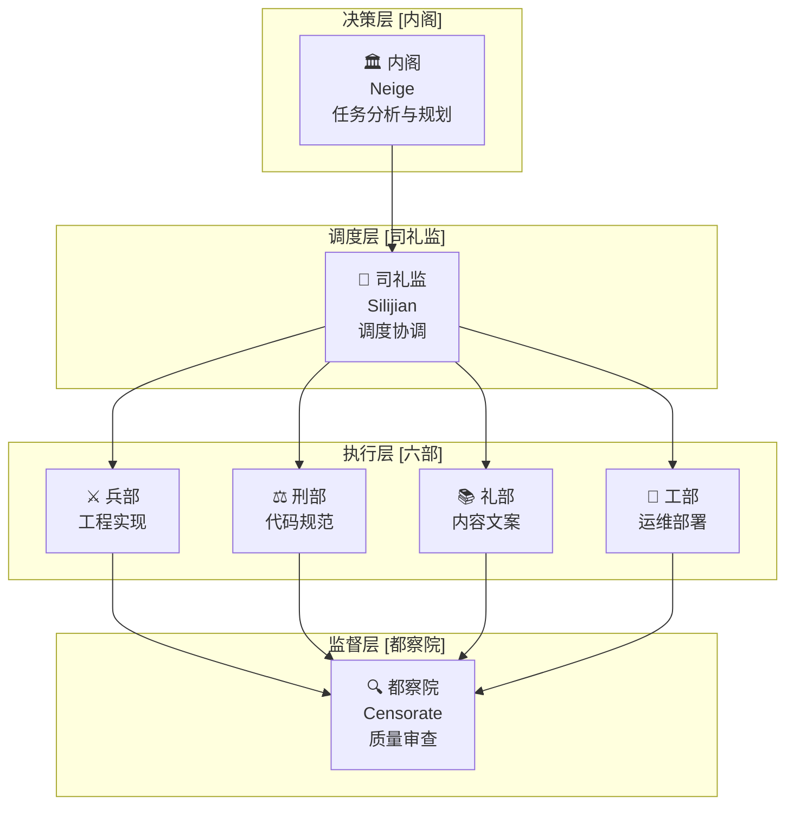
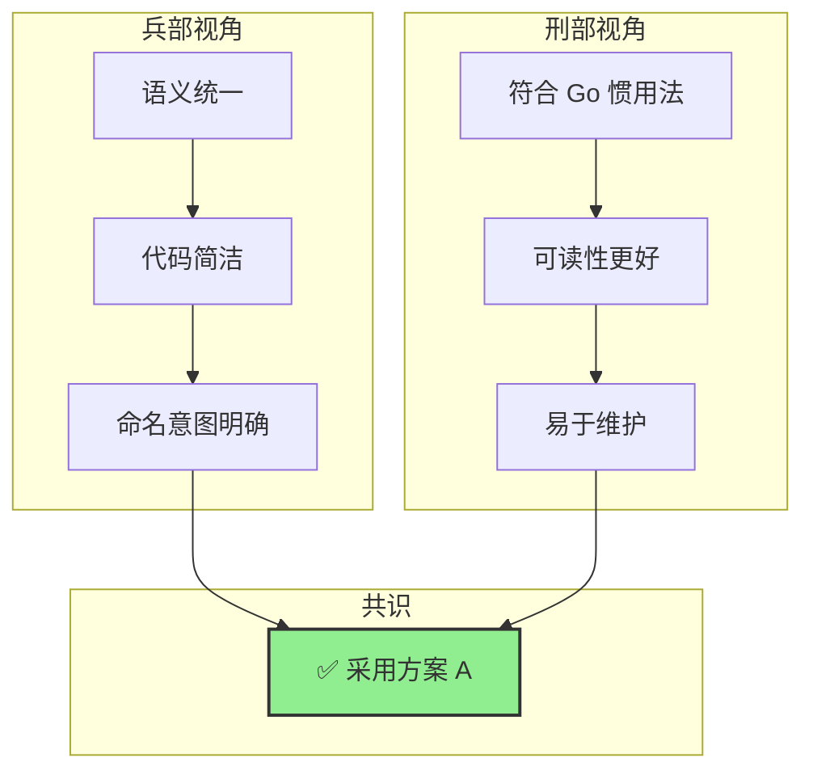
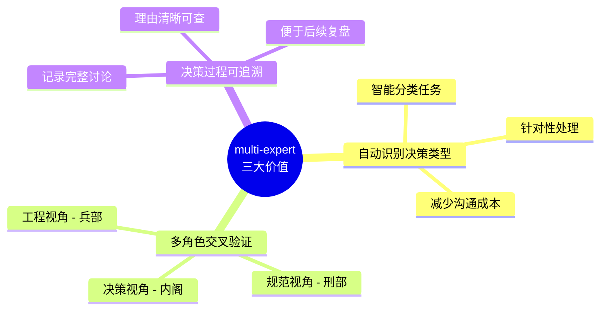

# 当 AI 开始"圆桌讨论"：一次代码决策的新体验

你有没有遇到过这样的情况：面对一段代码的写法，直觉上觉得 A 方案更好，但说不出具体为什么。问同事，大家各执一词；翻资料，众说纷纭。最后只能靠"少数服从多数"或者"谁写的谁决定"来收场。

这不是技术问题，而是 **决策问题** 。

上周我在修改 SDK 项目的连接池代码时，就遇到了这样的困境。但这一次，我尝试了一种全新的方式——让 AI 进行一场"圆桌讨论"。

<!-- more -->

??? note "📑 文章导航"
    本文包含以下内容，点击可快速跳转：

    - [multi-expert 是什么？](#what-is) - 了解这套多 Agent 协作系统
    - [实战案例](#cases) - 两个真实的设计决策案例
    - [为什么有效？](#why-effective) - 解析多视角决策的价值
    - [快速开始](#quick-start) - 如何在自己的项目中使用
    - [总结与展望](#conclusion) - 实践感悟与未来方向

## multi-expert 是什么？ {#what-is}

**multi-expert** 是一个基于明朝内阁制的多 Agent 协作系统。它将任务分发给不同的"部门"（六部），每个部门从自己的专业视角分析问题，最后汇总形成决策。

### 两种协作模式

=== "💬 会议型协作（圆桌讨论）"

    适用于：**复杂逻辑推理、架构决策、风险评估**
    
    多个专家通过多轮讨论逐步收敛到最优方案，类似技术评审会议。
    
    ```mermaid
    flowchart LR
        A[架构专家] --> D[讨论区]
        B[代码专家] --> D
        C[测试专家] --> D
        D --> E{达成共识?}
        E -->|否| D
        E -->|是| F[裁决者]
        F --> G[最终方案]
    ```

=== "👨‍⚕️ 专家型协作（并行分析）"

    适用于：**分析类任务、优化类任务、诊断类任务**
    
    多个专家同时分析同一个问题，各自提供专业意见，最后汇总成完整方案。
    
    ```mermaid
    flowchart LR
        T[任务] --> A[专家A]
        T --> B[专家B]
        T --> C[专家C]
        A --> D[汇总]
        B --> D
        C --> D
        D --> E[最终结果]
    ```

### 三层架构



*图：multi-expert skill 的三层架构*

## 实战案例 {#cases}

我连续遇到了两个设计决策问题，都使用了 multi-expert 进行讨论。以下是完整的实践记录。

### 案例一：错误处理方案选择

#### 问题背景

在 `conn_pool.go` 的 `getNextAvailableClient` 方法中，当所有连接都不可用时需要返回错误。直觉告诉我当前实现（方案 A）更好，但我想验证这个直觉。

#### 方案对比

=== "方案 A：预定义 + 覆盖（✅ 采纳）"

    ```go title="conn_pool.go"
    // 预定义基础错误
    unavailableErr := errors.New("all grpc connections unavailable")
    
    for _, conn := range connections {
        if err := tryConnect(conn); err != nil {
            // 覆盖为具体原因，语义保持一致
            unavailableErr = fmt.Errorf("[nodeAddr:%s] init failed: %s", 
                conn.ID, err)
            continue
        }
        return conn, nil
    }
    
    return nil, unavailableErr
    ```
    
    **核心特点**：`unavailableErr` 始终表示"连接不可用"

=== "方案 B：延迟定义 + 判断（❌ 否决）"

    ```go title="conn_pool.go"
    var lastErr error  // 语义不明确
    
    for _, conn := range connections {
        if err := tryConnect(conn); err != nil {
            lastErr = fmt.Errorf("[nodeAddr:%s] init failed: %s", 
                conn.ID, err)
            continue
        }
        return conn, nil
    }
    
    // 额外的判断分支
    if lastErr != nil {
        return nil, lastErr
    }
    return nil, errors.New("all grpc connections unavailable")
    ```
    
    **核心特点**：`lastErr` 只是临时变量，需要额外判断

#### 执行流程对比

=== "方案 A：预定义错误"

    ```mermaid
    flowchart LR
        A1[预定义错误] --> A2[遍历连接]
        A2 --> A3{连接失败?}
        A3 -->|是| A4[覆盖错误信息]
        A3 -->|否| A5[返回连接]
        A4 --> A2
        A2 --> A6[返回错误]
        
        style A1 fill:#90EE90
        style A6 fill:#90EE90
    ```
    
    **流程特点**：
    
    1. 进入循环前预定义错误
    2. 失败时覆盖错误信息（语义不变）
    3. 循环结束后统一返回

=== "方案 B：延迟定义"

    ```mermaid
    flowchart LR
        B1[延迟定义] --> B2[遍历连接]
        B2 --> B3{连接失败?}
        B3 -->|是| B4[记录错误]
        B3 -->|否| B5[返回连接]
        B4 --> B2
        B2 --> B6{有错误?}
        B6 -->|是| B7[返回记录的错误]
        B6 -->|否| B8[返回新错误]
        
        style B1 fill:#FFB6C1
        style B6 fill:#FFB6C1
    ```
    
    **流程特点**：
    
    1. 初始无错误定义
    2. 失败时记录错误
    3. 返回前需额外判断

#### 圆桌讨论

启动 multi-expert 后，系统自动触发了 **内阁分析**：

```
【任务类型】：代码设计评审
【执行计划】：
1. @兵部 - 从工程实现角度分析
2. @刑部 - 从代码规范角度分析
3. 会议讨论 - 形成最终决策
```

=== "⚔️ 兵部观点（工程视角）"

    1. **语义统一**：`unavailableErr` 始终表示"连接不可用"
    2. **代码更简洁**：少一个 `if lastErr != nil` 判断
    3. **变量命名更有意图**：`unavailableErr` vs `lastErr`

=== "⚖️ 刑部观点（规范视角）"

    1. **一致性**：符合 Go 标准库错误处理惯用法
    2. **可读性**：一行赋值覆盖，无需跳转视线
    3. **错误链**：更易于使用 `errors.Is()` 判断

#### 最终决策



!!! success "决策理由"
    1. **语义清晰**：变量名准确表达了错误的本质
    2. **代码简洁**：符合 Go "少即是多" 的哲学
    3. **符合惯用法**：与 Go 标准库的错误处理风格一致
    4. **多视角验证**：工程和规范双重确认

---

### 案例二：防御性编程的边界判断

#### 问题背景

在审查 `getNextAvailableClient` 方法时，注意到开头有这样一个判断：

```go title="conn_pool.go"
func (pool *ClientConnectionPool) getNextAvailableClient(...) {
    connLen := len(pool.connections)
    if connLen == 0 {
        return nil, -1, errors.New("no connections available")
    }
    // ...
}
```

**核心疑问**：为什么这个空连接列表的判断不放在调用方，而是在方法内部判断？

#### 方案对比

=== "方案 A：方法内部判断（✅ 采纳）"

    ```go
    func getNextAvailableClient(...) {
        if len(pool.connections) == 0 {
            return nil, -1, errors.New("no connections available")
        }
        // ... 查找逻辑
    }
    
    // 调用方 - 简洁，无需预处理
    func getClientOnce(...) {
        cli, idx, err := getNextAvailableClient(...)
        // ...
    }
    ```
    
    **核心特点**：方法自给自足，调用方无需关心边界条件

=== "方案 B：调用方判断（❌ 否决）"

    ```go
    func getNextAvailableClient(...) {
        // 假设调用方已经确保 connLen > 0
        // ... 直接执行查找逻辑
    }
    
    // 调用方 - 需要预处理
    func getClientOnce(...) {
        if len(pool.connections) == 0 {  // 边界判断放在这里
            return nil, errors.New("no connections available")
        }
        cli, idx, err := getNextAvailableClient(...)
        // ...
    }
    ```
    
    **核心特点**：职责分离，但依赖调用方的正确性

#### 圆桌讨论

=== "⚔️ 兵部观点（工程视角）"

    1. **自给自足原则**：方法不依赖调用方的预处理
    2. **避免重复判断**：如果放到外面，每个调用方都要判断
    3. **性能无差异**：`len()` 是 O(1) 操作

=== "⚖️ 刑部观点（规范视角）"

    | 维度 | 内部判断 | 外部判断 |
    |------|---------|---------|
    | **安全性** | ✅ 方法自我防护 | ❌ 依赖调用方 |
    | **可维护性** | ✅ 修改只在一处 | ❌ 多处同步 |
    | **可复用性** | ✅ 任意调用 | ❌ 必须先检查 |
    | **DRY原则** | ✅ 不重复 | ❌ 可能重复 |
    
    **关键风险**：如果放到外面，未来新增调用方可能忘记判断，导致 panic

#### 最终决策

!!! success "决策理由"
    1. **自给自足**：调用方无需预处理，降低耦合
    2. **防御性编程**：防止调用方遗漏检查，fail fast
    3. **DRY原则**：避免多处重复相同判断
    4. **可维护性**：边界条件修改只需在一处
    5. **性能无影响**：空切片判断开销极小

---

### 两个案例的对比

| 案例 | 问题类型 | 核心考量 | 决策依据 |
|------|---------|---------|---------|
| **案例一** | 错误处理方式 | 语义清晰性 | 代码简洁 + 符合惯用法 |
| **案例二** | 边界判断位置 | 防御性编程 | 自给自足 + DRY原则 |

!!! tip "共同模式"
    两个案例都遵循相同模式：**将边界条件和错误处理放在最内层（数据操作处）**，而不是依赖调用方的预处理。这使得方法更加独立、健壮、易于维护。

## 为什么有效？ {#why-effective}



### 价值一：自动识别决策类型

内阁能够自动判断这是"代码设计评审"任务，而不是普通的问答。这种智能分类让后续的处理更有针对性。

### 价值二：多角色交叉验证

- **兵部** 给我工程视角：代码好不好写、好不好维护
- **刑部** 给我规范视角：是否符合社区惯例、是否易于理解
- **内阁** 帮我整合：在什么场景下哪种方案更优

每个角色都带来了单一视角无法覆盖的洞察，最终决策更加全面可靠。

### 价值三：决策过程可追溯

整个讨论过程都被记录下来。我可以清楚地看到：

- 为什么这样决策？
- 各个角色的理由是什么？
- 有没有遗漏的考虑因素？

这种可追溯性对于团队决策尤为重要。当半年后有人质疑这段代码时，我可以拿出这份"会议纪要"。

## 快速开始 {#quick-start}

### 基本用法

在你的项目中使用 multi-expert skill：

```bash
/multi-expert 你的问题或任务描述
```

### 适用场景

| 场景类型 | 示例 |
|---------|------|
| 代码设计评审 | `/multi-expert 讨论这个函数的错误处理方式` |
| 架构决策 | `/multi-expert 选择使用缓存还是直接查询` |
| 代码重构 | `/multi-expert 重构这段代码，提高可读性` |
| 问题诊断 | `/multi-expert 分析这个性能瓶颈的原因` |

### 最佳实践

!!! tip "获得更好结果的建议"
    1. **提供上下文**：说明代码位置、功能背景
    2. **明确问题**：指出具体的设计抉择点
    3. **给出选项**：如果有倾向的方案，一并说明
    4. **追问细节**：对不理解的结论可以继续提问

## 总结与展望 {#conclusion}

### 实践感悟

这次实践让我对 multi-expert skill 有了更深的理解。它不仅仅是一个"更聪明的 AI"，而是一个 **结构化的决策框架** 。

当我面对代码决策困境时，不再需要独自纠结，而是可以借助多角色的力量，从多个维度审视问题：

- 兵部给我 **工程视角**
- 刑部给我 **规范视角**  
- 内阁帮我做出 **最终裁决**

### 未来方向

如果代码评审可以这样做，那架构设计呢？技术选型呢？甚至团队管理决策呢？

multi-expert 本质上是在模拟 **"把问题抛给不同领域的专家"** 这个过程。它不是在替我们做决策，而是在帮助我们 **做出更好的决策** 。

这或许就是下一代 AI 辅助开发的方向：从"告诉 AI 我要什么，AI 给我结果"，变成 **"和 AI 一起讨论，共同找到最优解"** 。

---

!!! tip "关于 multi-expert skill"
    multi-expert skill 基于明朝内阁制架构设计，支持 **会议型协作** （圆桌讨论）和 **专家型协作** （并行分析）两种模式。
    
    如果你对这套系统感兴趣，欢迎在评论区留言交流！
