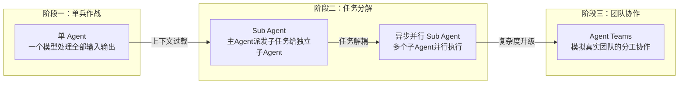
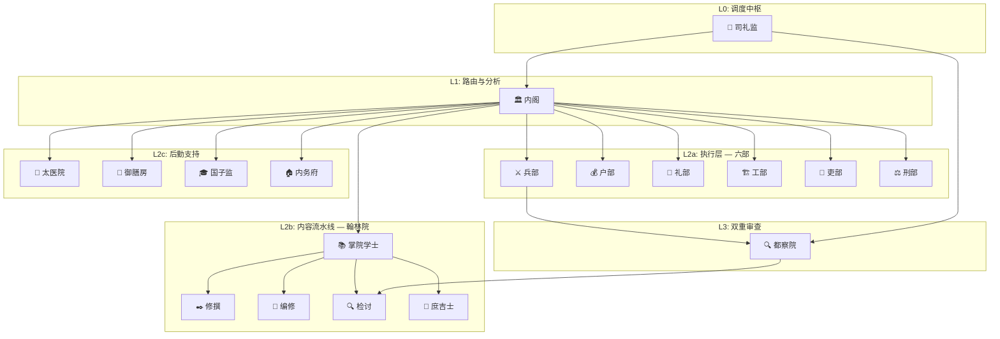
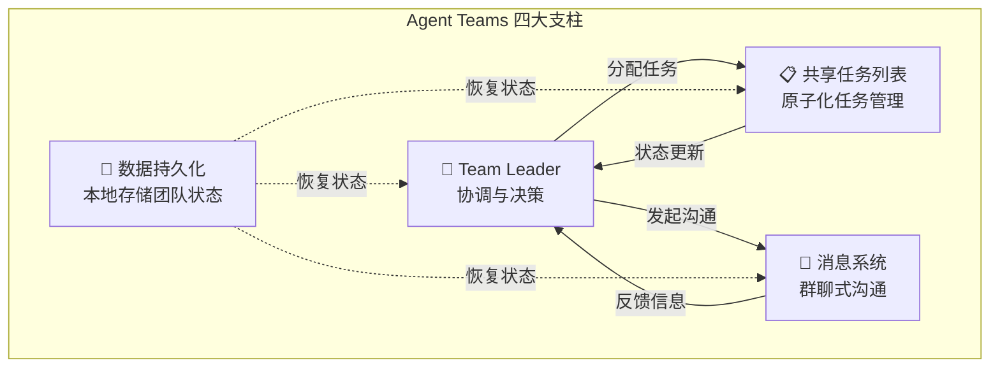
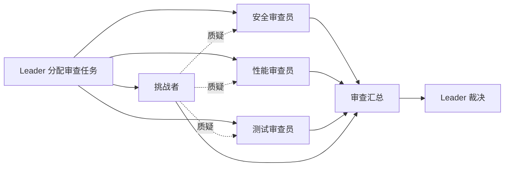
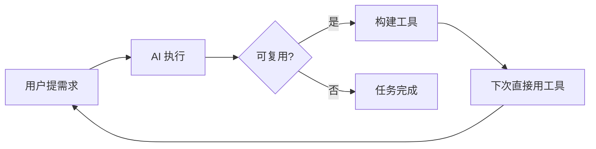
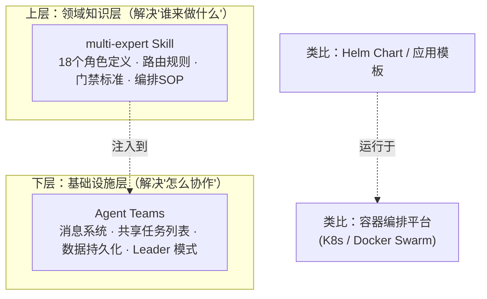

# 多智能体协同：从理论到工程的完整实战指南

> **作者**：Cloaks ｜ yiiewang

<!-- more -->

## 一、为什么需要多智能体协同

### 1.1 Agent 能力的演进之路

理解多智能体协同的价值，首先要回顾 AI Agent 能力的演进路径——每一步的核心驱动力都是同一个矛盾：**模型能力有限 vs 任务复杂度不断增长**。



| 阶段 | 核心机制 | 解决的问题 | 局限性 |
|------|---------|-----------|--------|
| **单 Agent** | 一个模型处理全部 I/O | 简单任务的快速响应 | 上下文过长导致信息丢失、响应质量下降 |
| **Sub Agent** | 主 Agent 将子任务派发给独立子 Agent | 上下文过载问题 | 子 Agent 之间缺乏协调 |
| **异步并行 Sub Agent** | 多个子 Agent 并行执行独立任务 | 吞吐量和效率提升 | 协作模式仍较原始 |
| **Agent Teams / multi-expert** | 结构化的团队分工与协作机制 | 不确定性高、复杂度大的任务 | 协调开销增加，设计复杂度高 |

### 1.2 单一 AI 的三大局限

!!! warning "单一 AI 在复杂任务中的天花板"

#### 局限一：知识广度 vs 深度难以兼顾

现代 AI 虽然拥有海量知识，但注意力机制会让它倾向于"泛化"而非"深入"。当你问"如何优化数据库查询"时，AI 可能给出 10 个方面的建议，但每个都说得不够深入——就像一个全科医生什么都能看，但在心外科手术上肯定不如专科医生。

#### 局限二：上下文记忆有限

面对复杂任务，AI 需要记住大量上下文信息，但长文本处理能力仍然有边界。**任务越复杂，AI 越容易遗忘之前的讨论细节**，导致前后矛盾或遗漏关键约束。

#### 局限三：决策视角单一

单一 AI 往往从一个默认角度分析问题，容易陷入思维定式。就像让一个人"找代码缺陷"，他可能只能找到自己熟悉领域的问题，安全漏洞或性能隐患可能完全被忽略。

### 1.3 多智能体协同的核心优势

!!! tip "从独行侠到医疗团队"

这让我想起一个经典类比：**就像从独行侠变成了医疗团队**——以前是一个全科医生什么都看，现在是心内科、神经科、骨科专家联合会诊，每个专家专注自己的领域，最终给出更精准的诊断和治疗方案。

| 优势 | 说明 | 对应解决的单AI局限 |
|------|------|-------------------|
| **专业化分工** | 每个 Agent 只负责自己的专业领域 | 知识广度 vs 深度 |
| **多角度审视** | 多个 Agent 从不同维度分析同一问题 | 决策视角单一 |
| **迭代优化** | 通过讨论和反馈不断打磨方案 | 缺乏自我修正能力 |

### 1.4 效果数据：量化的价值证明

我们在多个场景中验证了多智能体协同的效果：

| 维度 | 单一 AI | 多专家协同 | 提升 |
|------|---------|-----------|------|
| **任务完成率** | ~60% | 90%+ | **50% ↑** |
| **平均耗时** | 基准线 | 30% | **70% ↓** |
| **代码质量** | 中等 | 优秀 | **显著 ↑** |
| **重复问题率** | 较高 | 很低 | **80% ↓** |
| **Code Review 首次通过率** | ~50% | 85%+ | **35 pp ↑** |

!!! summary "关键洞察"

    - 📈 **完成率提升 50%**：多个专家互相补充覆盖面，大大降低任务失败风险
    - ⚡ **耗时减少 70%**：专业化分工让每个环节都由最合适的角色执行
    - ✨ **质量显著提升**：多角度审视让方案更全面，盲区大幅减少

---

## 二、协作模式的理论图谱

在深入具体实现之前，我们先建立统一的**协作模式分类体系**。根据任务的依赖关系和目标特点，多智能体协作可以归纳为四种核心模式。

### 2.1 四种核心模式速览

| 模式 | 核心机制 | 类比 | 适用场景 |
|------|---------|------|---------|
| **🔄 并行竞赛** | 多个 Agent 同时独立产出 → Arbiter 选最优 | 设计竞标 | 技术选型、方案对比、风险评估 |
| **➡️ 串行接力** | Agent A 完成 → 基于 A 结果 → Agent B 继续 | 流水线作业 | 规划→开发→部署等强依赖链路 |
| **💬 会议型** | 多轮圆桌辩论 → 逐步收敛共识 → 裁决 | 架构评审会 | 有争议的架构决策、方案评审 |
| **👑 主从协作** | 主 Agent 提出需求 → 子 Agent 分头采集 → 主 Agent 整合 | 导演与剧组 | 分析报告、需要大量素材的任务 |

### 2.2 模式选择决策树

```
任务是否需要多方案对比？（高风险决策 / 技术选型 / 架构选型）
├─ 是 ──→ 🔄 并行竞赛模式
│           多个专家独立产出 → Arbiter 多维评分 → 最优方案胜出
│           关键：专家间互不可见（避免锚定效应）
│
└─ 否 ──→ 子任务之间是否有强依赖？
            ├─ 是 ──→ ➡️ 串行接力模式
            │           上一步输出是下一步输入，每步设质量门控
            │
            └─ 否 ──→ 是否需要讨论才能收敛？
                       ├─ 是 ──→ 💬 会议型模式
                       │           多轮聚焦辩论，逐步达成共识
                       │
                       └─ 否 ──→ 👑 主从协作模式
                                   一个大脑指挥，多个手执行
```

### 2.3 各模式详解

=== "🔄 并行竞赛模式"

    ```mermaid
    flowchart LR
        T[用户任务] --> A[Agent A → 方案A]
        T --> B[Agent B → 方案B]
        T --> C[Agent C → 方案C]
        A --> ARB[Arbiter 对比评选]
        B --> ARB
        C --> ARB
        ARB --> R[最优方案 或 综合方案]
    ```

    **关键规则**：
    - 专家之间**互相看不到结果**（避免锚定效应）
    - Arbiter 从多维度加权评分（典型权重：正确性 30% + 可行性 25% + 性能 20% + 可维护性 15% + 安全性 10%）
    - 低于阈值直接淘汰；最高分接近时触发额外深度审查

    **典型场景**："API 网关技术栈选型"——三个专家分别基于 Kong / Envoy / APISIX 出方案，Arbiter 从成熟度、性能、社区、运维成本等维度评选。

=== "➡️ 串行接力模式"

    ```
    Agent A(规划) → 通过 → Agent B(开发) → 通过 → Agent C(部署) → 通过 → ...
    ```

    **关键规则**：
    - 同一时间只有一个活跃 Agent
    - 每步必须通过质量门控才能进入下一步
    - 任一步被打回只重做该步骤，不影响已完成步骤

    **典型场景**：新微服务上线——吏部(计划) → 兵部(开发) → 工部(Dockerfile+K8s) → 刑部(安全审查) → 双重审查。

=== "💬 会议型模式"

    **关键规则**：
    - 每轮聚焦**一个分歧点**
    - 发言格式：立场 + 论据 + 风险承认 + 建议
    - 设最大轮次限制（如 5 轮），超限强制裁决
    - 三种裁决方式可选：共识裁决 / 加权投票 / 首席裁决

    **典型场景**："是否从 Monolith 迁移到 Microservices？"——第 1 轮各方陈述立场 → 第 2 轮聚焦分歧点 → 第 3 轮收敛共识。

=== "👑 主从协作模式"

    ```
    主 Agent 定义数据需求 → 子 Agent 分头采集/执行 → 主 Agent 整合产出最终结果
    ```

    **典型场景**：性能趋势分析——户部(主)需要性能指标 + 代码变更记录 + 部署记录 → 太医院/庶吉士/内务府分头收集 → 户部整合为完整报告。

=== "🔥 融合模式（组合使用）"

    复杂任务往往不是单一模式能解决的，需要按阶段组合多种模式：

    **编排示例**："高并发下频繁超时排查"
    
    - **阶段 1 并行诊断**（并行竞赛式）：太医院(profiling) + 兵部(代码热点) + 户部(趋势数据) + 庶吉士(近期变更)
    - **阶段 2 会议讨论**（会议式）：基于诊断结果讨论根因，达成修复共识
    - **阶段 3 串行修复**（串行式）：兵部修复代码 → 工部调整配置 → 御膳房检查依赖
    - **阶段 4 双重审查**：都察院 + 检讨
    - **阶段 5 汇总**：司礼监整合 + 太医院输出前后对比体检报告

---

## 三、实战案例 A：multi-expert Skill 工程深度解析

> 理论有了，模式也清楚了。现在我们来看第一套完整的落地实现——**multi-expert skill**，一套模拟明朝内阁制的自定义多专家协作系统。

### 3.1 四层架构总览

multi-expert 采用 **明朝内阁制** 作为组织隐喻，将整个协作系统划分为四个层次：



**核心设计哲学**：全部由 AI 驱动，不依赖外部脚本。路由判断、状态管理、评分审查、格式化输出都基于规则文件由 AI 自主完成。

### 3.2 十八角色全景图

#### 核心六部（执行层）

| 角色 | 编码场景专长 | 一句话定位 | 触发条件 |
|------|-------------|-----------|---------|
| ⚔️ **兵部** | 代码开发、技术方案、问题排查 | 前线作战部队 | `code_dev` / `debug_perf` 默认主专家 |
| 💰 **户部** | 数据分析、性能基准、资源评估 | 户籍钱粮统计官 | `data_analysis` 主专家；自动辅助 perf 任务 |
| 📜 **礼部** | 文档撰写、README、宣传文案 | 外交文书起草人 | `content_writing` 主专家；自动辅助代码任务出文档 |
| 🏗️ **工部** | CI/CD 流水线、Docker/K8s 配置 | 基础设施建设者 | `deploy_ops` / `architecture` 主专家 |
| 👔 **吏部** | 项目规划、任务拆分、WBS、排期 | 人事调度管理者 | `project_plan` 主专家；自动辅助复杂任务拆分 |
| ⚖️ **刑部** | 合规审查、License 审查、安全风险扫描 | 纪律监察御史 | 安全合规维度；自动辅助部署和架构任务 |

#### 翰林院体系（内容生产流水线）

| 角色 | 职责 | 与六部的区别 |
|------|------|------------|
| 📚 **掌院学士** | 大规模内容生产的统筹与终审 | 内容类任务的「吏部」——负责拆解+协调 |
| ✒️ **修撰** | 架构设计、模块划分、接口定义 | 「设计稿」产出者——兵部写代码前先出设计 |
| 📝 **编修** | 基于设计逐模块编写代码或文档 | 「填充工」——偏批量规范化产出 |
| 🔍 **检讨** | 第二道门禁的深度审核（逻辑/一致性/边界） | 都察院查技术正确性，检讨查完备性 |
| 🔎 **庶吉士** | 纯信息检索角色，不修改任何文件 | 「图书馆员」——被任何角色召唤来搜资料 |

#### 后勤四部门（按需触发）

| 角色 | 触发场景 | 输出物 |
|------|---------|--------|
| 🏥 **太医院** | 关键词含"慢/卡/内存/泄漏/崩溃"；debug_perf 任务 | 诊断报告：症状→诊断→处方→预防 |
| 🍱 **御膳房** | 涉及 package.json/go.mod/Cargo.toml 变更 | 依赖分析：冲突/过时/冗余项 + 操作建议 |
| 🎓 **国子监** | 涉及公共 API 变更；文档类任务 | API 文档 + 注释补全 + ADR 决策记录 |
| 🏠 **内务府** | deploy_ops 任务；配置文件变更 | 环境就绪检查 + 配置差异 + 影响范围梳理 |

#### 角色协作矩阵

实际使用时，不同任务类型自动组合不同的角色：

| 场景 | 主专家 | 辅助专家 | 支持专家 | Arbiter |
|------|--------|---------|---------|---------|
| 功能开发 | 兵部 | 都察院 | — | 内阁 |
| Bug 排查 | 太医院 + 兵部 | 都察院 + 户部 | 庶吉士 | 司礼监 |
| 性能优化 | 太医院 | 兵部 + 户部 | 御膳房 | 都察院 |
| 架构设计 | 兵部 + 工部 | 内阁(审议) + 刑部 | 庶吉士 | 内阁 |
| 部署上线 | 工部 | 刑部 + 太医院 | 内务府 + 御膳房 | 都察院 |
| 代码审查 | 都察院 + 检讨 | 相关领域专家 | 庶吉士 | 内阁 |

### 3.3 协作模式的工程落地

上一节我们定义了四种协作模式的理论框架。在 multi-expert 中，这些模式是如何被路由和编排的呢？

系统的路由层（内阁）会根据任务特点自动选择协作模式，然后由司礼监负责具体的编排执行。

#### 路由层：意图分类与置信度评估

路由是系统的"大脑"。它不是简单的关键词匹配，而是 **意图分类 → 置信度评估 → 降级策略** 的完整链路。

**八大意图分类**：

| 意图 | 关键词特征 | 默认主专家 | 推荐模式 |
|------|-----------|-----------|---------|
| `code_dev` | 写代码、实现、开发、新增功能 | 兵部 | 串行接力 |
| `debug_perf` | bug、报错、慢、卡顿、泄漏、崩溃 | 太医院 + 兵部 | 融合模式 |
| `data_analysis` | 数据处理、报表、统计、基准测试 | 户部 | 主从协作 |
| `content_writing` | 文档、README、注释、文案 | 礼部 / 翰林院·编修 | 串行接力 |
| `architecture` | 选型、架构、设计方案、重构 | 兵部 + 工部 | 并行竞赛 |
| `deploy_ops` | 部署、CI/CD、Docker、K8s | 工部 | 串行接力 |
| `project_plan` | 排期、计划、拆分、WBS、里程碑 | 吏部 | 主从协作 |
| `review` | Review、审查、评审 | 都察院 + 检讨 | 并行竞赛 |

**置信度三级判定**：

!!! example "置信度判定示例"

    **高确定性（≥ 0.9）**：直接确定意图类型并路由
    - "帮我实现一个用户认证模块" → `code_dev`, confidence = **0.95**
    - "系统内存占用持续增长" → `debug_perf`, confidence = **0.92**

    **中确定性（0.7 ~ 0.9）**：结合上下文判断
    - "优化一下这个服务" → 可能是代码优化 or 性能优化，confidence = **0.78**

    **低确定性（< 0.7）**：**禁止猜测，必须追问**
    - "帮我做一个东西" → confidence = **0.55**, 进入追问模式

当置信度不足时，系统每次只问一个问题，直到 confidence ≥ 0.8 才继续执行。

**降级策略**：每条路由决策包含四级降级方案——更换同领域专家 → 切换协作模式 → 扩大专家范围 → 降低任务粒度拆分子任务。

#### 黑板协议：无外部依赖的状态管理

黑板是多专家协作的**共享记忆机制**。它不是 Redis 或数据库，而是 AI 在对话上下文中维护的一个结构化数据对象：

```yaml
blackboard:
  # 元信息
  task_id: "task-20260319-001"
  current_phase: "expert_execution"
  collaboration_mode: "hybrid"

  # 用户需求（内阁写入，只读）
  user_requirement: "系统在高并发下频繁超时"
  refined_requirement: "排查P99延迟从150ms升至2100ms的根因并修复"

  # 路由决策（内阁写入，只读）
  routing_decision:
    task_type: debug_perf
    confidence: 0.88
    primary_experts: [taiyiyuan, bingbu]

  # 专家成果区（各专家写自己的条目）
  expert_results:
    taiyiyuan:
      status: done
      output: { "diagnosis": "连接池耗尽+N+1查询" }
    bingbu:
      status: done
      output: { "fix_code": "..." }
    hubu:
      status: running

  # 审查记录（追加式写入）
  review_history:
    - stage: duchayuan_first
      verdict: suggest_reject
      issues: ["并发安全问题"]
      retry_count: 1

  # 状态控制
  retry_count: 0
  max_retry: 3
  pending_fixes: []
```

**读写权限矩阵**：

| 角色 | 读权限 | 写权限 |
|------|-------|--------|
| 📜 司礼监 | 全部 | 元信息 / expert_results / review_history / 状态控制 |
| 🏛️ 内阁 | user_requirement | routing_decision / refined_requirement |
| 各执行专家 | 需求 + 路由决策 | 仅自己的 expert_results 条目 |
| ⚖️ 都察院 | 全部 expert_results | 自己的 review_history 条目 |
| 🔍 检讨 | 全部 expert_results + 都察院审查记录 | 自己的 review_history 条目 |

**事件驱动机制**：

| 事件 | 触发条件 | 系统动作 |
|------|---------|---------|
| `routing_done` | 内阁完成路由 | 司礼监开始准备任务分发 |
| `expert_done` | 某专家完成 | 结果写入黑板，通知下一环节 |
| `expert_rejected` | 审查未通过 | 问题 + 原结果发回专家，retry_count++ |
| `retry_exhausted` | 重试 ≥ 3 次 | 升级为会议型讨论或请用户裁决 |

### 3.4 双重质量门禁

这是 multi-expert 区别于普通多 Agent 协作的核心差异点——**两道独立的质量审查**。

#### 第一道门禁：🔍 都察院 —— 技术审查

| 审查维度 | 检查要点 | 典型问题示例 |
|---------|---------|------------|
| 正确性 | 逻辑错误、边界处理、异常路径覆盖 | `counter++` 非原子操作导致并发计数丢失 |
| 安全性 | 漏洞风险、注入、敏感信息泄露 | 日志打印用户密码明文 |
| 性能 | 效率反模式、资源泄漏、N+1 查询 | 循环内重复查数据库 |
| 规范 | 命名风格、注释完整性、编码约定 | 公开函数缺少 godoc 注释 |

**三级输出**：通过（进入下一道） / 建议修改（带建议通过） / 必须修改（打回重做）

#### 第二道门禁：🔍 翰林院·检讨 —— 深度审核

检讨的视角与都察院**完全互补**——都察院查技术正确性，检讨查完备性：

| 审查维度 | 说明 | 示例 |
|---------|------|------|
| 逻辑完整性 | 是否覆盖所有分支和边界 case | 缺少 nil/空值处理 |
| 一致性 | 接口约定与实现是否一致 | 定义了 `GetUser(id)` 但返回 `[]User` |
| 可维护性 | 代码可读性和扩展性 | 一个函数 200 行，职责不清 |
| 需求符合度 | 是否真正解决了原始问题 | 用户要"导出 Excel"，却实现了 CSV |

**打回重做循环**：

```
任一道门禁判定为 ❌必须修改 时：
  ① 审查结论写入 blackboard.review_history
  ② 问题清单 + 原结果发回对应专家
  ③ 专家针对性修复后重新提交
  ④ 重新执行对应门禁审查
  ⑤ retry_count++
  ⑥ retry_count 达到上限(3次) → 升级会议型讨论 或 请用户裁决
```

!!! warning "防死锁设计"

    三层保护确保不会无限循环：
    - 单专家最大重试 **3 次**
    - 会议型最多 **5 轮** 讨论
    - 最终升级到人工裁决

### 3.5 全 AI 驱动的设计哲学

这是 multi-expert 最独特的设计选择：**整个系统没有任何外部脚本，全部由 AI 基于规则文件自主驱动**。

| 方案 | 优点 | 缺点 |
|------|------|------|
| Python/JS 脚本驱动 | 执行精确可控 | 维护成本高、灵活性差、难适配新场景 |
| **AI 基于规则文件驱动** | 高度灵活、可解释性强、易扩展 | 依赖 AI 能力、输出有随机性 |

选择后者的三个理由：
1. **灵活性优先**：AI 可以理解规则的"精神"而非死板执行，比如安全性审查能发现新的漏洞模式
2. **零运维成本**：不需要维护运行时代码，规则文件本身就是文档，改规则就是改行为
3. **可解释性好**：每一步都有据可查，用户可以查看路由决策、审查报告、黑板状态来理解全过程

**行为定制方式**——系统的行为完全由规则文件控制：

| 文件 | 控制什么 | 修改影响 |
|------|---------|---------|
| `rules/intent-rules.yaml` | 意图 → 专家映射 | 改变任务的路由去向 |
| `rules/scoring-rules.yaml` | 评分维度和权重 | 改变并行竞赛时的评选标准 |
| `rules/technical-review.yaml` | 都察院审查规则集 | 改变第一道门禁的严格程度 |
| `rules/deep-review.yaml` | 检讨审核规则集 | 改变第二道门禁的关注重点 |

**扩展性**：新增角色只需两步——在 `expert-catalog.md` 添加 YAML 定义 + 在 `intent-rules.yaml` 映射意图类型，无需改动任何代码。

---

## 四、实战案例 B：CodeBuddy Agent Teams 解析

> 如果说 multi-expert 是一套高度定制化的"专用系统"，那 CodeBuddy Agent Teams 就是一套**平台级的通用框架**。两者代表了两种不同的落地思路。

### 4.1 核心架构：四大支柱

Agent Teams 不是简单的"开多个 Agent 并行跑"，而是一套完整的团队组织框架：



=== "👑 团队领导与成员"

每个 Agent Team 有一个 **Team Leader** 负责整体协调和决策。这与 multi-expert 的「司礼监 → 内阁 → 六部」层级异曲同工。

**关键区别**：
- **multi-expert**：角色预设（兵部、户部...），通过规则文件静态定义
- **Agent Teams**：角色动态创建，Team Leader 按需 spawn 新成员

=== "📋 共享任务列表"

Agent Teams 最关键的工程创新之一——通过原子化的 CRUD 接口管理任务：

| 能力 | 说明 | 解决的问题 |
|------|------|-----------|
| 原子化创建 | 创建独立任务单元 | 任务边界模糊导致的重复工作或遗漏 |
| 增量更新 | 状态实时同步（pending → in_progress → completed） | 成员间信息不一致 |
| 依赖管理 | 任务可声明前置依赖 | 执行顺序混乱 |
| 冲突避免 | 全局唯一 ID + 状态锁 | 多成员同时修改同一任务 |

!!! tip "与黑板协议的对比"

    - **黑板**（multi-expert）：自由格式 JSON，灵活但需自觉遵守读写规范
    - **共享任务列表**（Agent Teams）：强结构 CRUD 接口，约束更强但不那么灵活

=== "💬 消息系统"

支持类似群聊的通信机制，这是 Agent Teams 区别于简单并行调用的核心特征：

| 消息类型 | 用途 | 场景 |
|---------|------|------|
| 定向消息 (`@member`) | 发送给特定成员 | 「@reviewer 请审查这个 PR」 |
| 广播 (`@all`) | 通知全体成员 | 「需求有变更，大家注意」 |
| 关闭请求 (`shutdown_request`) | 请求某成员结束工作 | 「你的部分完成了，可以收尾了」 |

!!! example "消息系统的价值"

    在不确定任务执行过程中，成员可以通过消息及时反馈调整方向——发现需求不清晰立刻广播询问、完成自己部分后通知 Leader 分配下一阶段、遇到阻塞向其他成员求助。这大大降低了试错成本。

=== "💾 数据持久化"

团队配置、任务记录、消息历史持久化存储在本地 `~/.codebuddy/teams/<team_name>/` 目录下。这意味着团队成员能感知到**团队目标和彼此的存在**，不是在真空中工作。

### 4.2 典型实战场景

#### 场景一：并行代码审查（含挑战者角色）



**关键设计**：「挑战者」角色的职责不是审查代码，而是**对其他审查员的结论提出质疑**。如果一个"问题"经不起挑战者的反问，那很可能就是误报。

**效果**：单 Agent 审查准确率 ~60%（大量误报+漏报） → 多维并行 ~85% → 加入挑战者后 ~90%+。

#### 场景二：竞争性假设调试

针对难以复现的复杂 Bug（偶发竞态条件、内存泄漏等），采用「科学辩论」方式：

| 步骤 | 动作 | 特点 |
|------|------|------|
| 1 | 各成员独立分析现象，提出假设 | 同时探索多条假设 |
| 2 | 各自为自己的假设收集证据 | 独立执行，互不干扰 |
| 3 | 圆桌辩论，互相质疑 | 消息系统驱动 |
| 4 | Leader 综合各方结论定位根因 | 裁决而非投票 |
| 5 | 基于根因修复并验证 | 相关成员执行 |

比单一 Agent 线性排查效率高得多——**多条路径并行探索**，而不是一条条试。

#### 场景三：跨层功能端到端交付

将前端 + 后端 + 测试交给一个 Agent Team，通过消息系统和共享任务列表高效协同，避免人与人之间的沟通瓶颈（等接口文档、对齐数据格式、联调排期...）。

### 4.3 已知限制

| 限制 | 影响 | 应对策略 |
|------|------|---------|
| 不支持会话恢复 | 对话中断无法恢复团队状态 | 重要进展及时写入文件持久化 |
| 不支持嵌套团队 | 不能在团队内部再创建子团队 | 合理规划角色职责来规避 |
| 不支持嵌套创建 Agent | 标准 Sub Agent 模式不能递归 spawn | Leader 作为统一入口管理生命周期 |
| 临时性生命周期 | 任务完成后团队释放 | 不适合长期固定团队；每次重新组建 |

---

## 五、效果验证与实践指南

### 5.1 场景化效果数据

!!! info "来自实际项目的量化验证"

=== "🔧 场景 1：架构问题修复"

    | 指标 | 传统方式 | 多专家协同 | 效率提升 |
    |------|---------|-----------|---------|
    | Bug 修复时间 | 2 天 | 0.5 天 | **75% ↑** |
    | 重复问题率 | 30% | <5% | **83% ↓** |

=== "🏗️ 场景 2：大规模代码重构"

    | 指标 | 传统方式 | 多专家协同 | 效率提升 |
    |------|---------|-----------|---------|
    | 重构周期 | 数周 | 数天 | **5~10x ↑** |
    | Bug 引入率 | 较高 | 很低 | **90% ↓** |

    采用蜂群式并行——数十个轻量 Agent 同时工作，各负责一个文件或模块。

=== "⚙️ 场景 3：重复性任务自动化"

    | 指标 | 手动 | 工具化 | 提升 |
    |------|------|--------|------|
    | 回测执行 | 每次手动 | 自动化 | **5x ↑** |
    | 报告生成 | 手动整理 | 自动输出 | **10x ↑** |

### 5.2 工具化：从一次性任务到可复用资产

!!! tip "逆向提示（Reverse Prompting）"

完成一次成功的协作后，关键一步是问自己：**这个流程能否复用？**



**工具化的三层收益**：

| 层次 | 含义 | 价值 |
|------|------|------|
| 🔄 流程固化 | 一次性任务 → 可复用流程 | 避免重复劳动 |
| 📚 知识编码 | 隐性知识 → 显性工具 | 专家经验不再随人走 |
| 👑 能力资产化 | 个人能力 → 团队资产 | 不再依赖特定专家 |

### 5.3 两套方案的对比与选择

#### 本质：层次关系，非替代关系

理解两套方案的关键是意识到它们处于**不同层次**：



| 层 | 职责 | 如果没有这一层 |
|---|------|--------------|
| **Agent Teams（基础设施）** | 多 Agent 怎么通信、状态如何同步、任务怎么分配 | 需要自己造轮子实现消息队列和任务管理 |
| **multi-expert（领域知识）** | 谁来干、按什么流程干、质量怎么把关 | 每次 Leader 都从零摸索——这次记得叫安全审查员，下次忘了 |

**multi-expert 本质上就是把"一个有经验的人类协调者"的领域直觉编码成了可复用的规则集**。让即使是一个"新手 Leader"启动的 Agent Teams，也能自动获得一套经过验证的角色分工和协作流程。

#### 多维度对比

| 维度 | **multi-expert（自定义）** | **Agent Teams（平台级）** |
|------|--------------------------|--------------------------|
| **所处层次** | 领域知识层（应用模板） | 基础设施层（操作系统） |
| **架构风格** | 明朝内阁制隐喻 | 通用团队协作框架 |
| **角色体系** | 18 个预设角色，YAML 声明式定义 | 动态创建，Leader 按需 spawn |
| **路由机制** | 意图分类规则引擎（确定性） | Leader 自主判断（灵活性高） |
| **状态管理** | 黑板协议（自由 JSON） | 共享任务列表（强结构 CRUD） |
| **质量保障** | 双重固定门禁（都察院 + 检讨） | 可组合审查者 + 挑战者角色 |
| **灵活性** | 高（改 YAML 即改行为） | 中（受平台能力约束） |
| **易用性** | 低（需要深度定制一次） | 高（开箱即用） |

#### 选择指南

- 有**明确领域知识体系**和**长期迭代需求** → 用 **multi-expert** 作为领域模板，投入一次持续受益
- 任务类型多变、需要**快速启动** → 直接用 **Agent Teams**
- **最佳实践**：两者组合——**Agent Teams 提供基础设施，multi-expert 注入领域专业知识**。就像 K8s 上跑 Helm Chart，底座和模板各司其职

### 5.4 最佳实践总结

!!! info "来自实战的经验法则"

#### 法则一：任务粒度宜粗不宜细

将**内聚的大功能**作为整体交给团队，而非碎片化为微小任务。任务粒度应匹配**单一职责的内聚边界**，而非机械地按代码行数切分。

#### 法则二：团队规模控制在 5~6 人

2-3 人协作收益不明显；5-6 人是甜点区间（覆盖主要维度，沟通成本可控）；7+ 人后沟通成本指数上升，反而得不偿失。

#### 法则三：约束结果，不约束过程

| 做法 | 效果 |
|------|------|
| ❌ 规定"先写方案 → 再写代码 → 再写测试" | 束缚灵活性，可能错过更好的解题思路 |
| ✅ 定义清晰的验收标准，让团队自行决定如何达成 | 给予充分空间，激发模型最大能力 |

---

## 六、总结与展望

多智能体协同不仅仅是一个技术方案，更是一种 **工程思维的转变**：

- 从 **"如何让单个 AI 更聪明"** → 转向 **"如何让多个 AI 更高效地协作"**
- 从 **"人指挥机器执行"** → 转向 **"人设计协作结构，AI 自主运转"**
- 从 **"一次性解决方案"** → 转向 **"可复用、可演进的工具化流程"**

### 未来方向

!!! info "值得探索的三个方向"

1. 🔬 **自适应协作模式**：根据任务执行过程中的反馈，动态切换协作模式（如从串行切换到会议型），而非启动时就固定下来
2. 🤖 **从历史中学习**：让系统积累历次协作的成功/失败经验，自动优化角色分配和路由策略
3. 🧠 **人机混合团队**：人类作为团队中的一员参与协作，而非仅在起点提需求和终点验收——人在回路中（Human-in-the-loop）

---

> *本文采用多专家协同模式撰写，感谢「内阁」「司礼监」「六部」和「都察院」的协作贡献。*
