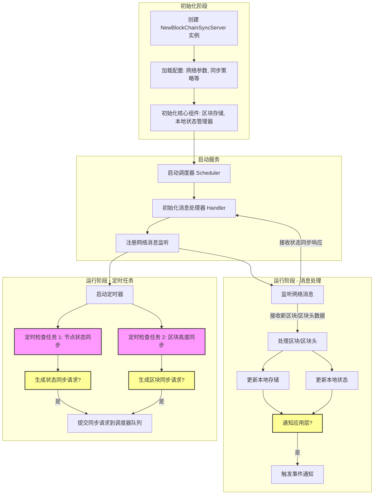

# 长安链 CMC 命令行工具使用指南

CMC（ChainMaker Client）是长安链的官方命令行工具，承担着从链配置查询、合约管理到性能压测的核心职能。日常开发和运维中，几乎每一步操作都离不开它。本文将 CMC 的常用命令按场景分类整理，方便随时查阅。

<!-- more -->

## 链配置管理

长安链支持证书模式和公钥模式两种身份验证方式，链配置查询是最基础的运维操作。

### 查询链配置

=== "证书模式"

    ```bash
    ./cmc client chainconfig query \
      --sdk-conf-path=./testdata/sdk_config.yml
    ```

=== "公钥模式"

    ```bash
    ./cmc client chainconfig query \
      --sdk-conf-path=./testdata/sdk_config_pk.yml
    ```

### 更新区块参数

```bash
./cmc client contract user invoke \
  --contract-name=CHAIN_CONFIG \
  --method=BLOCK_UPDATE \
  --sdk-conf-path=./testdata/sdk_config_pk.yml \
  --params="{\"block_tx_capacity\":\"2000\",\"tx_timestamp_verify\":\"true\",\"tx_timeout\":\"600\",\"block_size\":\"200\",\"block_interval\":\"20\",\"tx_parameter_size\":\"50\"}" \
  --admin-key-file-paths=./testdata/crypto-config/node1/admin/admin1/admin1.key,./testdata/crypto-config/node1/admin/admin2/admin2.key,./testdata/crypto-config/node1/admin/admin3/admin3.key \
  --sync-result=true \
  --result-to-string=true
```

### 共识扩展配置

```bash
# 设置 WAL 写入模式
./cmc client chainconfig consensusextra add \
  --extra-config-key=WAL_write_mode \
  --extra-config-value="2" \
  --sdk-conf-path=./testdata/sdk_config_pk.yml \
  --admin-key-file-paths=./testdata/crypto-config/node1/admin/admin1/admin1.key,./testdata/crypto-config/node1/admin/admin2/admin2.key,./testdata/crypto-config/node1/admin/admin3/admin3.key
```

## 合约管理

### 创建合约

=== "证书模式"

    ```bash
    ./cmc client contract user create \
      --contract-name=fact \
      --runtime-type=DOCKER_GO \
      --byte-code-path=/data/workspace/prod/contracts-go/fact/fact.7z \
      --version=1.0 \
      --sdk-conf-path=./testdata/sdk_config.yml \
      --admin-key-file-paths=./testdata/crypto-config/wx-org1.chainmaker.org/user/admin1/admin1.tls.key,./testdata/crypto-config/wx-org2.chainmaker.org/user/admin1/admin1.tls.key,./testdata/crypto-config/wx-org3.chainmaker.org/user/admin1/admin1.tls.key,./testdata/crypto-config/wx-org4.chainmaker.org/user/admin1/admin1.tls.key \
      --admin-crt-file-paths=./testdata/crypto-config/wx-org1.chainmaker.org/user/admin1/admin1.tls.crt,./testdata/crypto-config/wx-org2.chainmaker.org/user/admin1/admin1.tls.crt,./testdata/crypto-config/wx-org3.chainmaker.org/user/admin1/admin1.tls.crt,./testdata/crypto-config/wx-org4.chainmaker.org/user/admin1/admin1.tls.crt \
      --sync-result=true \
      --params="{}"
    ```

    !!! note "证书模式说明"
        证书模式需要同时提供 `--admin-key-file-paths` 和 `--admin-crt-file-paths`，多个组织的管理员密钥和证书用逗号分隔。

=== "公钥模式"

    ```bash
    ./cmc client contract user create \
      --contract-name=fact \
      --runtime-type=DOCKER_GO \
      --byte-code-path=/data/workspace/prod/contracts-go/fact/fact.7z \
      --version=1.0 \
      --sdk-conf-path=./testdata/sdk_config_pk.yml \
      --admin-key-file-paths=./testdata/crypto-config/node1/admin/admin1/admin1.key \
      --sync-result=true
    ```

    !!! tip "公钥模式简化"
        公钥模式只需提供管理员私钥，无需证书文件，配置更简洁。

## 系统合约操作

系统合约提供了链级别的原生功能，包括获取用户地址、铸币、转账和余额查询。

### 获取用户地址

```bash
./cmc cert userAddr \
  --pubkey-cert-path=./testdata/crypto-config/node2/user/client1/client1.pem \
  --sdk-conf-path=./testdata/sdk_config_pk.yml
```

示例地址：

| 节点 | 地址 |
|------|------|
| node1:client1 | `BmUAa6vKFSu1fP6Zi6FbzP9fZwWwFLjVfoHCc34n87hV` |
| node2:client2 | `8CqhsVoX5symw3H9r723pgXGAkEcDgwvVHc4zzrcUptZ` |

### 铸币操作

=== "用户签名铸币"

    ```bash
    ./cmc client contract system mint \
      --amount=1000000000 \
      --address=BmUAa6vKFSu1fP6Zi6FbzP9fZwWwFLjVfoHCc34n87hV \
      --sdk-conf-path=./testdata/sdk_config_pk.yml \
      --chain-id=chain1 \
      --user-signkey-file-path=./testdata/crypto-config/node1/user/client1/client1.key \
      --sync-result=true
    ```

=== "管理员签名铸币"

    ```bash
    ./cmc client contract system mint \
      --amount=1000000000 \
      --address=BmUAa6vKFSu1fP6Zi6FbzP9fZwWwFLjVfoHCc34n87hV \
      --sdk-conf-path=./testdata/sdk_config_pk.yml \
      --chain-id=chain1 \
      --user-signkey-file-path=./testdata/crypto-config/node1/admin/admin1/admin1.key \
      --sync-result=true
    ```

### 转账操作

```bash
./cmc client contract system transfer \
  --amount=1 \
  --address=8CqhsVoX5symw3H9r723pgXGAkEcDgwvVHc4zzrcUptZ \
  --sdk-conf-path=./testdata/sdk_config_pk.yml \
  --chain-id=chain1 \
  --user-signkey-file-path=./testdata/crypto-config/node1/user/client1/client1.key
```

### 查询余额

```bash
./cmc client contract system balance-of \
  --address=01qhsVoX5symw3H9r723pgXGAkEcDgwvVHc4zzrcUptZ \
  --sdk-conf-path=./testdata/sdk_config_pk.yml \
  --chain-id=chain1 \
  --user-signkey-file-path=./testdata/crypto-config/node1/user/client1/client1.key
```

## 用户合约调用

### DPOS_ERC20 合约

DPOS_ERC20 是长安链的 ERC20 代币合约实现，支持铸币、转账和余额查询。

#### 铸币

```bash
./cmc client contract user invoke \
  --contract-name=DPOS_ERC20 \
  --method=MINT \
  --sdk-conf-path=./testdata/sdk_config_pk.yml \
  --params='{"contract_name":"DPOS_ERC20","shard_num":"2","topic":"topic","to":"00qhsVoX5symw3H9r723pgXGAkEcDgwvVHc4zzrcUptZ","value":"1000000000"}' \
  --admin-key-file-paths=./testdata/crypto-config/node1/admin/admin1/admin1.key,./testdata/crypto-config/node1/admin/admin2/admin2.key,./testdata/crypto-config/node1/admin/admin3/admin3.key \
  --sync-result=true \
  --result-to-string=true
```

#### 转账

```bash
./cmc client contract user invoke \
  --contract-name=DPOS_ERC20 \
  --method=TRANSFER_FROM \
  --sdk-conf-path=./testdata/sdk_config_pk.yml \
  --params='{"contract_name":"DPOS_ERC20","shard_num":"2","topic":"topic","from":"00qhsVoX5symw3H9r723pgXGAkEcDgwvVHc4zzrcUptZ","to":"01qhsVoX5symw3H9r723pgXGAkEcDgwvVHc4zzrcUptZ","value":"1"}' \
  --admin-key-file-paths=./testdata/crypto-config/node1/admin/admin1/admin1.key,./testdata/crypto-config/node1/admin/admin2/admin2.key,./testdata/crypto-config/node1/admin/admin3/admin3.key \
  --sync-result=true \
  --result-to-string=true
```

#### 查询余额

```bash
./cmc client contract user invoke \
  --contract-name=DPOS_ERC20 \
  --method=GET_BALANCEOF \
  --sdk-conf-path=./testdata/sdk_config_pk.yml \
  --params='{"contract_name":"DPOS_ERC20","shard_num":"1","topic":"topic","owner":"0154455354000100000000d238e34df68b973112","to":"01qhsVoX5symw3H9r723pgXGAkEcDgwvVHc4zzrcUptZ","value":"1"}' \
  --admin-key-file-paths=./testdata/crypto-config/node1/admin/admin1/admin1.key,./testdata/crypto-config/node1/admin/admin2/admin2.key,./testdata/crypto-config/node1/admin/admin3/admin3.key \
  --sync-result=true \
  --result-to-string=true
```

### 存证合约（fact）

存证合约用于将文件哈希等信息上链存证。

#### 保存存证

```bash
./cmc client contract user invoke \
  --contract-name=fact \
  --method=save \
  --sdk-conf-path=./testdata/sdk_config_pk.yml \
  --params='{"file_name":"name007","file_hash":"ab3456df5799b87c77e7f88","time":"6543234"}' \
  --sync-result=true
```

#### 查询存证

```bash
./cmc client contract user invoke \
  --contract-name=save_04 \
  --method=findByFileHash \
  --params='{"evidence_type":"test","version":"1.2","file_hash":"aaaaaa","file_name":"bbb","time":"123"}' \
  --sdk-conf-path=./testdata/sdk_config.yml \
  --admin-key-file-paths=./testdata/crypto-config/wx-org1.chainmaker.org/user/admin1/admin1.tls.key,./testdata/crypto-config/wx-org2.chainmaker.org/user/admin1/admin1.tls.key,./testdata/crypto-config/wx-org3.chainmaker.org/user/admin1/admin1.tls.key \
  --admin-crt-file-paths=./testdata/crypto-config/wx-org1.chainmaker.org/user/admin1/admin1.tls.crt,./testdata/crypto-config/wx-org2.chainmaker.org/user/admin1/admin1.tls.crt,./testdata/crypto-config/wx-org3.chainmaker.org/user/admin1/admin1.tls.crt \
  --sync-result=true
```

## 性能压测

### SFC 压测工具

=== "按请求数量"

    ```bash
    ./sfc benchmark \
      --requests 100000 \
      --sdk-conf-path ./testdata/config.yml \
      --tx mintdata
    ```

=== "按时间和并发"

    ```bash
    ./sfc benchmark \
      --duration 600 \
      --concurrency 100 \
      --sleep-time 5 \
      --sdk-conf-path ./testdata/config.yml \
      --tx mintdata
    ```

### 多压力机并行压测

每台压力机处理不同的数据文件，公式 `(n-1)*3+1` 计算起始文件编号：

```bash
# 压力机 1：3 个并行进程
./sfc benchmark --requests 1048575 --sdk-conf-path ./testdata/config.yml --tx mintdata_1
./sfc benchmark --requests 1048575 --sdk-conf-path ./testdata/config.yml --tx mintdata_2
./sfc benchmark --requests 1048575 --sdk-conf-path ./testdata/config.yml --tx mintdata_3
wait

# 压力机 2：3 个并行进程
./sfc benchmark --requests 1048575 --sdk-conf-path ./testdata/config.yml --tx mintdata_4
./sfc benchmark --requests 1048575 --sdk-conf-path ./testdata/config.yml --tx mintdata_5
./sfc benchmark --requests 1048575 --sdk-conf-path ./testdata/config.yml --tx mintdata_6
```

### CMC 内置并行压测

```bash
./cmc parallel invoke \
  --loop-num=1000 \
  --print-time=3 \
  --thread-num=10 \
  --timeout=3600 \
  --sleep-time=1 \
  --climb-time=5 \
  --contract-name=fact \
  --method=save \
  --chain-id=chain1 \
  --org-IDs=wx-org1.chainmaker.org \
  --hosts=127.0.0.1:12301 \
  --tls-host-names=chainmaker.org \
  --use-tls=true \
  --ca-path=./testdata/crypto-config/wx-org1.chainmaker.org/ca \
  --user-keys=./testdata/crypto-config/wx-org1.chainmaker.org/user/client1/client1.tls.key \
  --user-crts=./testdata/crypto-config/wx-org1.chainmaker.org/user/client1/client1.tls.crt \
  --sign-keys=./testdata/crypto-config/wx-org1.chainmaker.org/user/client1/client1.sign.key \
  --sign-crts=./testdata/crypto-config/wx-org1.chainmaker.org/user/client1/client1.sign.crt \
  --pairs-file=/data/workspace/prod/contracts-go/fact/params.json
```

| 参数 | 说明 |
|------|------|
| `--loop-num` | 每线程循环次数 |
| `--thread-num` | 并发线程数 |
| `--climb-time` | 爬坡时间（秒），逐步增加并发 |
| `--pairs-file` | 参数文件路径 |
| `--sleep-time` | 每轮间隔（毫秒） |

### xargs 并行压测

适合快速验证少量交易：

```bash
seq 1 10000 | xargs -I {} -P 10 -n 1 sh -c '
  ./cmc client contract user invoke \
    --contract-name=fact \
    --method=save \
    --sdk-conf-path=./testdata/sdk_config.yml \
    --params="{\"file_name\":\"name-$1\",\"file_hash\":\"ab3456df5799b87c77e7f88-$1\",\"time\":\"6543234\"}" \
    --sync-result=true
' sh {}
```

## 交易数据格式

压测工具使用 JSON 格式定义交易模板。`random` 字段控制是否随机化参数值。

### MINT 交易

```json
{
  "contract_name": "DPOS_ERC20",
  "contract_method": "MINT",
  "tx_type": 0,
  "params": {
    "contract_name": {"data": "DPOS_ERC20", "random": 0},
    "shard_num": {"data": "1", "random": 0},
    "topic": {"data": "topic", "random": 0},
    "to": {"data": "14762327914152", "random": 0},
    "value": {"data": "1000000000", "random": 0}
  }
}
```

### TRANSFER_FROM 交易

```json
{
  "contract_name": "DPOS_ERC20",
  "contract_method": "TRANSFER_FROM",
  "tx_type": 0,
  "params": {
    "contract_name": {"data": "DPOS_ERC20", "random": 0},
    "shard_num": {"data": "1", "random": 0},
    "topic": {"data": "topic", "random": 0},
    "from": {"data": "14762327914152", "random": 0},
    "to": {"data": "14762327914152", "random": 0},
    "value": {"data": "1", "random": 0}
  }
}
```

## 批量测试数据生成

### 分片参数配置

不同分片的参数文件只需修改 `shard_num` 字段：

=== "分片 A"

    ```json
    [
      {"value": "DPOS_ERC20", "key": "contract_name", "unique": true},
      {"value": "a", "key": "shard_num", "unique": true},
      {"value": "topic", "key": "topic", "unique": true},
      {"value": "10000000000000", "key": "to", "unique": true}
    ]
    ```

=== "分片 B"

    ```json
    [
      {"value": "DPOS_ERC20", "key": "contract_name", "unique": true},
      {"value": "b", "key": "shard_num", "unique": true},
      {"value": "topic", "key": "topic", "unique": true},
      {"value": "10000000000000", "key": "to", "unique": true}
    ]
    ```

### Go 参数生成工具

用于批量生成存证合约的随机交易参数文件：

```go title="gen_params.go"
package main

import (
	"crypto/rand"
	"encoding/base64"
	"encoding/json"
	"fmt"
	"log"
	"os"
)

func main() {
	inputJSON := `[
		{"key":"file_name","value":"001","unique":false,"increase":true},
		{"key":"file_hash","value":"ab3456df5799b87c77e7f88","unique":false},
		{"key":"time","value":"6543234","unique":false,"increase":true}
	]`

	var data []map[string]interface{}
	if err := json.Unmarshal([]byte(inputJSON), &data); err != nil {
		log.Fatal("JSON 解析错误:", err)
	}

	// 生成 256 字节随机数据并 Base64 编码
	randomBytes := make([]byte, 1<<8)
	if _, err := rand.Read(randomBytes); err != nil {
		log.Fatal("随机数据生成错误:", err)
	}
	base64Str := base64.StdEncoding.EncodeToString(randomBytes)

	// 更新 file_hash 字段
	for i, item := range data {
		if item["key"] == "file_hash" {
			data[i]["value"] = base64Str
			break
		}
	}

	outputJSON, err := json.Marshal(data)
	if err != nil {
		log.Fatal("JSON 序列化错误:", err)
	}

	if err := os.WriteFile("/data/workspace/prod/contracts-go/fact/params.json", outputJSON, 0644); err != nil {
		fmt.Println(err)
	}
}
```

## 链上数据查询

### 查询区块

```bash
# 按高度查询（证书模式）
./cmc query block-by-height 5748 --chain-id=chain1 \
  --sdk-conf-path=./testdata/sdk_config.yml

# 按高度查询（公钥模式）
./cmc query block-by-height 1122 --chain-id=chain1 \
  --sdk-conf-path=./testdata/sdk_config_pk.yml
```

### 查询交易

```bash
./cmc query tx chain1_f2d4ac387116407005584a5cee380145f2d4ac387116407005584a5_0 \
  --sdk-conf-path=./testdata/sdk_config_pk.yml
```

### 查询交易池

```bash
./cmc txpool status --sdk-conf-path ./testdata/sdk_config.yml
./cmc txpool status --sdk-conf-path ./testdata/sdk_config_pk.yml
```

### 共识流程追踪

追踪指定区块的完整共识过程：

```bash
grep "attempt enterNewRound to (7787/0)\
  \|(7787/0/PROPOSE) receive prevote\
  \|(7787/0/PROPOSE) receive proposal\
  \|simulate with dag finished, block 7787\
  \|7787/0/PRECOMMIT) consensus save wal\
  \|commit block \[7787\]" system.log
```

## Helper 工具

### 数据备份

```bash
./helper store backup \
  -c=../config/wx-org1.chainmaker.org/chainmaker.yml \
  --chain-id=chain1 \
  --path=../backup/bak-1 \
  --start-height=-1 \
  --end-height=-1
```

!!! tip "参数说明"
    `--start-height=-1 --end-height=-1` 表示备份全量数据。

## 开发辅助

### 单元测试与覆盖率

```bash
# 生成覆盖率报告
go test -coverprofile=coverage.out && go tool cover -html=coverage.out -o coverage.html

# 全模块覆盖率
go test -coverprofile=coverage.out ./...

# 查看函数级覆盖率
go tool cover -func=coverage.out
```

### 代码行数统计

```bash
gocloc --include-lang=Go --output-type=json --not-match=".*_test\.go" .
```

## 附录：区块链同步服务流程


