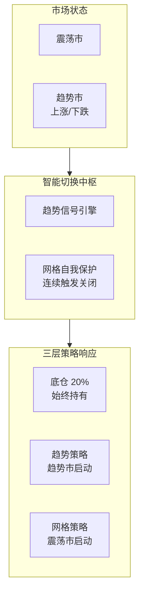
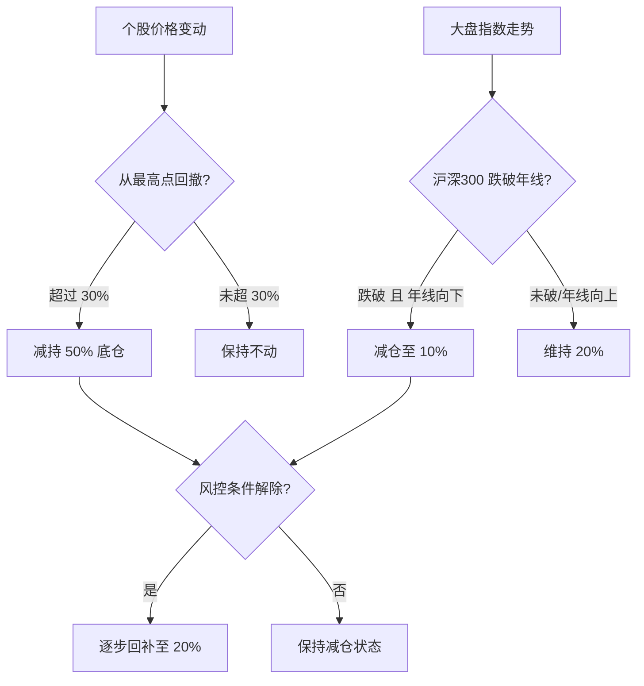
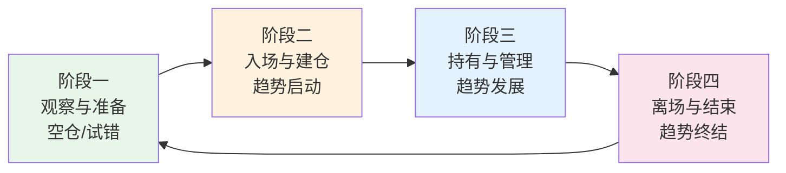
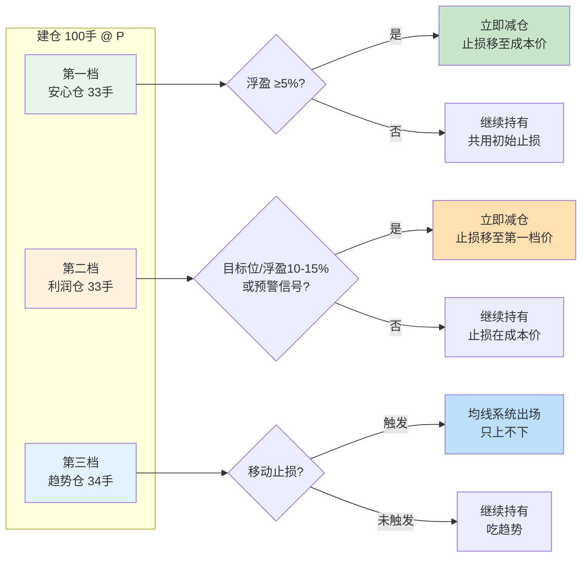
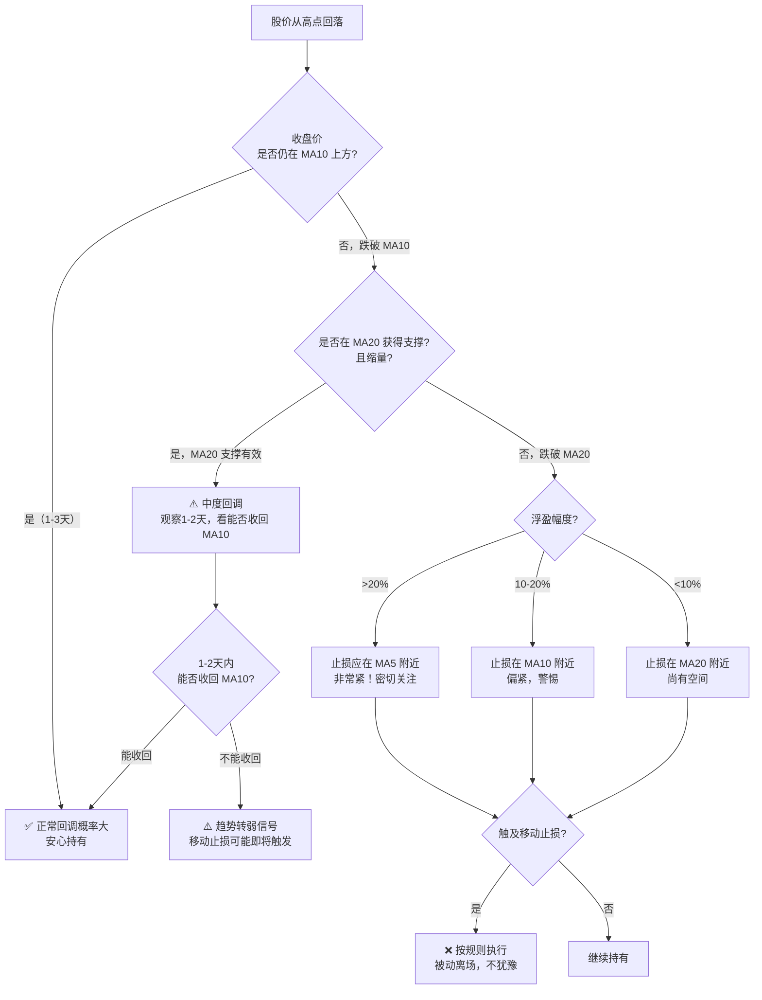
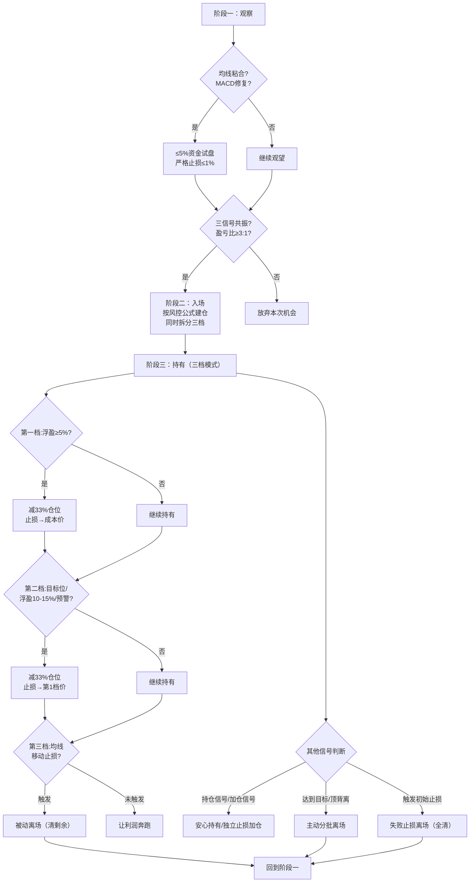
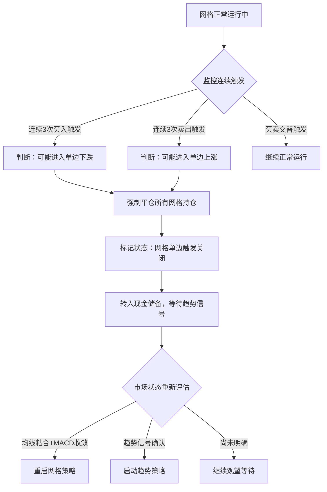
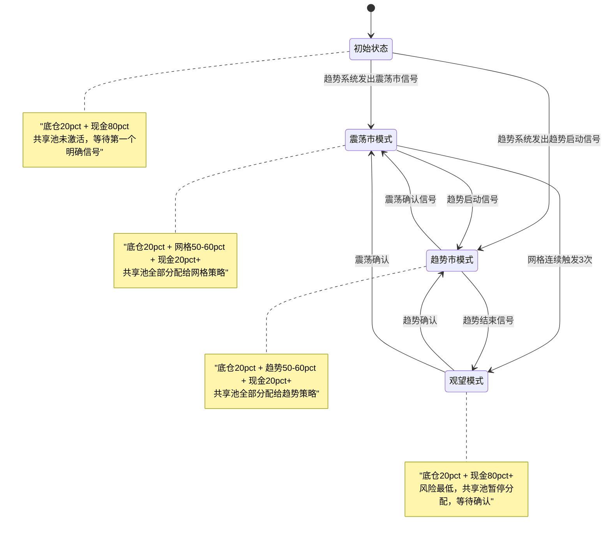

# 当趋势策略遇上震荡市：一套全天候复合交易系统的设计手记

做过一段时间交易的人大概都有过这样的经历：

你精心研究了一套趋势跟踪策略，回测数据漂亮得让人兴奋——年化收益 40%，最大回撤可控，夏普比率超过 2。然后你满怀信心地实盘运行，结果发现： **震荡市里它被反复止损割肉** ，好不容易等来一波趋势，前面的利润已经亏掉大半。

反过来，如果你用网格交易在震荡市里收割差价，看似稳定盈利，结果一根大阳线或者一根大阴线打过来——要么踏空起飞的行情，要么被深套动弹不得。

这就是单一策略的宿命： **每种策略都有它的舒适区，也都有它的死穴** 。

那有没有可能，让不同策略各司其职，在它们各自擅长的领域里发挥作用？

<!-- more -->

## 从痛点出发：为什么需要复合系统

### 单一策略的两难困境

先说趋势跟踪策略。它的逻辑很清晰： **截断亏损，让利润奔跑** 。当市场出现明确的上涨或下跌趋势时，它能捕捉到大部分行情。但问题在于：

- **震荡市是趋势策略的噩梦** 。价格上上下下，每次看起来像要突破都只是假突破，止损一次接一次。等到真正的趋势终于来了，账户已经伤痕累累。
- 一个典型的震荡期可能会持续几周甚至几个月，这期间的磨损足以吃掉趋势行情的大部分利润。

再说网格交易策略。它的核心思想是 **"跌买涨卖"**，在价格区间内反复套利。听起来很稳，但它有自己的致命弱点：

- **单边行情是网格的克星** 。如果价格一路上涨，网格不断卖出，最后只剩空仓眼睁睁看着行情飞走；如果价格一路下跌，网格不断买入，越套越深。
- 更糟糕的是，很多时候你 **无法提前判断** 当前是震荡还是趋势的起点。

!!! quote "交易的永恒难题"
    市场只有两种状态（震荡和趋势），但没有人能 100% 准确地预判下一刻会进入哪种状态。我们能做的，不是预测市场，而是 **设计一个无论市场怎么走都能应对的系统** 。

### 三层思路的由来

既然无法准确预判市场状态，那不如换个思路：

1. **不管什么市场，始终保持一定仓位在场内** —— 这样至少不会完全踏空大行情
2. **趋势来了就用趋势策略去追** —— 毕竟这是利润的主要来源
3. **震荡了就切到网格策略去磨** —— 虽然单笔利润小，但胜率高、频率高

这就是本系统的核心理念： **不是预测市场，而是适应市场** 。

## 系统总览：三层架构如何协同工作

在深入细节之前，先用一张全景图建立整体认知：

| 策略层级 | 资金比例 | 定位 | 核心目标 |
|---------|---------|------|---------|
| 战略底仓 | 20% | 压舱石 | 穿越牛熊周期，获取长期复利 |
| 趋势跟踪 | ≤50%（动态） | 主力军 | 捕捉单边趋势行情的大利润 |
| 网格交易 | 50~60%（共享池，动态分配） | 辅助兵 | 震荡市里反复收割小利润 |

这三层不是简单叠加，而是通过 **智能切换机制** 联动起来：



接下来，我们逐层拆解每条战线的具体规则。

## 第一层：战略底仓——穿越周期的压舱石

### 为什么需要底仓

很多人做交易的终极恐惧是什么？ **踏空** 。

你精心等待信号，严格控制风险，结果一波大牛市从你面前呼啸而过，你全程空仓或者仓位极轻。这种痛苦比亏钱还难受——因为亏钱还能总结经验教训，踏空只能怪自己胆子太小。

20% 战略底仓的存在，就是为了解决这个问题的。它是一笔 **永久性持仓** ，除非触发极端风控条件否则不卖出。这意味着：

- 即使你的趋势策略和网格策略全部判断失误，至少还有 20% 的仓位在享受市场上涨的红利
- 长期来看，优质股票或指数的年均回报在 8%-15%，20% 底仓本身就能贡献 1.6%-3% 的年化收益

### 极端情况下的风控底线

底仓虽为长期持有，但不能真的"永远不动"。需要设置极端情况的保护措施：



!!! warning "两条风控红线"
    
    **个股层面** ：从最高点回撤超过 30% 时，减持 50% 底仓。这条规则防止个股出现"黑天鹅"式暴跌时损失过大。

    **大盘层面** ：沪深 300 跌破年线且年线方向向下时，减仓至 10%。这条规则的逻辑是——当大盘进入中长期下降通道时，大多数个股很难独善其身。
    
    两条规则触发后，一旦条件解除（个股反弹或大盘重新站上年线），逐步回补至正常水平。

## 第二层：基于均线-MACD的趋势跟踪系统 V2.1

趋势跟踪策略是整个系统的 **"利润发动机"** ，负责在单边行情中获取超额收益。

但这里要介绍的不是一个简单的"突破就买、破位就卖"，而是一套经过反复打磨的 **四阶段完整交易框架** ——从观察到离场，每一步都有明确的 IF-THEN 规则，旨在实现 **"有计划地进场，有纪律地持仓，有规则地离场"** 。



### 阶段一：观察与准备（空仓/试错）

这是交易的起点。很多人亏钱的原因不是策略不好，而是 **在该等待的时候忍不住出手了** 。

#### 核心信号：识别潜在机会

阶段一的使命是识别"市场可能要动"的早期迹象，但 **不急着入场** ：

| 信号类型 | 具体表现 | 含义 |
|---------|---------|------|
| 均线粘合 | MA5、MA10、MA20 高度聚集 | 多空力量暂时平衡，变盘在即 |
| MACD 修复 | DIF 与 DEA 在零轴下方收敛，柱状线缩短或翻绿 | 下跌动能衰竭，正在蓄力 |

!!! note "为什么是零轴下方的修复？"
    
    最具爆发力的趋势行情，往往从 MACD 零轴下方的修复开始——这意味着之前的下跌动能已经耗尽，一旦反转，上升空间更大。当然，零轴附近的震荡粘合也可能是启动的前兆。

#### 盈亏比测算：左侧博弈的特殊要求

这个阶段的本质是 **左侧交易** ——你试图在趋势正式启动前就介入，但此时盈利空间（R）还无法精确定义。

因此规则很简单：

- **主仓位保持空仓** —— 不确定的行情不值得重仓去赌
- **可动用 ≤5% 资金极小仓位试盘** —— 目的是感受市场温度，不是赚钱
- **止损必须极严格** —— 设于震荡箱体下沿，确保单笔亏损 ≤总资金 1%

!!! quote "阶段一心法"
    
    看得到机会不等于要冲进去。阶段一的智慧在于 **"知道机会来了，但耐心等它确认"** 。

### 阶段二：入场与建仓（趋势启动）

当阶段一的酝酿终于迎来 **右侧确认** 时，就是主力部队出动的时刻了。

#### 核心信号：三条件共振

入场必须同时满足三个条件，缺一不可：

| # | 条件 | 具体标准 |
|---|------|---------|
| 1 | 价格突破 | 放量（量比 >1.5）突破关键压力位或前期高点 |
| 2 | 均线共振 | MA5 > MA10 > MA20 开始呈现多头排列雏形 |
| 3 | 动能确认 | MACD 在零轴上方或附近形成金叉，红柱放大 |

三个条件的逻辑各有分工：

- **价格突破** 告诉你方向已经明确（不再震荡）
- **均线共振** 确认趋势结构已经形成（不是假突破）
- **MACD 金叉** 提供动能支撑（有资金在推动）

!!! warning "三个条件必须同时满足"
    
    只有一个或两个条件符合？ **不动** 。宁可少做一笔交易，也不要在没有完整证据的情况下入场。这是系统优于主观判断的关键所在。

#### 盈亏比门槛：3:1 原则

在计算仓位之前，先回答一个问题：这笔交易 **值不值得做** ？

$$ \text{盈亏比} = \frac{T - P}{P - S} \geq 3:1 $$

其中：

- **P（入场价）** ：突破后首次回踩的支撑位，或放量阳线的收盘价
- **S（止损价）** ：入场 K 线最低点 或 MA20 价位（取较低者）
- **T（目标价）** ：前一波段高点，或下一个强压力位

如果算出来盈亏比不足 3:1， **直接放弃这次交易** ——风险收益不对等，长期下来必亏。

#### 仓位计算与执行

通过盈亏比筛选后，按以下步骤执行：

$$ \text{开仓股数} = \frac{\text{风险金额}}{P - S} $$

**步骤分解** ：

1. 确定单笔风险额：通常为总资金的 **1%-2%**（小资金账户可适当放宽至 3%-5%，但不宜超过 5%）
2. 计算可买股数：风险金额 ÷（入场价 - 止损价）
3. 执行建仓：买入计算得到的股数（通常为计划仓位的 30%-50%，留余力给后续加仓）
4. **立即设置止损单** 于 S 价 —— 这一步不能省

举个例子：

=== "100万资金账户"

    - 总资金：100 万元
    - 单笔风险限额：2%（2 万元）
    - 入场价 P=42.5 元，止损价 S=40 元
    
    $$ \text{股数} = \frac{100万 \times 2\%}{42.5 - 40} = \frac{2万}{2.5} = 8,000 \text{股} $$
    
    - 开仓资金：8,000 × 42.5 = **34 万元（34% 仓位）**
    - 最大亏损锁定： **2 万元（2%）**

=== "10万资金账户"

    - 总资金：10 万元
    - 单笔风险限额：1.5%（1,500 元）
    - 入场价 P=12.60 元，止损价 S=12.00 元
    
    $$ \text{股数} = \frac{1500}{12.60 - 12.00} = \frac{1500}{0.60} = 2,500 \text{股} $$
    
    - 开仓资金：2,500 × 12.60 ≈ **31,500 元（31.5% 仓位）**
    - 最大亏损锁定： **1,500 元（1.5%）**

无论资金大小，核心原则不变： **每一笔交易的最大亏损都是预先锁定的** 。

### 阶段三：持有与管理（趋势发展）

入场只是开始，真正决定胜负的是持仓过程中的管理能力。这一阶段的目标是： **让利润奔跑，同时保护浮盈** 。

#### 三类信号及其含义

| 信号类型 | 具体表现 | 应对思路 |
|---------|---------|---------|
| **持仓信号** | 股价在 MA10 上方运行，均线呈多头排列 | 安心持有，不做多余操作 |
| **预警信号** | 股价乖离率 >15%，或出现 MACD 顶背离 | 开始警惕，准备减仓 |
| **加仓信号** | 缩量回踩 MA10 或 MA20 后再度起涨 | 可考虑加仓，但需独立设止损 |

#### 动态仓位管理

以下为**简化原则版**，快速决策时可参考。如需精确执行模板，请直接使用下方 **「三档阶梯止盈策略」** 。

根据浮盈情况和预警信号灵活调整：

| 浮盈状态 | 操作动作 | 说明 |
|---------|---------|------|
| 盈利安全垫 >5% | 将止损移至成本价 | 进入"永不亏损"模式 |
| 出现预警信号 | 主动减仓 1/3 至 1/2 | 锁定部分利润，降低敞口 |
| 出现加仓信号 | 以不超初始仓位的量加仓 | 加仓部分单独设置止损 |

!!! tip "速查表定位"
    
    此表为 **快速决策速查** ，方便盘中来不及翻三档规则时参考。精确执行请以上方 **「三档阶梯止盈策略」** 为准。

!!! tip "为什么要减仓而不是全部清仓？"
    
    预警信号意味着趋势可能减弱，但未必结束。减仓 1/3 到 1/2 是一个折中方案：既锁定了一部分利润，又保留了仓位以防趋势继续延伸。 **贪婪和恐惧之间的平衡点，就在这里。** 

#### 三档阶梯止盈策略（V2.1 增强）

上述动态仓位管理的规则是原则性的，实际执行中容易犹豫——减多少？什么时候减？为了解决这个"执行模糊性"问题，引入 **三档阶梯止盈策略**，将持仓从建仓那一刻起就拆分为三个独立管理的部分。

**核心思想**：把一笔仓位按 33% / 33% / 34% 拆成三份，每份有独立的出场规则，互不干扰。既能落袋为安，又能让利润奔跑。



##### 各档详细规则

**第一档：安心仓（占总仓位 33%）**

| 参数 | 规则 |
|------|------|
| 仓位占比 | 总仓位的 **33%**（向上取整） |
| 出场条件 | 浮盈达到 **≥5%** 即减仓，不等待 |
| 目的 | 收回成本，让剩余仓位变成"免费筹码" |
| 止损规则 | 减仓前与总仓共用初始止损；减完后剩余仓位止损移至 **成本价** |

> 效果：一旦第一档出掉，无论后面发生什么，这笔交易已经不可能亏钱了。心态上的转变是巨大的——"已经不亏了"。

**第二档：利润仓（占总仓位 33%）**

| 参数 | 规则 |
|------|------|
| 仓位占比 | 总仓位的 **33%**（向下取整，余量并入第三档） |
| 出场条件 | 满足以下任一即减：<br/>① 到达第一目标位（前高 / 关键阻力）<br/>② 浮盈达 **10%-15%**<br/>③ 出现预警信号（顶背离 / 乖离率 >15%） |
| 目的 | 在确定性较高的位置锁定利润 |
| 止损规则 | 第一档减完后止损已在成本价；第二档减完后止损移至 **第一档减仓时的价格** |

> 效果：到了阻力位或出现预警信号时兑现一波，不贪也不慌。如果趋势继续，第三档还有仓位在场上。

**第三档：趋势仓（占总仓位 34%，含取整余量）**

| 参数 | 规则 |
|------|------|
| 仓位占比 | 总仓位的 **~34%**（承接前两档取整后的余量） |
| 出场条件 | **不设主动止盈目标**，完全依赖均线移动止损 |
| 目的 | 捕捉大趋势，让利润奔跑 |
| 移动止损规则 | 完全沿用下方均线阶梯止损表 |

> 效果：如果遇到翻倍行情，这 ~1/3 仓位能吃到大部分利润。这是整个策略中"梦想"所在的那一部分。

##### 第三档的均线移动止损规则

第三档的趋势仓完全使用均线系统作为移动止损参考，根据浮盈幅度逐步收紧：

| 浮盈幅度 | 移动止损位置 | 背后逻辑 |
|---------|-------------|---------|
| <10%（第一档未减时） | 保持初始止损 S 不变 | 趋势初期波动大，给予足够空间 |
| <10%（第一档已减后） | 上移至 **MA20** | 已有安全垫，用中期均线保护 |
| 10% ~ 20% | 上移至短期生命线 **MA10** | 利润已值得守护，收紧保护范围 |
| >20% 或趋势加速 | 上移至更陡峭的 **MA5** 或最近一根大阳线底部 | 紧跟价格，最大化利润捕获 |
| 出现预警信号 | 切换至小级别上升趋势线 | 用更敏感的参考系应对可能的转折 |

!!! danger "移动止损的核心原则：只上不下"
    
    止损位一旦上移， **永远不往下调** 。哪怕当天股价大幅低开导致触及止损，也要无条件执行离场。这就是"截断亏损"的具体实现——不是预测会跌，而是接受"当前走势已不符合预期"的事实。

##### 止损位随减仓级联上移

三档策略的一个关键设计是：**每次减仓后，剩余仓位的止损位自动上移到更安全的位置**。

```
时间线示意：
━━━━━━━━━━━━━━━━━━━━━━━━━━━━━━━━━━━━━━━━━━━━━━━→
建仓        第一档减      第二档减      移动止损触发
 ↓            ↓           ↓            ↓
100手       减33手       减33手       清34手
止损=S     止损→成本P   止损→第1档价  止损=MAx
(全部仓位)  (剩67手)    (剩34手)     (清仓)
```

| 节点 | 动作 | 剩余仓位 | 止损位置 |
|-----|------|---------|---------|
| 建仓完成 | — | 100% | 初始止损 S |
| 第一档减仓（+5%） | 减 33% | ~67% | 上移至成本价 P |
| 第二档减仓（目标位/预警） | 减 33% | ~34% | 上移至第一档减仓价 |
| 第三档触发 | 均线移动止损 | 0% | 全部离场 |

这种级联机制确保了：**越往后，剩余仓位的安全垫越厚，越敢于拿住**。

##### 适用条件

| 适合场景 | 不适合场景 |
|---------|-----------|
| 趋势行情（突破后持续上涨） | 窄幅震荡市（来回扫止损） |
| 你的三信号共振入场 | 超短线日内交易 |
| 持仓周期 > 3 天 | 打板次日必卖模式 |

!!! note "与原有系统的对接"
    
    三档策略是对原系统 **阶段三"持有与管理"** 的具象化增强，唯一改动是将原来模糊的"减仓 1/3~1/2"升级为结构化的三档模板。
    
    - 阶段②入场（三信号共振）：**不变**
    - 阶段③持有（移动止损）：**升级为分三档减仓 + 均线跟踪止损**
    - 阶段④退出（止损触发）：**不变（针对各档剩余仓位分别执行）**

#### 移动止盈（已整合至三档策略）

!!! note "已整合至上方三档策略"
    
    原始移动止损规则已完全融入 **「第三档的均线移动止损规则」**（见上方表格）。以下为快速参考摘要，详细执行请以三档策略为准。

#### 回调还是反转？——持仓过程中的核心判断

在阶段三的持有过程中，最常遇到的困惑就是：**价格从高点回落了，这到底是正常回调还是趋势反转？** 判断错了，要么被洗出去错失大行情（把回调当反转），要么利润全吐回去（把反转当回调）。

##### 核心原则

> **不预测，只应对。假设它是反转，直到证据证明它只是回调。**

永远不要试图在回落发生的那一刻就下结论。正确做法是让证据逐步积累，用多层信号交叉验证。

##### 五层判断框架

**第一层：均线系统（核心参考）**

| 信号 | 回调特征 | 反转特征 |
|------|---------|---------|
| MA5 vs MA10 | 下穿后快速收回，未形成死叉 | 形成死叉且持续发散 |
| 价格 vs MA20 | 回踩获支撑反弹，收盘价站稳均线上方 | **连续2-3日收盘**跌破且无法收回 |
| 均线排列 | 多头排列短暂走平但未空头化 | 短期均线下穿中期均线 |

!!! tip "关键判据"
    
    **"收盘价"比"盘中价"重要十倍。** 盘中跌破均线又拉回来是常态，但连续2个交易日收盘在关键均线之下才是真正的危险信号。

**第二层：量能配合**

| 信号 | 回调 | 反转 |
|------|------|------|
| 下跌量能 | 缩量下跌 → 抛压轻，惜售明显 | 放量下跌 → 有资金坚决出逃 |
| 反弹量能 | 反弹时温和放量 | 无量反弹 → 买盘枯竭 |
| 关键位测试 | 测试支撑时缩量 | 测试支撑时放量跌破 |

**第三层：MACD 动能**

| 信号 | 回调 | 反转 |
|------|------|------|
| 柱状线 | 绿柱缩短或翻红 → 动能衰竭 | 绿柱持续放大 → 动能在增强 |
| DIF vs DEA | 零轴上方假死叉后快速金叉 | 零轴下方死叉 / 深度死叉 |
| 背离情况 | 底背离（下跌力度减弱） | 顶背离确认后继续下破 |

**第四层：价格结构（K线形态）**

| 信号 | 回调 | 反转 |
|------|------|------|
| 回撤幅度 | ≤ 前波涨幅的 **38.2%-50%** | 超过 **61.8%**（黄金分割警戒线） |
| K线形态 | 长下影线、锤子线、启明星组合 | 光脚阴线、吞没形态、跳空低开 |
| 时间周期 | 调整 3-5 个交易日即企稳 | 超 **8-10 个交易日**仍无起色 |

**第五层：三档策略的保护作用**

这一层不是用来"判断"的，而是用来**消除判断压力**的设计：

```
你的三档体系已经内建了"不需要完美判断"的机制：
├── 第一档已在 +5% 减掉 → 心态上已经不亏
├── 第二档已在目标位减掉 → 大部分利润锁定  
└── 第三档靠移动止损 → 不需要主观判断，均线说了算
```

三档策略本身就是为解决"不知道是回调还是反转"这个问题而设计的。

##### 实操决策树



##### 回调/反转速查表

每次出现回落时，按以下清单打分：

| # | 检查项 | 回调加分 | 反转加分 |
|---|--------|---------|---------|
| 1 | 跌破 MA10 后几天内收回？ | 1-3天内收回 **+2** | 超3天未收 **+2** |
| 2 | 跌到 MA20 是否止跌？ | 站稳 MA20 **+2** | 跌破 MA20 **+2** |
| 3 | 下跌过程缩量还是放量？ | 缩量 **+2** | 放量 **+2** |
| 4 | MACD 绿柱在缩短还是放大？ | 缩短 **+1** | 放大 **+1** |
| 5 | 有没有出现长下影线/K线止跌形态？ | 有 **+1** | 无/光脚阴线 **+1** |
| 6 | 回撤幅度占前波涨幅比例？ | <38.2% **+1** | >61.8% **+2** |
| 7 | 三档状态？ | 第一档已减 **+1** | — |

**打分规则**：回调总分 > 反转总分 → 当作回调持有；反之 → 准备迎接移动止损触发。分数接近时，**以均线系统为准**（第一层权重最高）。

!!! quote "最重要的一句话"
    
    你不需要准确区分回调还是反转。你需要的是：**一套无论哪种情况都能让你活下来、并且在反转真正来临时自动保护你的规则。**
    
    三档策略 + 均线移动止损 = 这套规则已经在你的系统中了。剩下的就是执行纪律。

### 阶段四：离场与结束（趋势终结）

所有趋势都会结束。问题不在于是否结束，而在于你 **是否有纪律在它结束时果断离开** 。

#### 三种离场方式

| 离场类型 | 触发信号 | 执行方式 |
|---------|---------|---------|
| **主动离场** | 达到终极目标位；多次顶背离；长上影线等滞涨 K 线组合 | 分批清仓（如第一目标卖一半，第二目标再卖一半） |
| **被动离场** | 股价触及移动止盈位（跟踪止损） | **立即无条件清仓当前剩余持仓** |
| **失败离场** | 入场后未涨反跌，触发初始止损 S | **立即止损，无条件接受小额亏损** |

!!! important "三种离场的纪律要求"
    
    - **主动离场** ：可以分批（如三档策略中的分档减仓），给自己留一点余地
    - **被动离场** ：必须清仓当前剩余的全部持仓，不得抱有"再等等"的幻想
    - **失败离场** ：最难但最重要的一步——承认这次判断错了，止损走人，等待下一次机会

#### 完整流程回顾



### 为什么这套框架有效

这套 V2.1 系统的本质是将复杂的分析简化为清晰的 **IF-THEN（如果-那么）规则** ：

- **IF** 均线粘合 + MACD 修复 → THEN 保持空仓或极轻仓试盘
- **IF** 三信号共振 + 盈亏比 ≥3:1 → THEN 按风控公式建仓
- **IF** 浮盈扩大到某阈值 → THEN 对应地上移止损位
- **IF** 触及任何止损位 → THEN 无条件离场

它不能保证每次都盈利，但能确保你 **永远不犯大错** ，并在趋势行情中牢牢抓住利润。而成功的执行，完全依赖于你在实战中摒弃情绪、恪守纪律。

## 第三层：网格交易——震荡市的收割工具

如果说趋势策略是猎捕大象的重型武器，那网格策略就是在池塘里网鱼的细密渔网。它在 **价格区间内反复低吸高抛** ，靠高频次的小利润累积收益。

### 启动条件与市场判断

网格策略的核心前提：**只在震荡市运行，趋势市必须切换到趋势策略**。错误地在趋势行情中开网格，是新手亏损的头号原因。

但这里有一个关键陷阱：**第二层趋势系统"无信号"，绝不等于当前就是震荡市**。趋势系统只负责识别买点和卖点，它沉默时，市场可能处于以下三种完全不同的状态：

| 趋势系统状态 | 实际市场情况 | 能否开网格？ |
|------------|-------------|-----------|
| 无信号 | 单边上涨中（涨太多，不在买点范围内） | ❌ 绝对不行 |
| 无信号 | 单边下跌中（跌太狠，不符合入场条件） | ❌ 绝对不行 |
| 已离场且无新信号 | 价格横盘区间内来回波动 | ✅ 可以启动 |

因此，网格的启动必须通过 **两道独立检查**，缺一不可：

#### 第一道门：趋势系统空闲确认

第二层趋势策略必须同时满足：

- **无持仓**：之前趋势仓位已全部离场（主动/被动/失败离场均可）
- **无有效入场信号**：阶段一观察条件未满足（均线未粘合修复、或三信号未共振、或盈亏比不够）

只有趋势系统确实"没事可做"时，才轮到考虑网格。

#### 第二道门：独立震荡验证（核心防错机制）

趋势空闲只是前提，还必须用独立指标**证明当前确实是震荡而非单边**：

| 验证指标 | 震荡判定标准 | 排除的单边场景 |
|---------|------------|--------------|
| 均线排列 | MA20 与 MA60 走平或粘合（差值 < 3%） | 排除向上/向下发散的趋势行情 |
| 趋势强度 | ADX < 25 且未持续上升 | 排除 ADX > 35 的强趋势加速阶段 |
| 价格位置 | 在近期高低点构成的区间内运行 | 排除突破新高/新低的破位行情 |

!!! warning "两道门的关系"
    
    **第一道门是"资格检查"，第二道门是"安全验证"**。
    
    - 只过第一道不过第二道 → 趋势空闲但市场仍在单边 → **观望等待，不开网格**
    - 两道都通过 → 确认震荡市 → **正式启动网格**
    - 任何时刻第二道门的条件被打破（如价格突破区间上沿）→ **立即触发网格保护机制关闭**

### 基本参数设置

| 参数 | 设定值 | 说明 |
|-----|-------|------|
| 买入触发阈值 | 下跌 2% | 价格从基准价下跌 2% 时触发一笔买入 |
| 卖出触发阈值 | 上涨 2% | 价格从基准价上涨 2% 时触发一笔卖出 |
| 止损卖出阈值 | 下跌 1% | 价格从基准价下跌 1% 时触发止损（防止单边暴跌） |
| 基准价更新规则 | 卖出成交价 | 每次成功卖出一笔后，将基准价更新为本次卖出价 |

!!! note "关于参数选择"
    
    2% 的买卖阈值是一个经验值。阈值太小会导致交易过于频繁，手续费和滑点吃掉大部分利润；阈值太大则交易机会太少，资金利用率低。实际使用时应根据标的的历史波动率进行调整——波动大的标的可以适当放大阈值。

### 网格自我保护机制（核心创新）

传统网格交易最大的痛点之一就是 **不知道何时该停下来** 。价格一直跌就一直买，买到没钱为止；价格一直涨就一直卖，卖到空仓为止。

本系统的解决方案是引入 **"连续触发自动关闭"机制** ：



!!! danger "为什么是三次？"
    
    连续同向触发三次意味着市场已经走出了一段明显的单边行情。以 2% 的阈值为例，连续三次买入意味着价格已经从基准点下跌了约 6%（考虑复利效应），这已经远超普通震荡的幅度范围。此时继续用网格策略对抗趋势，无异于螳臂当车。
    
**恢复条件同样严格** ：必须等均线重新粘合 + MACD 收敛到零轴附近，确认市场回到震荡状态后才能重启网格。这避免了在"假震荡"中反复受伤。

### 网格仓位管理

网格策略的资金来自**活跃策略共享池**，与趋势策略共用同一笔可动用资金。由于趋势与网格互斥运行，不存在同时占用的情况，因此不需要预先拆分，而是根据当前市场模式**按需分配**：

!!! important "核心原则：一份钱，给当下最需要的策略"
    
    - 趋势市时，共享池全部归趋势策略使用
    - 震荡市时，共享池全部归网格策略使用
    - 共享池建议上限为总资金的 **50%~60%**

=== "100万资金示例（震荡市模式）"

    - 底仓：20 万元（固定，不动用）
    - 活跃策略共享池：50~60 万元
    - 震荡市时全部分配给网格：
      - 网格专用资金：50 万元
      - 分为 10 档，每档：5 万元
      - 操作流程：
        1. 价格每下跌 2%，使用一档资金（5 万元）买入
        2. 价格每上涨 2%，卖出一档持仓
        3. 每次卖出后更新基准价为该次成交价
        4. 全部 10 档买入后如继续下跌，不再追加（资金用尽）

=== "50万资金示例（震荡市模式）"

    - 底仓：10 万元（固定，不动用）
    - 活跃策略共享池：25~30 万元
    - 震荡市时全部分配给网格：
      - 网格专用资金：25 万元
      - 分为 8 档，每档：约 3.13 万元
      - 同样的操作逻辑，只是每档金额更大

## 三层资金的动态调配机制

理解了各层策略的规则之后，最关键的问题是： **它们之间如何配合？资金如何在各层之间流转？** 

### 四种运行状态

系统根据市场状态的变化，会在以下四种模式之间切换：



### 各状态详细说明

**初始状态** ：系统刚启动时的默认状态

- 20% 底仓已经建好
- 80% 现金在手（其中 50%~60% 为活跃策略共享池，尚未激活）
- 趋势和网格策略均未激活

**震荡市模式** ：通过两道门检查确认当前为震荡环境

- 活跃策略共享池 **全部分配给网格策略**（建议 50%~60%）
- 趋势策略保持空仓（避免被反复止损）
- 最终仓位分布：底仓 20% + 网格 50~60% + 现金 ≥20%

**趋势市模式** ：趋势系统检测到明确的趋势信号

- 如果有网格持仓，立即全部平仓回收资金回共享池
- 共享池 **全部分配给趋势策略**按规则建仓（≤50%~60%）
- 最终仓位分布：底仓 20% + 趋势 50~60% + 现金 ≥20%

**观望模式** ：最安全的过渡状态

- 触发条件：网格因连续 3 次同向触发而关闭，但趋势信号尚未得到确认
- 共享池暂停分配，所有资金转为现金
- 最终仓位分布：底仓 20% + 现金 ≥80%

!!! tip "观望模式的价值"
    
    很多人不喜欢"空仓等待"，总觉得手里有钱不操作是浪费。实际上， **观望也是一种积极的策略** ——它让你避开了不确定性最高的时段，保留了充足的弹药去抓住下一个确定的机会。

### 双重切换信号的优先级

系统有两套并行的信号源来判断是否需要切换：

| 优先级 | 信号来源 | 具体内容 | 说明 |
|-------|---------|---------|------|
| 1（最高） | 趋势系统信号 | 趋势启动 / 趋势结束 / 需荡确认 | 基于技术指标的综合性判断 |
| 2 | 网格保护信号 | 连续 3 次同向触发 | 基于实际成交行为的反馈 |

!!! important "冲突处理原则"
    
    如果两套信号同时发出指令（比如趋势系统说"还是震荡"，但网格已经连续触发了 3 次）， **以趋势系统为准** 。原因是趋势系统的判断基于更多维度的信息，而网格触发只是一个侧面信号。执行时使用市价平仓，接受合理的滑点成本。

## 风险控制的三道防线

任何交易系统如果不谈风控，都是在耍流氓。本系统设计了三道层层递进的防线：

### 第一道：战略层风控（针对 20% 底仓）

| 触发条件 | 执行动作 | 恢复条件 |
|---------|---------|---------|
| 个股从最高点回撤 >30% | 减持底仓 50% | 个股反弹企稳后逐步回补 |
| 沪深 300 跌破年线且年线向下 | 减仓至 10% | 大盘重上年线后回补 |
| 极端系统性风险 | 可全部清仓 | 风险解除后重建底仓 |

### 第二道：策略层风控（针对趋势+网格操作）

#### 趋势策略风控

| 风控指标 | 限制额度 | 触发后果 |
|---------|---------|---------|
| 单笔最大亏损 | ≤总资金 2% | 该笔交易触及止损即离场 |
| 单日最大亏损 | ≤总资金 5% | 当日停止开新仓 |
| 月度最大回撤 | ≤总资金 10% | 当月剩余时间降低仓位或暂停交易 |

#### 网格策略风控

| 风控指标 | 限制额度 | 触发后果 |
|---------|---------|---------|
| 连续同向触发 | 3次 | 强制平仓所有网格持仓，转入观望模式 |
| 单档最大投入 | 共享池总额 ÷ 档数（如 50万÷10 = 5万/档） | 资金用尽后停止买入，只执行卖出 |
| 网格总浮亏 | ≥共享池的 15% | 提前终止网格，不等到全部档位触发完毕 |
| 区间破位 | 价格突破近期震荡区间高低点 | 无论当前持仓状态如何，立即关闭网格 |

### 第三道：组合层风控（针对整体账户）

| 风控指标 | 限制 | 说明 |
|---------|------|------|
| 总仓位上限 | ≤80%（含底仓） | 至少保留 20% 现金应对机会和风险 |
| 单一策略上限 | ≤50% | 防止过度集中某一策略 |
| 现金下限 | ≥20% | 保证流动性，避免满仓被动 |

### 极端场景预案

=== "股灾式暴跌"

    - 底仓触发减仓规则（回撤 30% 或大盘破年线）
    - 趋势策略触及移动止损自动离场
    - 网格因连续买入触发自我保护，自动关闭
    - **最终状态** ：高现金比例（≥80%），安全度过风暴

=== "暴涨暴跌交替"

    - 网格频繁触发导致磨损增加
    - 连续 3 次触发后自动关闭
    - 转入观望或切换趋势策略
    - **核心思路** ：宁可少赚不可大亏

=== "信号打架"

    - 趋势信号和网格信号给出矛盾指示
    - **处理方式** ：趋势信号优先，市价执行
    - 接受少量滑点成本换取执行确定性

## 实战推演

理论讲完了，让我们用两个完整案例把整套系统串一遍。

### 案例一：三花智控（002050）——复合系统全流程

假设初始资金 100 万元，标的为三花智控，时间从 2025 年 10 月开始。这个案例重点展示 **三层策略的协同切换** 过程。

### 起点：2025年10月初

| 项目 | 状态 |
|-----|------|
| 总资金 | 100 万元 |
| 战略底仓 | 20 万元（已建好，约 4400 股 @45元） |
| 现金储备 | 80 万元 |
| 市场状态 | 震荡市（均线粘合，MACD 在零轴附近徘徊） |
| 当前股价 | 45 元 |

此时系统处于 **初始状态** ，等待第一个明确信号。

### 第一幕：震荡开启，网格上场

趋势系统扫描完各项指标后发出判断：

> **均线高度粘合** （MA5=45.2, MA10=45.0, MA20=44.8），MACD 柱状线持续缩短接近零轴，成交量较前期萎缩 40%。结论： **当前为震荡市** 。

系统动作：

1. 通过两道门检查确认震荡市，共享池激活并分配给网格策略
2. 以 45 元为基准价启动网格
3. 计算每档股数与资金分配

$$ \text{每档股数} = \frac{\text{单档风险额}}{P_{\text{当前}} \times \text{网格触发阈值}} = \frac{4,500}{45 \times 2\%} = \frac{4,500}{0.90} = 5,000 \text{股} $$

| 参数 | 数值 | 说明 |
|-----|------|------|
| 共享池总额 | 50 万元 | 与趋势策略共用 |
| 单档风险额 | 4,500 元（总资金 0.45%） | 远低于趋势策略的 2%，因为网格交易频次更高 |
| 网格触发阈值 | 2%（下跌买入 / 上涨卖出） | 即隐含止损距离 |
| 基准价 | 45 元 | 网格启动时的价格 |
| **每档股数** | **5,000 股** | 由盈亏比公式计算得出 |
| 每档投入金额 | 22.5 万元（5,000 × 45） | |
| 可用档数 | 2 档（50 万 ÷ 22.5 万） | 资金用完后停止买入，只执行卖出 |

!!! note "为什么网格的单档风险远低于趋势？"
    
    趋势策略可能持仓数周甚至数月，单笔承担较大风险是合理的；而网格策略在震荡市中高频反复买卖，**靠的是多次小利润累积**，因此每次交易的风险必须压低，避免某一次失误吃掉太多累计收益。

接下来的两周里，股价在 **43.2 ~ 46.8 元** 区间来回震荡，网格愉快地完成了 3 轮完整买卖：

| 轮次 | 操作 | 价格 | 股数 | 金额 | 单笔利润 |
|-----|------|------|------|------|---------|
| 第1轮 | 买入 | 44.1 元（跌2%） | 5,000 股 | 220,500 元 | — |
| | 卖出 | 45.0 元（涨2%） | 5,000 股 | 225,000 元 | **+4,500元** |
| 第2轮 | 买入 | 43.2 元（跌2%） | 5,000 股 | 216,000 元 | — |
| | 卖出 | 44.1 元（涨2%） | 5,000 股 | 220,500 元 | **+4,500元** |
| 第3轮 | 买入 | 44.9 元（新基准） | 5,000 股 | 224,500 元 | — |
| | 卖出 | 45.8 元（涨2%） | 5,000 股 | 229,000 元 | **+4,500元** |

三轮下来，网格累计盈利约 **+13,500元** （扣除手续费和滑点后约 +12,000 元）。每轮利润 = 5,000 股 × 2% 波动 × （1 - 手续费），逻辑清晰可验证。

### 第二幕：风云突变，网格自保

好景不长，第三轮卖出之后，股价没有像之前一样反弹，而是开始 **连续下行** ：

| 触发次数 | 触发价格 | 操作 | 股数 | 投入金额 |
|---------|---------|------|------|--------|
| 第1次买入 | 43.65 元（从44.9跌2%略多） | 买入1档 | 5,000 股 | 218,250 元 |
| 第2次买入 | 42.78 元（再跌2%） | 买入1档 | 5,000 股 | 213,900 元 |

!!! warning "警报响起"
    
    连续 2 次买入触发，已用尽共享池全部 2 档资金！网格自我保护机制启动！

**系统自动执行以下操作**：

1. 将当前所有网格持仓（10,000 股 × 42.78 元 ≈ **427,800 元** 市值）全部市价平仓
2. 标记状态为 **"网格单边触发关闭"**
3. 回收资金约 **41 万元**（考虑滑点亏损），转入现金储备
4. 总现金从原来的约 **27 万** 增加到约 **68 万**

此时的仓位分布回到了接近初始状态： **底仓 20% + 现金 ~68%** 。系统进入 **观望模式** ，等待下一步的方向确认。

### 第三幕：趋势来临，主力出击

又过了一周左右，市场上出现了几个关键变化：

- **放量突破** ：成交量突然放大到前期的 2.5 倍（量比 >1.5）
- **均线发散** ：MA5 开始上穿 MA10 和 MA20，形成多头排列雏形
- **MACD 金叉** ：DIF 线在零轴上方上穿 DEA 线，红柱开始放大
- **价格行为** ：股价放量突破 42 元的前期平台压力

趋势系统经过综合研判，发出 **"上涨趋势启动"信号** 。

系统动作：

$$ \text{仓位计算} = \frac{1,000,000 \times 2\%}{42.5 - 40} = \frac{20,000}{2.5} = 8,000 \text{股} $$

| 参数 | 数值 |
|-----|------|
| 入场价 | 42.5 元 |
| 止损价 | 40 元（前期低点） |
| 目标价 | 50 元（前期高点区域） |
| 买入股数 | 8,000 股 |
| 投入资金 | 34 万元（34% 仓位） |
| 最大风险 | 2 万元（2%） |

随后的三周里，股价如期走出一波上升趋势。这次用 **V2.1 三档阶梯止盈策略** 管理这 8,000 股仓位：

**建仓时即拆分三档**：

| 档位 | 股数 | 占比 | 出场条件 |
|-----|------|------|---------|
| 第一档：安心仓 | 2,640 股（8000×33%，向上取整） | 33% | 浮盈 ≥5% 即减 |
| 第二档：利润仓 | 2,640 股（8000×33%） | 33% | 目标位 / 浮盈10-15% / 预警信号 |
| 第三档：趋势仓 | 2,720 股（余量） | 34% | 均线移动止损，不设主动止盈 |

| 时间节点 | 股价 | 浮盈比例 | 动作 | 档位 | 移动止损位置 |
|---------|------|---------|------|-----|------------|
| 建仓 | 42.5元 | — | 买入8,000股，止损40元 | 全部 | 40元（初始） |
| 入场第5天 | 44.6元 | +4.9% | 接近第一档触发点 | — | 保持40元不变 |
| 入场第6天 | 44.6元 | +5.0% | **第一档触发！减2,640股** | 减2,640股 | **上移至成本价42.5元** |
| 入场第12天 | 47.2元 | +11.1% | **第二档触发！减2,640股**（浮盈达11%） | 减2,640股 | **上移至44.6元（第一档价）** |
| 入场第18天 | 48.8元 | +14.8% | 第三档持有中，MA10约47元 > 44.6 → 止损上移至MA10 | — | ~47元（MA10） |
| 入场第22天 | 49.5元 | +16.5% | MA5约48.5元 > 47元 → 止损进一步上移 | — | ~48.5元（MA5） |

最终股价在 49.5 元附近遇阻回落，触及 ~48.5 元的移动止损位， **第三档被动离场** 。

**本轮趋势战果核算**：

| 档位 | 买入均价 | 卖出价格 | 股数 | 单笔利润 |
|-----|---------|---------|------|---------|
| 第一档（安心仓） | 42.5 | 44.6 | 2,640 股 | **+5,544 元** |
| 第二档（利润仓） | 42.5 | 47.2 | 2,640 股 | **+12,348 元** |
| 第三档（趋势仓） | 42.5 | 48.5 | 2,720 股 | **+16,320 元** |
| **合计** | — | — | **8,000 股** | **+34,212 元** |

对比旧版单笔管理方式（全程持有到 45 元止损）：**(45 - 42.5) × 8000 = +20,000 元** 。三档策略多赚了 **+14,212 元（+71%）** ，核心原因是第三档通过均线移动止损在更高价位才离场，吃到了更多趋势空间。

### 第四幕：回归震荡，循环往复

趋势结束后，股价并未继续大跌，而是在 **48 ~ 52 元** 区间重新进入整理：

- 均线再次粘合
- MACD 回落至零轴附近收敛
- 成交量萎缩

趋势系统发出 **"震荡确认"信号** ，系统执行切换：

1. 趋势策略已完成使命，39.6万元资金回收回共享池
2. 重启网格策略，以 50 元为新基准价
3. 共享池全部分配给网格（50 万元）

**循环继续……**

### 阶段小结

回顾整个过程：

| 阶段 | 时长 | 主要策略 | 关键事件 | 估算盈亏 |
|-----|------|---------|---------|---------|
| 起点 | - | 底仓建立 | - | 0 |
| 第一幕 | ~2周 | 网格交易 | 震荡市3轮套利（每轮5,000股） | **+13,500元** |
| 第二幕 | ~1周 | 网格自保 | 连续触发2次，资金用尽后关闭 | 约-17,800元（滑点损耗+浮亏） |
| 第三幕 | ~3周 | 趋势跟踪（V2.1三档） | 上涨趋势完整捕获 | **+34,212元** |
| 第四幕 | 循环中 | 网格重启 | 返回震荡状态 | 待统计 |

可以看到： **利润主要来源于第三幕的趋势行情** 。网格在前两幕虽然第二幕出现了亏损（这是保护机制的代价——用小亏损避免了更大的深套），但第一幕的盈利证明了震荡市中网格策略的价值——让资金在等待趋势的过程中没有完全闲置。

### 案例二：涪陵电力（600452）——V2.1 趋势系统四阶段推演

上一个案例展示了三层策略的协同切换。这个案例聚焦于 **第二层趋势策略的完整四阶段流程** 。

假设总资金 **10 万元** ，单笔风险限额 **1.5%（1,500 元）** 。

#### 阶段一：观察与准备

**当前市场状态** ：

- 均线粘合：MA5、MA10、MA20 高度聚集在 12.0 ~ 12.3 元区间
- MACD 修复：DIF 与 DEA 在零轴下方收敛，柱状线持续缩短
- 成交量萎缩，波动率降低

**系统判断** ：符合 **阶段一特征** ——趋势未明，潜在机会存在但方向不确定。

**行动** ：

- 主仓位保持空仓观望
- 不操作，等待右侧确认信号

!!! note "很多人在这里就亏了"
    
    看到均线粘合就觉得"快要突破了"，忍不住先买进去"埋伏"。结果震荡继续，反复打脸。阶段一的纪律是： **看到了不等于要动手，等确认再说** 。

#### 阶段二：入场与建仓

假设一段时间后，市场出现入场信号：

> 放量突破 12.46 元压力位，收盘 12.60 元。量比 >1.5。MA5 开始上穿 MA10 和 MA20 形成多头排列雏形。MACD 在零轴附近金叉，红柱开始放大。

**第一步：制定交易计划** 

| 参数 | 数值 | 确定依据 |
|-----|------|---------|
| 入场价 P | **12.60 元** | 放量突破后的确认收盘价 |
| 止损价 S | **12.00 元** | 前期平台低点（取较低者） |
| 目标价 T | **14.50 元** | 前期高点区域 |
| 盈亏比 | **3.2:1** ✅ | (14.50-12.60)/(12.60-12.00) = 1.9/0.6 |

盈亏比 3.2:1 ≥ 门槛值 3:1， **通过筛选** 。

**第二步：计算仓位** 

$$ \text{可买股数} = \frac{1,500}{12.60 - 12.00} = \frac{1,500}{0.60} = 2,500 \text{股} $$

$$ \text{开仓资金} = 2,500 \times 12.60 = 31,500 \text{元（约占 31.5\% 仓位）} $$

**第三步：执行** 

| 操作 | 详情 |
|-----|------|
| 买入 | 2,500 股 @12.60 元 |
| 投入资金 | 31,500 元（31.5%） |
| 止损单 | 设于 **12.00 元** |
| 最大风险 | 1,500 元（1.5%） |

!!! tip "止损单要在买入的同时就设好"
    
    很多人买完之后想"等一会儿再设止损"，然后忙别的事就忘了，或者抱着侥幸心理觉得"应该不会跌到那里"。 **不要给自己犯错的机会** ——下单的那一刻就把止损挂上去。

#### 阶段三：持有与管理（三档策略实战）

假设后续走势顺利，股价进入上升通道。这次我们用 **V2.1 三档阶梯止盈策略** 来管理这 2,500 股仓位：

**建仓时即拆分三档**：

| 档位 | 股数 | 占比 | 出场条件 |
|-----|------|------|---------|
| 第一档：安心仓 | 825 股（2500×33%，向上取整） | 33% | 浮盈 ≥5% 即减 |
| 第二档：利润仓 | 825 股（2500×33%） | 33% | 目标位 / 浮盈10-15% / 预警信号 |
| 第三档：趋势仓 | 850 股（余量） | 34% | 均线移动止损，不设主动止盈 |
| **合计** | **2,500 股** | **100%** | — |

=== "上涨至13.23元（浮盈刚好5%）→ 第一档触发"

    - 当前浮盈 = (13.23 - 12.60) / 12.60 = **+5.0%**
    - **第一档触发！** 卖出 825 股 @13.23 元
    - 第一档利润：825 × (13.23 - 12.60) = **+520 元**
    - 剩余仓位：1,675 股
    - **关键动作：止损从 12.00 元上移至成本价 12.60 元**
    - 此时即使最坏情况触发止损，剩余仓位也只是平手

=== "涨至14.00元（浮盈11%）出现顶背离 → 第二档触发"

    - 股价创新高但 MACD 柱状线未能同步创新高 → **顶背离预警信号**
    - 同时浮盈已达 (14.00 - 12.60) / 12.60 = **+11.1%**，满足第二档的"浮盈10-15%"条件
    - **第二档触发！** 卖出 825 股 @14.00 元
    - 第二档利润：825 × (14.00 - 12.60) = **+1,155 元**
    - 剩余仓位：850 股（第三档趋势仓）
    - **关键动作：止损从 12.60 元上移至第一档减仓价 13.23 元**

=== "第三档继续持有，依赖均线移动止损"

    - 第三档 850 股目前浮盈约 +11%
    - 移动止损位在 **13.23 元**（第二档减仓后，止损从成本价上移至第一档价 13.23 元）
    - 根据均线规则，浮盈 10%-20% 区间应上移至 **MA10**（假设当前约 13.50 元）
    - 由于 MA10(13.50) > 当前止损位(13.23)，满足"只上不下"原则，止损进一步上移至 MA10 的 13.50 元
    - **第三档的任务只有一个：让利润奔跑，直到均线系统说"停"**

#### 阶段四：离场与结束（三档策略视角）

假设股价继续冲高至 14.50 元后回落，最终触及移动止损位：

| 档位 | 减仓时间 | 减仓价格 | 股数 | 单笔利润 | 触发原因 |
|-----|---------|---------|------|---------|---------|
| 第一档 | 浮盈5%时 | 13.23 元 | 825 股 | **+520 元** | 固定百分比触发 |
| 第二档 | 顶背离/浮盈11% | 14.00 元 | 825 股 | **+1,155 元** | 预警信号+目标位 |
| 第三档 | 回落触均线止损 | 13.50 元 | 850 股 | **+765 元** | MA10 移动止损 |

**最终战果核算**：

| 部分 | 买入均价 | 卖出价格 | 股数 | 盈亏 |
|-----|---------|---------|------|------|
| 第一档（安心仓） | 12.60 | 13.23 | 825 股 | **+520 元** |
| 第二档（利润仓） | 12.60 | 14.00 | 825 股 | **+1,155 元** |
| 第三档（趋势仓） | 12.60 | 13.50 | 850 股 | **+765 元** |
| **合计** | — | — | **2,500 股** | **+2,440 元（+7.7%）** |

!!! quote "三档策略 vs 传统单笔管理的对比"
    
    如果采用传统方式（不分档，全程持有到 13.50 元止损离场），总利润为：
    
    $$ 2,500 \times (13.50 - 12.60) = \textbf{+2,250 元（+9.0\%）} $$
    
    看起来传统方式的利润率更高（+9.0% vs +7.7%）。但这里的关键区别在于：
    
    1. **风险暴露不同**：三档策略在涨到 13.23 元时就已锁定利润并上移止损，之后最大可能亏损远低于传统方式
    2. **心态不同**：第一档减完后"已经不亏了"，能更冷静地持有第三档
    3. **大行情场景**：如果股价不是回落到 13.50，而是一路涨到 18 元呢？三档策略的第三档 850 股会继续吃到 (18.00 - 13.50) = 4.50 元/股的空间，额外获利 **3,825 元**。而传统方式如果中途被小波动洗出去，可能根本拿不到
    
    三档策略的本质是 **用一小部分潜在收益换取确定性和心理优势** ，在大行情中反而可能跑赢。

如果触发的是 12.00 元初始止损（入场后直接下跌），则无论分几档都是 **1,500 元（1.5%）** 的亏损——因为还没到第一档触发点，全部仓位一起止损。

    更重要的是——无论结果是赚 7.7% 还是亏 1.5%， **都在计划之内** 。没有恐慌决策，没有情绪化操作，一切按照 IF-THEN 规则执行。这就是系统化交易的意义。

## 日常运维：检查清单与复盘框架

设计好系统只是第一步，真正决定成败的是 **日常执行的纪律性** 。

### 每日必做事项

**市场状态仪表盘** ：

| 监控项 | 正常显示示例 |
|-------|------------|
| 趋势状态 | `上涨趋势` / `下跌趋势` / `震荡市` |
| 网格状态 | `运行中` / `已关闭` / `待启动` |
| 连续触发计数 | 买入: `0/1/2/3` \| 卖出: `0/1/2/3` |
| 总仓位 | `XX%` |
| 分项明细 | 底仓: `20%` \| 趋势: `XX%` \| 网格: `XX%` \| 现金: `XX%` |

**信号检查清单** ：

- [ ] 均线排列状态（多头/空头/粘合）
- [ ] MACD 位置与方向（零轴上/下/附近）
- [ ] 成交量变化（放量/缩量/持平）
- [ ] 网格连续触发计数器归零或累加
- [ ] 各策略资金使用情况和当前回撤
- [ ] 现金储备是否 ≥ 20%

### 每周复盘框架

每周花 30 分钟左右进行系统性回顾：

1. **执行一致性检查**

   本周是否有该执行而没执行的信号？是否有不该执行而主观介入的操作？诚实记录每一次违规。

2. **信号质量统计**

   本周发出了几个信号？其中多少正确、多少错误？错误信号的原因是什么？

3. **资金曲线分析**

   绘制本周权益曲线，观察回撤和增长节奏。曲线是否平滑？是否有异常跳变？

4. **参数优化评估**

   是否有某个参数明显不适应最近的市场环境？需要微调吗？（注意：不要过度优化）

5. **市场阶段定位**
   
   当前市场处于牛熊震荡哪个阶段的什么位置？这对后续策略选择有什么启示？

## 总结：系统的精髓与局限

### 这套系统的核心优势

| 优势维度 | 具体表现 |
|---------|---------|
| **全天候适应** | 震荡、上涨、下跌三种市场状态均有对应策略，不存在"盲区" |
| **风险分散** | 三层策略的风险源不同、相关性低，互为对冲 |
| **自动风控** | 网格连续触发保护机制无需人工干预，克服人性弱点 |
| **资金效率** | 不同环境下都有策略在运作，减少资金闲置浪费 |
| **长期稳健** | 20% 底仓确保不会踏空大牛市，享受长期复利 |

### 必须正视的局限

!!! quote "没有完美的系统"
    
    任何系统都有自己的适用边界和代价。承认局限比吹嘘优势更重要。

**切换成本不可避免** ：从网格切换到趋势（或反之）的过程中，会有一定的滑点和时机损失。这是"适应市场"的代价。

**震荡转趋势的初期最难熬** ：网格刚因连续触发关闭，趋势信号还没确认——这段时间你可能看着价格上涨却只能空仓观望。

**参数需要定期审视** ：2% 的网格阈值、共享池 50%-60% 的资金比例、2% 的单笔风险限额——这些都不是放之四海皆准的真理，需要根据市场环境和标的特性适时调整。

**执行力决定一切** ：再完美的系统，如果不能严格按信号执行，也只是一堆废纸。人性的贪婪和恐惧是这个系统最大的敌人。

### 五条执行铁律

1. **严格纪律** ：信号触发必须执行，不得因主观判断而犹豫或修改

2. **资金隔离** ：三层资金独立计算，严禁混用——网格亏了不能用趋势的钱补，趋势止损不能动底仓

3. **记录完整** ：每笔交易都要记录策略来源、信号依据、执行价格、实际滑点和最终盈亏

4. **定期回顾** ：每月进行系统级回顾，统计信号准确率、最大回撤、夏普比率等关键指标

5. **接受不完美** ：追求的是 **长期概率优势** ，而非每一笔都完美。完美的系统不存在，稳健的系统才可靠

---

回到开头的问题：为什么我们需要复合系统？

因为市场的本质就是 **不确定的** 。今天有效的方法明天可能失效，震荡之后可能是趋势，趋势尽头又是震荡。与其试图找到那个"一招鲜"的圣杯，不如老老实实地搭一套 **不管市场怎么走都能应对的体系** 。

这不是最快的赚钱方式，但或许是最能在市场中 **活得久** 的方式。

而活得久，本身就是一种竞争优势。

---

*免责声明：本文仅为个人研究和学习记录，不构成任何投资建议。交易有风险，入市需谨慎。*
