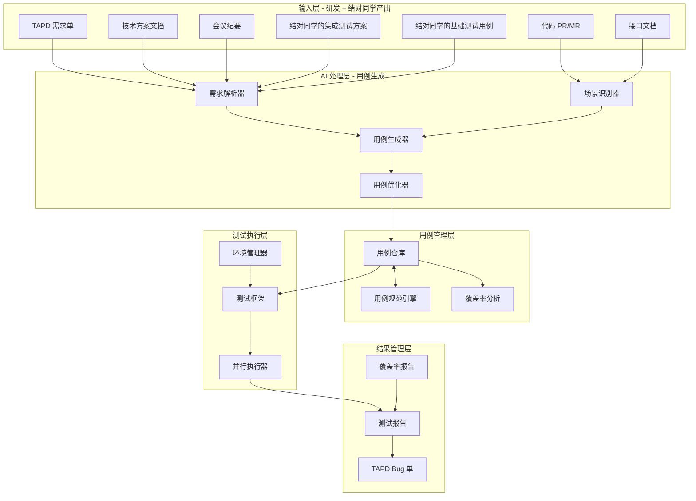
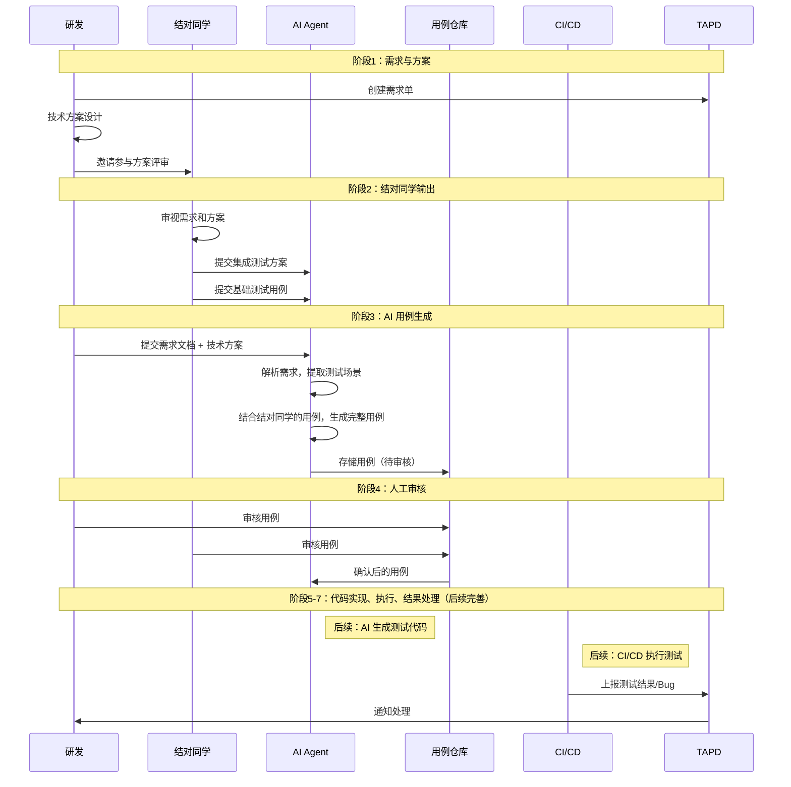
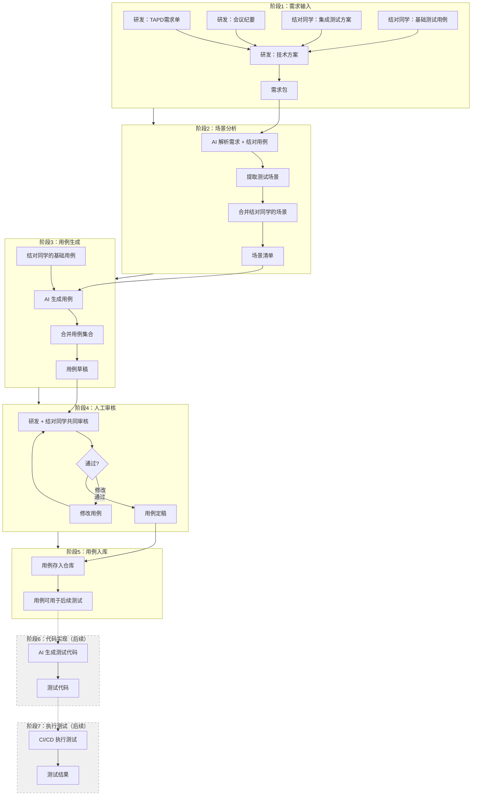
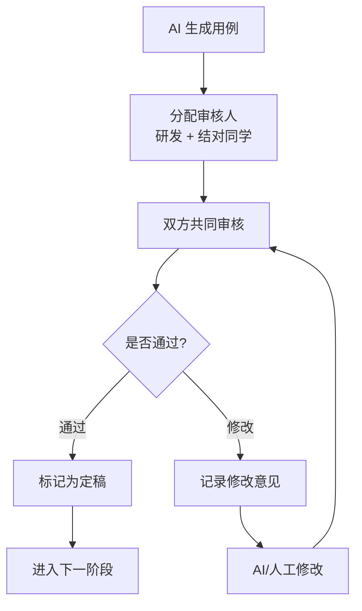
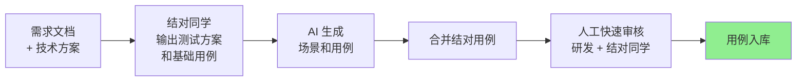

# 自动化集成测试框架设计方案

> 本文档基于团队会议纪要整理，旨在设计一套完整的自动化集成测试系统，实现从需求文档到测试用例的端到端自动化生成与执行。

<!-- more -->

## 一、背景与目标

### 1.1 当前痛点

| 痛点 | 描述 |
|-----|------|
| 人工编写用例效率低 | 测试用例编写耗时，依赖测试人员经验 |
| 用例质量参差不齐 | 不同人编写的用例风格、覆盖度不一致 |
| 测试环境复杂 | 难以快速搭建和管理测试环境 |
| 回归测试成本高 | 每次迭代都需要大量人工回归 |
| 研发与测试协作成本 | 需求理解偏差导致用例遗漏 |

### 1.2 期望目标

```
┌─────────────────────────────────────────────────────────────────┐
│                    自动化集成测试系统目标                         │
├─────────────────────────────────────────────────────────────────┤
│  1. 研发产出文件（需求/设计/代码）+ 结对同学的集成测试方案          │
│     → AI 自动生成测试用例                                         │
│  2. 用例可直接使用团队搭建的测试框架执行                          │
│  3. 支持人工审核优化，保证用例成熟度                              │
│  4. 参考成熟集成测试平台，降低建设成本                            │
└─────────────────────────────────────────────────────────────────┘
```

### 1.3 角色分工（基于会议纪要）

| 角色 | 职责 | 产出物 |
|-----|------|-------|
| **研发** | 需求分析、方案设计、代码开发、自测 | TAPD 需求单、技术方案、会议纪要、代码 PR/MR |
| **结对同学** | 从测试视角审视需求和方案，设计集成测试方案 | 集成测试方案、基础测试用例 |
| **AI Agent** | 解析输入，生成测试用例和测试代码 | 用例草稿、测试代码 |
| **CI/CD** | 自动执行测试，上报结果 | 测试结果、测试报告 |

---

## 二、整体架构设计

### 2.1 系统架构图



### 2.2 核心流程（含结对同学角色）



---

## 三、核心流程细化

### 3.1 流程总览（当前聚焦用例生成，代码实现后续完善）



### 3.2 阶段详解

---

#### 阶段 1：需求输入

**目标**：收集完整的测试输入材料（研发产出 + 结对同学产出）

| 项目 | 内容 |
|-----|------|
| **关注点** | 需求是否完整？设计是否清晰？结对同学是否充分参与？ |
| **研发输入** | TAPD 需求单、技术方案文档、会议纪要、接口文档 |
| **结对同学输入** | 集成测试方案、基础测试用例 |
| **输出物** | 需求包（包含所有材料） |

**输入物清单**：

**研发产出**：
- TAPD 需求单（功能描述、验收标准）
- 技术方案文档（如有）
- 会议纪要（如有）
- 接口文档（如有）

**结对同学产出**：
- 集成测试方案（从测试视角审视需求和方案）
- 基础测试用例（结对同学预先设计的用例）

> **备注**：具体的输入物格式和模板，后续讨论确定。

**结对同学参与要点**（基于会议纪要）：
- 研发在需求、方案设计方面有天然优势（理解实现细节）
- 研发存在局限性（难以看到其他视角的问题）
- 结对同学能够发现研发忽略的问题
- 每次技术方案评审都需要录屏、会议纪要、需求文档

**建设阶段优先级**：🔴 **必须** - 这是整个流程的起点，结对同学的参与是关键

---

#### 阶段 2：场景分析

**目标**：从需求和结对同学用例中提取完整的测试场景

| 项目 | 内容 |
|-----|------|
| **关注点** | 是否覆盖了所有功能点？是否识别了边界和异常？结对同学的场景是否被纳入？ |
| **输入** | 需求包 + 结对同学的测试用例 |
| **AI 任务** | 解析需求，提取测试场景；合并结对同学的场景 |
| **输出物** | 场景清单 |

**场景来源**：
1. **AI 从需求中提取的场景**：功能场景、边界场景、异常场景、性能场景
2. **结对同学预先设计的场景**：基于测试经验的场景补充

**场景清单示例**：
```yaml
场景清单:
  需求ID: "STORY-12345"
  
  # AI 从需求提取的场景
  ai_extracted:
    - 场景ID: "SC-001"
      场景名称: "正常登录流程"
      来源: "AI 需求分析"
      优先级: "P0"
      
    - 场景ID: "SC-002"
      场景名称: "登录失败-密码错误"
      来源: "AI 需求分析"
      优先级: "P1"
      
  # 结对同学补充的场景
  pair_added:
    - 场景ID: "SC-003"
      场景名称: "登录失败重试限制"
      来源: "结对同学补充"
      补充原因: "研发可能忽略的边界场景"
      优先级: "P1"
      
    - 场景ID: "SC-004"
      场景名称: "多因素认证流程"
      来源: "结对同学补充"
      补充原因: "安全相关场景"
      优先级: "P0"
```

**建设阶段优先级**：🔴 **必须** - 场景分析是用例生成的基础，结对同学的场景是重要补充

---

#### 阶段 3：用例生成

**目标**：将测试场景转化为具体的测试用例（AI 生成 + 结对同学用例合并）

| 项目 | 内容 |
|-----|------|
| **关注点** | 用例是否可执行？步骤是否清晰？预期是否明确？结对同学的用例是否被合理整合？ |
| **输入** | 场景清单 + 结对同学的基础用例 |
| **AI 任务** | 为每个场景生成详细的测试用例 |
| **处理方式** | AI 生成用例与结对同学用例合并 |
| **输出物** | 用例集合（草稿状态） |

**用例合并策略**：
1. **结对同学用例优先**：结对同学已设计的用例直接采用
2. **AI 补充生成**：AI 为缺失场景生成用例
3. **去重合并**：相似场景的用例合并
4. **冲突处理**：用例冲突时由人工审核决定

**建设阶段优先级**：🔴 **必须** - 用例是测试的核心产出

---

#### 阶段 4：人工审核

**目标**：确保用例质量，研发和结对同学共同审核

| 项目 | 内容 |
|-----|------|
| **关注点** | AI 是否遗漏了重要场景？结对同学的用例是否合理？用例是否符合业务实际？ |
| **输入** | 用例集合（草稿） |
| **审核人** | 研发 + 结对同学（共同审核） |
| **输出物** | 用例集合（定稿） |

**审核分工**：
- **研发审核重点**：用例是否符合技术实现、接口是否正确、数据是否合理
- **结对同学审核重点**：用例是否覆盖需求、场景是否遗漏、业务逻辑是否正确

**审核流程**：


**建设阶段优先级**：🟡 **重要** - 研发和结对同学共同审核，保证质量

---

#### 阶段 5：用例入库

**目标**：将审核通过的用例存入用例仓库，供后续使用

| 项目 | 内容 |
|-----|------|
| **关注点** | 用例元数据是否完整？用例是否可追溯到需求？ |
| **输入** | 用例集合（定稿） |
| **处理方式** | 存入用例仓库，建立需求关联 |
| **输出物** | 用例仓库中的用例 |

**当前阶段重点**：
- 用例定稿后存入仓库
- 建立用例与需求的关联
- 用例可用于后续的人工测试或自动化测试

**建设阶段优先级**：🔴 **必须** - 用例入库是当前阶段的终点

---

#### 阶段 6：代码实现（后续）

> **备注**：当前阶段暂不实现，后续根据需要补充。

**目标**：将测试用例转化为可执行的测试代码

| 项目 | 内容 |
|-----|------|
| **关注点** | 代码是否可编译？是否遵循框架规范？是否包含必要的断言？ |
| **输入** | 用例集合（定稿） |
| **AI 任务** | 生成测试代码框架 |
| **人工任务** | 代码审核、补充复杂逻辑 |
| **输出物** | 测试代码 |

**后续需要做的**：
- AI 将用例转换为测试代码
- 支持多种测试框架（Ginkgo、pytest 等）
- 代码模板和规范

**建设阶段优先级**：🟡 **后续** - 当前阶段暂不实现

---

#### 阶段 7：执行测试（后续）

> **备注**：当前阶段暂不实现，后续根据需要补充。

**目标**：在测试环境中执行测试用例

| 项目 | 内容 |
|-----|------|
| **关注点** | 环境是否就绪？依赖是否满足？执行是否稳定？ |
| **输入** | 测试代码 + 测试配置 |
| **执行方式** | CI/CD 自动触发 或 手动执行 |
| **输出物** | 测试结果（通过/失败/跳过） |

**后续需要做的**：
- CI/CD 流程集成
- 测试环境管理
- 并行执行策略
- 执行结果收集

**建设阶段优先级**：🟡 **后续** - 当前阶段暂不实现

---

#### 阶段 8：结果处理（后续）

> **备注**：当前阶段暂不实现，后续根据需要补充。

**目标**：处理测试结果，创建 Bug，生成报告

| 项目 | 内容 |
|-----|------|
| **关注点** | 失败用例是否需要创建 Bug？是否需要人工介入？报告是否完整？ |
| **输入** | 测试结果 |
| **处理方式** | 自动处理（创建 Bug）+ 人工审核 |
| **输出物** | Bug 单、测试报告、覆盖率数据 |

**建设阶段优先级**：🔴 **必须** - 结果处理是闭环的关键

---

### 3.3 阶段优先级总结

| 阶段 | 优先级 | 必要性 | 建设阶段 | 结对同学参与 |
|-----|--------|--------|---------|-------------|
| 1. 需求输入 | 🔴 必须 | 流程起点 | 第一阶段 | ✅ 核心参与 |
| 2. 场景分析 | 🔴 必须 | 用例基础 | 第一阶段 | ✅ 场景补充 |
| 3. 用例生成 | 🔴 必须 | 核心产出 | 第一阶段 | ✅ 用例合并 |
| 4. 人工审核 | 🟡 重要 | 质量保障 | 第一阶段（简化） | ✅ 共同审核 |
| 5. 用例入库 | 🔴 必须 | 流程终点 | 第一阶段 | 可选 |
| 6. 代码实现 | 🟡 后续 | 自动化执行 | 第二阶段 | 可选 |
| 7. 执行测试 | 🟡 后续 | 测试核心 | 第二阶段 | 可选 |
| 8. 结果处理 | 🟡 后续 | 流程闭环 | 第二阶段 | 可选 |

---

### 3.4 第一阶段最小可行流程

为了让流程快速跑通，第一阶段聚焦于**用例生成和管理**，代码实现和自动执行后续完善：



**第一阶段流程说明**：
1. 研发提供需求和方案，结对同学提供测试方案和基础用例
2. AI 解析需求，生成场景和用例，与结对同学用例合并
3. 研发和结对同学共同审核
4. 审核通过的用例存入仓库

**第一阶段简化要点**：

1. **结对同学参与简化**
   - 必须参与需求评审和技术方案评审
   - 输出基础测试用例（不需要非常详细）
   - 共同参与用例审核

2. **审核简化**
   - 研发和结对同学共同快速审核
   - 重点关注 AI 遗漏的场景
   - 用例格式问题可以后续修正

3. **暂不实现的内容**
   - 代码实现：AI 生成测试代码
   - 执行测试：CI/CD 自动执行
   - 结果处理：Bug 自动创建、报告生成

**第一阶段必须交付物**：

| 交付物 | 说明 |
|-------|------|
| 用例规范文档 | 统一的用例编写标准 |
| AI 用例生成 Prompt | 能生成基本可用的用例 |
| 结对同学参与规范 | 明确结对同学的职责和产出 |
| 1-2 个模块的示例用例 | 作为参考标准 |
| 用例仓库 | 存储和管理用例 |

**第二阶段需要补充**：

| 功能 | 说明 |
|-----|------|
| 详细的用例审核流程 | 完善的审核检查清单 |
| 覆盖率统计 | 需求覆盖率、场景覆盖率 |
| Bug 自动创建 | TAPD API 集成 |
| 测试报告美化 | HTML 报告、图表 |
| 性能测试 | 压测、性能基线 |
| 兼容性测试 | 多环境、多版本 |

---

### 3.5 建设任务清单

#### 第一阶段任务（2-3 周）

**Week 1：基础准备**
- [ ] 确定用例规范
- [ ] 确定结对同学参与规范（职责、产出、流程）
- [ ] 选择试点模块（建议选简单、独立的模块）
- [ ] 准备 AI Prompt 模板

**Week 2：流程验证**
- [ ] 结对同学参与需求评审
- [ ] 结对同学输出集成测试方案和基础用例
- [ ] 用 AI 生成测试用例
- [ ] 合并结对同学用例
- [ ] 研发和结对同学共同审核
- [ ] 用例存入仓库

**Week 3：优化完善**
- [ ] 优化 AI Prompt，提升生成质量
- [ ] 优化结对同学参与流程
- [ ] 输出试点效果报告
- [ ] 制定推广计划

#### 第二阶段任务（后续）

**代码实现相关**：
- [ ] AI 生成测试代码
- [ ] 测试代码模板
- [ ] 多框架支持（Ginkgo/pytest 等）

**执行和结果相关**：
- [ ] CI/CD 流程集成
- [ ] 测试环境管理
- [ ] 执行结果收集
- [ ] Bug 自动创建（TAPD 集成）
- [ ] 测试报告生成

**用例管理相关**：
- [ ] 完善用例审核流程
- [ ] 实现覆盖率统计
- [ ] 用例版本管理
- [ ] 扩展到更多模块

---

## 四、结对同学参与规范

### 4.1 参与阶段

| 阶段 | 参与方式 | 产出物 |
|-----|---------|-------|
| 需求评审 | 参与讨论，从测试视角提问 | 评审意见 |
| 技术方案评审 | 审视方案的可测试性 | 评审意见 |
| 集成测试方案 | 设计集成测试方案 | 集成测试方案文档 |
| 基础用例设计 | 预先设计基础测试用例 | 基础测试用例 |
| 用例审核 | 与研发共同审核 AI 生成的用例 | 审核意见 |

### 4.2 集成测试方案模板（待定）

> **备注**：具体模板格式后续讨论确定，此处仅列出需要包含的信息类型。

**建议包含的信息类型**：
- 测试范围
- 测试环境要求
- 核心测试场景
- 风险点识别
- 测试策略建议

### 4.3 基础测试用例要求（待定）

> **备注**：具体格式后续讨论确定。

**基本要求**：
- 覆盖核心功能流程
- 包含基本的正常和异常场景
- 提供测试数据说明
- 关联需求点

---

## 五、用例规范设计（概要）

> **备注**：具体的用例元数据结构、模板等细节，后续讨论确定。此处仅列出核心要素。

### 5.1 用例核心要素

- 基本信息：ID、名称、描述、优先级
- 关联信息：需求 ID、接口、场景来源（AI/结对同学）
- 前置条件
- 测试数据
- 测试步骤
- 预期结果
- 自动化信息：可自动化状态、代码位置

### 5.2 场景来源标记

每个用例应标注场景来源：
- `source: ai` - AI 从需求中提取
- `source: pair` - 结对同学补充
- `source: merged` - AI 和结对同学用例合并

---

## 六、AI 用例生成流程（概要）

### 6.1 输入源

1. **研发产出**：TAPD 需求单、技术方案、会议纪要、接口文档
2. **结对同学产出**：集成测试方案、基础测试用例

### 6.2 AI 处理流程

1. **需求解析**：从需求文档提取测试场景
2. **方案解析**：从技术方案识别测试要点
3. **用例生成**：为每个场景生成测试用例
4. **用例合并**：与结对同学的用例合并
5. **代码生成**：将用例转换为测试代码

---

## 七、测试框架集成（概要）

### 7.1 框架选择建议

| 语言 | 推荐框架 | 特点 |
|-----|---------|------|
| Go | Ginkgo + Gomega | BDD 风格，适合复杂场景 |
| Go | testify | 简洁，适合单元测试扩展 |
| Python | pytest | 插件丰富，支持参数化 |

### 7.2 执行方式

- CI/CD 自动触发
- 手动执行
- 定时执行

---

## 八、测试结果管理（概要）

### 8.1 结果处理

- 通过用例：记录结果
- 失败用例：分析原因，创建 Bug 单
- 跳过用例：记录跳过原因

### 8.2 报告输出

- 测试通过率
- 失败用例列表
- 新建 Bug 列表
- 覆盖率数据

---

## 九、测试回归机制（概要）

### 9.1 回归触发

- MR 触发：根据变更文件决定回归范围
- 定时触发：每日全量回归
- 发布触发：完整回归套件

### 9.2 回归范围

- 全量回归
- 增量回归（仅测试变更相关的用例）

---

## 十、用例覆盖率保障（集成测试视角）

> **说明**：集成测试关注的是**需求覆盖**和**场景覆盖**，而非代码行覆盖率（那是单元测试的职责）。

### 10.1 集成测试覆盖率指标

| 指标 | 定义 | 目标 | 说明 |
|-----|------|------|------|
| **需求覆盖率** | TAPD 需求点被集成测试覆盖的比例 | > 95% | 每个需求点至少有 1 个集成测试用例 |
| **场景覆盖率** | 识别的测试场景被用例覆盖的比例 | > 90% | 功能场景、边界场景、异常场景 |
| **接口覆盖率** | 对外接口被集成测试覆盖的比例 | > 90% | 每个接口至少覆盖正常和异常流程 |
| **端到端覆盖率** | 核心业务流程被端到端测试覆盖的比例 | > 80% | 关键用户路径必须覆盖 |

---

## 十一、成熟平台参考

### 11.1 开源测试平台

| 平台 | 特点 | 适用场景 |
|-----|------|---------|
| [TestRail](https://www.gurock.com/testrail) | 专业测试用例管理 | 用例设计、执行跟踪 |
| [Zephyr](https://www.getzephyr.com) | 与 Jira 深度集成 | 敏捷测试管理 |
| [Xray](https://www.getxray.app) | 支持 BDD、自动化 | BDD 测试管理 |

### 11.2 值得借鉴的功能

1. **TestRail 的用例组织**
   - 层级化用例管理
   - 用例与需求的双向追溯

2. **Xray 的 BDD 支持**
   - Cucumber/Gherkin 用例管理
   - 自动化与手工测试统一视图

---

## 十二、链测试场景经验

### 12.1 链测试基本原则

基于长安链（ChainMaker）等区块链项目的测试经验：

#### 12.1.1 共识相关测试

| 测试点 | 测试内容 | 关注指标 |
|-------|---------|---------|
| 共识达成 | 多节点达成一致 | 一致性、最终性 |
| 共识性能 | TPS、延迟 | 吞吐量、延迟 |
| 共识容错 | 节点故障恢复 | 可用性、恢复时间 |
| 共识安全 | 拜占庭节点处理 | 安全性、正确性 |

#### 12.1.2 智能合约测试

| 测试点 | 测试内容 | 关注指标 |
|-------|---------|---------|
| 合约功能 | 业务逻辑正确性 | 功能正确性 |
| 合约权限 | 访问控制 | 权限隔离 |
| 合约性能 | 执行效率 | 执行时间、Gas |
| 合约安全 | 漏洞检测 | 安全性 |

---

## 十三、总结

### 13.1 核心价值（当前阶段）

```
┌────────────────────────────────────────────────────────────┐
│                    自动化集成测试系统价值（第一阶段）          │
├────────────────────────────────────────────────────────────┤
│  ✓ 研发 + 结对同学协作 → AI 用例生成 → 用例入库              │
│  ✓ 结对同学从测试视角补充场景，发现研发盲点                  │
│  ✓ 用例质量标准化，降低人工成本                              │
│  ✓ 用例可追溯到需求，覆盖率可统计                            │
└────────────────────────────────────────────────────────────┘
```

### 13.2 未来价值（第二阶段）

```
┌────────────────────────────────────────────────────────────┐
│                    自动化集成测试系统价值（第二阶段）          │
├────────────────────────────────────────────────────────────┤
│  ✓ 用例自动生成测试代码                                      │
│  ✓ CI/CD 自动执行测试                                        │
│  ✓ Bug 自动创建，结果闭环                                    │
│  ✓ 回归测试自动化，提升迭代效率                              │
│  ✓ 覆盖率可视化，持续改进质量                                │
└────────────────────────────────────────────────────────────┘
```

### 13.3 角色协作模式（当前阶段）

```
┌────────────────────────────────────────────────────────────┐
│                    角色协作模式（第一阶段）                   │
├────────────────────────────────────────────────────────────┤
│  研发：需求分析 → 方案设计 → 代码开发 → 自测                │
│  结对同学：需求评审 → 方案评审 → 测试方案 → 基础用例 → 审核   │
│  AI：解析输入 → 生成用例（暂不生成代码）                     │
│  用例仓库：存储和管理用例                                    │
└────────────────────────────────────────────────────────────┘
```

### 13.3 下一步行动

1. **立即行动**
   - 组织团队讨论用例规范
   - 讨论结对同学参与规范
   - 选择 1-2 个模块进行试点
   
2. **本周完成**
   - 输出用例规范文档
   - 输出结对同学参与规范
   - 完成 AI 用例生成 MVP 设计
   
3. **本月完成**
   - 完成阶段一全部任务
   - 输出试点效果报告

---

## 附录

### A. 术语表

| 术语 | 定义 |
|-----|------|
| 集成测试 | 测试多个模块协同工作的正确性 |
| 结对同学 | 与研发组队，负责集成测试方案和用例设计的团队成员 |
| 回归测试 | 修复 Bug 或变更后验证未引入新问题 |
| 覆盖率 | 测试用例覆盖需求/场景的比例 |

### B. 参考文档

- 《软件测试艺术》
- 《测试驱动开发》
- 团队内部测试规范

### C. 相关链接

- [Ginkgo 测试框架](https://onsi.github.io/ginkgo/)
- [TestRail 官网](https://www.gurock.com/testrail)
- [Xray 官网](https://www.getxray.app)
