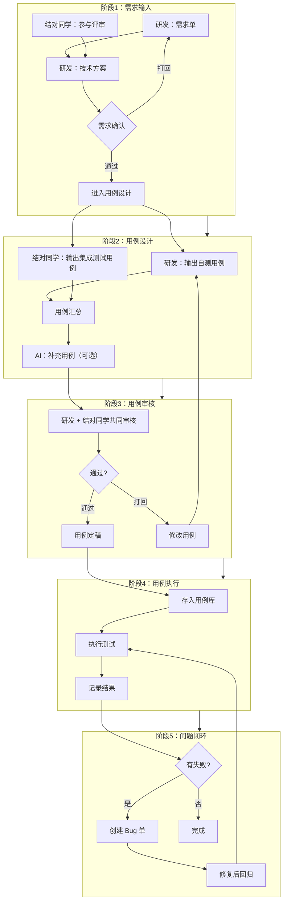
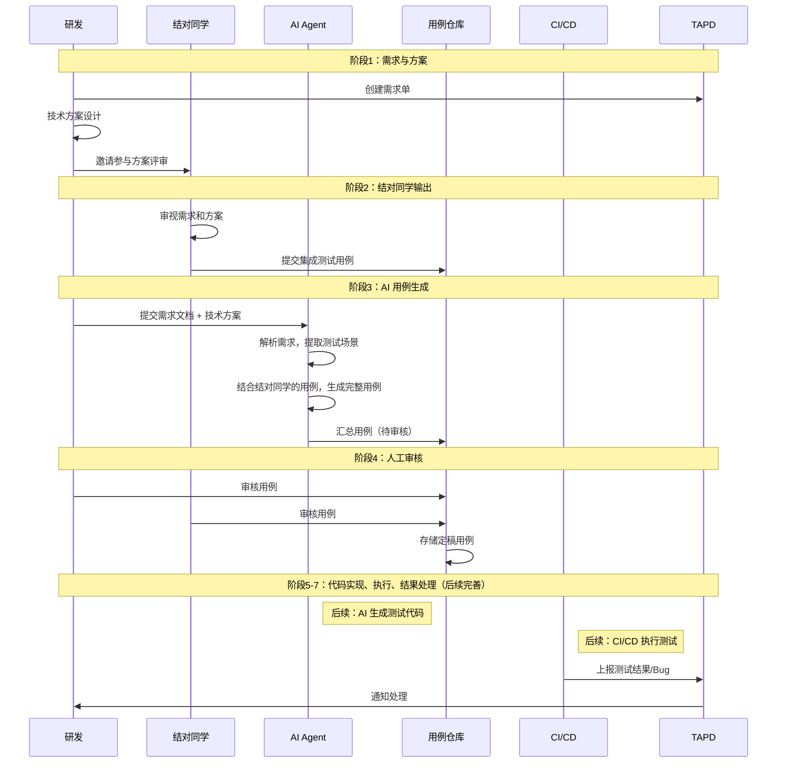
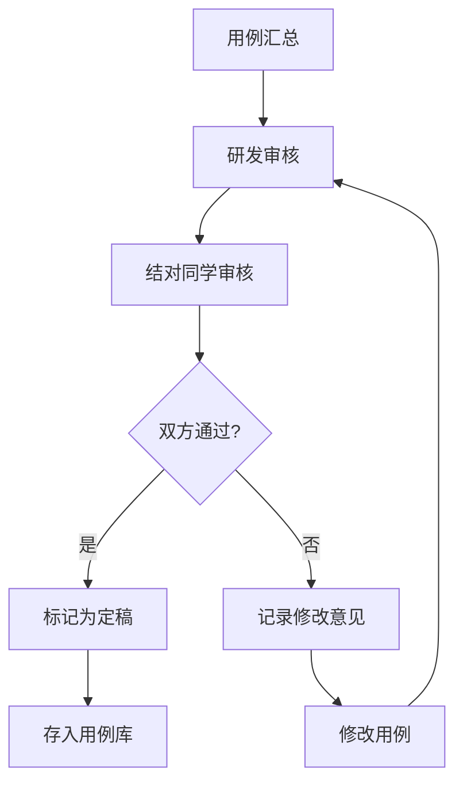
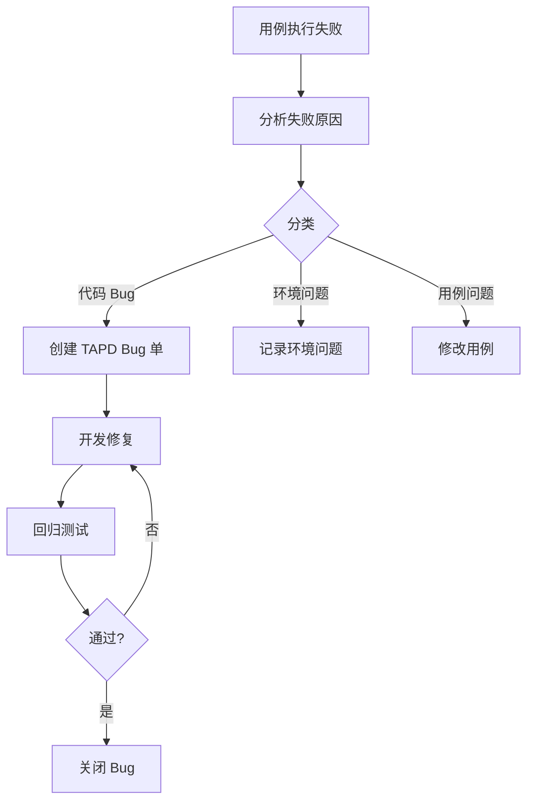

# 集成测试流程设计方案

> 本文档基于团队会议纪要整理，聚焦于**集成测试流程设计**，明确研发与结对同学的分工协作，建立从需求到用例到执行的标准化流程。

[toc]

<!-- more -->

## 一、为什么需要这个流程

### 1.1 当前痛点

| 痛点 | 描述 |
|-----|------|
| 研发不管测试 | 研发只关注功能实现，不产出测试用例，测试工作全部依赖测试人员 |
| 用例质量参差不齐 | 不同人编写的用例风格、覆盖度不一致，缺乏统一标准 |
| 回归测试成本高 | 每次迭代都需要大量人工回归，效率低 |
| 需求理解偏差 | 研发和测试对需求理解不一致，导致用例遗漏关键场景 |
| 缺乏闭环机制 | 测试发现问题后，回归验证不系统，容易遗漏 |

### 1.2 期望效果

**集成测试流程目标：**

1. **研发角色转变**：研发 + 测试（不只是写代码）
2. **结对协作**：研发和结对同学分工配合，互补视角
3. **用例规范化**：统一格式、统一存放、可追溯
4. **流程闭环**：需求 → 用例 → 执行 → 结果 → 回归

### 1.3 角色分工（基于会议纪要）

| 角色 | 职责 | 产出物 |
|-----|------|-------|
| **研发** | 需求分析、方案设计、代码开发、自测 | 需求单、技术方案、自测用例 |
| **结对同学** | 从测试视角审视需求和方案，设计集成测试方案 | 集成测试方案、集成测试用例 |
| **AI** | 辅助生成用例，提升效率（工具角色） | 补充用例草稿 |

> **关键点**：
> - 研发不只是写代码，还要输出**自测用例**
> - 结对同学不只是执行测试，还要输出**集成测试方案和用例**
> - AI 是辅助工具，不是替代人工

---

## 二、流程设计（核心）

### 2.1 流程总览



### 2.2 核心流程（含结对同学角色）



### 2.3 各阶段详解

---

#### 阶段 1：需求输入

**目标**：确保需求和方案清晰，为用例设计打好基础

| 项目 | 内容 |
|-----|------|
| **研发输出** | TAPD 需求单、技术方案文档 |
| **结对同学参与** | 参与需求评审和技术方案评审，从测试视角提问 |
| **产出** | 确认后的需求包 |

**结对同学参与要点**（基于会议纪要）：
- 研发在需求、方案设计方面有天然优势（理解实现细节）
- 研发存在局限性（难以看到其他视角的问题）
- 结对同学能够发现研发忽略的问题
- 每次技术方案评审都需要**录屏、会议纪要、需求文档**归档

**阶段产出示例**：
```yaml
需求包:
  需求ID: "STORY-12345"
  需求名称: "链上转账功能"
  需求描述: "支持链上资产转账，包含余额校验、交易上链、并发控制"
  验收标准:
    - 转账成功返回交易哈希
    - 余额不足时返回错误提示
    - 转账金额在限额范围内
    - 交易正确写入区块链
  技术方案摘要: "基于长安链智能合约，余额校验 + 交易签名验证"
  评审记录: "2026-06-15 评审通过，结对同学提出需关注并发转账场景"
```

---

#### 阶段 2：用例设计

**目标**：研发和结对同学分别输出用例，AI 辅助补充

> **为什么需要多人协作输出用例？**
> 
> 单个视角可能存在局限性：
> - **研发视角**：熟悉实现细节，但可能忽略需求之外的边界场景
> - **结对同学视角**：以测试思维审视，更容易发现异常和风险点
> 
> 多人相互补充，可以让用例覆盖更全面。之后 AI 会对各方用例进行挑战和补充，最终通过评审确定定稿用例。

##### 2.2.1 研发输出自测用例

**研发需要做的**：
- 基于需求和方案，设计**自测用例**
- 用例范围：仅覆盖**本次开发的功能点**及其直接调用的接口
- 验证重点：功能正确性、边界条件、异常处理

**研发自测用例示例**：
```yaml
# 研发自测用例
用例集:
  需求ID: "STORY-12345"
  作者: "研发"
  
  用例:
    - 用例ID: "DEV-001"
      用例名称: "正常转账"
      前置条件: "账户余额充足，交易未超频"
      测试步骤:
        1. 调用 POST /api/transfer
        2. 传入 from_addr、to_addr、amount=100
      预期结果: "返回 HTTP 200，包含交易哈希"
      
    - 用例ID: "DEV-002"
      用例名称: "余额不足"
      测试步骤:
        1. 调用 POST /api/transfer
        2. 传入 amount 大于账户余额
      预期结果: "返回 HTTP 400，提示余额不足"
      
    - 用例ID: "DEV-003"
      用例名称: "转账金额为0（边界条件）"
      测试步骤:
        1. 调用 POST /api/transfer
        2. 传入 amount=0
      预期结果: "返回 HTTP 400，提示金额必须大于0"
      
    - 用例ID: "DEV-004"
      用例名称: "最大转账金额（边界条件）"
      测试步骤:
        1. 调用 POST /api/transfer
        2. 传入 amount=单笔限额（如 10亿）
      预期结果: "返回 HTTP 200，正常处理"
```

##### 2.2.2 结对同学输出集成测试用例

**结对同学需要做的**：
- 从**测试视角**审视需求，设计**集成测试用例**
- 关注点与研发不同：边界场景、异常场景、性能场景、安全场景

**结对同学用例示例**：
```yaml
# 结对同学集成测试用例
用例集:
  需求ID: "STORY-12345"
  作者: "结对同学"
  
  用例:
    - 用例ID: "QA-001"
      用例名称: "转账后余额校验"
      优先级: "P0"
      测试步骤:
        1. 账户A余额1000，转账100给账户B
        2. 查询账户A和账户B余额
      预期结果: "账户A余额900，账户B余额增加100"
      
    - 用例ID: "QA-002"
      用例名称: "并发转账"
      优先级: "P1"
      测试步骤:
        1. 同一账户同时发起10笔转账请求
      预期结果: "所有请求成功，总转账金额正确扣除"
      
    - 用例ID: "QA-003"
      用例名称: "转账后交易上链验证"
      优先级: "P1"
      测试步骤:
        1. 执行一笔转账
        2. 查询区块链交易记录
      预期结果: "交易记录存在，金额和地址正确"
```

##### 2.2.3 AI 辅助补充用例

**AI 的角色**：辅助工具，帮助发现遗漏场景

**使用方式**：
1. 将需求文档和技术方案输入给 AI
2. AI 输出补充用例草稿
3. 研发和结对同学审核决定是否采纳

**AI Prompt 示例**：
```
你是一个专业的测试分析师。请分析以下需求，输出测试用例。

需求信息：
{粘贴需求包内容}

请从以下维度补充测试场景：
1. 边界值场景（最大/最小/空值）
2. 异常场景（网络异常、超时、并发冲突）
3. 安全场景（SQL注入、XSS、权限越界）
4. 性能场景（并发、大数据量）

输出格式：
- 用例ID
- 用例名称
- 优先级（P0/P1/P2）
- 测试步骤
- 预期结果
- 补充原因（为什么需要这个用例）
```

**AI 输出示例**：
```yaml
# AI 补充用例
用例集:
  需求ID: "STORY-12345"
  作者: "AI"
  
  用例:
    - 用例ID: "AI-001"
      用例名称: "转账给自己"
      优先级: "P1"
      测试步骤:
        1. from_addr 和 to_addr 相同
      预期结果: "返回参数校验失败，提示不能转账给自己"
      补充原因: "业务逻辑边界测试"
      
    - 用例ID: "AI-002"
      用例名称: "地址格式校验"
      优先级: "P2"
      测试步骤:
        1. 传入非法的区块链地址格式
      预期结果: "返回参数校验失败，提示地址格式不正确"
      补充原因: "输入校验测试"
```

##### 2.2.4 用例合并

**合并策略**：
1. **研发用例 + 结对同学用例**：直接合并，标注作者
2. **AI 补充用例**：审核后决定是否采纳
3. **去重**：相似用例合并

**合并后用例示例**：
```yaml
# 完整用例集
用例集:
  需求ID: "STORY-12345"
  
  用例:
    - 用例ID: "TC-001"
      用例名称: "正常转账"
      优先级: "P0"
      作者: "研发"
      
    - 用例ID: "TC-002"
      用例名称: "转账后余额校验"
      优先级: "P0"
      作者: "结对同学"
      
    - 用例ID: "TC-003"
      用例名称: "转账给自己"
      优先级: "P1"
      作者: "AI"
      审核状态: "已采纳"
```

---

#### 阶段 3：用例审核

**目标**：确保用例质量，覆盖完整

| 项目 | 内容 |
|-----|------|
| **审核人** | 研发 + 结对同学（共同审核） |
| **审核重点** | 覆盖率、正确性、可执行性 |
| **产出** | 定稿用例 |

**审核清单**：
```markdown
## 用例审核检查清单

### 覆盖率检查
- [ ] 需求中的所有功能点都有对应用例？
- [ ] 验收标准都有用例覆盖？
- [ ] 边界场景是否覆盖？
- [ ] 异常场景是否覆盖？

### 正确性检查
- [ ] 测试步骤是否正确？
- [ ] 预期结果是否符合需求？
- [ ] 测试数据是否合理？

### 可执行性检查
- [ ] 用例是否可以独立执行？
- [ ] 是否需要特殊环境？
- [ ] 前置条件是否明确？
```

**审核流程**：


**审核分工**：
- **研发审核重点**：技术实现是否正确、接口是否准确
- **结对同学审核重点**：是否覆盖需求、场景是否遗漏

---

#### 阶段 4：用例执行

**目标**：执行测试用例，记录结果

| 项目 | 内容 |
|-----|------|
| **执行方式** | 手动执行 / 自动化框架执行 |
| **执行记录** | 用例ID、执行结果、执行人、执行时间 |
| **产出** | 测试结果记录 |

**测试结果记录示例**：
```yaml
测试结果:
  执行时间: "2026-06-15 14:30"
  执行人: "结对同学"
  环境: "staging"
  
  用例结果:
    - 用例ID: "TC-001"
      结果: "通过"
      备注: ""
      
    - 用例ID: "TC-002"
      结果: "失败"
      失败原因: "转账后余额未正确扣减"
      
    - 用例ID: "TC-003"
      结果: "跳过"
      跳过原因: "需要压测环境，暂不具备"
```

---

#### 阶段 5：问题闭环

**目标**：处理失败用例，创建 Bug，回归验证

**闭环流程**：


---

### 2.3 阶段优先级

| 阶段 | 优先级 | 当前阶段 | 说明 |
|-----|--------|---------|------|
| 1. 需求输入 | 🔴 必须 | ✅ | 流程起点 |
| 2. 用例设计 | 🔴 必须 | ✅ | 核心产出 |
| 3. 用例审核 | 🟡 重要 | ✅ | 质量保障 |
| 4. 用例执行 | 🔴 必须 | ✅ | 测试核心 |
| 5. 问题闭环 | 🟡 重要 | ✅ | 流程闭环 |

---

## 三、用例管理规范

### 3.1 用例存放位置

```
test-cases/
├── transfer/               # 按模块组织
│   ├── TC-TRANSFER-001.md
│   ├── TC-TRANSFER-002.md
│   └── TC-TRANSFER-003.md
├── contract/
└── README.md               # 用例目录说明
```

### 3.2 用例命名规范

```
TC-{模块缩写}-{序号}.md

示例：
- TC-TRANSFER-001.md  # 转账模块第1个用例
- TC-TRANSFER-002.md   # 转账模块第2个用例
```

### 3.3 用例文档模板

```yaml
# 用例基本信息
用例ID: "TC-TRANSFER-001"
用例名称: "正常转账"

# 关联信息
需求ID: "STORY-12345"
作者: "研发"
创建时间: "2026-06-15"
审核状态: "已定稿"

# 用例内容
优先级: "P0"
前置条件:
  - 账户A余额充足（>=100）
  - 账户B状态正常

测试数据:
  from_addr: "0x1234..."
  to_addr: "0x5678..."
  amount: 100

测试步骤:
  1. 调用 POST /api/transfer
  2. 传入 from_addr、to_addr、amount

预期结果:
  - HTTP 状态码: 200
  - 响应体包含交易哈希
  - 交易哈希非空

# 自动化信息
可自动化: true
自动化代码位置: "tests/transfer/transfer_test.go"

# 执行记录（自动更新）
最近执行:
  - 时间: "2026-06-15 14:30"
    结果: "通过"
    执行人: "结对同学"
```

### 3.4 用例与需求的关联

**关联方式**：
- 每个用例标注 `需求ID`
- 每个需求记录关联的用例列表

**需求-用例映射表**：
```yaml
需求:
  ID: "STORY-12345"
  名称: "链上转账功能"
  关联用例:
    - "TC-TRANSFER-001"
    - "TC-TRANSFER-002"
    - "TC-TRANSFER-003"
  用例覆盖率: "100%"  # 需求点都被用例覆盖
```

---

## 四、流程保障机制

### 4.1 用例覆盖率要求

| 指标 | 目标 | 说明 |
|-----|------|------|
| **需求覆盖率** | > 95% | 每个需求点至少有 1 个用例 |
| **验收标准覆盖率** | 100% | 每条验收标准都有用例 |
| **场景覆盖率** | > 85% | 功能、边界、异常场景 |

### 4.2 审核机制

- **审核人**：研发 + 结对同学（至少两人）
- **审核时效**：用例提交后 2 个工作日内完成审核
- **审核记录**：记录审核意见和修改历史

### 4.3 回归策略

| 触发条件 | 回归范围 |
|---------|---------|
| 新功能开发 | 相关模块全量用例 |
| Bug 修复 | 相关用例 + 回归测试 |
| 代码重构 | 模块全量用例 |
| 发布前 | 全量用例 |

---

## 五、结对同学协作指南

### 5.1 结对同学参与阶段

| 阶段 | 参与方式 | 产出物 |
|-----|---------|-------|
| 需求评审 | 参与讨论，从测试视角提问 | 评审意见 |
| 技术方案评审 | 审视方案的可测试性 | 评审意见 |
| 用例设计 | 输出集成测试用例 | 集成测试用例 |
| 用例审核 | 与研发共同审核 | 审核意见 |
| 用例执行 | 执行测试，记录结果 | 测试结果 |
| 问题闭环 | 创建 Bug，跟进修复 | Bug 单 |

### 5.2 结对同学用例设计要点

**与研发用例的区别**：

| 维度 | 研发自测用例 | 结对同学用例 |
|-----|-------------|-------------|
| 视角 | 开发视角，关注功能实现 | 测试视角，关注质量风险 |
| 重点 | 正向功能验证 | 边界、异常、安全、性能 |
| 场景 | 基本功能流程 | 复杂场景、组合场景 |
| 深度 | 确保功能可用 | 确保稳定可靠 |

**结对同学需要关注的场景**：
- 边界值场景（最大/最小/空值）
- 异常场景（网络异常、超时、并发冲突）
- 安全场景（权限、注入、越权）
- 性能场景（并发、大数据量）
- 兼容性场景（不同环境、版本）

---

## 六、AI 辅助使用指南

### 6.1 AI 的定位

AI 是**辅助工具**，用于：
- 快速生成用例草稿
- 发现遗漏场景
- 提升编写效率

AI **不是**：
- 替代人工审核
- 替代测试经验
- 保证用例质量

### 6.2 AI 使用场景

| 场景 | 使用方式 | 产出 |
|-----|---------|------|
| 需求分析 | 输入需求文档，AI 输出测试场景 | 场景清单 |
| 用例生成 | 输入场景，AI 输出用例草稿 | 用例草稿 |
| 用例补充 | 输入现有用例，AI 输出遗漏场景 | 补充建议 |

### 6.3 Prompt 模板库

**模板1：需求分析**
```
你是一个专业的测试分析师。请分析以下需求，输出测试场景清单。

需求信息：
{需求内容}

请从以下维度分析：
1. 功能场景：正常业务流程
2. 边界场景：输入边界值
3. 异常场景：错误处理、异常输入
4. 性能场景：并发、压力

输出格式：
- 场景ID
- 场景名称
- 场景描述
- 优先级
```

**模板2：用例生成**
```
你是一个专业的测试用例设计师。请为以下场景生成测试用例。

场景信息：
{场景描述}

接口信息：
{接口文档}

请生成完整的测试用例，包括：
- 前置条件
- 测试数据
- 测试步骤
- 预期结果

输出格式：遵循团队用例规范。
```

**模板3：用例补充**
```
请分析以下用例集合，找出可能遗漏的测试场景。

现有用例：
{用例列表}

需求信息：
{需求内容}

请输出：
1. 遗漏的场景
2. 每个场景的补充原因
3. 建议的测试用例
```

---

## 七、落地计划

### 7.1 第一阶段：流程跑通（2-3 周）

**目标**：用例流程跑通，不依赖自动化

**Week 1：准备**
- [ ] 确定用例存放位置和命名规范
- [ ] 确定用例模板
- [ ] 选择试点模块（建议选简单、独立的模块）

**Week 2：试点**
- [ ] 研发输出自测用例
- [ ] 结对同学输出集成测试用例
- [ ] 研发和结对同学共同审核
- [ ] 手动执行用例，记录结果

**Week 3：优化**
- [ ] 优化用例模板
- [ ] 输出试点效果报告
- [ ] 制定推广计划

**第一阶段交付物**：
- 用例规范文档
- 试点模块的完整用例
- 流程效果评估报告

### 7.2 第二阶段：效率提升（后续）

**目标**：引入 AI 辅助，提升用例编写效率

- [ ] AI Prompt 模板库
- [ ] AI 用例生成流程
- [ ] 用例自动关联需求

### 7.3 第三阶段：自动化执行（后续）

**目标**：用例自动化执行，CI/CD 集成

- [ ] 用例转测试代码
- [ ] CI/CD 流程集成
- [ ] 测试报告自动生成

---

## 八、总结

### 8.1 核心流程

```
需求输入 → 用例设计（研发 + 结对同学 + AI） → 用例审核 → 用例执行 → 问题闭环
```

### 8.2 角色职责

| 角色 | 核心职责 |
|-----|---------|
| **研发** | 需求分析、方案设计、输出自测用例 |
| **结对同学** | 测试方案、输出集成用例、执行测试、问题闭环 |
| **AI** | 辅助生成用例、发现遗漏场景 |

### 8.3 下一步行动

1. **本周**：团队讨论用例规范，确定存放位置和模板
2. **下周**：选择试点模块，研发和结对同学各输出用例
3. **第三周**：审核用例，手动执行，输出试点报告

---

## 附录

### A. 术语表

| 术语 | 定义 |
|-----|------|
| 自测用例 | 研发编写的用例，聚焦功能验证 |
| 集成测试用例 | 结对同学编写的用例，关注边界、异常、性能等 |
| 用例覆盖率 | 需求点被用例覆盖的比例 |

### B. 参考文档

- 《软件测试艺术》
- 《测试驱动开发》

### C. 相关工具

- [TestRail](https://www.gurock.com/testrail) - 测试用例管理
- [Xray](https://www.getxray.app) - BDD 测试管理
