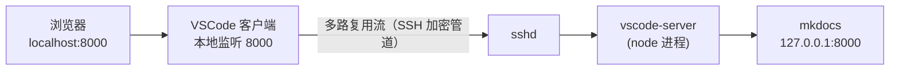

# ps -ef | grep ssh 查不到的端口转发

用 VSCode Remote-SSH 连着开发机写博客，`mkdocs serve` 跑在 8000 端口。本地浏览器打开 `http://localhost:8000` 一切正常——然后我习惯性想看看这个转发是哪个进程干的，在 **服务器** 上敲了 `ps -ef | grep ssh`，什么都没有。

<!-- more -->

端口转发不就是要有个进程守着端口吗？进程呢？这篇说清三件事：服务器上到底有什么，VSCode 的转发跟 `ssh -L` 差在哪，`localhost:8000` 的监听者到底是谁。

## 1. 服务器上到底有什么

两条命令，证据齐了：

```bash
ss -tlnp | grep 8000
ps -ef | grep -i ssh | grep -v grep
```

第一条的输出：监听 8000 的是 mkdocs 自己，跟 ssh 没关系。

```text
LISTEN 0  5  0.0.0.0:8000  0.0.0.0:*  users:(("mkdocs",pid=1275290,fd=3))
```

第二条里 ssh 相关的只有两类：`/usr/sbin/sshd -D ...` 守护进程，和几条 `sshd: root@notty`。`notty` 的意思是这条连接 **没有分配终端**——这就是 VSCode Remote-SSH 建的主连接。

**重点：** 服务器上从头到尾不存在"转发进程"这个角色。想在这台机器上用 ps 找转发，方向从一开始就错了。

## 2. 两条路线：ssh -L vs VSCode 转发

传统玩法是自己起一条带 `-L` 的 ssh：

```bash
ssh -L 8000:localhost:8000 user@server
```

这条命令里，ssh 进程 **自己** 在本地监听 8000。浏览器连上来，ssh 通过 SSH 协议里的 `direct-tcpip` 通道，让服务器侧去连它本机的 8000。转发是协议内建功能，本地 `ps` 能直接看到这条进程，命令行里还带着 `-L 8000:...` 参数。

VSCode Remote-SSH 不是这个路数。它连接时只起 **一条** ssh 主连接，然后把 vscode-server 拉到服务器上跑。之后的端口转发：

- 本地监听 8000 的通常是 VSCode 客户端自己的进程，不是新起的 ssh
- 数据作为多路复用流，塞进那条已经建好的加密通道
- 服务器侧由 vscode-server（一个 node 进程）接住，再去连本机的 8000

一句话概括：`ssh -L` 用的是 ssh 内置的转发功能，VSCode 是在 SSH 管道之上自建了一层应用层桥接协议。

|  | `ssh -L` | VSCode Remote-SSH 转发 |
|---|---|---|
| 本地监听者 | ssh 进程 | VSCode 客户端进程 |
| 服务器侧 | sshd 响应 `direct-tcpip` | vscode-server 接流 |
| ps 里长什么样 | 一条独立的 `ssh -L ...` | 只有一条主连接，命令行无 `-L` |
| 动态加删端口 | 要重连或用 `~C` 转义 | Ports 面板随时加删 |

注意，转发永远是从 **客户端** 向服务器方向发起的，服务器端只是被动响应方——所以在服务器上查，两种方案都查不到"转发进程"。

## 3. 数据怎么流



三个容易误解的点：

- 本地 `ps -ef | grep ssh` 只能看到连接时的那条主连接，它的命令行里 **没有** `-L`——转发是运行时动态加的，不体现在启动参数里。
- ssh 进程对内容无感知，它就是一根加密网线。RPC、文件同步、终端、端口转发全都复用这条管道，靠多路复用流区分归属。
- 转发跟主连接同生共死，网络一抖、笔记本一休眠，端口转发跟着断。

## 4. 验证与延伸

想知道 `localhost:8000` 的监听者到底是谁，在 **本地电脑** 上跑：

```bash
lsof -nP -iTCP:8000 -sTCP:LISTEN
```

会看到 VSCode 相关进程（Code / Code Helper / node），而不是 ssh。

VSCode 能"自动"发现 8000 这个端口，不是玄学：vscode-server 在服务器上会扫描进程和终端输出（`remote.autoForwardPorts`，来源由 `remote.autoForwardPortsSource` 控制），匹配到端口就自动加进 Ports 面板。这个能力只有"在服务器内部有自己人"才做得到——又是桥接架构的红利。

哪天想脱离 VSCode（比如换终端工具），手动 `ssh -L 8000:localhost:8000 user@server` 效果等价，而且这样 `ps` 就查得到了。反向隧道（`ssh -R`）的玩法可以看今天那篇[反向 SSH 隧道踩坑实践](02.md)。

## 小结

一句话：SSH 是加密网线，VSCode 在网线两端各挂了一个自己的端点，端口转发只是这条多路复用管道上的一种流。相当于它内置了一个私有的 frp/tunnel，只不过隧道载体复用 SSH，不另开连接。

各大云 IDE（CloudStudio、Codespaces、`code tunnel`）都是这个套路：自带常驻服务端 + 一条多路复用隧道。下次再在服务器上 `ps` 找不到转发进程，先想想数据是从哪个方向进来的。

---

*最后更新：2026-09-02*
