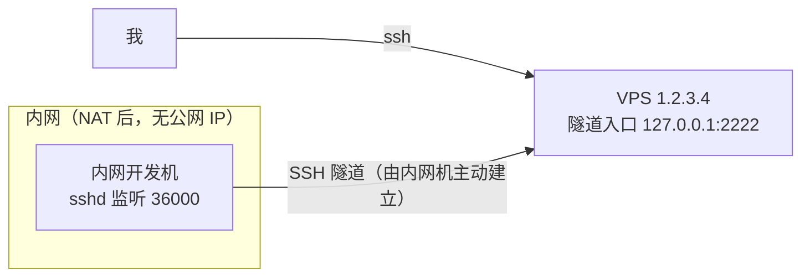

# 用反向 SSH 隧道穿透内网：一次完整的踩坑实践

场景很直接：一台没有公网 IP 的内网开发机，需要随时从外部拿到它的 shell。方案是反向 SSH 隧道（`ssh -R`）+ autossh 守护——零依赖，不用 frp、ngrok 这类额外组件。

本文记录完整实施过程，重点是 7 个真实踩到的坑。其中 pgrep 的 argv[0] 陷阱和 VPS 缺 ClientAlive 导致的僵尸监听，网上几乎查不到像样的说明。

<!-- more -->

## 1. 原理：-L 和 -R 别搞反

这是最容易混淆的地方，核心区别一句话：**监听端口开在哪台机器——`-L` 开在本机，`-R` 开在远端**。其余所有差异都由此衍生，展开对照：

| 参数 | 方向 | 监听端 | 典型用途 |
|------|------|--------|----------|
| `-L`（本地转发） | 本地 → 远端 | 在本机开端口 | 通过跳板机访问远端内网服务 |
| `-R`（远程转发） | 远端 → 本地 | 在远端开端口 | 把本机服务暴露到远端（本文场景） |

两者解决的问题互为镜像：

- `-L`：**我够不着目标，sshd 那边够得着**——借 sshd 的网络出去（例：通过跳板机访问机房内网的数据库）
- `-R`：**sshd 那边够不着目标，我够得着**——借我的网络进来（本文场景：公网够不着内网机，内网机自己够得着自己）

语法结构两者完全相同，都是 `[bind_addr:]port:host:hostport`。最容易搞错的是 `host:hostport` 由谁解析——规则一句话：**监听端口和目标解析，永远分属隧道的两端。**

- `ssh -L 8080:db:3306 user@jump`：监听在本机 8080，连接进来后由 **jump 上的 sshd** 代为连接 `db:3306`，`db` 从 jump 的视角解析
- `ssh -R 2222:localhost:36000 root@vps`：监听在 VPS 的 2222，连接进来后由**内网机上的 ssh 客户端**代为连接 `localhost:36000`，所以 `localhost:36000` 是内网机自己的 36000 端口，不是 VPS 的

理解这一点，方向就不会搞反。

整条链路：



关键点：**隧道由内网机主动向外发起**。内网机能访问公网，公网访问不了内网机，所以让内网机先"伸出一只手"握住 VPS，之后顺着这只手就能走回来。这也是所有内网穿透工具的共同原理。数据流一行说清：

> 外部请求 → VPS 的 127.0.0.1:2222 → VPS sshd → SSH 隧道 → 内网机 ssh 客户端 → 内网机 127.0.0.1:36000

## 2. 动手前先勘察 4 件事

别急着写命令，先花两分钟确认环境，能省掉后面大部分返工。

**① 本机 sshd 实际监听端口：**

```bash
ss -ltnp | grep sshd
```

不要假设是 22。实测这台机器是 36000——容器/云环境很常见的改动。

**② 认证方式：**

```bash
grep -E "^\s*(Port|PermitRootLogin|PasswordAuthentication|PubkeyAuthentication|AllowTcpForwarding|GatewayPorts)" /etc/ssh/sshd_config
```

若 `PasswordAuthentication no`，全程只能走密钥；autossh 后台运行时无法交互式输密码，必须提前配好免密。

**③ 两端 sshd 的转发相关配置：**

| 配置 | 在哪台机器 | 要求 |
|------|-----------|------|
| `AllowTcpForwarding` | VPS | 必须为 yes（一般默认就是），否则 `-R` 直接被拒 |
| `GatewayPorts` | VPS | 决定隧道绑在 127.0.0.1 还是 0.0.0.0（见坑 3） |

**④ systemd 到底能不能用：**

```bash
cat /proc/1/comm              # 不是 systemd 的话，基本可以确定不可用
systemctl is-system-running
```

容器里 systemd 经常是 offline 的，此时写 systemd unit 完全无效，得换 cron 方案（见坑 4）。

## 3. 搭建五步走

### 3.1 安装 autossh

```bash
dnf install -y autossh     # RHEL/TencentOS/CentOS 系
apt install -y autossh     # Debian/Ubuntu 系
```

### 3.2 配密钥——免密是单向的

"本机 → VPS" 免密（本机公钥放进 VPS 的 authorized_keys）不等于 "VPS → 本机" 免密。两个方向是两套独立授权，必须分别配。

实测 VPS 上没有密钥对，直接在 VPS 上生成一把专用密钥：

```bash title="在 VPS 上执行"
ssh-keygen -t ed25519 -f /root/.ssh/id_ed25519_revtunnel -N "" -C "reverse-tunnel@vps"
cat /root/.ssh/id_ed25519_revtunnel.pub
```

把输出的公钥追加到内网机的 `~/.ssh/authorized_keys`。改这个文件前务必备份，配错会把自己锁在门外：

```bash
cp ~/.ssh/authorized_keys ~/.ssh/authorized_keys.bak.$(date +%s)
```

### 3.3 建立隧道：先手动验证，再谈守护

```bash
autossh -M 0 -fN \
  -o ServerAliveInterval=30 \
  -o ServerAliveCountMax=3 \
  -o ExitOnForwardFailure=yes \
  -R 127.0.0.1:2222:localhost:36000 \
  root@1.2.3.4
```

然后从 VPS 回连验证：

```bash
ssh -i ~/.ssh/id_ed25519_revtunnel -p 2222 root@127.0.0.1
```

!!! tip

    先确认这一步能通，再去折腾守护和开机自启。跳步会让后面的排查变成多维问题。

### 3.4 持久化

systemd 可用 → 写 unit，`Restart=always`。systemd 不可用（容器）→ crontab 两条：

```bash
@reboot   /opt/reverse-tunnel/start-tunnel.sh >> /opt/reverse-tunnel/cron.log 2>&1
* * * * * /opt/reverse-tunnel/start-tunnel.sh >> /opt/reverse-tunnel/cron.log 2>&1
```

`@reboot` 管开机，`* * * * *` 管看护。因为脚本幂等，每分钟调一次是安全的。

### 3.5 VPS 侧加别名

```bash title="VPS 的 ~/.ssh/config"
Host local home
    HostName 127.0.0.1
    Port 2222
    User root
    IdentityFile /root/.ssh/id_ed25519_revtunnel
    IdentitiesOnly yes
    ServerAliveInterval 30
    ServerAliveCountMax 3
```

之后在 VPS 上 `ssh local` 即可回连内网机。

## 4. 踩坑记录（本文核心）

7 个坑先表格速览，坑 6、坑 7 最隐蔽，单独展开。

| # | 坑 | 一句话根因 |
|---|----|-----------|
| 1 | sshd 不在 22 端口 | `-R` 目标端口照抄教程写了 22，实际 sshd 监听 36000 |
| 2 | 免密是单向的 | 反向认证是独立授权，VPS 公钥要进内网机的 authorized_keys |
| 3 | 外部连不进 2222 | `GatewayPorts no` 不是障碍是安全特性，默认只绑回环 |
| 4 | systemd unit 不生效 | 容器里 pid 1 是 run，换 cron 承担开机自启和看护 |
| 5 | cron 里脚本没反应 | cron 的默认 PATH 只有 `/usr/bin:/bin`，脚本开头显式 export |
| 6 | 幂等失效起了 6 个进程 | pgrep 的 argv[0] 陷阱：非锚定误匹配，绝对路径又匹配不上 |
| 7 | 断线后重连永远失败 | VPS 缺 ClientAlive，死连接不被回收，僵尸监听占死端口 |

### 坑 1：sshd 不在 22 端口

现象：隧道起来了，但回连 `Connection refused`。本机 sshd 实际监听 36000，而 `-R` 的目标端口照抄网上的教程写了 22。

教训：`-R` 的目标端口必须填 sshd 的实际监听端口。动手前先 `ss -ltnp | grep sshd`——这就是第 2 节把它列为勘察第一件事的原因。

### 坑 2：免密是单向的，反向要另配

现象：隧道建立成功，VPS 上 2222 在监听，但回连报 `Permission denied (publickey)`。

原因：只配了"内网机 → VPS"方向的免密。反向认证是独立的，需要 VPS 的公钥出现在内网机的 authorized_keys 里（即 3.2 那一步）。

其实 `Permission denied (publickey)` 是好消息——说明 TCP 通了、隧道通了、sshd 也响应了，问题仅在认证。三种报错指向完全不同的故障层级，排错时先对号入座：

| 报错 | 故障层级 |
|------|---------|
| `Connection refused` | 链路没建立（隧道进程挂了 / 端口填错） |
| `Connection timed out during banner exchange` | 链路半死，或端口被僵尸监听占着（见坑 7） |
| `Permission denied (publickey)` | 链路正常，只是密钥没配好 |

### 坑 3：GatewayPorts no 不是障碍，是安全特性

现象：想让外部机器直接访问 `VPS_IP:2222`，连不进来。

原因：`-R 2222:...` 不带 bind_addr 时，默认只绑在远端的 127.0.0.1，只有 VPS 自己能连。要绑 0.0.0.0 需显式写 `-R 0.0.0.0:2222:...`，且 VPS sshd 开启 `GatewayPorts yes`。

建议保持默认不要开。回环绑定意味着公网根本访问不到 2222，外网无法借这条隧道进入内网机。想从任何地方直接连？先想清楚是否真的需要——代价是把内网机的 SSH 暴露到公网上，会被扫描和爆破。更安全的做法是：先 ssh 到 VPS，再从 VPS 上 `ssh local`，回环绑定完全够用。

### 坑 4：容器里没有 systemd

现象：写好的 systemd unit 不生效，`systemctl status` 报 `System has not been booted with systemd`。

诊断：

```bash
cat /proc/1/comm                 # 输出 "run" 而非 "systemd"
systemctl is-system-running      # offline
```

解法：用 crond 承担。crond 在容器里通常是活的（`pgrep -a crond` 确认），`@reboot` 做开机自拉，`* * * * *` 做进程看护，等效于 systemd 的 `Restart=always`。

实测自愈效果：杀掉全部隧道进程 → 0 个进程 → 80 秒内 cron 自动拉起 → 回连立即恢复可用。

### 坑 5：cron 的 PATH 很窄

现象：手动执行脚本正常，cron 里执行却什么都没起来。

原因：cron 的默认 PATH 只有 `/usr/bin:/bin`，找不到 `/usr/local/bin` 下的命令，也可能连 HOME 都不是预期值——影响 ssh 找 known_hosts 和密钥。

解法：脚本开头显式设定（见第 5 节脚本头部）：

```bash
export PATH=/usr/local/sbin:/usr/local/bin:/usr/sbin:/usr/bin:/sbin:/bin
export HOME=/root
```

### 坑 6：pgrep 的 argv[0] 陷阱——幂等失效，起了 6 个进程

本次最隐蔽的一个坑，自己写错后才发现。

**现象**：脚本的幂等判断失效，每执行一次就多一个 autossh 进程，最后堆了 6 个 autossh，但只有 1 个 ssh 子进程——其余 5 个因端口被占反复失败重试，空耗资源。

**第一版（错）**——非锚定 pattern 会误匹配到调用脚本的 shell 命令行：

```bash
pgrep -f "autossh.*2222:localhost:36000"   # ✗ 会匹配到 zsh -c '...autossh...2222...'
```

**第二版（也错）**——以为加上绝对路径锚定更严谨，结果完全匹配不上：

```bash
pgrep -f "^/usr/bin/autossh.*2222:localhost:36000"   # ✗ 永远匹配不到
```

**根因**：bash 经 PATH 查找执行命令时，argv[0] 是命令原样写法，不含路径。即脚本里写 `autossh`，bash 实际执行 `execve("/usr/bin/autossh", ["autossh", ...])`，进程 cmdline 是 `autossh -M 0 ...` 而不是 `/usr/bin/autossh -M 0 ...`。

而 autossh 派生的 ssh 子进程恰恰相反——autossh 用全路径 exec 它，cmdline 是 `/usr/bin/ssh -o ...`。两者表现不一致，非常容易搞混。

**正确写法**：

```bash
if pgrep -x autossh >/dev/null 2>&1 \
   || pgrep -f "^/usr/bin/ssh .*${REMOTE_PORT}:localhost:${LOCAL_SSH_PORT}" >/dev/null 2>&1; then
    exit 0
fi
```

- `pgrep -x autossh` 精确匹配进程名，不涉及 cmdline，天然免疫误匹配
- ssh 子进程用 `^/usr/bin/ssh` 锚定，`/bin/zsh`、`/bin/bash` 开头的 shell 命令行不会误命中
- 两个条件取或：既覆盖 "autossh 在跑"，也覆盖 "autossh 挂了但 ssh 成为孤儿进程"

排查时用 `pgrep -af autossh`——`-a` 打印的正是 argv，可以直接看出有没有路径前缀。

### 坑 7：VPS 缺 ClientAlive——端口被僵尸监听占死，重连永远失败

最有价值的一个坑，网上基本没资料讲清楚。

**现象**：隧道突然断了，autossh 自动重连，但日志开始刷：

```text
Timeout, server 1.2.3.4 not responding.
Error: remote port forwarding failed for listen port 2222
Error: remote port forwarding failed for listen port 2222
...（无限重复）
```

VPS 上 2222 确实在监听，但连上去是 `Connection timed out during banner exchange`。隧道再也起不来，只能人工介入。

**根因**：VPS 的 sshd 没有配 `ClientAliveInterval`（OpenSSH 默认 0，即不主动探测客户端死活）。于是：

1. 隧道的 TCP 连接已经断了，但 VPS 的 sshd 无从得知
2. 那个 sshd 会话继续持有 2222 监听（`ss -ltnp` 能看到 sshd 占着端口）
3. autossh 重连上来，新 ssh 请求转发 2222 → 端口已被占 → 配合 `ExitOnForwardFailure=yes` 立刻退出
4. autossh 再次重启 → 再次失败 → 死循环

**解法**：在 VPS 的 sshd 上开客户端存活探测，让死连接能被及时回收：

```bash title="/etc/ssh/sshd_config.d/99-reverse-tunnel.conf"
ClientAliveInterval 30
ClientAliveCountMax 3
```

先校验再 reload（reload 不会断开已有会话）：

```bash
sshd -t && systemctl reload ssh
```

约 90 秒内死会话被回收，2222 释放，重连恢复正常。

!!! tip "关键认知：ServerAlive 和 ClientAlive 是两个方向，缺一不可"

    | 参数 | 配置位置 | 谁发给谁 | 解决什么问题 |
    |------|---------|---------|-------------|
    | `ServerAliveInterval` | ssh 客户端（内网机，用 `-o` 传） | 客户端 → 服务端 | 客户端发现"对端死了"，自己退出，autossh 得以重连 |
    | `ClientAliveInterval` | sshd 服务端（VPS，写进 sshd_config） | 服务端 → 客户端 | 服务端发现"客户端死了"，回收会话、释放被占的转发端口 |

    只配 `ServerAliveInterval` 只能让内网机知道自己断了；没人告诉 VPS 该放手，端口就一直被占着，重连必然失败。两边都配，隧道才真正具备自愈能力。

另外，服务端回收有延迟（约 90 秒），断线后 autossh 会重试若干次才成功，日志里出现短暂的 `port forwarding failed` 是正常的，不必惊慌。

## 5. 完整守护脚本与验证

### 5.1 脚本

`/opt/reverse-tunnel/start-tunnel.sh`：

```bash title="start-tunnel.sh"
#!/bin/bash
# 反向 SSH 隧道：把本机 sshd 暴露到 VPS 的 127.0.0.1:2222
# 建好后，在 VPS 上执行 `ssh -p 2222 root@127.0.0.1` 即可拿回本机 shell。
#
# 安全说明：隧道只绑定 VPS 的 127.0.0.1，公网无法访问 2222 端口。
# 本脚本幂等，重复执行不会起多条隧道，可安全用于 cron 每分钟看护。

set -u

# cron 的 PATH 很窄，显式设定，避免 autossh/pgrep 找不到
export PATH=/usr/local/sbin:/usr/local/bin:/usr/sbin:/usr/bin:/sbin:/bin
export HOME=/root

VPS_HOST="1.2.3.4"
VPS_PORT="22"
VPS_USER="root"

REMOTE_BIND="127.0.0.1"
REMOTE_PORT="2222"
LOCAL_SSH_PORT="36000"   # 本机 sshd 实际监听端口（非默认 22）

DIR="/opt/reverse-tunnel"
LOG="${DIR}/ssh.log"
PIDFILE="${DIR}/autossh.pid"

# 幂等保护：已有隧道在跑就直接退出。两个坑见正文坑 6：
#   1) bash 经 PATH 查找执行时 argv[0] 是 "autossh"（不含路径），不能用 ^/usr/bin/autossh 匹配，
#      改用 pgrep -x 精确匹配进程名；
#   2) 不能用 pgrep -f "autossh.*2222..." 非锚定 pattern，会误匹配调用本脚本的 shell 命令行。
if pgrep -x autossh >/dev/null 2>&1 \
   || pgrep -f "^/usr/bin/ssh .*${REMOTE_PORT}:localhost:${LOCAL_SSH_PORT}" >/dev/null 2>&1; then
    exit 0
fi

export AUTOSSH_GATETIME=0
export AUTOSSH_PIDFILE="${PIDFILE}"

autossh -M 0 -f \
    -o "StrictHostKeyChecking=accept-new" \
    -o "ServerAliveInterval=30" \
    -o "ServerAliveCountMax=3" \
    -o "ExitOnForwardFailure=yes" \
    -o "ConnectTimeout=10" \
    -o "BatchMode=yes" \
    -N \
    -R "${REMOTE_BIND}:${REMOTE_PORT}:localhost:${LOCAL_SSH_PORT}" \
    -E "${LOG}" \
    -p "${VPS_PORT}" "${VPS_USER}@${VPS_HOST}"
```

几个关键参数单独说一下。

**`-M 0`：关掉监控端口。** autossh 传统上用 `-M port` 开一对 TCP 端口做连通性探测。现代做法是 `-M 0` 关闭它，改用 SSH 内建的 `ServerAliveInterval` 做探测——更可靠（走 SSH 协议本身），也少占两个端口、少一层被防火墙拦的风险。

**`-f`：语义和 ssh 的 `-f` 不同。** autossh 的 `-f` 让 autossh 自身在跑 ssh 之前转入后台，且不会传给 ssh。副作用是自动把 `AUTOSSH_GATETIME` 设为 0，ssh 将无法交互式询问密码/口令——所以必须提前配好免密。

**`ExitOnForwardFailure=yes`：** 端口转发失败时立即退出，而不是"警告一下继续连着"。配合 autossh 的重试才有意义：快速失败 → 快速重试 → 最终成功。没有它，会留下一个"连着但没用"的僵尸隧道。

**`StrictHostKeyChecking=accept-new`：** 首次连接自动接受主机指纹并记入 known_hosts，但已记录的指纹变化时仍会拒绝（比 no 安全得多）。用于 cron 这类无人值守场景，避免首次启动卡在交互式确认上。

### 5.2 三个验证

**功能验证——确认连到的是内网机而非 VPS：**

```bash
# 在 VPS 上
ssh local 'hostname; cat /etc/os-release | head -2'
```

必须确认主机名/系统确实是内网机的。这一步能排除"连来连去连回自己"的低级错误。

**幂等测试——连跑多次不能起多条隧道：**

```bash
/opt/reverse-tunnel/start-tunnel.sh
/opt/reverse-tunnel/start-tunnel.sh
/opt/reverse-tunnel/start-tunnel.sh

pgrep -xc autossh                              # 应为 1
pgrep -cf '^/usr/bin/ssh .*2222:localhost'     # 应为 1
ss -tn | grep -c 'VPS_IP:22'                   # 应为 1
```

**自愈测试——模拟崩溃，看能否自动恢复：**

```bash
pkill -x autossh
pkill -f '^/usr/bin/ssh .*2222:localhost:36000'
pgrep -xc autossh              # 确认已归零

sleep 80                       # 等 cron 看护（每分钟一次）
pgrep -xc autossh              # 应恢复为 1
ssh local 'hostname'           # 应能正常拿到 shell
```

实测结果：杀掉后 0 个进程 → 80 秒内自动拉起 → 回连立即恢复。

## 6. 安全与回滚

**安全 5 条：**

1. **保持回环绑定，不要开 GatewayPorts。** 默认只绑 127.0.0.1 意味着公网访问不到隧道入口。开 0.0.0.0 等于把内网机的 SSH 挂到公网入口上，会被扫描和爆破。

2. **用专用密钥，不复用日常密钥。** 便于随时吊销——从内网机 authorized_keys 里删掉那一行即可（加注释标记方便定位）。

3. **改 authorized_keys 前先备份。** 这个文件配错会把自己锁在门外，而内网机可能没有其他入口。

4. **改远程 sshd 配置务必 `sshd -t` 校验后再 reload。** reload 不会断开现有会话，比 restart 安全。

5. **想清楚隧道的生命周期。** 它会持续把内网机的 shell 暴露给 VPS 的持有者——VPS 一旦失守，内网机跟着失守。

**回滚清单**，需要拆除时按顺序清理，漏掉任何一环都可能留下悬空凭据：

```bash
# 1. 停进程
pkill -x autossh
pkill -f '^/usr/bin/ssh .*2222:localhost:36000'

# 2. 清 cron（先备份再过滤，别直接覆盖）
crontab -l > /tmp/cron.bak
crontab -l | grep -v 'start-tunnel.sh' | crontab -

# 3. 删脚本
rm -rf /opt/reverse-tunnel

# 4. 撤销内网机上的授权（别漏，隧道没了它就成了悬空凭据）
grep -v 'reverse-tunnel' ~/.ssh/authorized_keys > /tmp/ak && mv /tmp/ak ~/.ssh/authorized_keys
chmod 600 ~/.ssh/authorized_keys

# 5. 卸载（可选）
dnf remove -y autossh

# 6. VPS 侧清理
rm -f ~/.ssh/id_ed25519_revtunnel{,.pub} ~/.ssh/config
rm -f /etc/ssh/sshd_config.d/99-reverse-tunnel.conf
sshd -t && systemctl reload ssh
```

验证回滚是否干净：

```bash
pgrep -xc autossh                           # 0
ss -tn | grep -c 'VPS_IP:22'                # 0
crontab -l | grep -c start-tunnel           # 0
ssh-keygen -l -f ~/.ssh/authorized_keys     # 只剩原有密钥
```

## 小结

整个折腾时间线：安装 → 配密钥 → 建隧道约 20 分钟；中途遇到坑 7 断线，定位并修复 ClientAlive 后，幂等/自愈验证加完整回滚约 10 分钟。

最值得记住的两点：

1. **`ServerAliveInterval`（客户端侧）和 `ClientAliveInterval`（服务端侧）是两个方向的保活**，只配前者隧道无法自愈——端口会被僵尸监听占死。
2. **`pgrep -f` 匹配时，bash 经 PATH 执行的命令 argv[0] 不含路径，而程序用全路径 exec 的子进程含路径**。写幂等判断时务必用 `pgrep -x` 精确匹配进程名。

最后是排错方法论：SSH 报错自带分层信息——`Connection refused` 是链路没建立，`Connection timed out during banner exchange` 是链路半死，`Permission denied (publickey)` 是链路正常但认证失败。先读报错定层级，再对症下药，比盲猜快得多。

---

*最后更新：2026-09-02*
