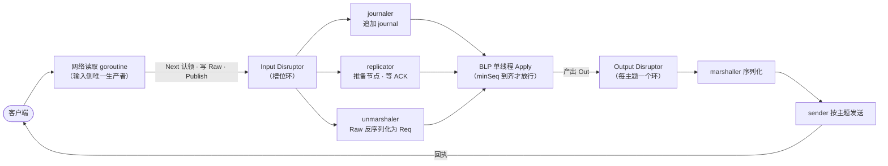

# 六百万 TPS 的单线程：LMAX 架构与 Disruptor 精读

[04-1](./04-1.md) 提过 Disruptor 一句话，[07-1](./07-1.md) 借过它的 availableBuffer，[08-7](./08-7.md) 拿 LMAX 当收官案例——三次点名，三次一行带过。这篇把账还上，标准只有一条：**读完你能自己写出一套**。

先立反常识结论：LMAX 是伦敦的外汇交易所，撮合、账务、风控全跑在 **一个线程** 里，没有数据库。整栋建筑三件套：

```text
网络 → [Input Disruptor] → [Business Logic Processor] → [Output Disruptor] → 网络
      journal+复制+反序列化     （单线程，全内存）            按主题分组发送
```

<!-- more -->

性能来源要分清归因。Fowler 原文给了一条最诚实的曲线：

| 阶段 | TPS | 靠什么 |
|---|---|---|
| 顺序 + 内存，无任何优化 | 1 万 | 基线 |
| 好的代码结构、小方法 | 10 万 | 帮 HotSpot 内联、住进 CPU 代码缓存 |
| 缓存友好集合 + GC 意识 + 性能测试先行 | **600 万** | 工程纪律 |

测试硬件是两路四核 Nehalem、32GB 内存——2011 年的普通服务器。**600 万是单线程业务核心的功劳；Disruptor 的功劳是让管道不拖核心的后腿**。

## 0. 全景：一笔订单的完整旅程

零件是自底向上造的（依赖顺序），但第一次读建议自顶向下：先把整机空跑一遍，知道每个零件装在哪，后面造的时候才不迷路。一笔"卖出 100 万 EUR/USD"的订单，从网卡到回执的数据流：



拆成六站，每站标注负责建造它的章节：

1. **网卡 → 读取 goroutine**。输入侧唯一的生产者（为什么优先单生产者，§2.2 结尾有答案）：`Next` 认领一个槽位，订单原始字节写进 `Raw` 字段，`Publish` 发布（§2）
2. **三个并行消费者领走同一批事件**（§3.3 的 `HandleWith` 接线）：journaler 把 `Raw` 追加进 journal（§4.1）；replicator 把字节推给备节点、坐等 ACK（§5）；unmarshaler 把 `Raw` 反序列化、写进同一槽位的 `Req` 字段。一个槽位多个字段，**每个字段只有一个写者**
3. **BLP 到齐才动手**（§3.3）：三个前置进度取 min——落盘、复制、反序列化没有全部完成的序号，BLP 碰都不碰
4. **单线程核心 Apply**（§4.1）：改内存里的订单簿和账户，产出输出事件写进 `Out` 字段，转投输出环——600 万 TPS 的本体就是这一站
5. **输出侧两跳**（§6）：marshaller 把 `Out` 序列化，sender 按主题发回客户端，回执落地
6. **槽位归还**：处理过的槽位等生产者绕一圈后复用（§1 的借阅纪律）——全程零分配零 GC

六站之间的同步开销只有序列号：生产者发布 cursor、消费者各写各的 gating、BLP 算一次 minSeq，全程没有一个锁。另有两条流不在图上：快照与恢复（§4.2/4.3，每晚低峰和崩溃时才走）、备节点的同流热备（§5，输出丢弃）。

整机跑完了，下面按依赖顺序把每个站点造出来：地基（§1）→ 发布协议（§2）→ 消费者与依赖图（§3）→ 持久化与恢复（§4）→ 复制与切换（§5）→ 总装（§6）。代码全部 Go，骨架忠于 Disruptor 原版，省掉的只有工程化的边角。

## 1. 地基：Sequence 与 RingBuffer

两个最小零件。`Sequence` 是被填充的原子计数器——整套系统的唯一同步原语：

```go title="sequence.go"
type Sequence struct {
    _ [7]int64 // 左垫
    v int64    // 值
    _ [7]int64 // 右垫
} // 120B：值独占缓存行，邻居碰不到（false sharing，见 07.md 注意事项）

func (s *Sequence) Get() int64           { return atomic.LoadInt64(&s.v) }
func (s *Sequence) Set(v int64)          { atomic.StoreInt64(&s.v, v) }
func (s *Sequence) CAS(old, new int64) bool {
    return atomic.CompareAndSwapInt64(&s.v, old, new)
}

// minSeq：起点和一串序号取最小——"最慢的消费者在哪"只此一个问法
func minSeq(start int64, seqs ...*Sequence) int64 {
    m := start
    for _, s := range seqs {
        if v := s.Get(); v < m { m = v }
    }
    return m
}
```

??? note "120 B 是怎么算出来的"

    纯算术：$7 \times 8 + 8 + 7 \times 8 = 120$，`unsafe.Sizeof(Sequence{})` 可验证，`unsafe.Offsetof(s.v)` 是 56。7 不是拍脑袋拍的，是三条约束推出来的：

    1.  行宽 64 B——x86-64 与主流 ARM 的 L1 缓存行大小，也是 Disruptor 原版的设计假设（原版 Java 同样是 7 个 long 夹一个 value）。
    2.  垫多少：`v` 占 8 B，要独占一行，行内其余 $64 - 8 = 56$ B 必须是填充，正好 7 个 `int64`。
    3.  为什么两侧都垫：Go 只保证 `int64` 的 8 字节对齐，**不保证** 结构体起点落在 64 B 边界——Go 没有 `alignas`。`v` 可能落在行内任意 8 字节槽位：贴行尾时，行内前 56 B 得是自己的左垫；贴行头时，后 56 B 得是右垫。两侧各 56 B，才覆盖所有对齐情况。

    充分性一句话：包含 `v` 的那条 64 B 行必然整个落在结构体的 120 B 之内——行里除了 `v` 全是垫；数组里相邻 `v` 间距 120 > 64，永不共行。所以 120 不是魔法数，是公式 **2 × (行宽 - 字段宽) + 字段宽** 代入 64/8 的结果。

    顺带一个边界：Apple M 系列 L1 行宽 128 B，7 个垫在那里不够，得 15+1+15。跨平台代码别照抄 7，按目标机器行宽代入同一个公式。

`RingBuffer` 是预分配的槽位环——**对象只分配一次，永久存活，永不回收**：

```go title="ringbuffer.go"
type Event struct {
    Raw []byte // 网络原始字节：journaler / replicator / unmarshaler 读
    Req Request // 业务对象：unmarshaler 写、BLP 读
    Out OutputEvent // 输出事件：BLP 写、输出侧 marshal 读
}

type RingBuffer struct {
    slots []Event
    mask  int64
}

func NewRingBuffer(sizePow2 int) *RingBuffer {
    return &RingBuffer{slots: make([]Event, sizePow2), mask: int64(sizePow2 - 1)}
}

func (rb *RingBuffer) slot(seq int64) *Event { return &rb.slots[seq&rb.mask] }
```

两个纪律从这里定死，后面全部代码都靠它们：

1. **容量必须取 2 的幂**，`seq & mask` 替代取模（数学细节见 [04-1](./04-1.md) 的 mask 详解）
2. **槽位是借阅，不是赠送**：消费完成后槽位归队列复用，handler 不许留任何指向槽内数据的引用——要保留，先拷贝

!!! tip

    槽位预分配一石三鸟：零分配零 GC 压力（事件是"永久存活"类对象）、缓存行长期驻留 L1/L2、容量即背压。代价是借阅纪律，这是 Disruptor 最容易埋雷的一条。

    雷长这样：

    ```go
    // ❌ 违规：把槽内引用带出 handler
    func (h *Stats) OnEvent(e *Event) { // e 指向 slots[seq&mask]
        h.last = e      // 留下槽位指针
        h.raw = e.Raw   // slice 头是新拷的，底层数组还是槽内那块
    }
    // 生产者转一圈覆盖该槽后：h.last 读到的是别人的新请求——
    // 不 panic、不报错，只在偶现的数据错乱里露头

    // ✅ 合规：要保留，当场拷
    func (h *Stats) OnEvent(e *Event) {
        h.req = e.Req                         // 值字段赋值即拷贝；Req 内含 slice/指针时同样要深拷
        h.raw = append([]byte(nil), e.Raw...) // slice：连底层数组一起复制
    }
    ```

## 2. 发布协议：两种 Sequencer

发布要回答两个问题：**认领哪个槽位**（`Next`）和 **什么时候对消费者可见**（`Publish`）。单生产者和多生产者的答案完全不同，Disruptor 把它们做成一个接口：

```go title="sequencer.go"
type Sequencer interface {
    Cursor() *Sequence                         // 发布边界，消费者看这里
    AddGating(s ...*Sequence)                  // 登记消费者：满环检查用
    Next() int64                               // 认领槽位（满则自旋等待）
    Publish(seq int64)                         // 数据就位后发布
    HighestPublished(lower, upper int64) int64 // 缺口检查，单生产者直接透传
}
```

### 2.1 单生产者：认领界握在自己手里

```go title="single.go"
type SingleProducerSequencer struct {
    bufSize int64
    cursor  Sequence   // 发布边界：唯一由 Publish 推进
    gating  []*Sequence
    claim   int64      // 认领边界：只有生产者 goroutine 碰，普通变量即可
    cached  int64      // 缓存的最慢消费者：避免每次跨核读
}

func (p *SingleProducerSequencer) Next() int64 {
    next := p.claim + 1
    if wrap := next - p.bufSize; wrap > p.cached {
        p.cached = minSeq(p.cursor.Get(), p.gating...) // 缓存失效才跨核
        for wrap > p.cached {
            runtime.Gosched()                          // 满：等最慢消费者让位
            p.cached = minSeq(p.cursor.Get(), p.gating...)
        }
    }
    p.claim = next
    return next
}

func (p *SingleProducerSequencer) Publish(seq int64) { p.cursor.Set(seq) }

func (p *SingleProducerSequencer) HighestPublished(lower, upper int64) int64 {
    return upper // 单生产者发布必然连续：cursor 到哪，哪就是连续就绪
}
```

满环判断就一行：`next - bufSize > 最慢消费者`。要覆盖的槽位上一圈的数据（`next-bufSize`）还没被消费完，就等——**容量即背压**，不需要任何额外的水位信号。`cached` 是 LMAX 的招牌优化：gating 序号很少动，缓存住，只在缓存说"可能满了"时才真正跨核读。

??? note "cached 为什么敢用旧值"

    发布前都要问一句"环满了吗"，答案在 gating Sequence 里——那是 **消费者核心** 在写的变量。§1 垫的 120 B 只保证 `v` 不和邻居共行，读它照样要把整行从对方核心搬过来（MESI 所有权转移，几十到上百 cycle）。发布频率一高，每次都问，"单生产者零协调"的快路径就被这一条读打回原形。

    敢缓存靠两条性质：

    1.  **单调**：gating 只增不减，所以 cached 这份旧快照永远 ≤ 真实的 min(gating)。
    2.  **保守方向**：快路径拿 `wrap <= cached` 放行——下界都放行了，真实值必然放行，绝不会覆盖未消费的槽；`wrap > cached` 只说明 **可能** 满，才付一次跨核读拿真值，真满就 Gosched 让路。

    数字走查（`bufSize = 1024`，某次刷新后 `cached = 4200`）：

    ```text
    发布 5001~5224：wrap = seq-1024，全部 <= 4200
                    → 旧账就能证明槽已释放，224 次发布零跨核读
    发布 5225：     wrap = 4201 > 4200，旧账证明不了
                    → 真读一次 gating，真值 4450，没满，cached 刷成 4450
    发布 5226~5474：wrap 全部 <= 4450 → 又是约 250 次零跨核
    ```

    摊销效果：跨核读的频率从"跟发布速率走"变成"跟环的余量走"——一次刷新包养约 `bufSize - 消费滞后` 次发布。环越有余量，读得越稀；环常年贴满才退化为每次都读，但那种状态本来就该背压等待。快路径全程只碰生产者自己的缓存行：`claim`、`cached`、槽位数据。`claim` 敢用普通 `int64` 不加 atomic，也是同一条纪律：唯一写者不需要同步（[07.md](./07.md)）。

### 2.2 多生产者：CAS 认领 + availableBuffer 补缺口

多生产者下，"认领了"和"发布了"之间有缺口——A 认领了 7 号还在写，B 已经发布 8 号。消费者要是只看认领界就会读到空槽。[07-1](./07-1.md) 路线三留的"availableBuffer"就是治这个的：

```go title="multi.go"
type MultiProducerSequencer struct {
    bufSize   int64
    mask      int64
    shift     uint     // log2(bufSize)：seq >> shift = 第几圈
    cursor    Sequence // 认领边界：CAS 竞争点
    available []int32  // 每格"第几圈已发布"，-1 = 从未
    gating    []*Sequence
}

// Next：CAS 认领一个槽位（演示版每次重读 gating，生产版加 2.1 的 cached）
func (p *MultiProducerSequencer) Next() int64 {
    for {
        cur := p.cursor.Get()
        next := cur + 1
        if wrap := next - p.bufSize; wrap > minSeq(cur, p.gating...) {
            runtime.Gosched()
            continue
        }
        if p.cursor.CAS(cur, next) {
            return cur // 认领成功，槽位号 = cur
        }
    }
}

// Publish：认领 ≠ 发布。数据写进槽位之后，才标记"本圈就绪"
func (p *MultiProducerSequencer) Publish(seq int64) {
    atomic.StoreInt32(&p.available[seq&p.mask], int32(seq>>p.shift))
}

// HighestPublished：把下游推进界从"认领界"收紧到"连续已发布界"
func (p *MultiProducerSequencer) HighestPublished(lower, upper int64) int64 {
    for seq := lower; seq <= upper; seq++ {
        if atomic.LoadInt32(&p.available[seq&p.mask]) != int32(seq>>p.shift) {
            return seq - 1 // 缺口（认领了没发布）：停在这里，FIFO 不跳过
        }
    }
    return upper
}
```

`available` 的取值是 `seq >> shift`——**一个 int32 同时编码"就绪"和"第几圈"**。比较整圈回合数，天然免疫绕圈后的陈旧读：上一圈留下的旧标记，和这一圈的回合数对不上，永远不会误判。这和 [07-1](./07-1.md) per-slot 状态机是同一个思想：序列号不是下标，是绝对位置。

拿 `bufSize = 8` 走一遍（`mask = 7`，`shift = 3`，`available` 初始全 -1）：

```text
第 0 圈发布 seq 5  → available[5] = 0
第 1 圈发布 seq 13 → 还是槽 5，available[5] = 1

问"13 号发布了吗"：available[13&7] = 1，13>>3 = 1，相等 → 已发布
问"21 号发布了吗"：21 还是槽 5、第 2 圈，available[5] = 1 ≠ 2 → 未发布
（若 13 还没发布，格子停在 0 ≠ 1，同样判未发布——旧标记永远对不上这一圈）
```

槽位号绕圈会撞，圈数不会：格子里存的不是"就绪位"，是 **绝对位置的圈数**，上一圈残留的标记天然出局。缺口检查也是同一个比较——A 认领 7 还没发布，`HighestPublished` 扫到 7 发现 `available[7] != 7>>3`，返回 6，消费者停在缺口前，FIFO 不跳过。

!!! tip

    单生产者省掉的东西：CAS、availableBuffer、缺口检查——认领界和发布界重合，发布就是一条 store。**能收敛成单写者的场景，永远优先单生产者**；LMAX 输入侧就是一个网络读取 goroutine，根本用不上多生产者。

白皮书（2011 版）unicast 1P–1C 实测，感受一下这套协议的性价比：

| 指标 | Disruptor | ArrayBlockingQueue |
|---|---|---|
| 吞吐量 | **25.7M ops/s** | 5.3M ops/s |
| 平均延迟 | **52 ns** | 32,757 ns（约 600 倍） |
| 99.99% 分位 | **409 ns** | 2.88M ns（约 7000 倍） |

来源：[Disruptor 技术白皮书](https://lmax-exchange.github.io/disruptor/files/Disruptor-1.0.pdf)，数字随场景浮动，量级是稳的——吞吐 5 倍，尾部延迟差 **三个数量级**。锁的真正账单从来不是平均值，是 P99.99。

## 3. 消费者：Barrier、批量与依赖图

消费者三件套：等待策略、屏障、批量处理器。

### 3.1 等待策略：可插拔的"等"

```go title="wait.go"
type WaitStrategy interface {
    WaitFor(seq int64, cursor *Sequence, deps []*Sequence) int64
}

// 纯自旋：延迟最低、烧核。LMAX 的交易管线用它
type BusySpin struct{}

func (BusySpin) WaitFor(seq int64, cursor *Sequence, deps []*Sequence) int64 {
    for {
        if avail := minSeq(cursor.Get(), deps...); avail >= seq {
            return avail
        }
    }
}

// 自旋 N 次让一步：后台管线用，省核
type Yielding struct{}

func (Yielding) WaitFor(seq int64, cursor *Sequence, deps []*Sequence) int64 {
    for i := 0; ; i++ {
        if avail := minSeq(cursor.Get(), deps...); avail >= seq {
            return avail
        }
        if i&0x3F == 0x3F {
            runtime.Gosched() // 每 64 次 Gosched 一轮
        }
    }
}
```

完整档位（纯自旋 → 让步 → park → 阻塞唤醒）的谱系和各自成本，[08-2](./08-2.md) 拆过，不重复。

### 3.2 Barrier 与批量处理器

```go title="consumer.go"
type Barrier struct {
    seqr Sequencer
    deps []*Sequence // 前置消费者的序号：链式依赖的"闸门"
    wait WaitStrategy
}

// WaitFor：先等"能追到哪"，再被 availableBuffer 收紧到"连续能追到哪"
func (b *Barrier) WaitFor(seq int64) int64 {
    avail := b.wait.WaitFor(seq, b.seqr.Cursor(), b.deps)
    if avail < seq {
        return avail // 队列空
    }
    return b.seqr.HighestPublished(seq, avail)
}

type BatchProcessor struct {
    seq     Sequence // 自己的消费进度：唯一写者是自己
    barrier *Barrier
    rb      *RingBuffer
    onEvent func(ev *Event, seq int64, endOfBatch bool) // 业务回调：装配时注册
}

func (p *BatchProcessor) Run(stop <-chan struct{}) {
    next := p.seq.Get() + 1
    for {
        select {
        case <-stop:
            return
        default:
        }
        avail := p.barrier.WaitFor(next)
        if avail >= next {
            for i := next; i <= avail; i++ {
                p.onEvent(p.rb.slot(i), i, i == avail) // endOfBatch 收口
            }
            next = avail + 1
        }
        p.seq.Set(avail) // 发布进度：生产者据此判断槽位可否复用
    }
}
```

`onEvent` 就是你装配时注册的业务回调——§0 第 2 站的 journaler / replicator / unmarshaler、第 4 站的 BLP，到 §6 里全是传给 `HandleWith` / `After` 的闭包。`Run` 本身只是驱动器：等一批、逐条调回调、批末发布进度，业务逻辑一行不掺。

两个细节是性能的本体：

- **`p.seq.Set(avail)` 在整批处理完之后**。消费者进度一次发布一批，进度发布次数从 O(事件数) 降到 O(批数)——生产者的满环检查、下游消费者的 gating 检查全部因此变便宜
- **`endOfBatch` 是 I/O 收口的钩子**。journaler 拿它在批末尾 fsync 一次，把昂贵的系统调用摊薄到批粒度——这是 journaler 跟得上 600 万 TPS 的直接原因，第 4 节用到

一批 1000 条事件：`onEvent` 执行 1000 次，`seq.Set` 1 次、journaler 的 fsync 1 次——O(事件数) 的处理配 O(批数) 的贵操作，这就是摊薄的含义。

### 3.3 接线：依赖图是一等公民

```go title="wiring.go"
type Disruptor struct {
    rb   *RingBuffer
    seqr Sequencer
    stop chan struct{}
}

// HandleWith：注册一个并行消费者，直接消费 ring buffer
func (d *Disruptor) HandleWith(wait WaitStrategy, on func(*Event, int64, bool)) *BatchProcessor {
    p := &BatchProcessor{barrier: &Barrier{seqr: d.seqr, wait: wait}, rb: d.rb, onEvent: on}
    d.seqr.AddGating(&p.seq)
    go p.Run(d.stop)
    return p
}

// After：注册链式消费者——prev 全部推进到位，才轮到它
func (d *Disruptor) After(prev []*BatchProcessor, wait WaitStrategy,
    on func(*Event, int64, bool)) *BatchProcessor {
    deps := make([]*Sequence, len(prev))
    for i, p := range prev {
        deps[i] = &p.seq
    }
    p := &BatchProcessor{barrier: &Barrier{seqr: d.seqr, deps: deps, wait: wait},
        rb: d.rb, onEvent: on}
    d.seqr.AddGating(&p.seq)
    go p.Run(d.stop)
    return p
}

// Publish：生产者侧两步——先写槽位，后发布（release 语义，07.md 的"发布 + 观察"）
func (d *Disruptor) Publish(ev *Event) {
    seq := d.seqr.Next()
    *d.rb.slot(seq) = *ev
    d.seqr.Publish(seq)
}
```

消费者还能往槽位写字段（unmarshaler 写 `ev.Req`），约束照旧：**每个字段只允许一个消费者写**，依赖图保证读者晚于写者——单一写者原则从队列内部一路贯彻到业务逻辑（[07.md](./07.md)）。

拿总装（§6）的接线跑一遍数字，某一瞬间四个进度可能长这样：

```text
cursor（生产者已发布）= 1000
journal  = 1000    replica = 998    unmarshal = 999

BLP 请求下一批：avail = minSeq(1000, 1000, 998, 999) = 998
→ 环里明明有 1000 条，BLP 只拿到 998
→ replica 没确认的 999、1000，BLP 碰都不能碰
```

依赖图不是性能建议，是硬闸门：任何一条前置卡住，下游就停在 min 上。§5"先复制后处理"的正确性，落地就是这个 minSeq。

一个硬约束：**接线必须先于第一次 Publish**。`AddGating` 改的是生产者的满环检查名单，运行期变更就是数据竞争——真实 Disruptor 同样禁止启动后加消费者。

## 4. 业务核心与持久化：journal、快照与恢复

管道造完，现在造 LMAX 真正的资产：单线程核心 + 事件溯源。

### 4.1 Business Logic Processor：确定性状态机

```go title="blp.go"
type State struct {
    // 订单簿、账户、持仓……全部在内存，2GB 量级装得下 2000 万槽位管线的输入
}

// Apply 必须是确定性的：同一事件序列 → 同一状态转移 + 同一输出
// 这是整个架构的地基：输出不落盘，靠重算再生
func (s *State) Apply(req Request) []OutputEvent {
    // 校验 → 改内存状态 → 产出输出事件（成交、确认、持仓变动……）
    return nil
}
```

确定性有两个推论。其一，**输出事件不记日志**：磁盘只欠输入事件的账，输出丢了重算就有——"journal 只记输入"由此而来。其二，**没有自动回滚**：内存状态跨事件持久，错了就是错了。LMAX 的对策是铁律——先把输入校验干净，再动状态。

journal 本体不用数据库："磁盘是新的磁带"，随机 I/O 是机械盘死穴，顺序追加却快得离谱：

```go title="journal.go"
// 记录格式：len(4B) | crc32(4B) | payload —— 自描述、可校验、崩溃可截断
type Journal struct {
    f *os.File
    w *bufio.Writer
}

var head [8]byte

func (j *Journal) Append(payload []byte) {
    binary.LittleEndian.PutUint32(head[0:4], uint32(len(payload)))
    binary.LittleEndian.PutUint32(head[4:8], crc32.ChecksumIEEE(payload))
    j.w.Write(head[:])
    j.w.Write(payload)
}

func (j *Journal) Sync() error { // 只在 endOfBatch 里调：一批一次 fsync
    if err := j.w.Flush(); err != nil {
        return err
    }
    return j.f.Sync()
}
```

### 4.2 快照：双代文件 + 原子转正

journal 无限增长，重放时间也无限增长——快照是治这个病的（[04-1](./04-1.md) 的 checkpoint 思想）。快照内容 = 序列化的状态 + **journal 已重放到的偏移量**：

```go title="snapshot.go"
// 写法是 08-5 的三步舞：写临时文件 → fsync → rename 原子转正
func (s *State) Snapshot(snapPath string, journalOffset int64) error {
    tmp := snapPath + ".tmp"
    f, err := os.Create(tmp)
    if err != nil {
        return err
    }
    defer f.Close()
    data := s.marshal()
    var head [24]byte
    binary.LittleEndian.PutUint32(head[0:4], snapMagic)
    binary.LittleEndian.PutUint32(head[4:8], snapVersion)
    binary.LittleEndian.PutUint64(head[8:16], uint64(journalOffset))
    binary.LittleEndian.PutUint64(head[16:24], uint64(len(data)))
    f.Write(head[:])
    f.Write(data)
    if err := f.Sync(); err != nil {
        return err
    }
    return os.Rename(tmp, snapPath) // 原子切换：崩溃前，旧快照永远完好
}
```

rename 只保证单文件原子。生产级加固是 **A/B 双代轮换**（BoltDB 双 meta page、[04-1](./04-1.md) 槽位设计的同款）：写 `snap.B` → 校验通过后把"最新指针"指过去；单份损坏退上一代。同时按快照偏移 **轮转 journal 段文件**，快照点之前的段直接删——重放窗口从"全量日志"压回"一段日志"。

### 4.3 恢复：加载快照 + 重放 + 截断

```go title="recover.go"
func Recover(snapPath, journalPath string) *State {
    st, off := loadSnapshot(snapPath) // 校验 magic/version/crc，坏了退上一代
    f, _ := os.Open(journalPath)
    f.Seek(off, io.SeekStart) // 只重放快照点之后

    r := bufio.NewReader(f)
    var head [8]byte
    for {
        if _, err := io.ReadFull(r, head[:]); err != nil {
            break // 尾部不足 8B = 崩溃现场，截断
        }
        n := binary.LittleEndian.Uint32(head[0:4])
        sum := binary.LittleEndian.Uint32(head[4:8])
        payload := make([]byte, n)
        if _, err := io.ReadFull(r, payload); err != nil ||
            crc32.ChecksumIEEE(payload) != sum {
            break // 半条或坏条：crc 失败处截断，之前的全部有效
        }
        st.Apply(unmarshal(payload)) // 重放：状态生效，输出丢弃
    }
    return st
}
```

恢复三步：最近合法快照 → 重放其后的 journal → 半条截断。**崩溃一致性不靠重放过程完美，靠"每条记录独立校验 + 逐条重放天然幂等于校验失败点"**。LMAX 全套重启（JVM 冷启 + 快照 + 重放当天日志）不到 1 分钟。

事件序列还有个隐藏福利：把线上事件流拷到开发环境重放，就是完美的调试器；想跑"按风险排前 20 大客户"这类诊断，起一份领域模型副本即可，不碰生产核心。

## 5. 复制与故障切换

单机靠快照兜不住下午两点的宕机。LMAX 的答案：常驻 **3 个 Business Logic Processor**（主数据中心 2 台 + 灾备 1 台），实时处理同一份事件流。

```text
              ┌─ 主 A（active）：监听客户端，输出被采纳
客户端 ──┤
              └─ 主 B / 灾备 C（hot standby）：处理同一份流，输出丢弃
```

三个设计决策，每个都值得抄：

1. **定序只许一个节点做**。IP 组播到达顺序各节点不同，而确定性要求全局唯一的事件顺序——只有主节点的 replicator 定序后把流推给备节点。这是 [07.md](./07.md) 唯一写者纪律在协议层的投影：**定序者必须唯一，否则没有"同一份流"**
2. **备节点的输入 = 主节点 replicator 的字节流**。备节点自己的输入 Disruptor 照跑（journal、反序列化、Apply 全套），只有输出被丢弃。它永远热着——接管时状态零缺口
3. **复制是 BLP 的前置依赖，不是旁路**。复制的 ACK 必须先于业务处理——否则回执发给了客户、备节点却没收到，宕机即资损。这个"先复制后处理"不用写一行专门代码，依赖图天然表达（第 6 节装配里看）

没有这层 gating 的时间线，一句话就能演完：

```text
10:00:00.000  主 A：处理 #7，回执"已成交"发给客户
10:00:00.001  主 A 宕机——#7 还没复制到主 B
10:00:00.500  主 B 提升为主：状态里没有 #7
→ 客户攥着成交回执，对账对不上
```

gating 把这条时间线从物理上删掉：replica 的序号没过 #7，BLP 的 minSeq 就过不了 #7，回执发不出去。事件要么丢在复制确认之前（客户端超时重发），要么三台都有。

切换流程：心跳超时 → 备节点提升为主 → 开始监听客户端、journal 续写 → 广播"主在听"公告。原话说切换是 **微秒级**——因为热备一直在处理同一份流，接管动作只是"开始采纳自己的输出"。工程上还必须补一条原文没展开的：切主要配租约或仲裁（奇数票），否则网络分区下两主并存，事件顺序就分叉了。

## 6. 总装：从零件到一套 LMAX

六块零件齐了，装配成完整管线——§0 那张数据流图，现在每个节点都有名字和实现了。装配时注意依赖图怎么同时表达了 **性能流水线** 和 **正确性约束**：

```go title="pipeline.go"
bufSize := 1 << 21 // 209 万槽位演示；LMAX 输入 2000 万，输出每主题 400 万

d := NewDisruptor(bufSize, NewSingleProducer(int64(bufSize)))

// 并行组 1：journal / replicate / unmarshal，三个 I/O 密集消费者同时跑
journal := d.HandleWith(BusySpin{}, func(ev *Event, seq int64, eob bool) {
    j.Append(ev.Raw)
    if eob {
        j.Sync() // 一批一次 fsync：丢失窗口 ≤ 一批，I/O 成本摊薄到批粒度
    }
})
replica := d.HandleWith(BusySpin{}, func(ev *Event, seq int64, eob bool) {
    for _, s := range secondaries {
        s.SendWaitAck(ev.Raw) // 同步等 ACK：返回前，下游 BLP 被 gating 挡住
    }
})
unmarsh := d.HandleWith(BusySpin{}, func(ev *Event, seq int64, eob bool) {
    ev.Req = unmarshal(ev.Raw) // 写本槽 Req 字段：此字段唯一写者
})

// BLP：三个前置全部就位才消费。依赖图在这里是正确性约束——
// 回执发给客户之前，事件必须已落盘、已复制、已反序列化
d.After([]*BatchProcessor{journal, replica, unmarsh}, BusySpin{},
    func(ev *Event, seq int64, eob bool) {
        for _, out := range state.Apply(ev.Req) { // 单线程业务核心
            topics[out.Topic].Publish(out)        // 转投输出 Disruptor
        }
    })

// 输入侧生产者：网络读取，唯一 goroutine（单生产者，见 2.1 的理由）
func readLoop(conn net.Conn, d *Disruptor) {
    for {
        d.Publish(&Event{Raw: readMessage(conn)})
    }
}
```

输出侧每个主题一个独立 Disruptor，BLP 是它唯一的生产者，下游一条依赖链：

```go title="output.go"
type Topic struct{ d *Disruptor }

func (t *Topic) Publish(out OutputEvent) {
    seq := t.d.seqr.Next()
    t.d.rb.slot(seq).Out = out
    t.d.seqr.Publish(seq)
}

marsh := t.d.HandleWith(Yielding{}, marshalFn)         // 环 1：序列化
t.d.After([]*BatchProcessor{marsh}, Yielding{}, sendFn) // 环 2：网络发送
```

跑起来之前的参数清单，照着定就行：

| 参数 | LMAX 取值 | 你怎么定 |
|---|---|---|
| 输入槽位 | 2000 万 | 2 的幂；≥ 最坏抖动窗口（GC、网络）内的事件量；20M × 每事件约 100B ≈ 2GB，这就是"全内存"的账单 |
| 输出槽位 | 每主题 400 万 | 同上，按各主题吞吐分 |
| fsync 粒度 | endOfBatch | 一批 = 掉电丢失窗口上限；批越小越安全越慢，乘积权衡 |
| 快照节奏 | 每晚低峰 | 重放预算决定：(当前偏移 − 快照偏移) 的重放时间 |
| 副本 | 主 2 + 灾备 1 | RPO=0 至少双副本收 ACK 才放行 BLP |
| 等待策略 | BusySpin | 交易管线自旋，后台管线让步 |

最后一块拼图是 GC 纪律。Fowler 原文把对象分三类：**短命对象**（young GC 一把收走，无害）、**永久存活对象**（槽位、领域主体，永不回收，无害）、**晋升后死亡的对象**（进老年代占完地盘再死，碎片化触发 compaction，全堆级抖动）。前两类随便造，第三类是唯一要防的。LMAX 的对策朴素到离谱：**每晚重启**，趁低峰清空老年代，热备保证重启期间交易不中断。你写自己的版本时，等价纪律就两条：热路径零分配（槽位复用已替你做到），临时对象活不过一次调用。

## 7. 注意事项

- ⚠️ **槽位是借阅**：handler 返回后槽位随时被复用，不许留指向槽内数据的指针；要保留先拷贝（BLP 把 `Req` 拷进自己的状态机——它本来就必须拷）。这是整套设计最容易埋雷的一条
- ⚠️ **别拿它当快版 ArrayBlockingQueue**：官方 FAQ 原话是不能简单替换。它要求按"生产者 → 依赖图消费者"重组数据流；事件对象复用要求你放弃"每消息 new 一个"的写法
- ⚠️ **600 万 TPS 不是 Disruptor 的功劳**：那是单线程全内存核心的成绩，Disruptor 只负责管道不拖后腿。归因错了，你会把力气花在换队列而不是简化核心上
- ⚠️ **接线先于启动**：`AddGating` 改生产者的满环名单，运行期加消费者就是数据竞争
- ✅ **适用域有边界**：事件相互影响的关联领域（撮合、账务、游戏房间）是甜点区；交易彼此独立的场景，并行多处理器反而省心
- ✅ **TPS 低于几百万不用焦虑**：这套架构余量大到离谱。真正值得抄的是"单线程核心 + 事件溯源"的简单性，而不是把 Disruptor 塞进每个系统

## 小结

造完六层，回头对上本系列的思想地图——每个零件都有出处：

| 你造的零件 | 系列文章 | 本文 |
|---|---|---|
| Sequence + 缓存行填充 | [07.md](./07.md) 唯一写者 + padding | §1 |
| CAS 认领 / per-slot 状态 | [07-1](./07-1.md) 路线三 | §2 |
| 等待策略档位 | [08-2](./08-2.md) | §3.1 |
| 快照双代 + rename 转正 | [04-1](./04-1.md) / [08-5](./08-5.md) | §4.2 |
| crc 截断恢复 | [08-3](./08-3.md) 崩溃一致性 | §4.3 |
| 定序者唯一 / 归并写者 | [07.md](./07.md) / [08-7](./08-7.md) | §5 |

LMAX 的启示从来不是"用 Disruptor 就能 600 万 TPS"。是三步：**把业务核心做到单线程能跑完的简单，并发问题就只剩管道一段；管道用序列号把开销压到缓存行级别；剩下的问题——持久化、复制、恢复——全部交给事件确定性重放**。三层都做完，一台 2011 年的普通服务器就能跑赢当时整个行业的交易系统。你现在手里有全部零件了。

---

*最后更新：2026-09-08*
