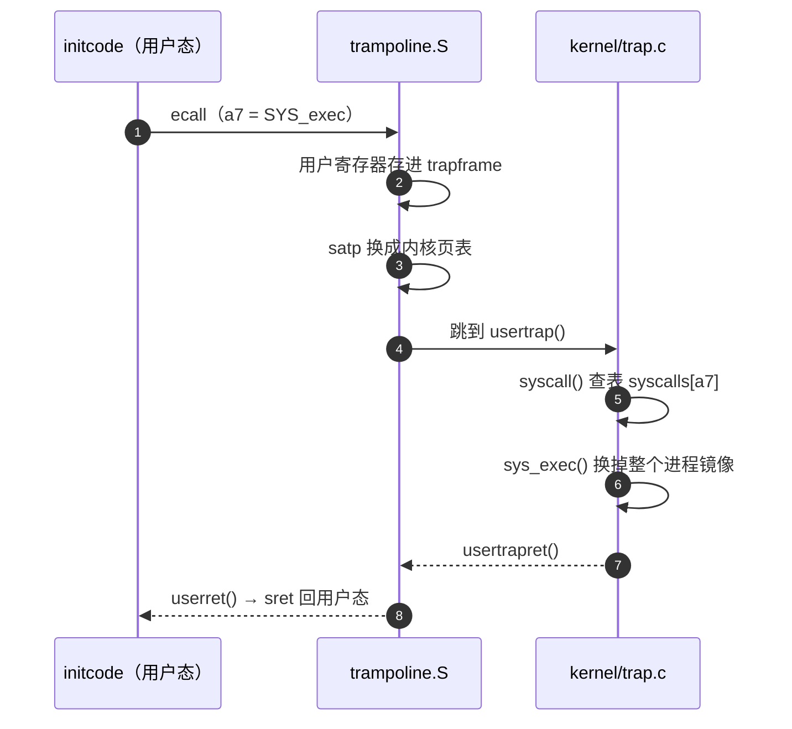

# xv6 学习历程 02 · Ch.2 操作系统组织：宏内核与第一次 ecall

操作系统不是一堆系统调用的集合，而是被三个需求逼出来的形状。Ch.2 就讲这个形状：为什么 xv6 是宏内核、进程在内核眼里长什么样、开机之后第一根调用链怎么从汇编一路走到 `exec`。

<!-- more -->

## 本章脉络

[上一篇](./18.md)在用户态把接口用完了，这一篇迈过 ecall 那条线——但只进半层：不展开任何具体机制（页表、锁、调度各有专章），只看组织方式。

三个需求贯穿全章：

- 多路复用（multiplexing）：CPU、内存被多个进程分时共享
- 隔离（isolation）：进程之间、进程与内核之间互不越界
- 交互（interaction）：隔离不是老死不相往来，read/write、pipe、fd 继承都是受控的交互口

这三件事也贯穿全书：Ch.3 页表是隔离的地基，Ch.6 锁是交互的纪律，Ch.7 调度是多路复用的调度台。

承接上一篇的疑问清单：第 3 条（当前目录）、第 4 条（ecall 之后）、第 5 条（0/1/2 的源头）这一篇回收，其余留给后面的章节。全系列路线图见[索引页](./17.md)。

## 核心概念

### 宏内核 vs 微内核：一个位置问题

系统调用必须进内核态，问题只是：多少代码跟着进去。

xv6 选宏内核（monolithic）：文件系统、驱动、调度、虚存全部编译进同一个内核映像，全部跑在特权态。微内核（microkernel）反过来，只保留最小原语——IPC、地址空间、线程、时钟——文件系统和驱动统统降为用户态服务进程，靠消息传递交互。

微内核更符合隔离的理想：文件系统崩了只是重启一个服务进程。代价是每个 read/write 都要跨几次进程边界，消息传递的开销压不下去。xv6 选宏内核纯粹为了简单，教学代码经不起消息层的包装。

!!! tip "真实世界的答案"
    Linux 是宏内核，Windows NT 是混合内核。微内核的旗帜 seL4 拿形式化证明了实现正确，却主要活在安全关键领域。工程上，快和稳常常赢过纯。

### 进程：struct proc 和一台状态机

内核眼里的进程，就是 `kernel/proc.h` 里的一条记录（节选）：

```c
struct proc {
  struct spinlock lock;
  enum procstate state;        // UNUSED/USED/SLEEPING/RUNNABLE/RUNNING/ZOMBIE
  int pid;
  struct proc *parent;
  uint64 sz;                   // 用户内存大小
  pagetable_t pagetable;       // 用户页表
  struct trapframe *trapframe; // 保存的用户寄存器
  struct context context;      // 内核线程自己的寄存器
  struct file *ofile[NOFILE];  // 打开文件表
  struct inode *cwd;           // 当前目录
  char name[16];
};
```

上一篇的几个悬念在这里落地：Ch.1 的 fd 表就是 `ofile` 数组，fd 是它的下标；`cd` 的机关就是 `cwd` 这个指针——当前目录是进程私有状态，chdir 改的就是这个字段。

状态机也在这：UNUSED → USED，之后在 SLEEPING/RUNNABLE/RUNNING 之间流转，exit 后停在 ZOMBIE——尸体留着，只为把退出状态递给父进程的 wait。

用户地址空间长这样：0 起是 text/data，`sz` 是堆顶；exec 还会顺带放一页 guard（撞上就崩）加一页栈；顶端两页固定钉着 trampoline 和 trapframe，是 Ch.4 的伏笔，先记住位置。

### CPU 的三件行李

每个 CPU 核也有自己的私有状态：`stvec`（trap 入口指针）、`sepc`（trap 时保存 PC）、`sscratch`（跨特权级倒手的暂存格）。另外每核还藏着一个调度器线程——所有进程都睡着时，CPU 总得有个东西在跑。

## 源码走读

### 启动：从 entry.S 到 main

QEMU 用 `-bios none` 起动，CPU 从 0x80000000 直接跑 `kernel/entry.S`：给每个 hart 扣一个栈，跳进 `start()`。`start()` 还在 M 态，干三件事——把 mepc 设成 main、mstatus 的 MPP 设成 S 态，然后 `mret`，落进 S 态的 `main()`。

`main()` 的初始化序列是一张藏宝图（`kernel/main.c`，节选）：

```c
void
main()
{
  if(cpuid() == 0){
    consoleinit();      // UART 控制台
    printfinit();
    kinit();            // 物理页分配器
    kvminit();          // 内核页表
    kvminithart();      // 打开分页
    procinit();         // 进程表
    trapinithart();     // 内核 trap 向量
    binit();            // 文件系统 buffer cache
    iinit();            // inode 表
    fileinit();         // 文件表
    virtio_disk_init(); // 磁盘驱动
    userinit();         // 第一个进程
    // ...
  }
  scheduler();
}
```

顺序就是依赖：先有内存分配，才能建页表；先有页表，才能进用户态。xv6 默认 `-smp 3`，另外两个 hart 在 `started` 标志上自旋等待，等 hart 0 初始化完再各自就位。

### 第一个进程：生命周期只有一句话

`userinit()` 造出第一个进程，全部用户代码就 8KB 的 `user/initcode.S`：

```asm
# exec(init, argv)
.global start
start:
        la a0, init
        la a1, argv
        li a7, SYS_exec
        ecall          # 陷入内核

# exec 成功不会返回，返回了就 exit
        li a7, SYS_exit
        ecall

init:
  .string "init\0"
argv:
  .long init
  .long 0
```

第一个进程的一生只为一句话：把自己 exec 成 init。init 打开 console 再 dup 两次凑齐 0/1/2，然后 fork 出 shell——上一篇疑问清单第 5 条，结案。

### 第一次系统调用：全链路



分发表就是 Ch.1 那三行桩代码的终点站（`kernel/syscall.c`，节选）：

```c
static uint64 (*syscalls[])(void) = {
  [SYS_fork]   sys_fork,
  [SYS_exit]   sys_exit,
  [SYS_wait]   sys_wait,
  [SYS_exec]   sys_exec,
  /* ... */
};

void
syscall(void)
{
  int num = p->trapframe->a7;
  if(num > 0 && num < NELEM(syscalls) && syscalls[num]){
    p->trapframe->a0 = syscalls[num]();   // 返回值写回 a0
  } else {
    p->trapframe->a0 = -1;
  }
}
```

上一篇疑问清单第 4 条在这里走通了一半：用户侧的 a7 进了内核，被函数指针表消费，返回值从 a0 回去。剩下的一半——寄存器怎么存、页表怎么换、sret 前后发生了什么——是 Ch.4 的正餐。

## 动手实验

### 实验 1：给启动序列打点

在 `main()` 的关键调用之间临时插 printf，比如 `kvminithart()` 之后加一句 `printf("paging on\n");`。`make qemu` 重跑，输出顺序就是依赖顺序：分配器先于页表，页表先于进程。十几行打点，比读十遍源码记得牢。

### 实验 2：gdb 抓第一次系统调用

```text
$ make qemu-gdb
(gdb) b syscall
(gdb) c
(gdb) n
(gdb) p num
$1 = 7
```

断在 `syscall()`，走到 num 赋值之后打印：7，对照 `kernel/syscall.h` 正是 SYS_exec——initcode 那条 ecall，全内核的第一声。

### 实验 3：亲手解剖 ZOMBIE

在 `kernel/proc.c` 的 `exit()` 里状态切换处临时加一行 `printf("proc %d -> ZOMBIE\n", p->pid);`，然后跑 xv6 自带的 zombie 程序：

```bash
$ zombie
```

子进程退出时打印 ZOMBIE，父进程却在死循环 `sleep(1)`，永远不 wait——尸体就这么躺着。上一版疑问清单第 2 条回收一半：僵尸是"退了但没人收"的状态；孤儿则会被过继给 init，init 的循环 wait 是全系统的兜底收尸人。

## 疑问清单

1. **调度器线程**怎么切换到进程？swtch 保存和恢复的到底是什么？—— Ch.7 调度
2. **trampoline 和 trapframe** 为什么必须钉在用户地址空间顶端、两个页表还要映射同一份？—— Ch.3 页表与 Ch.4 trap
3. **计时器中断**从哪来、怎么逼 CPU 让出？—— Ch.5 中断与 Ch.7 调度
4. **struct proc 自带锁**：多核同时分配进程怎么办？锁的获取顺序怎么定才不死锁？—— Ch.6 锁
5. **真机与 QEMU 的差距**：xv6 用 `-bios none` 从 M 态自己起跳，真机上有 SBI/OpenSBI 固件，这层差异工业界怎么处理？—— 待确认，列入扩展阅读

## 小结

Ch.2 把"组织"两个字讲实了：三个需求逼出宏内核，struct proc 承接 Ch.1 的所有伏笔（fd 表、cwd、trapframe），第一次 exec 的全链路把用户态和内核态缝在一起。

下一篇：Ch.3 Page tables——Sv39 三级页表、内核地址空间长什么样、页表怎么撑起进程隔离，顺便回收"fork + exec 为什么不浪费"的另一半答案。

---

*最后更新：2026-09-18*
