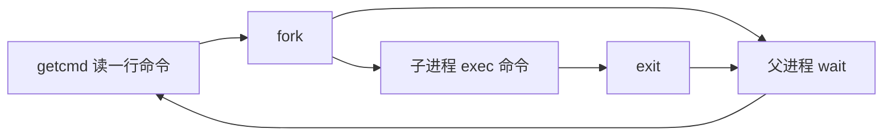

# xv6 学习历程 01 · Ch.1 操作系统接口：进程、fd 与管道

xv6 这本书的第 1 章有点反常：讲操作系统，却一行内核代码都不进。它从最顶层开始——shell 和系统调用接口，先把"用户视角"讲透。这一篇就站在这个视角，把进程、文件描述符、管道三样东西摸一遍。

<!-- more -->

## 本章脉络

[上一篇](./17-1.md)跑通了 `make qemu`，手里已经有一个能敲命令的操作系统。Ch.1 的策略是先当用户：shell 是全书第一个被读的程序，后面八章都是在给这一章的接口补实现。全系列的路线图和进度收在[索引页](./17.md)。

全章主线一句话：操作系统给进程三个抽象——CPU、内存、文件描述符；进程用系统调用访问它们。接口还有另一半：安全。用户态跑不了特权指令，系统调用是唯一合法入口——这扇门怎么修，Ch.2 之后才展开。

还有一个容易忽略的事实：xv6 的 shell（`user/sh.c`）只是个普通用户程序，不是内核的一部分。这也是 Unix 的祖训之一。



shell 的主循环就这么转。下面拆开看每个原语。

## 核心概念

### 进程：fork / exec / exit / wait

进程 = 一份私有内存（代码、数据、栈）+ 一个"独占 CPU"的错觉。错觉两个字划重点，怎么制造错觉是后面几章的事。

四个系统调用，各司其职：

- `fork`：复制出一个自己。父子进程从同一点继续跑，靠返回值区分身份——子进程拿到 0，父进程拿到子进程的 pid
- `exec`：把当前进程的内存整个换成一个新程序。不新建进程，pid 不变，成功就不返回
- `exit`：退出，留下退出状态
- `wait`：父进程收尸，取回子进程的退出状态

书里的 fork + exec 组合拳，简化后长这样：

```c
int pid = fork();
if (pid == 0) {                        // 子进程
    char *argv[] = { "echo", "hello", 0 };
    exec("echo", argv);                // 成功的话不会走到下一行
    fprintf(2, "exec failed!\n");
    exit(1);
}
int cpid = wait((int *) 0);            // 父进程：等孩子退出
printf("child pid = %d\n", cpid);
exit(0);
```

**重点：** fork 和 exec 分开，不是历史包袱。中间留出的空档正是 shell 插重定向的机会窗口。Windows 的 CreateProcess 把"建进程、换程序、设 I/O"打包成一个十几个参数的调用；Unix 拆成三步，每步可以单独观察、单独失败。现代 Unix 后来补了 vfork、posix_spawn 这类折中方案，但 fork/exec 的心智模型没变过。

### 文件描述符：0、1、2 之外全是约定

fd 就是个 int，索引进程私有的打开文件表。0 = stdin、1 = stdout、2 = stderr，是 Unix 世界最大的公约数——所有程序都默认从 0 读、往 1 写，所以谁都能被"接上"。I/O 只有 read/write 两个动词，终端、文件、管道在程序眼里一律是字节流。

两条继承规则值得单独记：

- `fork` 会复制 fd 表：父子共享同一份文件 offset，一起 read 是接力不是重复
- `open` 各开新表项，各自有各自的 offset

重定向没有任何特殊系统调用，机关全在"open 永远返回最小可用 fd"：

```c
if (fork() == 0) {
    char *argv[] = { "cat", 0 };
    close(0);                      // 腾出 0 号槽位
    open("input.txt", O_RDONLY);   // 拿到的一定是 0
    exec("cat", argv);
}
```

cat 从头到尾不知道自己的 stdin 换了人。`dup` 干的是同类活——把已有 fd 复制到指定槽位，管道会用到它。

### 管道与文件系统

`pipe(p)` 返回一对 fd：p[0] 读、p[1] 写。和"写临时文件再读回来"比：

- 没有文件名冲突和清理问题，数据不落地
- 两端天然并行；缓冲区满了写阻塞、空了读阻塞，同步是白送的

```c
int p[2];
pipe(p);
if (fork() == 0) {          // 子进程跑 wc
    char *argv[] = { "wc", 0 };
    close(0);
    dup(p[0]);              // 读端接管 stdin
    close(p[0]);
    close(p[1]);            // 写端必须关，否则 wc 等不到 EOF
    exec("wc", argv);
}
close(p[0]);                // 父进程：往写端灌数据
write(p[1], "hello pipe\n", 11);
close(p[1]);                // 关写端，EOF 送达
```

wc 打印 `1 2 11`：1 行、2 个词、11 字节。中间那句 close(p[1]) 是新手高频翻车点——子进程手里攥着写端不放，读端永远等不到文件尾。

!!! warning "管道翻车第一现场"
    `wc` 卡住不动，十有八九是某个进程还开着写端。数一遍 close，比怀疑管道本身有用。

文件系统侧，这一章给了 `mkdir`、`link`、`unlink` 三个原语。inode 挂着引用计数：link 让新名字指向同一个 inode，rm 只是 unlink——计数归零才真正释放数据。mv 的本质就是 link + unlink。

## 源码走读

shell 的主循环全在 `user/sh.c`，去掉错误处理不到 30 行：

```c title="user/sh.c" hl_lines="17-22"
int
main(void)
{
  static char buf[100];
  int fd;

  // 兜底：确保 0、1、2 三个 fd 开着
  while((fd = open("console", O_RDWR)) >= 0){
    if(fd >= 3){
      close(fd);
      break;
    }
  }

  // 读一行，跑一条
  while(getcmd(buf, sizeof(buf)) >= 0){
    if(buf[0] == 'c' && buf[1] == 'd' && buf[2] == ' '){
      // chdir 必须父进程自己调，不能丢给子进程
      buf[strlen(buf)-1] = 0;  // 去掉换行
      if(chdir(buf+3) < 0)
        fprintf(2, "cannot cd %s\n", buf+3);
      continue;
    }
    if(fork1() == 0)
      runcmd(parsecmd(buf));   // 子进程：解析并执行
    wait(0);                   // 父进程：收尸
  }
  exit(0);
}
```

最值得停下来的是 `cd` 分支。chdir 改的是本进程的当前目录，丢给子进程执行，子进程一退，目录改动就跟着蒸发。所以 shell 把 cd 自己吃掉，父进程亲自执行——这是理解"状态属于进程"的第一课。

!!! tip "接口即契约"
    shell 重定向、管道串联、后台任务，全靠 fd 约定拼装。程序之间不认识彼此，但都认识 fd，这就是接口设计的力量。

系统调用在用户侧的样子也顺路看一眼。`user.h` 里只有声明，真正的桩代码由 `usys.pl` 生成到 `usys.S`：

```asm
.global fork
fork:
 li a7, SYS_fork   # 系统调用号放进 a7
 ecall             # 陷入内核
 ret
```

三行汇编就是用户态的全部。ecall 之后 CPU 干了什么，Ch.4 拆 trap 时细说。

## 动手实验

### 实验 1：验证 fork 的复制语义

新建 `user/forkdemo.c`：

```c
#include "kernel/types.h"
#include "user/user.h"

int
main(void)
{
  int pid = fork();
  if(pid == 0){
    printf("child : getpid = %d\n", getpid());
    exit(0);
  }
  printf("parent: fork = %d, getpid = %d\n", pid, getpid());
  wait((int *) 0);
  exit(0);
}
```

在 `Makefile` 的 `UPROGS` 列表里加一行 `$U/_forkdemo\`，`make qemu` 后运行：

```text
$ forkdemo
parent: fork = 4, getpid = 3
child : getpid = 4
```

父进程打印的 fork 返回值，和子进程打印的 getpid 相等——一个函数返回两次，名不虚传。两行谁先谁后不一定，fork 之后就是两个独立进程在赛跑。

### 实验 2：重定向与管道

```bash
$ echo hello pipe | wc
1 2 11
$ echo hi > f
$ cat < f
hi
```

`cat < f` 和 `cat f` 输出一样，机制完全不同：前者 cat 的 stdin 被换成文件 f，cat 自己毫不知情。fd 约定的好处就在这——程序不用关心自己连着谁。

### 实验 3：link 与引用计数

```bash
$ echo x > a
$ ln a b
$ rm a
$ cat b
x
```

rm 之后 b 还在，因为 inode 引用计数没归零。文件的生命由计数决定，而不是名字。

### 实验 4：pingpong —— 量一次往返的价钱

书里讲管道时埋了个题眼：两个进程用管道互发字节，可以量出上下文切换的开销。写出来是 `user/pingpong.c`——父进程发一个字节，子进程收到后原样发回，父进程收到算一次 **exchange**（往返）；程序在约 3 秒内尽可能多地做 exchange，最后报「每秒多少次」。

一个程序，五件事。

**一、两条管道，不是一条。** `pipe()` 是单向的：`fd[0]` 只读、`fd[1]` 只写。一条管道让父子都往里写、都从里读，就会读到自己发的字节，还得额外约定区分来源。两条管道——`ping`（父→子）与 `pong`（子→父）——拼出一个全双工通道，逻辑最干净。

**二、fork 之后必须关掉多余的端口。** fork 复制出子进程时，父子各自都握着全部 4 个 fd。用不到的一端不关，后果有两个：EOF 传不到——父进程就算关了 `ping[1]`，只要子进程手里还留着自己那份，管道就被认为「还有写者」，子进程的 `read` 永远不返回 0，直接卡死；其次是描述符浪费、语义混乱。所以父子各自只保留自己方向的两端：

```c
// 子进程：只读 ping、只写 pong
close(ping[1]);
close(pong[0]);
```

```c
// 父进程：只写 ping、只读 pong
close(ping[0]);
close(pong[1]);
```

**三、子进程只做回声。** 收到什么发回什么，`read` 用 `== 1` 作条件，顺带把 EOF 处理了：

```c
while(read(ping[0], &b, 1) == 1){
  if(write(pong[1], &b, 1) != 1){
    printf("pingpong: child write failed\n");
    exit(1);
  }
}
```

`read` 返回 0 就是 EOF——父进程关了写端，该收摊了。

**四、父进程先写后读，锁步推进。** 父发一个、等一个，子收一个、发一个，两个进程严格交替，**不需要任何锁**：

```c
do {
  for(int i = 0; i < BATCH; i++){
    write(ping[1], &byte, 1);
    read(pong[0], &byte, 1);
  }
  exchanges += BATCH;
  elapsed = uptime() - start;
} while(elapsed < BENCH_TICKS);
```

两个细节是为测量服务的：

- **跑固定时长**（`BENCH_TICKS = 30`，约 3 秒），不是固定次数——机器快慢不影响测量时长
- **每 1000 次（`BATCH`）才读一次时钟**：`uptime()` 是系统调用，每次都读会干扰被测对象本身

**五、终止不靠约定，靠状态。** 父进程在**刚完成一次 read 之后**关掉 `ping[1]`：此刻子进程必然停在 `read(ping[0])` 上等数据，没有在途的 `write`——不会出现「往一个没有读者的管道里写」。子进程读到 EOF 退出，父进程 `wait` 收尸，再关 `pong[0]`：

```c
close(ping[1]);   // 子进程的 read 将看到 EOF
wait(0);
close(pong[0]);
```

**怎么读结果。** `uptime()` 返回的是时钟 tick 数，约 10 tick/秒，所以：

$$ \text{每秒往返} = \frac{exchanges \times 10}{elapsed} $$

打印时用 `elapsed / 10` 和 `elapsed % 10` 把 tick 拼成「3.1 秒」这样的人话。实测（QEMU/TCG 纯模拟）：

```text
pingpong: 10000 exchanges in 31 ticks (~3.1 seconds)
pingpong: 3225 exchanges/second
```

3.1 秒 10000 次往返 ≈ **3225 次/秒**：单次往返约 **310 微秒**，其中含**两次进程切换**（父→子、子→父）与两次管道读写——折算下来单次切换约 155 微秒。这个数字明显偏大，因为整台机器是 QEMU 纯模拟；KVM 或真机上会低一个量级。

五件事合起来一句话：**两条单向管道拼出往返通道，锁步驱动，EOF 收尾，固定时长测量。**

!!! tip "benchmark 的三条纪律"
    这个程序真正值得抄的是测量姿势：**被测对象要纯**（只做收发）、**观察动作要贵**（时钟批量采样）、**时长要固定**（跨机器可比较）。三条放到任何性能测量上都成立。

把 `$U/_pingpong\` 加进 `Makefile` 的 `UPROGS`（照实验 1 的做法），`make qemu` 后运行：

```bash
$ pingpong
```

??? note "完整源码 user/pingpong.c"
    ```c
    //
    // pingpong: bounce a byte between two processes over a pair of pipes,
    // one pipe for each direction, and measure how many round-trip
    // exchanges per second the kernel can sustain.
    //
    // The parent writes a byte into the "ping" pipe; the child reads it and
    // writes it back on the "pong" pipe.  One complete round trip is one
    // exchange.  Using two pipes (instead of one) gives a full-duplex
    // channel, so the two processes never have to worry about reading back
    // their own byte.
    //

    #include "kernel/types.h"
    #include "kernel/stat.h"
    #include "user/user.h"

    // Run the benchmark for about this many clock ticks.  One tick is
    // roughly 1/10 of a second, so 30 ticks is about 3 seconds: long enough
    // to smooth out the coarse clock, short enough not to be annoying.
    #define BENCH_TICKS 30

    // Number of exchanges to perform between reads of the clock.  Reading
    // the clock is a system call, so sampling it on every single exchange
    // would perturb what we are trying to measure.
    #define BATCH 1000

    int
    main(void)
    {
      int ping[2];   // parent -> child
      int pong[2];   // child  -> parent
      char byte = 'P';

      if(pipe(ping) < 0 || pipe(pong) < 0){
        printf("pingpong: pipe failed\n");
        exit(1);
      }

      int pid = fork();
      if(pid < 0){
        printf("pingpong: fork failed\n");
        exit(1);
      }

      if(pid == 0){
        // Child: echo every byte it receives straight back to the parent.
        // It exits when the parent closes the write end of the ping pipe,
        // which turns its read into EOF (a return value of 0).
        char b;

        close(ping[1]);   // child only reads from the ping pipe
        close(pong[0]);   // child only writes to the pong pipe

        while(read(ping[0], &b, 1) == 1){
          if(write(pong[1], &b, 1) != 1){
            printf("pingpong: child write failed\n");
            exit(1);
          }
        }

        close(ping[0]);
        close(pong[1]);
        exit(0);
      }

      // Parent: drive the exchanges and time them.
      close(ping[0]);   // parent only writes to the ping pipe
      close(pong[1]);   // parent only reads from the pong pipe

      uint start = uptime();
      uint elapsed = 0;
      uint exchanges = 0;

      do {
        for(int i = 0; i < BATCH; i++){
          if(write(ping[1], &byte, 1) != 1){
            printf("pingpong: parent write failed\n");
            exit(1);
          }
          if(read(pong[0], &byte, 1) != 1){
            printf("pingpong: parent read failed\n");
            exit(1);
          }
        }
        exchanges += BATCH;
        elapsed = uptime() - start;
      } while(elapsed < BENCH_TICKS);

      // Tell the child to stop: closing the ping pipe makes its read see
      // EOF.  We have just finished a read, so the child is blocked in
      // read() and will not race us with a pending write.
      close(ping[1]);
      wait(0);
      close(pong[0]);

      if(elapsed == 0)
        elapsed = 1;   // guard against division by zero if the clock is coarse

      // elapsed is in ticks and there are about 10 ticks per second.
      uint per_sec = exchanges * 10 / elapsed;

      printf("pingpong: %d exchanges in %d ticks (~%d.%d seconds)\n",
             exchanges, elapsed, elapsed / 10, elapsed % 10);
      printf("pingpong: %d exchanges/second\n", per_sec);

      exit(0);
    }
    ```

## 疑问清单

1. **fork + exec 分离** 看着浪费（先复制进程再整个换掉），为什么 Unix 不合并成 spawn？COW（写时复制）怎么让 fork 变便宜？—— Ch.3 页表
2. **孤儿进程** 谁回收？子进程退出没人 wait 会怎样？—— Ch.2 的第一个进程 init
3. **当前目录存在哪**？chdir 改的到底是什么数据？—— Ch.2 的进程结构
4. **ecall 之后**，a7 里的调用号怎么变成内核函数调用？—— Ch.4 trap 全链路
5. **最初的 0/1/2** 是谁打开的？sh.c 的 while 循环只是兜底，源头在哪？—— Ch.2 的 init 与 Ch.5 的控制台驱动

## 小结

Ch.1 不讲实现，只立契约：进程是抽象，fd 是索引，管道是字节流。shell 用不到 30 行的主循环把它们拼成日常命令行，接口的克制程度可见一斑。

下一篇：[02 · Ch.2 操作系统组织](./18-1.md)——终于进内核了，看 xv6 怎么组织代码、第一个进程从哪来、系统调用从哪条路走进来。

---

*最后更新：2026-09-18*
