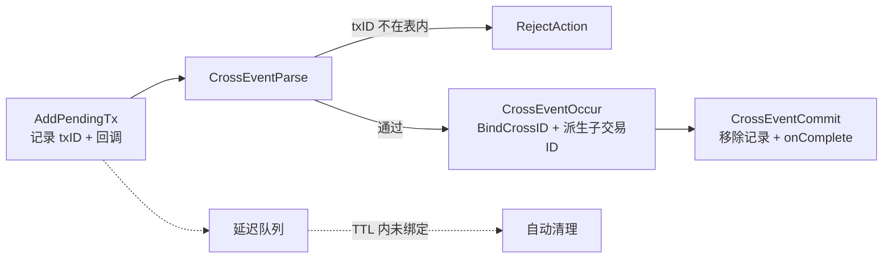

# 从全量遍历到 O(1)：跨链交易追踪器的三次手术与两处隐患

跨链 SDK 里有个不起眼但要命的组件：交易追踪器。业务方发起一笔跨链交易，SDK 记下 txID 和一个完成回调；跨链事件流转回来后，用 crossID 把记录捞出来，回填子链执行结果，提交完成时连结果带回调一起还给业务方。

这张表说穿了就是 `map[string]*record`。早期版本一张 map、一把 RWMutex、一个每 5 秒全量扫描的清理协程——小流量下岁月静好，直到在途记录怼上几十万条（分片 map 的预分配就是按 50 万量级给的），三个症状一起爆。做了三次手术后，读写清理全部 O(1)；但拿内存模型把终版代码重新审计一遍，又挖出两处隐患。

<!-- more -->

## 症状

三层，一层比一层深：

1. **锁竞争**：所有读写挤一把 RWMutex，高并发提交时延迟抖得没法看
2. **索引错配**：记录按 txID 存，事件却拿 crossID 来问——只认一把钥匙，另一把来了就得全表扫
3. **清理失控**：每 5 秒全量遍历一次，记录数涨多少，单次清理就贵多少

还有最隐蔽的一个：交易发出去了、跨链事件永远没回来的 **孤儿记录**，没人删它，内存只涨不降。

## 根因：三个问题缠在一起

表层诊断是"清理任务写挫了"。不成立：全量扫描再怎么优化也是 O(n)，规模涨它就跟着涨，扫描本身就不是答案。

本质是三件事纠缠：**竞争**（读写都过一把锁，锁成了串行点）、**查询**（txID 和 crossID 是同一笔交易的两个名字，只按一个建索引，另一个就得扫）、**生命周期**（孤儿记录不是 bug 是业务现实——对端不响应，记录永远停在 pending，必须有 TTL 兜底）。

三个问题拆开，各挨一刀。

## 手术一：拆锁——以及为什么不用 sync.Map

```go title="hook.go"
type txShard struct {
    mu      sync.RWMutex
    records map[string]*TracterRecord // txID -> record
}

func (t *CrossTxTracker) getTxShard(txID string) *txShard {
    hash := hashString(txID) // DJB 变体，h*33+c 写成移位加法
    return t.txShards[hash%uint32(t.shardCount)]
}
```

哈希取模把读写打散到 `shardCount` 个分片，默认 16。为什么不用现成的 `sync.Map`？Go 官方文档写明了它的两个舒适区：**一次写入多次读取**的只增缓存，或 **多 goroutine 读写不相交的 key 集**。这个工作负载恰好全是反面：add、bind、回填、remove，key 在批量流转。落到 `sync.Map` 的慢路径上（内部退化成 dirty map 加锁），还不如自己拿普通 map 分片。

两个数字有讲究：

- **分片数取 CPU 核数的 2-4 倍**：单次操作的锁等待期望约正比于 $(C-1)/S$（C 个并发核心、S 个分片）——分片翻倍，期望减半；过了 4C 收益递减，而每多一个分片就是一把锁加一个 map 对象，局部性还在变差。顺带一提，shardCount 是变量，`%` 会编译成除法指令；固定为 2 的幂后换 `hash & (shardCount-1)`，收益小但白捡
- **预分配 `500000/shardCount`**：每片约 3 万容量。不预分配的话，满载时每片要经历约 15 次 double 扩容，每次扩容都是一次 rehash

## 手术二：双向索引——锁序契约

```go title="hook.go"
type crossShard struct {
    mu            sync.RWMutex
    crossIDToTxID map[string]string // crossID -> txID
}
```

查询走两跳：crossShard 拿 txID，txShard 取 record，全程 O(1)。

死锁靠一条纪律防住：两套分片各持各的锁，**任何路径都不嵌套持有**。有意思的是两条删除路径方向相反——`RemovePendingTx` 先删 tx 再删 cross，`RemoveRecordByCrossID` 先删 cross 再删 tx。顺序相反却都不死锁，因为从头到尾没有同时握着两把锁。中间态也无害：crossID 映射已删而记录还在的窗口里，并发查询在第一跳就拿到空、直接返回，逻辑上等于"已删除"。

!!! note "看起来是竞态，其实安全"

    `RemovePendingTx` 解锁后才读 `record.CrossID`，在临界区外面。推演一遍：所有对 CrossID 的写都持有同一把锁；记录此刻已从 map 删除，不可能再有新写入者；先前写入者的 unlock 按互斥锁全序关系 happens-before 我们的 lock 获取，加上程序序，读到的一定是终值。安全。这种"看着像 race"的案子，裁决依据都是 Go 内存模型——展开见 [写了不等于看得见](./08.md)。

但这套结构里藏着一个真正可打的窗口，见下。

### 隐患一：清理与绑定的 TOCTOU

延迟队列的清理决策链是：`GetItem` 取记录 → `IsCompleted()` 为 false → `RemoveItem` → `RemovePendingTx` **无条件删除**。在"判定未完成"和"执行删除"之间，如果一桩 CrossEventOccur 恰好插进来完成了 `BindCrossID`，这条 **已绑定、跨链流程正在跑** 的记录就被清理协程删了。后果：后续 commit 事件查无此记录，`onComplete` 永远不触发——业务方的回调凭空蒸发。

竞态要同时满足"TTL 已到期"和"恰好此刻绑定"两个条件，概率低，但低概率乘上高吞吐就是必然发生。修法是让清理路径改成条件删除，在临界区内复查：

```go title="修复示意"
shard.mu.Lock()
record, ok := shard.records[txID]
if !ok {
    shard.mu.Unlock()
    return
}
// 已绑定说明跨链流程在途，删除权让给 commit 路径
if record.CrossID != "" {
    shard.mu.Unlock()
    return
}
delete(shard.records, txID)
shard.mu.Unlock()
```

复查放进锁内，判定和删除原子化，窗口直接关死。

## 手术三：延迟队列——只看队首的底气

清理不再扫表。`AddPendingTx` 时 txID 入队，后台 ticker 每 5 秒调一次 `Cleanup()`，按代码注释的策略 **只检查队首元素**：到期就删，没到期就收手。

只看队首为什么成立？TTL 全局统一，期限 = 创建时间 + TTL，**期限单调于入队顺序**——队首永远是最老的，队首没到期，后面全员没到期。一次只处理一个元素，清理成本与总量无关。备选方案都有硬伤：逐条挂 timer 会在百万级记录下压垮 runtime；堆按期限排序要多付 O(log n) 的 push；只在访问时惰性过期则治不了"再也不被访问"的孤儿。

清理判据 `IsCompleted()` 只看 `CrossID != ""`——**判"业务有没有接手"，不判"存了多久"**。绑定即免责，队列只收孤儿。这个判据选得准，但正是它引出了隐患二，后面说。

### typed nil：一个 `return` 两种语义

```go title="hook.go"
func (t *CrossTxTracker) GetItem(id string) DelayQueueItem {
    shard := t.getTxShard(id)
    shard.mu.RLock()
    defer shard.mu.RUnlock()
    record := shard.records[id]
    if record == nil {
        return nil // 为什么必须显式？
    }
    return record
}
```

接口值是（动态类型，值）二元组。`record` 是 nil 的 `*TracterRecord`，直接 `return record` 得到的是"非 nil 接口包着 nil 指针"：队列侧 `item == nil` 判 false，以为拿到了有效记录，接下来 `item.ID()` 在 nil 接收器上解引用，当场 panic。只有 `return nil` 产出的才是真 nil 接口。

这和 [上一篇](./29-1.md) 里 `atomic.Value` 存接口的 panic 同根：**Go 在具体类型与接口语义的缝隙上，从不替你做转换**，两头都要自己兜。

### IsCompleted 无锁读，算不算数据竞争

清理协程读 `record.CrossID` 时不持任何锁，而这个字段的写在 txShard 锁内——教科书式的可疑现场。追一遍 happens-before 链：

1. `BindCrossID` 在 `txShard.mu.Lock()` 内写入 CrossID
2. 清理协程的 `GetItem` 对同一把锁做 `RLock()`——内存模型保证第 n 次 Unlock happens-before 第 n+1 次 Lock 成功返回
3. `IsCompleted` 在 `GetItem` 返回之后、同一 goroutine 内按程序序执行

链路成立，不是 race。但脆：整条链 **完全依赖队列经 `GetItem` 拿记录** 这一条调用路径，谁绕开 GetItem 直接拿指针，链就断。要么把 CrossID 换成 atomic 值，要么按隐患一的修法在删除临界区内复查——一次加固，两个问题一起治。

## Hook 串起生命周期——被吞掉的 error

tracker 对外的形态是一个 Hook，挂在 `BeforeEventHandle` / `AfterEventHandle`，订阅 Parse、Occur、Commit 等事件，用 `ContinueAction` / `RejectAction` 决定事件去留。



三个协议细节：

**Parse 是门禁。** CrossEventParse 在 Before 阶段校验 txID 存在性，查无此 tx 直接 Reject——外来事件进不来；同一 txID 重复投递的幂等问题，则由绑定阶段的 CAS 接手。

**CAS 保证绑定只成一次。** 重复的 CrossEventOccur 并发到达，只有一个能赢下 `BindCrossID` 里的 `CompareAndSwap`，其余拿到 "tx is processing"。顺带说一句：本文件内 Processing 的所有写入都在锁内，原子操作并非为这条路径服务，而是给未来跳过锁的代码留活口。

**error 被吞，控制流要编码进 action。** hook 框架的契约是：hook 返回非 nil error，只记日志、事件继续流转。所以失败时的正确姿势是 `RejectAction + nil error + 手动打日志`——"拒绝"编码在 action 里，error 只当诊断信息。任何忽略你返回值的框架，等于逼你另找信道表达控制流。

!!! warning "隐患二：失败路径不回滚，真泄漏"

    `BindCrossID` 成功 → `completeCrossEvent` 失败 → RejectAction。此时记录已完成绑定：CrossID 已置位，`IsCompleted()` 恒为 true，**延迟队列永远不会收它**；而被拒的事件也走不到 commit。这条记录常驻内存，`onComplete` 永远不触发——判据选"是否绑定"，失败路径就得负责解绑，否则判据从保护变成漏洞。

    修法：completeCrossEvent 失败时回滚——删 crossShard 映射、清 CrossID、重置 Processing，把记录还回 pending 态交给 TTL：

    ```go title="修复示意"
    delete(crossShard.crossIDToTxID, crossID) // 按锁序契约单独持锁删
    record.CrossID = ""
    record.SubTxs = nil
    atomic.StoreInt32(&record.Processing, 0)
    ```

    更保守的做法是给 IsCompleted 加"绑定时刻 + 上限"的第二重判据，绑定过的记录也有寿命上限。

## 注意事项

- ⚠️ **typed nil**：返回接口的函数必须显式 `return nil`，别顺手返回 nil 具体指针
- ⚠️ **Stop 必须幂等**：channel 关两次直接 panic，`sync.Once` 是标准答案
- ⚠️ **吞 error 的框架**：控制流编码进 action，error 只做诊断
- ✅ **判生命周期不判年龄**：TTL 收孤儿，不收在途交易；判据与回滚必须成对出现
- ✅ **可观测性别省**：GetStats 的 added / removed / bound / committed / expired / pending / queue_length 七个指标，孤儿率一眼可见

## 小结

三次手术对应三个根因：**竞争拆锁，查询建索引，生命周期交队列**。`DelayQueueStore` 接口只暴露 Get / Remove 两个方法，"怎么存"归 tracker、"何时清"归队列，清理策略独立于存储结构演进。

但这次复盘最大的产出不是三次手术，而是拿内存模型审计出的两处隐患——它们都藏在 **模块接缝上**：清理与绑定之间隔了一次不加锁的判定，绑定与失败之间缺了一段回滚。自己写的代码，要用审查别人代码的力度再审一遍，尤其是接缝。

分片这条线连着读：[上一篇](./29-1.md) 拆同一套 SDK 里 `atomic.Value` 存接口的 panic；[一个交集，三种写法](./29.md) 讲分片缺失交易查询的三版演进；内存模型的系统展开见 [写了不等于看得见](./08.md)。

---

*最后更新：2026-09-29*
