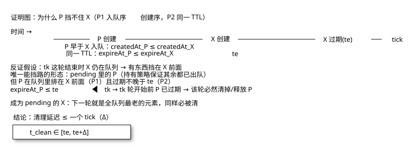
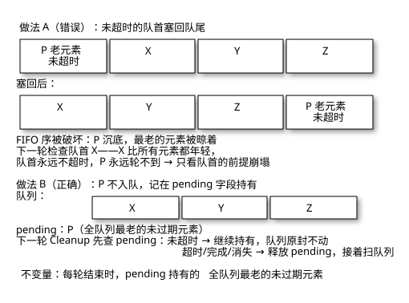
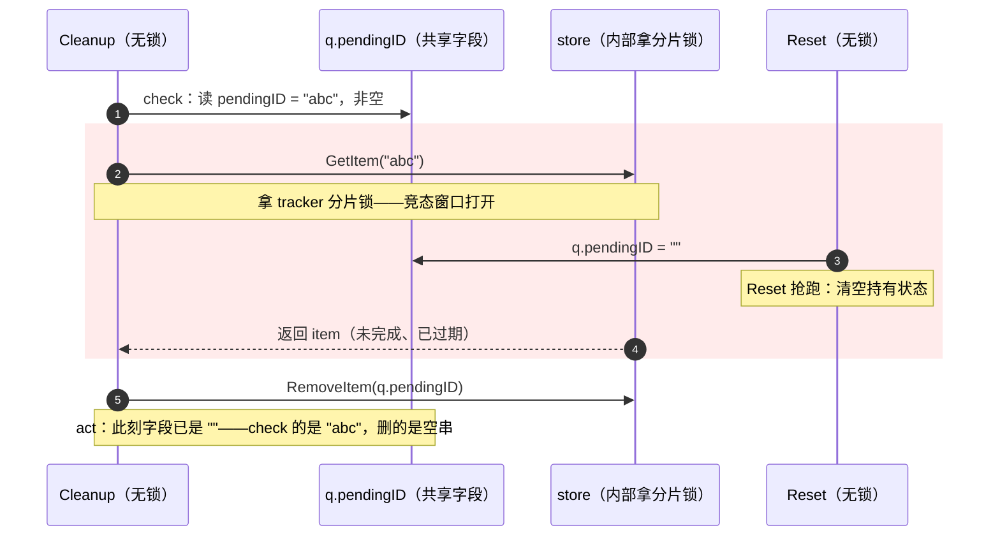

# 不用堆的延迟队列：一条决策链，和链上炸出的 panic

给过期记录做清理，教科书答案是最小堆或时间轮。shard-fusion-sdk 的根包里偏不——一个分段切片 FIFO，每 5 秒醒来只看队首一个元素。

这篇先铺地基——延迟队列是什么、谁在用、业界有哪些机制，把你送到选型的门口；然后沿这个队列的 **设计决策链** 走：每一环都是上一环逼出来的——凭什么敢 O(1)（语义让步）→ O(1) 的前提谁来担保（证明）→ 前提破了会怎样（panic 实测）→ 并发约束如何环环相扣（git 考古）。结构本身的拆解（分段切片、三层回收）另写了一篇 [队列的内存演进史](./30.md)，本文不重复。

<!-- more -->

## 延迟队列是什么，谁在用它

普通队列是即进即出：`Push` 完马上能 `Pop`。**延迟队列** 的元素多带一个"到期时间"——到期之前不许处理，到期之后才轮到它。生活里的对照：普通队列是食堂打饭，延迟队列是取药——"半小时后再来"。

这个"半小时后再来"撑起了后端一大类需求：

1.  **订单超时**：下单 15 分钟未支付自动关闭，释放库存。
2.  **重试退避**：调用失败后等 1s、2s、4s 再重试——定时唤醒的是未来的自己。
3.  **会话与缓存 TTL**：登录态、本地缓存到期自动失效。
4.  **心跳超时检测**：连接多久没心跳就判定半开。

本项目是第四类的一个变体，场景值得说细——**跨链交易追踪**。SDK 提交一笔跨链交易后，记录下 `{txID, 回调信息}`，等跨链网关的回执来绑定 crossID，绑定即完成。问题在异常路径：对端宕机、回执丢失、流程异常退出——这些交易 **永远等不到绑定**。记录没人删，而追踪器的分片 map 是按 50 万条预估的，只涨不跌。

所以这个场景需要的其实是"延迟"里最朴素的一种：**TTL 清理**——给每条记录一个生存时间，到期自动删掉。它不需要"到期把元素交给谁"，只需要"到期让它消失"。

## 业界的四种机制

"到期再处理"这个需求，业界沉淀了四种机制，各有自己的形状：

**每元素一个定时器**。`time.AfterFunc(d, fn)` 到点即触发，最精确、最好懂。但 runtime 的 timer 本身就存放在一个四叉小顶堆里——海量 timer 意味着海量小对象和堆调度开销。几十个 timer 很优雅，几十万个是灾难。

**最小堆**。全局按到期时间维护偏序：插入 $O(\log n)$，取队首 $O(1)$。Java 的 `DelayQueue`、Redis 的 `zset` 都是这一族。它的隐含立场是 **到期投递**——到点把元素取出来交给消费者，所以必须严格维护"谁最早到期"。

**时间轮**。环形槽数组 + 指针每 tick 走一格，槽里挂任务链表。插入 $O(1)$，代价是精度受槽宽限制（槽宽 1s 就没有 500ms 的精度）。Kafka、Netty、Linux 内核都在用，是海量定时任务的正统答案。

**全量扫描**。不建任何索引，周期性地把所有记录扫一遍，过期的删掉。最简单，每轮 $O(N)$——记录少时它就是最好的方案，记录多时它是灾难。

四种机制没有优劣，只有和需求的匹配度。选型要做的，是把本场景的需求特征一条条列出来，去和机制的代价对表——这是下一节的事。

## 决策一：方案怎么考虑——需求倒推，排除法

TTL 清理场景的需求特征，四条：

1.  **到期动作是删除，不是投递**——没有消费者等在另一头，队列自己就是终点。
2.  **精度只要 tick 级**——晚 5 秒删和准点删，没有任何业务差异。
3.  **入队序 ≈ 创建序**——交易提交的顺序就是记录创建的顺序，天然单调。
4.  **容量洪峰不可预估**——上游是用户请求，没法背压，50 万条得自己扛。

拿这四条对表：全量扫描先死（第 4 条，每轮 50 万次读白干）；每元素一个 timer 死得更惨（runtime 里 50 万个 timer 节点）；时间轮呢？它解决的是"海量任务 + 精确唤醒"，可第 1、2 条已经说了我们既不投递也不要求精确——为用不上的能力付复杂度，不值。

最有意思的对照物在这个仓库里：`cross/module/tolerance` 包躺着一个 **堆版** `DelayQueue`。为什么两个版本共存？重构评估报告给了组织层面的答案：`cross/module` 是跨链复用子系统，不在 SDK 收口范围内——两套实现是两次独立决策的化石，不是设计矛盾。化石摆在一起，语义分界线看得格外清楚：

| 维度 | tolerance 堆版 | 根包 FIFO 版 |
| :--- | :--- | :--- |
| 到期动作 | 投递给消费者 | 自己调 `RemoveItem` 删除 |
| 唤醒模型 | 阻塞等待（`time.After` + wakeC） | 定时轮询（5s tick） |
| 插入序假设 | 无，堆自维护偏序 | 必须 ≈ 过期时间序 |
| 单次 Push | $O(\log n)$ sift | $O(1)$ 均摊 |
| 到期检查 | $O(\log n)$ pop | $O(1) 只看队首 |
| 消费者缺失 | 背压：`C <-` 阻塞，后续全部滞留 | 无此概念 |

一句话概括：**堆版是延时投递——到期把元素交给别人；FIFO 版是 TTL 清理——到期自己动手删**。

这条分界线决定了选型自由度。投递模型必须有人接盘：`Poll` 是单协程，阻塞在 `q.C <- min` 上时，后续到期元素全部滞留在堆里。投递还要求"该醒的时候醒"——堆版的 `Push` 只在堆从空变非空时才发 `wakeC`，堆非空时 push 进一个更早到期的元素，等待中的 `Poll` 不会被唤醒：不漏投递，但延迟上界变成旧堆顶的剩余 delta。唤醒的精确性是投递语义自带的税。

清理模型把这些税全免了：队列自己就是终点，没有消费者、没有背压、没有唤醒——**晚一个 tick 删掉毫无影响**。正是这一让步，把偏序维护的 $O(\log n)$ 让没了。

## 决策二：O(1) 的账本，实测对账

机制的形状上文盘过了，这一节只算钱。场景不变量：50 万条预估容量，TTL 默认 5 分钟，每 5 秒清理一轮。上一节四种机制的死法，落到数字上——全量遍历每轮白扫 50 万次、50 万个 timer 的 runtime 开销、最小堆每插入 19 次比较外加 `HeapItem` 指针分配，都是 **每轮都要付** 的钱。

FIFO 版的立足点是一个观察：**记录按创建顺序入队、共用同一 TTL，先入队的先过期——FIFO 队列天然就是按过期时间排好序的**。于是过期检查退化为只看队首。

理论账是"与队列总长无关"，实测对账（Go 1.24，假 store 单 map，仓库代码原样拷贝）：

| 场景 | 实测耗时 | 说明 |
| :--- | :--- | :--- |
| 50 万条堆积、队首未过期 | **2.35µs** | O(1) 路径：查一次 store，直接返回 |
| 朴素全量遍历同规模 map | **117.8ms** | 每轮固定成本，且本轮命中 **0 条** |
| 50 万条全部过期 | 229.7ms | 最坏情况，但只发生一次，清完就没了 |

三个数字讲完整个故事：**2.35µs 对 117.8ms，五个数量级**；对照组最讽刺的是"命中 0"——洪峰刚过的每一轮全量遍历都在白干；最坏情况的 229ms 是一次性成本（洪峰集中过期那一轮付一次），均摊到队列生命周期可忽略。

账本的隐含条款照旧要念：入队序必须近似创建序。tracker 里 `Push` 紧贴着 `createdAt: time.Now()` 执行，天然满足；复用这个队列的人得自己担保。

## 决策三：只看队首，证明它不漏

"队首没过期就收工"听起来像赌博，其实是个可证明的命题。前提三条：

- **P1** 入队序 = 创建序（Push 紧贴 createdAt）
- **P2** 所有元素共用同一 TTL（热更新窗口见决策五）
- **P3** 每轮 tick 都执行 Cleanup

命题：任何元素从过期到被清理，延迟不超过一个 tick。

反证。设元素 X 在 $t_e$ 时刻过期，$t_k$ 是 $t_e$ 之后的第一轮 tick。假设该轮结束时 X 仍滞留队列，说明有东西挡在它前面。由持有策略的设计，唯一能挡路的形态是 pending——被"持有"的队首 P。推理链如下图：

{ .diagram }

由 P1 有 $\text{createdAt}_P \le \text{createdAt}_X$，由 P2 有 $\text{expireAt}_P \le t_e < t_k$，即 P 在本轮开始前就过期了，本轮必然被清掉或释放——矛盾。所以 X 要么本轮被清，要么成为 pending；成为 pending 的 X 在下一轮就是全队列最老的元素，同样必被清。

$$
t_{\text{clean}} \in [\,t_e,\ t_e + \Delta\,], \quad \Delta = \text{tick 间隔}
$$

顺带把乱序的后果说精确：P1 被破坏时，年轻元素可以挡在老元素前面。**不漏**——轮到它总会被清；但延迟上界从 $\Delta$ 退化为挡路者的剩余寿命，理论上无界。乱序不破坏正确性，只破坏延迟承诺。

### 持有策略：不变量的守护者

证明里用到了持有策略，展开说。未超时的队首为什么不塞回队尾？两种做法对照：

{ .diagram }

塞回去，它会排到所有后来者之后——FIFO 序当场被破坏，下一轮检查的是别人的队首，最老的元素反而被晾着，"只看队首"的整个前提崩塌。所以不塞回去，记在 `pending` 字段里持有：下轮先查 pending，超时、完成或从 store 消失才释放，然后继续处理队列。

```go title="delay_queue.go" hl_lines="8-12"
if pending := q.getPending(); pending != nil {
    item := q.store.GetItem(pending.id)
    if item == nil || item.IsCompleted() {
        q.clearPending() // 不在了/已完成：释放
    } else if time.Now().After(pending.expireAt) {
        q.store.RemoveItem(pending.id)
        atomic.AddInt64(&q.totalExpired, 1)
        q.clearPending() // 超时：删除并释放
    } else {
        return false // 未超时：继续持有
    }
}
```

于是 Cleanup 多了一条不变量：**每轮结束时，要么队列为空，要么 pending 持有的是全队列最老的未过期元素**。上面的证明正是踩在这条不变量上通过的。

## 决策四：内存结构，和链上炸出的 panic

分段切片的结构、三层回收（槽位/段/外层）、为什么选 1024 槽 16KB——这些在 [队列的内存演进史](./30.md) 里拆透了，此处不重复。本文只讲那条决策链上独有的发现：**O(1) 的账本和内存的账本，在收缩路径上撞出了 bug**。

### Cleanup 路径上实测炸出的 panic

决策二 benchmark 的"50 万全部过期"场景，跑的不是手动 `Pop`，是 `Cleanup` 正常业务路径——第一轮就当场爆炸：

```text
场景1  50万未过期堆积, 单轮 Cleanup: 2.34µs (O(1) 路径)
panic: runtime error: makeslice: cap out of range

goroutine 1 [running]:
main.(*DelayQueue).Pop(...)
main.(*DelayQueue).Cleanup(...)   ← 业务路径，不是边缘用法
```

这不是"极端用法才踩得到"的 bug——**洪峰集中过期正是这个队列的设计内场景**。根因在 `Pop` 的收缩分支：

```go title="delay_queue.go" linenums="174" hl_lines="3"
if q.headSeg > 0 && q.headSeg < len(q.segments)-1 {
    newSegments := make([][]string, len(q.segments)-q.headSeg, cap(q.segments)/2+1)
```

`make` 的第二参是长度（剩余段数），第三参是容量（外层容量的一半 + 1）。Go 要求 **cap ≥ len，否则 panic**。堆积到几百段时，剩余段数远超外层容量的一半，`make(488, 342)` ——当场炸。最小满载触发点：8 段压满再消费 1024 条（`make(7, 5)`）。

修复是三行钳制，容量下限保到剩余段数：

```go title="修复"
remain := len(q.segments) - q.headSeg
newCap := cap(q.segments)/2 + 1
if remain > newCap {
    newCap = remain // cap 不许小于 len
}
newSegments := make([][]string, remain, newCap)
```

打补丁后回归：50 万堆积清 30 万、2000 轮交错（累计 600 万次 Push）稳定，上节的完整三组实测也是补丁后跑出来的。

### 为什么单测没拦住：状态空间的两个区域

比 bug 本身更值得拆的是 **它为什么活过了测试**。写个交错压测——push 一批、pop 一批、循环两千轮——怎么都炸不出来。因为交错测试和堆积测试落在队列状态空间的 **两个不同区域**：

1.  **交错区**（push/pop 交替）：每段很快耗尽，外层 `len` 始终在 2-4 段徘徊，收缩分支从不进入危险区。
2.  **堆积区**（push 远快于 pop）：外层涨到几百段。危险条件 $\text{len} - \text{headSeg} > \text{cap}/2 + 1$ 只在这里成立——首次段耗尽即中。

单测的用例几乎全是交错区——因为"push 一堆再慢慢消费"看起来不像并发测试，倒像性能测试，没人往单测里写。而堆积恰是 tracker 的常态：它的分片 map 预估容量就是 50 万。**测试盲区不在覆盖率数字里，在状态空间的分区方式里**：一个数据结构的每个"不变量区域"（这里是 len 与 cap 的比例区间）都该有自己的用例，交错测试全绿说明不了堆积区的任何事。

## 决策五：并发，三段演进用 git 坐实

并发部分不是一步到位的。这个仓库只有两次 commit，但配合评估报告和 CHANGELOG，三段演进每段都有实物证据。

### 第一段：三处裸访问（git 初版实锤）

初版 commit（`e3cef38`）的结构体：

```go title="初版 delay_queue.go"
pendingID       string    // 持有的元素ID
pendingExpireAt time.Time // 持有元素的过期时间
ttl             time.Duration
```

git 考古的完整竞态面——三个入口裸读写，而 `Push`/`Pop` 持锁：

- `Cleanup`：读 `pendingID` → 调 `store.GetItem` → 写 `pendingID`（check-then-act，无锁）
- `Reset`：`q.pendingID = ""`（无锁）
- `SetTTL`：写 `ttl`（无锁）

评估报告把它记为 P1-2：`Cleanup()` 未持锁读写 `pendingID/pendingExpireAt`，而 `Pop()`/`Push()` 持锁——竞态风险。注意这个 check-then-act 不是理论风险：`Cleanup` 在 `GetItem`（拿 tracker 分片锁）期间，`Reset` 可以把 `pendingID` 清空，回来后 `RemoveItem` 删的就是空 ID。

把这条时间线摊开——竞态窗口正是 `GetItem` 拿 tracker 分片锁的耗时区间：



### 第二段：stateMu——存在过，但只活在文档里

评估报告的处理结果表记录了第一版修复：新增 `stateMu` 保护持有元素与 TTL。但 git 历史里 **找不到这个版本**——两次 commit 直接从裸字段跳到 atomic，stateMu 只存在于工作区和报告记录里。它是个未落库的中间态：能跑，但代价是三个使用点要操心两把锁的获取顺序，而 `Cleanup` 内部还要调 `Pop`（`Pop` 要 `mu`）——锁的舞蹈跳起来了，跳着跳着就被换掉了。

### 第三段：改数据的形状，而不是加锁

最终版（CHANGELOG 记录）把第二把锁彻底扔了：

!!! quote

    持有元素与 TTL 改为原子读写（持有元素以 `atomic.Pointer` 整体替换、TTL 用 `atomic.Int64`，不引入额外互斥锁），修复 `SetTTL`/`Reset` 并发访问竞态。

为什么 `pendingID`、`pendingExpireAt` 各自原子化还不够？**撕裂读**。两个独立的原子量可以交错读写：Load 拿到新 ID 的瞬间，expireAt 可能已被换成更新的值——新 ID 配旧过期时刻，清理决策直接算错。加锁当然能解，但更漂亮的做法是改数据的形状：两个字段合并成一个不可变结构体。

```go title="delay_queue.go"
// 该结构一旦写入便不再修改，通过 atomic.Pointer 整体替换，
// 保证 ID 与过期时间始终成对读取，不会出现撕裂读。
type pendingItem struct {
    id       string
    expireAt time.Time
}
```

写入后不再修改，`atomic.Pointer[pendingItem]` 整体替换。读者拿到的永远是成对一致的快照——Go 并发经典模式：**immutable after publication**，发布后不可变，无需进一步同步。`atomic.Value` 存接口值的同类坑（首存定型、panic）在 `atomic.Pointer[T]` 天然免疫，细节写过一篇 [atomic.Value 存接口为什么会 panic](./29-1.md)。

### 为什么是三段而不是一步到位

回头看，三段演进不是拖延，是约束逐层显影的过程。`mu` 的临界区里只有下标与段操作——`Push`/`Pop` 全是纯内存操作，零回调；所有 store 回调（会拿 tracker 分片锁）都在 `mu` 之外。这不是巧合：回调若进 `mu`，形成"队列锁 → 分片锁"嵌套，与业务侧任何反向持锁顺序冲突就是死锁套餐。而"Cleanup 全程不能持 `mu`"又逼出 pending 的无锁化——`Cleanup` 内部要调 `Pop`，复用 `mu` 就是锁重入死锁。

约束一环扣一环：**锁外回调 → Cleanup 不能持锁 → pending 必须无锁 → 撕裂读 → 不可变结构体整体替换**。第一段看不到整条链（只看到裸字段的竞态），第二段看到了一半（知道要保护，用锁硬保），第三段才把链走完。中间态 stateMu 没能落库，某种意义上是好事——它是个"正确但别扭"的解，别扭正是约束没吃透的信号。

### TTL 热更新的不对称

链的末端还有个小边界：队列元素每轮现算 `expireAt = CreatedAt() + ttl`（`ttl` 原子读当前值，**新 TTL 立即生效**）；pending 的 `expireAt` 却是入队时的快照（**旧 TTL 再用一个 tick**）。`SetTTL` 缩短时，被持有的那个元素会按旧 TTL 多活最多一个 tick——缩短生效延迟 ≤ 1 tick，延长立即生效。这就是证明一节里 P2"热更新窗口除外"的精确含义。影响有限，但复用者应当知道。

## 小结：一条链，四条方法论

选型判据表：

| 场景 | 选择 | 代价 |
| :--- | :--- | :--- |
| 到期投递（元素交给消费者处理） | 堆 / 时间轮 | $O(\log n)$、消费者背压、唤醒精确性 |
| 到期清理（自己删数据）、入队序 ≈ 时间序 | tick 轮询 + FIFO | 精度 tick 级、依赖 P1 |
| 到期清理、乱序插入多 | 仍要堆 | 放弃 O(1) |

这个队列的全部技巧压成三句：分段切片管住内存；FIFO = 时间序把检查降到 O(1)；持有策略守住不变量，让"只看队首"从赌博变成命题。边界重申：清理精度落在 $[\text{TTL}, \text{TTL} + \Delta]$，乱序只延迟不漏清，`Reset` 只给测试用。

比结论更值钱的是这条链上验证过的四条方法论：

1.  **语义先于结构**：清理 vs 投递的分界，决定了后面所有复杂度的存亡——先问"到期之后干什么"，再选数据结构。
2.  **理论账要实测对账**：O(1) 是推算，2.35µs 对 117.8ms 是证据；对照组"命中 0"这种讽刺细节，只有跑起来才看得见。
3.  **测试要按状态空间分区，不按代码路径**：交错测试全绿说明不了堆积区的任何事——每个"不变量区域"都该有自己的用例。
4.  **中间态的别扭是约束没吃透的信号**：stateMu 正确但别扭，atomic 版既正确又自然——形态的改善往往来自约束链被走完，而不是更多的锁。

结构怎么长成 `[][]string` 那样的，见 [队列的内存演进史](./30.md)；队列的另一极——单写多读的无锁环形队列——见 [单写多读：无锁环形队列为什么敢不用锁](./07.md)。

---

*最后更新：2026-09-30*
