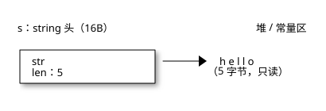
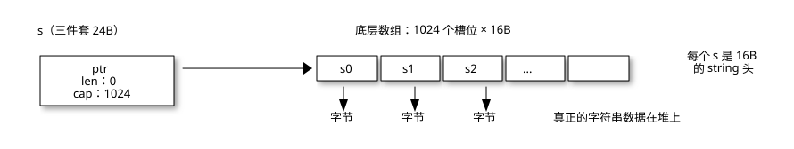
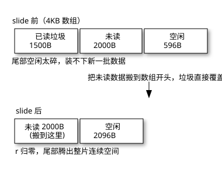
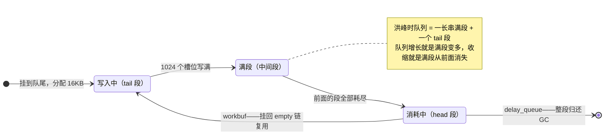
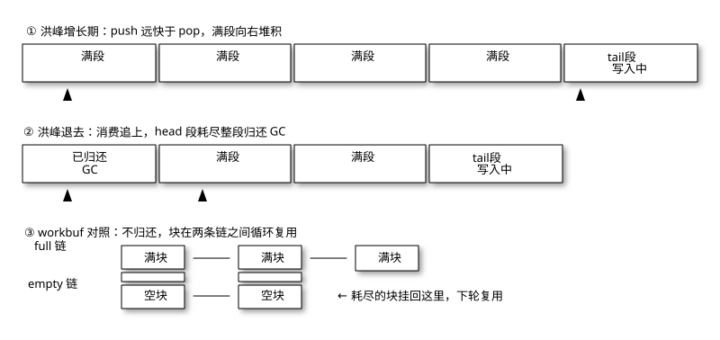
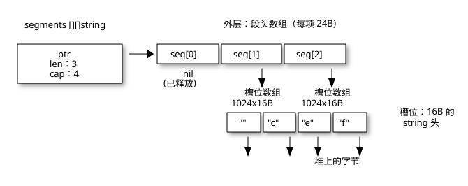

# 队列的内存演进史：从链表到 [][]string 的五个台阶

上一篇拆 [delay_queue 的三层回收](./29-3.md) 时被问住了一个问题：`[][]string` 这种结构到底什么来路？回头看那篇确实默认了太多前置知识。这篇从最底下那块砖开始讲：每一级台阶只解决上一级的某个具体痛点，每一级都有成熟系统在场背书。读完你应该能看懂 delay_queue 里每一个设计决定，以及它为什么长成那样。

<!-- more -->

## 地基：一个 slice 在内存里长什么样

后面所有内容踩在这两个事实上，先立起来。

先说 **string**——它是只读的字节切片头，运行时定义就两个字段（`runtime/string.go` 的 `stringStruct`）：指向字节的指针 + 长度。每个 `string` 值不管内容是 `"a"` 还是 10MB 文本，**自身恒定 16 字节**（64 位平台），真正的 UTF-8 字节躺在堆上，`string` 只是指着它们的"遥控器"：

{ .diagram }


由此直接推出后面要反复用的四个事实：

1.  **`len(s)` 是 O(1)**——读字段，不数字节。
2.  **赋值/传参/入队零拷贝**——拷的只是 16B 头，字节不动。`[]string` 存 50 万个 ID 只占 8MB 槽位，跟 ID 本身多长无关。
3.  **`s[0]` 取的是字节不是字符**——UTF-8 下一个汉字 3 字节，`"汉"[0]` 是 0xE6。
4.  **不可变的根源是字节只读**——`s[0] = 'H'` 编译报错；想改必须 `[]byte(s)` 开可写副本。这也是 string 能安全当 map 键、能并发共享的原因：头不变、字节不变，就没有数据竞争。

再说 **slice**。它不是数组，是 24 字节的三件套：`{指向底层数组的指针, 长度 len, 容量 cap}`。`make([]string, 0, 1024)` 会分配一个 1024×16 字节的底层数组——数组里每个槽位装的就是上面那个 16B 的 string 头。

{ .diagram }

第二条事实是 GC 的行事准则：**只要还有引用链指向一块内存，它就活着**。所谓"还内存"，就是断掉引用。队列的全部内存问题，归根结底是在回答一件事：谁来断引用、什么时候断、断的粒度多大。

## 台阶一：链表——能还，但每次还一点

最直觉的队列。每个元素包一个节点，`push` 时分配，`pop` 时把节点从链上摘下来：

```go
type node struct {
    val  string
    next *node
}
// Push: tail.next = &node{val: id}   ← 一次堆分配
// Pop:  head = head.next             ← 断引用，节点可回收
```

内存账很干净：每 pop 一个元素，节点连同数据的字节都能被 GC 收走，从来不用搬迁什么。

痛点在开销上。50 万条洪峰等于 50 万次小对象分配，节点散落整个堆，遍历是纯指针追逐[^1]，CPU 缓存基本干瞪眼。

??? note "展开看：指针追逐为什么慢"

    下一个节点的地址写在当前节点的 `next` 字段里——想知道下一跳去哪，必须先把当前节点从内存读进来。而节点是逐个分配的，地址在堆里东一个西一个，CPU 猜不到位置，硬件预取器也无从预取。

    于是每一跳都可能是一次 cache miss。给个数量级：命中 L1 约 1ns，漏到内存约 100ns，差两个数量级——而且各跳是 **串行依赖**，不知道节点 i 的地址就取不回节点 i+1，延迟无法并行摊薄。

    50 万节点全量走一遍，光等内存就是几十毫秒；同样规模放数组里连续遍历，预取器提前拉数据，通常不到 1ms。GC 的标记阶段慢、B-tree 逐层下潜吃亏、数据库偏爱顺序扫描，背后都是这同一个物理约束。

谁在用：Go 的 `container/list` 把这个结构备在标准库里，但连 Java 都看不太下去——`ArrayDeque`（环形数组）的 javadoc 明说：拿 **ArrayDeque** 当队列，大概率比 `LinkedList`（链表）快。数组实现反过来碾压链表，靠的就是下面两级台阶要讲的东西。链表在教科书里是标准答案，在工程里是"能跑，但不值"。

[^1]: 一句话：链表每一跳的地址都藏在上一个节点里，CPU 无法预取，每跳都可能白等一次内存往返。完整解释见正文"指针追逐为什么慢"折叠块。

## 台阶二：单一大 slice——便宜了，但不还了

把节点干掉，元素直接进数组，`head` 下标往前推：

```go
type sliceQueue struct {
    buf  []string
    head int // Pop: id = buf[head]; buf[head] = ""; head++
}
```

内存账：`append` 均摊 O(1)，零逐元素分配；pop 时槽位置 `""`，字符串字节照样能回收。看起来全赢了。

但底层数组本身出不去了。`buf` 一直引用着它，`head` 走过的前缀只是"逻辑删除"——那块数组空间，只要队列还活着就一直占着。想让数组缩回去只有一个办法：新分配一个小的，把剩余元素 copy 过去。搬迁量等于剩余元素数，队列越长，尖峰越大。

谁在用：`bufio.Reader`——"下标推进 + 定期搬迁"这套动作，标准库亲自在用。它内部就是一块固定数组（默认 4KB）加两个游标：`r` 是读位置（`[0:r)` 是已读走的逻辑垃圾），`w` 是写位置（`[r:w)` 是已从底层读入、用户还没取走的数据）。每当缓冲区不够用、要从底层补新数据，`fill()` 的第一步就是搬迁（`copy(b.buf, b.buf[b.r:b.w])`）[^2]：

{ .diagram }

它敢这么干是因为账算得清：缓冲区封顶几十 KB，单次搬迁量有 **硬上界**（≤4KB）；且搬迁紧挨着一次 syscall（微秒级），拷贝成本完全被掩盖。队列照抄就完了：剩余元素几十万条，一次搬迁就是几十万次拷贝的 $O(n)$ 尖峰，且没有上界——这条路在大队列的量级下是封死的。

[^2]: 看得仔细的读者会问：未读长度超过已读长度时，目标区 `[0, w-r)` 和源区 `[r, w)` 会重叠，覆盖了怎么办？不会丢数据，两层保证：Go 的 `copy` 语义上就是 `memmove`（spec 明说 source 和 destination 可重叠）；且这里目标地址比源低，拷贝时写指针恒落后读指针 r 字节——任一重叠字节都是先被读走、后才被覆盖。真正被有意覆盖的只有垃圾区 `[0, r)`。

## 台阶三：环形缓冲——不搬了，但容量焊死

台阶二的死结在于"数组有头有尾"。环形缓冲直接把头尾焊成一个圈：指针走到末尾取模回头，消费端永远在生产端身后追：

```go
buf      []string // 固定容量
head, tail int    // 索引对 len(buf) 取模回绕
```

内存账：完美稳定。数组恒定复用，从生到死零搬迁，GC 视角舒服到没朋友。

代价是容量在 `make` 那一刻焊死。满了只剩两条路：背压（阻塞或丢弃），或者扩容——而扩容是一次性全量搬迁，比 bufio 那一下狠得多。

??? note "展开看：什么叫背压（backpressure）"

    生产者比消费者快，队列迟早满。满的那一刻必须有人让步——**把"跟不上了"这个信号反传给上游**，让生产者慢下来，就是背压。名字来自液压系统：管道下游堵了，压力向源头方向顶回去。

    两个熟悉的实例：

    1.  **Go channel**：满了 `send` 不是报错，是 goroutine 直接 park 挂起，等消费者腾出位置再唤醒——"慢点灌"是语言级语义。
    2.  **TCP**：接收方处理不过来就缩小通告窗口，发送方据此降速——互联网不崩全靠这个。

    反面教材是 **无界队列**（无上限的缓冲、不限长的任务列表）：永远不"满"，所以永远不拒绝。洪峰来了内存一路涨到 OOM 才算发出信号——代价是整个进程。

    教科书版循环队列讲到"队列满，返回 false"就停了；工程里"满"不是错误是常态，满之后的策略才是 ring 的灵魂。这也是它与 delay_queue 的根本分歧：channel 的上游是代码，park 它就行；追踪队列的上游是用户请求，你没法让用户"慢点提交交易"——洪峰只能自己扛，容量必须能涨。

谁在用，全是大牌：

1.  **Go channel**：`makechan` 给带缓冲 channel 分配的 `hchan.buf` 就是个环形数组，读写指针 `recvx`/`sendx` 走到 `dataqsiz` 显式归零回绕（runtime/chan.go）。channel 满了发送方直接 park——背压本来就是 channel 语义的一部分。
2.  **Linux kfifo**：内核的通用环形队列（include/linux/kfifo.h），回绕处拆成两次 memcpy 处理。
3.  **LMAX Disruptor**：固定大小的 ring + 序号器，单线程六百万 TPS，详见 [六百万 TPS 的单线程](./08-8.md)；我自己也写过一篇 [无锁环形队列](./07.md)。

边界很清楚：容量可预估、或有天然背压的场景，ring 是最优解。delay_queue 的洪峰到 50 万条不可预估——ring 扩容一次要搬 800 万字节，不行。

## 台阶四：切段的觉悟——把归还的单位降下来

前三级各有绝症：链表逐元素分配太碎，单 slice 搬迁太狠，ring 容量焊死。第四步的洞察，是把"归还和搬迁的最小单位"从 **整个数组**降到**一小段**。

把队列切成固定大小（比如 1024 个槽位）的段，段成为分配和释放的单位：分配一段 16KB 是常数操作，释放一段也是。队列增长就多挂一段，消费完就还一段——增量、平滑、无尖峰。

??? note "展开看：为什么是 1024 个槽位、16KB 一段"

    16KB 是算出来的：1024 槽位 × 16B/槽——每个槽位是一个 `string` 头（指针 8B + 长度 8B），64 位平台上正好 16 字节。真正的自变量只有段内槽位数 1024，它在平衡三个力：

    1.  **段太小**（64 槽 = 1KB）：50 万条堆积膨胀成 8000 段，外层数组、段头管理、GC 追踪的小对象数全部跟着涨。
    2.  **段太大**（64K 槽 = 1MB）：归还粒度变粗——队列从 50 万回落到 1000 条时，最后一段还占着 1MB 没还；单段分配的偶发停顿也变长。
    3.  **1024 槽是甜点**：16KB 对 Go 分配器是小对象（< 32KB 走 mcache 的 span，微秒级）；归还粒度足够细，水位平滑回落；50 万条压到 489 段，外层管理成本可忽略。

    横向对照，各家按自己的负载特征选：Go GC workbuf 每块 2048B（复用不归还，追求低预留内存），Netty PoolChunk 16MB（管理磁盘级缓冲），`bufio` 4KB。段大小不是普适常数，是负载的函数——delay_queue 的输入是"洪峰 50 万、元素为 16B string 头"，1024 就落在这个区间的甜点上。

谁在用：

1.  **Go GC 的 workbuf**（runtime/mgcwork.go）：垃圾回收扫描指针的工作队列，每块固定 2048 字节。满块挂到全局 full 链，空块挂到 empty 链，块在两条链之间流转复用。GC 的关键路径上既不能容忍 50 万次逐元素分配，也不能容忍整队搬迁——分块是它唯一的活路。
2.  **Netty 的 PoolChunk**：默认 16MB 的 chunk 向下切 8KB 的 page 再切 subpage，分配器视角的同款思想。
3.  **Kafka 的层级时间轮**：每层是固定槽数的环形数组、每格再挂一条定时任务链表——ring 和链表的混合体，说明这两种结构是互补而不是互斥。
4.  **Chronicle Queue**：按块滚动的 mmap 文件，磁盘版的分段队列。

段自己的流转是个状态机——每一步转换都是常数开销，这就是"增量、平滑、无尖峰"的机制保证：



状态机落到数据结构上，就是这一排方框的增减——一个方框一个段：

{ .diagram }

读图三笔账：

1.  **增长 = 满段变多**：每 1024 次 push 只付一次 16KB 分配，队列总长随段数线性伸缩。
2.  **消费 = 满段从前面消失**：整段 16KB 一次性还给 GC。废弃段头怎么收拾，是下一节外层数组的事。
3.  **workbuf 的块在 full → empty → full 的环里打转**，永不还给 GC——内存水位停在峰值，换来的是下轮 GC 零分配。

一个诚实的差异：workbuf 近似 LIFO，且块只复用不归还；delay_queue 是 FIFO，段是真还给 GC 的[^3]。方向不同，思想同源——**把队列操作的内存粒度从"元素"升到"块"**。图里最后一步的分岔就是这句的图示：右边那条回到"写入中"的边是 workbuf 的复用路线，直达终点的是 delay_queue 的归还路线。

[^3]: 归还还是复用，没有普适答案，判据是负载形态。workbuf 不归还：块的需求持续、密集、每次 GC 都要用，复用把分配成本摊到零；且 GC 运行中不能随便走普通分配器（分配可能再触发 GC），块来自预留资源，必须留在手里——代价是内存水位停在峰值。delay_queue 归还：需求是洪峰 50 万、平时几百的脉冲式，队列又活在进程整个生命周期，内存应随需求回落。一句话：稳态高频选复用，突发长尾选归还。

## 台阶五：[][]string——三级结构的合体

零件齐了，delay_queue 的 `[][]string` 就不神秘了。它就是台阶四的分段，外层用一个动态数组（而不是链表）去串段：

{ .diagram }

所谓"三层回收"，就是三个不同粒度的断引用：

1.  **槽位级**：pop 时 `segments[h][i] = ""`——断 string 头到字节的引用，字节可回收。台阶二的老朋友。
2.  **段级**：head 段耗尽时 `segments[h] = nil`——断段头到槽位数组的引用，整段 16KB 归还。台阶四的核心收益，也是单 slice 永远做不到的事。
3.  **外层级**：段耗尽时 `segments[h] = nil` 释放的是段头指向的 16KB 槽数组，但外层数组里那个装过它的 **格子还在** ——装着 nil，占 24B。消费推进后，外层前缀会积一堆这样的废弃格子：

    ```text
    收缩前外层：[ · ][ · ][ · ][seg3][seg4][tail]    len:6  cap:8
                    ↑ 废弃段头（nil，24B/格）    ↑ 活的段头
    ```

    这些格子不会自动消失——Go 的 slice 没有"从前面缩"的操作。所以耗尽一个非末段时，队列会做一次 **收缩**：新分配小数组，把活的段头 copy 进去，废弃格子连同旧数组整体交给 GC：

    ```text
    收缩后外层：[seg3][seg4][tail]    len:3  cap:5
    ```

    关键的账：这次 copy 搬的是 **段头**（24B/个，几十个），不是段内 **元素**（16B/个，几十万个）——搬迁量是元数据的量级，与队列长度无关。对比台阶二 bufio 的 slide（搬数据本身，O(剩余元素)），同样的"搬迁"动作，成本缩了三个数量级。

三级漏掉任何一级，都会变成另一个"只涨不跌"。而外层收缩那一行 `make` 里，还藏着一个 50 万堆积必触发的 panic——上一篇实测复现并给了修复，见 [不用堆的延迟队列](./29-3.md)。

成本账一句话：push 均摊 O(1)（每 1024 次付一段分配）；pop O(1)；段释放 O(1)；外层收缩 O(段数)。没有任何单次操作会随队列总长膨胀——这是它跟台阶二的本质区别。

## 选型速查

| 结构 | 还内存的方式 | 单次操作上界 | 代表实现 |
| :--- | :--- | :--- | :--- |
| 链表 | 逐元素还 | 每元素一次分配 | `container/list` |
| 单 slice | 整体搬迁才还 | O(剩余元素) 尖峰 | `bufio` 的 slide |
| 环形缓冲 | 不需要（恒定复用） | 容量焊死 / 扩容尖峰 | channel、kfifo、Disruptor |
| 分段切片 | 逐段增量还 | O(1) | GC workbuf、delay_queue |

## 小结

教科书只教队列的两极：链表（灵活但碎）和环形缓冲（快但定容）。生产系统真正的秘密全在中间地带——**把归还的单位从"元素"升到"块"，把搬迁的量从"数据"降到"元数据"**。`[][]string` 不是一个有名字的教科书结构，它是四个经典结构各取所长的组合：链表的增量归还、slice 的连续存储、ring 的定长段、动态数组的段管理。

下次再看到这种"土味"结构，先别急着觉得糙——看看它替你挡掉了哪几级台阶上的坑。

---

*最后更新：2026-09-30*
