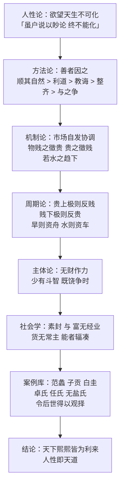

# 《史记·货殖列传》精讲：两千年前把市场规律说透的一篇文章

读[《量化交易》](/blog/posts/2026/02/7/)、写[三层复合交易系统](/blog/posts/2026/04/30/)的时候，脑子里反复出现的其实是一些更老的问题：市场有没有自身规律？政府该不该管？人性逐利到底是恶还是常？后来发现，这些问题在两千年前就有人系统性回答过了——司马迁的《货殖列传》，《史记》一百三十篇的倒数第二篇，全书压轴。

这是一篇奇文。正史本是帝王将相的家谱，司马迁却专门给商人立传；史书本该记朝政军国，这篇却通篇在讲物产、物价、风土和生意经。钱钟书在《管锥编》里评价：别人写史都是「大事记」体，这篇「于新史学不啻乎辟鸿蒙」——说它给近代经济史学开了天辟了地，评价高到离谱。

<!-- more -->

潘吟阁说得更直白：「读中国书而未读《史记》，可算未曾读书；读《史记》而未读《货殖传》，可算未读《史记》。」

这句是吹捧，但不全是。因为这篇文章确实超前：司马迁在里面写到了市场自发性、价格信号、周期波动、逆向操作、风险定价、复利、产业分工，几乎每一句都能和现代经济学对上号。下面逐段拆——每一段先给原文，再给白话，然后讲它在说什么、能对上现代哪条理论。引申理论部分是「对照参考」而不是「司马迁早就发明了 X」，这个分寸后面会一直守着。

---

## 一、开篇：两种治国路线的交锋

> **原文**：老子曰：「至治之极，邻国相望，鸡狗之声相闻，民各甘其食，美其服，安其俗，乐其业，至老死不相往来。」必用此为务，挽近世涂民耳目，则几无行矣。
>
> 太史公曰：夫神农以前，吾不知已。至若诗书所述虞夏以来，耳目欲极声色之好，口欲穷刍豢之味，身安逸乐，而心夸矜势能之荣。使俗之渐民久矣，虽户说以眇论，终不能化。故善者因之，其次利道之，其次教诲之，其次整齐之，最下者与之争。

**白话**：老子说，治国治到极处，就是邻国互相望得见、鸡鸣狗叫互相听得到，百姓各自吃自己的饭、穿自己的衣、守自己的习俗、干自己的营生，到死不相往来。非要按这一套去要求近世，等于蒙住百姓的耳目，行不通了。太史公说：神农以前的事我不知道。但《诗》《书》记载的虞夏以来，人就是要听最好听的、看最好看的、吃遍美味、图安逸、慕虚荣——这种风气浸染人心已经太久了，你挨家挨户去宣讲老子的妙论，谁也感化不了。所以（治理）最好的办法是顺其自然，其次是因势利导，再其次是教诲，再其次是颁布规章去整齐划一，最下等的是与民争利。

**解析**：开篇是一场思想交锋。老子的小国寡民图景，本质是「零交易」的世界——没有交换，就没有逐利，就没有纷争。司马迁的回应很锋利：**人的欲望是天生的、不可清除的**（「耳目欲极声色之好，口欲穷刍豢之味」），你想用说教把它抹掉，等于对着人性讲经，注定失败。

于是他给出那条著名的五级排序：**因之 > 利道之 > 教诲之 > 整齐之 > 与之争**。翻译成现代语言就是一张政府干预的刻度尺：

| 司马迁原文 | 现代对应 | 干预强度 |
|---------|---------|---------|
| 善者因之 | 自由放任（laissez-faire） | 最弱 |
| 其次利道之 | 引导性政策、激励机制 | 弱 |
| 其次教诲之 | 宣传教化、道德劝导 | 中 |
| 其次整齐之 | 行政管制、统制经济 | 强 |
| 最下者与之争 | 与民争利、官营专卖 | 最强 |

这张表往下排，司马迁的态度越写越冷。写到「最下者与之争」时，他针对的正是汉武帝时代的盐铁官营、算缗告缗——国家亲自下场做生意、与商人抢利。司马迁为李陵说话而受宫刑，但他真正的经济立场都藏在这类春秋笔法里：他不点名骂，只把排序摆出来，让后人自己对照现实。

**引申参考**：这一段几乎预演了经济思想史上两百年前才有的争论。亚当·斯密《国富论》（1776）的「看不见的手」，前提正是每个人天然追求自利（self-interest），而市场的妙处在于把这种自利导向互利——前提是政府别去「整齐」它。司马迁的「善者因之」与 laissez-faire 的字面（法语「让他去做」）惊人同构；《管子》「利道」传统则很像今天的产业政策思维。但差别也要说清楚：斯密给出的是系统论证（分工→交换→市场→国富），司马迁给出的是史家直觉与经验观察。说「司马迁是中国的亚当·斯密」是修辞，不是史实；准确的说法是——两人对「人性逐利不可压制」的判断，隔着一千八百年站在了同一边。

顺带一提，把《货殖列传》从《史记》经济思想角度首次推向现代学术讨论的，是民国学者潘吟阁的《史记货殖列传新诠》（1935）。

---

## 二、物产与分工：市场不需要指挥

> **原文**：夫山西饶材竹谷纑旄玉石，山东多鱼盐漆丝声色；江南出楠梓姜桂，金锡连丹沙，犀玳瑁珠玑齿革；龙门、碣石北多马牛羊旃裘筋角；铜铁则千里往往山出棋置：此其大较也。皆中国人民所喜好，谣俗被服饮食奉生送死之具也。故待农而食之，虞而出之，工而成之，商而通之。此宁有政教发徵期会哉？人各任其能，竭其力，以得所欲。故物贱之徵贵，贵之徵贱，各劝其业，乐其事，若水之趋下，日夜无休时，不召而自来，不求而民出之。岂非道之所符，而自然之验邪？

**白话**：山西（崤山以西）多产木材、竹子、楮木、野麻、旄牛尾、玉石；山东多鱼、盐、漆、丝、歌舞美色；江南出楠木、梓树、姜、桂、金、锡、铅、丹砂、犀角、玳瑁、珠玑、象牙皮革；龙门、碣石以北多马、牛、羊、毛毡皮裘、兽筋兽角；铜铁矿藏更是千里之内如棋子般散布各处。这都是中原百姓所喜好、日常穿着饮食养生送死所依赖的东西。所以，靠农夫耕种才有饭吃，靠虞人开发山泽才有物产，靠工匠制造才有器具，靠商贾流通才有货物——这难道需要官府发布政令、征发百姓、定期会集吗？人人各展其能、各竭其力，去换自己想要的东西。所以物价贱到头就会走向贵（的信号），贵到头就会走向贱（的信号），人人勤于本业、乐于其事，就像水往低处流，日夜不休，不用召唤就自己来了，不用强求百姓就自己生产了。这难道不是符合规律、顺应自然的证明吗？

**解析**：这是全篇的理论地基，一口气立起三个论点：

1. **禀赋差异是天然的**。各地物产不同（山西的玉、山东的盐、江南的珠玑、北方的马牛羊），这是地理事实，无人安排。
2. **分工是必然的**。农、虞、工、商四种职业各管一段——用现代话说就是「生产→开采→加工→流通」的产业链。没有人下命令，分工自己长出来了。
3. **市场自协调**。「此宁有政教发徵期会哉？」——一句反问，否定了中央协调的必要性。价格贱贵的互相转化（物贱之徵贵，贵之徵贱），就是人们跟着信号调整行为的机制。整个系统「若水之趋下」，是自发秩序。

**引申参考**：这段能对上的现代理论最密集。

- **亚当·斯密的分工理论**（《国富论》前三章）：分工源自人类「互通有无、物物交换」的倾向，而分工受「市场范围」限制——市场越大，分工越细。司马迁笔下的四方物产 + 商贾流通，正是一个「市场范围决定分工深度」的汉代版本。
- **哈耶克的「知识分散」与自发秩序**（spontaneous order）：哈耶克反复强调，没有任何中央机构能掌握散落在千万人头脑里的局部知识，只有价格体系能把它们聚合起来传递信号。「此宁有政教发徵期会哉」问的正是这个问题——而司马迁的答案（价格信号自发引导）与哈耶克的答案（价格是信息传递机制）结构相同。奥地利学派把《货殖列传》视为「古代文献中最接近市场自发秩序思想的表述」，不是没有理由。
- **比较优势理论**（李嘉图，1817）：各地专注自己禀赋占优的物产再交换，总产出大于自给自足。司马迁记录的四方物产格局，就是一套前现代的比较优势地图。
- **萨伊的市场法则雏形**：「人各任其能，竭其力，以得所欲」——供给自己的所长，换取自己的所欲，供给与需求通过交换自洽。

需要提醒的分寸：司马迁没有数学、没有边际概念，他的「物贱之徵贵，贵之徵贱」是经验观察，不是供需曲线。把他当「思想先驱」读，比把他当「经济学家」读，更接近事实。

---

## 三、富与礼：仓廪实而知礼节

> **原文**：故曰：「仓廪实而知礼节，衣食足而知荣辱。」礼生于有而废于无。故君子富，好行其德；小人富，以适其力。渊深而鱼生之，山深而兽往之，人富而仁义附焉。富者得势益彰，失势则客无所之，以而不乐。谚曰：「千金之子，不死于市。」此非空言也。故曰：「天下熙熙，皆为利来；天下攘攘，皆为利往。」夫千乘之王，万家之侯，百室之君，尚犹患贫，而况匹夫编户之民乎？

**白话**：所以说：「粮仓满了，百姓才懂得礼节；衣食足了，百姓才知道荣辱。」礼产生于富足、废弃于贫穷。君子富了，乐于施行仁德；小人富了，也能安分地发挥自己的气力。渊深了自然有鱼，山深了自然有兽，人富了仁义自然随之而来。富者得了权势更显赫，失了势，门客都无处可去，因此郁郁不乐。谚语说：「家有千金之子，不会犯法死于闹市。」这不是空话。所以说：「天下熙熙攘攘，全为利来，全为利往。」有千辆兵车的王、万家封地的侯、百室封邑的君，尚且怕穷，何况平民百姓？

**解析**：「仓廪实而知礼节」引自《管子·牧民》，司马迁拿来当了社会理论的支点：**道德是财富的函数，不是财富的前提**。这个方向在今天是常识（发展经济学里的「先脱贫后规范」），在汉代却是逆流——主流儒家叙事是「君子喻于义，小人喻于利」，把义利对立；司马迁直接说：义是利的下游，「渊深而鱼生之，人富而仁义附焉」。

「千金之子，不死于市」是一句被低估的社会学观察：**财富可以购买免于刑戮的安全边际**。汉代城市有市刑，「不死于市」就是说富人犯事也有回旋余地——司马迁淡淡一句谚语，写透了财富与法律地位的相关性。读到这里很难不想起他自己的遭遇：李陵之祸，他「家贫，货赂不足以自赎」，交不出赎金，只能受宫刑。这句谚语背后是有切肤之痛的。

**引申参考**：

- **马斯洛需求层次**（1943）：仓廪实（生理/安全）→ 知礼节（尊重/自我实现），方向一致；但马斯洛是心理学的个体模型，司马迁是社会的群体判断，不宜直接画等号。
- **制度经济学的「生存伦理」**（斯科特《农民的道德经济学》，1976）：斯科特考察东南亚农民时发现，当生存尚成问题时，农民的道德体系围绕「生存优先」建立，而非市场理性——反向印证「礼生于有而废于无」。
- **行为研究里的「稀缺心态」**（Mullainathan & Shafir《稀缺》，2013）：长期贫困占用认知带宽，导致更差的长期决策——现代版「无则礼废」。
- 更宏观的对应是「**贫困陷阱**」（poverty trap）：低收入 → 低储蓄/低投资 → 低增长 → 持续低收入。司马迁在《货殖列传》后半篇写「无财作力」，说的正是这个循环的入口。

---

## 四、计然之策：中国最早的周期与逆向操盘术

> **原文**：昔者越王勾践困于会稽之上，乃用范蠡、计然。计然曰：「知斗则修备，时用则知物，二者形则万货之情可得而观已。故岁在金，穰；水，毁；木，饥；火，旱。旱则资舟，水则资车，物之理也。六岁穰，六岁旱，十二岁一大饥。夫粜，二十病农，九十病末。末病则财不出，农病则草不辟矣。上不过八十，下不减三十，则农末俱利，平粜齐物，关市不乏，治国之道也。积著之理，务完物，无息币。以物相贸易，腐败而食之货勿留，无敢居贵。论其有余不足，则知贵贱。贵上极则反贱，贱下极则反贵。贵出如粪土，贱取如珠玉。财币欲其行如流水。」修之十年，国富。厚赂战士，士赴矢石，如渴得饮，遂报强吴，观兵中国，号称「五霸」。

**白话**：从前越王勾践被困于会稽山，于是重用范蠡、计然。计然说：知道要打仗就该提前备战，了解货物何时为人所用才算懂商品——把「时」与「用」这两件事对照清楚，天下货物的行情就能看明白了。岁星在金位年成丰收，在水位有水患，在木位闹饥荒，在火位出旱灾。天旱时就要提前备船，水涝时就要提前备车，这是事物的规律。六年一丰收，六年一旱灾，十二年一次大饥荒。卖粮，斗价二十钱则农民吃亏，九十钱则商贾吃亏；商贾吃亏钱财就不流通，农民吃亏田地就荒芜。粮价上不超过八十、下不低于三十，农与商都能得利。平价售粮、平抑物价，关市税收不缺，这是治国之道。积贮货物的道理：务求货物完好，不要让货币停息。买卖货物，易腐败的东西不要久留，切忌囤积居奇等高价。研究货物的有余与不足，就知道价格要涨还是要跌。贵到极点必然返贱，贱到极点必然返贵。贵的时候抛出去要像扔粪土，贱的时候买进来要像捡珠玉。钱财货币要让它流动得像水一样。照这套办法治国十年，越国富强了，重金赏赐战士，士兵冲锋陷阵如渴了要喝水，于是报了强吴之仇，挥师中原，号称「五霸」。

**解析**：这是全篇技术含量最高的一段——计然七策，句句可操作，可以说是中国文献里第一套成体系的「周期+价格+资金管理」操盘术。逐条拆：

**① 周期框架**。「岁在金穰、水毁、木饥、火旱」是用岁星（木星）运行位置标记的十二年周期，配「六岁穰、六岁旱、十二岁一大饥」。这当然是前科学的占候框架（岁星纪年与收成并无真实因果），但它的**用法**极其现代：承认经济有周期 → 周期可预期 → 预期指导提前布局。框架错了，方法论对了。

**② 旱则资舟，水则资车**。天旱时（船的需求在谷底、价格低）买船备用，水涝时（车的需求在谷底）买车。八个字的逆向操作——**在需求低谷买入，等周期反转时供给变现**。现代对法：棉花期货史上的「在无人问津处买仓库」，或者巴菲特式的「别人恐惧我贪婪」——但注意，计然版更早也更冷：它甚至不涉及情绪，纯粹是周期位置的算术。

**③ 价格双轨模型**。「粜二十病农，九十病末」——粮价二十，谷贱伤农；粮价九十，商贾无利则货币不出、流通窒息。所以政策目标是把价格框在 **30–80** 的区间内（上不过八十，下不减三十），农末俱利。「平粜齐物」就是政府吞吐储备、平准价格。这是后来汉宣帝「常平仓」、历代「平准」「均输」的思想源头，一直到现代的农产品最低收购价、央行公开市场操作，逻辑同构：**给价格设上下轨，轨内归市场，越轨则干预**。

顺带一笔：这和我在[三层复合交易系统](/blog/posts/2026/04/30/)里给网格交易画的区间，形制上惊人地像——都是「承认价格会在一个区间内来回，用规则代替预测」。当然，一个管吃饭安全，一个管仓位收益，量级不同。

**④ 务完物，无息币**。库存要挑保质期好的（腐败而食之货勿留——易腐品不囤），资金不许闲置（无息币）。这是**库存管理 + 资金周转率**两条铁律，现代供应链管理（JIT 之前的一切库存学科）和资金管理的鼻祖级表述。「财币欲其行如流水」= 货币流通速度（velocity of money）的文学版。

**⑤ 贵上极则反贱，贱下极则反贵**。这是全篇最锋利的一句话，也是中国文献里最早的**均值回归**表述。价格极端必然反转，不是因为神秘主义，而是因为「论其有余不足，则知贵贱」——极端价格必然对应极端的供需失衡，而失衡本身会召唤出纠正失衡的力量（高价吸引供给、压制需求，反之亦然）。**贵出如粪土，贱取如珠玉**：卖出时要像扔粪土一样毫不留恋（趋势末期不贪最后一段），买入时要像捡珠玉一样果断（恐慌底部不犹豫）。八个字，把逆向交易的执行纪律写到极致。

**引申参考**：

- **康德拉季耶夫长波**（1925）：50–60 年的长周期。计然的十二年框架在「经济有长周期」这个信念上与康波同构，但数值无对应关系，不能类比。
- **均值回归 vs 动量**：现代金融实证研究（De Bondt & Thaler 1985 的反转效应、Jegadeesh & Titman 1993 的动量效应）表明两者在不同时间尺度上同时存在。计然之言更接近反转派。
- **谷物市场的价格带管理**：计然的 30–80 区间管理，本质上与今天各国农产品价格支持制度、以及 CBOT 时代以来的「缓冲库存」思想同构。中国古代的常平仓制度在经济史学界常被拿来与近代欧洲的 grain reserve 政策作对照。
- **巴菲特「别人贪婪我恐惧」**（1986 致股东信语境）与「旱则资舟」结构相同：**买在需求侧的冬天**。区别在：巴菲特论的是市场情绪，计然论的是实物周期，但「在低谷布局、在高峰离场」的骨架一致。
- 一个必要的分寸：计然七策的框架是占候式的（岁星位置），不是统计式的。它胜在把「周期信念」直接工程化为「操作规则」，这正是它的现代性所在。

## 五、范蠡：功成身退，三致千金

> **原文**：范蠡既雪会稽之耻，乃喟然而叹曰：「计然之策七，越用其五而得意。既已施于国，吾欲用之家。」乃乘扁舟浮于江湖，变名易姓，适齐为鸱夷子皮，之陶为朱公。朱公以为陶天下之中，诸侯四通，货物所交易也。乃治产积居，与时逐而不责于人。故善治生者，能择人而任时。十九年之中三致千金，再分散与贫交疏昆弟。此所谓富好行其德者也。后年衰老而听子孙，子孙修业而息之，遂至巨万。故言富者皆称陶朱公。

**白话**：范蠡帮越王洗雪会稽之耻后，长叹道：计然之策有七条，越国用了五条就实现了愿望。既然用于治国有效，我想把它用于治家。于是乘小船漂于江湖，改名换姓，到齐国叫鸱夷子皮，到陶邑叫朱公。朱公认为陶邑是天下的中心，诸侯四通，货物在此交易。于是治产囤积，**与时逐而不责于人**。善治生者，能择人而任时。十九年间三次赚得千金，两次分散给贫友远亲。这就是富而好行其德。后来年老听凭子孙，子孙修业而增值，遂至巨万。所以说到富人，都称陶朱公。

**解析**：范蠡这段有三个层次值得单独拎出来。

**第一，「既已施于国，吾欲用之家」**——治国与治家共用一套经济原理。这个判断比它看起来激进得多：它意味着经济规律**超越政治体制**，国与家只是规模不同的「资产负债表」。现代说法：宏观政策与个人理财服从同一套约束（预算约束、周期、流动性）。

**第二，「与时逐而不责于人」**——赚钱靠追逐时机，不靠苛责他人（压榨佃农、克扣伙计）。紧接着「善治生者，能择人而任时」，**择人**与**任时**并列：机会是外生的，团队是内生的。这与计然策的周期框架完美衔接：既然承认周期，就承认「时」不可强求，能经营的只有自己的位置和人。

**第三，「三致千金，再分散与贫交疏昆弟」**——赚了就散，散了再赚。这不仅是道德姿态，更是一种**反脆弱的资产结构**：把利润定期提取，避免单次周期把全部身家卷走。他自己也成为后世「富好行其德」的原型——注意司马迁在这里把「德」放在「富」的下游，与第三节「人富而仁义附焉」首尾呼应。

**引申参考**：

- **资产配置与再平衡**（rebalancing）：定期提取利润并再分配，避免组合在单一周期中过度暴露——「三致千金再分散」的现代化身。机构投资者的 endowment 模式（耶鲁模式）每年再平衡并提取支出，逻辑同构。
- **塔勒布《反脆弱》**（2012）：脆弱系统死于波动，反脆弱系统从波动中受益。范蠡「与时逐」的周期化生存 + 定期分散利润，正是一种反脆弱结构：不预测具体时点，但保证无论哪个周期来了都有位置。这层对应是结构性相似，不是公式等同。
- 顺带一提：范蠡被认为留下过《范子计然》一书（依托），「陶朱公」在后世商业伦理中成了「儒商」原型——货殖列传的这段叙事，就是「儒商」话语的源头文本。

---

## 六、子贡与白圭：儒商与祖师爷

> **原文**：子赣既学于仲尼，退而仕于卫，废著鬻财于曹鲁之间，七十子之徒，赐最为饶益。原宪不厌糟糠，匿于穷巷。子贡结驷连骑，束帛之币以聘享诸侯，所至，国君无不分庭与之抗礼。夫使孔子名布扬于天下者，子贡前后之也。此所谓得势而益彰者乎？

**白话**：子贡在孔子处学业有成，去卫国做官，又在曹鲁之间贱买贵卖（废著＝买进卖出）经营财产，七十子中他最富有。原宪穷得吃糟糠，藏在陋巷。子贡却车马成队，带着束帛厚礼聘问诸侯，所到之处国君都与他行分庭抗礼之礼。让孔子名扬天下的，是子贡前前后后的运作。这就是「得势而益彰」吧。

**解析**：司马迁写子贡，笔锋是双重的。一方面，「赐最为饶益」——孔门首富，营销天才（司马迁《仲尼弟子列传》里还写过他「利口巧辞」）；另一方面，他把孔子的品牌传播归功于子贡的钱与势——**「夫使孔子名布扬于天下者，子贡前后之也」**。这句放在正史里是惊人的：儒家圣人的影响力，被一个史家冷静地归因于其弟子的商业运作。这不是讥讽，是司马迁一贯的「势」的史观——名声也是需要物质载体和传播渠道的，而子贡就是孔子的「渠道商」。

**引申参考**：现代对应是**社会资本理论**（布尔迪厄）与「品牌传播」的原始形态——思想的影响力=思想质量×传播资源。子贡的分庭抗礼，是财富兑换成的外交对等地位，古罗马的赞助人（patronus）体制、美第奇家族之于文艺复兴，都是同一结构：**商业财富反哺思想/艺术影响力**。

> **原文**：白圭，周人也。当魏文侯时，李克务尽地力，而白圭乐观时变，故人弃我取，人取我与。夫岁孰取谷，予之丝漆；茧出取帛絮，予之食。太阴在卯，穰；明岁衰恶。至午，旱；明岁美。至酉，穰；明岁衰恶。至子，大旱；明岁美，有水。至卯，积著率岁倍。欲长钱，取下谷；长石斗，取上种。能薄饮食，忍嗜欲，节衣服，与用事僮仆同苦乐，趋时若猛兽挚鸟之发。故曰：「吾治生产，犹伊尹、吕尚之谋，孙吴用兵，商鞅行法是也。是故其智不足与权变，勇不足以决断，仁不能以取予，强不能有所守，虽欲学吾术，终不告之矣。」盖天下言治生祖白圭。白圭其有所试矣，能试有所长，非苟而已也。

**白话**：白圭是周人。魏文侯时，李克（李悝）致力于尽地力之教（提高农业单产），白圭却喜欢观察时机变化，所以**人弃我取，人取我与**。丰收年买进谷物、卖出丝漆；蚕茧上市时买进帛絮、卖出粮食。太阴（岁星）在卯年丰收、明年就差；在午年旱、明年就好；在酉年丰收、明年差；在子年大旱、明年好、有水。到下一个卯年，他的囤积大约每年翻倍。想增加钱财就收购下等谷物（薄利多销），想增加谷子的石斗数就买上等谷种。他能省吃俭用、节制嗜欲、穿得节省，与办事的僮仆同甘共苦，**捕捉时机像猛兽猛禽扑食那样迅猛**。他说：我治生产，如伊尹吕尚的谋略、孙吴用兵、商鞅行法。所以智慧不够随机应变、勇气不够果断决断、仁德不能正确取舍、强毅不能有所坚守的人，就算想学我的方法，我终究不会教他。天下谈治生之道的人都尊白圭为祖师。白圭是实践过的，实践而有成就，不是随便说说。

**解析**：如果说计然是理论家，白圭就是操盘手出身的祖师爷。这段有三个黄金点：

**①「人弃我取，人取我与」**——八个字的中国式逆向投资总纲。注意它比「旱则资舟」更进一步：旱舟论的是**跨周期布局**（实物供需的时差），人弃我取论的是**对席交易**（直接赚交易对手的错位）。丰收年谷贱→他买谷卖丝漆（此时丝漆因非农人口忙于收成而需求弱）；蚕茧季帛絮集中上市→他买帛絮卖谷（此时谷价因青黄不接而高）。每一笔都是「对方急于出手的东西我接，对方急于要的东西我给」——赚的是**供给弹性时差**。

**②「智勇仁强」四字门槛**——白圭的招生标准：智（权变：看懂局面）、勇（决断：敢下手）、仁（取予：该给时给得出去）、强（有所守：该拿时拿得住）。这四条放在今天，就是交易员的**心理素质清单**：认知灵活、执行果断、止盈不贪、止损不扛。两千年前，白圭已经把「交易是反人性的」写成了招生简章——「虽欲学吾术，终不告之矣」，不收做不到的人。

**③「趋时若猛兽挚鸟之发」**——机会窗口极短，动作必须像捕食者一样预备+爆发。现代说法：**edge 的半衰期很短，执行速度就是 edge 的一部分**。

**引申参考**：

- **凯恩斯《通论》第 12 章**（1936）著名的「选美博弈」：市场里赚的是对「别人怎么想」的判断。「人取我与」本质就是把自己放在**供给侧**，站在拥挤交易的对面。
- **巴菲特徒弟们的口头禅**「Be greedy when others are fearful」与「人弃我取」的直译级对应——这条对应在中英文世界里都被广泛引用，几乎没有争议。
- **康纳曼《思考，快与慢》**：白圭的四门槛（智勇仁强）实际是在筛选「能对抗系统性认知偏差」的人——过度自信（智不足）、损失厌恶（勇不足）、处置效应（仁不能取予——该卖不卖）、锚定（强不能守）。这层对应是启发性的，不是严谨映射。
- 白圭的「乐观时变」与利弗莫尔《股票大作手回忆录》的「最小阻力线」观察、以及一切 trend-following 的「读盘」，在「把市场当作可观察的动态系统」这个态度上同构。

顺带一提：白圭这套话术里藏着汉代商人阶层的一个大问题——「智不足与权变，虽欲学吾术，终不告之矣」，这是给自己竖壁垒（增加不可复制性）。**Edge 的一部分是让别人学不会**，这话今天听来依然锋利。

---

## 七、素封与「无财作力」：财富的等级制度

> **原文**：谚曰：「百里不贩樵，千里不贩籴。」居之一岁，种之以谷；十岁，树之以木；百岁，来之以德。德者，人物之谓也。今有无秩禄之奉、爵邑之入，而乐与之比者，命曰「素封」。封者食租税，岁率户二百。千户之君则二十万，朝觐聘享出其中。庶民农工商贾，率亦岁万息二千，百万之家则二十万，而更徭租赋出其中。衣食之欲，恣所好美矣。
>
> 是以**无财作力，少有斗智，既饶争时，此其大经也**。今治生不待危身取给，则贤人勉焉。是故**本富为上，末富次之，奸富最下**。无岩处奇士之行，而长贫贱，好语仁义，亦足羞也。
>
> 凡编户之民，富相什则卑下之，伯则畏惮之，千则役，万则仆，物之理也。夫用贫求富，农不如工，工不如商，刺绣文不如倚市门。此言末业，贫者之资也。
>
> 由是观之，**富无经业，则货无常主，能者辐凑，不肖者瓦解**。千金之家比一都之君，巨万者乃与王者同乐。岂所谓「素封」者邪？

**白话**：谚语说：贩柴不出百里，贩粮不出千里。在一个地方住一年，就种谷物；住十年，就种树；住百年，就积德——所谓德，就是招徕人与物（的声望资本）。现在有的人没有官职俸禄、没有封邑收入，生活却足以与有封爵者相比，这叫「素封」。有封邑者吃租税，大约每户一年二百钱；千户封君年入二十万，朝拜聘问的支出都从这里出。平民农工商贾，家财一万每年利息可得二千；百万之家年入二十万，更徭租赋也从这里出——穿衣吃饭的欲望，可以随心所欲了。
所以说：**没有本钱就出卖劳力，稍有钱财就斗智（经营），已经富足就争时（把握时机），这是大经**。如今谋生如果不必冒生命危险就能自给，贤人也愿意努力。所以**本业致富（农）为上，末业致富（工商）次之，奸邪致富最下**。没有岩居奇士的品行，却长期贫贱，还空谈仁义，也够羞耻的了。
凡是编户之民，财富比自己多十倍就低头，多百倍就畏惧，千倍就被人役使，万倍就为人奴仆——这是事物的常理。从贫穷到求富，务农不如做工，做工不如经商，刺绣织锦不如倚门卖笑——这里说的是末业，是穷人的凭借。
由此看来，**致富没有固定的行业，财货没有固定的主人：有能者聚财如辐条凑毂，无能者败家如土崩瓦解**。千金之家可比一都之君，巨万之富可与王者同乐。这难道不就是「素封」吗？

**解析**：这一节是全篇的社会学核心，三个概念都值得精讲。

**① 素封**——「无秩禄之奉、爵邑之入」而能与封君比富的人。司马迁用财务语言定义了一个新的社会阶层：**不依附政治权力的财富阶层**。在汉代，这是石破天惊的——帝国的正统逻辑是「权力定义财富」（爵位→封邑→租税），司马迁反过来记录了「财富自成一体」的现实（经营→利 息→与封君等价）。他甚至给出了估值模型：千户封君年入二十万 ≈ 百万家财年息二十万，**用现金流把两种身份拉平到同一张表上**。这是中国文献里最早的「资本化估值」：把不可比的身份，折算成可比的现金流。

**② 无财作力，少有斗智，既饶争时**——三段式的资本积累路线图，也是全篇流传最广的句子之一（华泰证券研报引用过它概括中国养老金融的阶段；现代职场翻译：出卖时间 → 建立系统 → 抓住时代β）。三层结构：

| 阶段 | 本钱 | 策略 | 现代对应 |
|------|------|------|---------|
| 无财 | 只剩劳力 | 作力（打工） | 人力资本变现 |
| 少有 | 有了积蓄 | 斗智（经营/博弈） | 创业/主动投资 |
| 既饶 | 已经富足 | 争时（抓周期大机会） | 大级别机会、康波、时代红利 |

关键洞察是**策略必须与资本等级匹配**：无财者谈周期是空谈（没有本钱下注），既饶者只出卖劳力是浪费（本钱该去吃β）。每往上一层，赚钱方式就从「线性」变成「非线性」。现代投资里的「人力资本→经营资本→金融资本」三段论，结构完全一致。做交易的读者看到这里应该会心一笑：这就是**资金体量决定策略类型**——小资金博弹性、大资金求稳健、超大资金只等大周期，两千年前司马迁已经把这条写进「大经」了。

**③ 富无经业，货无常主**——没有永远赚钱的行业，也没有永远属于谁的财富。这是全篇最冷峻的判断，也是「能者辐凑，不肖者瓦解」的上文：财富的归属由**能力**决定，不由出身、行业、运气决定。与第一节「巧者有余，拙者不足」首尾呼应，构成司马迁财富观的地基：**财富的流动性是系统健康的标志**。

顺带一提，这里还有一句常被引用也常被断章的话：「无岩处奇士之行，而长贫贱，好语仁义，亦足羞也。」——没有隐士的操守，却长期贫贱，还大谈仁义，是可耻的。这话今天读来依旧扎人，它针对的是「用道德话术掩饰经营无能」的伪君子。司马迁的刀，两千年来没有钝。

**引申参考**：

- **「素封」与财务自由**：素封的定义（资产性收入覆盖体面支出，不依赖职禄）就是 FIRE 运动（Financial Independence, Retire Early）的 4% 法则想解决的问题——用「利息/租税现金流」替代「职务现金流」。司马迁给的数字是百万之家岁息二十万（年化约 20%，汉代高息环境），今天 FIRE 的算法是 25 倍年支出（4% 法则）——**同一个问题，两套参数**。
- **库兹涅茨曲线 / 财富分配研究**（Piketty《21 世纪资本论》，2013）：Piketty 的核心不等式 r > g（资本回报率高于经济增长率）意味着靠资本致富快于靠劳动致富——「无财作力」到「既饶争时」的跨越，就是从 g 侧跳到 r 侧。司马迁的三段论在描述层面与 Piketty 的动态高度呼应：**纯劳力无法致富，致富的起点是拥有可生息的资本**。
- **行业轮动与均值回归**：「富无经业」是行业层面的均值回归——没有常青的行业，利润率会被竞争和周期平均化。对应经济学的「利润趋于平均化」（马克思《资本论》第三卷的平均利润率下降趋势）与今天行业研报的「周期轮回」框架。
- **「素封」的英文世界注脚**：西方汉学界（如《剑桥中国秦汉史》）在翻译素封时多作 "unennobled nobility"，并把它与欧洲的资产阶级崛起对照——财富先于爵位获得社会权力，是市民社会的前奏。

---

## 八、地理风物：一张汉代经济地图

> **原文**（节引）：故关中之地，于天下三分之一，而人众不过什三；然量其富，什居其六。……夫三河在天下之中，若鼎足，王者所更居也。……邯郸亦漳河之间一都会也。……夫燕亦勃碣之间一都会也。……临菑亦海岱之间一都会也。……总之，楚越之地，地广人希，饭稻羹鱼，或火耕而水耨……地势饶食，无饥馑之患，以故呰窳偷生，无积聚而多贫。是故江淮以南，无冻饿之人，亦无千金之家。沂泗水以北，宜五谷桑麻六畜，地小人众，数被水旱之害，民好畜藏……由此观之，贤人深谋于廊庙……安归乎？归于富厚也。

**白话**：（这大段是经济地理志）关中占天下三分之一的地，人口不过十分之三，但财富占十分之六。三河（河东河内河南）居天下之中如鼎足，是帝王轮流建都之地。邯郸、燕、临菑、陶睢阳、江陵、吴、寿春、合肥、番禺、宛……一连串「都会」各有辐射范围与物产。楚越地广人稀，种稻吃鱼，刀耕水耨，食物丰饶无饥馑之忧，所以百姓苟且偷安、没有积蓄也就普遍贫穷——因此江淮以南没有冻饿之人，也没有千金之家。沂泗以北适合五谷桑麻六畜，地少人多，屡遭水旱，百姓喜好积蓄储藏。由此看来，贤人在庙堂深谋、隐士在岩穴立名——归根到底，都是归于富厚啊。

**解析**：很多人读《货殖列传》会跳过这大段地理志，觉得是流水账。其实它是全篇**方法论**的所在：司马迁在用数据画像一个经济体的空间结构。

- **区域占比**：「关中……于天下三分之一，而人众不过什三，然量其富什居其六」——三分之一的地、30% 的人口、60% 的财富。这是定量的**区域经济集中度**描述，现代人用 GDP 份额、用 CR4 集中度指数做的事，司马迁用三个分数做完了。
- **都会网络**：邯郸、临菑、洛阳、宛、番禺……每个都会都标注了「通什么货、贾于何地」——一张汉代贸易网络的**流量拓扑图**。
- **环境禀赋 → 经济行为**：南方食物丰饶→无饥馑→无积蓄→无富人（「无冻饿之人，亦无千金之家」）；北方多灾→好积蓄→勤储蓄→有积聚。**风险环境塑造储蓄行为**——这是行为经济学「缓冲库存储蓄」（buffer-stock saving）的两千年前的观察记录。
- 最后收束到「归于富厚也」——庙堂贤人、岩穴隐士，最终都通往财富。这句话是这章的钩子，把地理志拉回人的动机。

**引申参考**：

- **经济地理学**（克鲁格曼新经济地理，1991）：核心-边缘结构（core-periphery）、运输成本与产业集聚。关中「什居其六」就是一现成的核心区样本；「都会—腹地」网络是中心地理论（克里斯塔勒，1933）的前现代版本。
- **贾雷德·戴蒙德《枪炮、病菌与钢铁》**：地理禀赋决定经济形态——司马迁的「物产—风俗—贫富」链条与戴蒙德的「地理—农业—文明」链条同构，只是尺度不同。
- **缓冲库存储蓄理论**（Carroll 1992，buffer-stock model）：南方无灾→低储蓄；北方多灾→高储蓄。**不确定性驱动预防性储蓄**，司马迁的观察与此完全一致。
- 值得一提的还有「江南卑湿，丈夫早夭」这类记录——环境健康经济学的汉代笔记。

这大段地理志还有一层史学价值：它让《货殖列传》成为中国**区域经济学最早的文本**。20 世纪的经济史大家全汉昇、许倬云做秦汉区域经济研究时，这篇都是第一手底档。

---

## 九、汉代富豪榜：案例库的力量

> **原文**（节引）：请略道当世千里之中，贤人所以富者，令后世得以观择焉。
>
> 蜀卓氏之先，赵人也，用铁冶富。秦破赵，迁卓氏。卓氏见虏略，独夫妻推辇行诣迁处。诸迁虏少有余财，争与吏求近处葭萌。唯卓氏曰：「此地狭薄。吾闻汶山之下沃野，下有蹲鸱，至死不饥。民工于市，易贾。」乃求远迁，致之临邛，大喜，即铁山鼓铸，运筹策，倾滇蜀之民，富至僮千人，田池射猎之乐，拟于人君。
>
> 宣曲任氏之先，为督道仓吏。秦之败也，豪杰皆争取金玉，而任氏独窖仓粟。楚汉相距荥阳也，民不得耕种，米石至万，而豪杰金玉尽归任氏，任氏以此起富。
>
> 吴楚七国兵起时，长安中列侯封君行从军旅，赍贷子钱，子钱家以为侯邑国在关东，关东成败未决，莫肯与。唯无盐氏出捐千金贷，其息什之。三月，吴楚平，一岁之中，无盐氏之息什倍，用此富埒关中。
>
> 夫纤啬筋力，治生之正道也，而富者必用奇胜。田农，掘业，而秦扬以盖一州；掘冢，奸事也，而曲叔以起；博戏，恶业也，而桓发用富；行贾，丈夫贱行也，而雍乐成以饶；贩脂，辱处也，而雍伯千金；卖浆，小业也，而张氏千万；洒削，薄技也，而郅氏鼎食；胃脯，简微耳，浊氏连骑；马医，浅方，张里击钟。此皆诚壹之所致。
>
> 由是观之，富无经业，则货无常主，能者辐凑，不肖者瓦解。

**白话**：请让我简略说说当世千里之内贤人致富的故事，让后人得以观察选择。
蜀地卓氏的祖上是赵国人，靠冶铁致富。秦破赵，强制迁徙卓氏。卓氏被掳掠，只剩夫妻二人推着小车走到迁徙地。同行的迁虏稍有余财的，都争着贿赂官吏求迁到近处（葭萌）。唯独卓氏说：「那地方狭小贫瘠。我听说汶山之下是沃野，地下长着大芋头（蹲鸱），到死不会挨饿。百姓善于交易，好做买卖。」于是主动求迁远处，被安置到临邛，大喜，立刻开铁矿鼓铸，运筹谋划，倾动滇蜀之民，富到僮仆千人，田园池猎之乐可比国君。
宣曲任氏的祖上是督道仓吏。秦朝败亡时，豪杰都抢金银玉器，唯独任氏挖地窖藏粮食。楚汉在荥阳对峙，百姓无法耕种，米价涨到每石一万钱，豪杰的金玉全归于任氏——任氏由此起家。
吴楚七国之乱时，长安的列侯封君要从军出征，需要带利息借钱；放贷的子钱家认为列侯的封邑都在关东，而关东成败未定，没人肯借。唯独无盐氏拿出千金放贷，利息十倍。三个月后吴楚平定，一年之内无盐氏本息翻了十倍，由此富比关中。
精打细算、勤苦用力，是治生的正道，但**致富者必用奇胜**。种田是笨重的行业，秦扬却靠它富甲一州；盗墓是奸事，曲叔靠它起家；赌博是恶业，桓发靠它致富；串街叫卖是贱行，雍乐成靠它发财；卖油脂是耻辱的营生，雍伯赚了千金；卖水浆是小生意，张氏赚了千万；磨刀是薄技，郅氏列鼎而食；卖胃脯简微不足道，浊氏车马成行；马医是浅术，张里击钟而食。**这都是「诚壹」所致啊。**

**解析**：富豪榜是《货殖列传》的落地层——前面所有理论，都要在人身上兑现。挑三个讲透：

**① 卓氏：信息差 + 主动选择**。同样是被迫迁徙，众人的目标是「求近处」（留在熟悉环境），卓氏的决策变量完全不同：他评估的是**资源禀赋（汶山沃野）+ 商业环境（民工于市，易贾）+ 核心能力（铁冶）**，然后主动求远迁临邛。三个要素齐了，「大喜」。这是把**战略选址**置于舒适之上——现代对应是产业选址模型（资源、市场、配套三要素），也是「移民红利」的古典案例：愿意移动到机会所在处的人，拿到超额回报。

**② 任氏：极端行情中的对手盘**。秦亡时所有人抢金玉（流动性资产），任氏独窖仓粟（必需品）。战乱一起，米石至万，金玉尽归任氏。这笔交易的逻辑：**在系统性危机中，必需品的边际价值碾压奢侈品**。现代对应：危机中的“杀跌”行情，避险资产与风险资产的轮动——任氏做的正是那个时代的 crisis alpha。另一个细节：富后「折节为俭，力田畜」，逆着富人的奢侈惯性走，保住了数代财富。
**③ 无盐氏：风险定价的祖师**。七国之乱，所有子钱家都看得见这笔生意的违约风险（关东成败未决），所以不借。无盐氏借了，且「息什之」——**用十倍利息定价极端风险**。三个月后吴楚平，本息十倍。这是汉代版的「危机中放贷」：本质是给不确定性的定价权收取溢价。现代对应：危机中的高收益债（distressed debt）——橡树资本的霍华德·马克斯那句「最好的机会在无人出价时」，无盐氏两千年前提过了。
还有那句总纲——「**纤啬筋力，治生之正道也，而富者必用奇胜**」。节俭勤劳是必要条件，超额财富必有出奇之处。而结尾点题「**此皆诚壹之所致**」：诚壹＝专注到极致。卖浆、磨刀、胃脯、马医——全是卑微行业，做到极致都足以「连骑」「击钟」。这八个字是给普通人留的：**行业没有贵贱，护城河来自专注的深度**。

**引申参考**：

- **Howard Marks《投资最重要的事》**（第二层次思维）：「求近处的迁虏」是一层思维（留在舒适区），卓氏是二层思维（别人求近我求远，因为价值在被低估的远处）。无盐氏同理：别人看到违约风险（一层），他看到风险溢价＋胜率修正（二层）。
- **Crisis Alpha / 尾部风险策略**（CTA 研究里的 crisis alpha 概念）：任氏窖粟与无盐氏贷乱军，都是**在危机中做对手盘**的原始版。与 AQR 等机构讨论的「尾部对冲」在动机上一致：赚的不是危机本身，而是危机中他人的流动性饥渴。
- **命运地理学**：卓氏的「求远迁」，可以对照现代劳动经济学里的**内部迁徙弹性**研究（愿意迁移的人收入溢价显著）。《货殖列传》通篇都在暗示：**流动，是财富的第一杠杆**（范蠡的「乘扁舟浮于江湖」也是流动）。
- 「诚壹」的对应物：帕累托分布下的**细分市场王者**（niche champion）——不追求大赛道，把一个细分做到区域垄断级利润率。汉代卖浆张氏与今天的「隐形冠军」（西蒙《隐形冠军》，2016）结构相同。

---

## 十、通读一遍：全篇的骨架

拆完十节，把骨架串起来。《货殖列传》不是散装的商人故事集，它有严格的理论递进：

从人性出发 → 推出治理哲学 → 推出市场机制 → 推出周期规律 → 推出资本策略 → 落到人的案例 → 收束回人性。**一个闭环**。这也解释了为什么这篇能超越时代：它不是政策建议书，是从人性到制度的完整推演。

对照《太史公自序》里司马迁自己的写作声明：「布衣匹夫之人，不害于政，不妨百姓，取之于时而息财富，智者有采焉。作《货殖列传》。」——不害于政、不妨百姓、取时息财、智者有采。四个短语，就是他的立传标准：**记录那些在市场中凭能力（而非权力）获得财富的人**。这与全书「究天人之际，通古今之变」的抱负是同一枚硬币：权力史之外，还要有财富史；帝王本纪之外，还要有商贾列传。

---

## 十一、司马迁没说透的三件事

精讲也要讲局限。有三件事，司马迁开了头但没走到，恰好是现代理论补上的：

**① 他有周期观察，没有概率框架**。「六岁穰六岁旱」是确定性周期，但真实经济是随机过程。现代周期的处理方式是概率化（转移矩阵、 regimes、Monte Carlo），把「什么时候反转」变成「反转的分布」。没有概率框架，周期信念容易变成宿命论——汉代占候之学后来走向谶纬，就是这个教训。

**② 他有逆向操作，没有组合管理**。「贵出如粪土，贱取如珠玉」讲的是单笔交易的纪律，但没有仓位、没有分散、没有相关性——这些是现代组合理论（马科维茨 1952 之后）才有的工具。范蠡「三致千金再分散」是直觉版的风险管理，但没上升为理论。

**③ 他肯定逐利，没有讨论外部性**。「天下熙熙皆为利来」把逐利当作无需辩护的常态，但没有处理「个体逐利→集体受损」的情形（公地悲剧、污染、金融系统性风险）。这是斯密「看不见的手」同样缺失的一环，直到福利经济学（庇古 1920 的外部性、科斯 1960 的社会成本问题）才系统化。市场自发秩序的边界问题，两千年前和两百年前一样悬而未决。

这三条不是苛责古人，是提醒自己：**读经典是借它的眼力，不是借它的地图**。眼力（对人性与机制的洞察）可以跨越两千年，地图（具体结论）必须重画。

---

## 结语：为什么 2026 年还读它

写三层交易系统那篇时我说过一句：**不预测市场，而是设计一个无论市场怎么走都能应对的系统**。写完这篇才发现，这句话的祖师爷其实是司马迁——他不预测哪个行业会富（「富无经业」），只描述系统如何应对人的逐利本性（「善者因之」）；他不许诺谁永远有钱（「货无常主」），只断言财富终将流向能与它匹配的人（「能者辐凑」）。

《货殖列传》最打动我的，不是那些和现代理论「对上号」的瞬间，而是司马迁的态度：**他不鄙视钱，也不崇拜钱，他只是诚实地记录钱的规律**。在一个把义利对立写进意识形态的朝代，这种诚实本身就是勇气。两千年来，逐利的人性没有变过，所以这篇文章的观察就不会过期；变化的只是货币形态、市场结构与理论工具——所以它才需要一代代重读、重注、重讲。

天下熙熙，皆为利来。太史公地下有知，看到今天的量化交易、央行的公开市场操作、还有满屏的「别人恐惧我贪婪」，大概只会淡淡一笑：**吾道不孤**。

---

## 附：快速索引

| 原文金句 | 白话 | 对应现代概念 |
|---------|------|------------|
| 善者因之，其次利道之，其次教诲之，其次整齐之，最下者与之争 | 最好顺其自然，最坏与民争利 | 顺其自然 vs 干预刻度尺 |
| 物贱之徵贵，贵之徵贱 | 贱极是走贵的信号，贵极是走贱的信号 | 价格信号 / 均值回归 |
| 仓廪实而知礼节 | 富足是道德的前提 | 需求层次 / 发展经济学 |
| 旱则资舟，水则资车 | 旱天买船，涝天买车 | 逆周期布局 |
| 贵上极则反贱，贱下极则反贵 | 极端价格必然反转 | 均值回归 |
| 贵出如粪土，贱取如珠玉 | 卖如扔粪土，买如捡珠玉 | 逆向交易纪律 |
| 人弃我取，人取我与 | 别人抛我接，别人抢我给 | 逆向投资总纲 |
| 财币欲其行如流水 | 资金要流动 | 货币流通速度 / 资金周转率 |
| 无财作力，少有斗智，既饶争时 | 无财出力，小财斗智，大财抓时机 | 资本阶段策略 / 资金体量决定策略 |
| 富无经业，货无常主 | 没有常青行业，财富没有固定主人 | 行业均值回归 / 财富流动性 |
| 能者辐凑，不肖者瓦解 | 能者聚财，无能者散财 | 能力决定财富归属 |
| 天下熙熙，皆为利来 | 人人皆为利而动 | 经济人假设 |
| 千金之子，不死于市 | 富人有安全边际 | 财富与法律地位 |

[^版本]: 原文以中华书局点校本《史记》卷一百二十九（列传第六十九）为底本，参校网络通行本；白话为笔者译写，不逐字对应，以达意为先。

[^尺度]: 现代引申（斯密、哈耶克、均值回归、FIRE、Piketty 等）是「结构对照」而非「学脉传承」——司马迁没有也没有可能「发明」这些理论。对照的价值在于：证明对人性和市场的观察可以跨越两千年依然成立，这是经典的定义。
