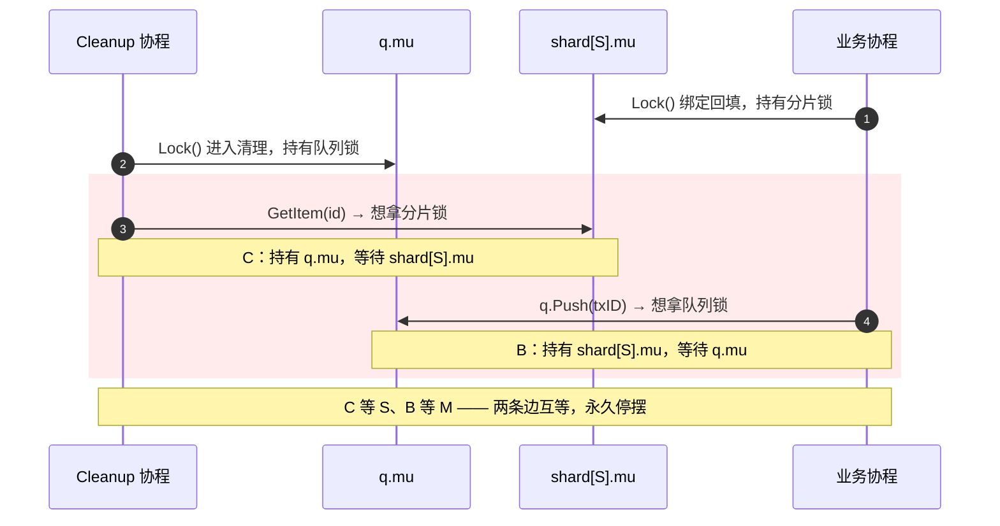
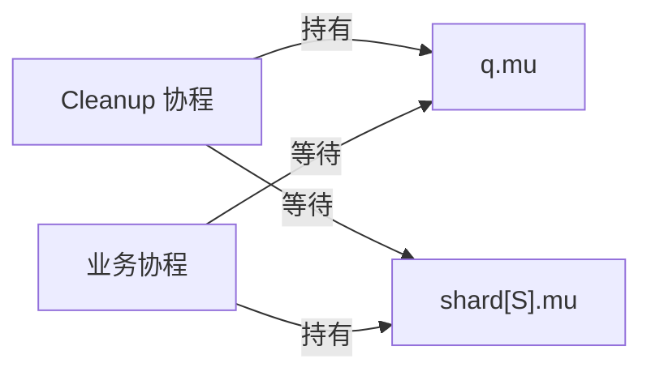
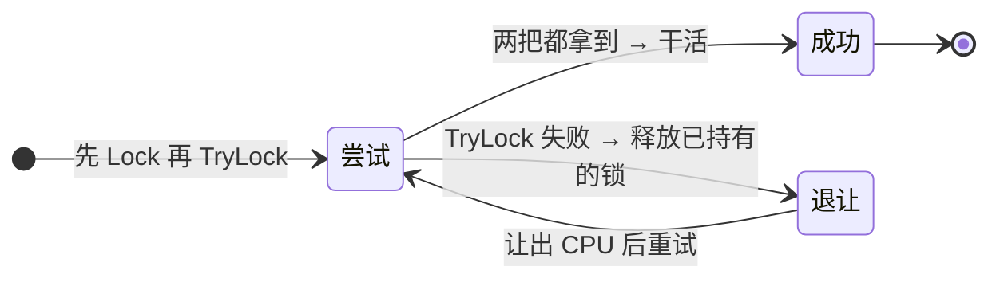
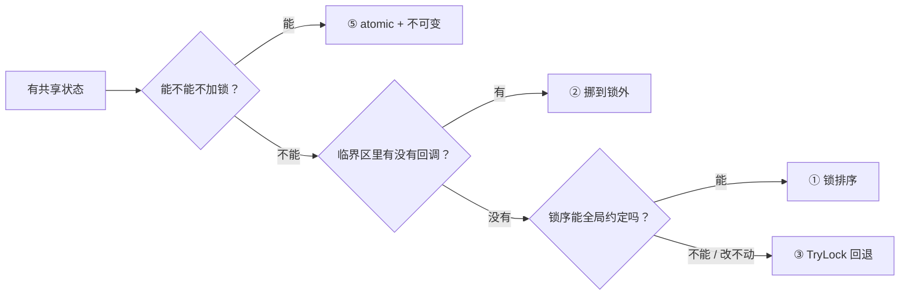

# 锁外回调、队列锁、分片锁：一句追问引出的死锁预防链

上一篇[《不用堆的延迟队列》](/blog/posts/2026/09/29-3/)结尾我甩了这么一句：

> `mu` 的临界区里只有下标与段操作——`Push`/`Pop` 全是纯内存操作，零回调；所有 store 回调都在 `mu` 之外。这不是巧合：回调若进 `mu`，形成「队列锁 → 分片锁」嵌套，与业务侧任何反向持锁顺序冲突就是死锁套餐。

有读者追问：队列锁和分片锁分别是什么？「嵌套」为什么就是死锁？`Cleanup` 不持锁又会引出什么？那篇是「是什么」，这篇补上「为什么」和「怎么防」——先给两个词显影，再把死锁的时间线摊开，最后给一张按场景取用的手段表。

<!-- more -->

## 一、那句话到底在说什么

先把场景摆清楚，术语才有落点。一个延迟队列，外加它背后的存储 `store`，组成两个角色：

- **延迟队列**有一把锁 `q.mu`，保护内部的 `[][]string` 分段切片、`headSeg` 下标和段计数。`Push` / `Pop` 的全部临界区就在这里，而且**全是纯内存操作**——挪下标、置空槽位、偶尔收缩外层数组，没有任何一次调用会跑到队列外面去。
- **存储**不归队列管。队列只认识一个 `DelayQueueStore` 接口，上面两个方法：`GetItem(id)` 和 `RemoveItem(id)`。具体实现是 tracker，它把记录按 ID hash 到 N 个分片、每片一把锁——这就是**分片锁**。`GetItem` / `RemoveItem` 只拿命中的那一把，不碰其他分片。

关键在于这个接口是一层**抽象边界**：队列拿着 `store` 调用回调时，它不知道对面有几把锁、更不知道那些锁内部还会去碰什么。接口把「谁保护什么」这件事对队列完全屏蔽了。

于是「锁外回调」这句话的完整含义是：**队列在持有 `q.mu` 期间，绝不调用 `store` 的任何方法。** 回调要么在加锁之前调、要么在解锁之后调，反正不能在 `q.mu` 的怀里调。

为什么要把这条当纪律？因为一旦回调进了 `mu`，同一时刻这个 goroutine 就同时握着两把锁的入口——而业务侧完全可能反着来。两条相反方向的持锁路径，就是下面第三节的死锁。

## 二、名词显影：两种锁的粒度取向

### 队列锁：一把粗锁守住一个不变量

`q.mu` 是典型的**粗粒度锁**：一把锁罩住整个数据结构，一个临界区，一条不变量。写起来的好处是不用动脑子——进临界区就把世界冻住，出来再解冻，中间怎么折腾都安全。

代价是串行：所有 `Push` / `Pop` 排成一条队。但这个代价这里**付得起**，因为临界区里只有内存操作，纳秒级。粗锁的唯一判据是**临界区长度**，不是锁的数量——临界区短，粗锁就是最优解；临界区长到包含 I/O、回调、分配，粗锁才变成灾难。选一把大锁还是切小，永远先看临界区里有什么，再看锁。

```go title="delay_queue.go — 纯内存的临界区"
func (q *DelayQueue) Pop() (string, bool) {
    q.mu.Lock()
    defer q.mu.Unlock()
    // 到这里为止：只碰 segments / headSeg / 段计数
    // 没有 store 调用、没有 channel、没有分配（收缩那行除外）
    if q.isEmpty() {
        return "", false
    }
    id := q.segments[q.headSeg][q.headOffset]
    q.segments[q.headSeg][q.headOffset] = "" // 断引用，字节可回收
    q.advance()
    return id, true
}
```

### 分片锁：用空间换并行度

分片锁的方向正好相反：**把一把大锁拆成 N 把，让 key 不相交的操作真正并行**。tracker 的做法是按 ID 哈希取模落到分片，`GetItem(id)` 只碰那一片。

```go title="hook.go — 分片锁的取值"
type txShard struct {
    mu      sync.RWMutex
    records map[string]*TracterRecord
}

func (t *CrossTxTracker) getTxShard(txID string) *txShard {
    hash := hashString(txID) // DJB 变体，h*33+c 写成移位加法
    return t.txShards[hash%uint32(t.shardCount)]
}
```

分片锁的选型、分片数为什么取 CPU 核数的 2-4 倍、为什么不用 `sync.Map`、预分配为什么按 `500000/shardCount`——都在[《从全量遍历到 O(1)》](/blog/posts/2026/09/29-2/)里拆过，本篇只借它的结构，不重复。

这里只强调一件事：**分片锁引入了一个粗锁世界里不存在的问题——锁序。** 一把锁的世界里，不存在「先拿谁后拿谁」；而一旦项目里出现两把以上的锁，尤其是锁还会跨越抽象边界（这里就是那个 `store` 接口），「按什么顺序拿」就从一个隐含事实变成一个**必须显式回答的协议**。回答得好，天下太平；回答漏了，就是 ABBA。

!!! quote "粗锁 vs 分片：不是好坏，是取向"

    粗锁赌「临界区短」，用串行换简单；分片锁赌「key 不相交」，用管理成本换并行。前者怕的是临界区里长出回调，后者怕的是锁与锁之间长出顺序依赖。延迟队列选了粗锁，tracker 选了分片锁——同一个系统里两种取向并存，而死锁恰恰长在两者的交界处。

## 三、ABBA 死锁：两条边互等

死锁有四个必要条件：互斥、持有并等待、不可抢占、循环等待。前三个在 Go 里几乎是白送的——`sync.Mutex` 天然互斥、天然持有并等待、天然不可抢占。**唯一能被我们主动打破的就是「循环等待」。** ABBA 死锁是循环等待最简的形态：两个 goroutine、两把锁、相反顺序。

先做一个反事实假设：假设有人图省事，把 `store` 回调塞进了 `q.mu` 的临界区。于是两条持锁路径同时存在：

- **清理路径**：`Cleanup` 拿 `q.mu` → 在临界区里调 `store.GetItem(id)` → 想拿分片锁 `shard[S].mu`。顺序是「队列锁 → 分片锁」。
- **业务路径**：绑定/回填事务在 `shard[S].mu` 内完成 → 顺手调 `q.Push(txID)` 入队 → 想拿 `q.mu`。顺序是「分片锁 → 队列锁」。

两条边方向相反，一旦撞上同一个分片 `S`，就闭环了：



把等待关系画成图更直观，它就是一个环：



两条边一旦成环，**没有任何一方会醒**。没有超时、没有重试、没有报错——两个 goroutine 各抱着自己的锁，永远 park 在对方的锁上。

比普通卡死更阴的是它**不会崩**。Go runtime 的全局死锁检测只在「所有 goroutine 都睡着」时才触发 fatal error；只要进程里还有任何一个 timer、netpoll 或别的后台协程活着，检测器就不会报警。于是线上表现是：清理协程不动了、入队开始堆积、内存慢慢涨——**一个静默的停摆，而不是一次崩溃**。日志里什么都看不到，因为它压根没走到写日志那一步。

## 四、手段分级：五招，按代价排开

知道死锁长什么样，接下来是防。防的手段不止一种，各有代价，我用「需要多少全局知识」和「改动多大」来排序，从最省事排到最彻底。

### ① 锁排序：定义全局获取顺序

最正统的一招：给所有锁定一条**全序**，任何 goroutine 都必须按这个顺序拿锁。只要所有人都遵守，循环等待就不可能成立——因为环要求某条边逆序，而全序禁止逆序。

```go title="锁排序的约定"
// 全局约定：队列锁永远先于分片锁
// 合法：q.mu → shard.mu
// 非法：shard.mu → q.mu
```

问题在于**谁来保证这条约定**。锁排序需要的是**全局知识**：顺序写在哪、跨模块怎么维护、新来的人怎么知道。在队列和 tracker 之间，隔着一个 `store` 接口——

- 「队列锁 → 分片锁」这条边的顺序由**队列**决定；
- 「分片锁 → 队列锁」那条边的顺序由**业务**决定。

队列作者根本管不到业务怎么写。于是锁排序在「锁全在自己掌控」时是好招；一旦锁跨越抽象边界，它就退化成「祈祷调用方读了文档」。而祈祷不是工程。

反过来看：要让全序成立，业务那条「分片锁 → 队列锁」就必须放弃嵌套——拿分片锁时不许调 `q.Push`，得先把分片锁放了。你发现问题了吗？**这个结论和「别嵌套」是一回事。** 在这里，锁排序自然收敛成了下一招。

### ② 锁外回调 / 临界区瘦身（29-3 的选择）

29-3 选了这条路，它的判据很朴素：

> 临界区里只做两件事——改自己的状态、读自己的状态。任何「调出去」的动作都往外挪。

```go title="delay_queue.go" hl_lines="3 8 14-16"
func (q *DelayQueue) Cleanup() {
    // 先读持有快照：锁外，零锁
    if p := q.pending.Load(); p != nil {
        // 回调全在 q.mu 之外：这里拿分片锁随便拿，不怕
        item := q.store.GetItem(p.id)
        if item == nil || item.IsCompleted() {
            q.clearPending()
        } else if time.Now().After(p.expireAt) {
            q.store.RemoveItem(p.id) // 又一个锁外回调
            atomic.AddInt64(&q.totalExpired, 1)
            q.clearPending()
        }
    }
    q.mu.Lock()
    id, ok := q.popLocked() // 只碰下标和段，纯内存
    q.mu.Unlock()
}
```

为什么这招**比锁排序更靠谱**？因为它不需要全局知识。锁排序要你回答「所有锁的全局顺序是什么」，锁外回调只要回答「**这一段代码里，我手里握着谁**」——这是**局部知识**，写这段代码的人自己就能确定，不需要跨模块协商。

更本质地说：锁外回调消掉的是死锁四个必要条件里的「**持有并等待**」。死锁的本质是「一手握 A、一手等 B」；锁外回调的纪律保证你：**永远不会一手握 A 一手等 B**——你要么在持锁做纯内存，要么在锁外做任何事。持有并等待不成立，循环等待自然无从谈起。

代价也必须摆上桌：**check 和 act 不再原子了。** 一旦把 `GetItem`（check）和 `RemoveItem`（act）挪到锁外，两步之间就有了窗口——判定「未完成」和「执行删除」之间，一桩绑定操作可能恰好插进来，把一条**已经绑定、流程正在跑**的记录删掉。这个 TOCTOU 缺口，正是 29-2 里[隐患一](/blog/posts/2026/09/29-2/)要补的：清理路径改成**条件删除**，把复查放回分片锁的临界区内，让「判定 + 删除」重新原子化。

所以 29-3 的取舍链是：**用死锁安全换掉跨锁原子性，再把丢掉的原子性在分片锁这一层单独补回来。** 拆掉一把锁的嵌套，用另一把锁的临界区收口——代价被转移，而不是凭空消失。

一条可执行的经验判据：**临界区里出现一个你一眼看不到实现的函数调用，就把它标红——它就是未来的那条死锁边。** 回调、接口方法、deferred 里跑到别人的包，全在这一类。

### ③ TryLock + 回退释放：拿不到就整体放手

有些时候回调埋在第三方库里，重构不动；这时候还有兜底招——**try-lock 回退**：加锁用 `TryLock`，拿不到就把手里已持有的锁**全部释放**，退回去重试。

```go title="try-lock 回退（示意）"
for {
    shard.mu.Lock()
    if q.mu.TryLock() {
        // 两把都到手，干活——顺序是 shard 先、q 后，和别人相反也不怕，
        // 因为拿不到就整体放手，绝不「持有并等待」
        doWork()
        q.mu.Unlock()
        shard.mu.Unlock()
        return
    }
    // 拿不到 q.mu：先把手里的 shard 放了，退出等待，回头重来
    shard.mu.Unlock()
    runtime.Gosched()
}
```

它为什么能破环？因为 ABBA 成环的前提是「持有并等待」——我抱着 `shard` 死等 `q`。而 try-lock 回退的策略是**要么全都要到，要么一个都不要**：



代价同样实打实：**忙等和活锁风险**。两个 goroutine 可能反复同时退让、同时重试，谁也拿不齐；公平性靠 `runtime.Gosched()` 和退避来缓解，但缓解不等于消除。所以 try-lock 只适合**低频、竞争可控**的路径——配置热更新、优雅关闭、后台修复任务这类「偶尔跑一次」的地方；**绝不能进热路径**，每次 `Push` 都忙等一次，性能账立刻翻车。

顺带说一句：`sync.Mutex.TryLock` 是 Go 1.18 才有的，老代码里要靠 `atomic` 手搓。

### ④ Go 的 Mutex 不可重入：另一个方向的死锁

前面三招防的都是**两个 goroutine、两把锁**的 ABBA。还有一类更隐蔽的：**同一个 goroutine、同一把锁**，自己把自己锁死。这个是 Go 特有的坑，因为 `sync.Mutex` **不可重入**。

有人会想：既然 `pending` 的读需要保护，那我把它塞进 `q.mu` 一起管不就完了？——于是 `Cleanup` 持着 `mu`，内部又调 `Pop`，而 `Pop` 第一行就是 `q.mu.Lock()`：

```go title="反例：重入死锁" hl_lines="5 8"
func (q *DelayQueue) Cleanup() {
    q.mu.Lock()
    defer q.mu.Unlock()
    // ...
    q.Pop() // Pop 内部会 q.mu.Lock() —— 同一个 goroutine 第二次拿同一把锁
}

func (q *DelayQueue) Pop() (string, bool) {
    q.mu.Lock() // 永远阻塞：锁被「自己」持有，而且是同一个人
    defer q.mu.Unlock()
    // ...
}
```

`sync.Mutex` **不记录持有者**，它不知道「锁是我自己拿的」，只知道「有人拿着」。所以同 goroutine 二次 `Lock` 会直接 park 等自己放手——**没有报错、没有超时、不 panic**，比 ABBA 更难查，因为栈里两个 goroutine 都没有，只有一个卡在自己身上的调用链。

为什么 Go 不提供可重入锁？一是成本：可重入要额外记录持有者 + 重入计数；二是设计取向——**可重入会掩盖「临界区边界到底在哪」这个问题**，让一个本该被拆开的、跨了好几个方法的大临界区看起来「能跑」。Rust 用类型系统在编译期直接禁掉二次借用，Go 只给你运行时的静默停摆。

通用解法是**拆 locked / unlocked 变体**——公开方法负责加锁，内部复用无锁版：

```go title="拆出 locked 变体"
func (q *DelayQueue) Pop() (string, bool) {
    q.mu.Lock()
    defer q.mu.Unlock()
    return q.popLocked() // 无锁实现
}

// Cleanup 若必须持锁，就调这个，不再拿锁
func (q *DelayQueue) popLocked() (string, bool) {
    // 只碰下标和段
}
```

29-3 最终的选择更彻底：`Cleanup` **全程不持锁**，`pending` 已经无锁化，连 `popLocked` 都不用单独暴露。但「拆变体」这个手法值得单独记住——它是所有重入死锁的通用解。

### ⑤ 无锁化：让锁从关键路径上消失

到这一层，思路已经反过来了：**与其想「怎么把锁拿对」，不如想「这个状态能不能不要锁」。**

`pending`（当前持有的那个元素）就是这种状态：它很小（一个 ID + 一个过期时间）、读多写少、而且被 `Cleanup` 在**不持任何锁**的情况下读——因为②那条纪律已经说了，`Cleanup` 不许持 `mu`。

第一反应是「那就各字段原子化」：

```go title="两个独立原子量：撕裂读" hl_lines="2 4"
id := atomic.LoadPointer(&q.pendingID)
// ↑ 这一刻读到的是新 ID
ea := atomic.LoadInt64(&q.pendingExpireAt)
// ↑ 但这一刻 expireAt 可能已经被换成别的值了
// → 新 ID 配旧过期时刻，清理决策直接算错
```

问题出在**撕裂读**：两个独立的原子量，各读各的，读的时刻可以交错。你在 Load `id` 的那一瞬间和 Load `expireAt` 的那一瞬间，拿到的是**两个不同版本**的组合。加锁当然能解，但这会撞上④的重入问题——`Cleanup` 要么持锁调 `Pop`（重入死锁），要么就是两个使用点都要操心两把锁的顺序。

更漂亮的做法是**改数据的形状**，而不是加锁：

```go title="delay_queue.go — 不可变快照"
// 该结构一旦写入便不再修改，通过 atomic.Pointer 整体替换，
// 保证 ID 与过期时间始终成对读取，不会出现撕裂读。
type pendingItem struct {
    id       string
    expireAt time.Time
}

// 写入：整体替换
q.pending.Store(&pendingItem{id: id, expireAt: ea})

// 读取：拿到的永远是成对一致的快照
p := q.pending.Load()
```

它把「两个需要成对原子读写的量」变成了「**一个不可变的量**」——原子性问题被降维成了形状问题。这就是 Go 并发里的经典模式 **immutable after publication**：发布后不可变，读的人不需要任何进一步同步，因为他读到的永远是一个冻住的快照。

这不是「用原子换锁」的等价替换，而是**问题本身被改写**了。代价有三：每次更新都要分配一个新对象（所以只适合这种低频、小状态的路径）；结构必须**真的**不可变（发布之后再改它的字段，等于绕过 atomic 制造数据竞争）；它只解决「小状态成对一致」，状态一大、关系一复杂，还是得回到锁。`atomic.Value` 存接口值的同类坑（首存定型、panic）在 `atomic.Pointer[T]` 上天然免疫，细节在[《atomic.Value 存接口为什么会 panic》](/blog/posts/2026/09/29-1/)里。

## 五、复盘：那条连锁约束链

五招摆在桌上，回头看 29-3 的那条链，每一环都是被上一环逼出来的：

> **锁外回调 → Cleanup 全程不能持锁 → pending 必须无锁 → 两个原子量会撕裂读 → 不可变 `pendingItem` + `atomic.Pointer` 整体替换**

- **锁外回调 ⇒ `Cleanup` 不能持 `q.mu`。** `Cleanup` 里要调 `store.GetItem` / `RemoveItem`（会拿分片锁）。若 `Cleanup` 持着 `q.mu` 再进回调，「队列锁 → 分片锁」这条边就回来了——直接回到第三节的死锁。所以回调期间，`Cleanup` 手里绝不能有 `q.mu`。
- **`Cleanup` 不能持锁 ⇒ `pending` 必须无锁可读。** 既然不持 `q.mu`，读 `pending` 就没有任何锁护着。它必须能无锁地拿到一个一致的快照。若 `pending` 还是初版那种裸 `pendingID` / `pendingExpireAt` 字段，第一段的竞态就原样复现：`Reset` 能把它清空、`Cleanup` 的 check-then-act 能删错 ID。
- **无锁 ⇒ 不能是两个独立原子量。** 各字段原子化的第一条路就撞上撕裂读，见⑤。
- **要成对读 ⇒ 改数据结构。** 两字段合成一个不可变结构体，整体替换。

再对照那三段演进，就更能看清「约束是逐层显影」这句话：

- **第一段**只看到裸字段的竞态——**局部症状**，就事论事地加保护。
- **第二段**用 `stateMu` 硬保——看到了「要保护」，却没看到「**这里为什么不能用锁**」。它给 `Cleanup` 加了一把锁，而 `Cleanup` 内部还要调 `Pop`（要 `mu`），于是三个使用点都要操心两把锁的获取顺序，锁的舞蹈跳了起来。**正确，但别扭**——别扭正是约束没吃透的信号。
- **第三段**才把整条链走完——从「不许嵌套」一路传导到「数据必须是不可变的」。中间态 `stateMu` 没落库，某种意义上反而是好事。

**「回调在锁外」不是一条孤立的纪律，它是整条链的第一张骨牌。** 抽掉任何一环，后面的都站不住。

## 六、小结：一张按场景取用的速查表

| 你的处境 | 用哪招 | 代价 / 注意 |
| :--- | :--- | :--- |
| 几把锁都在自己模块内，能约定顺序 | ① 锁排序 | 需要**全局知识**；跨接口/跨模块即失效 |
| 锁跨越接口或回调边界（如 `store`） | ② 锁外回调 | check 与 act 不再原子 → TOCTOU，需条件删除或乱序容忍 |
| 回调埋在第三方、改不动，且路径低频 | ③ TryLock + 回退释放 | 忙等 / 活锁；**别进热路径** |
| 持锁后又调用了会再拿同一把锁的方法 | ④ 拆 locked / unlocked 变体 | Go 无重入，二次 `Lock` 静默停摆 |
| 共享状态小、读多写少、需成对一致 | ⑤ atomic + 不可变快照 | 每次更新一次分配；结构必须**真**不可变 |

取用顺序，我一般这么走：



**先问「能不能不要锁」，再问「能不能不嵌套」，再问「能不能定序」，最后才用 try-lock 兜底。** 顺序是从「改形状」到「改纪律」再到「改策略」，代价单调上升。

### 注意事项

- ⚠️ **临界区里出现看不到实现的调用，就标红**：回调、接口方法、跨包的 deferred，都是潜在的死锁边
- ⚠️ **锁外回调有账要还**：check 与 act 拆开后，必须在一把锁内（这里是分片锁）把复查补回来，否则 TOCTOU 就是下一个隐患
- ⚠️ **`sync.Mutex` 不可重入不是 bug 是取向**：它逼你显式画出临界区边界；被逼着拆变体，通常比可重入锁更干净
- ⚠️ **TryLock 只救低频路径**：热路径上的忙等会把「防死锁」换成「性能塌方」
- ✅ **锁排序的前提是「锁都在自己手里」**：一旦锁跨越抽象边界，就转投锁外回调——它只要局部知识
- ✅ **改数据的形状，常常比加一把锁更省**：把「两个量需要成对原子」改写成「一个不可变量」，问题直接消失

### 回望

上一篇把「不用堆」的账算到底，这一篇把「不用锁嵌套」的账算到底，其实是同一套方法论在起作用：**形态的改善，来自约束链被走完，而不是更多的锁。** 死锁预防的道理最后收敛成一句话——

> **让「持有并等待」不成立，比让「顺序全对」更容易做到、更难写错。**

顺着这条线还能往两头读：分片锁的来历、分片数怎么定、双向索引怎么防死锁，在[《从全量遍历到 O(1)》](/blog/posts/2026/09/29-2/)；同一天另一篇[《atomic.Value 存接口为什么会 panic》](/blog/posts/2026/09/29-1/)拆的是同一套 SDK 里 atomic 的类型陷阱；队列内存结构怎么长成 `[][]string`，见[《队列的内存演进史》](/blog/posts/2026/09/30/)；而「锁外读到的一定是最新值吗」这条内存模型主线，在[《写了不等于看得见》](/blog/posts/2026/09/08/)里连着读。

---

*最后更新：2026-10-01*
