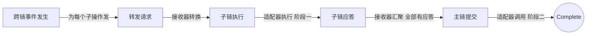

# 事件驱动入门：从“A 调 B”到手写一个事件总线

事件驱动，就是 A 做完事后不再亲自去叫 B，而是在公共频道里喊一声“我做完了”，谁关心谁来接。整个思想就这一句，剩下的都是工程细节。

<!-- more -->

这篇文章假设你没听过这个词。我们从一段最普通的代码出发，每一节只加一个新概念，最后落到 ChainMaker `cross`（跨链）模块的真实设计上。

四个可运行示例在仓库 [example/2026/10/09](https://github.com/yiiewang/yiiewang.github.io/tree/master/example/2026/10/09)，目录名 `step1_sync` 到 `step4_commit`，每个都能 `go run main.go` 直接看日志。

!!! tip "怎么读"

    前 4 节是主线，读完就能看懂事件驱动的代码。第 5 节是进阶选读，讲真实系统里会踩的并发坑。看不懂的词，文末有个小词典。

## 🟢 1. 先看痛点：A 调 B 调 C

假设一个电商流程：下单后要扣库存，扣完要发货。最直白的写法是一环调一环：

```go title="直接调用"
func 下单(商品 string) {
	fmt.Println("创建订单:", 商品)
	扣库存(商品) // (1)!
}

func 扣库存(商品 string) {
	fmt.Println("扣库存:", 商品)
	发货(商品) // (2)!
}

func 发货(商品 string) {
	fmt.Println("发货:", 商品)
}
```

1.  `下单` 必须认识 `扣库存`。
2.  `扣库存` 必须认识 `发货`。

能跑，也很直观。问题出在需求变化的时候。

产品说：下单后要发短信。你得改 `下单` 的代码，在里面再加一行调用。过两天又要发积分，再改一次。

每个新需求都在改老代码，而且你很难单独测试“扣库存”这一步，因为它顺手把“发货”也拖进来了。

## 2. 换个思路：只“喊一声”

事件驱动的做法是让每一环只报告“发生了什么”，不管谁来接：

```text
下单处理完    →  喊一声：“订单已创建”
有人关心这个  →  事先登记过：“‘订单已创建’归我管”
```

类比快递柜。快递员把包裹放进柜子，不关心谁来取。收件人收到取件通知，自己去取。两边互不认识，靠柜子连接。

这里出现了四个角色：

| 角色 | 一句话 | 上面例子里的对应 |
| --- | --- | --- |
| 事件 | 一条“发生了什么”的消息 | “订单已创建” |
| 发布者 | 喊的人 | 下单这一环 |
| 处理器 | 事先登记“我管哪种事件”的人 | 扣库存、发短信 |
| 总线 | 那个柜子：记录谁管什么，负责转交 | 下面要写的 `Bus` |

总线的本质，就是一张 `map[事件类型][]处理器` 的登记表。`Pub`（发布）的动作就是：查表，找到登记的处理器，挨个调用。

```go title="一个能跑的最小总线" linenums="1" hl_lines="10 12-14 16-20"
type Event struct {
	Type string // 事件类型：决定谁来处理
	Data string // 事件携带的内容
}

type Handler func(Event)

type Bus struct{ handlers map[string][]Handler }

func (b *Bus) Register(t string, h Handler) { // (1)!
	b.handlers[t] = append(b.handlers[t], h)
}

func (b *Bus) Pub(e Event) { // (2)!
	for _, h := range b.handlers[e.Type] {
		h(e)
	}
}
```

1.  登记：“`t` 这种事件归 `h` 管”。
2.  发布：查表，把事件交给每个登记者。

把前面的流程改写成事件版：

```go title="事件版"
bus := &Bus{handlers: map[string][]Handler{}}

bus.Register("下单", func(e Event) {
	fmt.Println("创建订单:", e.Data)
	bus.Pub(Event{Type: "订单已创建", Data: e.Data}) // 只喊一声
})
bus.Register("订单已创建", func(e Event) {
	fmt.Println("扣库存:", e.Data)
	bus.Pub(Event{Type: "库存已扣", Data: e.Data})
})
bus.Register("库存已扣", func(e Event) {
	fmt.Println("发货:", e.Data)
})

bus.Pub(Event{Type: "下单", Data: "商品A"})
```

输出和直接调用完全一样。区别是现在没有任何一环认识下一环，它们只认识事件名。

再来看开头那个“加短信”的需求，只需要 **新增** 一段登记，上面三段一行不改：

```go
bus.Register("订单已创建", func(e Event) {
	fmt.Println("发短信:", e.Data)
})
```

输出多了一行 `发短信: 商品A`。这就是事件驱动最直接的收益：加功能是“加”，不是“改”。

## 3. 写得像样一点：用接口声明“我管什么”

上面的 `Register` 要调用者手动写事件名，容易漏、容易错。更规整的做法是让处理器自己声明：

```go title="step1_sync/main.go"
type Handler interface {
	Name() string
	SupportEventTypes() []EventType // 我管哪几种事件
	Handle(e *Event) (interface{}, error) // 收到事件怎么处理
}
```

总线登记时读 `SupportEventTypes()`，自动建好那张表。`cross` 里就是这个结构：处理器实现 `Handle` 和 `SupportEventOpTypes`，总线是 `HookEventBus`，事件是 `event.OpEvent`，用 `OpType` 区分种类。

运行 `step1_sync`（订单、库存、发货，外加短信、积分两个“新增订阅者”），输出如下：

```text
[   0ms] main: 发布 [下单]
[   0ms] [订单] 创建订单: 商品A
[   0ms] [库存] 扣减库存: 商品A
[   0ms] [发货] 安排发货: 商品A
[   0ms] [短信] 通知用户: 商品A
[   0ms] [积分] 发放积分: 商品A
[   0ms] main: Pub 返回（此时整条链路已全部执行完）
```

留意最后一行：`Pub` 要等整条链路全部跑完才返回。所以“发货”排在“短信”前面，因为库存处理器喊出“库存已扣”后，发货当场跑完，才轮到同一事件下的下一个订阅者。

这种“发布时当场执行、等结果”的方式，叫 **同步**。

## 4. 同步不够用：异步发布

同步有个明显限制：发布者必须等。如果某个处理器很慢（比如调用外部系统要 300ms），发布者就被卡住。

类比餐厅：同步是你站在柜台前等菜做好；异步是拿一个号码牌先走开，做好了叫你。

异步的做法是：`Pub` 把事件放进一个 **队列** 就立刻返回，后台另有一个协程负责取出事件、分给处理器。

!!! info "两个 Go 的词"

    - goroutine（协程）：Go 里轻量的并发执行单元，`go f()` 就起一个。
    - channel（通道）：协程之间传数据的管道，这里用来当事件队列。

`cross` 提供两种发布方式，`step2_async` 都实现了：

- `SyncPubMode`：当场执行并拿到返回值。适合“必须知道结果”的场景，比如 `AddChain` 要立刻知道建链成不成功。
- `AsyncSubPubMode`：入队就返回，后台处理。适合监听链上事件这类不能阻塞发布者的场景。

```go title="step2_async/main.go" hl_lines="5-8 14-16"
func (b *Bus) Pub(e *Event, mode PubMode) (interface{}, error) {
	hs := b.handlersOf(e.Type)

	if mode == SyncPubMode {
		// 同步：当场执行，返回处理器的真实结果（要求恰好一个处理器）
		return hs[0].Handle(e)
	}
	// ... 省略：处理器为空、总线已关闭的检查
	b.wg.Add(len(hs)) // 先记账：有 N 件活还没干完
	select {
	case b.queue <- queued{e: e, hs: hs}:
		return nil, nil // 只代表“已入队”
	case <-b.closeC:
		b.wg.Add(-len(hs))
		return nil, ErrBusClosed
	}
}
```

连续发布三个“下单”，库存耗时分别是 A=300ms、B=100ms、C=200ms，实际输出：

```text
[   0ms] main: 3 个 Pub 已全部返回（只代表入队，处理还没完成）
...
[ 100ms] [发货] 商品B 已发货
[ 200ms] [发货] 商品C 已发货
[ 301ms] [发货] 商品A 已发货
[ 301ms] main: Close 返回（所有在途事件，含链式产生的，已处理完）
```

三个 `Pub` 在 0ms 就全部返回了，而处理花了 300ms，完成顺序是 B、C、A。异步有三个后果，必须记住：

1. 返回成功只代表“已入队”，不代表“已处理完”。
2. 处理顺序不保证。
3. 错误不会返回给发布者，只能看日志或数据库状态。

!!! tip "所以 `cross` 每一步都要写库"

    事件本身在内存里，进程一挂就没了。把每一步的状态写进数据库，重启后才能靠 `DoRecovery` 接着往下走。异步加落库状态，是这套设计的一对搭档。

!!! warning "示例与 `cross` 的一处差异"

    `cross` 的 `Close` 只等待 `AsyncSub` 处理协程，不排空队列。示例通过“发布时先记账”做到了排空，便于观察结果，但别当成 `cross` 的行为。

## 5. Hook：处理器前后的检查站

业务做大了会有新需求：每个事件都要记审计日志；某些事件要拦截；想统计耗时。如果每个处理器都自己写一遍，既重复又侵入。

Hook 就是在处理器执行前后插入的检查站，思路类似中间件或机场安检：

```text
事件 → [前置 Hook：可拒绝] → 处理器 → [后置 Hook：能看到结果和错误]
```

`step3_hook` 把所有处理器调用收敛到一个入口：

```go title="step3_hook/main.go" hl_lines="6 12"
func (b *Bus) handleEvent(e *Event, h Handler) (interface{}, error) {
	if b.hooks == nil {
		return h.Handle(e)
	}
	ctx := &HookContext{Event: e, HandlerName: h.Name(), Point: BeforeHandle}
	if !b.hooks.Execute(ctx) { // 前置 Hook 说“拒绝”，就到此为止
		return nil, nil
	}

	result, err := h.Handle(e)

	ctx.Point, ctx.Result, ctx.Err = AfterHandle, result, err
	b.hooks.Execute(ctx) // 后置 Hook 能看到结果和错误
	return result, err
}
```

示例注册了三个 Hook（故意乱序注册，由优先级排序，数值越小越先执行）：

| Hook | 优先级 | 触发点 | 行为 |
| --- | --- | --- | --- |
| 黑名单 Hook | 1 | 前置 | 遇到“违禁品”就拒绝 |
| 故障 Hook | 5 | 前置 | 永远返回错误 |
| 审计 Hook | 100 | 前置 + 后置 | 打印事件、结果和错误 |

分别下单“正常商品 / 违禁品 / 缺货商品”，能观察到四条规则：

1. Hook 自己出错，只记日志并继续，不拖垮主流程。
2. Hook 返回拒绝就短路，后面的 Hook 和处理器都不执行。违禁品的日志里没有审计记录，因为审计 Hook 优先级更低，没轮到。
3. 后置 Hook 能拿到处理器的结果和错误，即使处理器出错（缺货商品那条：`err=库存不足`）。
4. 同步调用时，调用方依然能拿到处理器的真实错误。

处理器代码在这一步 **一行没改**。业务方想审计、拦截、统计，注册一个 Hook 就行。

到这里，事件驱动的主线讲完了：事件、处理器、总线，加上异步和 Hook。

## 6. 进阶选读：并发汇聚的“只提交一次”

真实系统里，异步带来最难的问题是并发。`step4_commit` 用总线模拟 `cross` 的跨链流程，并复现一个典型的坑。

先说背景。一个跨链事务要同时操作多条子链，采用 **两阶段提交**：

1. 阶段一：每条子链各自执行合约，执行完回一个应答（成功或失败都回）。
2. 阶段二：全部应答收齐后，在主链上调用一次 Commit 合约做最终提交。

流转过程如下：



每个箭头都是“发布一个事件”，每个节点背后是一个处理器：`AdapterHandler` 管和链交互，`ReceiverHandler` 管转发与汇聚。

关键代码在 `handleResponse`。每收到一个应答，做三件事：写自己、读全部、判断是否收齐。

```go title="step4_commit/main.go" hl_lines="3 5 10"
func (h *ReceiverHandler) handleResponse(e *Event) error {
	// ... 省略：取出应答载荷
	h.store.MarkProved(resp.CrossID, resp.ExecIdx, resp.OK) // 1. 写自己

	subs := h.store.LoadSubs(resp.CrossID) // 2. 读全部
	// ... 省略：统计已有应答的个数 proved
	if proved != len(subs) {
		return nil // 还没收齐，等别人来触发
	}

	// 3. 收齐了，发布 Commit
	_, err = h.bus.Pub(&Event{Type: EvCommit, Data: &CommitReq{...}}, AsyncSubPubMode)
	return err
}
```

三条子链几乎同时返回，每个应答都在自己的协程里跑。三个协程在各自的“读全部”里都看到了 3/3，都认为“我是最后一个”，于是各发一次 Commit。

无防护时的实测输出：

```text
[  76ms] [适配器] 阶段二：调用主链 Commit 合约（第 1 次）
[  77ms] [适配器] 阶段二：调用主链 Commit 合约（第 2 次），重复提交！
[  78ms] [适配器] 阶段二：调用主链 Commit 合约（第 3 次），重复提交！
```

真实的 Commit 合约通常不是幂等的，重复调用可能重复结算，或被合约拒绝并报错。

修复方法是把“是否已提交过”的检查和标记合成一个原子操作：

```go title="step4_commit/main.go"
if _, loaded := h.commitGuard.LoadOrStore(resp.CrossID, struct{}{}); loaded {
	return nil // 别人已经发布过 Commit，我跳过
}
```

加防护后，三个应答仍然都看到 3/3，但只有一个抢到占位，Commit 只调用 1 次。

!!! warning "不能写成先 `Load` 再 `Store`"

    先判断、再标记，仍然是“先检查后行动”：两个协程可能都 Load 到“不存在”，再各自 Store。`LoadOrStore` 保证只有一个调用方得到 `loaded=false`。

另外，`go run -race` 对这个例子 **不会报警**。每次访问都加了锁，没有数据竞态，出错的是逻辑，`-race` 抓不到，只能靠推演并发交错来发现。

## 7. 回头读 `cross` 源码

现在可以按顺序读了。每步先回答一个问题再往下：

1. `cross/module/event/event.go`：有哪些事件类型？按名字猜先后顺序。
2. `cross/module/handler` 的 `EventHandler` 接口：一个处理器要提供哪几个方法？
3. `cross/module/bus/hook_bus.go` 的 `RegisterHandler`、`PubEvent`、`invoke`：对照前面的总线，看它多了什么（channel、协程、Hook）。
4. `cross/module/receiver/receiver_handler.go`：最小的处理器，只有 98 行，先读通。
5. `cross/ARCHITECTURE.md` 第 6 节的流转图：把每个箭头标成“发布了哪个事件、谁处理”。

示例与 `cross` 的对应关系：

| 示例 | `cross` |
| --- | --- |
| `AdapterHandler.onOccur` | `adapter_handler.go` 的 `handleListenData` / `handleSubEvent` |
| `ReceiverHandler.handleRequest` | `receiver.go` 的 `handleRequest` |
| `AdapterHandler.onExecute` | `adapter_handler.go` 的 `crossEventExecute` |
| `ReceiverHandler.handleResponse` | `receiver.go` 的 `handleResponse`（含 `commitGuard`） |
| `AdapterHandler.onCommit` | `adapter_handler.go` 的 `crossEventCommit` |

示例相对 `cross` 做了简化：省略了证明器（prover），汇聚时当前这条应答也从存储读取，而 `cross` 对当前应答使用内存中的证明上下文，其余才从库里读。

## 小结

事件驱动就是一张登记表加一个“喊一声”的动作：发布者不认识处理器，处理器只认识事件。收益是加功能靠新增，不靠修改。

在此之上，异步让发布者不被阻塞，代价是“成功只代表入队、顺序不保证、错误回不来”，所以状态要落库。Hook 让审计、拦截不侵入业务。而异步处理器天然并发，“收齐了再提交”这类汇聚逻辑必须保证只触发一次。

建议先把第 2 节的最小总线自己敲一遍，再去读 `receiver_handler.go`。

??? note "小词典"

    - 事件：一条“发生了什么”的消息，带类型和数据。
    - 发布（Pub）：把事件交给总线。
    - 处理器（Handler）：声明自己管哪些事件，并实现处理逻辑。
    - 总线（Bus）：登记处理器、按事件类型分发的组件。
    - 同步：发布者等处理完才继续，能拿到结果。
    - 异步：事件入队就返回，后台处理，拿不到结果。
    - Hook：处理器前后的检查点，可拦截、审计、统计。
    - 两阶段提交：先让各方分别执行，全部有应答后再统一提交。
    - 幂等：同一操作重复执行，结果与执行一次相同。
    - 数据竞态：多个协程无保护地读写同一数据。逻辑竞态则是每步都安全，但步骤之间的交错导致结果错误。

---

*最后更新：2026-10-09*
