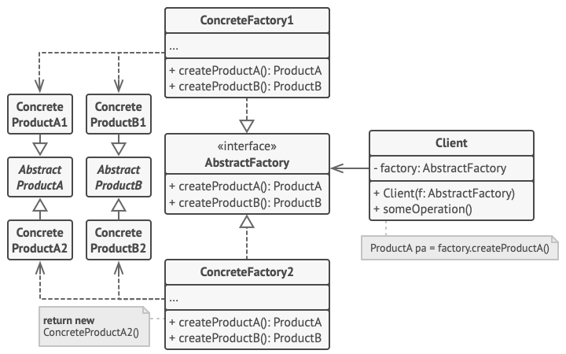

# 抽象工厂模式：生产"全家桶"的工厂

去麦当劳点餐，你可能会点"麦辣鸡腿堡套餐"——汉堡、薯条、可乐，全是麦当劳风味。去肯德基，同样是套餐，但风味就变成了肯德基的。这就是抽象工厂的精髓： **同一个工厂生产的产品必须"配套"**。

**抽象工厂模式** 能创建一系列相关的对象，而无需指定它们的具体类。它保证你不会把麦当劳的汉堡和肯德基的可乐混搭在一起。

## 为什么需要抽象工厂？

假设你在开发一个运动品牌电商系统，卖鞋子和衣服：

```go
// ❌ 糟糕的写法：可能产生不匹配的组合
func createProducts(brand string) (Shoe, Shirt) {
    var shoe Shoe
    var shirt Shirt
    
    // 不小心写错了：耐克的鞋配阿迪的衣服
    shoe = &NikeShoe{}
    shirt = &AdidasShirt{}  // 品牌不匹配！
    
    return shoe, shirt
}
```

这样写的问题：

- **容易出错** ：手动创建产品时可能搭配错误
- **难以扩展** ：新增品牌需要改很多地方
- **违反开闭原则** ：每次新增产品线都要改核心代码

抽象工厂的解法： **让工厂负责生产"全家桶"，保证同一工厂的产品必定匹配**。

## 模式结构



| 角色 | 职责 | 类比 |
|------|------|------|
| **AbstractFactory（抽象工厂）** | 声明创建产品族的方法 | 运动品牌（能生产鞋和衣服） |
| **ConcreteFactory（具体工厂）** | 生产特定品牌的产品 | Nike 工厂、Adidas 工厂 |
| **AbstractProduct（抽象产品）** | 定义产品接口 | 鞋子接口、衣服接口 |
| **ConcreteProduct（具体产品）** | 实现具体产品 | Nike 鞋、Adidas 衣服 |

## 动手实现：运动品牌生产线

用运动品牌的鞋子和衣服来演示抽象工厂模式。

### 第一步：画出产品矩阵

|  | 鞋子 (Shoe) | 衣服 (Shirt) |
|--|-------------|--------------|
| **Nike** | NikeShoe | NikeShirt |
| **Adidas** | AdidasShoe | AdidasShirt |

### 第二步：定义抽象产品

=== "📄 shoe.go: 鞋子接口"

    ```go
    package main

    // IShoe 鞋子接口
    type IShoe interface {
        SetLogo(logo string)
        SetSize(size int)
        GetLogo() string
        GetSize() int
    }

    // Shoe 鞋子基类
    type Shoe struct {
        logo string
        size int
    }

    func (s *Shoe) SetLogo(logo string) { s.logo = logo }
    func (s *Shoe) GetLogo() string     { return s.logo }
    func (s *Shoe) SetSize(size int)    { s.size = size }
    func (s *Shoe) GetSize() int        { return s.size }
    ```

=== "📄 shirt.go: 衣服接口"

    ```go
    package main

    // IShirt 衣服接口
    type IShirt interface {
        SetLogo(logo string)
        SetSize(size int)
        GetLogo() string
        GetSize() int
    }

    // Shirt 衣服基类
    type Shirt struct {
        logo string
        size int
    }

    func (s *Shirt) SetLogo(logo string) { s.logo = logo }
    func (s *Shirt) GetLogo() string     { return s.logo }
    func (s *Shirt) SetSize(size int)    { s.size = size }
    func (s *Shirt) GetSize() int        { return s.size }
    ```

### 第三步：实现具体产品

=== "📄 nike_shoe.go & nike_shirt.go"

    ```go
    // Nike 鞋
    type NikeShoe struct{ Shoe }

    // Nike 衣服
    type NikeShirt struct{ Shirt }
    ```

=== "📄 adidas_shoe.go & adidas_shirt.go"

    ```go
    // Adidas 鞋
    type AdidasShoe struct{ Shoe }

    // Adidas 衣服
    type AdidasShirt struct{ Shirt }
    ```

### 第四步：定义抽象工厂

=== "📄 sports_factory.go: 抽象工厂接口"

    ```go
    package main

    import "fmt"

    // ISportsFactory 运动品牌工厂接口
    type ISportsFactory interface {
        MakeShoe() IShoe
        MakeShirt() IShirt
    }

    // GetSportsFactory 根据品牌返回对应工厂
    func GetSportsFactory(brand string) (ISportsFactory, error) {
        switch brand {
        case "nike":
            return &Nike{}, nil
        case "adidas":
            return &Adidas{}, nil
        default:
            return nil, fmt.Errorf("未知品牌: %s", brand)
        }
    }
    ```

### 第五步：实现具体工厂

=== "📄 nike.go: Nike 工厂"

    ```go
    package main

    // Nike 工厂，生产 Nike 全系列产品
    type Nike struct{}

    func (n *Nike) MakeShoe() IShoe {
        return &NikeShoe{
            Shoe: Shoe{logo: "✓ Nike", size: 42},
        }
    }

    func (n *Nike) MakeShirt() IShirt {
        return &NikeShirt{
            Shirt: Shirt{logo: "✓ Nike", size: 180},
        }
    }
    ```

=== "📄 adidas.go: Adidas 工厂"

    ```go
    package main

    // Adidas 工厂，生产 Adidas 全系列产品
    type Adidas struct{}

    func (a *Adidas) MakeShoe() IShoe {
        return &AdidasShoe{
            Shoe: Shoe{logo: "三道杠 Adidas", size: 43},
        }
    }

    func (a *Adidas) MakeShirt() IShirt {
        return &AdidasShirt{
            Shirt: Shirt{logo: "三道杠 Adidas", size: 175},
        }
    }
    ```

### 第六步：使用抽象工厂

=== "📄 main.go: 客户端代码"

    ```go
    package main

    import "fmt"

    func main() {
        // 获取 Nike 工厂
        nikeFactory, _ := GetSportsFactory("nike")
        nikeShoe := nikeFactory.MakeShoe()
        nikeShirt := nikeFactory.MakeShirt()

        fmt.Println("=== Nike 套装 ===")
        fmt.Printf("鞋子: %s, 尺码: %d\n", nikeShoe.GetLogo(), nikeShoe.GetSize())
        fmt.Printf("衣服: %s, 尺码: %d\n", nikeShirt.GetLogo(), nikeShirt.GetSize())

        // 获取 Adidas 工厂
        adidasFactory, _ := GetSportsFactory("adidas")
        adidasShoe := adidasFactory.MakeShoe()
        adidasShirt := adidasFactory.MakeShirt()

        fmt.Println("\n=== Adidas 套装 ===")
        fmt.Printf("鞋子: %s, 尺码: %d\n", adidasShoe.GetLogo(), adidasShoe.GetSize())
        fmt.Printf("衣服: %s, 尺码: %d\n", adidasShirt.GetLogo(), adidasShirt.GetSize())
    }
    ```

=== "📄 output.txt: 执行结果"

    ```
    === Nike 套装 ===
    鞋子: ✓ Nike, 尺码: 42
    衣服: ✓ Nike, 尺码: 180

    === Adidas 套装 ===
    鞋子: 三道杠 Adidas, 尺码: 43
    衣服: 三道杠 Adidas, 尺码: 175
    ```

## 抽象工厂 vs 工厂方法

| 特性 | 工厂方法 | 抽象工厂 |
|------|---------|---------|
| **产品数量** | 一种产品 | 一系列相关产品 |
| **关注点** | 创建单个对象 | 创建产品族 |
| **扩展方式** | 新增产品类 | 新增工厂类 |
| **典型场景** | 日志记录器工厂 | UI 组件工厂（按风格） |

## 什么时候该用抽象工厂？

| 场景 | 说明 |
|------|------|
| **产品有多个系列** | 如 Windows/Mac/Linux 风格的 UI 组件 |
| **产品必须配套使用** | 如同品牌的鞋子和衣服 |
| **需要切换产品系列** | 如切换数据库（MySQL 全家桶 / PostgreSQL 全家桶） |

## 优缺点分析

| ✅ 优点 | ❌ 缺点 |
|---------|---------|
| **保证产品配套** ：同工厂出品必定兼容 | **新增产品类型困难** ：要改所有工厂类 |
| **解耦客户端** ：客户端不依赖具体产品类 | **类数量增加** ：工厂和产品类都会增多 |
| **易于切换产品系列** ：换个工厂即可 | |

## 与其他模式的关系

| 模式组合 | 说明 |
|----------|------|
| **抽象工厂 → 工厂方法** | 抽象工厂通常由一组工厂方法组成 |
| **抽象工厂 + 原型** | 用原型模式实现工厂的创建方法 |
| **抽象工厂 + 单例** | 工厂类通常做成单例 |

> **一句话总结** ：抽象工厂就像快餐品牌的套餐——你只需要选择品牌（工厂），就能得到一整套风格统一的产品。
