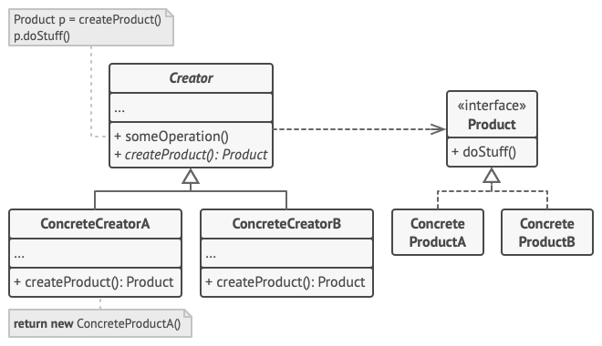

工厂方法模式是一种创建型设计模式， 其在父类中提供一个创建对象的方法， 允许子类决定实例化对象的类型。

## 模式结构



1. 产品 （Product） 将会对接口进行声明。 对于所有由创建者及其子类构建的对象， 这些接口都是通用的。
2. 具体产品 （Concrete Products） 是产品接口的不同实现。
3. 创建者 （Creator） 类声明返回产品对象的工厂方法。 该方法的返回对象类型必须与产品接口相匹配。

    你可以将工厂方法声明为抽象方法， 强制要求每个子类以不同方式实现该方法。 或者， 你也可以在基础工厂方法中返回默认产品类型。

    注意， 尽管它的名字是创建者， 但它最主要的职责并不是创建产品。 一般来说， 创建者类包含一些与产品相关的核心业务逻辑。 工厂方法将这些逻辑处理从具体产品类中分离出来。 打个比方， 大型软件开发公司拥有程序员培训部门。 但是， 这些公司的主要工作还是编写代码， 而非生产程序员。

4. 具体创建者 （Concrete Creators） 将会重写基础工厂方法， 使其返回不同类型的产品。

    注意， 并不一定每次调用工厂方法都会创建新的实例。 工厂方法也可以返回缓存、 对象池或其他来源的已有对象。

## 适用场景

* **当你在编写代码的过程中， 如果无法预知对象确切类别及其依赖关系时， 可使用工厂方法。**

    工厂方法将创建产品的代码与实际使用产品的代码分离， 从而能在不影响其他代码的情况下扩展产品创建部分代码。

    例如， 如果需要向应用中添加一种新产品， 你只需要开发新的创建者子类， 然后重写其工厂方法即可。

* **如果你希望用户能扩展你软件库或框架的内部组件， 可使用工厂方法。**

    继承可能是扩展软件库或框架默认行为的最简单方法。 但是当你使用子类替代标准组件时， 框架如何辨识出该子类？

    解决方案是将各框架中构造组件的代码集中到单个工厂方法中， 并在继承该组件之外允许任何人对该方法进行重写。

    让我们看看具体是如何实现的。 假设你使用开源 UI 框架编写自己的应用。 你希望在应用中使用圆形按钮， 但是原框架仅支持矩形按钮。 你可以使用 圆形按钮Round­Button子类来继承标准的 按钮Button类。 但是， 你需要告诉 UI框架UIFramework类使用新的子类按钮代替默认按钮。

    为了实现这个功能， 你可以根据基础框架类开发子类 圆形按钮 UIUIWith­Round­Buttons ， 并且重写其 create­Button创建按钮方法。 基类中的该方法返回 按钮对象， 而你开发的子类返回 圆形按钮对象。 现在， 你就可以使用 圆形按钮 UI类代替 UI框架类。 就是这么简单！

* **如果你希望复用现有对象来节省系统资源， 而不是每次都重新创建对象， 可使用工厂方法。**

    在处理大型资源密集型对象 （比如数据库连接、 文件系统和网络资源） 时， 你会经常碰到这种资源需求。

    让我们思考复用现有对象的方法：

    1. 首先， 你需要创建存储空间来存放所有已经创建的对象。
    2. 当他人请求一个对象时， 程序将在对象池中搜索可用对象。
    3. … 然后将其返回给客户端代码。
    4. 如果没有可用对象， 程序则创建一个新对象 （并将其添加到对象池中）。

    这些代码可不少！ 而且它们必须位于同一处， 这样才能确保重复代码不会污染程序。

    可能最显而易见， 也是最方便的方式， 就是将这些代码放置在我们试图重用的对象类的构造函数中。 但是从定义上来讲， 构造函数始终返回的是新对象， 其无法返回现有实例。

    因此， 你需要有一个既能够创建新对象， 又可以重用现有对象的普通方法。 这听上去和工厂方法非常相像。

## 实现方式

1. 让所有产品都遵循同一接口。 该接口必须声明对所有产品都有意义的方法。

=== "iGun.go: 产品接口"

    ```go 
    package main

    type IGun interface {
        setName(name string)
        setPower(power int)
        getName() string
        getPower() int
    }
    ```

1. 在创建类中添加一个空的工厂方法。 该方法的返回类型必须遵循通用的产品接口。
1. 在创建者代码中找到对于产品构造函数的所有引用。 将它们依次替换为对于工厂方法的调用， 同时将创建产品的代码移入工厂方法。

    你可能需要在工厂方法中添加临时参数来控制返回的产品类型。

    工厂方法的代码看上去可能非常糟糕。 其中可能会有复杂的 switch分支运算符， 用于选择各种需要实例化的产品类。 但是不要担心， 我们很快就会修复这个问题。

=== "gunFactory.go: 工厂"

    ```go 
    package main

    import "fmt"

    func getGun(gunType string) (IGun, error) {
        if gunType == "ak47" {
            return newAk47(), nil
        }
        if gunType == "musket" {
            return newMusket(), nil
        }
        return nil, fmt.Errorf("Wrong gun type passed")
    }
    ```

1. 现在， 为工厂方法中的每种产品编写一个创建者子类， 然后在子类中重写工厂方法， 并将基本方法中的相关创建代码移动到工厂方法中。

=== "gun.go: 具体产品"

    ```go 
    package main

    type Gun struct {
        name  string
        power int
    }

    func (g *Gun) setName(name string) {
        g.name = name
    }

    func (g *Gun) getName() string {
        return g.name
    }

    func (g *Gun) setPower(power int) {
        g.power = power
    }

    func (g *Gun) getPower() int {
        return g.power
    }
    ```

=== "ak47.go: 具体产品"

    ```go 
    package main

    type Ak47 struct {
        Gun
    }

    func newAk47() IGun {
        return &Ak47{
            Gun: Gun{
                name:  "AK47 gun",
                power: 4,
            },
        }
    }
    ```

=== "musket.go: 具体产品"

    ```go 
    package main

    type musket struct {
        Gun
    }

    func newMusket() IGun {
        return &musket{
            Gun: Gun{
                name:  "Musket gun",
                power: 1,
            },
        }
    }
    ```

1. 如果应用中的产品类型太多， 那么为每个产品创建子类并无太大必要， 这时你也可以在子类中复用基类中的控制参数。

    例如， 设想你有以下一些层次结构的类。 基类 邮件及其子类 航空邮件和 陆路邮件 ； ​ 运输及其子类 飞机, 卡车和 火车 。 ​ 航空邮件仅使用 飞机对象， 而 陆路邮件则会同时使用 卡车和 火车对象。 你可以编写一个新的子类 （例如 火车邮件 ） 来处理这两种情况， 但是还有其他可选的方案。 客户端代码可以给 陆路邮件类传递一个参数， 用于控制其希望获得的产品。
1. 如果代码经过上述移动后， 基础工厂方法中已经没有任何代码， 你可以将其转变为抽象类。 如果基础工厂方法中还有其他语句， 你可以将其设置为该方法的默认行为。

=== "main.go: 客户端代码"

    ```go  
    package main

    import "fmt"

    func main() {
        ak47, _ := getGun("ak47")
        musket, _ := getGun("musket")

        printDetails(ak47)
        printDetails(musket)
    }

    func printDetails(g IGun) {
        fmt.Printf("Gun: %s", g.getName())
        fmt.Println()
        fmt.Printf("Power: %d", g.getPower())
        fmt.Println()
    }
    ```

=== "output.txt: 执行结果"

    ```plain 
    Gun: AK47 gun
    Power: 4
    Gun: Musket gun
    Power: 1
    ```

## 优缺点

| 优点                                                                             | 缺点                                                                                                                 |
| -------------------------------------------------------------------------------- | -------------------------------------------------------------------------------------------------------------------- |
| 你可以避免创建者和具体产品之间的紧密耦合。                                       | 应用工厂方法模式需要引入许多新的子类， <br/>代码可能会因此变得更复杂。 最好的情况是将该模式引入创建者类的现有层次结构中。 |
| 单一职责原则。 你可以将产品创建代码放在程序的单一位置， 从而使得代码更容易维护。 |                                                                                                                      |
| 开闭原则。 无需更改现有客户端代码， 你就可以在程序中引入新的产品类型。           |                                                                                                                      |

## 与其他模式的关系

* 在许多设计工作的初期都会使用 **工厂方法模式**（较为简单， 而且可以更方便地通过子类进行定制）， 随后演化为使用 **抽象工厂模式**、 **原型模式** 或 **生成器模式**（更灵活但更加复杂）。
* **抽象工厂模式** 通常基于一组工厂方法， 但你也可以使用 **原型模式** 来生成这些类的方法。
* 你可以同时使用 **工厂方法** 和 **迭代器模式** 来让子类集合返回不同类型的迭代器， 并使得迭代器与集合相匹配。
* **原型** 并不基于继承， 因此没有继承的缺点。 另一方面， 原型需要对被复制对象进行复杂的初始化。 **工厂方法** 基于继承， 但是它不需要初始化步骤。
* **工厂方法** 是 **模板方法模式** 的一种特殊形式。 同时， 工厂方法可以作为一个大型模板方法中的一个步骤。
