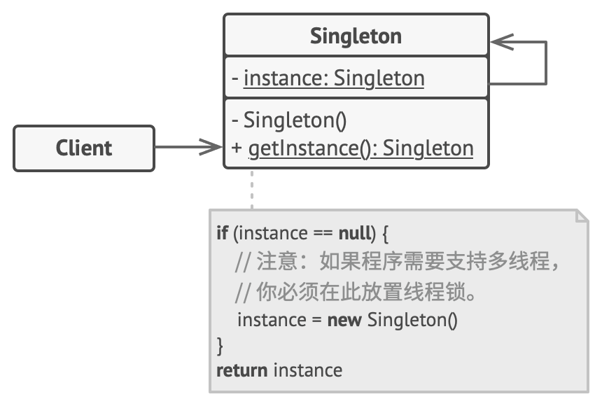

# 单例模式：全局只此一家

有些东西天生就只能有一个：一个国家只有一个首都，一个公司只有一个 CEO，一个系统只有一个配置管理器。单例模式就是确保 **某个类在整个程序中只有一个实例，并提供一个全局访问点**。

## 为什么需要单例？

假设你的程序需要访问数据库：

```go
// ❌ 糟糕的写法：每次都创建新连接
func doSomething() {
    db := NewDBConnection()  // 创建连接 1
    db.Query("SELECT ...")
}

func doAnotherThing() {
    db := NewDBConnection()  // 创建连接 2
    db.Query("SELECT ...")
}
// 连接泛滥！资源浪费！
```

这样写的问题：

- **资源浪费** ：每次都创建新连接，系统资源很快耗尽
- **状态不一致** ：多个实例可能有不同的状态
- **难以管理** ：无法统一控制访问

单例模式的解法： **只创建一个实例，所有人共享这个实例**。

## 模式结构



单例模式的核心很简单：

1. **私有构造函数** ：防止外部 `new`
2. **静态实例变量** ：保存唯一实例
3. **公共获取方法** ：提供全局访问点

## 动手实现：数据库连接池

### Go 语言实现（线程安全）

=== "📄 singleton.go: 单例实现"

    ```go
    package main

    import (
        "fmt"
        "sync"
    )

    // Database 数据库连接单例
    type Database struct {
        connection string
    }

    var (
        instance *Database
        once     sync.Once
    )

    // GetInstance 获取数据库单例
    func GetInstance() *Database {
        once.Do(func() {
            fmt.Println("🔧 首次创建数据库连接...")
            instance = &Database{
                connection: "mysql://localhost:3306/mydb",
            }
        })
        return instance
    }

    // Query 执行查询
    func (db *Database) Query(sql string) {
        fmt.Printf("📊 执行查询: %s\n", sql)
    }
    ```

=== "📄 main.go: 客户端代码"

    ```go
    package main

    import (
        "fmt"
        "sync"
    )

    func main() {
        var wg sync.WaitGroup

        // 并发获取单例 10 次
        for i := 0; i < 10; i++ {
            wg.Add(1)
            go func(id int) {
                defer wg.Done()
                db := GetInstance()
                db.Query(fmt.Sprintf("SELECT * FROM users WHERE id = %d", id))
            }(i)
        }

        wg.Wait()
        fmt.Println("\n✅ 所有查询完成，始终使用同一个数据库实例")
    }
    ```

=== "📄 output.txt: 执行结果"

    ```
    🔧 首次创建数据库连接...
    📊 执行查询: SELECT * FROM users WHERE id = 0
    📊 执行查询: SELECT * FROM users WHERE id = 3
    📊 执行查询: SELECT * FROM users WHERE id = 1
    📊 执行查询: SELECT * FROM users WHERE id = 2
    📊 执行查询: SELECT * FROM users WHERE id = 4
    📊 执行查询: SELECT * FROM users WHERE id = 5
    📊 执行查询: SELECT * FROM users WHERE id = 6
    📊 执行查询: SELECT * FROM users WHERE id = 7
    📊 执行查询: SELECT * FROM users WHERE id = 8
    📊 执行查询: SELECT * FROM users WHERE id = 9

    ✅ 所有查询完成，始终使用同一个数据库实例
    ```

### Java 语言实现（双重检查锁）

```java
public final class Database {
    private static volatile Database instance;
    
    private Database() {
        // 私有构造函数
    }
    
    public static Database getInstance() {
        if (instance == null) {                // 第一次检查
            synchronized (Database.class) {
                if (instance == null) {        // 第二次检查
                    instance = new Database();
                }
            }
        }
        return instance;
    }
}
```

!!! warning "为什么需要双重检查？"
    - **第一次检查** ：避免每次都加锁（性能优化）
    - **第二次检查** ：防止多个线程同时通过第一次检查后重复创建
    - **volatile** ：防止指令重排序导致返回未初始化完成的对象

## 单例的几种实现方式

| 方式 | 线程安全 | 延迟加载 | 实现复杂度 |
|------|---------|---------|-----------|
| **饿汉式** | ✅ | ❌ | 简单 |
| **懒汉式（加锁）** | ✅ | ✅ | 简单 |
| **双重检查锁** | ✅ | ✅ | 中等 |
| **sync.Once（Go）** | ✅ | ✅ | 简单 |
| **静态内部类（Java）** | ✅ | ✅ | 简单 |
| **枚举（Java）** | ✅ | ❌ | 最简单 |

### Go 的 sync.Once 为什么最优雅？

```go
var once sync.Once

func GetInstance() *Database {
    once.Do(func() {
        // 这里的代码只会执行一次，无论多少 goroutine 调用
        instance = &Database{}
    })
    return instance
}
```

`sync.Once` 内部使用了原子操作和锁，既保证线程安全，又保证只执行一次。

## 什么时候该用单例？

| 场景 | 说明 |
|------|------|
| **资源管理器** | 数据库连接池、线程池、缓存 |
| **配置管理** | 全局配置对象 |
| **日志系统** | 日志记录器 |
| **硬件访问** | 打印机、串口 |

## 单例模式的争议

单例模式是设计模式中 **最具争议** 的模式：

| ✅ 优点 | ❌ 缺点 |
|---------|---------|
| **保证唯一性** ：全局只有一个实例 | **违反单一职责** ：既管业务又管生命周期 |
| **节省资源** ：避免重复创建 | **隐藏依赖** ：代码中直接调用 `GetInstance()` |
| **全局访问** ：任何地方都能使用 | **难以测试** ：无法轻松替换为 mock |
| | **不利于并行** ：多线程环境需要额外处理 |

### 替代方案：依赖注入

```go
// 不用单例，而是通过参数传入
func ProcessOrder(db *Database, order Order) error {
    // 使用传入的 db 实例
}

// 在程序入口创建并传递
func main() {
    db := NewDatabase()  // 只创建一次
    ProcessOrder(db, order1)
    ProcessOrder(db, order2)
}
```

## 与其他模式的关系

| 模式组合 | 说明 |
|----------|------|
| **单例 + 工厂** | 工厂类通常是单例 |
| **单例 vs 享元** | 享元可以有多个实例，单例只有一个 |
| **单例 + 外观** | 外观类通常是单例 |

> **一句话总结** ：单例模式就像地球上的太阳——只有一个，所有人都能看到它，但没人能再造一个。
