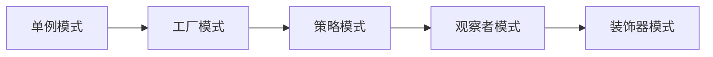

# :art: 设计模式

> 设计模式不是银弹，但它能让你少走很多弯路。

如果你写代码时经常遇到这些问题：「这段代码怎么又要改」「为什么加个功能这么麻烦」「别人的代码怎么这么难读」——那么，设计模式可能正是你需要的。

---

## :thinking: 设计模式是什么？

简单说，设计模式就是**前人总结出的解决常见问题的套路**。

它不是什么高深的理论，而是无数程序员在实践中踩过坑、交过学费后，提炼出来的经验。学习设计模式，本质上是在站在巨人的肩膀上。

!!! tip "一个类比"

    如果把写代码比作下棋，那么：
    
    - **算法** 像是具体的棋步——第一步走哪，第二步走哪
    - **设计模式** 像是棋谱——在什么局面下，应该采用什么策略

---

## :books: 23 种经典模式

GoF（四人帮）在 1Mo94 年提出了 23 种设计模式，按用途分为三大类：

-   :material-plus-circle:{ .lg .middle } **创建型模式** <small>4 种</small>

    ---
    
    解决「对象怎么创建」的问题
    
    当你纠结于 `new` 的时机和方式时，看这里：

    - [单例模式](creational-patterns/singleton/index.md) - 全局只有一个实例
    - [工厂模式](creational-patterns/factory/index.md) - 把创建逻辑封装起来
    - [抽象工厂](creational-patterns/abstract-factory/index.md) - 创建一系列相关对象
    - [原型模式](creational-patterns/prototype/index.md) - 通过复制来创建

-   :material-view-grid:{ .lg .middle } **结构型模式** <small>6 种</small>

    ---
    
    解决「对象怎么组合」的问题
    
    当你需要把现有的类/对象组装成更大的结构时：

    - [适配器](structural-patterns/adapter/index.md) - 让不兼容的接口协同工作
    - [装饰器](structural-patterns/decorator/index.md) - 动态添加功能
    - [代理模式](structural-patterns/proxy/index.md) - 控制对象的访问
    - [外观模式](structural-patterns/facade/index.md) - 提供简化的接口
    - [组合模式](structural-patterns/composite/index.md) - 树形结构的处理
    - [桥接模式](structural-patterns/bridge/index.md) - 分离抽象与实现

-   :material-swap-horizontal:{ .lg .middle } **行为模式** <small>9 种</small>

    ---
    
    解决「对象怎么交互」的问题
    
    当你需要处理对象之间的通信和职责分配时：

    - [策略模式](behavioral-patterns/strategy/index.md) - 算法可以互换
    - [观察者](behavioral-patterns/observer/index.md) - 一对多的通知机制
    - [模板方法](behavioral-patterns/template-method/index.md) - 定义算法骨架
    - [状态模式](behavioral-patterns/state/index.md) - 状态决定行为
    - [命令模式](behavioral-patterns/command/index.md) - 请求封装成对象
    - [责任链](behavioral-patterns/chain-of-responsibility/index.md) - 请求的传递处理
    - [中介者](behavioral-patterns/mediator/index.md) - 简化对象间通信
    - [迭代器](behavioral-patterns/iterator/index.md) - 顺序访问元素
    - [访问者](behavioral-patterns/visitor/index.md) - 分离数据结构与操作

---

## :dart: 为什么要学？

| 不学设计模式 | 学了设计模式 |
|-------------|-------------|
| 「这代码怎么改啊...」 | 「用 XX 模式重构一下就好了」 |
| 「你这代码啥意思？」 | 「哦，这是个观察者模式」 |
| 代码越写越乱 | 心中有谱，下笔有序 |
| 重复造轮子 | 站在巨人肩膀上 |

!!! quote "一个真实的场景"

    产品说：「这个支付功能，以后可能要支持微信、支付宝、银联...」
    
    - **不懂设计模式**：写一堆 `if-else`，每加一种支付方式就改一次
    - **懂策略模式**：定义支付接口，每种支付方式是一个实现类，扩展时只需新增类

---

## :compass: 学习建议

**入门路线**（如果你是第一次学）：

**学习方法**：

1. **先理解问题** - 每个模式解决什么问题？不解决什么问题？
2. **看代码示例** - 光看定义没用，要看具体怎么写
3. **动手实践** - 在自己的项目中尝试应用
4. **不要过度设计** - 简单问题不需要复杂模式

!!! warning "常见误区"

    - ❌ 把设计模式当作「高级技巧」炫耀
    - ❌ 不管三七二十一先套个模式
    - ❌ 死记硬背 UML 图
    - ✅ 理解每个模式的适用场景
    - ✅ 在合适的地方用合适的模式

---

## :book: 参考资源

- 📖 《设计模式：可复用面向对象软件的基础》- GoF
- 📖 《Head First 设计模式》- 入门友好
- 🌐 [Refactoring Guru](https://refactoringguru.cn/) - 图文并茂的在线教程

---

  准备好了吗？从 <a href="creational-patterns/singleton/index.md">单例模式</a> 开始你的设计模式之旅吧 🚀

