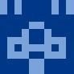

<!-- ===== Hero Banner ===== -->

  

    

      

        
      

    

    

      

        
        Welcome to my blog
      

      
Cloaks｜Yiiewang

      

        ⛓️ 区块链架构师
        🛠️ 技术探索者
      

      
「为众人抱薪者，不可使其冻毙于风雪」

      

        <a href="blog/" class="hero-btn hero-btn-primary">
          📖 开始阅读
        </a>
        <a href="knowledge/" class="hero-btn hero-btn-secondary">
          📚 知识库
        </a>
        <a href="about/" class="hero-btn hero-btn-secondary">
          👋 了解我
        </a>
      

    

  

<!-- ===== Stats Bar ===== -->

  

    📝
    
128

    
原创文章

  

  

    ⏰
    
5+ 年

    
持续写作

  

  

    🎨
    
23

    
设计模式

  

  

    📚
    
7

    
知识域

  

  

    ⛓️
    
3f+1

    
PBFT 容错

  

<!-- ===== Featured Content ===== -->

  🧭
  探索内容

  <a href="blog/" class="feature-card">
    

      
📝

      
技术博客

    

    

      
开发日常中的思考与实践：后端架构、云原生、区块链…… 每一篇都是真实项目中踩过的坑。

      

        128 篇文章
        →
      

    

  </a>

  <a href="design-patterns/" class="feature-card">
    

      
🧩

      
设计模式

    

    

      
23 种 GoF 设计模式的系统讲解。不只是「是什么」，更关注「为什么」和「怎么用」。

      

        23 种模式
        →
      

    

  </a>

  <a href="ruankao/" class="feature-card">
    

      
📚

      
软考笔记

    

    

      
系统架构师考试的备考笔记。知识点整理 + 真题解析，助你高效通关。

      

        架构师备考
        →
      

    

  </a>

<!-- ===== Knowledge Base ===== -->

  📚
  知识库

  <a href="knowledge/tech/" class="feature-card">
    

      
🖥️

      
技术能力

    

    

      
Go、区块链、架构设计、云原生…… 最核心的硬技能沉淀

      

        10 子域
        →
      

    

  </a>

  <a href="knowledge/engineering/" class="feature-card">
    

      
🔧

      
工程实践

    

    

      
项目复盘、踩坑记录、性能优化 —— 实战中提炼的经验

      

        4 子域
        →
      

    

  </a>

  <a href="knowledge/thinking/" class="feature-card">
    

      
🧠

      
思维方法

    

    

      
学习方法论、问题拆解、决策框架 —— 元能力的系统化

      

        正在建设
        →
      

    

  </a>

<!-- ===== Recent Articles ===== -->

  🔥
  热门推荐

  <a href="blog/posts/2025/03/3/" class="article-item">
    
❤️

    

      
爱的艺术

      
弗洛姆经典著作读书笔记 —— 爱不是找到对的人，而是培养爱的能力

    

    

      读书笔记
    

  </a>

  <a href="blog/posts/2025/01/19/" class="article-item">
    
⚖️

    

      
负载均衡设计思路与实践指南

      
轮询、权重、随机…… 分布式系统核心技术详解

    

    

      系统设计
    

  </a>

  <a href="design-patterns/creational-patterns/singleton/" class="article-item">
    
🎯

    

      
单例模式详解

      
最简单也最容易用错的设计模式

    

    

      设计模式
    

  </a>

  <a href="ruankao/medium%20software%20architecture/" class="article-item">
    
🏗️

    

      
软件架构设计

      
架构师必备的设计思维与方法论

    

    

      软考
    

  </a>

<!-- ===== Tech Stack ===== -->

  🛠️
  技术栈

  ⛓️区块链
  🐹Golang
  ☕Java
  🐳Docker
  ☸️Kubernetes
  🗄️MySQL
  🔀分布式系统
  🏛️微服务
  🔐密码学
  📊共识算法

<!-- ===== Footer ===== -->

  
「写下来的东西，比光想要清晰得多」

  

    <a href="https://github.com/yiiewang" target="_blank" class="footer-link">
      🐙 GitHub
    </a>
    <a href="https://github.com/yiiewang/yiiewang.github.io" target="_blank" class="footer-link">
      📦 本站源码
    </a>
    <a href="feed_rss_created.xml" target="_blank" class="footer-link">
      📡 RSS 订阅
    </a>
  

