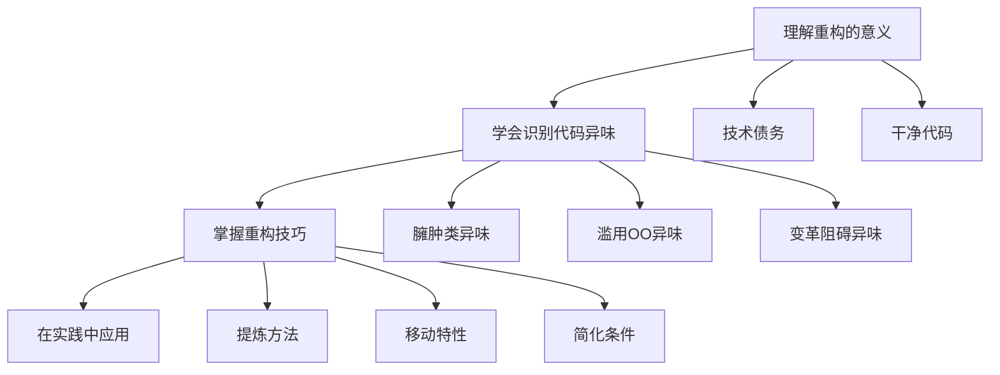

# :wrench: 代码重构

> 代码能跑不代表代码写得好。重构，就是让代码从「能跑」变成「好维护」。

你有没有过这种经历：接手一个项目，打开代码一看，心里默念「这写的什么玩意儿」——然后发现 git blame 显示的是三个月前的自己？

别担心，这很正常。代码会腐烂，但重构可以让它重获新生。

---

## :thinking: 什么是重构？

**重构** = 在不改变代码外部行为的前提下，改善其内部结构。

换句话说：功能不变，但代码变得更好读、更好改、更好扩展。

!!! quote "Martin Fowler"

    任何一个傻瓜都能写出计算机可以理解的代码。唯有写出人类容易理解的代码的，才是优秀的程序员。

---

## :nose: 代码为什么会变臭？

代码不是一夜之间变烂的，而是慢慢腐化的。常见原因：

| 原因 | 表现 |
|------|------|
| **赶进度** | 「先这样吧，以后再改」（然后再也没改） |
| **需求变更** | 不断在原有代码上打补丁 |
| **缺乏规范** | 每个人都有自己的「风格」 |
| **恐惧重构** | 「能跑就别动它」 |

这些「欠下的债」，就是所谓的 **技术债务**。债务会生息，拖得越久，还起来越痛苦。

---

## :books: 学习内容

-   :material-head-question:{ .lg .middle } **理解重构**

    ---
    
    先搞清楚「为什么要重构」：
    
    - [什么是技术债务？](what-is-refactoring/technical-debt.md)
    - [什么是干净的代码？](what-is-refactoring/clean-code.md)
    - [什么时候该重构？](what-is-refactoring/when.md)
    - [怎么进行重构？](what-is-refactoring/how-to.md)

-   :material-alert:{ .lg .middle } **识别代码异味**

    ---
    
    学会「闻」出有问题的代码：
    
    - [代码异味总览](code-smells/index.md)
    - [臃肿的代码](code-smells/bloaters/long-parameter-list.md) - 过长、过大、过多
    - [多余的代码](code-smells/dispensables/data-class.md) - 本不该存在

-   :material-tools:{ .lg .middle } **重构技巧**

    ---
    
    掌握具体的重构手法：
    
    - [重构技术总览](techniques/index.md)
    - [提炼方法](techniques/composing-methods/extract-method.md)
    - [封装字段](techniques/organizing-data/encapsulate-field.md)

---

## :dart: 重构能带来什么？

| Before | After |
|--------|-------|
| 改个 bug 要看半天代码 | 代码一目了然 |
| 加个功能牵一发动全身 | 模块清晰，改动局部化 |
| 「这代码谁敢动啊」 | 有测试保护，放心改 |
| 新人上手要一个月 | 代码自文档化，快速理解 |

---

## :compass: 学习路径

---

## :bulb: 实用建议

**重构的时机**

- ✅ 添加新功能之前 —— 先整理好战场
- ✅ 修复 bug 之后 —— 顺手优化一下
- ✅ Code Review 时 —— 借机改进
- ❌ 临近上线时 —— 风险太大

**重构的原则**

1. **小步前进** —— 每次只做一个小改动
2. **频繁测试** —— 改一点，测一点
3. **保持可运行** —— 任何时候代码都能跑
4. **不要同时做两件事** —— 重构时不加功能，加功能时不重构

!!! warning "重构不是..."

    - ❌ 重写（从头再来）
    - ❌ 性能优化（那是另一件事）
    - ❌ 修 bug（虽然重构后 bug 可能会减少）

---

## :book: 推荐阅读

- 📖 《重构：改善既有代码的设计》- Martin Fowler（重构圣经）
- 📖 《代码整洁之道》- Robert C. Martin
- 🌐 [Refactoring Guru](https://refactoringguru.cn/refactoring) - 在线参考

---

  开始之前，先了解一下 <a href="what-is-refactoring/technical-debt.md">什么是技术债务</a> 吧 💡

