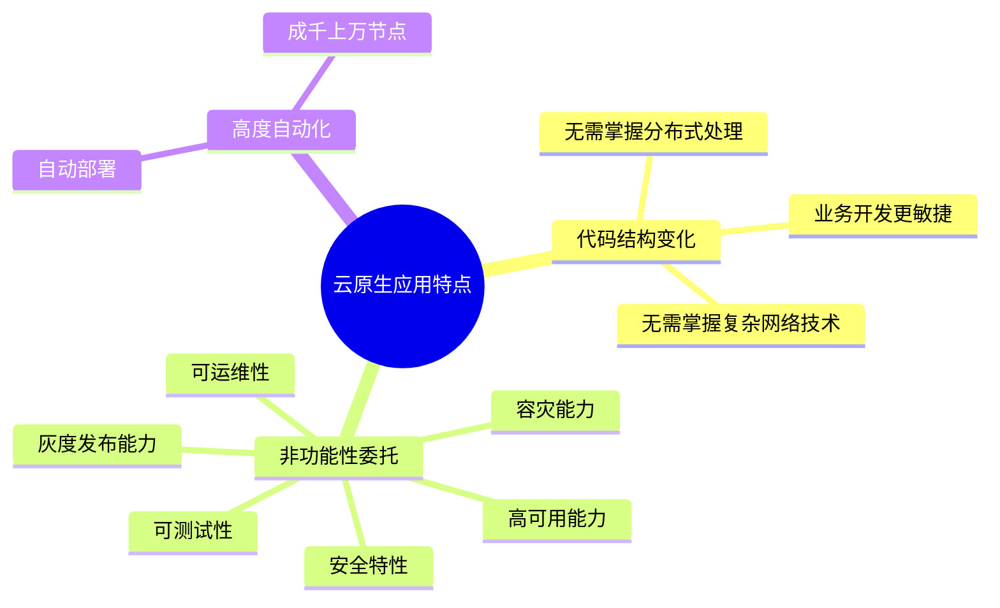
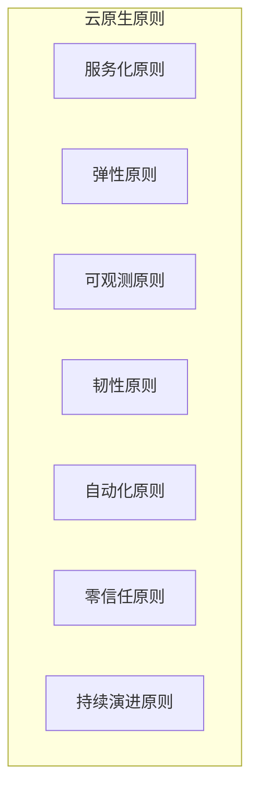
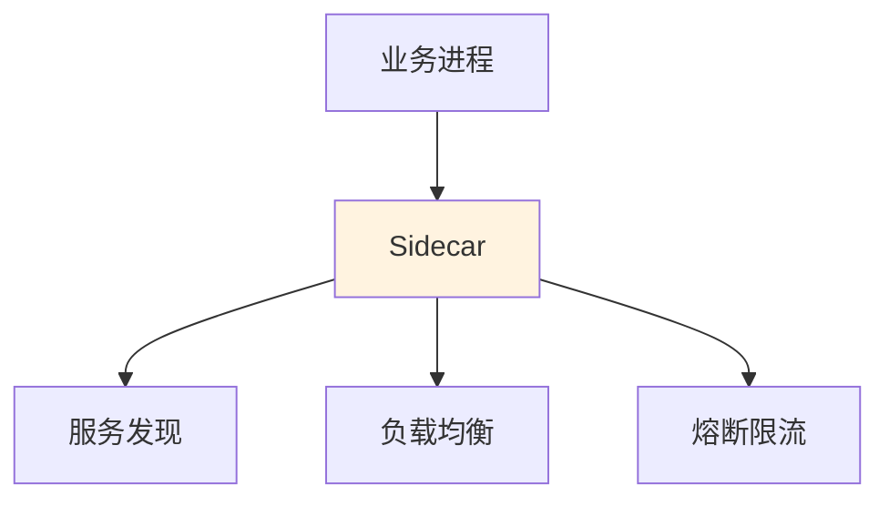
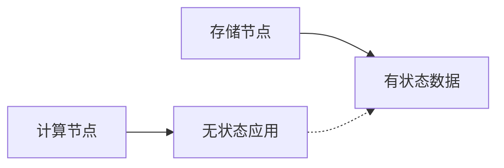
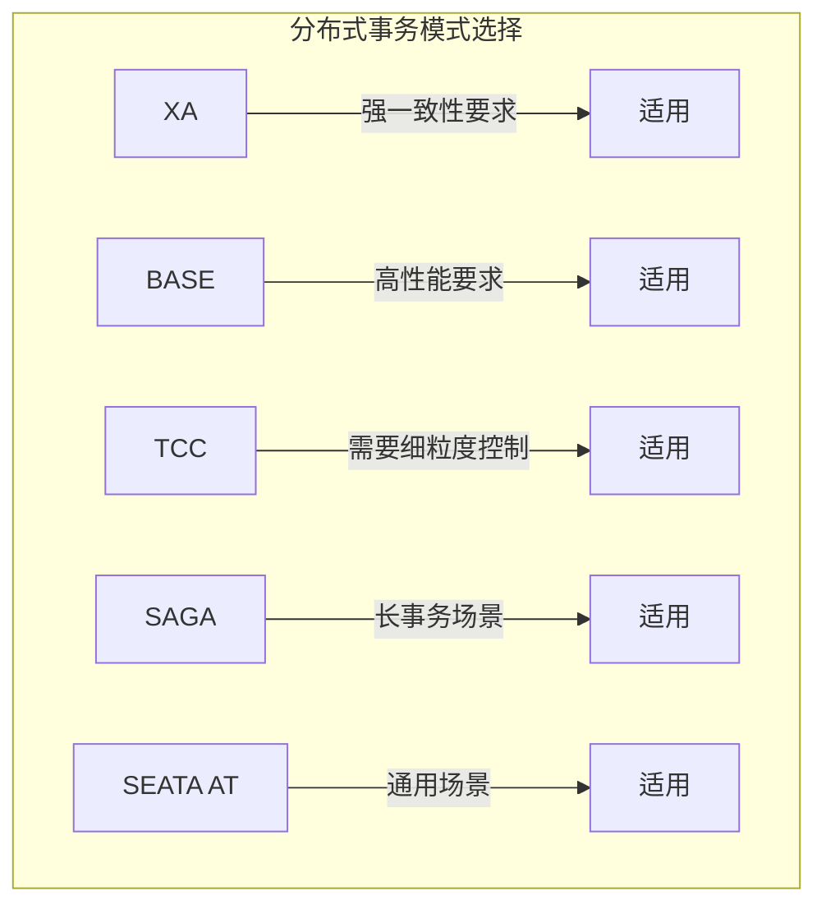
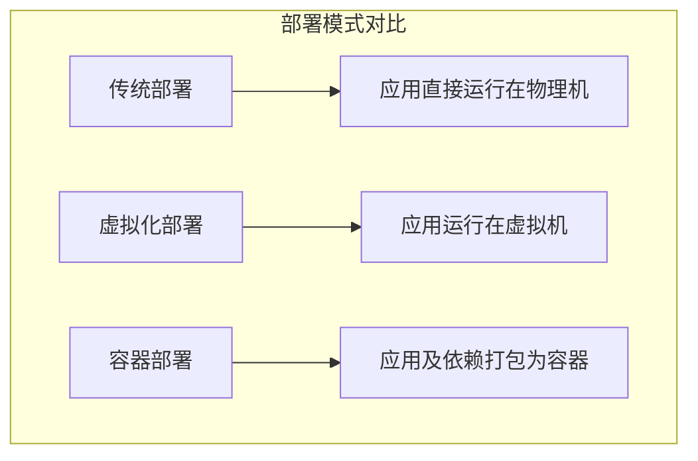
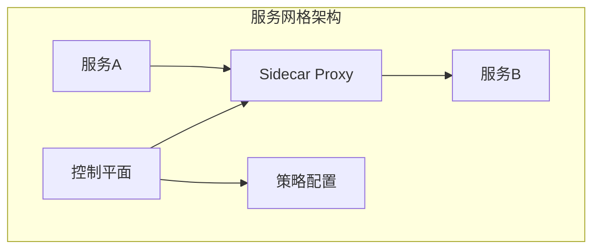

# 云原生架构设计理论与实践

!!! abstract "本章导读"
    云原生架构是现代软件架构的发展趋势，本章系统介绍云原生的定义、原则和主要架构模式。重点掌握云原生七大原则、服务化架构模式、Serverless 模式、分布式事务的五种模式（XA、BASE、TCC、SAGA、AT），以及容器技术、微服务、服务网格等关键技术。

## 学习目标

- [ ] 理解云原生架构的定义和核心价值
- [ ] 掌握云原生的七大原则
- [ ] 熟练掌握云原生的主要架构模式
- [ ] 理解分布式事务的五种模式及其特点
- [ ] 掌握容器、微服务、服务网格等关键技术

---

## 云原生架构的内涵

### 云原生定义

!!! quote "云原生架构定义"
    云原生架构是基于云原生技术的一组**架构原则和设计模式**的集合，旨在将云应用中的**非业务代码**部分进行最大化剥离，从而让云设施接管应用中原有的大量**非功能特性**（如弹性、韧性、安全、可观测性、灰度等），使业务不再有非功能性业务中断困扰的同时，具备**轻量、敏捷、高度自动化**的特点。

### 云原生应用特点

| 特点 | 说明 |
|------|------|
| **代码结构变化** | 无需掌握文件分布式处理、复杂网络技术，业务开发更敏捷快速 |
| **非功能性委托** | 高可用、容灾、安全、可运维、可测试、灰度发布等委托给云原生架构 |
| **高度自动化** | 基于云原生的自动化软件交付可把应用自动部署到成千上万的节点 |

---

## 云原生七大原则 ⭐

| 原则 | 定义 |
|------|------|
| **服务化原则** | 通过服务化架构把不同生命周期的模块分离出来，分别进行业务迭代 |
| **弹性原则** | 系统的部署规模可以随着业务量的变化而**自动伸缩** |
| **可观测原则** | 通过日志、链路跟踪和度量等手段，使多次服务调用的耗时、返回值和参数都清晰可见 |
| **韧性原则** | 软件所依赖的软硬件组件出现各种异常时，软件表现出来的**抵御能力** |
| **自动化原则** | 让自动化工具理解交付目标和环境差异，实现整个软件交付和运维的自动化 |
| **零信任原则** | 不信任网络内外的任何人/设备/系统，基于**认证和授权**重构访问控制的信任基础 |
| **持续演进原则** | 架构具备**持续演进能力** |

!!! tip "记忆技巧"
    七大原则可记为：**"服弹观韧自零演"**
    
    - **服**务化、**弹**性、可**观**测、**韧**性、**自**动化、**零**信任、持续**演**进

---

## 云原生主要架构模式 ⭐

### 服务化架构模式

服务化架构的核心要求：

| 要素 | 说明 |
|------|------|
| **颗粒度划分** | 以应用模块为颗粒度划分 |
| **接口契约** | 以接口契约（如 IDL）定义彼此业务关系 |
| **标准协议** | 以标准协议（HTTP、gRPC 等）确保互联互通 |
| **结合方法论** | 领域驱动设计（DDD）、测试驱动开发（TDD）、容器化部署 |

### Mesh 化架构模式

**核心思想**：把中间件框架（RPC、缓存、异步消息等）从业务进程中分离

| 优势 | 说明 |
|------|------|
| 中间件解耦 | 中间件 SDK 与业务代码进一步解耦 |
| 透明升级 | 中间件升级对业务进程没有影响 |
| 平台无关 | 迁移到其他平台的中间件对业务透明 |

### Serverless 模式

!!! quote "Serverless 定义"
    业务流量到来/业务事件发生时，云会启动或调度一个已启动的业务进程进行处理，处理完成后云自动会关闭/调度业务进程，等待下一次触发。

**Serverless 适用场景**：

| 场景 | 说明 |
|------|------|
| 事件驱动 | 数据计算任务 |
| 短时计算 | 计算时间短的请求/响应应用 |
| 简单任务 | 没有复杂相互调用的长周期任务 |

**开发者无需关心**：

- 应用运行地点
- 操作系统
- 网络配置
- CPU 性能

### 存储计算分离模式

**核心思想**：无状态应用不存在一致性维度，可以获得更好的可用性和分区容错性

!!! info "CAP 定理"
    分布式环境中的 CAP 困难主要针对有状态应用：
    
    - **C**（Consistency）：一致性
    - **A**（Availability）：可用性
    - **P**（Partition Tolerance）：分区容错性
    
    三者最多满足其中两个。

### 分布式事务模式 ⭐

由于业务需要访问多个微服务，会带来分布式事务问题。常用的分布式事务模式：

| 模式 | 原理 | 优点 | 缺点 |
|------|------|------|------|
| **XA 模式** | 两阶段提交（2PC） | **强一致性** | 需要两次网络交互，**性能差** |
| **BASE** | 基本可用（BA）+ 最终一致性（E）+ 软状态（S） | **高性能** | 通用性有限，需权衡可用性和一致性 |
| **TCC** | Try-Confirm-Cancel 二阶段 | 事务隔离性可控，**高效** | **对业务侵入性强**，设计开发维护成本高 |
| **SAGA** | 正向事务 + 补偿事务 | 长事务支持好 | **开发维护成本高** |
| **SEATA AT** | 委托二阶段给底层框架，取消行锁 | **高性能**，无代码开发工作量，自动回滚 | 存在使用场景限制 |

### 可观测架构

可观测架构包含三大支柱：

| 支柱 | 说明 | 作用 |
|------|------|------|
| **Logging** | 日志记录 | 提供多级别跟踪（INFO/DEBUG/WARNING/ERROR） |
| **Tracing** | 链路追踪 | 收集请求从前端到后端的访问日志，形成完整调用链路 |
| **Metrics** | 度量指标 | 提供系统的多维度度量（并发度、耗时、可用时长、容量等） |

### 事件驱动架构

EDA（Event Driven Architecture）是一种应用/组件间的集成架构模式。

**适用场景**：

| 场景 | 说明 |
|------|------|
| 增强服务韧性 | 异步解耦，提高系统弹性 |
| 数据变化通知 | 数据变更时通知相关服务 |
| 构建开放式接口 | 事件作为系统间的接口 |
| 事件流处理 | 实时处理事件流 |
| CQRS | 命令查询责任分离，命令用事件发起，查询用同步 API |

---

## 云原生架构反模式

| 反模式 | 问题描述 |
|--------|---------|
| **庞大的单体应用** | 缺乏依赖隔离、代码耦合、边界不清晰、变更影响扩散、难以协调发布、无法单独扩容 |
| **硬拆微服务** | 强行拆分耦合度高的模块、数据紧密耦合、分布式调用影响性能 |
| **缺乏自动化** | 人均负责模块数上升，工作量增大，开发成本增加 |

---

## 云原生架构相关技术

### 容器技术

**容器优势**：

| 优势 | 说明 |
|------|------|
| 标准化 | 应用及依赖打包发布 |
| 环境一致 | 不受环境限制 |
| 快速部署 | 秒级启动 |
| 资源隔离 | 进程级隔离 |

### 容器编排技术

容器编排（如 Kubernetes）提供的能力：

| 能力 | 说明 |
|------|------|
| **资源调度** | 智能分配计算资源 |
| **应用部署与管理** | 声明式部署和管理 |
| **自动修复** | 自动重启失败容器 |
| **服务发现与负载均衡** | 自动服务注册和流量分发 |
| **弹性伸缩** | 根据负载自动扩缩容 |
| **声明式 API** | 基于 YAML/JSON 的配置 |
| **可扩展性架构** | 插件化设计 |
| **可移植性** | 跨云平台部署 |

### 微服务设计约束

| 约束类型 | 说明 |
|---------|------|
| **个体约束** | 微服务功能在业务领域划分上应相互独立 |
| **横向关系** | 可发现性（服务变化自动感知）+ 可交互性（服务间调用方式） |
| **纵向约束** | 数据存储隔离（DSS），数据访问必须通过对应微服务 API |
| **分布式约束** | CI/CD 流水线、蓝绿/金丝雀发布策略 |

### 无服务器技术（Serverless）

**Serverless 特点**：

| 特点 | 说明 |
|------|------|
| **全托管** | 客户只需编写代码，无须关注服务器等基础设施 |
| **通用性** | 结合云 BaaS API，支撑所有重要类型应用 |
| **自动弹性** | 无须提前容量规划 |
| **按量计费** | 无须为闲置资源付费 |

**关注点**：计算资源弹性调度、负载均衡和流控、安全性

### 服务网格（Service Mesh）

**服务网格目标**：将微服务间的连接、安全、流量控制和可观测等通用功能下沉为平台基础设施

**主要技术**：

| 技术 | 说明 |
|------|------|
| **Istio** | 最流行的服务网格实现 |
| **Linkerd** | 轻量级服务网格 |
| **Consul** | HashiCorp 的服务网格方案 |

---

## 本章小结

### 核心知识点

1. **云原生定义**：非业务代码剥离，非功能特性委托给云设施

2. **七大原则**：服务化、弹性、可观测、韧性、自动化、零信任、持续演进

3. **主要架构模式**：
   - 服务化架构（DDD、TDD）
   - Mesh 化架构（Sidecar）
   - Serverless（事件驱动、按需计算）
   - 存储计算分离
   - 分布式事务（XA、BASE、TCC、SAGA、AT）
   - 可观测架构（Logging、Tracing、Metrics）
   - 事件驱动架构（EDA、CQRS）

4. **关键技术**：容器、容器编排、微服务、Serverless、服务网格

### 分布式事务对比

| 模式 | 一致性 | 性能 | 侵入性 | 适用场景 |
|------|--------|------|--------|---------|
| XA | 强 | 低 | 低 | 强一致性要求 |
| BASE | 最终 | 高 | 中 | 高性能要求 |
| TCC | 可控 | 高 | 高 | 细粒度控制 |
| SAGA | 最终 | 中 | 高 | 长事务 |
| SEATA AT | 最终 | 高 | 低 | 通用场景 |

### 考试重点

| 知识点 | 考查形式 |
|-------|---------|
| 云原生七大原则 | 原则识别与定义 |
| 分布式事务模式 | 特点对比与场景选择 |
| 可观测三支柱 | 概念区分 |
| 服务网格概念 | 架构理解 |

### 学习建议

1. **原则记忆**：使用"服弹观韧自零演"口诀
2. **分布式事务**：重点理解各模式的优缺点和适用场景
3. **架构模式**：理解每种模式解决的核心问题
