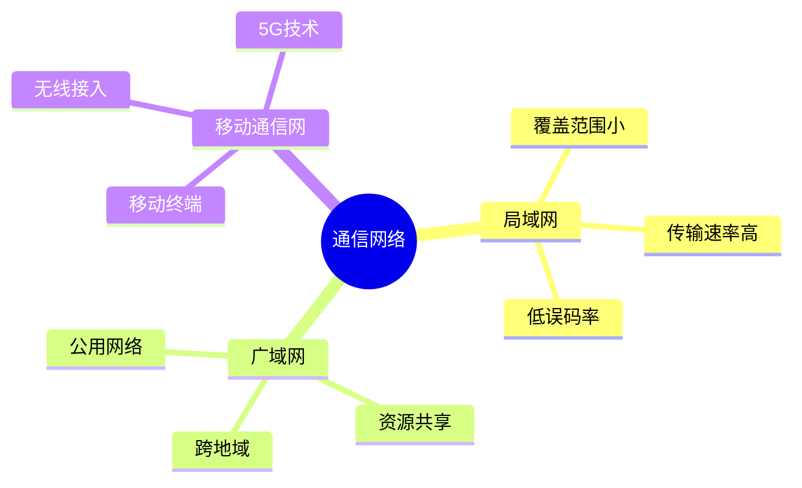
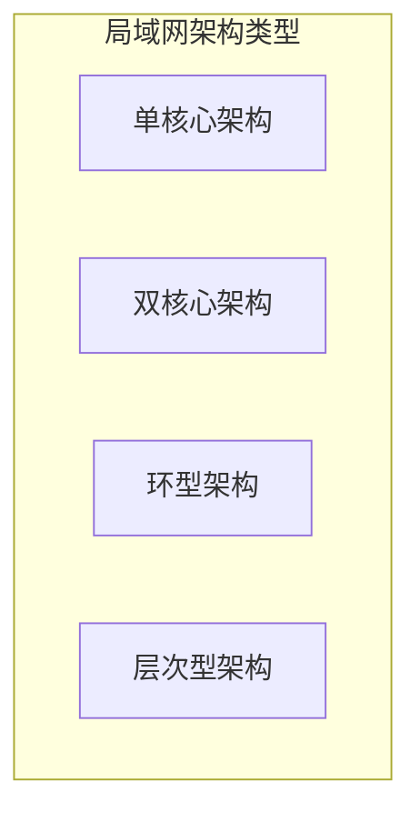
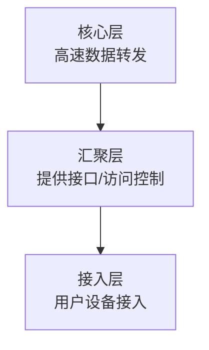
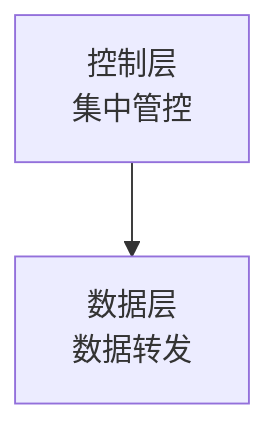
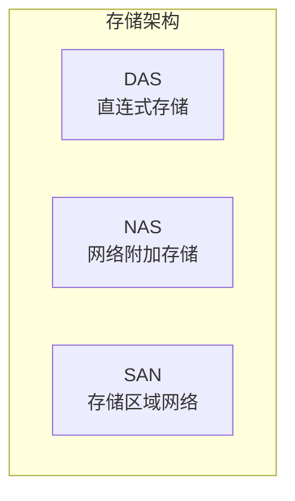
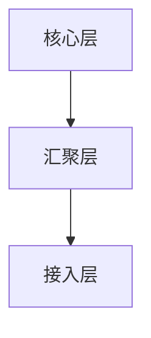

# 通信系统架构设计理论与实践

!!! abstract "本章导读"
    通信系统是现代信息化建设的基础设施，本章介绍局域网、广域网、移动通信网的网络架构，重点掌握各种网络架构的优缺点、存储网络架构（DAS、NAS、SAN）的区别、IPv4/IPv6 过渡技术，以及层次化网络设计原则和网络安全控制技术。

## 学习目标

- [ ] 掌握局域网的四种网络架构及其特点
- [ ] 理解广域网的六种网络架构
- [ ] 掌握 DAS、NAS、SAN 三种存储架构的区别
- [ ] 理解 IPv4 到 IPv6 的过渡技术
- [ ] 掌握层次化网络设计的三层模型
- [ ] 了解网络安全控制技术

---

## 通信网络概述

### 网络主要形式

---

## 局域网网络架构 ⭐

局域网是单一机构专用计算机的网络，通常由计算机、交换机、路由器等设备组成。

### 局域网特点

| 特点 | 说明 |
|------|------|
| 覆盖范围小 | 通常在一个建筑或园区内 |
| 传输速率高 | 百兆到万兆级别 |
| 低误码率 | 传输质量高 |
| 可靠性高 | 网络稳定 |
| 支持多种传输介质 | 有线/无线 |
| 支持实时应用 | 延迟低 |

### 四种架构类型

#### 单核心架构

使用单台核心二层或三层交换设备作为网络核心。

| 优点 | 缺点 |
|------|------|
| 结构简单 | 地理范围受限 |
| 设备投资节约 | 核心单点故障 |
| 接入方便 | 扩展能力有限 |
| - | 核心端口密度要求高 |

#### 双核心架构

采用两台核心三层及以上交换机作为网络核心。

| 优点 | 缺点 |
|------|------|
| 网络拓扑结构可靠性高 | 投资较单核心高 |
| 接入较为方便 | 核心端口密度要求较高 |

#### 环型架构

采用多台核心三层及以上交换机组成**双动态弹性分组环（RPR）**。

| 优点 | 缺点 |
|------|------|
| RPR 具备自愈保护 | 投资较高 |
| 节省光纤资源 | 路由冗余设计实施难度高 |
| 提供多等级、可靠的 QoS 服务 | 易形成环路 |
| 有效利用带宽资源 | 多环只能通过业务接口互通 |

#### 层次型架构 ⭐

由**核心层、汇聚层、接入层**三层交换设备和用户设备组成。

| 层次 | 职责 |
|------|------|
| **核心层** | 负责高速数据转发 |
| **汇聚层** | 提供充足接口，与接入层间实现互访控制 |
| **接入层** | 用户设备接入 |

| 优点 |
|------|
| 易扩展 |
| 分级排查网络故障便于维护 |

---

## 广域网网络架构

广域网利用公用分组交换网、无线分组交换网、卫星通信网构建通信子网。

### 广域网组成

### 六种架构类型

| 架构类型 | 优点 | 缺点 |
|---------|------|------|
| **单核心架构** | 结构简单、投资节约、局域网互访效率高 | 核心单点故障、扩展能力欠佳 |
| **双核心架构** | 拓扑可靠、路由可热切换、可靠性高 | 投资较高、路由冗余设计难度高 |
| **环型架构** | 接入方便 | 投资高、易形成环路 |
| **半/全冗余架构** | 结构灵活、路由灵活、方便扩展、可靠性高 | 结构零散、不便管理和排障 |
| **对等子域架构** | 路由控制灵活 | 子域间冗余设计难度高、易形成环路 |
| **层次子域架构** | 扩展性好、路由控制灵活 | 子域路由冗余设计难度高 |

---

## 移动通信网网络架构

### 5G 系统接入方式

| 模式 | 说明 |
|------|------|
| **透明模式** | 5G 系统通过用户面功能接口接入运营商网络，然后通过防火墙或代理连至 Internet |
| **非透明模式** | 5G 系统直接或通过其他网络连接至运营商网络或 Internet |

### 5G 网络边缘计算

!!! info "边缘计算优势"
    5G 网络边缘计算能为垂直行业提供以**时间敏感、高带宽**为特征的业务就近分流服务：
    
    - 为用户提供极佳的服务体验
    - 降低移动网络后端处理的压力

### 软件定义网络（SDN）

!!! quote "SDN 定义"
    SDN（Software Defined Network）是一种新型网络创新架构，核心思想是通过**控制与转发分离**，将网络中交换设备的控制逻辑集中到一个计算设备上。

| 特点 | 说明 |
|------|------|
| 控制面集中管控 | 提升网络管理配置能力 |
| 分层思想 | 控制层和数据层分离 |

---

## 存储网络架构 ⭐

### 三种存储架构

#### DAS 直连式存储

存储设备通过 IDE/ATA/SCSI 接口或光纤通道**直接连接到单台计算机**。

| 特点 | 说明 |
|------|------|
| 访问方式 | I/O 总线 |
| 资源利用 | 单机存储 |
| 优点 | 易用易管理、设备成本低 |
| 缺点 | 不能跨平台文件共享 |

#### NAS 网络附加存储

存储设备通过标准网络拓扑结构**连接到计算机群组**。

| 特点 | 说明 |
|------|------|
| 访问方式 | 通过 IP 网络（TCP/UDP 协议）|
| 接口 | RPC 接口 |
| 优点 | 易用易管理、可扩展性高、设备成本较低 |
| 特点 | 有自己的 OS，类似专用文件服务器 |

#### SAN 存储区域网络

专门为存储建立的独立于 TCP/IP 网络之外的**专用网络**。

| 特点 | 说明 |
|------|------|
| 访问方式 | 网状通道技术 |
| 优点 | 高性能、低延迟、灵活性高 |
| 类型 | IPSAN（以太网）、FCSAN（光纤通道）|

### 三种架构对比

| 比较项 | DAS | NAS | SAN |
|-------|-----|-----|-----|
| **架构类别** | 单机存储架构 | 网络存储架构 | 网络存储架构 |
| **访问方式** | I/O 总线 | 网络 | 网络 |
| **资源利用** | 单机存储 | 共享存储 | 共享存储 |
| **访问媒介** | 总线 | 以太网 | 以太网/光纤通道 |
| **优势特点** | 易用易管理 设备成本低 | 易用易管理 可扩展性高 设备成本较低 | 高性能 低延迟 灵活性高 |

---

## RAID 磁盘阵列

### RAID 概念

!!! quote "RAID 定义"
    RAID（Redundant Array of Independent Disks，独立冗余磁盘阵列）是把多块独立的硬盘按不同方式组合起来形成一个硬盘组，从而提供比单个硬盘更高的存储性能和数据备份能力。

### RAID5 特点

| 特点 | 说明 |
|------|------|
| 存储机制 | 两块存数据，一块存校验结果 |
| 容错能力 | 坏掉一块硬盘可通过另外两块恢复 |
| 最少磁盘 | 至少需要 3 块 |
| 校验方式 | 旋转奇偶校验，无固定校验盘 |
| 可用容量 | N-1 块盘容量（N 为总磁盘数）|

!!! example "RAID5 容量计算"
    - 3 块 80G 硬盘做 RAID5：总容量 = (3-1) × 80 = **160G**
    - 2 块 80G + 1 块 40G 做 RAID5：总容量 = (3-1) × 40 = **80G**（以最小盘为准）

---

## 网络构件关键技术

### IPv4 与 IPv6 过渡技术

目前网络演进存在 IPv4 到 IPv6 的过渡期，主要有三种过渡技术：

| 技术 | 原理 |
|------|------|
| **双协议栈** | 两种协议在同一平台上双栈共存，同时运行 |
| **隧道技术** | ISATAP、6to4、over6、6over4 等隧道 |
| **NAT 技术** | 将 IPv4 和 IPv6 地址分别看作内部和外部地址进行转换 |

---

## 层次化网络设计

### 三层模型

### 设计原则

| 原则 | 说明 |
|------|------|
| 控制网络层次 | 避免层次过多 |
| 自底向上规划 | 从接入层开始，向上分析规划 |
| 模块化设计 | 尽量采用模块化设计 |
| 严格控制网络结构 | 保持结构清晰 |
| 严格控制层次化结构 | 各层职责分明 |

### 设计优点

- 降低成本
- 充分利用模块化设备/部件
- 网络变化或演化容易

---

## 网络安全控制技术

### 主要技术

| 技术 | 说明 |
|------|------|
| **防火墙** | 网络间的安全屏障，可以允许/拒绝/重定向数据流 |
| **VPN** | 利用公共网络建立私有专用网络，成本低、接入方便 |
| **访问控制** | DAC、MAC、RBAC、TBAC、OBAC |
| **网络安全隔离** | 子网隔离、物理隔离、VLAN 隔离、逻辑隔离 |
| **网络安全协议** | SSL/TLS、IPSec 等 |

### 防火墙类型

| 类型 | 说明 |
|------|------|
| 硬件防火墙 | 专用硬件设备 |
| 软件防火墙 | 软件实现 |
| 嵌入式防火墙 | 嵌入到设备中 |

### 防火墙种类

| 种类 | 说明 |
|------|------|
| 包过滤 | 基于 IP、端口过滤 |
| 应用层网关 | 应用层协议检查 |
| 代理服务 | 代理客户端访问 |

### 访问控制技术

| 技术 | 全称 | 说明 |
|------|------|------|
| **DAC** | 自主访问控制 | 资源所有者控制访问权限 |
| **MAC** | 强制访问控制 | 系统强制执行安全策略 |
| **RBAC** | 基于角色的访问控制 | 按角色分配权限 |
| **TBAC** | 基于任务的访问控制 | 按任务分配权限 |
| **OBAC** | 基于对象的访问控制 | 按对象分配权限 |

---

## 绿色网络设计

### 设计思路

| 思路 | 说明 |
|------|------|
| 精简设计 | 减少不必要的设备和功能 |
| 重用设计 | 复用已有资源 |
| 回收设计 | 回收可用资源 |

### 设计原则

| 原则 | 说明 |
|------|------|
| **标准化** | 减少转换设备，兼容异构方案 |
| **集成化** | 减少设备总量，降低资源需求 |
| **虚拟化** | 灵活调配，按需使用 |
| **智能化** | 降低人力成本，降低资源占用 |

---

## 本章小结

### 核心知识点

1. **局域网架构**：单核心、双核心、环型、层次型

2. **层次型架构**：核心层（高速转发）→ 汇聚层（访问控制）→ 接入层（用户接入）

3. **存储架构对比**：
   - DAS：直连、单机、I/O 总线
   - NAS：网络、共享、TCP/IP
   - SAN：专用网络、高性能、光纤通道

4. **IPv4/IPv6 过渡**：双协议栈、隧道技术、NAT 技术

5. **RAID5 容量**：(N-1) × 最小磁盘容量

### 考试重点

| 知识点 | 考查形式 |
|-------|---------|
| 存储架构对比 | DAS/NAS/SAN 区别 |
| RAID 容量计算 | 给定磁盘数量计算容量 |
| 层次化网络设计 | 各层职责 |
| 访问控制技术 | 各种访问控制方式区分 |

### 学习建议

1. **存储架构**：牢记三种架构的访问方式和特点
2. **RAID**：掌握 RAID5 的容量计算公式
3. **网络设计**：理解三层模型各层的职责
