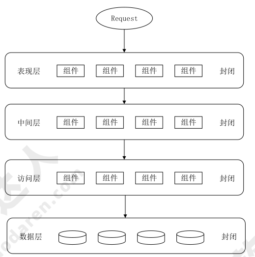
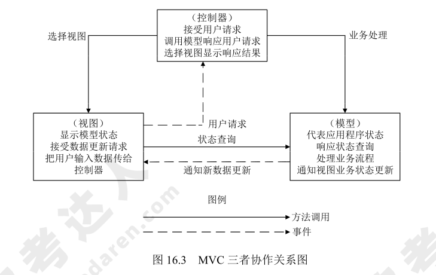
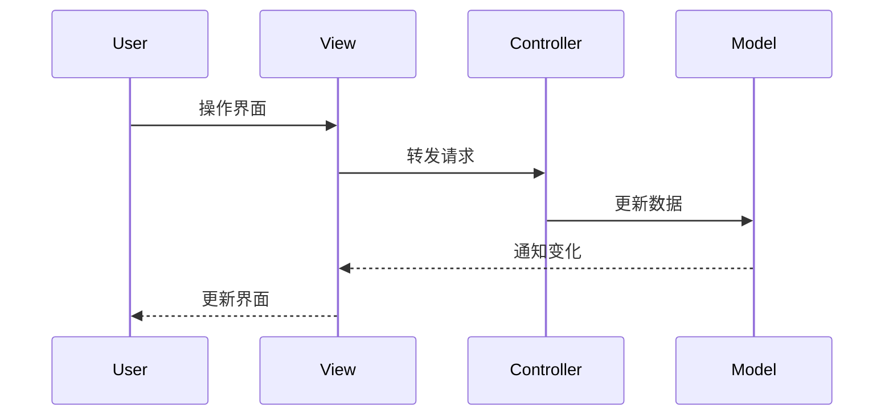
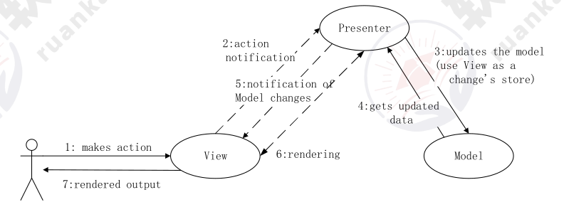
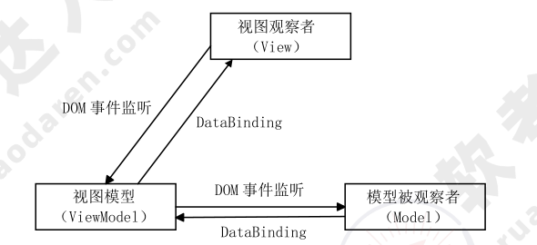
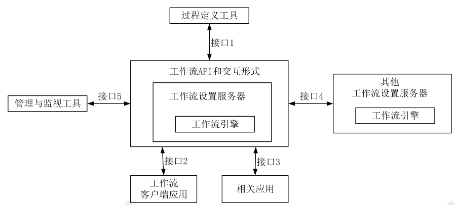

# 层次式架构设计

!!! abstract "本章导读"
    层次式架构是最经典、最常用的软件架构风格。本章介绍分层架构的设计原则，以及表现层（MVC/MVP/MVVM）、业务层、数据访问层的设计方法。这是案例分析和论文的高频考点。

    **学习目标**：
    
    - 理解分层架构的设计思想和优缺点
    - 掌握 MVC、MVP、MVVM 三种模式的区别
    - 了解业务逻辑层和数据访问层的设计方法

---

## 分层架构概述

### 基本概念

层次式架构（Layered Architecture）将系统组织为**层次结构**，每一层为上层提供服务，同时作为下层的客户端。



### 典型分层

大多数应用系统采用四层架构：

```
┌─────────────────────────────┐
│       表现层（UI Layer）      │  ← 用户界面
├─────────────────────────────┤
│      业务层（Business Layer） │  ← 业务逻辑
├─────────────────────────────┤
│      持久层（Persistence）    │  ← 数据访问
├─────────────────────────────┤
│       数据层（Database）      │  ← 数据存储
└─────────────────────────────┘
```

| 层次 | 职责 | 典型技术 |
|------|------|----------|
| **表现层** | 用户交互、数据展示 | React、Vue、Angular |
| **业务层** | 业务规则、流程控制 | Spring、.NET |
| **持久层** | 数据持久化、ORM | MyBatis、Hibernate |
| **数据层** | 数据存储 | MySQL、PostgreSQL |

### 设计原则

分层架构的核心思想是**关注点分离**（Separation of Concerns）：

!!! tip "分层原则"
    1. **上层依赖下层**：每层只能调用其直接下层的服务
    2. **下层不知上层**：下层不应依赖上层的实现
    3. **同层独立**：同层组件之间尽量解耦

### 优缺点分析

=== "优点"
    
    - ✅ **易于理解**：职责清晰，边界明确
    - ✅ **易于开发**：可以并行开发不同层
    - ✅ **易于测试**：可以独立测试每一层
    - ✅ **易于维护**：修改一层不影响其他层
    - ✅ **技术异构**：每层可以使用不同技术

=== "缺点"
    
    - ❌ **性能损耗**：跨层调用有开销
    - ❌ **可能臃肿**：简单请求也要穿透所有层
    - ❌ **污水池反模式**：请求直接穿透，没有业务处理

!!! warning "污水池反模式"
    如果大量请求只是简单地"穿透"各层，每层几乎不做任何处理，说明分层设计不合理。这是分层架构最常见的问题。

---

## 表现层设计

表现层负责用户交互，常用的设计模式有 MVC、MVP、MVVM 三种。

### MVC 模式

MVC（Model-View-Controller）是最经典的表现层模式，将应用分为三个核心组件：



| 组件 | 职责 | 说明 |
|------|------|------|
| **Model** | 业务数据和逻辑 | 不关心如何展示 |
| **View** | 数据展示和用户界面 | 不包含业务逻辑 |
| **Controller** | 接收输入、协调 M 和 V | 业务流程控制 |

**工作流程**：



**MVC 的优点**：

- 允许多种用户界面扩展
- 易于维护和测试
- 三者职责分离，代码复用性高

---

### MVP 模式

MVP（Model-View-Presenter）是 MVC 的改进版，**完全解耦 View 和 Model**。



| 组件 | 与 MVC 的区别 |
|------|--------------|
| **View** | 更加被动，只负责展示 |
| **Presenter** | 替代 Controller，处理所有逻辑 |
| **Model** | 与 MVC 相同 |

**MVP vs MVC**：

| 特性 | MVC | MVP |
|------|-----|-----|
| View 和 Model 通信 | 直接通信 | 通过 Presenter |
| View 的角色 | 主动获取数据 | 被动接收数据 |
| 测试难度 | 较难 | 易于单元测试 |

**MVP 的优点**：

- View 和 Model 完全分离
- 所有交互集中在 Presenter
- 便于单元测试（可以 Mock View）

---

### MVVM 模式

MVVM（Model-View-ViewModel）通过**数据绑定**实现 View 和 Model 的自动同步。



| 组件 | 职责 |
|------|------|
| **View** | UI 界面，声明式绑定 |
| **ViewModel** | 数据状态、双向绑定逻辑 |
| **Model** | 业务数据 |

**核心特性**：

- **双向数据绑定**：View 变化自动更新 ViewModel，反之亦然
- **声明式编程**：View 只需声明绑定关系

**典型框架**：Vue.js、Angular、WPF

---

### 三种模式对比

| 特性 | MVC | MVP | MVVM |
|------|-----|-----|------|
| **核心组件** | Controller | Presenter | ViewModel |
| **View-Model 通信** | 直接 | 通过 Presenter | 双向绑定 |
| **View 角色** | 主动 | 被动 | 声明式 |
| **测试难度** | 较难 | 容易 | 容易 |
| **典型应用** | Spring MVC | Android MVP | Vue、Angular |
| **适用场景** | 传统 Web | 移动端 | 现代前端 |

!!! tip "选择建议"
    - **MVC**：传统服务端渲染的 Web 应用
    - **MVP**：需要高可测试性的应用（如 Android）
    - **MVVM**：现代前端 SPA 应用

---

## 业务层设计

业务层是系统的核心，负责实现业务规则和流程控制。

### 业务逻辑组件

业务逻辑层组件通常分为**接口**和**实现类**两部分：

```
┌─────────────────────────────────┐
│        业务逻辑层                 │
├─────────────────────────────────┤
│  Service Interface              │ ← 定义业务接口
│  └── ServiceImpl                │ ← 实现业务逻辑
│       └── DAO                   │ ← 调用数据访问层
└─────────────────────────────────┘
```

**设计原则**：

- 按模块划分 Service
- 每个 Service 组合多个 DAO
- 接口与实现分离，便于替换

### 工作流设计

工作流管理联盟（WfMC）定义的工作流参考模型包含五大组件：



| 组件 | 功能 |
|------|------|
| **过程定义工具** | 定义业务流程 |
| **工作流引擎** | 执行流程实例 |
| **工作流客户端** | 用户交互界面 |
| **相关应用** | 被调用的业务应用 |
| **管理监控工具** | 流程监控和管理 |

### 业务实体设计

业务实体（Domain Model）提供对业务数据的状态化访问：

- 通常来自多个相关表的数据
- 作为业务过程的 I/O 参数
- 需要支持**序列化**以保持状态

---

## 数据访问层设计

### 数据访问模式

| 模式 | 特点 | 适用场景 |
|------|------|----------|
| **在线访问** | 直接连接数据库操作 | 简单查询 |
| **DAO** | 封装数据访问逻辑 | 大多数场景 |
| **DTO** | 跨进程数据传输 | 分布式系统 |
| **离线数据** | 数据副本本地操作 | 弱网络环境 |
| **ORM** | 对象-关系映射 | 面向对象开发 |

### ORM 模式

ORM（Object-Relational Mapping）在关系数据库和对象之间建立映射：

```
Java Object  ←──映射──→  Database Table
  属性            ↔        字段
  对象            ↔        记录
  类              ↔        表
```

**典型框架**：Hibernate、MyBatis、Entity Framework

**ORM 的优点**：

- 面向对象操作，无需写 SQL
- 数据库无关性
- 减少重复代码

---

## 本章小结

| 知识点 | 考试重点 |
|--------|----------|
| 分层架构 | 四层结构、设计原则、优缺点 |
| MVC | 三个组件的职责和协作关系 |
| MVP/MVVM | 与 MVC 的区别、适用场景 |
| 业务层 | Service 设计、工作流组件 |
| 数据访问层 | DAO 模式、ORM 概念 |

!!! example "论文考点"
    层次式架构是论文常考主题，写作时注意：
    
    1. 说明为什么选择分层架构
    2. 具体描述每层的技术选型
    3. 分析分层带来的好处和挑战
    4. 结合项目实际说明如何避免污水池反模式
