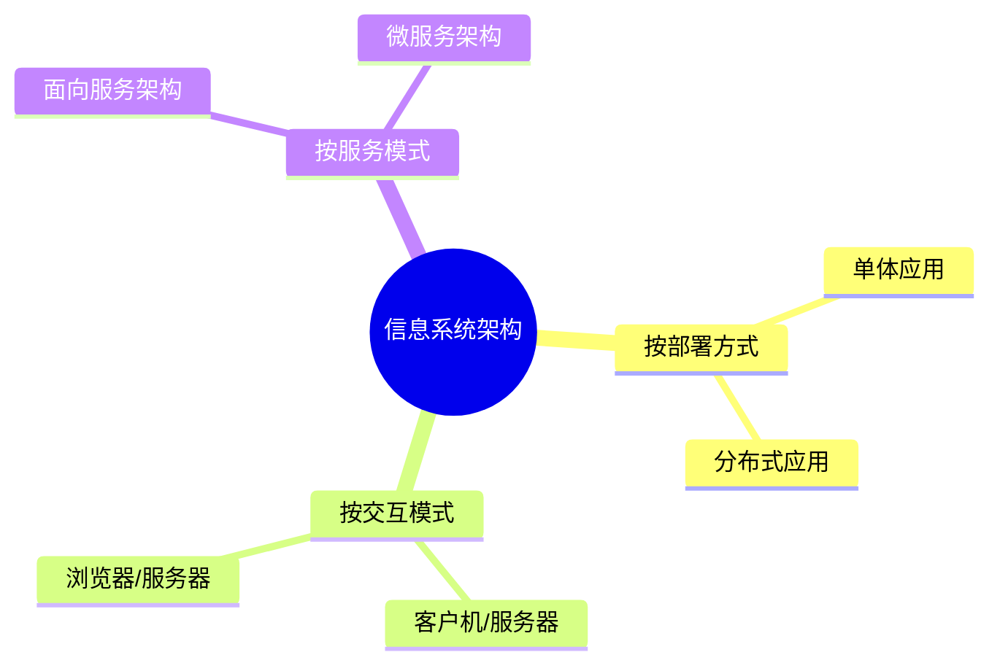
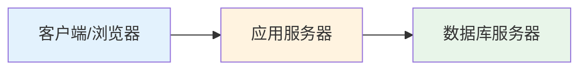
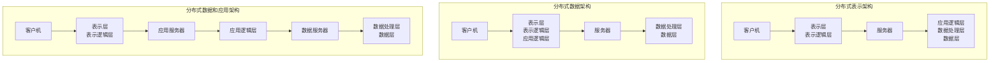
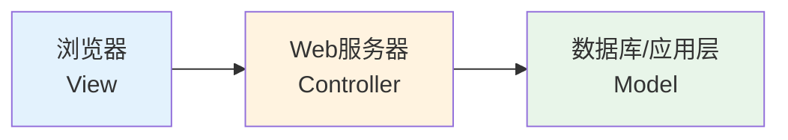
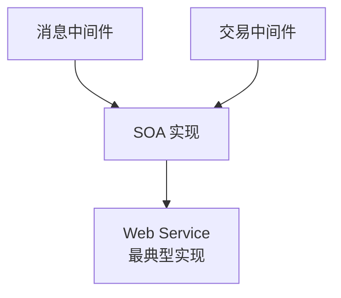
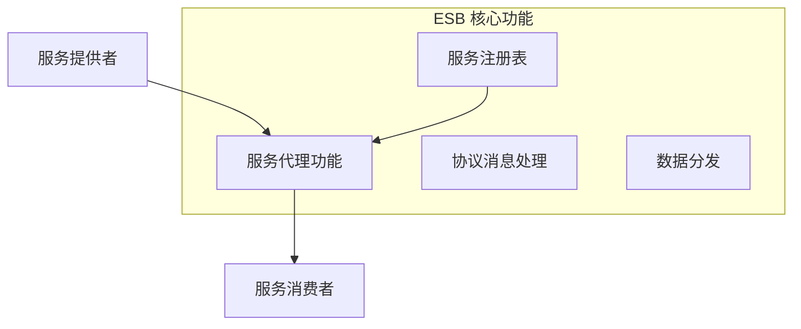

# 信息系统架构设计理论与实践

!!! abstract "本章导读"
    信息系统架构是企业信息化建设的核心，本章介绍信息系统的常用架构模型，从单体应用到分布式架构的演进。重点掌握 C/S 和 B/S 架构的层次划分、MVC 模式在 J2EE 中的应用、SOA 面向服务架构的核心理念，以及企业服务总线（ESB）的作用和特征。

## 学习目标

- [ ] 理解信息系统架构风格与分类
- [ ] 掌握二层、三层、多层 C/S 和 B/S 架构的区别
- [ ] 理解分布式计算架构的三种形式
- [ ] 掌握 SOA 面向服务架构的核心概念和实践方式
- [ ] 理解 ESB 企业服务总线的特征和作用

---

## 信息系统架构概述

### 架构风格与分类

信息系统架构可按以下维度分类：



---

## 信息系统常用架构模型

### 单体应用

单体应用（Monolithic Application）是最简单的架构形式，所有功能模块打包在一个应用中部署。

| 特点 | 说明 |
|------|------|
| 优点 | 开发简单、部署方便、测试容易 |
| 缺点 | 难以扩展、难以维护、技术栈受限 |
| 适用 | 小型项目、原型开发 |

### 客户机/服务器（C/S）架构 ⭐

客户机/服务器是信息系统中最常见的模式，客户端和服务器通过 TCP/UDP 进行请求和应答。

#### 二层 C/S 架构

二层 C/S 是一种**胖客户端**架构：

```
┌─────────────────────┐     ┌─────────────────────┐
│   前台客户端         │────→│    后台数据库        │
│  (界面 + 业务逻辑)   │     │   (数据存储)        │
└─────────────────────┘     └─────────────────────┘
```

| 特点 | 说明 |
|------|------|
| 客户端 | 包含界面和大部分业务逻辑（胖客户端） |
| 服务端 | 主要负责数据存储 |
| 缺点 | 客户端维护困难、安全性差、网络负担重 |

#### 三层 C/S 和 B/S 架构

三层架构将业务逻辑从客户端分离出来：



| 架构 | 组成 | 客户端特点 |
|------|------|-----------|
| **三层 C/S** | 客户端 + 应用服务器 + 数据库 | 瘦客户端（仅界面） |
| **三层 B/S** | 浏览器 + Web 服务器 + 数据库 | 最瘦客户端（浏览器） |

**B/S 架构特点**：

- 本质是浏览器与服务器采用 HTTP 协议（基于 TCP/IP 或 UDP）
- 零客户端安装，维护成本低
- 跨平台，兼容性好

**通信协议选择**：

| 协议 | 特点 | 适用场景 |
|------|------|---------|
| TCP/IP 协议 | 可靠传输 | 通用场景 |
| Socket 自定义协议 | 灵活高效 | 特殊需求 |
| RPC 协议 | 远程过程调用 | 分布式系统 |
| CORBA/IIOP 协议 | 跨语言对象调用 | 异构系统集成 |
| Java RMI 协议 | Java 远程方法调用 | 纯 Java 环境 |
| JMS 协议 | 消息服务 | 异步通信 |
| HTTP 协议 | Web 标准协议 | Web 应用 |

#### 多层 C/S 和 B/S 架构

多层架构在三层基础上增加中间件/应用层：

```
┌──────────┐   ┌──────────┐   ┌──────────────┐   ┌──────────┐
│  客户端  │ → │ 应用服务 │ → │ 中间件/应用层 │ → │  数据库  │
└──────────┘   └──────────┘   └──────────────┘   └──────────┘
```

**中间件/应用层的作用**：

| 作用 | 说明 |
|------|------|
| **提高并发性能** | 连接池、缓存、负载均衡 |
| **请求转发** | 业务逻辑处理、路由分发 |
| **增加数据安全性** | 访问控制、数据加密 |
| **可伸缩性** | 按需扩展 |

### 分布式计算架构 ⭐

客户机/服务器系统开发时可以采用不同的分布式计算架构：



| 架构类型 | 客户机职责 | 服务器职责 |
|---------|-----------|-----------|
| **分布式表示架构** | 表示层 + 表示逻辑层 | 应用逻辑层 + 数据处理层 + 数据层 |
| **分布式数据架构** | 表示层 + 表示逻辑层 + 应用逻辑层 | 数据处理层 + 数据层 |
| **分布式数据和应用架构** | 表示层 + 表示逻辑层 | 应用服务器（应用逻辑层）+ 数据服务器（数据层） |

### MVC 在 J2EE 中的应用

在 J2EE 架构中，MVC 模式的实现形式：



- **View**：Web 浏览器
- **Controller**：Web 服务器（可包含中间件/应用层）
- **Model**：根据实际情况与 MV 一起置于 Web 服务器，或单独置于应用层

---

## 面向服务架构（SOA）⭐

### SOA 概念

!!! quote "SOA 定义"
    SOA（Service-Oriented Architecture）是一个组件模型，它将应用程序的不同功能单元（称为**服务**）通过定义良好的**接口和契约**联系起来。

### SOA 核心特征

| 特征 | 说明 |
|------|------|
| **服务独立性** | 服务能提供一组整体功能，去掉任何一层都无法正常工作 |
| **接口中立** | 接口独立于硬件平台、操作系统和编程语言 |
| **松耦合** | 服务之间通过标准接口交互 |
| **可重用** | 服务可被多个应用复用 |

### SOA 实现方式

SOA 的实现可以借助中间件：



**Web Service 特点**：

- 两个互联网应用之间互相开放功能模块、函数、过程等"服务"
- 通过**消息机制**或**远程过程调用（RPC）**调用对方服务

### SOA 主要实践

| 实践方式 | 说明 |
|---------|------|
| **异构系统集成** | 整合不同技术栈的系统 |
| **同构系统聚合** | 合并相同技术栈的系统 |
| **联邦架构** | 多系统协作，保持自治 |

---

## 企业服务总线（ESB）⭐

### ESB 概念

企业服务总线（Enterprise Service Bus）是企业应用间信息交换的公共通道。

### ESB 核心特征



| 特征 | 说明 |
|------|------|
| **连接软件系统** | 提供服务代理功能和服务注册表 |
| **消息处理** | 按协议消息头进行数据、请求、回复的接收和分发 |
| **技术实现** | 可基于消息中间件、事务中间件、CORBA/IIOP 协议构建 |

### ESB 适用场景

!!! example "典型场景"
    当企业进行系统集成时，面临以下情况：
    
    - 业务系统的**运行平台和开发语言差异较大**
    - 系统使用的**通信协议和数据格式各不相同**
    
    **解决方案**：
    
    - 采用**ESB 总线技术**对传输协议和数据格式进行转换与适配
    - 使用**基于工作流**的功能关系定义方式灵活定义系统功能间的协作关系

### ESB vs EDB

| 类型 | 全称 | 侧重点 |
|------|------|-------|
| **ESB** | 企业服务总线 | 服务集成、协议转换 |
| **EDB** | 企业数据总线 | 数据交换、数据集成 |

---

## 本章小结

### 核心知识点

1. **C/S 架构演进**：二层（胖客户端）→ 三层（瘦客户端）→ 多层（中间件）

2. **分布式计算架构**：
   - 分布式表示架构
   - 分布式数据架构
   - 分布式数据和应用架构

3. **SOA 核心理念**：服务独立、接口中立、松耦合、可重用

4. **ESB 作用**：服务代理、协议转换、消息分发

### 架构对比

| 架构 | 客户端 | 中间层 | 服务端 |
|------|--------|--------|--------|
| 二层 C/S | 界面 + 业务逻辑 | 无 | 数据库 |
| 三层 C/S | 界面 | 业务逻辑 | 数据库 |
| 三层 B/S | 浏览器 | Web 服务器 | 数据库 |
| 多层 | 界面 | 应用 + 中间件 | 数据库 |

### 考试重点

| 知识点 | 考查形式 |
|-------|---------|
| C/S 层次划分 | 识别各层职责 |
| 分布式计算架构 | 判断各层分布位置 |
| SOA 特征 | 概念理解与应用 |
| ESB 作用 | 场景分析与选择 |

### 学习建议

1. **层次架构**：理解每一层的职责边界
2. **分布式架构**：掌握三种分布式计算架构的区别
3. **SOA/ESB**：重点理解在异构系统集成中的应用
