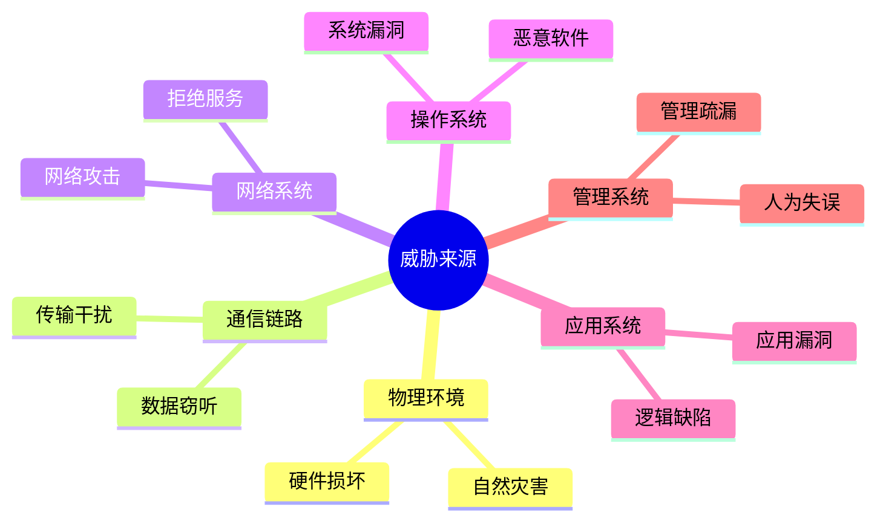
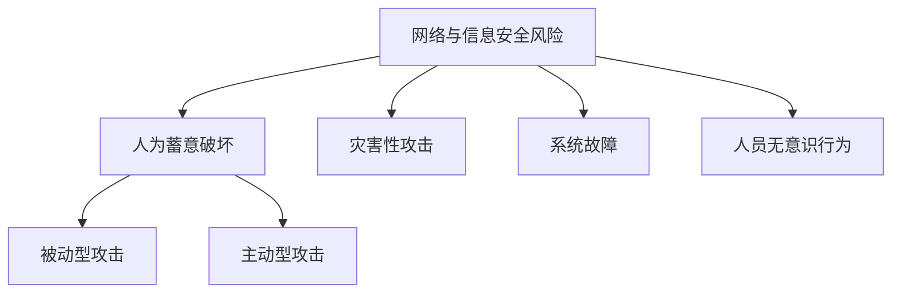
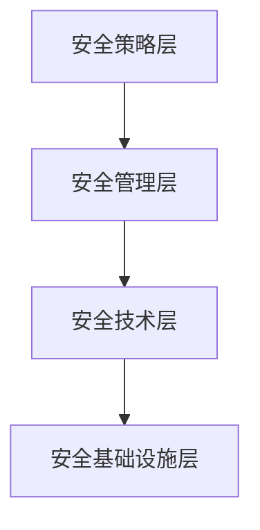
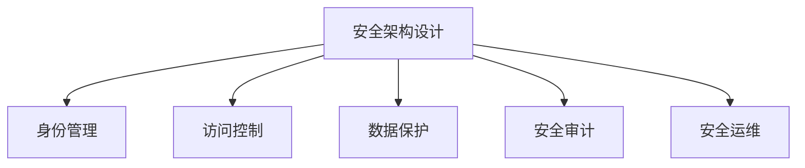

# 安全架构设计理论与实践

!!! abstract "本章导读"
    信息安全是系统架构设计中不可忽视的重要方面。本章介绍信息安全面临的威胁来源和风险类别，重点掌握 SNMPv3 定义的安全威胁分类（主要威胁和次要威胁），以及安全体系架构、安全模型、网络安全设计等核心内容。

## 学习目标

- [ ] 理解信息安全威胁的主要来源
- [ ] 掌握网络与信息安全风险的分类
- [ ] 理解 SNMPv3 安全威胁分类
- [ ] 了解安全体系架构和安全模型
- [ ] 掌握网络安全架构设计要点

---

## 信息安全面临的威胁

### 威胁来源

信息安全威胁可以来源于多个层面：

| 来源 | 典型威胁 |
|------|---------|
| **物理环境** | 硬件故障、电源问题、自然灾害 |
| **通信链路** | 数据窃听、传输干扰、中间人攻击 |
| **网络系统** | DDoS 攻击、网络入侵、端口扫描 |
| **操作系统** | 系统漏洞、权限提升、恶意软件 |
| **应用系统** | SQL 注入、XSS、业务逻辑漏洞 |
| **管理系统** | 管理疏漏、配置错误、人为失误 |

### 网络与信息安全风险类别 ⭐

| 类别 | 说明 | 示例 |
|------|------|------|
| **人为蓄意破坏** | 有意识的恶意行为 | 黑客攻击、病毒传播 |
| ├─ 被动型攻击 | 窃取信息但不修改 | 窃听、流量分析 |
| └─ 主动型攻击 | 修改或破坏系统 | 篡改数据、拒绝服务 |
| **灾害性攻击** | 自然灾害或意外 | 火灾、水灾、地震 |
| **系统故障** | 软硬件故障 | 硬件损坏、软件 Bug |
| **人员无意识行为** | 非故意的操作失误 | 误删数据、配置错误 |

---

## SNMPv3 安全威胁分类 ⭐

SNMPv3 把对网络协议的安全威胁分为**主要威胁**和**次要威胁**两类。

### 主要威胁（必须防护）

| 威胁类型 | 英文 | 说明 |
|---------|------|------|
| **修改信息** | Modification of Information | 未经授权的实体改变 SNMP 报文，企图实施未授权的管理操作或提供虚假的管理对象 |
| **假冒** | Masquerade | 未经授权的用户冒充授权用户的标识，企图实施管理操作 |

### 次要威胁（必须防护）

| 威胁类型 | 英文 | 说明 |
|---------|------|------|
| **修改报文流** | Message Stream Modification | 重新排序、延迟或重放报文，可能实施非法管理操作 |
| **消息泄露** | Disclosure | SNMP 引擎间的信息可能被偷听，应采取局部策略防护 |

### 不必防护的威胁

| 威胁类型 | 英文 | 原因 |
|---------|------|------|
| **拒绝服务** | Denial of Service | 与网络失效难以区分，由网络管理协议处理 |
| **通信分析** | Traffic Analysis | 管理系统通信模式可预见，防护意义不大 |

!!! tip "记忆技巧"
    SNMPv3 安全威胁分类：
    
    - **必须防护 4 种**：修改信息、假冒（主要）+ 修改报文流、消息泄露（次要）
    - **不必防护 2 种**：拒绝服务、通信分析

---

## 常见的安全威胁

### 攻击类型分类

| 类型 | 特点 | 示例 |
|------|------|------|
| **被动攻击** | 窃取信息，不修改数据 | 窃听、流量分析、内容泄露 |
| **主动攻击** | 修改或破坏数据 | 篡改、伪造、重放、拒绝服务 |

### 常见攻击方式

| 攻击方式 | 说明 |
|---------|------|
| **窃听** | 监听网络通信获取敏感信息 |
| **流量分析** | 分析通信模式获取信息 |
| **篡改** | 修改传输中的数据 |
| **伪造** | 冒充合法用户或系统 |
| **重放攻击** | 截获数据后重新发送 |
| **拒绝服务** | 使系统无法正常提供服务 |
| **中间人攻击** | 在通信双方之间进行窃听和篡改 |

---

## 安全体系架构

### 安全架构层次

| 层次 | 职责 |
|------|------|
| **安全策略层** | 制定安全策略和规范 |
| **安全管理层** | 安全管理制度和流程 |
| **安全技术层** | 安全技术措施实施 |
| **安全基础设施层** | 基础安全设施和工具 |

### 安全服务

| 服务 | 说明 |
|------|------|
| **身份认证** | 验证用户身份的真实性 |
| **访问控制** | 控制用户对资源的访问权限 |
| **数据机密性** | 保护数据不被未授权访问 |
| **数据完整性** | 保护数据不被篡改 |
| **不可否认性** | 防止通信方否认其行为 |

---

## 安全模型

### 常见安全模型

| 模型 | 说明 |
|------|------|
| **BLP 模型** | Bell-LaPadula 模型，关注机密性 |
| **Biba 模型** | 关注完整性 |
| **Clark-Wilson 模型** | 商业安全模型，关注完整性 |
| **Chinese Wall 模型** | 利益冲突模型 |

### BLP 模型规则

| 规则 | 说明 |
|------|------|
| **不上读** | 主体只能读取同级或更低安全级别的客体 |
| **不下写** | 主体只能写入同级或更高安全级别的客体 |

### Biba 模型规则

| 规则 | 说明 |
|------|------|
| **不下读** | 主体只能读取同级或更高完整性级别的客体 |
| **不上写** | 主体只能写入同级或更低完整性级别的客体 |

---

## 信息安全整体架构设计

### 设计原则

| 原则 | 说明 |
|------|------|
| **纵深防御** | 多层防护，不依赖单一安全措施 |
| **最小权限** | 只授予完成任务所需的最小权限 |
| **分离原则** | 敏感操作需要多方参与 |
| **默认安全** | 默认拒绝，明确允许 |
| **开放设计** | 安全不依赖算法保密 |

### 安全架构设计要素

---

## 网络安全架构设计

### 网络安全层次

| 层次 | 安全措施 |
|------|---------|
| **物理层** | 物理隔离、机房安全 |
| **网络层** | 防火墙、入侵检测、VPN |
| **传输层** | SSL/TLS、加密传输 |
| **应用层** | 应用安全、身份认证 |

### 网络安全技术

| 技术 | 作用 |
|------|------|
| **防火墙** | 访问控制、流量过滤 |
| **入侵检测** | 检测异常行为和攻击 |
| **VPN** | 安全的远程访问 |
| **加密技术** | 保护数据机密性 |
| **数字签名** | 保证数据完整性和不可否认性 |

---

## 数据库系统安全设计

### 数据库安全措施

| 措施 | 说明 |
|------|------|
| **身份认证** | 验证数据库用户身份 |
| **访问控制** | 控制用户对数据的访问权限 |
| **数据加密** | 敏感数据加密存储 |
| **审计日志** | 记录数据库操作 |
| **备份恢复** | 数据备份和灾难恢复 |

### 数据库权限管理

| 权限类型 | 说明 |
|---------|------|
| **系统权限** | 数据库系统级操作权限 |
| **对象权限** | 具体数据库对象的操作权限 |

---

## 系统架构脆弱性分析

### 脆弱性来源

| 来源 | 说明 |
|------|------|
| **设计缺陷** | 架构设计中的安全漏洞 |
| **实现错误** | 编码中的安全 Bug |
| **配置不当** | 不安全的系统配置 |
| **运维疏漏** | 运维过程中的安全问题 |

### 脆弱性评估

| 评估方法 | 说明 |
|---------|------|
| **漏洞扫描** | 自动化发现已知漏洞 |
| **渗透测试** | 模拟攻击发现安全问题 |
| **代码审计** | 审查代码中的安全问题 |
| **架构评审** | 评估架构设计的安全性 |

---

## 本章小结

### 核心知识点

1. **威胁来源**：物理环境、通信链路、网络系统、操作系统、应用系统、管理系统

2. **风险类别**：人为蓄意破坏（被动/主动）、灾害性攻击、系统故障、人员无意识行为

3. **SNMPv3 安全威胁**：
   - 主要威胁：修改信息、假冒
   - 次要威胁：修改报文流、消息泄露
   - 不必防护：拒绝服务、通信分析

4. **安全模型**：
   - BLP：不上读、不下写（机密性）
   - Biba：不下读、不上写（完整性）

### 考试重点

| 知识点 | 考查形式 |
|-------|---------|
| SNMPv3 安全威胁分类 | 判断威胁类型和防护要求 |
| 被动/主动攻击区分 | 根据攻击特点判断类型 |
| BLP/Biba 模型规则 | 规则理解与应用 |

### 学习建议

1. **威胁分类**：牢记 SNMPv3 的威胁分类及防护要求
2. **攻击类型**：理解被动攻击和主动攻击的区别
3. **安全模型**：掌握 BLP 和 Biba 模型的规则方向
