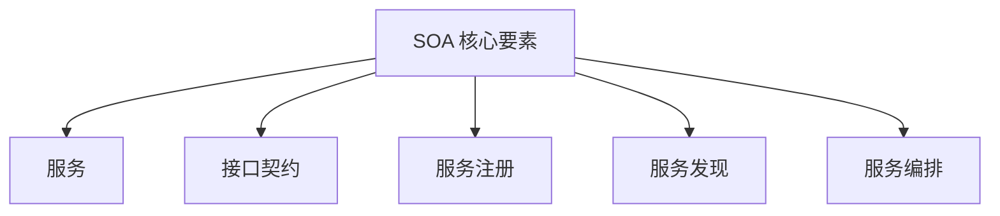
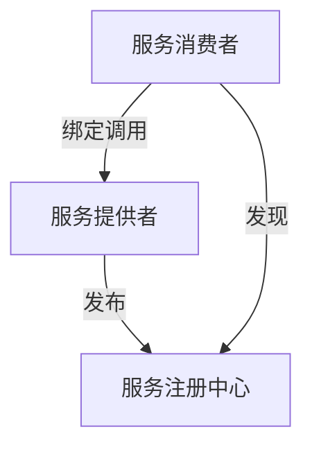
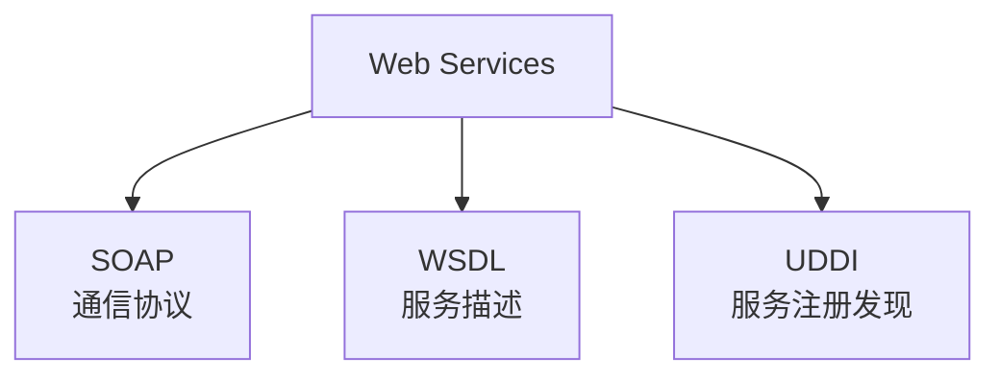
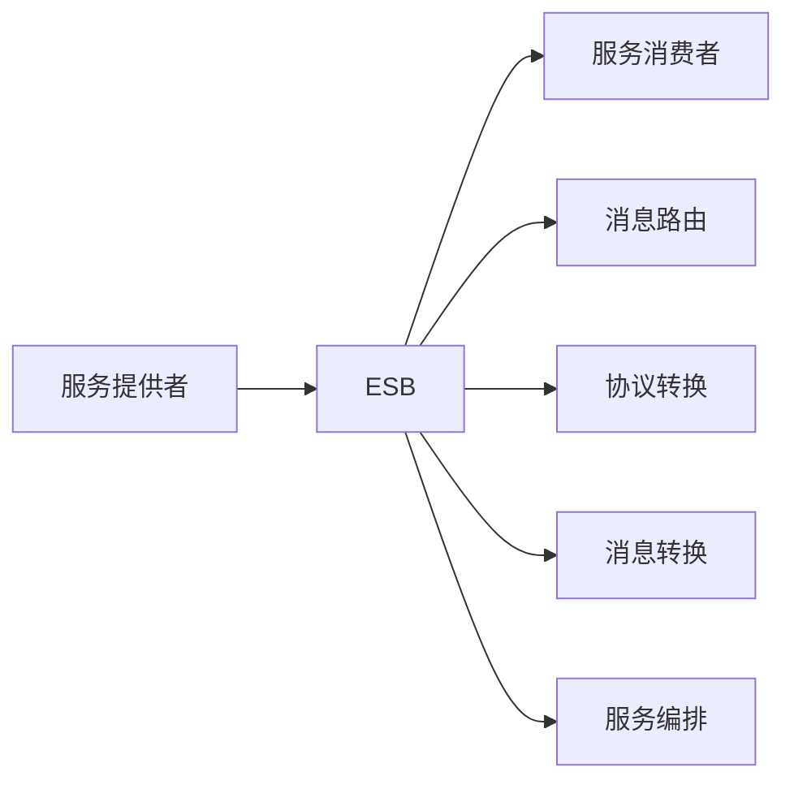
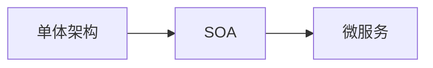

# 面向服务架构设计理论与实践

!!! abstract "本章导读"
    面向服务架构（SOA）是一种重要的软件架构风格，通过将应用程序功能封装为可重用的服务来实现系统集成和业务敏捷性。本章介绍 SOA 的核心概念、Web Services 技术栈、企业服务总线（ESB）的作用，以及从 SOA 到微服务的演进。

## 学习目标

- [ ] 理解 SOA 的核心概念和特征
- [ ] 掌握 Web Services 技术栈（SOAP、WSDL、UDDI）
- [ ] 理解 ESB 在 SOA 中的作用
- [ ] 了解 SOA 与微服务的区别
- [ ] 掌握服务设计的原则

---

## SOA 核心概念

### SOA 定义

!!! quote "SOA 定义"
    面向服务架构（Service-Oriented Architecture，SOA）是一种架构风格，它将应用程序的不同功能单元（称为**服务**）通过定义良好的**接口和契约**联系起来。

### SOA 核心要素



| 要素 | 说明 |
|------|------|
| **服务** | 自包含、无状态的业务功能单元 |
| **接口契约** | 定义服务的输入、输出和行为 |
| **服务注册** | 服务提供者注册服务信息 |
| **服务发现** | 服务消费者查找所需服务 |
| **服务编排** | 组合多个服务实现业务流程 |

### SOA 特征

| 特征 | 说明 |
|------|------|
| **松耦合** | 服务之间依赖最小化 |
| **位置透明** | 服务消费者不关心服务位置 |
| **协议独立** | 接口定义独立于实现协议 |
| **可重用** | 服务可被多个应用复用 |
| **可组合** | 服务可组合成更复杂的服务 |

---

## SOA 三角模型



| 角色 | 职责 |
|------|------|
| **服务提供者** | 创建服务并发布到注册中心 |
| **服务注册中心** | 存储服务描述，提供查询 |
| **服务消费者** | 发现服务并进行调用 |

### 交互过程

1. **发布**：服务提供者将服务描述发布到注册中心
2. **发现**：服务消费者从注册中心查找服务
3. **绑定**：服务消费者根据服务描述与提供者建立连接
4. **调用**：服务消费者调用服务

---

## Web Services 技术栈 ⭐

### 核心技术



| 技术 | 全称 | 作用 |
|------|------|------|
| **SOAP** | Simple Object Access Protocol | 定义消息格式和通信协议 |
| **WSDL** | Web Services Description Language | 描述服务接口 |
| **UDDI** | Universal Description, Discovery and Integration | 服务注册和发现 |

### SOAP 消息结构

```xml
<Envelope>
    <Header>
        <!-- 可选的头信息 -->
    </Header>
    <Body>
        <!-- 消息主体 -->
    </Body>
</Envelope>
```

| 元素 | 说明 |
|------|------|
| **Envelope** | 消息的根元素，标识这是一个 SOAP 消息 |
| **Header** | 可选，包含头信息（如安全信息） |
| **Body** | 包含实际的消息内容 |

### WSDL 组成

| 元素 | 说明 |
|------|------|
| **Types** | 定义数据类型 |
| **Message** | 定义消息格式 |
| **PortType** | 定义操作（接口） |
| **Binding** | 定义协议和数据格式绑定 |
| **Service** | 定义服务端点 |

---

## 企业服务总线（ESB）

### ESB 概念

!!! quote "ESB 定义"
    企业服务总线（Enterprise Service Bus，ESB）是 SOA 的基础设施，负责服务之间的通信、路由、协议转换和消息转换。

### ESB 核心功能



| 功能 | 说明 |
|------|------|
| **消息路由** | 根据规则将消息路由到目标服务 |
| **协议转换** | 在不同协议之间转换（HTTP、JMS、FTP 等） |
| **消息转换** | 在不同消息格式之间转换（XML、JSON 等） |
| **服务编排** | 组合多个服务实现业务流程 |
| **安全控制** | 认证、授权、加密 |
| **监控管理** | 服务监控、日志记录 |

### ESB 优势

| 优势 | 说明 |
|------|------|
| **解耦** | 服务提供者和消费者完全解耦 |
| **灵活** | 易于添加、修改、删除服务 |
| **可扩展** | 支持水平扩展 |
| **标准化** | 统一的服务访问方式 |

---

## 服务设计原则

### 服务粒度

| 粒度 | 特点 | 适用场景 |
|------|------|---------|
| **细粒度** | 功能单一、可重用性高 | 基础服务 |
| **粗粒度** | 功能完整、调用次数少 | 业务服务 |

### 服务设计原则

| 原则 | 说明 |
|------|------|
| **标准化契约** | 服务接口采用标准化的契约定义 |
| **松耦合** | 服务之间最小化依赖 |
| **抽象** | 隐藏服务实现细节 |
| **可重用** | 设计可被多个消费者重用的服务 |
| **自治** | 服务对其边界内的逻辑有完全控制 |
| **无状态** | 服务不保持请求之间的状态 |
| **可发现** | 服务可被发现和理解 |
| **可组合** | 服务可组合成更复杂的服务 |

---

## SOA 与微服务

### 对比分析

| 对比项 | SOA | 微服务 |
|-------|-----|--------|
| **服务粒度** | 较大，面向业务功能 | 较小，面向单一职责 |
| **通信方式** | ESB，重量级协议（SOAP） | 轻量级协议（REST、gRPC） |
| **数据管理** | 可共享数据存储 | 每个服务独立数据存储 |
| **部署方式** | 可集中部署 | 独立部署 |
| **技术栈** | 可统一 | 可异构 |
| **治理方式** | 集中式治理 | 分布式治理 |

### 演进关系



| 阶段 | 特点 |
|------|------|
| **单体架构** | 所有功能在一个应用中 |
| **SOA** | 功能按服务划分，ESB 集成 |
| **微服务** | 更细粒度划分，去中心化 |

---

## SOA 实施挑战

### 常见挑战

| 挑战 | 说明 |
|------|------|
| **服务识别** | 如何正确识别和划分服务边界 |
| **ESB 瓶颈** | ESB 可能成为性能瓶颈和单点故障 |
| **复杂性** | 分布式系统带来的复杂性 |
| **事务管理** | 跨服务的事务处理困难 |
| **版本管理** | 服务版本兼容性管理 |

### 最佳实践

| 实践 | 说明 |
|------|------|
| **业务驱动** | 从业务需求出发设计服务 |
| **渐进实施** | 逐步迁移，避免大爆炸式改造 |
| **治理先行** | 建立完善的服务治理体系 |
| **监控完善** | 建立全面的监控和告警机制 |

---

## 本章小结

### 核心知识点

1. **SOA 核心要素**：服务、接口契约、服务注册、服务发现、服务编排

2. **SOA 三角模型**：服务提供者、服务注册中心、服务消费者

3. **Web Services 技术栈**：
   - SOAP：通信协议
   - WSDL：服务描述
   - UDDI：服务注册发现

4. **ESB 核心功能**：消息路由、协议转换、消息转换、服务编排

5. **服务设计原则**：标准化契约、松耦合、抽象、可重用、自治、无状态、可发现、可组合

### 考试重点

| 知识点 | 考查形式 |
|-------|---------|
| SOA 三角模型 | 角色和交互过程 |
| Web Services 技术栈 | SOAP/WSDL/UDDI 作用 |
| ESB 功能 | 核心功能识别 |
| SOA vs 微服务 | 特点对比 |

### 学习建议

1. **三角模型**：理解三个角色的交互过程
2. **技术栈**：牢记 SOAP、WSDL、UDDI 各自的作用
3. **ESB**：理解 ESB 在 SOA 中的核心地位
4. **演进关系**：理解从 SOA 到微服务的演进
