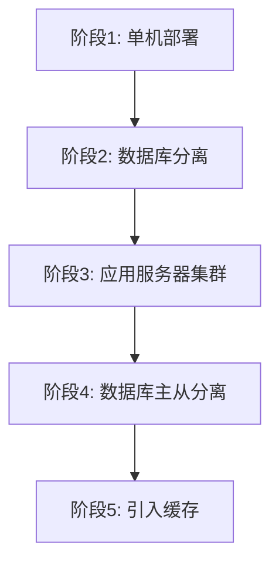
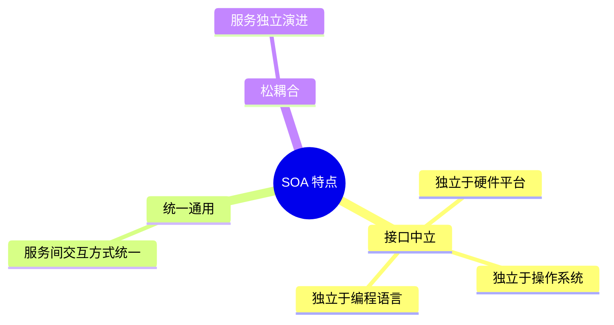
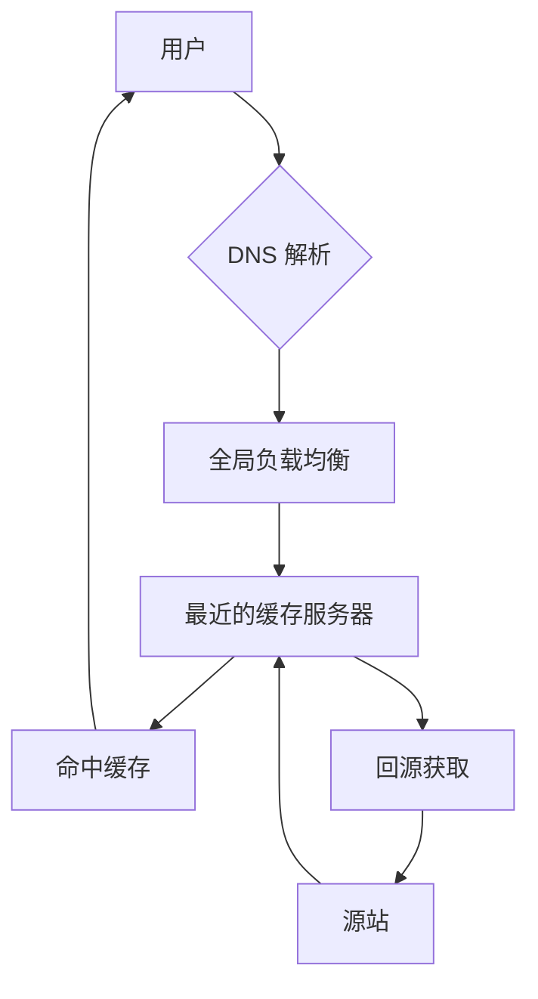
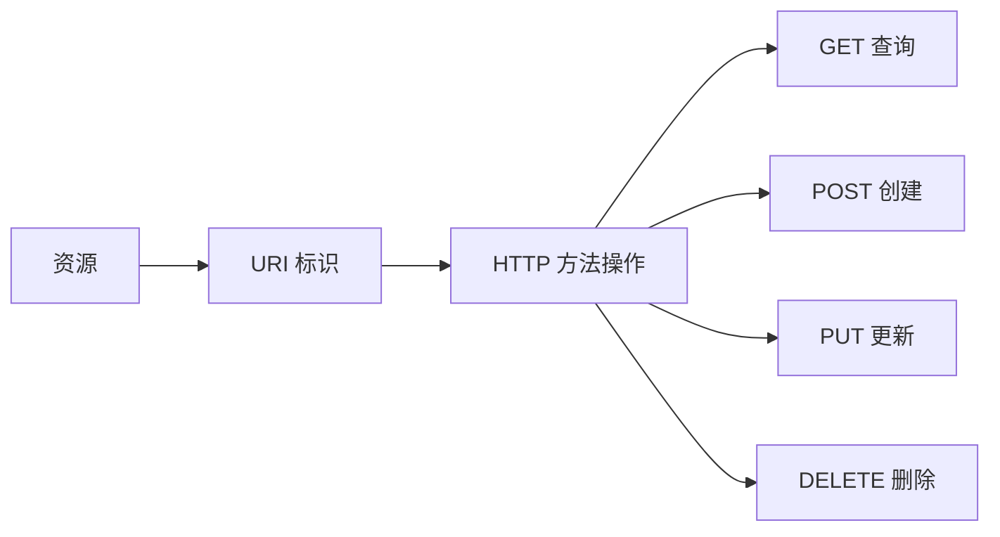
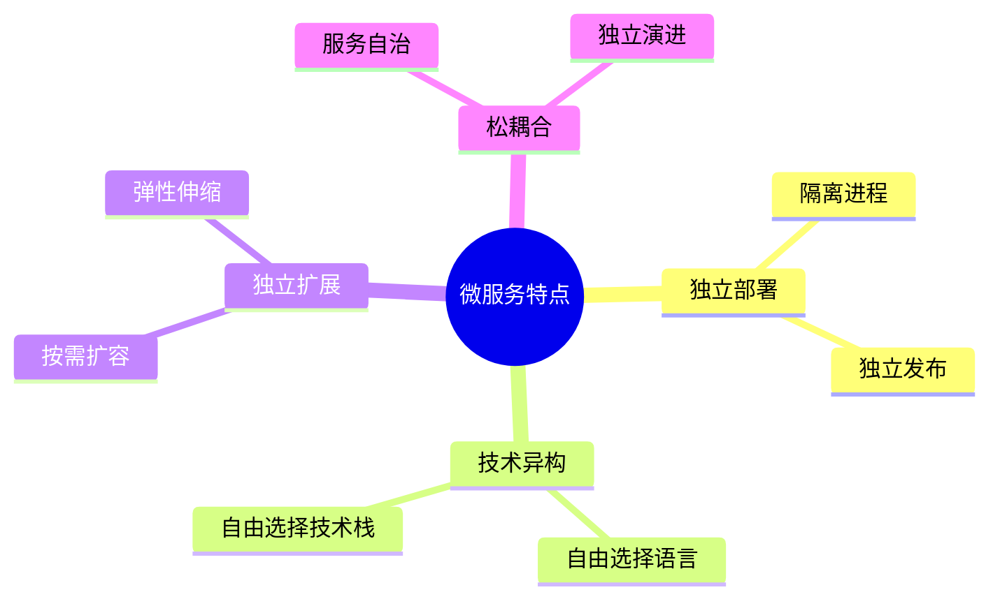
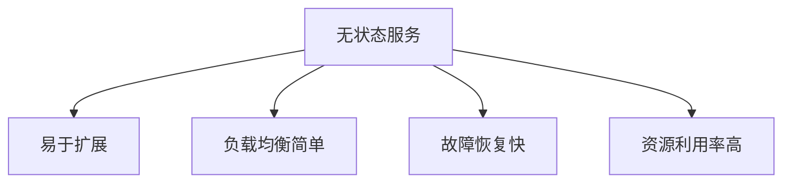

# Web 应用开发

!!! abstract "本章导读"
    Web 应用开发涉及多个技术维度，从架构模式到性能优化，从数据存储到分布式处理。本章系统梳理 Web 技术演变路径、SOA 与 ESB 的核心概念、RESTful 设计原则、微服务架构的优势与挑战，以及 CDN、缓存等关键技术的应用场景。这是论文和案例分析的高频考点。

## 学习目标

- [ ] 理解 Web 技术的演变历程
- [ ] 掌握 SOA 和 ESB 的核心概念与作用
- [ ] 熟练掌握 REST 的五个设计原则
- [ ] 理解微服务架构的优势与挑战
- [ ] 掌握 CDN、缓存等性能优化技术

---

## Web 技术全景

### 技术维度总览

| 维度 | 涉及技术架构 |
|------|-------------|
| **从架构来看** | MVC、MVP、MVVM、REST、WebService、微服务 |
| **从缓存来看** | Memcache、Redis、Squid |
| **从并发分流来看** | 集群（负载均衡）、CDN |
| **从数据库来看** | 主从库、内存数据库、反规范化、NoSQL、分区（分表）、视图 |
| **从持久化来看** | Hibernate、MyBatis |
| **从分布式存储来看** | Hadoop、FastDFS、区块链 |
| **从数据编码来看** | XML、JSON |
| **从 Web 服务器来看** | Apache、WebSphere、WebLogic、Tomcat、JBoss、IIS |
| **其他** | 有状态与无状态、响应式 Web 设计 |

---

## Web 技术演变 ⭐

Web 系统架构经历了从简单到复杂的演变过程：

### 演变阶段



### 阶段详解

=== "阶段 1：单机部署"
    Web 应用和数据库部署在同一台服务器上。
    
    - **优点**：简单、成本低
    - **缺点**：性能瓶颈、单点故障

=== "阶段 2：数据库与 Web 服务器分离"
    将数据库独立部署到单独的服务器。
    
    - **优点**：资源独立、互不影响
    - **缺点**：网络延迟

=== "阶段 3：应用服务器集群"
    部署多个应用服务器实例，通过负载均衡分发请求。
    
    **面临的问题**：
    
    - 用户请求由谁来转发到具体的应用服务器？
    - 用户每次访问的服务器不一致，如何维护 Session 一致性？
    
    **解决方案**：
    
    | 方案 | 说明 |
    |------|------|
    | Session 服务器 | 统一管理 Session 会话信息 |
    | 负载均衡 + Cookie | 客户端保存 Cookie，每次访问携带 Cookie |

=== "阶段 4：数据库主从分离"
    配置主库和从库，实现读写分离。
    
    ```mermaid
    graph LR
        A[应用服务器集群] -->|写| B[数据库 主]
        B <-->|同步| C[数据库 从]
        C -->|读| A
    ```

=== "阶段 5：引入缓存"
    使用缓存缓解数据库读取压力。
    
    ```mermaid
    graph LR
        A[应用服务器集群] -->|写| B[数据库 主]
        B <-->|同步| C[数据库 从]
        D[缓存集群] -->|1.读缓存| A
        C -->|2.读数据库| A
    ```

---

## 面向服务架构（SOA）⭐

### SOA 定义

!!! quote "SOA 核心定义"
    SOA 是一个**组件模型**，它将应用程序的不同功能单元（称为服务）通过定义良好的**接口和契约**联系起来。接口采用**中立方式**定义，独立于实现服务的硬件平台、操作系统和编程语言。

### SOA 特点



### ESB 企业服务总线 ⭐

ESB（Enterprise Service Bus）是 SOA 的一种实现方式：

| 作用 | 说明 |
|------|------|
| **总线连接** | 将各种服务进行连接与整合 |
| **元数据管理** | 描述服务的元数据和服务注册管理 |
| **数据传递** | 在服务请求者和提供者之间传递数据，支持数据转换 |
| **模式支持** | 支持同步模式、异步模式等 |
| **动态交互** | 发现、路由、匹配和选择，支持服务间动态交互 |
| **解耦能力** | 解耦服务请求者和服务提供者 |
| **高级能力** | 安全支持、服务质量保证、可管理性、负载均衡 |

---

## CDN 内容分发网络 ⭐

### CDN 定义

!!! quote "CDN 定义"
    CDN（Content Delivery Network，内容分发网络）是建立并覆盖在承载网之上，由分布在不同区域的**边缘节点服务器群**组成的分布式网络。

### CDN 工作原理



### CDN 核心功能

| 功能 | 说明 |
|------|------|
| **负载均衡** | 中心平台的负载均衡功能 |
| **内容分发** | 将内容分发到边缘节点 |
| **调度优化** | 智能调度，选择最优节点 |
| **就近获取** | 用户从最近节点获取内容 |

### CDN 关键技术

- **内容存储技术**：缓存内容的存储和管理
- **分发技术**：内容从源站到边缘节点的分发

---

## REST 表述性状态传递 ⭐

### REST 概念

!!! quote "REST 定义"
    REST（Representational State Transfer）是一种**软件架构风格**，是设计风格而不是标准，只提供一组设计原则和约束条件。

### REST 五大原则

| 原则 | 说明 |
|------|------|
| **资源抽象** | 网络上的所有事物都被抽象为**资源** |
| **唯一标识** | 每个资源对应一个唯一的**资源标识（URI）** |
| **通用接口** | 通过通用的连接接口（HTTP 方法）对资源进行操作 |
| **标识不变** | 对资源的各种操作**不会改变资源标识** |
| **无状态性** | 所有的操作都是**无状态的** |

### RESTful API 设计



| HTTP 方法 | 操作 | 幂等性 |
|----------|------|--------|
| **GET** | 查询资源 | 是 |
| **POST** | 创建资源 | 否 |
| **PUT** | 更新资源 | 是 |
| **DELETE** | 删除资源 | 是 |

### REST 的优点

- 基于该风格设计的软件**更简洁**
- **更有层次**
- **更易于实现缓存**等机制

---

## 微服务架构 ⭐

### 微服务定义

!!! quote "微服务架构"
    微服务架构建议将大型复杂的**单体架构应用**划分为一组微小的服务，每个微服务根据其负责的具体业务职责提炼为**单一的业务功能**。

### 微服务特点



### 微服务优势

| 优势 | 说明 |
|------|------|
| **解决复杂性** | 把庞大的单一模块应用分解为一系列服务，同时保持总体功能不变 |
| **独立开发** | 开发者能够自由选择可行的技术，让服务决定 API 约定 |
| **独立配置** | 每个微服务都能独立配置，变化一旦测试完成就被配置 |
| **独立调整** | 可以给每个服务配置正好满足容量和可用性限制的实例数 |

### 微服务挑战

| 挑战 | 说明 |
|------|------|
| **适用性限制** | 并非所有系统都能转成微服务，如数据库底层操作不推荐服务化 |
| **部署复杂** | 众多微服务需要单独部署，增加部署复杂度（容器技术可解决） |
| **性能问题** | 服务间通信通过标准接口，可能产生延迟或调用出错 |
| **数据一致性** | 分布式部署的微服务，保持数据一致性更加复杂 |

---

## 数据编码格式

### XML 可扩展标记语言

| 特点 | 说明 |
|------|------|
| 自描述性 | 标签自带语义 |
| 可扩展 | 可自定义标签 |
| 跨平台 | 纯文本格式 |
| 冗余较大 | 标签占用空间 |

### JSON 轻量级数据交换格式

| 特点 | 说明 |
|------|------|
| 轻量级 | 数据量小 |
| 易解析 | JavaScript 原生支持 |
| 可读性好 | 结构清晰 |
| 无模式 | 灵活但缺乏约束 |

### XML vs JSON

| 对比项 | XML | JSON |
|-------|-----|------|
| 数据量 | 较大 | 较小 |
| 可读性 | 一般 | 好 |
| 解析难度 | 较复杂 | 简单 |
| 模式验证 | 支持 XSD | 支持 JSON Schema |
| 适用场景 | 配置文件、文档 | API 数据交换 |

---

## 无状态服务

### 有状态 vs 无状态

| 类型 | 特点 | 适用场景 |
|------|------|---------|
| **有状态服务** | 服务端保存会话状态 | 需要会话管理的应用 |
| **无状态服务** | 每次请求独立，不保存状态 | RESTful API、微服务 |

### 无状态服务优点



---

## 本章小结

### 核心知识点

1. **Web 技术演变**：单机 → 分离 → 集群 → 主从 → 缓存

2. **SOA/ESB**：
   - SOA：接口中立、松耦合
   - ESB：服务连接、协议转换、动态交互

3. **REST 五原则**：资源抽象、唯一标识、通用接口、标识不变、无状态

4. **微服务**：
   - 优势：独立开发、独立部署、独立扩展
   - 挑战：部署复杂、性能问题、数据一致性

5. **CDN**：边缘节点、就近获取、负载均衡

### 技术选型对照

| 场景 | 推荐技术 |
|------|---------|
| 性能优化 | CDN、缓存（Redis）、读写分离 |
| 高可用 | 集群、负载均衡、主从复制 |
| 系统集成 | SOA、ESB |
| API 设计 | RESTful |
| 大型应用 | 微服务架构 |

### 考试重点

| 知识点 | 考查形式 |
|-------|---------|
| REST 五原则 | 原则识别与应用 |
| 微服务优势与挑战 | 场景分析 |
| ESB 作用 | 概念理解 |
| CDN 原理 | 工作流程 |

### 学习建议

1. **REST 原则**：牢记五大原则，能够判断是否符合 RESTful 规范
2. **微服务**：理解优势和挑战，掌握适用场景
3. **性能优化**：理解 CDN、缓存、主从分离的工作原理
