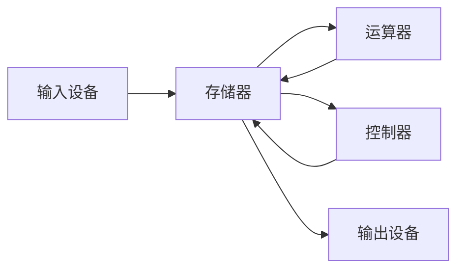
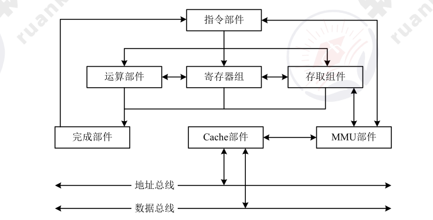
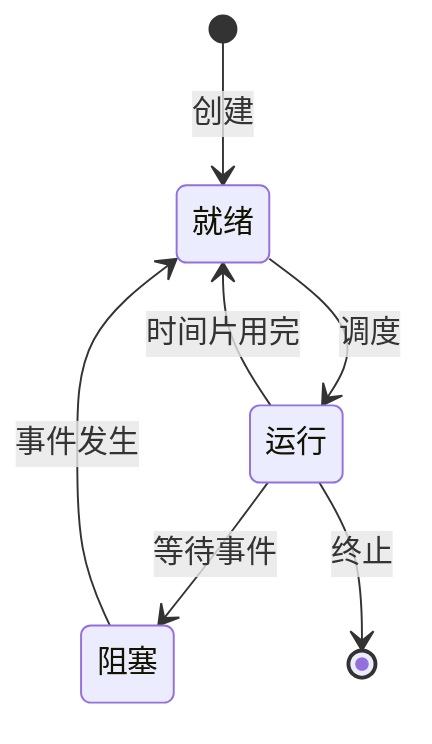
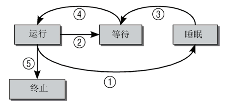

# 计算机系统

!!! abstract "本章导读"
    计算机系统是软考的基础知识模块，涵盖硬件架构、存储体系、操作系统三大核心领域。本章内容在综合知识考试中占比约 10%，是后续架构设计的理论基础。

    **学习目标**：
    
    - 理解冯·诺依曼体系结构和 CPU 工作原理
    - 掌握存储器层次结构和 Cache 机制
    - 熟悉操作系统的进程管理和存储管理

---

## 计算机硬件基础

### 冯·诺依曼体系结构

现代计算机的基本架构由五大部件组成：



| 部件 | 功能 | 典型设备 |
|------|------|----------|
| **运算器** | 算术运算、逻辑运算 | ALU |
| **控制器** | 指令译码、流程控制 | CU |
| **存储器** | 存储程序和数据 | 内存、硬盘 |
| **输入设备** | 接收外部信息 | 键盘、鼠标 |
| **输出设备** | 输出处理结果 | 显示器、打印机 |

!!! tip "记忆技巧"
    冯·诺依曼架构的核心思想是 **"存储程序"**——程序和数据都以二进制形式存储在内存中，CPU 按地址顺序取指令执行。

---

### CPU 结构与功能

CPU（中央处理器）是计算机的核心，主要由**运算器**和**控制器**两大部分组成。



#### 运算器组成

| 部件 | 英文缩写 | 功能 |
|------|----------|------|
| 算术逻辑单元 | ALU | 执行算术和逻辑运算 |
| 累加寄存器 | AC | 存放运算结果或源操作数 |
| 数据缓冲寄存器 | DR | 暂存内存读写的数据 |
| 状态条件寄存器 | PSW | 保存运算状态标志（溢出、进位等） |

#### 控制器组成

| 部件 | 英文缩写 | 功能 |
|------|----------|------|
| 指令寄存器 | IR | 暂存当前执行的指令 |
| 程序计数器 | PC | 存放下一条指令的地址 |
| 地址寄存器 | AR | 保存当前访问的内存地址 |
| 指令译码器 | ID | 分析指令操作码 |

!!! warning "高频考点"
    **CPU 如何区分指令和数据？**
    
    答：通过**指令周期的不同阶段**来区分。取指阶段访问的是指令，执行阶段访问的是数据。

---

### 指令系统

#### 指令格式

```
┌────────────┬────────────┐
│  操作码 OP  │  地址码 A   │
└────────────┴────────────┘
```

- **操作码**：指定要完成的操作（如加法、跳转）
- **地址码**：指定操作数或其位置

#### 寻址方式

=== "指令寻址"

    | 方式 | 说明 |
    |------|------|
    | 顺序寻址 | PC 自增，按顺序执行 |
    | 跳跃寻址 | 由指令指定跳转地址 |

=== "操作数寻址"

    | 寻址方式 | 操作数位置 | 特点 |
    |----------|------------|------|
    | 立即寻址 | 指令中 | 速度最快 |
    | 直接寻址 | 内存（地址在指令中） | 一次访存 |
    | 间接寻址 | 内存（地址的地址在指令中） | 两次访存 |
    | 寄存器寻址 | 寄存器中 | 速度快 |
    | 相对寻址 | PC + 偏移量 | 常用于跳转 |
    | 基址寻址 | 基址寄存器 + 偏移量 | 程序重定位 |
    | 变址寻址 | 变址寄存器 + 偏移量 | 数组访问 |

---

### CISC 与 RISC

| 特性 | CISC（复杂指令集） | RISC（精简指令集） |
|------|-------------------|-------------------|
| **指令数量** | 300+ 条 | 少于 100 条 |
| **指令复杂度** | 复杂，功能强 | 简单，单一功能 |
| **执行周期** | 多周期 | 单周期 |
| **控制方式** | 微程序控制 | 硬布线控制 |
| **寄存器数量** | 较少 | 大量通用寄存器 |
| **代表架构** | x86（Intel/AMD） | ARM、RISC-V、MIPS |

!!! note "国产处理器"
    龙芯、飞腾、申威等国产 CPU 多采用 RISC 架构（RISC-V、MIPS、ARM）。

---

### 指令流水线

流水线技术将指令执行分解为多个阶段，实现指令级并行。

```
时间 →
指令1: [取指][译码][执行][访存][写回]
指令2:      [取指][译码][执行][访存][写回]
指令3:           [取指][译码][执行][访存][写回]
```

#### 流水线计算公式

| 指标 | 公式 |
|------|------|
| 非流水执行时间 | $T_{非} = n \times t_{单条}$ |
| 流水执行时间 | $T_{流} = t_{首条} + (n-1) \times t_{最长段}$ |
| 加速比 | $S = T_{非} / T_{流}$ |
| 吞吐率 | $TP = n / T_{流}$ |

!!! example "计算示例"
    假设一条指令分 4 个阶段，每阶段 1ns，执行 100 条指令：
    
    - 非流水：$100 \times 4 = 400ns$
    - 流水：$4 + 99 \times 1 = 103ns$
    - 加速比：$400 / 103 ≈ 3.88$

---

## 存储系统

### 存储器层次结构

计算机存储器按照与 CPU 的距离，形成金字塔式的层次结构：

```
        ┌─────────┐
        │ 寄存器  │ ← 最快、最小、最贵
        ├─────────┤
        │  Cache  │
        ├─────────┤
        │  主存   │
        ├─────────┤
        │  外存   │ ← 最慢、最大、最便宜
        └─────────┘
```

| 层次 | 典型容量 | 访问时间 | 技术 |
|------|----------|----------|------|
| 寄存器 | < 1KB | < 1ns | SRAM |
| L1 Cache | 32-64KB | 1-2ns | SRAM |
| L2 Cache | 256KB-1MB | 3-10ns | SRAM |
| 主存 | 4-64GB | 50-100ns | DRAM |
| SSD | 256GB-4TB | 0.1ms | Flash |
| HDD | 1-16TB | 5-10ms | 磁盘 |

!!! tip "设计原则"
    **性能价格比最优**：利用程序的局部性原理，用少量高速存储器缓存常用数据，在成本和性能间取得平衡。

---

### 高速缓存 Cache

Cache 是解决 **CPU 与主存速度不匹配** 问题的关键技术。

#### 工作原理

Cache 的理论基础是**程序局部性原理**：

| 类型 | 含义 | 示例 |
|------|------|------|
| **时间局部性** | 刚访问的数据很快会再次访问 | 循环变量 |
| **空间局部性** | 访问某地址后，相邻地址很快被访问 | 数组遍历 |

#### 地址映射方式

=== "全相联映射"
    
    - 主存任意块 → Cache 任意块
    - **优点**：灵活，命中率高
    - **缺点**：硬件复杂，查找慢

=== "直接映射"
    
    - 主存块 → Cache 固定位置（取模）
    - **优点**：硬件简单，查找快
    - **缺点**：冲突多，命中率低

=== "组相联映射"
    
    - 主存块 → Cache 某组内任意块
    - **特点**：折中方案，实际最常用

#### 替换算法

| 算法 | 策略 | 特点 |
|------|------|------|
| **随机替换** | 随机选择 | 简单但效率低 |
| **FIFO** | 先进先出 | 可能产生 Belady 异常 |
| **LRU** | 最近最少使用 | 效果好，实现复杂 |
| **LFU** | 最不经常使用 | 需要计数器 |

#### 性能指标

$$命中率 = \frac{Cache命中次数}{总访问次数} = \frac{N_c}{N_c + N_m}$$

$$平均访问时间 = 命中率 \times Cache时间 + (1-命中率) \times 主存时间$$

---

### 磁盘存储

#### 磁盘结构

```
盘片 → 磁道（同心圆） → 扇区（弧段）
```

#### 访问时间

$$访问时间 = 寻道时间 + 旋转延迟 + 传输时间$$

- **寻道时间**：磁头移动到目标磁道
- **旋转延迟**：等待扇区转到磁头下方（平均半周）
- **传输时间**：数据传输

#### 磁盘调度算法

| 算法 | 策略 | 特点 |
|------|------|------|
| **FCFS** | 先来先服务 | 公平但效率低 |
| **SSTF** | 最短寻道优先 | 效率高但可能饥饿 |
| **SCAN** | 电梯算法 | 双向扫描，避免饥饿 |
| **C-SCAN** | 单向扫描 | 响应时间更均匀 |

---

## 操作系统

### 操作系统概述

操作系统是**计算机资源的管理者**，提供用户接口和程序运行环境。

#### 主要功能

| 功能模块 | 管理对象 | 主要任务 |
|----------|----------|----------|
| **进程管理** | CPU | 进程调度、同步互斥 |
| **存储管理** | 内存 | 内存分配、虚拟内存 |
| **文件管理** | 外存 | 文件组织、目录管理 |
| **设备管理** | I/O | 设备分配、缓冲管理 |

#### 操作系统类型

| 类型 | 特点 | 典型系统 |
|------|------|----------|
| **批处理** | 作业批量执行 | IBM OS/360 |
| **分时** | 多用户交互 | Unix、Linux |
| **实时** | 快速响应 | VxWorks、RT-Linux |
| **网络** | 资源共享 | Windows Server |
| **分布式** | 透明性、高可用 | Kubernetes |
| **嵌入式** | 微型化、可定制 | μC/OS、FreeRTOS |

!!! note "操作系统特征"
    **并发性**（多程序同时执行）、**共享性**（资源共享）、**虚拟性**（虚拟资源）、**异步性**（执行顺序不确定）

---

### 进程管理

#### 进程与线程

| 概念 | 定义 | 特点 |
|------|------|------|
| **进程** | 程序的一次执行 | 资源分配单位 |
| **线程** | 进程内的执行流 | CPU 调度单位 |

进程由三部分组成：**程序段 + 数据段 + PCB（进程控制块）**

!!! warning "PCB 是进程存在的唯一标志"

#### 进程状态





#### 进程同步与互斥

| 概念 | 定义 | 示例 |
|------|------|------|
| **互斥** | 资源排他性使用 | 打印机 |
| **同步** | 进程间协调执行 | 生产者-消费者 |
| **临界资源** | 需互斥访问的资源 | 共享变量 |
| **临界区** | 访问临界资源的代码 | 修改共享数据的函数 |

#### PV 操作

信号量机制是实现同步互斥的经典方法：

| 操作 | 动作 | 效果 |
|------|------|------|
| **P(S)** | S = S - 1 | S < 0 则阻塞 |
| **V(S)** | S = S + 1 | S ≤ 0 则唤醒一个进程 |

!!! tip "信号量含义"
    - S > 0：可用资源数
    - S < 0：等待进程数（绝对值）
    - S = 0：资源刚好用完

#### 进程调度算法

| 算法 | 策略 | 优缺点 |
|------|------|--------|
| **FCFS** | 先来先服务 | 简单公平，但短作业等待长 |
| **SJF** | 短作业优先 | 平均等待短，但长作业饥饿 |
| **优先级** | 高优先级优先 | 灵活，但低优先级饥饿 |
| **时间片轮转** | 轮流执行 | 响应快，适合分时系统 |
| **多级反馈队列** | 动态优先级 | 综合最优 |

---

### 死锁

#### 死锁产生条件

死锁发生必须**同时满足**以下四个条件：

1. **互斥条件**：资源排他使用
2. **请求保持**：持有资源同时请求新资源
3. **不可剥夺**：资源只能主动释放
4. **循环等待**：进程间形成等待环

#### 死锁处理策略

| 策略 | 方法 | 代价 |
|------|------|------|
| **预防** | 破坏四个条件之一 | 资源利用率低 |
| **避免** | 银行家算法 | 计算开销大 |
| **检测** | 资源分配图 | 需要定期检测 |
| **解除** | 终止进程或剥夺资源 | 可能丢失数据 |

!!! example "死锁资源计算"
    n 个进程，每个需要 R 个资源：
    
    - 死锁最大资源数：$n \times (R-1)$
    - 不死锁最小资源数：$n \times (R-1) + 1$

---

### 存储管理

#### 分区存储

| 方式 | 特点 | 碎片类型 |
|------|------|----------|
| **固定分区** | 分区大小固定 | 内部碎片 |
| **可变分区** | 按需分配 | 外部碎片 |
| **可重定位分区** | 可移动合并 | 无碎片 |

#### 分页存储

将内存和进程都划分为**固定大小的页**，通过页表实现地址映射。

```
逻辑地址 = [页号 | 页内偏移]
          ↓ 查页表
物理地址 = [块号 | 页内偏移]
```

**页面置换算法**：

| 算法 | 策略 | 特点 |
|------|------|------|
| **OPT** | 淘汰最远将来才用的 | 理论最优，无法实现 |
| **FIFO** | 先进先出 | 可能 Belady 异常 |
| **LRU** | 最近最少使用 | 效果好，开销大 |

#### 分段存储

按程序逻辑结构划分（代码段、数据段等），段长可变。

| 特性 | 分页 | 分段 |
|------|------|------|
| 划分依据 | 物理大小 | 逻辑结构 |
| 页/段大小 | 固定 | 可变 |
| 地址空间 | 一维 | 二维 |
| 碎片类型 | 内部碎片 | 外部碎片 |

#### 段页式存储

结合分段和分页的优点：先分段，段内再分页。

```
逻辑地址 = [段号 | 页号 | 页内偏移]
```

---

### 输入输出控制

#### I/O 控制方式

| 方式 | 特点 | CPU 参与度 |
|------|------|------------|
| **程序查询** | CPU 循环等待 | 100% |
| **中断驱动** | I/O 完成后中断 | 部分 |
| **DMA** | 直接内存访问 | 很少 |
| **通道** | 独立 I/O 处理器 | 最少 |

#### 总线

| 类型 | 特点 | 应用 |
|------|------|------|
| **并行总线** | 多数据线，近距离 | 系统内部 |
| **串行总线** | 单/双数据线，长距离 | 外部连接 |

!!! note "总线特性"
    总线的核心特点是**分时共享**——同一时刻只允许一个设备发送数据。

---

## 校验码

### 奇偶校验

在数据中增加 1 位校验位，使 1 的个数为奇数（奇校验）或偶数（偶校验）。

- **码距**：2
- **能力**：检测奇数位错误，无法纠错

### CRC 循环冗余校验

!!! warning "CRC 只能检错，不能纠错"

**计算步骤**：

1. 原始数据后补 r 个 0（r = 生成多项式阶数）
2. 用生成多项式对应的二进制数做**模 2 除法**
3. 余数即为 CRC 校验码，附加到原数据后

??? example "CRC 计算示例"
    原数据：10110，生成多项式：$G(x) = x^4 + x + 1$（对应 10011）
    
    1. 补 4 个 0：101100000
    2. 模 2 除法：101100000 ÷ 10011 = ... 余 1111
    3. 发送数据：101101111
    4. 接收方验证：101101111 ÷ 10011 = ... 余 0 ✓

---

## 本章小结

| 知识点 | 考试重点 |
|--------|----------|
| CPU 结构 | 运算器/控制器组成、寄存器功能 |
| 指令系统 | 寻址方式、CISC vs RISC |
| 流水线 | 执行时间、加速比计算 |
| Cache | 地址映射、替换算法、命中率 |
| 进程管理 | 状态转换、PV 操作、调度算法 |
| 死锁 | 四个条件、处理策略、资源计算 |
| 存储管理 | 分页/分段/段页式、页面置换 |
