# 数据库设计

!!! abstract "本章导读"

    数据库设计是系统架构师考试的核心内容之一，涵盖从数据模型基础到分布式数据库的完整知识体系。本章将系统讲解关系数据库理论、规范化设计、事务管理、数据仓库等关键概念，帮助你建立完整的数据库知识框架。

## 学习目标

通过本章学习，你应该能够：

- [x] 理解数据模型三要素和数据库三级模式
- [x] 掌握关系代数运算和 SQL 操作的对应关系
- [x] 熟练判断关系模式的范式级别（1NF-BCNF）
- [x] 理解事务 ACID 特性和并发控制机制
- [x] 掌握数据库设计的完整流程
- [x] 了解数据仓库和数据挖掘的基本概念

---

## 数据库基础概念

### 数据模型三要素

!!! warning "高频考点"

    数据模型三要素是数据库理论的基础，考试中经常以选择题形式出现。

数据模型由三个核心要素组成：

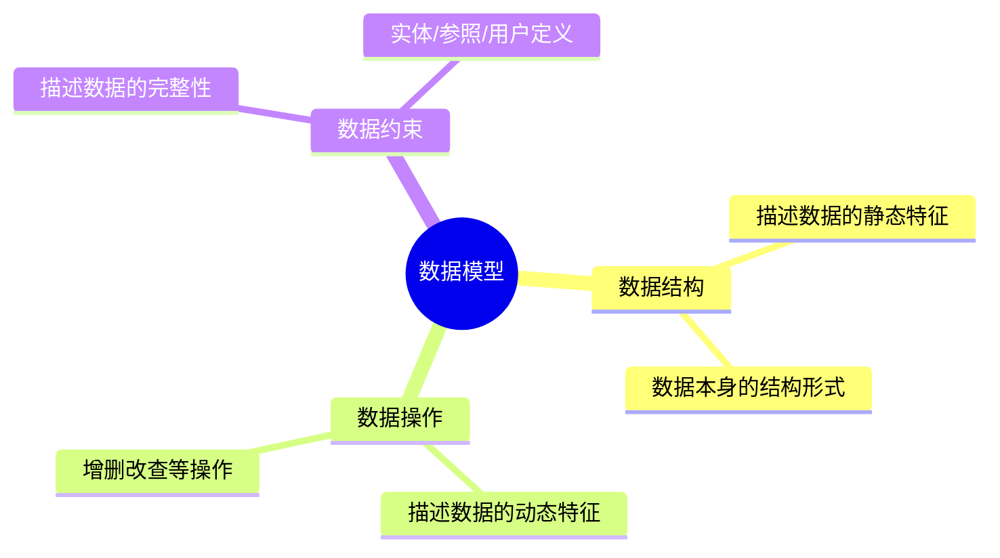

**数据的约束条件**包括三种完整性约束：

| 约束类型 | 定义 | 示例 |
|---------|------|------|
| **实体完整性** | 实体的主属性不能取空值 | 学生表的学号不能为 NULL |
| **参照完整性** | 外键值要么为空，要么必须存在于被参照表中 | 选课表的学号必须在学生表中存在 |
| **用户定义完整性** | 特定应用的约束条件 | 软考成绩范围 0-75 分 |

### 数据库三级模式

数据库采用三级模式结构来实现数据的逻辑独立性和物理独立性：

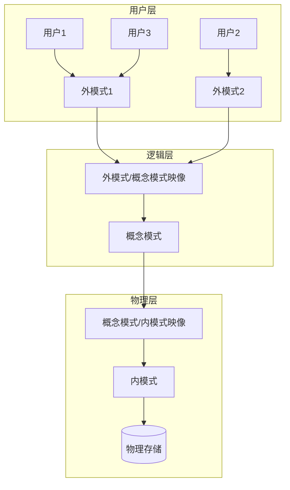

| 模式层次 | 别名 | 功能描述 |
|---------|------|---------|
| **外模式** | 用户模式/子模式 | 用户能看到和使用的局部数据的逻辑结构和特征描述 |
| **概念模式** | 逻辑模式 | 数据库中全部数据的逻辑结构和特征描述 |
| **内模式** | 存储模式 | 数据物理结构和存储方式的描述 |

!!! tip "两级映像的作用"

    - **外模式/概念模式映像**：保证数据的 ==逻辑独立性==，逻辑结构改变时应用程序无需修改
    - **概念模式/内模式映像**：保证数据的 ==物理独立性==，存储结构改变时逻辑结构无需改变

---

## 关系数据库

### 关系代数运算

!!! warning "核心考点"

    关系代数是数据库理论的数学基础，考试重点考查集合运算符和专门的关系运算符。

#### 集合运算

| 运算符 | 名称 | 运算规则 | 结果元组数 |
|-------|------|---------|-----------|
| ∪ | 并 | 属于 R 或属于 S 的元组 | ≤ K₁ + K₂ |
| − | 差 | 属于 R 但不属于 S 的元组 | ≤ K₁ |
| ∩ | 交 | 同时属于 R 和 S 的元组 | ≤ min(K₁, K₂) |
| × | 笛卡尔积 | R 和 S 所有元组的组合 | K₁ × K₂ |

#### 专门的关系运算

| 运算符 | 名称 | 功能 | SQL 等价 |
|-------|------|------|---------|
| σ | **选择** | 取符合条件的 ==行== | WHERE 子句 |
| π | **投影** | 取指定的 ==列== | SELECT 列名 |
| ⋈ | **连接** | 两表按条件组合 | JOIN 操作 |
| ÷ | 除 | 包含关系运算 | 子查询 |

!!! example "选择与投影的区别"

    === "选择 σ（水平方向）"
        ```sql
        -- 选择年龄大于20的学生
        σ(age>20)(Student) 
        -- 等价于
        SELECT * FROM Student WHERE age > 20
        ```

    === "投影 π（垂直方向）"
        ```sql
        -- 投影学号和姓名
        π(sno,sname)(Student)
        -- 等价于
        SELECT sno, sname FROM Student
        ```

#### 外连接运算

外连接是连接运算的扩展，用于保留不匹配的元组：

| 类型 | 符号 | 说明 |
|-----|------|------|
| **左外连接** | ⟕ | 保留左表所有记录，右表无匹配时填 NULL |
| **右外连接** | ⟖ | 保留右表所有记录，左表无匹配时填 NULL |
| **全外连接** | ⟗ | 保留两表所有记录，无匹配处填 NULL |

### 函数依赖理论

!!! info "理论基础"

    函数依赖是关系数据库设计理论的核心，是规范化理论的数学基础。

#### 函数依赖的概念

**函数依赖**：设 R(U) 是属性 U 上的关系模式，X 和 Y 是 U 的子集。若对于 R 的任意两个元组，只要 X 值相等，Y 值也必然相等，则称 ==Y 函数依赖于 X==，记为 $X \rightarrow Y$。

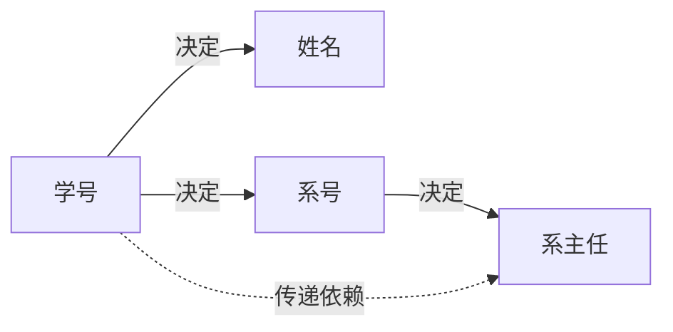

#### 函数依赖的分类

| 依赖类型 | 定义 | 示例 |
|---------|------|------|
| **平凡依赖** | $X \rightarrow Y$ 且 $Y \subseteq X$ | 学号 → 学号 |
| **非平凡依赖** | $X \rightarrow Y$ 且 $Y \nsubseteq X$ | 学号 → 姓名 |
| **完全依赖** | Y 依赖于整个 X，不依赖于 X 的任何真子集 | (学号,课程号) → 成绩 |
| **部分依赖** | Y 依赖于 X 的某个真子集 | (学号,课程号) → 系号 |
| **传递依赖** | $X \rightarrow Y$，$Y \rightarrow Z$，则 $X \rightarrow Z$ | 学号 → 系号 → 系主任 |

### 关系数据库的规范化

!!! warning "必考内容"

    范式判断是几乎每年必考的内容，需要熟练掌握各范式的定义和判断方法。

#### 范式级别对比

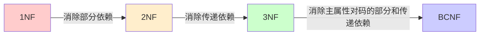

| 范式 | 要求 | 消除的问题 | 记忆口诀 |
|-----|------|-----------|---------|
| **1NF** | 属性不可再分（原子性） | - | 属性原子 |
| **2NF** | 1NF + 非主属性完全依赖于主码 | 部分函数依赖 | 完全依赖 |
| **3NF** | 2NF + 非主属性不传递依赖于主码 | 传递函数依赖 | 无传递 |
| **BCNF** | 每个决定因素都包含候选码 | 主属性对码的依赖问题 | 决定必含码 |

!!! tip "范式判断技巧"

    范式包含关系：$BCNF \subset 3NF \subset 2NF \subset 1NF$
    
    判断步骤：
    
    1. 确定候选码（能唯一标识元组的最小属性组）
    2. 区分主属性和非主属性
    3. 检查是否存在部分依赖（判断2NF）
    4. 检查是否存在传递依赖（判断3NF）
    5. 检查决定因素是否都包含候选码（判断BCNF）

#### 模式分解

模式分解需要保证两个重要性质：

| 性质 | 含义 | 检验方法 |
|-----|------|---------|
| **无损连接性** | 分解后能还原原关系 | 表格法或定理判断 |
| **保持函数依赖** | 原有的函数依赖仍然成立 | 检查每个 FD 是否在子模式中 |

!!! example "无损连接判定定理"

    对于分解 $\rho = \{R_1, R_2\}$，分解具有无损连接性的充分必要条件是：
    
    $$R_1 \cap R_2 \rightarrow (R_1 - R_2) \quad \text{或} \quad R_1 \cap R_2 \rightarrow (R_2 - R_1)$$

---

## 事务管理

### ACID 特性

!!! warning "核心概念"

    事务的 ACID 特性是数据库系统的基石，每个特性都可能单独考查。

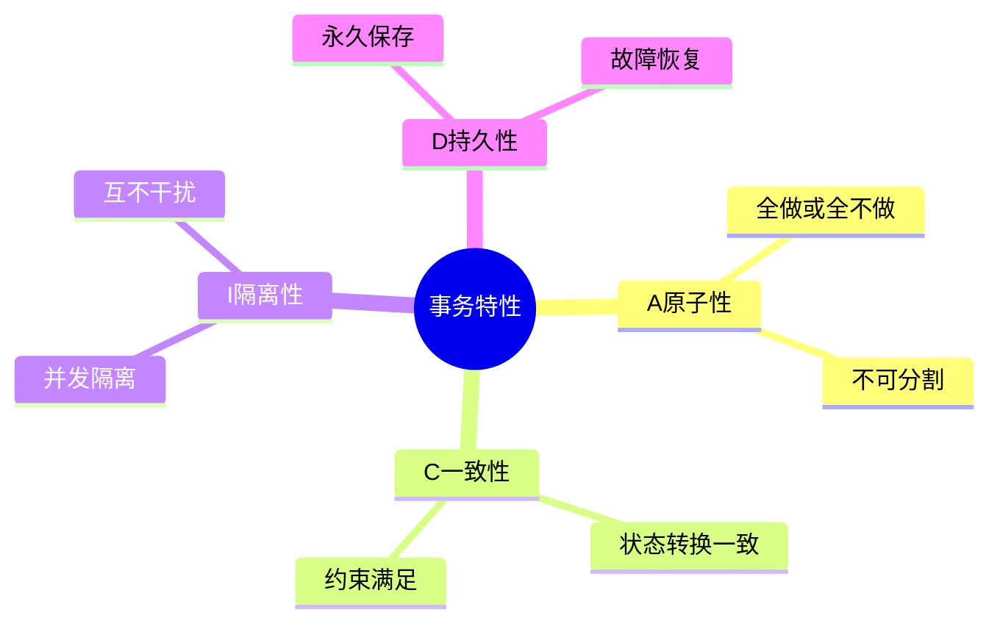

| 特性 | 英文 | 含义 | 实现机制 |
|-----|------|------|---------|
| **原子性** | Atomicity | 事务是不可分割的工作单位 | 日志、回滚 |
| **一致性** | Consistency | 事务执行前后数据库保持一致状态 | 完整性约束 |
| **隔离性** | Isolation | 并发事务互不干扰 | 锁机制 |
| **持久性** | Durability | 提交后的修改永久保存 | 日志、备份 |

### 事务控制语句

```sql
-- 事务开始
BEGIN TRANSACTION;

-- 正常提交（修改写入磁盘）
COMMIT;

-- 回滚（撤销所有修改）
ROLLBACK;
```

### 并发控制

#### 并发问题

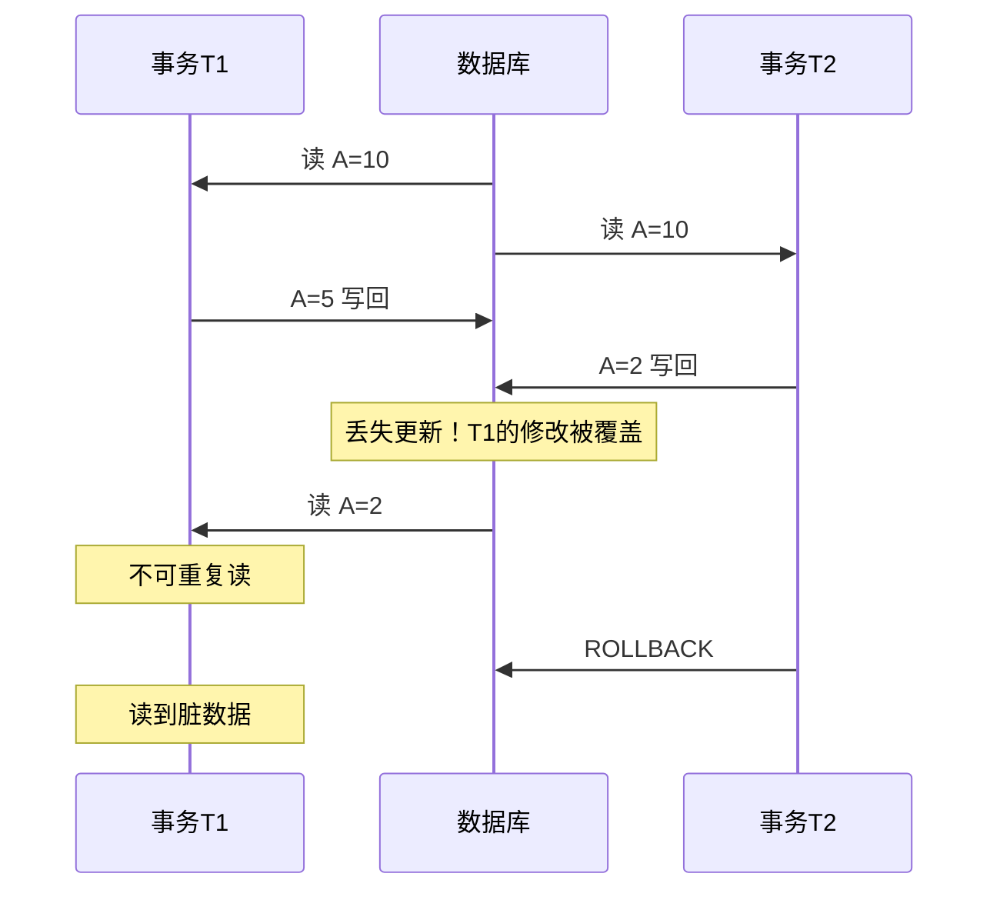

| 问题 | 描述 | 解决方案 |
|-----|------|---------|
| **丢失更新** | 后提交的事务覆盖先提交的修改 | X 锁 |
| **不可重复读** | 同一事务两次读取结果不同 | S 锁保持到事务结束 |
| **读脏数据** | 读到未提交的数据后对方回滚 | 禁止读未提交数据 |

#### 封锁机制

| 锁类型 | 名称 | 特点 |
|-------|------|------|
| **X 锁** | 排他锁/写锁 | 只允许持有事务读写，其他事务完全阻塞 |
| **S 锁** | 共享锁/读锁 | 允许多个事务同时读取，但不能修改 |

!!! tip "封锁协议"

    **两阶段锁协议**：事务分为两个阶段
    
    1. **增长阶段**：只能加锁，不能解锁
    2. **收缩阶段**：只能解锁，不能加锁
    
    两阶段锁协议保证事务的 ==串行化执行==，但可能导致 ==死锁==。

---

## 数据库设计流程

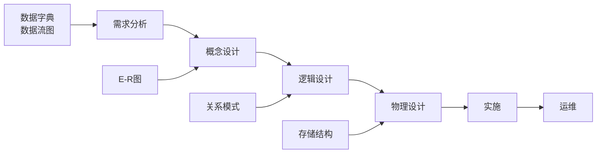

| 阶段 | 主要任务 | 产出物 |
|-----|---------|-------|
| **需求分析** | 收集用户需求，明确系统边界 | 需求说明书、数据字典、DFD |
| **概念设计** | 建立概念模型，设计 E-R 图 | 全局 E-R 图 |
| **逻辑设计** | E-R 图转换为关系模式，规范化 | 关系模式、视图 |
| **物理设计** | 确定存储结构、索引、分区 | 物理数据库结构 |
| **实施** | 建库、数据加载、试运行 | 实际数据库 |
| **运维** | 监控、优化、重组 | 优化报告 |

### E-R 模型

E-R 图的三个基本要素：

| 元素 | 图形表示 | 说明 |
|-----|---------|------|
| **实体** | 矩形 | 现实世界中可以区分的事物 |
| **属性** | 椭圆 | 实体的特征描述 |
| **联系** | 菱形 | 实体之间的关系（1:1, 1:N, M:N） |

!!! info "E-R 图转换规则"

    - **1:1 联系**：可合并到任一端实体，或独立建表
    - **1:N 联系**：将 1 端主码作为 N 端外键，或独立建表
    - **M:N 联系**：==必须== 转换为独立的关系模式

---

## 商业智能与数据仓库

### 商业智能体系

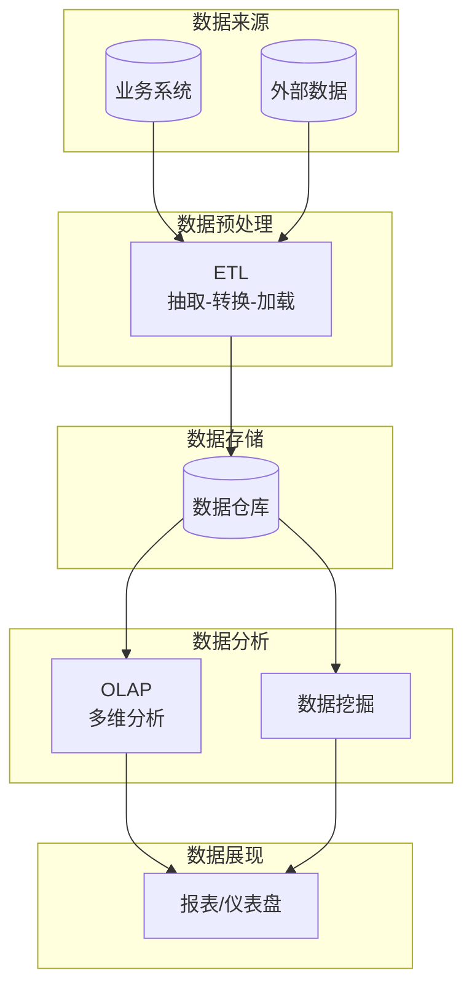

### 数据仓库特征

!!! tip "四大特征记忆法"

    **面向主题、集成的、非易失的、时变的** —— 可记为"主集稳时"

| 特征 | 含义 | 与传统数据库对比 |
|-----|------|----------------|
| **面向主题** | 围绕业务主题组织 | 传统 DB 面向应用/事务 |
| **集成的** | 多源数据统一整合 | 传统 DB 各自独立 |
| **非易失的** | 数据只增不改删 | 传统 DB 频繁更新 |
| **时变的** | 保存历史数据 | 传统 DB 只存当前数据 |

### OLTP 与 OLAP 对比

| 对比项 | OLTP（联机事务处理） | OLAP（联机分析处理） |
|-------|---------------------|---------------------|
| **用户** | 操作人员 | 决策人员 |
| **功能** | 日常事务处理 | 分析决策 |
| **数据** | 当前、细节、二维 | 历史、聚集、多维 |
| **操作** | 读写少量记录 | 读取大量记录 |
| **DB 大小** | 100MB - GB | 100GB - TB |

### 数据挖掘

数据挖掘是从大量数据中发现隐藏的、有价值的信息和知识的过程。

**主要任务**：

| 任务 | 描述 | 应用场景 |
|-----|------|---------|
| **关联分析** | 发现数据项之间的关联关系 | 购物篮分析（啤酒与尿布） |
| **聚类分析** | 将相似对象分组 | 客户细分 |
| **分类分析** | 根据已知类别预测新数据 | 信用评估 |
| **异常分析** | 识别偏离正常模式的数据 | 欺诈检测 |
| **演变分析** | 发现数据随时间的变化趋势 | 趋势预测 |

---

## 分布式数据库

### 体系结构

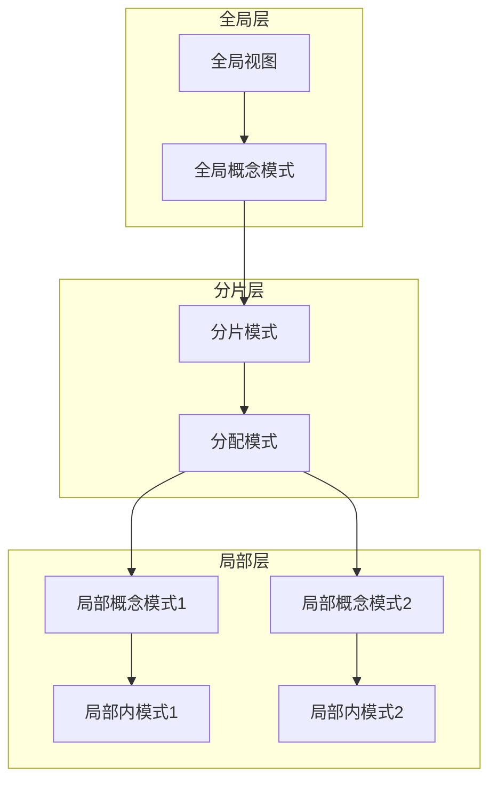

### 分布透明性

| 透明性级别 | 用户需知道 | 说明 |
|-----------|----------|------|
| **分片透明** | 无 | 最高级别，用户完全不知数据分布 |
| **位置透明** | 分片情况 | 不需知道片段存储位置 |
| **局部数据模型透明** | 分片和位置 | 不需知道各节点的数据模型 |

### 两阶段提交协议

分布式事务需要保证所有节点数据一致，采用两阶段提交（2PC）：

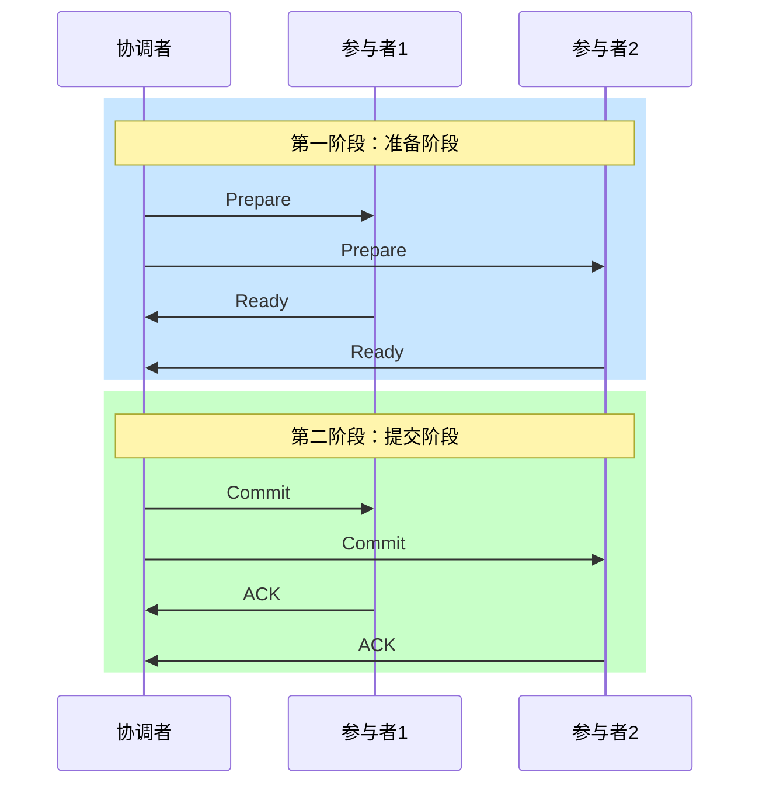

---

## 扩展知识

### 数据库分类对比

| 类型 | 代表产品 | 特点 | 适用场景 |
|-----|---------|------|---------|
| **关系型** | MySQL, Oracle | 结构化、ACID、SQL | 事务处理、传统应用 |
| **NoSQL** | MongoDB, Redis | 灵活、高并发、分布式 | 大数据、高并发 |
| **内存数据库** | Redis, MemCache | 高性能、低延迟 | 缓存、实时计算 |

### ORM 技术

ORM（Object-Relation Mapping）实现对象与关系数据库的映射：

| 映射关系 | 对象模型 | 关系模型 |
|---------|---------|---------|
| 类 | Class | 表 Table |
| 对象 | Object | 记录 Record |
| 属性 | Attribute | 字段 Field |

**主流 ORM 框架**：

| 框架 | 特点 |
|-----|------|
| **Hibernate** | 全自动 ORM，跨数据库，HQL |
| **MyBatis** | 半自动，手写 SQL，灵活优化 |
| **JDO** | Java 标准，支持多种存储 |

### 反规范化技术

!!! tip "设计权衡"

    规范化减少冗余但增加连接操作，反规范化提高查询性能但增加维护复杂度。

| 技术 | 描述 | 优点 |
|-----|------|------|
| **增加冗余列** | 多表保留相同列 | 减少连接操作 |
| **增加派生列** | 存储计算结果 | 避免重复计算 |
| **重组表** | 合并频繁连接的表 | 减少连接开销 |
| **水平分割** | 按行分表 | 减少单表数据量 |
| **垂直分割** | 按列分表 | 减少 I/O |

---

## 总结

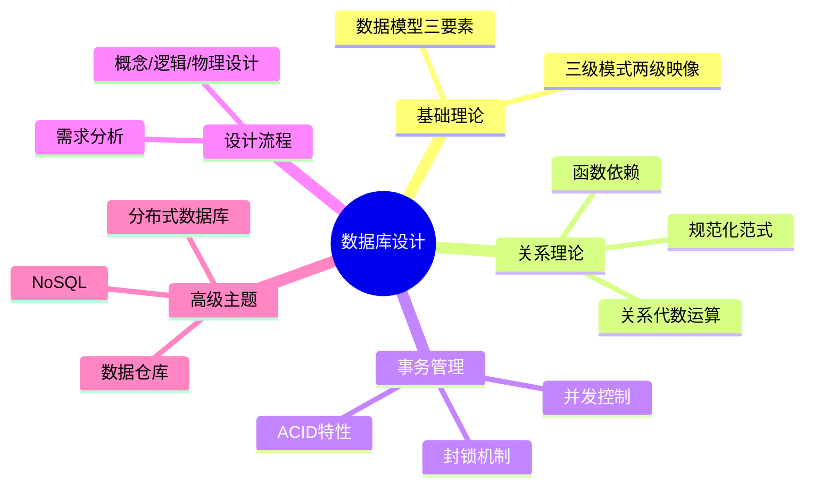

!!! note "学习建议"

    1. **范式判断**是必考点，务必通过大量练习熟练掌握
    2. **关系代数**要理解每种运算的含义和 SQL 等价形式
    3. **事务 ACID**特性要能够举例说明每个特性的含义
    4. **数据仓库**与传统数据库的区别是常见考点
