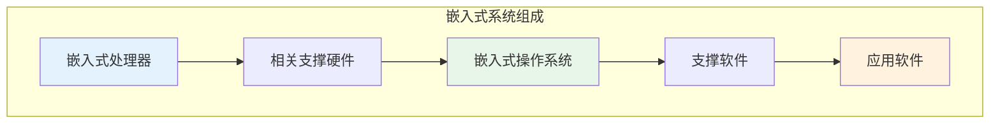
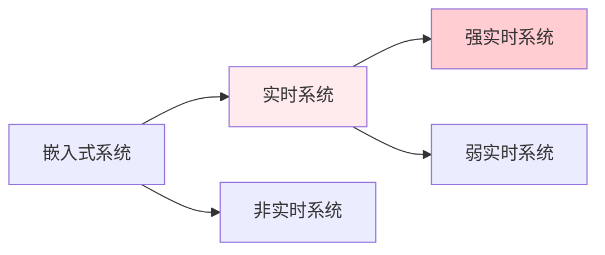
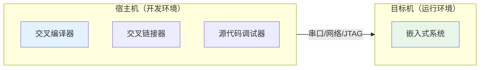
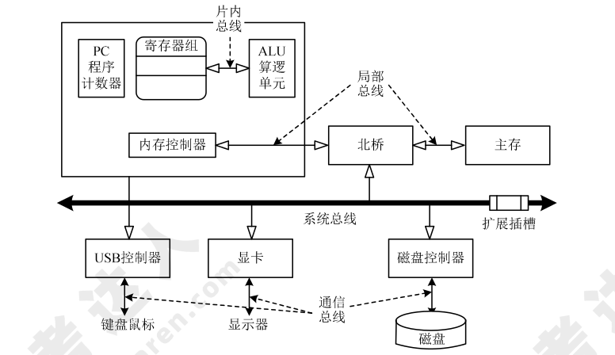
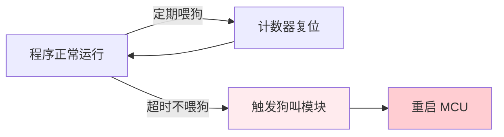
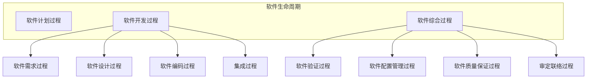

# 嵌入式系统

!!! abstract "本章导读"
    嵌入式系统是软考架构师考试的重要考点，涉及嵌入式系统的组成、分类、软硬件体系结构以及安全性设计等内容。本章将系统讲解嵌入式系统的核心概念，帮助你建立完整的知识体系。

    **学习目标**：

    - 理解嵌入式系统的定义、组成和特点
    - 掌握嵌入式系统的分类方法
    - 熟悉嵌入式软件的层次结构和开发特点
    - 了解嵌入式硬件体系结构和安全性设计

---

## 一、嵌入式系统概述

嵌入式操作系统是应用于嵌入式系统，实现软硬件资源的分配、任务调度、控制、协调并发活动等的操作系统软件。

### 1.1 基本特性

除了具有一般操作系统的基本功能（如多任务调度、同步机制等）外，嵌入式操作系统还具有以下特性：

| 特性 | 说明 |
|------|------|
| **面向应用** | 可以进行裁剪和移植，支持开放性和可伸缩性的体系结构 |
| **强实时性** | 适应各种控制设备及系统的实时响应需求 |
| **硬件适用性** | 对不同硬件平台提供有效支持，实现统一的设备驱动接口 |
| **高可靠性** | 运行时无须用户过多干预，能够处理各类事件和故障 |
| **编码体积小** | 通常固化在嵌入式系统有限的存储单元中 |

---

## 二、嵌入式系统的组成及特点

### 2.1 系统定义

嵌入式系统（Embedded System）是以**特定应用为中心**、以**计算机技术为基础**，并将可配置与可裁剪的软、硬件集成于一体的**专用计算机系统**。

### 2.2 组成结构

| 组成部分 | 说明 |
|----------|------|
| **嵌入式处理器** | 工艺分为民用（0～70℃）、工业（-40～85℃）和军用（-55～150℃）三个档次 |
| **相关支撑硬件** | 处理器以外的硬件，如存储器、定时器、总线等 |
| **嵌入式操作系统** | 应具备**实时性、可裁剪性和安全性**等特征 |
| **支撑软件** | 公共服务运行在操作系统之上，以库的方式被应用软件引用 |
| **应用软件** | 为完成嵌入式系统某一专用目标所开发的软件 |

### 2.3 系统特点

| 特点 | 说明 |
|------|------|
| 专用性强 | 面向特定应用需求，配备多种传感器 |
| 技术融合 | 计算机技术、通信技术、半导体技术与行业应用紧密结合 |
| 软硬一体 | 在通用版本基础上裁剪冗余，高效设计 |
| 资源受限 | 低功耗、体积小、集成度高，系统资源有限 |
| 代码固化 | 程序代码固化在 ROM 中，提高执行速度和可靠性 |
| 专门开发 | 需要专门的开发工具和环境 |
| 高性价比 | 体积小、价格低、工艺先进 |
| 高可靠性 | 对安全性和可靠性要求高 |

!!! warning "高频考点"
    **问题**：嵌入式系统开发中，宿主机和目标机的关系是什么？
    
    **答案**：由于嵌入式设备不具备足够的处理器能力和存储空间，程序开发一般用 PC（宿主机）来完成，然后将可执行文件下载到嵌入式系统（目标机）中运行。当宿主机与目标机的机器指令不同时，就需要**交叉工具链**（编译、汇编、链接等一整套工具）。

---

## 三、嵌入式系统的分类

### 3.1 按用途分类

| 分类 | 说明 |
|------|------|
| **嵌入式实时系统** | 能在规定时间内完成系统功能和做出响应 |
| **嵌入式非实时系统** | 对响应时间没有严格要求 |
| **强实时系统** | 必须在严格的时间限制内完成任务 |
| **弱实时系统** | 对时间限制有一定容忍度 |

### 3.2 按安全性分类

| 分类 | 说明 |
|------|------|
| **安全攸关系统** | 不正确的功能或失效会导致人员伤亡、财产损失等严重后果 |
| **非安全攸关系统** | 失效不会造成严重后果 |

### 3.3 实时系统评价指标

!!! info "RTOS 实时性评价指标"
    评价嵌入式实时操作系统（RTOS）实时性的主要指标包括：
    
    - **系统调用平均运行时间**
    - **任务切换时间**
    - **线程切换时间**
    - **信号量混洗时间**（从释放信号量到等待该信号量的任务被激活的时间延迟）
    - **中断响应时间**
    
    ⚠️ 注意：**任务执行时间**不是反映 RTOS 实时性的评价指标。

---

## 四、嵌入式软件的组成及特点

### 4.1 架构模式

大多数嵌入式系统具备实时特征，典型架构可概括为两种模式：

| 模式 | 说明 |
|------|------|
| **层次化模式架构** | 按功能分层，各层之间有明确的接口 |
| **递归模式架构** | 模块之间可以相互调用 |

### 4.2 开发环境

嵌入式系统的最大特点是**运行和开发在不同环境中进行**：

### 4.3 软件层次结构

| 层次 | 内容 |
|------|------|
| **硬件层** | 处理器、存储器、总线、I/O 接口及电源、时钟等 |
| **抽象层** | 硬件抽象层（HAL）+ 板级支持包（BSP） |
| **操作系统层** | 嵌入式操作系统、文件系统、GUI、网络系统和通用组件等 |
| **中间件层** | 嵌入式数据库、OpenGL、消息中间件、Java 中间件、VM、DDS/CORBA、Hadoop 等 |
| **应用层** | 不同的应用软件 |

!!! tip "BSP 的作用"
    **板级支持包（BSP）** 是对硬件抽象层的实现，介于主板硬件和操作系统驱动程序之间。主要功能：
    
    - 为上层提供统一接口
    - 屏蔽各种硬件底层的差异
    - 提供操作系统的驱动及硬件驱动
    
    简单地说，BSP 包含了所有与硬件有关的代码，为操作系统提供了**硬件平台无关性**。

### 4.4 软件主要特点

| 特点 | 设计方法 |
|------|----------|
| **可剪裁性** | 静态编译、动态库、控制函数流程实现功能控制 |
| **可配置性** | 数据驱动、静态编译、配置表 |
| **强实时性** | 表驱动、配置、静/动态结合、汇编语言 |
| **安全性** | 编码标准、安全保障机制、FMECA（故障模式、影响及危害性分析） |
| **可靠性** | 容错技术、余度技术、鲁棒性设计 |
| **高确定性** | 静态分配资源、越界检查、状态机、静态任务调度 |

!!! info "硬件抽象层（HAL）"
    硬件抽象层位于操作系统内核与硬件电路之间的接口层，目的在于将硬件抽象化：
    
    - 隐藏特定平台的硬件接口细节
    - 为操作系统提供虚拟硬件平台
    - 使操作系统具有**硬件无关性**，可在多种平台上进行移植

---

## 五、嵌入式系统硬件体系结构

### 5.1 组成结构

传统嵌入式系统主要由以下部件组成：

| 部件 | 说明 |
|------|------|
| 嵌入式微处理器 | 系统的核心计算单元 |
| 存储器 | RAM、ROM 等 |
| 总线逻辑 | 数据总线、地址总线、控制总线 |
| 定时/计数器 | 提供定时和计数功能 |
| 看门狗电路 | 系统恢复能力保障 |
| I/O 接口 | 与外部设备交互 |
| 外部设备 | 传感器、执行器等 |

### 5.2 嵌入式微处理器分类

| 类型 | 说明 | 典型产品 |
|------|------|----------|
| **MPU（微处理器）** | 微处理器+专门设计的电路板，集成度低、可靠性高 | Am186/88、386EX、PowerPC、MIPS、ARM 系列 |
| **MCU（微控制器）** | 单片机，核心存储器和部分外设封装在片内，体积小、功耗低 | 8501、MCS-251、MC68HC 系列、ARM 系列 |
| **DSP（数字信号处理器）** | 哈佛结构，适合大量数据处理 | TMS320 系列（C2000/C5000/C6000/C8000） |
| **GPU（图形处理器）** | 大幅加强浮点运算和多核并行计算能力，常用于 AI 深度学习 | - |
| **SoC（片上系统）** | 多个功能集成电路组合在一个芯片上，包含完整硬件系统 | - |

### 5.3 存储器分类

=== "随机存储器（RAM）"

    | 类型 | 特点 | 用途 |
    |------|------|------|
    | **DRAM** | 电容存储，集成度高、容量大、成本低，需要定期刷新 | 常作主存 |
    | **SRAM** | 晶体管自锁，速度快、不需刷新，集成度低、成本高 | 常用作高速缓存 |

=== "只读存储器（ROM）"

    | 类型 | 特点 |
    |------|------|
    | **MROM** | 掩膜制造，数据不可修改，适合大批量生产 |
    | **PROM** | 可一次性烧录，适合少量制造 |
    | **EPROM** | 可通过紫外线擦除重写 |
    | **EEPROM** | 可通过电压擦除，但速度慢 |
    | **Flash** | 可联机擦写，速度快，读取速度相对较慢 |

### 5.4 总线分类

=== "按传输信息种类"

    | 类型 | 用途 |
    |------|------|
    | 数据总线 | 传送需要处理或存储的数据 |
    | 地址总线 | 指定 RAM 中存储数据的地址 |
    | 控制总线 | 传送微处理器控制单元的信号 |

=== "按连接部件"

    | 类型 | 说明 |
    |------|------|
    | 片内总线 | 连接芯片内部各元件 |
    | 系统总线 | 连接计算机系统核心组件 |
    | 局部总线 | 连接局部少数组件 |
    | 通信总线 | 主机连接外设的总线 |

!!! info "总线传输方式"
    - **单工总线**：只能从一端向另一端传输
    - **半双工总线**：可双向传输，但只能轮流进行
    - **全双工总线**：可同时在两个方向传输
    - **并行总线**：多位传输线，同时传输多位数据，传输距离近
    - **串行总线**：一位传输线，同时只传输一位数据，距离可较远

### 5.5 看门狗电路

看门狗电路是嵌入式系统必须具备的一种**系统恢复能力**，可防止程序出错或死锁。

**组成**：输入端、寄存器、计数器、狗叫模块

**工作原理**：

---

## 六、安全攸关软件的安全性设计

### 6.1 定义

IEEE 定义安全攸关软件是**"用于一个系统中，可能导致不可接受的风险的软件"**。

### 6.2 DO-178B 标准

DO-178B 标准为制造机载系统和设备的机载软件提供指导，使其能够在满足适航要求的安全性水平下完成预期功能。

**软件生命周期划分**：

**安全等级划分**：

| 等级 | 名称 | 说明 |
|------|------|------|
| A | 灾难级 | 可能导致灾难性后果 |
| B | 危害级 | 可能导致危害性后果 |
| C | 严重级 | 可能导致严重后果 |
| D | 不严重级 | 后果不严重 |
| E | 没有影响级 | 对系统安全没有影响 |

---

## 七、总结

| 知识点 | 核心内容 |
|--------|----------|
| **系统组成** | 处理器、支撑硬件、操作系统、支撑软件、应用软件 |
| **系统特点** | 专用性强、技术融合、资源受限、代码固化、高可靠性 |
| **系统分类** | 实时/非实时、强实时/弱实时、安全攸关/非安全攸关 |
| **软件层次** | 硬件层→抽象层→操作系统层→中间件层→应用层 |
| **处理器类型** | MPU、MCU、DSP、GPU、SoC |
| **安全等级** | A（灾难级）→ E（无影响级） |

!!! quote "学习建议"
    嵌入式系统考点主要集中在系统组成、特点、分类和软硬件层次结构上。重点掌握：
    
    1. BSP 和 HAL 的作用和区别
    2. 实时系统的评价指标
    3. 各类存储器和处理器的特点
    4. 看门狗电路的工作原理
