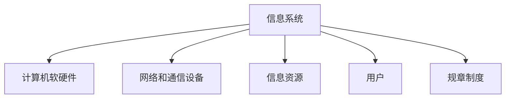
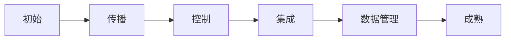
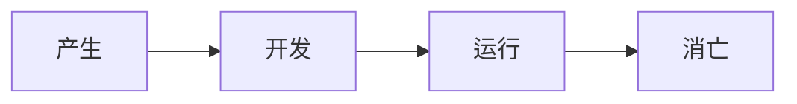
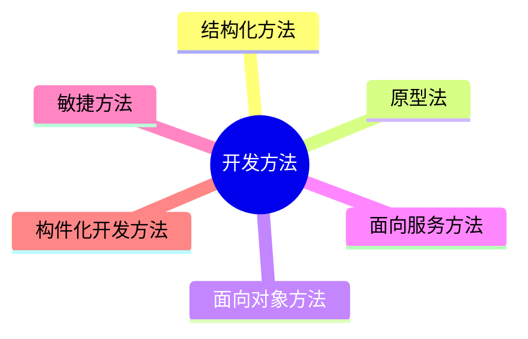
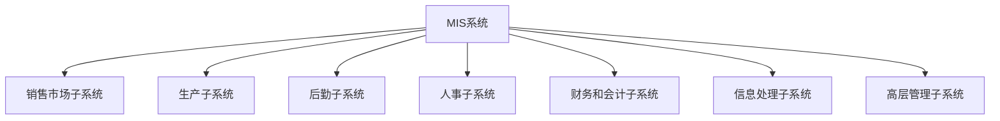
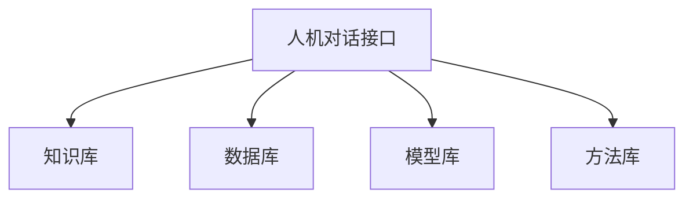
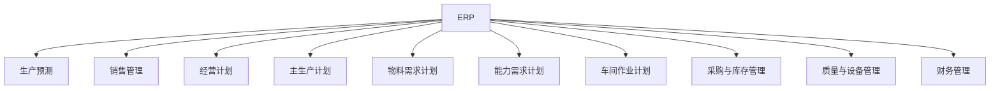
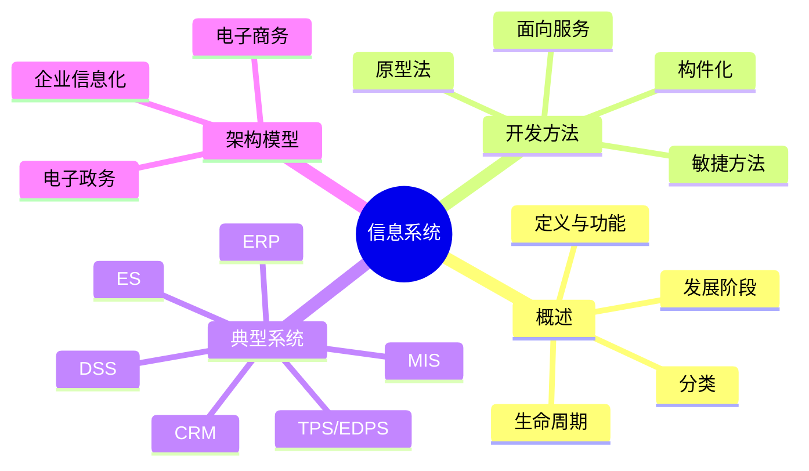

# 信息系统

!!! abstract "本章导读"
    信息系统是软考架构师考试的重要内容，涵盖信息系统概述、开发方法、典型应用和架构模型等核心知识点。本章将系统梳理企业信息化的知识体系，帮助考生理解各类信息系统的特点和应用场景。

    **学习目标**：
    
    - 掌握信息系统的定义、分类和生命周期
    - 理解各种开发方法的特点和适用场景
    - 熟悉 ERP、CRM、DSS 等典型信息系统的功能
    - 了解电子政务和电子商务的基本模式

## 信息系统概述

### 信息系统的定义

信息系统是由**计算机软硬件、网络和通信设备、信息资源、用户和规章制度**组成的以处理信息流为目的的人机一体化系统。

### 信息系统的功能

信息系统的五大功能：

| 功能 | 说明 |
|:---:|:---|
| **输入** | 收集和录入数据 |
| **存储** | 保存数据和信息 |
| **处理** | 对数据进行加工处理 |
| **输出** | 将处理结果输出 |
| **控制** | 对整个过程进行控制 |

### 信息系统的发展阶段

理查德·诺兰（Richard L. Nolan）将信息系统的发展划分为 **6 个阶段**：

### 信息系统的分类

| 系统类型 | 说明 |
|:---:|:---|
| **业务（数据）处理系统** | 处理日常业务事务 |
| **管理信息系统** | 支持企业管理决策 |
| **决策支持系统** | 辅助高层决策 |
| **专家系统** | 模拟专家知识和经验 |
| **办公自动化系统** | 提高办公效率 |
| **综合性信息系统** | 集成多种功能 |

### 信息系统的生命周期

信息系统的生命周期分为 **4 个阶段**：

### 信息系统建设原则

- **高层管理人员介入原则**
- **用户参与开发原则**
- **自顶向下规划原则**
- **工程化原则**

## 信息系统的开发方法

### 开发方法概览

### 原型法

原型法也称快速原型法，通过快速建立系统模型与用户交流。

=== "按实现功能划分"

    | 类型 | 说明 | 应用场景 |
    |:---:|:---|:---|
    | **水平原型** | 行为原型，细化需求但未实现功能 | 界面设计 |
    | **垂直原型** | 结构化原型，实现了部分功能 | 复杂算法实现 |

=== "按最终结果划分"

    | 类型 | 说明 | 应用场景 |
    |:---:|:---|:---|
    | **抛弃式** | 探索式原型，解决需求不确定性 | 需求澄清 |
    | **演化式** | 逐步演化为最终系统 | Web 项目 |

### 构件化开发方法

构件（Component）是基于分布对象技术的可复用软件模块。

#### 构件的获取方式

1. 从现有构件中获得，直接使用或作适应性修改
2. 通过遗留工程提取具有潜在复用价值的构件
3. 从市场上购买商业构件
4. 开发新的构件

#### 构件的分类方式

| 分类方法 | 说明 |
|:---:|:---|
| **关键字分类法** | 按从抽象到具体的顺序组织为树型或有向无回路图结构 |
| **刻面分类法** | 定义若干"刻面"来描述构件特征（功能、数据、语境等） |
| **超文本方法** | 用网状链接方式连接构件说明文档，支持浏览式检索 |

### 面向服务的方法

面向服务的方法是在面向对象方法基础上发展而来，将接口的定义与实现解耦，催生了服务和面向服务（SO）的开发方法。重点关注**面向服务的架构（SOA）**。

### 敏捷方法

敏捷方法是以人为核心、迭代、循序渐进的开发方法。

#### 敏捷方法的核心特点

1. **适应型**而非预设型：欢迎变化，适应变化
2. **面向人的**而非面向过程的：发挥人的创造能力
3. **迭代增量式**的开发过程

## 典型信息系统

### TPS 和 EDPS

**业务处理系统（TPS）** 或**电子数据处理系统（EDPS）** 是信息化的典型应用。

| 特点 | 说明 |
|:---:|:---|
| 地位 | 最初级形式，也是基础和桥梁 |
| 开发方法 | 常用结构化生命周期法 |
| 处理过程 | 输入、处理、输出（IPO） |
| 处理方式 | 批处理（Batch）或联机事务处理（OLTP） |

数据处理周期的 **5 个阶段**：数据输入 → 数据处理 → 数据库维护 → 文件报表生成 → 查询处理

### 管理信息系统（MIS）

管理信息系统（MIS）是在 TPS 基础上发展的高度集成化的人机信息系统。

#### MIS 的 7 个子系统

!!! info "供应链信息流"
    供应链中的信息流覆盖从供应商、制造商到分销商、零售商的所有环节，分为**需求信息流**和**供应信息流**两种不同流向。

### 决策支持系统（DSS）

决策支持系统（DSS）用于支持管理者进行半结构化或非结构化决策。

#### DSS 的特征

- 数据和模型是 DSS 的主要资源
- 用来支援用户作决策
- 主要用于解决**半结构化及非结构化**问题
- 作用在于提高决策的**有效性**而不是效率

#### DSS 的四库一接口

### 专家系统（ES）

专家系统（ES）是使用知识与推理过程，求解需要专家知识才能解决的高难度问题的智能计算机程序。

| 比较项 | 专家系统 | 一般计算机系统 |
|:---:|:---|:---|
| 功能 | 解决问题、解释结果、进行判断与决策 | 解决问题 |
| 处理能力 | 处理数字与符号 | 处理数字 |
| 问题种类 | 半结构/非结构性，可处理不确定知识 | 结构性，处理确定知识 |

!!! tip "专家系统核心"
    **推理机和知识库**一起构成专家系统的核心。

### 企业资源规划（ERP）

ERP 集成了企业的**三大流**：**物流、资金流和信息流**。

#### ERP 的 11 个基本模块

#### ERP 的功能

- 支持决策
- 不同行业的针对性 IT 解决方案
- 提供全行业和跨行业的供应链

### 客户关系管理系统（CRM）

CRM 系统通过信息技术帮助企业构建良好的客户关系。

#### CRM 的主要模块

| 模块 | 说明 |
|:---:|:---|
| **销售自动化** | 最基本的模块 |
| **营销自动化** | 销售自动化的补充，包括营销计划的编制和执行 |
| **客户服务与支持** | 重要功能，主要手段是呼叫中心和互联网 |
| **商业智能** | 数据分析和决策支持 |

!!! warning "高频考点"
    CRM 是通过将**人力资源、业务流程与专业技术**进行有效整合，为企业涉及客户的各个领域提供集成。

### 企业门户分类

| 门户类型 | 重点 |
|:---:|:---|
| **企业信息门户** | 提供统一入口访问结构和非结构数据 |
| **企业知识门户** | 创造、搜集和传播企业知识的平台 |
| **企业应用门户** | 提高集中贸易能力、协同能力和信息管理能力 |

## 典型信息系统架构模型

### 电子政务（EG）

电子政务是利用信息技术实现公务、政务、商务、事务一体化管理的系统工程。

#### 行为主体

- **政府（Government）**
- **企（事）业单位（Business）**
- **居民（Citizen）**

#### 电子政务模式

| 模式 | 说明 |
|:---:|:---|
| **G2G** | 政府对政府，包括政府内部政务活动、政府间通信等 |
| **G2B** | 政府对企业，发布政策法规、颁发营业执照等 |
| **G2C** | 政府对居民，提供公共服务、处理公共事务等 |
| **B2G** | 企业对政府，缴税、提交报表、竞标投标等 |
| **C2G** | 居民对政府，缴税缴费、上报信息、申请补助等 |

### 企业信息化（EI）

企业信息化是企业利用现代信息技术，实现经营活动的自动化、便捷化、网络化和智能化的过程。

#### 企业信息化的方法

| 方法 | 说明 |
|:---:|:---|
| **业务流程重构方法** | 重新设计组织结构和工作方法 |
| **核心业务应用方法** | 围绕核心业务应用信息技术 |
| **信息系统建设方法** | 构建企业信息系统 |
| **主题数据库方法** | 建立主题数据库 |
| **资源管理方法** | ERP、SCM 等 |
| **人力资本投资方法** | 把优秀员工看作投资 |

#### 企业信息集成

按集成内容分为四个方面：

1. **技术平台集成**
2. **数据集成**
3. **应用系统集成**：实现不同系统之间的互操作
4. **业务过程集成**：实现流程的协调运作

!!! warning "高频考点"
    企业信息集成（EAI）提供 4 个层次的服务（从下至上）：
    
    **通讯服务 → 信息传递与转化服务 → 应用连接服务 → 流程控制服务**

### 电子商务（EC）

电子商务是利用 Web 提供的通信手段在网上买卖产品或提供服务。

#### 电子商务模式

| 模式 | 说明 |
|:---:|:---|
| **B2B** | 企业对企业 |
| **B2C** | 企业对消费者 |
| **C2C** | 消费者对消费者 |
| **O2O** | 线上购买线下服务 |

#### 电子商务参与实体

电子商务参与实体有 **4 类**：

- **客户**（个人消费者或集团购买）
- **商户**（销售商、制造商、储运商）
- **银行**（发行和收单行）
- **认证中心**

## 本章小结

!!! tip "备考建议"
    1. **重点记忆**：信息系统 6 个发展阶段、DSS 四库一接口、ERP 三大流
    2. **理解概念**：原型法的分类、构件的获取方式
    3. **关注细节**：电子政务的各种模式、企业信息集成的层次
    4. **对比记忆**：专家系统 vs 一般计算机系统的区别
