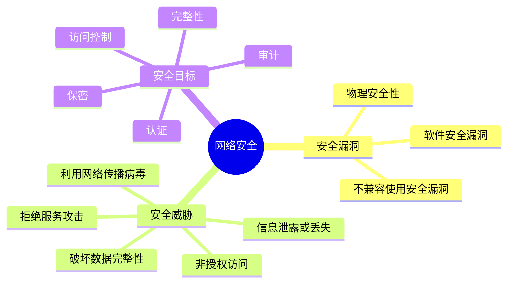
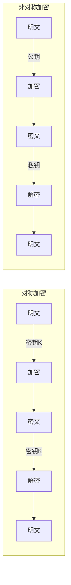
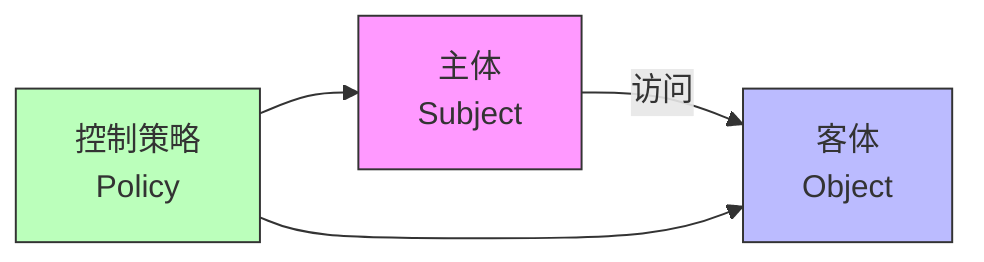
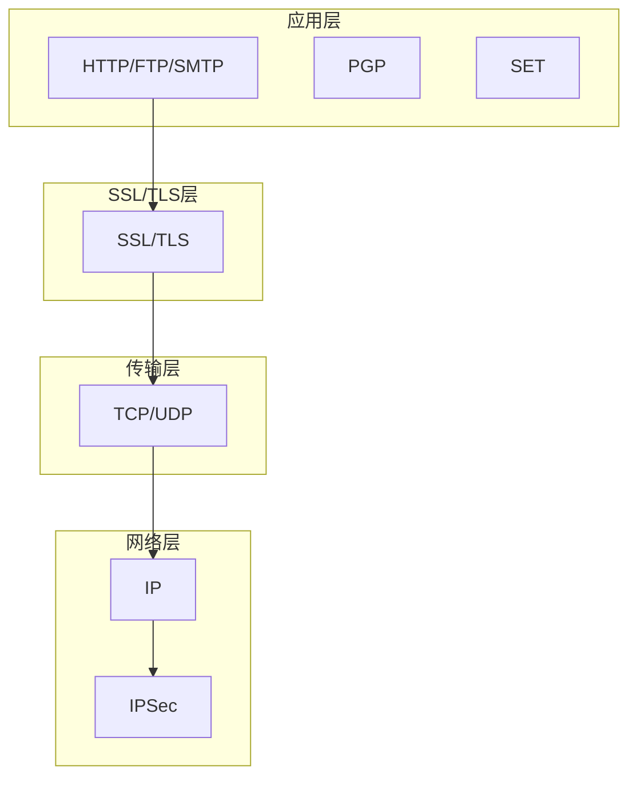
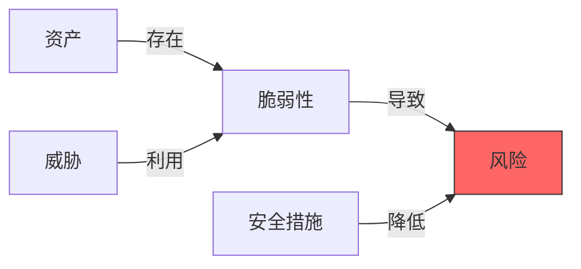
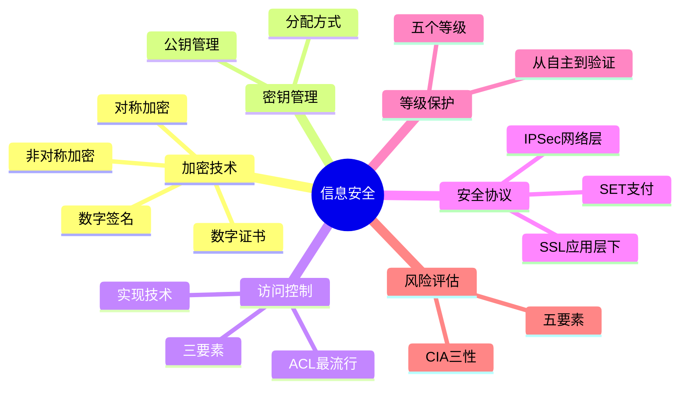

# 信息安全技术

!!! abstract "本章导读"
    信息安全是软考架构师考试的重要内容，涵盖加密技术、访问控制、安全协议和风险评估等核心知识点。本章将系统梳理信息安全的知识体系，帮助考生建立完整的安全架构思维。

    **学习目标**：
    
    - 掌握对称加密与非对称加密的区别和应用场景
    - 理解访问控制的三要素及实现技术
    - 熟悉数字签名的原理和条件
    - 了解常用安全协议的工作层次和特点
    - 掌握信息系统安全等级划分标准

## 信息安全基础

### 网络安全概述

网络安全是信息安全的核心组成部分，需要从多个维度进行防护。



!!! warning "高频考点"
    网络安全漏洞通常是指网络节点的**系统软件或应用软件在逻辑上的缺陷**。安全措施的目标包括**访问控制、认证、完整性、审计和保密**五个方面。

## 信息加解密技术

### 加密算法分类

| 类型 | 特点 | 代表算法 | 适用场景 |
|:---:|:---|:---|:---|
| **对称加密** | 加解密使用同一密钥，速度快 | AES、DES、3DES、IDEA | 大量数据加密 |
| **非对称加密** | 公钥加密、私钥解密，安全性高 | RSA、ECC、Elgamal、国密 SM2 | 密钥交换、数字签名 |
| **信息摘要** | 单向散列，不可逆 | MD5、SHA-1、SHA-256 | 完整性校验 |

### 加密体系对比



### 数字签名

数字签名是**公钥加密技术与数字摘要技术**的综合应用。

=== "签名条件"

    数字签名必须满足以下条件：
    
    - **可信**：签名可被验证
    - **不可伪造**：只有签名者能产生签名
    - **不可重用**：签名不能被复制到其他文档
    - **不可改变**：签名后的文档不能被修改
    - **不可抵赖**：签名者不能否认签名行为

=== "签名过程"

    ```mermaid
    sequenceDiagram
        participant A as 发送方
        participant B as 接收方
        
        A->>A: 1. 对文件做摘要（Hash）
        A->>A: 2. 用私钥对摘要签名
        A->>B: 3. 发送文件 + 签名
        B->>B: 4. 用公钥验证签名
        B->>B: 5. 对文件做摘要比对
    ```

=== "签名特点"

    - 基于对称密钥的签名：只能在**两方间**实现，需要仲裁人
    - 基于公钥算法的签名：可在**任意多方间**实现，不需要仲裁
    - **先摘要再签名**：提升速度，摘要泄露不影响文件保密

### 数字证书

!!! warning "高频考点"
    在 PKI 系统体系中：
    
    - **CA（Certificate Authority）**：证书机构，负责生成和签署数字证书
    - **RA（Registration Authority）**：注册机构，负责验证申请数字证书用户的身份

## 密钥管理技术

### 密钥分配方式

| 分配方式 | 说明 | 特点 |
|:---:|:---|:---|
| **物理方式** | 面对面交换 | 安全但不便 |
| **加密方式** | 用已有密钥加密新密钥 | 需要预共享密钥 |
| **第三方加密方式** | 通过 KDC 分配 | 需要信任中心 |

### 公钥管理方式

公钥加密体制的密钥管理有四种方式（安全性递增）：

1. **直接公开发布**：如 PGP，简单但易被冒充
2. **公用目录表**：集中管理，但目录易被攻击
3. **公钥管理机构**：在线查询，实时性好
4. **公钥证书**：离线验证，由 CA 签发

!!! info "考点拓展"
    **PGP（Pretty Good Privacy）** 是一种电子邮件加密软件，应用了多种密码技术（RSA、IDEA、数字签名等），是使用最广泛的电子邮件加密软件。

## 访问控制技术

### 访问控制三要素



访问控制包括三方面内容：**认证、控制策略实现和审计**。

!!! tip "审计的目的"
    审计的目的是**防止滥用权利**，通过记录和分析系统活动来检测安全违规行为。

### 访问控制实现技术

| 技术 | 原理 | 优点 | 缺点 |
|:---:|:---|:---|:---|
| **访问控制矩阵（ACM）** | 主体为行，客体为列 | 概念清晰，是其他技术的基础 | 主客体多时实现困难 |
| **访问控制表（ACL）** | 按**客体（列）**保存矩阵 | **目前最流行**，查询客体权限快 | 查询主体权限慢 |
| **能力表（Capabilities）** | 按**主体（行）**保存矩阵 | 查询主体权限快 | 查询客体权限慢 |
| **授权关系表** | 只保存非空元素 | 稀疏矩阵时高效 | 常用于安全数据库系统 |

!!! warning "高频考点"
    **访问控制表（ACL）** 是目前最流行、使用最多的访问控制实现技术。

## 信息安全的抗攻击技术

### 常见攻击类型

=== "拒绝服务攻击（DoS）"

    通过大量请求耗尽目标系统资源，使其无法正常提供服务。
    
    **防御措施**：流量清洗、负载均衡、限速策略

=== "欺骗攻击"

    !!! warning "ARP 攻击"
        ARP 攻击是针对以太网地址解析协议的攻击技术，攻击者可：
        
        - 获取局域网上的数据包
        - 篡改数据包
        - 使网络无法正常连接
        
        **造成无法跨网段通信的原因**：伪造网关 ARP 报文使数据包无法发送到网关

=== "端口扫描"

    探测目标主机开放的端口和服务，为进一步攻击做准备。

=== "系统漏洞扫描"

    自动检测系统中存在的已知漏洞，可用于安全评估或恶意攻击。

## 信息安全保障体系

### 等级保护标准

《计算机信息系统 安全保护等级划分准则》（GB 17859—1999）规定了**五个安全保护等级**：

| 等级 | 名称 | 对应 TCSEC | 说明 |
|:---:|:---|:---:|:---|
| **第 1 级** | 用户自主保护级 | C1 | 最低级别，用户自主保护 |
| **第 2 级** | 系统审计保护级 | C2 | 增加审计功能 |
| **第 3 级** | 安全标记保护级 | B1 | 强制访问控制 |
| **第 4 级** | 结构化保护级 | B2 | 形式化安全模型 |
| **第 5 级** | 访问验证保护级 | B3 | 最高级别，全面验证 |

!!! tip "记忆技巧"
    等级保护从低到高：**自主 → 审计 → 标记 → 结构化 → 验证**

### 安全保密技术

| 技术 | 全称 | 作用 |
|:---:|:---|:---|
| **DLP** | Data Leakage Prevention | 防止企业数据以违反安全策略的形式流出 |
| **数字水印** | Digital Watermark | 在数字媒体中嵌入特定标记，分为可感知和不易感知两种 |

## 安全协议

### 常用安全协议对比

| 协议 | 工作层次 | 主要用途 | 特点 |
|:---:|:---:|:---|:---|
| **SSL/TLS** | 应用层与 TCP 层之间 | 安全通信 | 提供保密性、身份认证、可靠性通信 |
| **PGP** | 应用层 | 电子邮件加密 | 综合使用 RSA、IDEA、数字签名 |
| **IPSec** | **网络层** | 网络层安全 | 透明性好，不需更改应用程序 |
| **SET** | 应用层 | 信用卡支付 | 解决用户、商家、银行间的支付安全 |
| **HTTPS** | 应用层 | Web 安全传输 | HTTP + SSL/TLS，使用 443 端口 |

!!! warning "高频考点"
    - **SSL** 协议介于**应用层和 TCP 层之间**
    - **IPSec** 是工作在**网络层**的安全协议，主要优点是**透明性**
    - **SET** 协议主要用于**信用卡支付**场景

### 安全协议层次图



## 信息系统安全风险评估

### 风险评估要素



| 要素 | 说明 |
|:---:|:---|
| **资产** | 需要保护的对象，包括硬件、软件、数据、服务等 |
| **脆弱性** | 资产本身存在的弱点，也包括未正确实施的安全措施 |
| **威胁** | 对机构及其资产构成潜在破坏的可能性因素或事件 |
| **风险** | 安全事件发生的概率和可能造成的影响 |
| **安全措施** | 用于降低风险的技术和管理手段 |

!!! info "风险评估定义"
    风险评估是对信息系统及由其处理、传输和存储的信息的**保密性、完整性和可用性**等安全属性进行科学评价的过程，是信息安全保障体系建立过程中重要的评价方法和决策机制。

## 本章小结



!!! tip "备考建议"
    1. **重点掌握**：加密算法分类、访问控制技术、安全协议工作层次
    2. **理解原理**：数字签名的过程和条件
    3. **记忆要点**：等级保护五个级别、风险评估五要素
    4. **关注细节**：ACL 是最流行的访问控制技术、IPSec 的透明性特点
