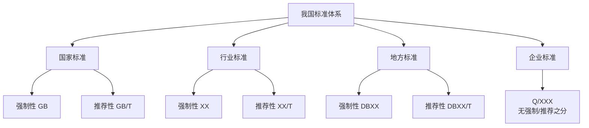
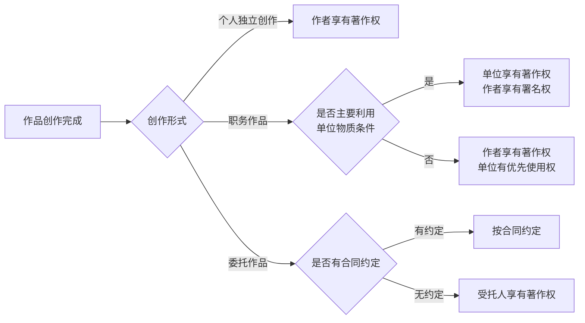
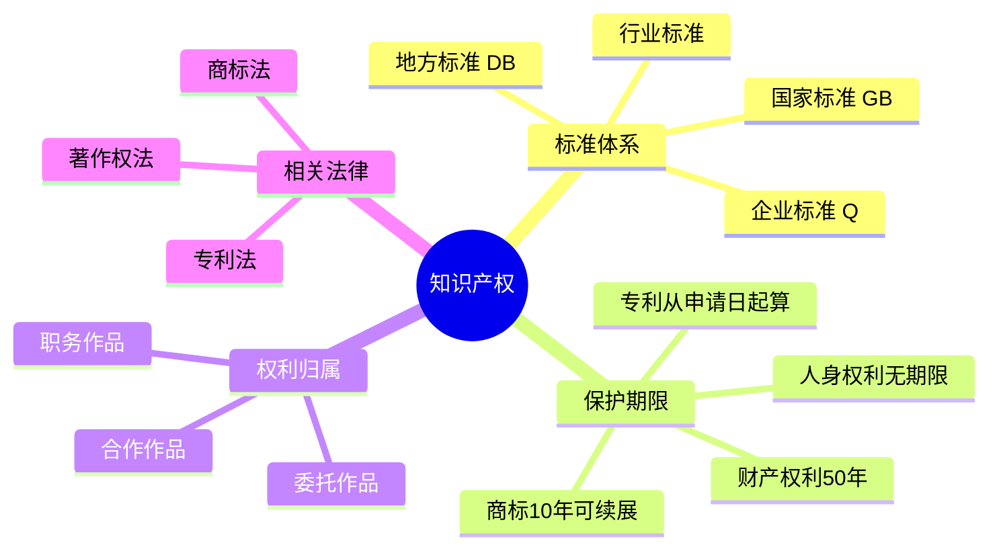

# 知识产权

!!! abstract "本章导读"
    知识产权是软考架构师考试中的必考内容，虽然分值不高但题目相对固定，属于"送分题"范畴。本章涵盖标准分类、知识产权保护期限、权利归属以及相关法律法规等核心知识点。

    **学习目标**：
    
    - 掌握我国标准的四级分类体系及其代号
    - 熟记各类知识产权的保护期限
    - 理解知识产权归属的判定规则
    - 了解著作权、专利权、商标权的基本概念

## 我国标准体系

我国标准分为**国家标准、行业标准、地方标准和企业标准**四类，形成了层次分明的标准化体系。

### 标准分类详解

| 标准类型 | 制定机构 | 代号格式 | 编号示例 |
|:---:|:---|:---|:---|
| **国家标准** | 国务院标准化行政主管部门 | 强制性：GB 推荐性：GB/T | GB 8567-1988 |
| **行业标准** | 国务院各有关行政主管部门 | 强制性：XX 推荐性：XX/T | HB 6698-1993 |
| **地方标准** | 省、自治区、直辖市标准化行政主管部门 | 强制性：DBXX 推荐性：DBXX/T | DB11 XXX-XXXX |
| **企业标准** | 企业自行组织制定 | Q/XXX | Q/XXX XXXX-XXXX |

!!! warning "高频考点"
    - **GJB** 为中华人民共和国国家军用标准代号
    - 常见行业标准代号：QJ（航天）、SJ（电子）、JB（机械）、JR（金融）、HB（航空）
    - 企业标准**没有**强制性和推荐性之分，一经制定即对整个企业具有约束性

## 知识产权保护期限

!!! tip "记忆技巧"
    - **人身权利（署名权、修改权等）**：无期限限制
    - **财产权利**：有期限，通常为 50 年或作者终生 +50 年
    - **专利权从申请日起算**，商标权有效期 10 年可续展

### 保护期限一览表

| 客体类型 | 权利类型 | 保护期限 |
|:---:|:---|:---|
| **公民作品** | 署名权、修改权、保护作品完整权 | **无限制** |
| | 发表权、使用权和获得报酬权 | 作者终生及其死后 **50 年**（第 50 年的 12 月 31 日） |
| **单位作品** | 发表权、使用权和获得报酬权 | **50 年**（首次发表后第 50 年的 12 月 31 日），若期间未发表则不保护 |
| **公民软件作品** | 署名权、修改权 | **无限制** |
| | 发表权、复制权、发行权、出租权、信息网络传播权、翻译权、使用许可权、获得报酬权、转让权 | 作者终生及其死后 **50 年**（合作开发的，以最后死亡作者为准） |
| **单位软件作品** | 发表权、复制权等财产性权利 | **50 年**（首次发表后第 50 年的 12 月 31 日），若期间未发表则不保护 |
| **注册商标** | 商标专用权 | 有效期 **10 年**（期满后 6 个月内必须续注）|
| **发明专利权** | 专利权 | **20 年**（从**申请日**开始） |
| **实用新型和外观设计专利权** | 专利权 | **10 年**（从**申请日**开始） |
| **商业秘密** | - | 不确定，公开后公众可用 |

!!! warning "高频考点"
    - 专利权保护期限从**申请日**开始计算，而非授权日
    - 注册人死亡或倒闭 **1 年后**，商标未转移则可注销
    - 单位作品若在保护期内**未发表**，则不受保护

## 知识产权的归属

### 归属判定原则

### 特殊情形

=== "职务作品"

    - **一般职务作品**：著作权归作者，单位有权在业务范围内优先使用
    - **特殊职务作品**：主要利用单位物质技术条件创作的，著作权归单位，作者享有署名权

=== "委托作品"

    - 有合同约定的，按合同执行
    - 无约定的，著作权归**受托人**（创作者）

=== "合作作品"

    - 可分割使用的，各作者对各自部分享有著作权
    - 不可分割的，共同享有，协商一致行使

!!! info "考点拓展"
    **在先权利**包括：著作权、外观设计专利权、商号权、地理标志权、姓名权等。即使未注册商标，他人也不得侵犯这些在先权利。

## 著作权法要点

### 侵权判定

以下行为构成**侵权**：

- 未经著作权人同意而发表或登记其软件作品
- 将他人软件当作自己的作品发表或登记
- 未经合作者同意将共同开发的软件当作自己的作品发表或登记
- 在他人开发的软件上署名或更改他人署名
- 未经许可，修改、翻译、复制、发行、出租、转让或通过网络传播其作品

### 非侵权判定

!!! success "合理使用"
    为了**学习和研究**软件内含的设计思想和原理，通过安装、显示、传输或存储软件的方式使用软件时，可以**不经许可、不支付报酬**。

### 权利转移规则

| 情形 | 著作权归属 | 说明 |
|:---|:---|:---|
| 美术作品原件转让 | 著作权**不转移** | 受让人仅获得物的所有权和展览权 |
| 未发表作品转让 | 发表权视为已行使 | 发表权是一次性权利 |
| 许可他人使用未发表作品 | 推定同意发表 | 发表权随财产权转移 |

!!! warning "高频考点"
    **发表权是一次性权利**，行使一次后即不再享有。第一次出版、表演、上网公布等都属于行使发表权。

## 专利法要点

### 专利类型对比

| 类型 | 保护期限 | 保护对象 | 特点 |
|:---:|:---:|:---|:---|
| **发明专利** | 20 年 | 产品、方法或改进 | 创造性要求最高 |
| **实用新型** | 10 年 | 产品的形状、构造 | 又称"小发明" |
| **外观设计** | 10 年 | 产品的外观 | 美学与实用结合 |

## 商标法要点

### 商标权特点

- **注册原则**：我国商标权的取得实行注册原则，未注册商标不受法律保护
- **地域性**：按照一国法律获得的商标权，只在该国发生法律效力
- **许可使用**：商标权人可以通过许可合同授权他人使用

!!! info "驰名商标特殊保护"
    驰名商标享有跨类保护，即使在不同类别的商品上，也不能使用与驰名商标相同或类似的标识。

## 知识产权的地域性

!!! warning "高频考点"
    知识产权具有**地域性**特征：
    
    - 按照一国法律获得的知识产权，**只在该国**发生法律效力
    - 其他国家对这种权利没有保护义务
    - 通过缔结**国际公约**，成员国相互保护对方国民的知识产权
    - 是否授予权利、如何保护权利，仍须由各成员国**按照其国内法**决定

## 本章小结

!!! tip "备考建议"
    1. **重点记忆**：保护期限的数字（50年、20年、10年）及起算时间点
    2. **理解区分**：署名权（无期限）vs 财产权（有期限）
    3. **关注细节**：专利从"申请日"起算，商标续展期限为"6个月"
    4. **历年真题**：多做真题，该考点出题模式相对固定
