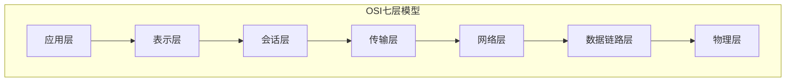
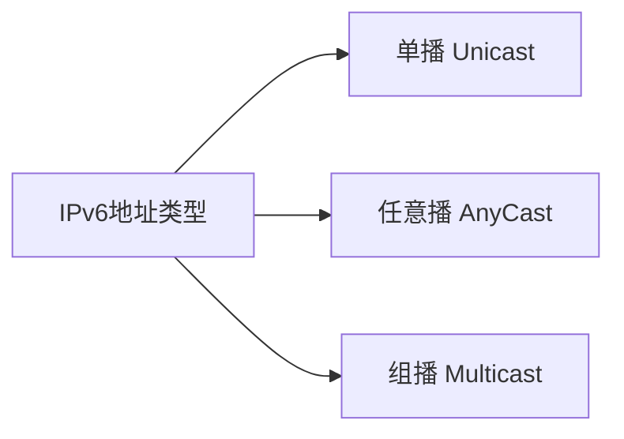
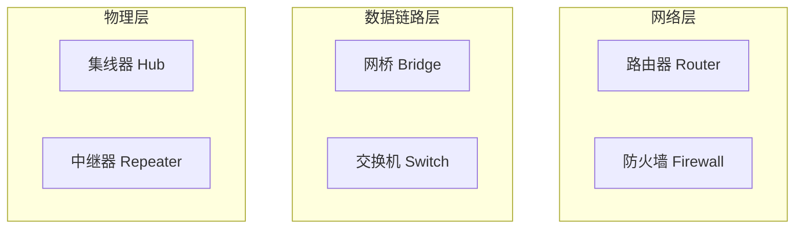
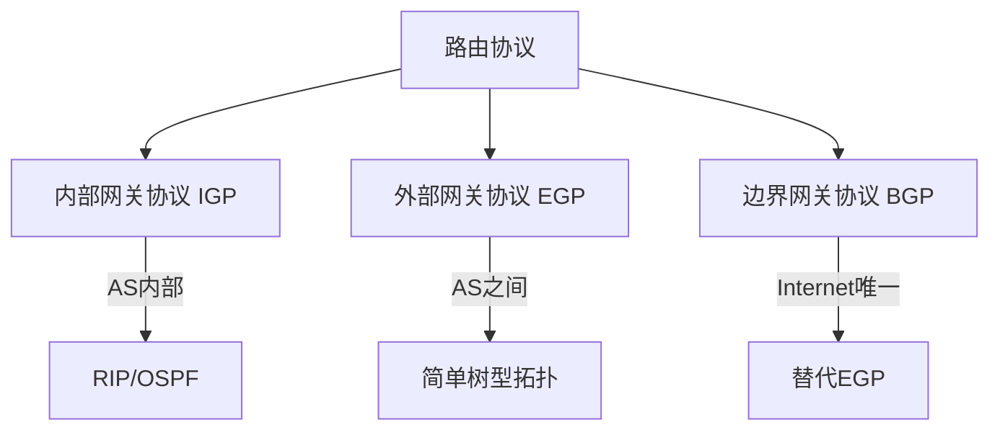
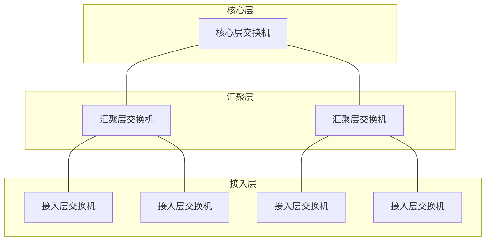
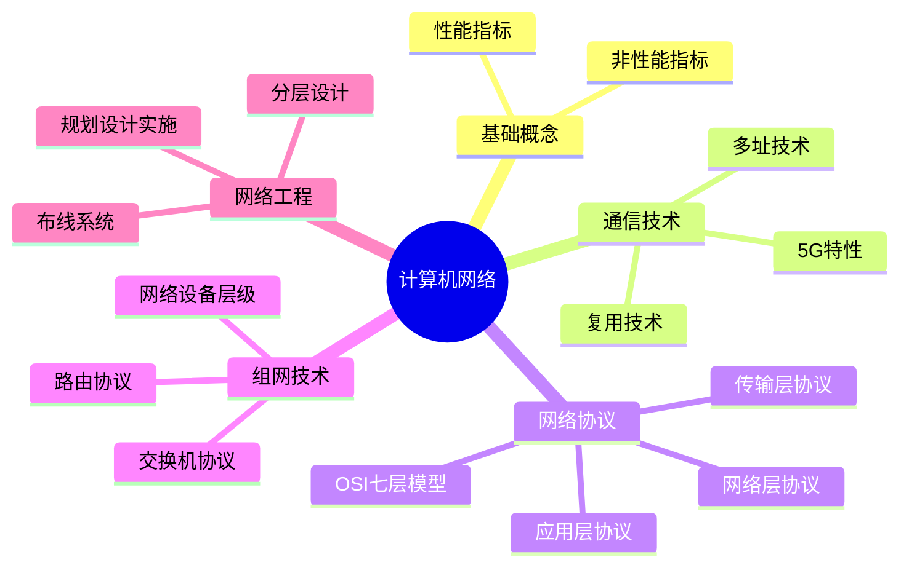

# 计算机网络

!!! abstract "本章导读"
    计算机网络是软考架构师考试的重点内容，涵盖网络基础概念、通信技术、网络协议、组网技术和网络工程等核心知识点。本章将系统梳理网络知识体系，帮助考生建立完整的网络架构思维。

    **学习目标**：
    
    - 掌握 OSI/RM 七层模型及各层功能
    - 理解 TCP/IP 协议栈中常用协议的工作原理
    - 熟悉网络设备的工作层次和主要功能
    - 了解网络工程的设计原则和分层架构

## 网络的基本概念

### 网络指标分类

| 指标类型 | 度量内容 |
|:---:|:---|
| **性能指标** | 速率、带宽、吞吐量、时延 |
| **非性能指标** | 费用、质量、标准化、可靠性、可扩展性、可升级性、易管理性、可维护性 |

## 通信技术

### 数据与信道

| 概念 | 说明 |
|:---:|:---|
| **信道** | 信号传输的通道，分为逻辑信道和物理信道 |
| **逻辑信道** | 数据发送端和接收端之间的虚拟线路，可有连接或无连接 |
| **物理信道** | 逻辑信道的载体 |

### 复用技术与多址技术

| 技术 | 说明 | 类型 |
|:---:|:---|:---|
| **复用技术** | 在一条信道上同时传输**多路数据** | TDM（时分）、FDM（频分）、CDM（码分） |
| **多址技术** | 在一条线上同时传输**多个用户数据** | TDMA、FDMA、CDMA |

!!! tip "形象理解"
    - **复用技术**：一条路上行驶多辆货车
    - **多址技术**：一辆车上的货物属于不同用户

### 5G 通信网络

5G 作为新一代移动通信技术，具有以下特点：

- **高速率**：峰值速率可达 20Gbps
- **低时延**：端到端时延低于 1ms
- **高接入**：每平方公里可接入百万级设备

## 网络协议体系

### OSI/RM 七层模型

| 层次 | 功能 | 关键词 |
|:---:|:---|:---|
| **应用层** | 处理网络应用，提供用户接口 | 用户服务 |
| **表示层** | 数据编码、加密，使不同终端可互通 | 数据格式 |
| **会话层** | 管理远程用户进程间通信，安全验证 | 会话管理 |
| **传输层** | 端到端数据透明传送，无差错、按顺序 | 端到端 |
| **网络层** | 路由选择、阻塞控制、网络诊断 | 路由选择 |
| **数据链路层** | 帧控制、误差检测、流量控制 | 帧传输 |
| **物理层** | 物理链路的电气、功能、机械特性 | 比特流 |

### 应用层协议

=== "文件传输协议"

    | 协议 | 传输层 | 端口 | 特点 |
    |:---:|:---:|:---:|:---|
    | **FTP** | TCP | 21（控制）、20（数据） | 可靠传输，需建立两条连接 |
    | **TFTP** | UDP | 69 | 简单、开销小，超时重传保证到达 |

=== "Web 协议"

    | 协议 | 端口 | 特点 |
    |:---:|:---:|:---|
    | **HTTP** | 80 | 超文本传输协议，基于 TCP |
    | **HTTPS** | 443 | HTTP + SSL/TLS，传输加密和身份认证 |

=== "网络配置协议"

    **DHCP（动态主机配置协议）**
    
    - 集中管理、动态分配 IP 地址
    - 客户端可获取：IP 地址、网关地址、DNS 服务器地址
    - 多个 DHCP 服务器时，客户端只响应**第一个** OFFER 报文

=== "域名系统"

    **DNS（Domain Name System）**
    
    - 将域名解析为 IP 地址
    - **PTR 记录**：将 IP 地址映射到域名

    | 查询方式 | 特点 |
    |:---:|:---|
    | **递归查询** | 服务器彻底进行名字解析，返回最终结果 |
    | **迭代查询** | 返回其他服务器的引用，本地服务器继续查询 |

    !!! warning "高频考点"
        根域名服务器为众多请求提供域名解析，若采用**递归方式会大大影响性能**，因此通常采用迭代查询。

### 传输层协议

| 协议 | 特点 | 适用场景 |
|:---:|:---|:---|
| **TCP** | 可靠、面向连接；差错校验和重传、流量控制、拥塞控制 | 数据量少、可靠性要求高 |
| **UDP** | 不可靠、无连接；速度快 | 数据量大、速度要求高、可靠性要求低 |

!!! info "TCP 流量控制"
    TCP 采用**可变大小的滑动窗口协议**进行流量控制。
    
    - **前向纠错**：接收端检测到错误后，根据纠错编码的规律自行纠错
    - **后向纠错**：接收方请求发送方重发出错分组

### 网络层协议

#### IPv6 特性

IPv6 被称为"下一代互联网协议"，相比 IPv4 有以下改进：

| 改进点 | 说明 |
|:---:|:---|
| **地址长度** | 从 32 位增加到 **128 位** |
| **分组头简化** | 字段从 12 个降到 8 个，路由器处理字段从 6 个降到 4 个 |
| **扩展头支持** | 选项不再集成在分组头中，按需插入 |
| **流标记能力** | 可对特定分组进行特别处理，支持 QoS |
| **地址自动配置** | 简化网络地址管理 |

#### IPv6 地址类型

!!! warning "高频考点"
    IPv6 地址分配到**接口**，而不是分配给节点。一个接口可以被赋予多个地址（单播、任意播、组播）。

#### IPv4 到 IPv6 过渡技术

| 技术 | 说明 |
|:---:|:---|
| **双协议栈技术** | 设备同时支持 IPv4 和 IPv6 |
| **隧道技术** | 将 IPv6 报文封装在 IPv4 中传输 |
| **NAT-PT 技术** | 网络地址转换/协议转换 |

## 组网技术

### 网络设备及工作层级

| 设备 | 工作层级 | 主要功能 |
|:---:|:---:|:---|
| **集线器、中继器** | 物理层 | 信号放大、延长传输距离 |
| **网桥、交换机** | 数据链路层 | MAC 地址学习、帧转发 |
| **路由器、防火墙** | 网络层 | 路由选择、访问控制 |

### 交换机

#### 交换机功能

- 集线功能
- 中继功能
- 桥接功能
- **隔离冲突域功能**

#### 交换机协议

| 协议 | 功能 |
|:---:|:---|
| **生成树协议（STP）** | 解决链路环路问题 |
| **链路聚合协议** | 提升端口带宽、提高链路可靠性 |

### 路由器

#### 路由器功能

- 异种网络互连
- 子网协议转换
- 数据路由
- 速率适配
- 隔离网络
- 报文分片和重组
- 备份和流量控制

#### 路由协议

| 协议 | 全称 | 说明 |
|:---:|:---|:---|
| **IGP** | Interior Gateway Protocol | 在一个自治系统（AS）内运行 |
| **EGP** | Exterior Gateway Protocol | AS 之间的路由协议，为简单树型拓扑设计 |
| **BGP** | Border Gateway Protocol | Internet 上**唯一**的网关协议，替代 EGP |

## 网络工程

### 结构化布线系统

!!! warning "高频考点"
    结构化布线系统分为**六个子系统**：
    
    1. **工作区子系统**
    2. **水平子系统**
    3. **干线（垂直）子系统**：建筑的信息交通枢纽
    4. **设备间子系统**
    5. **管理子系统**
    6. **建筑群子系统**

### 网络建设工程

#### 网络规划

网络规划以**需求为导向**，兼顾技术和工程可行性。

网络需求分析包括：

- 网络总体需求分析
- 综合布线需求分析
- 网络可用性与可靠性分析
- 网络安全性需求分析
- **工程造价估算**

#### 网络设计

| 设计类型 | 内容 |
|:---:|:---|
| **逻辑设计** | 网络结构设计、技术选型、IP 地址和路由设计、冗余设计、安全设计 |
| **物理设计** | 布线设计、机房设计、设备选型 |

!!! warning "高频考点"
    网络系统生命周期的 5 个阶段（按顺序）：
    
    **需求规范 → 通信规范 → 逻辑网络设计 → 物理网络设计 → 实施阶段**

#### 网络冗余设计

| 设计方式 | 目的 |
|:---:|:---|
| **备用路径** | 主路径失效时启用 |
| **负载分担** | 并行链路提供流量分担，减轻主路径负担 |

### 分层设计

网络设计一般采用分层方式，分为**接入层、汇聚层、核心层**。

| 层次 | 主要功能 | 设计要点 |
|:---:|:---|:---|
| **接入层** | 用户接入、地址认证、用户管理、信息收集 | 提供足够带宽满足用户互访需求 |
| **汇聚层** | 访问策略控制、数据包处理、过滤、寻址 | 是否设置取决于网络规模 |
| **核心层** | **高速转发通信**，提供可靠的骨干传输 | 双机冗余热备份，避免数据包过滤等特性 |

!!! warning "高频考点"
    - 核心层在逻辑上**只有一个**
    - 核心层交换机通常是**三层或三层以上**的交换机
    - **QoS 是核心层交换机提供的重要服务之一**
    - 设计时应**首先设计接入层**，再依次完成上层设计
    - 接入层可以使用**集线器代替交换机**

### 层次化设计原则

1. 控制层次化程度，一般**三个层次**足够
2. 接入层应**严格控制**网络结构
3. 不能随意加入**额外连接**（打破层次性的连接）
4. **首先设计接入层**，再依次完成上层设计
5. 除接入层外，应尽量采用**模块化方式**

## 本章小结

!!! tip "备考建议"
    1. **重点记忆**：OSI 七层模型及各层功能、网络设备工作层级
    2. **理解原理**：TCP 与 UDP 的区别、DNS 递归与迭代查询
    3. **关注细节**：IPv6 的改进点、分层设计的原则
    4. **记住顺序**：网络生命周期 5 个阶段、分层设计的设计顺序
