# 软件工程

!!! abstract "本章导读"

    软件工程是系统架构师考试中分值最高的章节之一，涵盖软件开发全生命周期的理论与实践。本章系统讲解软件过程模型、需求工程、系统分析设计、软件测试和项目管理等核心内容，是通过考试的关键所在。

## 学习目标

通过本章学习，你应该能够：

- [x] 掌握各种软件过程模型的特点和适用场景
- [x] 理解需求工程的完整流程和方法
- [x] 熟练运用结构化和面向对象分析设计方法
- [x] 掌握 UML 各类图的用途和画法
- [x] 理解软件测试的策略和方法
- [x] 了解软件项目管理的基本概念

---

## 软件工程概述

### 基本概念

软件工程是应用计算机科学、数学及管理科学等原理，以 ==工程化== 的原则和方法来解决软件问题的工程，其目标是：

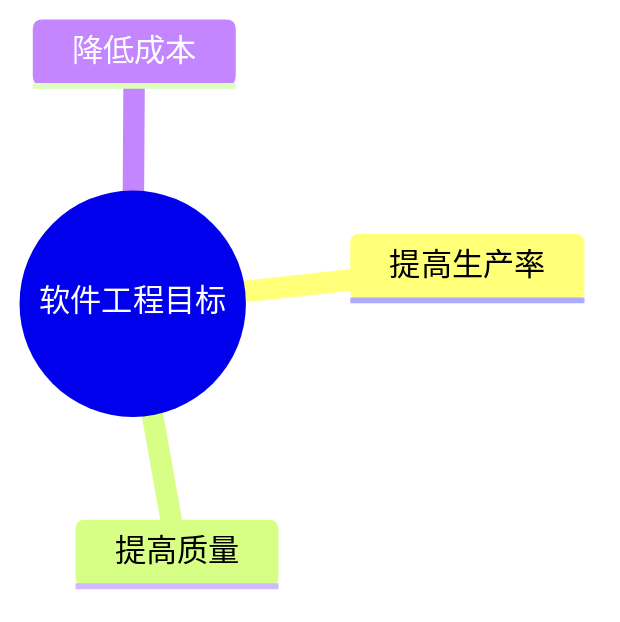

### 软件生命周期

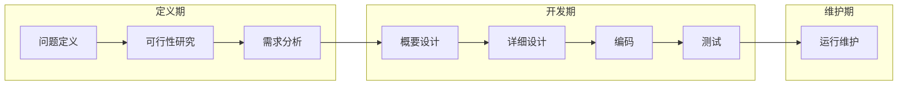

| 阶段 | 主要任务 | 产出物 |
|-----|---------|-------|
| **问题定义** | 明确要解决什么问题 | 问题定义报告 |
| **可行性研究** | 确定问题是否值得解决 | 可行性研究报告 |
| **需求分析** | 确定系统必须做什么 | 软件需求规格说明书(SRS) |
| **概要设计** | 确定系统如何实现（总体） | 概要设计说明书 |
| **详细设计** | 确定每个模块如何实现 | 详细设计说明书 |
| **编码** | 程序代码实现 | 源代码 |
| **测试** | 发现和修正错误 | 测试报告 |
| **维护** | 改正错误、适应变化 | 维护报告 |

### 软件设计四活动

软件设计包括四个既独立又相互联系的活动：

| 活动 | 内容 |
|-----|------|
| **数据设计** | 将数据模型转换为数据结构定义 |
| **体系结构设计** | 定义软件主要结构元素及其关系 |
| **接口设计** | 软件内部、外部及人机交互方式 |
| **过程设计** | 将结构元素转换为过程描述 |

---

## 软件过程模型

!!! warning "重点内容"

    软件过程模型是考试的高频考点，需要掌握每种模型的特点、优缺点和适用场景。

### 模型对比总览

| 模型 | 核心特点 | 适用场景 | 风险控制 |
|-----|---------|---------|---------|
| **瀑布模型** | 文档驱动、线性顺序 | 需求明确的项目 | 弱 |
| **原型模型** | 快速原型、用户参与 | 需求不明确 | 中 |
| **螺旋模型** | 风险驱动、迭代 | 大型高风险项目 | 强 |
| **增量模型** | 分批交付 | 需求可分解 | 中 |
| **喷泉模型** | 面向对象、迭代 | OO 开发 | 中 |
| **敏捷方法** | 人本、适应变化 | 需求变化快 | 中 |
| **RUP** | 用例驱动、架构中心 | 大型 OO 项目 | 强 |

### 瀑布模型

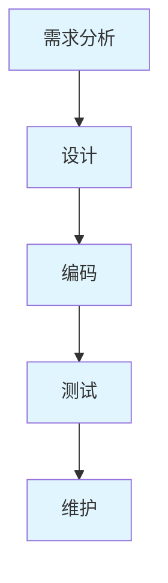

!!! info "特点"

    - 以 ==文档== 为驱动
    - 阶段间有明确的里程碑
    - 前一阶段输出是后一阶段输入
    - 各阶段工作不能并行

| 优点 | 缺点 |
|-----|------|
| 容易理解、成本低 | 需求难以一次确定 |
| 强调开发阶段性 | 变更代价高 |
| 早期计划和测试 | 结果难以预见 |

!!! tip "适用场景"

    需求非常明确且稳定的项目

### 原型模型

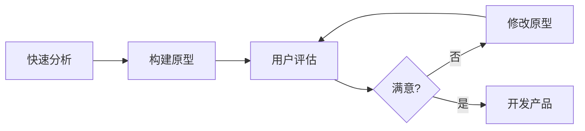

**原型分类**：

=== "按最终结果分"

    | 类型 | 说明 |
    |-----|------|
    | **抛弃型原型** | 用于需求确认后丢弃 |
    | **演化型原型** | 逐步完善成最终产品 |

=== "按实现深度分"

    | 类型 | 说明 |
    |-----|------|
    | **水平原型** | 功能导航，不实现功能（界面原型） |
    | **垂直原型** | 实现部分功能（算法验证） |

!!! tip "适用场景"

    需求不明确、经常变化、规模不太大的系统

### 螺旋模型

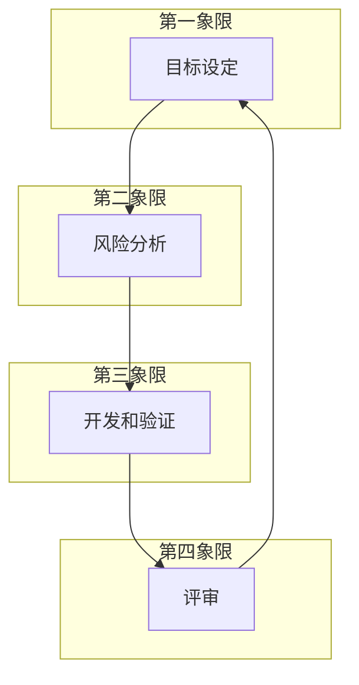

**四个活动**：

| 活动 | 内容 |
|-----|------|
| **目标设定** | 定义阶段目标和约束 |
| **风险分析** | 识别和评估风险 |
| **开发和验证** | 选择开发模型，开发产品 |
| **评审** | 评审本阶段，计划下一阶段 |

!!! warning "核心特点"

    螺旋模型是 ==风险驱动== 的，强调其他模型忽视的风险分析。

!!! tip "适用场景"

    庞大、复杂且有高风险的系统

### 增量模型

增量模型将需求分为一系列增量，每个增量独立开发和交付。

| 优点 | 缺点 |
|-----|------|
| 第一个版本成本时间少 | 初始增量可能不稳定 |
| 降低适应变更的成本 | 不利于模块整体划分 |
| 具有瀑布模型所有优点 | 需求划分有难度 |

!!! note "与原型模型的区别"

    增量模型的每个增量版本都是 ==可独立操作的产品==，而原型一般是为了演示。

### 喷泉模型

喷泉模型是以 ==用户需求为动力==、以 ==对象为驱动== 的模型，特别适合 ==面向对象== 的软件开发。

| 优点 | 缺点 |
|-----|------|
| 各阶段无明显界限 | 需要大量开发人员 |
| 可同步进行，提高效率 | 不利于项目管理 |
| | 审核难度加大 |

### 敏捷方法

!!! info "敏捷宣言核心理念"

    - **个体和交互** > 过程和工具
    - **可工作的软件** > 详尽的文档
    - **客户合作** > 合同谈判
    - **响应变化** > 遵循计划

#### 主要敏捷方法

| 方法 | 特点 |
|-----|------|
| **极限编程(XP)** | 高效、低风险、==测试先行== |
| **Scrum** | 侧重 ==项目管理==，Sprint 迭代 |
| **水晶方法** | 不同项目采用不同策略 |
| **FDD** | ==特征驱动==，首席程序员制 |

#### Scrum 框架

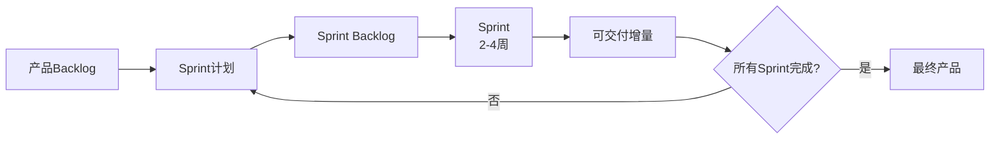

**Scrum 三个角色**：产品负责人、Scrum Master、开发团队

### RUP（统一过程）

RUP 是一种 ==重量级== 过程模型，属于构件化开发。

#### 四个阶段

| 阶段 | 主要任务 |
|-----|---------|
| **初始** | 建立业务模型，确定项目边界 |
| **细化** | 分析问题领域，建立架构，==消除最高风险== |
| **构造** | 开发所有构件，集成为产品 |
| **移交** | 确保软件对最终用户可用 |

#### 三大特点

!!! tip "RUP 核心特点"

    1. **用例驱动**：用例定义需求和验收标准
    2. **以架构为中心**：架构是系统设计的基础
    3. **迭代和增量**：每次迭代产生可执行版本

#### 4+1 视图

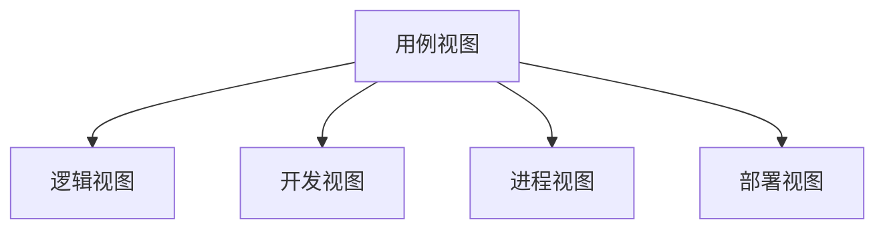

| 视图 | 关注者 | 关注点 | 常用图 |
|-----|-------|-------|-------|
| **用例视图** | 用户/需求方 | 系统功能 | 用例图 |
| **逻辑视图** | 最终用户 | 功能需求 | 类图、对象图、状态图 |
| **开发视图** | 程序员 | 软件模块组织 | 包图、组件图 |
| **进程视图** | 系统集成人员 | 性能、并发 | 活动图 |
| **部署视图** | 系统工程师 | 系统拓扑、部署 | 部署图 |

### 基于构件的开发(CBSD)

CBSD 利用预先包装的构件来构造应用系统。

**构件特征**：

| 特征 | 说明 |
|-----|------|
| 可组装性 | 通过公开接口交互 |
| 可部署性 | 独立运行在构件平台上 |
| 文档化 | 完全文档化 |
| 独立性 | 独立或显式声明依赖 |
| 标准化 | 符合构件模型标准 |

**主流构件模型**：

| 模型 | 提供方 |
|-----|-------|
| **Web Services** | W3C |
| **EJB** | Sun/Oracle |
| **.NET** | Microsoft |

---

## CMM/CMMI 成熟度模型

### CMM 五级

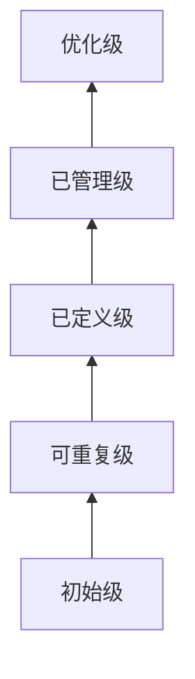

| 级别 | 特征 | 关键点 |
|-----|------|-------|
| **初始级** | 过程不可预测 | 依靠英雄人物 |
| **可重复级** | 基本项目管理 | 跟踪费用、进度、功能 |
| **已定义级** | 过程标准化 | 文档化、标准化 |
| **已管理级** | 量化管理 | 度量标准 |
| **优化级** | 持续改进 | 过程改进 |

### CMMI 特点

CMMI 提供两种表示方法：

| 表示法 | 关注点 | 级别 |
|-------|-------|-----|
| **阶段式** | 组织成熟度 | 5 个成熟度级别 |
| **连续式** | 过程域能力 | 6 个能力级别 |

---

## 需求工程

### 需求层次

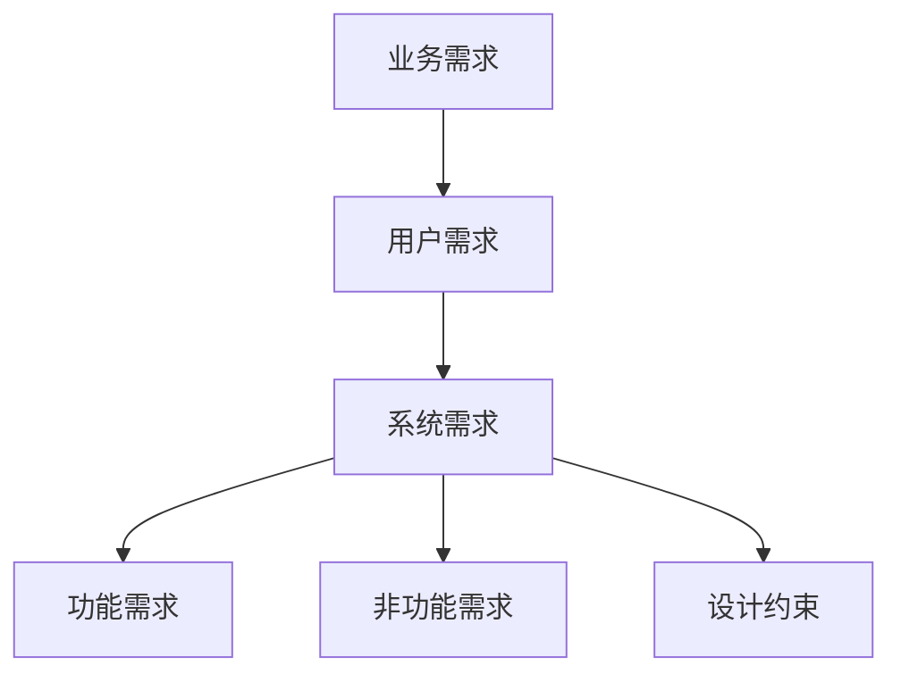

| 层次 | 描述 |
|-----|------|
| **业务需求** | 组织或客户的高层目标 |
| **用户需求** | 用户使用系统完成的任务 |
| **系统需求** | 系统必须实现的功能和特性 |

### 需求分类（QFD）

质量功能部署（QFD）将需求分为三类：

| 类型 | 说明 | 影响 |
|-----|------|------|
| **常规需求** | 用户明确期望的功能 | 实现越多越满意 |
| **期望需求** | 用户默认应有的功能 | 不实现会不满意 |
| **意外需求** | 超出用户期望的功能 | 实现会惊喜 |

### 需求工程过程

#### 需求获取方法

| 方法 | 特点 |
|-----|------|
| 用户面谈 | 直接沟通，深入了解 |
| 问卷调查 | 覆盖面广 |
| 现场观察 | 了解实际业务流程 |
| 原型化 | 帮助用户明确需求 |
| 头脑风暴 | 激发创意 |

#### 软件需求规格说明书(SRS)

SRS 是需求开发和需求管理之间的桥梁，包含：

- 功能需求
- 非功能需求
- 设计约束
- 过程约束

### 需求管理

需求管理包括 ==变更控制==、==版本控制== 和 ==需求跟踪==。

#### 需求变更管理

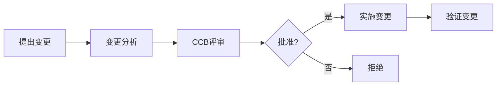

**CCB（变更控制委员会）** 是决策机构，不提出变更方案，只负责批准或拒绝。

#### 需求跟踪

需求跟踪矩阵用于：

- 确保所有需求都被实现
- 确保所有实现都有对应需求
- 分析变更影响

---

## 系统分析与设计

### 结构化方法

结构化方法又称为 ==面向功能== 或 ==面向数据流== 的方法。

#### 结构化分析(SA)

**数据流图(DFD)** 四要素：

| 元素 | 图形 | 说明 |
|-----|------|------|
| **外部实体** | 矩形 | 数据来源/去处 |
| **处理/加工** | 圆形 | 数据变换 |
| **数据存储** | 双线 | 数据保存 |
| **数据流** | 箭头 | 数据流动 |

!!! warning "DFD 规则"

    - 数据流必须与加工有关
    - 加工至少有一个输入流和一个输出流
    - 数据存储必须有流入和流出
    - 父图与子图数据流平衡

**DFD 异常**：

| 异常 | 描述 |
|-----|------|
| **黑洞** | 有输入无输出 |
| **奇迹** | 有输出无输入 |
| **灰洞** | 输入不足以产生输出 |

#### 结构化设计(SD)

SD 是 ==自顶向下、逐步求精、模块化== 的过程。

| 阶段 | 任务 |
|-----|------|
| **概要设计** | 确定系统结构，模块划分，接口定义 |
| **详细设计** | 设计每个模块的实现算法 |

##### 耦合与内聚

!!! tip "设计原则"

    ==高内聚、低耦合==

**耦合（从低到高）**：

| 类型 | 说明 |
|-----|------|
| 非直接耦合 | 无直接关系 |
| 数据耦合 | 传递简单数据 |
| 标记耦合 | 传递数据结构 |
| 控制耦合 | 传递控制信息 |
| 公共耦合 | 共享公共数据 |
| 内容耦合 | 直接访问内部数据 |

**内聚（从高到低）**：

| 类型 | 说明 |
|-----|------|
| 功能内聚 | 完成单一功能 |
| 顺序内聚 | 顺序执行，输出作为输入 |
| 通信内聚 | 操作同一数据结构 |
| 过程内聚 | 按特定次序执行 |
| 时间内聚 | 同一时间执行 |
| 逻辑内聚 | 逻辑相关的任务 |
| 偶然内聚 | 无关或松散关系 |

### 面向对象方法

#### OOA（面向对象分析）

OOA 模型包含 5 个层次和 5 个活动：

| 层次 | 活动 |
|-----|------|
| 主题层 | 定义主题 |
| 对象类层 | 标识对象类 |
| 结构层 | 标识结构 |
| 属性层 | 定义属性 |
| 服务层 | 定义服务 |

#### OOD（面向对象设计）

**三种类型的类**：

| 类型 | 说明 | 识别方法 |
|-----|------|---------|
| **实体类** | 存储信息，永久性 | 名词 |
| **控制类** | 控制用例工作流 | 动宾结构 |
| **边界类** | 封装交互信息 | 窗口、接口、协议 |

#### 设计原则

| 原则 | 说明 |
|-----|------|
| **开闭原则** | 对扩展开放，对修改关闭 |
| **里氏替换** | 子类可以替换父类 |
| **依赖倒置** | 依赖抽象而非具体 |
| **接口隔离** | 多个专用接口优于通用接口 |
| **最少知识** | 减少对象间交互 |
| **组合/聚合复用** | 优先使用组合而非继承 |

### UML 图

#### UML 关系

| 关系 | 符号 | 说明 |
|-----|------|------|
| **依赖** | 虚线箭头 | 临时使用关系 |
| **关联** | 实线 | 结构性连接 |
| **聚合** | 空心菱形 | 弱拥有（可独立存在） |
| **组合** | 实心菱形 | 强拥有（生命周期绑定） |
| **泛化** | 空心三角箭头 | 继承关系 |
| **实现** | 虚线空心三角 | 接口实现 |

#### UML 图分类

| 视图 | 图类型 | 用途 |
|-----|-------|------|
| **用例视图** | 用例图 | 描述系统功能 |
| **逻辑视图** | 类图、对象图、状态图 | 系统静态结构 |
| **进程视图** | 活动图、顺序图、通信图 | 动态行为 |
| **开发视图** | 包图、组件图 | 软件组织 |
| **部署视图** | 部署图 | 物理部署 |

#### 用例图

**用例间关系**：

| 关系 | 符号 | 说明 |
|-----|------|------|
| **包含** | `<<include>>` | 提取公共行为 |
| **扩展** | `<<extend>>` | 可选的分支流程 |
| **泛化** | 空心三角 | 用例继承 |

#### 交互图

| 图 | 强调点 | 适用场景 |
|---|-------|---------|
| **顺序图** | 时间顺序 | 复杂交互场景 |
| **通信图** | 对象结构 | 静态结构关系 |

**顺序图消息类型**：

| 类型 | 表示 | 特点 |
|-----|------|------|
| 同步消息 | 实心三角箭头 | 阻塞等待返回 |
| 异步消息 | 空心箭头 | 不等待返回 |
| 返回消息 | 虚线箭头 | 响应返回 |

---

## 软件测试

### 测试目标

!!! info "核心理念"

    测试的目的是 ==发现错误==，而不是证明软件正确。

### 测试分类

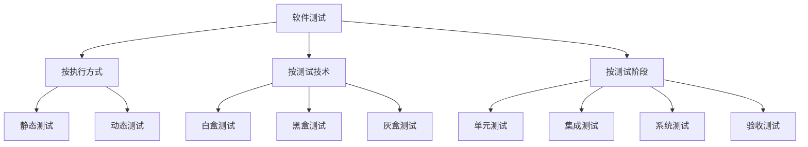

### 测试方法

#### 白盒测试

白盒测试也称 ==结构测试==，主要用于 ==单元测试==。

**覆盖标准（从弱到强）**：

| 覆盖 | 要求 |
|-----|------|
| **语句覆盖** | 每条语句至少执行一次 |
| **判定覆盖** | 每个分支至少执行一次 |
| **条件覆盖** | 每个条件取各种可能值 |
| **条件/判定覆盖** | 同时满足判定和条件覆盖 |
| **条件组合覆盖** | 条件结果所有组合 |
| **路径覆盖** | 每条可能路径至少一次 |

#### 黑盒测试

黑盒测试也称 ==功能测试==，主要用于 ==集成测试和系统测试==。

| 方法 | 说明 |
|-----|------|
| **等价类划分** | 输入分为有效和无效等价类 |
| **边界值分析** | 测试边界条件 |
| **因果图** | 分析输入条件组合 |
| **正交试验** | 用最少用例达到最高覆盖 |

### 测试阶段

| 阶段 | 测试对象 | 方法 | 关注点 |
|-----|---------|------|-------|
| **单元测试** | 模块 | 白盒为主 | 逻辑正确性 |
| **集成测试** | 模块组合 | 白盒+黑盒 | 接口正确性 |
| **系统测试** | 完整系统 | 黑盒为主 | 功能和性能 |
| **验收测试** | 完整系统 | 黑盒 | 满足需求 |

#### 系统测试类型

| 类型 | 目的 |
|-----|------|
| **功能测试** | 验证功能需求 |
| **性能测试** | 验证性能指标 |
| **压力测试** | 超负荷运行能力 |
| **恢复测试** | 故障恢复能力 |
| **安全测试** | 安全防护能力 |

#### 确认测试类型

| 类型 | 说明 |
|-----|------|
| **α 测试** | 用户在 ==开发环境== 下测试 |
| **β 测试** | 用户在 ==实际环境== 下测试 |
| **验收测试** | 正式交付前的最终测试 |

---

## 逆向工程

逆向工程是分析已有程序，寻求更高级抽象表现形式的活动。

### 信息恢复级别

| 级别 | 内容 | 抽象程度 | 恢复难度 |
|-----|------|---------|---------|
| **实现级** | 语法树、符号表 | 低 | 低 |
| **结构级** | 调用图、结构图 | ↓ | ↓ |
| **功能级** | 功能与程序段关系 | ↓ | ↓ |
| **领域级** | 实体与应用域关系 | 高 | 高 |

### 相关概念

| 概念 | 说明 |
|-----|------|
| **设计恢复** | 从程序中抽象出设计信息 |
| **重构** | 在同一抽象级别转换描述 |
| **再工程** | 在逆向工程基础上修改重构 |

---

## 软件项目管理

### 项目管理过程

### 工作分解结构(WBS)

WBS 是以 ==可交付成果为导向== 的项目分解。

### 进度管理工具

| 工具 | 特点 | 适用 |
|-----|------|------|
| **PERT 图** | 网络图，显示任务依赖 | 任务依赖关系 |
| **Gantt 图** | 条形图，显示时间进度 | 任务重叠关系 |

### 关键路径

**关键路径**是项目中最长的路径，决定项目最短工期。

| 浮动时间 | 定义 | 计算方法 |
|---------|------|---------|
| **总浮动** | 不影响项目完工的最大延迟 | LS-ES 或 LF-EF |
| **自由浮动** | 不影响紧后活动的最大延迟 | 紧后活动 ES 最小值 - 本活动 EF |

### 配置管理

配置管理的核心内容是 ==版本控制== 和 ==变更控制==。

#### 配置项状态

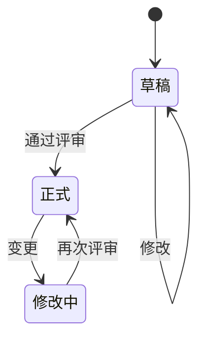

#### 版本号规则

| 状态 | 格式 | 示例 |
|-----|------|------|
| 草稿 | 0.YZ | 0.01, 0.99 |
| 正式 | X.Y | 1.0, 2.3 |
| 修改中 | X.YZ | 1.01, 2.31 |

### 质量管理

| 过程 | 内容 |
|-----|------|
| **质量计划** | 识别质量要求和标准 |
| **质量保证** | 通过 ==审计和评审== 保证质量 |
| **质量控制** | ==实时监控== 具体结果 |

### 风险管理

**风险分类**：

| 类型 | 影响 | 示例 |
|-----|------|------|
| **项目风险** | 威胁项目计划 | 进度、预算、人员 |
| **技术风险** | 威胁系统质量 | 设计、实现、测试 |
| **商业风险** | 威胁系统生存 | 市场、策略、预算 |

---

## 软件度量

### McCabe 环路复杂度

计算公式：

$$V(G) = E - N + 2$$

其中：E = 边数，N = 节点数

**其他计算方法**：

1. 程序图中的区域数（封闭区域 + 1）
2. $V(G) = P + 1$，P 为判定节点数

---

## 总结

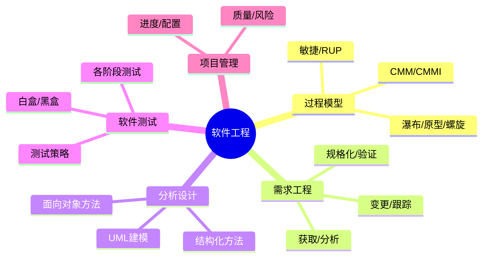

!!! note "学习建议"

    1. **过程模型**要能区分各模型的特点和适用场景
    2. **UML 图**要熟悉各种图的用途和基本画法
    3. **测试方法**要理解白盒和黑盒的区别和适用阶段
    4. **项目管理**关注关键路径计算和配置管理流程
