# 软件工程

!!! abstract "本章导读"

    软件工程是系统架构师考试中分值最高的章节之一，涵盖软件开发全生命周期的理论与实践。本章系统讲解软件过程模型、需求工程、系统分析设计、软件测试和项目管理等核心内容，是通过考试的关键所在。

## 学习目标

通过本章学习，你应该能够：

- [x] 掌握各种软件过程模型的特点和适用场景
- [x] 理解需求工程的完整流程和方法
- [x] 熟练运用结构化和面向对象分析设计方法
- [x] 掌握 UML 各类图的用途和画法
- [x] 理解软件测试的策略和方法
- [x] 了解软件项目管理的基本概念

---

## 一、软件工程概述

### 1.1 基本概念

软件工程是应用计算机科学、数学及管理科学等原理，以 ==工程化== 的原则和方法来解决软件问题的工程，其目标是：

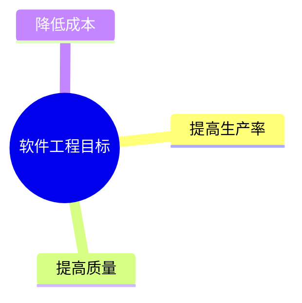

### 1.2 软件生命周期

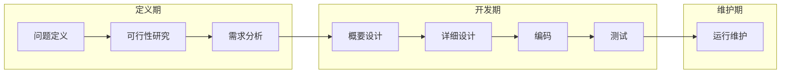

| 阶段 | 主要任务 | 产出物 |
|-----|---------|-------|
| **问题定义** | 明确要解决什么问题 | 问题定义报告 |
| **可行性研究** | 确定问题是否值得解决 | 可行性研究报告 |
| **需求分析** | 确定系统必须做什么 | 软件需求规格说明书(SRS) |
| **概要设计** | 确定系统如何实现（总体） | 概要设计说明书 |
| **详细设计** | 确定每个模块如何实现 | 详细设计说明书 |
| **编码** | 程序代码实现 | 源代码 |
| **测试** | 发现和修正错误 | 测试报告 |
| **维护** | 改正错误、适应变化 | 维护报告 |

### 1.3 软件设计四活动

软件设计包括四个既独立又相互联系的活动：

| 活动 | 内容 |
|-----|------|
| **数据设计** | 将数据模型转换为数据结构定义 |
| **体系结构设计** | 定义软件主要结构元素及其关系 |
| **接口设计** | 软件内部、外部及人机交互方式 |
| **过程设计** | 将结构元素转换为过程描述 |

---

## 二、软件过程模型

!!! warning "重点内容"

    软件过程模型是考试的高频考点，需要掌握每种模型的特点、优缺点和适用场景。

### 2.1 模型对比总览

| 模型 | 核心特点 | 适用场景 | 风险控制 |
|-----|---------|---------|---------|
| **瀑布模型** | 文档驱动、线性顺序 | 需求明确的项目 | 弱 |
| **原型模型** | 快速原型、用户参与 | 需求不明确 | 中 |
| **螺旋模型** | 风险驱动、迭代 | 大型高风险项目 | 强 |
| **增量模型** | 分批交付 | 需求可分解 | 中 |
| **喷泉模型** | 面向对象、迭代 | OO 开发 | 中 |
| **敏捷方法** | 人本、适应变化 | 需求变化快 | 中 |
| **RUP** | 用例驱动、架构中心 | 大型 OO 项目 | 强 |

### 2.2 瀑布模型

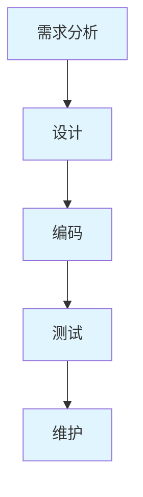

!!! info "特点"

    - 以 ==文档== 为驱动
    - 阶段间有明确的里程碑
    - 前一阶段输出是后一阶段输入
    - 各阶段工作不能并行

| 优点 | 缺点 |
|-----|------|
| 容易理解、成本低 | 需求难以一次确定 |
| 强调开发阶段性 | 变更代价高 |
| 早期计划和测试 | 结果难以预见 |

!!! tip "适用场景"

    需求非常明确且稳定的项目

### 2.3 原型模型

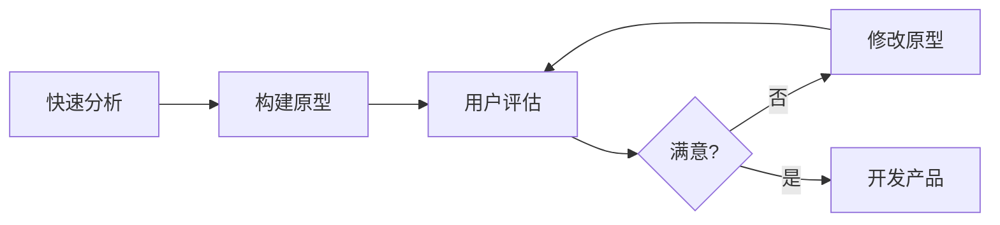

**原型分类**：

=== "按最终结果分"

    | 类型 | 说明 |
    |-----|------|
    | **抛弃型原型** | 用于需求确认后丢弃 |
    | **演化型原型** | 逐步完善成最终产品 |

=== "按实现深度分"

    | 类型 | 说明 |
    |-----|------|
    | **水平原型** | 功能导航，不实现功能（界面原型） |
    | **垂直原型** | 实现部分功能（算法验证） |

!!! tip "适用场景"

    需求不明确、经常变化、规模不太大的系统

### 2.4 螺旋模型

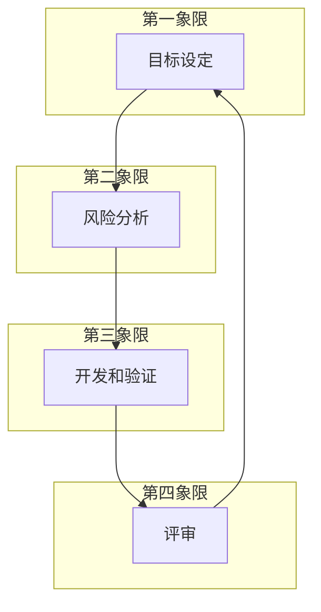

**四个活动**：

| 活动 | 内容 |
|-----|------|
| **目标设定** | 定义阶段目标和约束 |
| **风险分析** | 识别和评估风险 |
| **开发和验证** | 选择开发模型，开发产品 |
| **评审** | 评审本阶段，计划下一阶段 |

!!! warning "核心特点"

    螺旋模型是 ==风险驱动== 的，强调其他模型忽视的风险分析。

!!! tip "适用场景"

    庞大、复杂且有高风险的系统

### 2.5 增量模型

增量模型将需求分为一系列增量，每个增量独立开发和交付。

| 优点 | 缺点 |
|-----|------|
| 第一个版本成本时间少 | 初始增量可能不稳定 |
| 降低适应变更的成本 | 不利于模块整体划分 |
| 具有瀑布模型所有优点 | 需求划分有难度 |

!!! note "与原型模型的区别"

    增量模型的每个增量版本都是 ==可独立操作的产品==，而原型一般是为了演示。

### 2.6 喷泉模型

喷泉模型是以 ==用户需求为动力==、以 ==对象为驱动== 的模型，特别适合 ==面向对象== 的软件开发。

| 优点 | 缺点 |
|-----|------|
| 各阶段无明显界限 | 需要大量开发人员 |
| 可同步进行，提高效率 | 不利于项目管理 |
| | 审核难度加大 |

### 2.7 敏捷方法

!!! info "敏捷宣言核心理念"

    - **个体和交互** > 过程和工具
    - **可工作的软件** > 详尽的文档
    - **客户合作** > 合同谈判
    - **响应变化** > 遵循计划

#### 2.7.1 主要敏捷方法

| 方法 | 特点 |
|-----|------|
| **极限编程(XP)** | 高效、低风险、==测试先行== |
| **Scrum** | 侧重 ==项目管理==，Sprint 迭代 |
| **水晶方法** | 不同项目采用不同策略 |
| **FDD** | ==特征驱动==，首席程序员制 |

#### 2.7.2 Scrum 框架

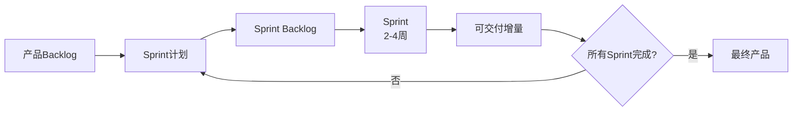

**Scrum 三个角色**：产品负责人、Scrum Master、开发团队

### 2.8 RUP（统一过程）

RUP 是一种 ==重量级== 过程模型，属于构件化开发。

#### 2.8.1 四个阶段


| 阶段 | 主要任务 |
|-----|---------|
| **初始** | 建立业务模型，确定项目边界 |
| **细化** | 分析问题领域，建立架构，==消除最高风险== |
| **构造** | 开发所有构件，集成为产品 |
| **移交** | 确保软件对最终用户可用 |

#### 2.8.2 三大特点

!!! tip "RUP 核心特点"

    1. **用例驱动**：用例定义需求和验收标准
    2. **以架构为中心**：架构是系统设计的基础
    3. **迭代和增量**：每次迭代产生可执行版本

#### 2.8.3 4+1 视图

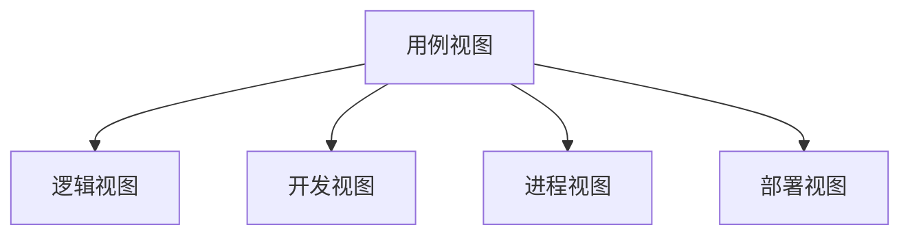

| 视图 | 关注者 | 关注点 | 常用图 |
|-----|-------|-------|-------|
| **用例视图** | 用户/需求方 | 系统功能 | 用例图 |
| **逻辑视图** | 最终用户 | 功能需求 | 类图、对象图、状态图 |
| **开发视图** | 程序员 | 软件模块组织 | 包图、组件图 |
| **进程视图** | 系统集成人员 | 性能、并发 | 活动图 |
| **部署视图** | 系统工程师 | 系统拓扑、部署 | 部署图 |

### 2.9 基于构件的开发(CBSD)

CBSD 利用预先包装的构件来构造应用系统。

**构件特征**：

| 特征 | 说明 |
|-----|------|
| 可组装性 | 通过公开接口交互 |
| 可部署性 | 独立运行在构件平台上 |
| 文档化 | 完全文档化 |
| 独立性 | 独立或显式声明依赖 |
| 标准化 | 符合构件模型标准 |

**主流构件模型**：

| 模型 | 提供方 |
|-----|-------|
| **Web Services** | W3C |
| **EJB** | Sun/Oracle |
| **.NET** | Microsoft |

---

## 三、CMM/CMMI 成熟度模型

### 3.1 CMM 五级

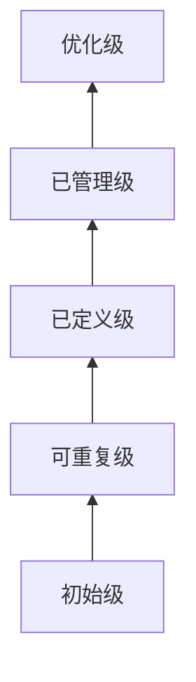

| 级别 | 特征 | 关键点 |
|-----|------|-------|
| **初始级** | 过程不可预测 | 依靠英雄人物 |
| **可重复级** | 基本项目管理 | 跟踪费用、进度、功能 |
| **已定义级** | 过程标准化 | 文档化、标准化 |
| **已管理级** | 量化管理 | 度量标准 |
| **优化级** | 持续改进 | 过程改进 |

### 3.2 CMMI 特点

CMMI 提供两种表示方法：

| 表示法 | 关注点 | 级别 |
|-------|-------|-----|
| **阶段式** | 组织成熟度 | 5 个成熟度级别 |
| **连续式** | 过程域能力 | 6 个能力级别 |

---

## 四、需求工程

### 4.1 需求层次

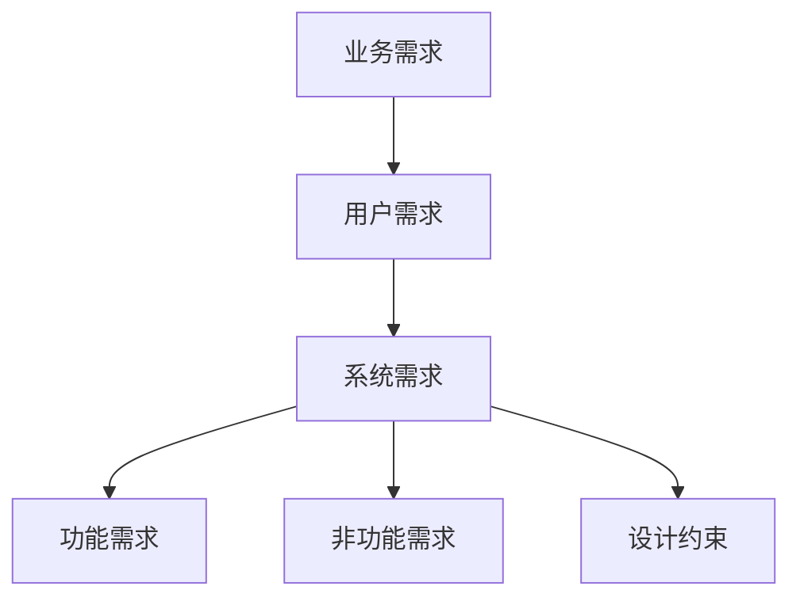

| 层次 | 描述 |
|-----|------|
| **业务需求** | 组织或客户的高层目标 |
| **用户需求** | 用户使用系统完成的任务 |
| **系统需求** | 系统必须实现的功能和特性 |

### 4.2 需求分类（QFD）

质量功能部署（QFD）将需求分为三类：

| 类型 | 说明 | 影响 |
|-----|------|------|
| **常规需求** | 用户明确期望的功能 | 实现越多越满意 |
| **期望需求** | 用户默认应有的功能 | 不实现会不满意 |
| **意外需求** | 超出用户期望的功能 | 实现会惊喜 |

### 4.3 需求工程过程

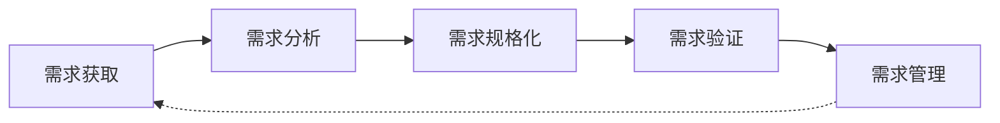

#### 4.3.1 需求获取方法

| 方法 | 特点 |
|-----|------|
| 用户面谈 | 直接沟通，深入了解 |
| 问卷调查 | 覆盖面广 |
| 现场观察 | 了解实际业务流程 |
| 原型化 | 帮助用户明确需求 |
| 头脑风暴 | 激发创意 |

#### 4.3.2 软件需求规格说明书(SRS)

SRS 是需求开发和需求管理之间的桥梁，包含：

- 功能需求
- 非功能需求
- 设计约束
- 过程约束

### 4.4 需求管理

需求管理包括 ==变更控制==、==版本控制== 和 ==需求跟踪==。

#### 4.4.1 需求变更管理

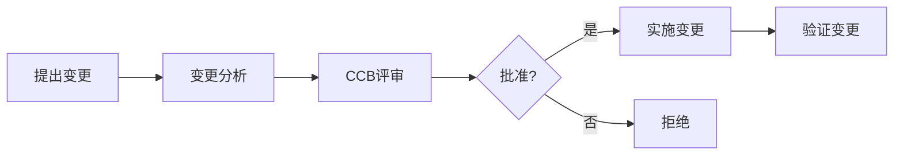

**CCB（变更控制委员会）** 是决策机构，不提出变更方案，只负责批准或拒绝。

#### 4.4.2 需求跟踪


需求跟踪矩阵用于：

- 确保所有需求都被实现
- 确保所有实现都有对应需求
- 分析变更影响

---

## 五、系统分析与设计

### 5.1 结构化方法

结构化方法又称为 ==面向功能== 或 ==面向数据流== 的方法。

#### 5.1.1 结构化分析(SA)

**数据流图(DFD)** 四要素：

| 元素 | 图形 | 说明 |
|-----|------|------|
| **外部实体** | 矩形 | 数据来源/去处 |
| **处理/加工** | 圆形 | 数据变换 |
| **数据存储** | 双线 | 数据保存 |
| **数据流** | 箭头 | 数据流动 |

!!! warning "DFD 规则"

    - 数据流必须与加工有关
    - 加工至少有一个输入流和一个输出流
    - 数据存储必须有流入和流出
    - 父图与子图数据流平衡

**DFD 异常**：

| 异常 | 描述 |
|-----|------|
| **黑洞** | 有输入无输出 |
| **奇迹** | 有输出无输入 |
| **灰洞** | 输入不足以产生输出 |

#### 5.1.2 结构化设计(SD)

SD 是 ==自顶向下、逐步求精、模块化== 的过程。

| 阶段 | 任务 |
|-----|------|
| **概要设计** | 确定系统结构，模块划分，接口定义 |
| **详细设计** | 设计每个模块的实现算法 |

##### 5.1.2.1 耦合与内聚

!!! tip "设计原则"

    ==高内聚、低耦合==

**耦合（从低到高）**：

| 类型 | 说明 |
|-----|------|
| 非直接耦合 | 无直接关系 |
| 数据耦合 | 传递简单数据 |
| 标记耦合 | 传递数据结构 |
| 控制耦合 | 传递控制信息 |
| 公共耦合 | 共享公共数据 |
| 内容耦合 | 直接访问内部数据 |

**内聚（从高到低）**：

| 类型 | 说明 |
|-----|------|
| 功能内聚 | 完成单一功能 |
| 顺序内聚 | 顺序执行，输出作为输入 |
| 通信内聚 | 操作同一数据结构 |
| 过程内聚 | 按特定次序执行 |
| 时间内聚 | 同一时间执行 |
| 逻辑内聚 | 逻辑相关的任务 |
| 偶然内聚 | 无关或松散关系 |

### 5.2 面向对象方法

#### 5.2.1 OOA（面向对象分析）

OOA 模型包含 5 个层次和 5 个活动：

| 层次 | 活动 |
|-----|------|
| 主题层 | 定义主题 |
| 对象类层 | 标识对象类 |
| 结构层 | 标识结构 |
| 属性层 | 定义属性 |
| 服务层 | 定义服务 |

#### 5.2.2 OOD（面向对象设计）

**三种类型的类**：

| 类型 | 说明 | 识别方法 |
|-----|------|---------|
| **实体类** | 存储信息，永久性 | 名词 |
| **控制类** | 控制用例工作流 | 动宾结构 |
| **边界类** | 封装交互信息 | 窗口、接口、协议 |

#### 5.2.3 设计原则

| 原则 | 说明 |
|-----|------|
| **开闭原则** | 对扩展开放，对修改关闭 |
| **里氏替换** | 子类可以替换父类 |
| **依赖倒置** | 依赖抽象而非具体 |
| **接口隔离** | 多个专用接口优于通用接口 |
| **最少知识** | 减少对象间交互 |
| **组合/聚合复用** | 优先使用组合而非继承 |

### 5.3 UML 图

!!! abstract "UML 概述"

    UML（统一建模语言）是面向对象软件开发的标准建模语言，共有 **14 种图**，分为 **结构图** 和 **行为图** 两大类。

#### 5.3.1 UML 图总览

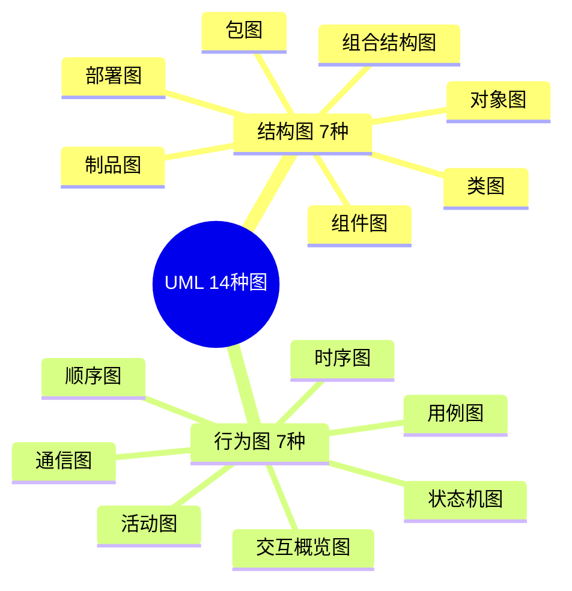

**考试常考的 9 种图**：

| 类型 | 图名 | 说明 |
|------|------|------|
| 结构图 | **类图** | 类的属性、方法及类间关系 |
| 结构图 | **对象图** | 类图的实例快照 |
| 结构图 | **包图** | 模块 / 命名空间的组织 |
| 结构图 | **组件图** | 软件构件及接口 |
| 结构图 | **部署图** | 硬件节点与软件部署 |
| 行为图 | **用例图** | 系统功能与参与者 |
| 行为图 | **顺序图** | 对象交互的时间顺序 |
| 行为图 | **通信图** | 对象交互的结构关系 |
| 行为图 | **活动图** | 业务流程 / 工作流 |
| 行为图 | **状态机图** | 对象的状态转换 |

---

#### 5.3.2 UML 关系

UML 中类与类之间有 6 种关系，**强度从弱到强**：


| 关系 | 符号 | 方向 | 说明 | 示例 |
|-----|------|------|------|------|
| **依赖** | 虚线箭头 `- ->` | A 依赖 B | 临时使用，最弱耦合 | 方法参数中使用 |
| **关联** | 实线 `——` | 双向/单向 | 结构性连接，长期持有 | 老师与学生 |
| **聚合** | 空心菱形 `◇——` | 整体→部分 | 弱拥有，部分可独立存在 | 班级与学生 |
| **组合** | 实心菱形 `◆——` | 整体→部分 | 强拥有，生命周期绑定 | 人与心脏 |
| **泛化** | 空心三角箭头 `——▷` | 子类→父类 | 继承关系（is-a） | 猫继承动物 |
| **实现** | 虚线空心三角 `- -▷` | 类→接口 | 接口实现 | 类实现接口 |

!!! tip "聚合 vs 组合"

    - **聚合**：部分可以脱离整体独立存在。例：学生离开班级仍然存在
    - **组合**：部分不能脱离整体存在。例：心脏离开人体就失去意义

!!! tip "关联的多重性"

    关联线上可标注多重性：`1`、`0..1`、`*`、`1..*`、`m..n`

---

=== "用例图"

    用例图描述系统 **外部功能**，回答"系统能做什么"。

    **组成元素**：

    | 元素 | 图形 | 说明 |
    |-----|------|------|
    | **参与者（Actor）** | 小人图标 | 与系统交互的外部实体（人/系统） |
    | **用例（Use Case）** | 椭圆 | 系统提供的功能单元 |
    | **系统边界** | 矩形框 | 区分系统内外 |
    | **关系** | 各种连线 | 参与者与用例、用例与用例之间的关系 |

    **用例间关系**：

    | 关系 | 符号 | 方向 | 说明 | 触发条件 |
    |-----|------|------|------|---------|
    | **包含** | `<<include>>` 虚线箭头 | 基用例→被包含用例 | 提取公共行为，**必然执行** | 每次都执行 |
    | **扩展** | `<<extend>>` 虚线箭头 | 扩展用例→基用例 | 可选的分支流程，**条件执行** | 满足条件才执行 |
    | **泛化** | 空心三角实线 | 子用例→父用例 | 用例继承，子用例可替换父用例 | 特殊化关系 |

    !!! warning "include vs extend 方向易错"

        - `<<include>>`：箭头从 **基用例** 指向 **被包含用例**（A 包含 B，箭头 A→B）
        - `<<extend>>`：箭头从 **扩展用例** 指向 **基用例**（B 扩展 A，箭头 B→A）

    ??? example "举例：网上购物系统"

        **术语说明**

        | 术语 | 说明 | 例子中对应 |
        |-----|------|-----------|
        | **基用例** | 主流程用例，是关系的发起方 | "下单"、"支付"、"登录" |
        | **被包含用例** | 被 include 进来的公共步骤，本身不能单独发起 | "验证身份" |
        | **扩展用例** | 在特定条件下附加到基用例的可选步骤 | "充值" |

        ---

        **场景**：用户在电商网站下单、支付、查看订单。

        **包含（include）—— 必然发生的公共步骤**

        > "下单"和"支付"都需要先验证用户身份，每次都跑不掉。
        > 把"验证身份"提取出来，让两个用例都 include 它。

        ```
        下单  ──<<include>>──▶  验证身份
        支付  ──<<include>>──▶  验证身份
        ```

        - 只要执行"下单"，**必然** 执行"验证身份"
        - 只要执行"支付"，**必然** 执行"验证身份"
        - 核心特征：**无条件、每次都执行**

        ---

        **扩展（extend）—— 满足条件才发生的可选步骤**

        > 用户支付时，**如果余额不足**，才会触发"充值"这个额外流程；余额充足时根本不会出现充值。

        ```
        充值  ──<<extend>>──▶  支付
        ```

        - 正常支付流程里 **没有** 充值这一步
        - 只有满足"余额不足"这个条件，才会扩展出充值流程
        - 核心特征：**有条件、可选执行**

        ---

        **泛化（generalization）—— 用例的继承与特殊化**

        > "管理员登录"是"登录"的一种特殊形式，它继承了普通登录的所有行为，还额外需要输入验证码。
        > 子用例可以完全替代父用例出现在任何场景中。

        ```
        管理员登录  ──▷  登录
        ```

        - "管理员登录"继承"登录"的全部行为
        - 在此基础上扩展了"输入验证码"等额外步骤
        - 核心特征：**继承关系、子可替换父**

        ---

        **一句话记忆**

        | 关系 | 类比 | 特征 |
        |-----|------|------|
        | **包含** | 每次出门都要带手机 | 必然、无条件 |
        | **扩展** | 下雨才带伞 | 可选、有条件 |
        | **泛化** | 跑车是汽车的一种 | 继承、子可替换父 |

        ```mermaid
        graph LR
            U1[登录] -->|include| U2[验证身份]
            U3[修改密码] -->|extend| U1
            U4[管理员登录] -->|泛化| U1
        ```

=== "类图"

    类图是 UML 中**最重要**的图，描述系统的静态结构。

    **类的表示**：

    ```
    ┌─────────────────┐
    │    ClassName    │  ← 类名（抽象类用斜体）
    ├─────────────────┤
    │ - attribute: T  │  ← 属性（可见性 名称: 类型）
    │ + attribute: T  │
    ├─────────────────┤
    │ + method(): R   │  ← 方法（可见性 名称(): 返回类型）
    │ # method(): R   │
    └─────────────────┘
    ```

    **可见性符号**：

    | 符号 | 可见性 | 说明 |
    |-----|-------|------|
    | `+` | public | 公有，所有类可访问 |
    | `-` | private | 私有，仅本类可访问 |
    | `#` | protected | 保护，本类及子类可访问 |
    | `~` | package | 包内可访问 |

    **类图中的关系示例**：

    ```mermaid
    classDiagram
        class Animal {
            +String name
            +eat() void
        }
        class Dog {
            +bark() void
        }
        class Cat {
            +meow() void
        }
        class Owner {
            +String name
        }
        class Collar {
            +String color
        }
        Animal <|-- Dog : 泛化
        Animal <|-- Cat : 泛化
        Owner "1" o-- "0..*" Dog : 聚合
        Dog "1" *-- "1" Collar : 组合
    ```

=== "顺序图"

    顺序图描述对象之间**按时间顺序**的交互，强调**消息传递的先后顺序**。

    **组成元素**：

    | 元素 | 图形 | 说明 |
    |-----|------|------|
    | **对象/参与者** | 矩形框 + 名称 | 参与交互的实体 |
    | **生命线** | 垂直虚线 | 对象存在的时间轴 |
    | **激活框** | 生命线上的细长矩形 | 对象正在执行的时间段 |
    | **消息** | 水平箭头 | 对象间的通信 |

    **消息类型**：

    | 类型 | 符号 | 特点 | 说明 |
    |-----|------|------|------|
    | **同步消息** | 实心三角箭头 `——▶` | 阻塞，等待返回 | 调用方法，等待结果 |
    | **异步消息** | 开放箭头 `——>` | 不阻塞，不等待 | 发送后继续执行 |
    | **返回消息** | 虚线箭头 `- ->` | 响应同步调用 | 方法返回值 |
    | **自调用** | 指向自身的箭头 | 对象调用自身方法 | 递归或内部调用 |
    | **创建消息** | `<<create>>` | 创建新对象 | 指向新对象头部 |
    | **销毁消息** | `<<destroy>>` | 销毁对象 | 生命线末端加 ×  |

    **顺序图片段（Combined Fragment）**：

    | 片段 | 关键字 | 说明 |
    |-----|-------|------|
    | **条件** | `alt` | if-else 分支 |
    | **可选** | `opt` | 可选执行（单分支） |
    | **循环** | `loop` | 循环执行 |
    | **并行** | `par` | 并行执行 |
    | **引用** | `ref` | 引用其他顺序图 |

    ```mermaid
    sequenceDiagram
        participant U as 用户
        participant S as 系统
        participant DB as 数据库

        U->>S: 登录请求(用户名,密码)
        activate S
        S->>DB: 查询用户信息
        activate DB
        DB-->>S: 返回用户数据
        deactivate DB
        
        alt 验证成功
            S-->>U: 返回Token
        else 验证失败
            S-->>U: 返回错误信息
        end
        deactivate S
    ```

=== "通信图"

    通信图与顺序图等价，但强调**对象之间的结构关系**，消息带有**序号**表示顺序。

    | 对比项 | 顺序图 | 通信图 |
    |-------|-------|-------|
    | **强调点** | 时间顺序 | 对象结构关系 |
    | **布局** | 纵向时间轴 | 自由布局 |
    | **消息顺序** | 从上到下 | 消息编号（1, 2, 1.1...） |
    | **适用场景** | 复杂交互流程 | 展示对象协作网络 |

    !!! note "等价性"

        顺序图和通信图在语义上**完全等价**，可以相互转换，只是侧重点不同。

=== "活动图"

    活动图描述**业务流程**或**算法逻辑**，类似于流程图，但支持并发。

    **组成元素**：

    | 元素 | 图形 | 说明 |
    |-----|------|------|
    | **初始节点** | 实心圆 ● | 流程开始 |
    | **终止节点** | 实心圆外加圆圈 ⊙ | 流程结束 |
    | **活动节点** | 圆角矩形 | 一个动作/步骤 |
    | **判断节点** | 菱形 | 条件分支 |
    | **分叉节点** | 粗横线（一进多出） | 并发开始 |
    | **汇合节点** | 粗横线（多进一出） | 并发结束 |
    | **泳道** | 垂直/水平分区 | 区分不同责任方 |

    ```mermaid
    graph TD
        S([开始]) --> A[提交订单]
        A --> B{库存充足?}
        B -->|是| C[扣减库存]
        B -->|否| D[提示缺货]
        C --> E[生成订单]
        E --> F[发送通知]
        F --> T([结束])
        D --> T
    ```

    !!! tip "活动图 vs 流程图"

        活动图支持**泳道**（区分责任方）和**并发**（分叉/汇合），是流程图的超集。

=== "状态机图"

    状态机图描述**单个对象**在其生命周期内的**状态变化**。

    **组成元素**：

    | 元素 | 图形 | 说明 |
    |-----|------|------|
    | **初始状态** | 实心圆 ● | 对象创建时的起始状态 |
    | **终止状态** | 实心圆外加圆圈 ⊙ | 对象销毁时的最终状态 |
    | **状态** | 圆角矩形 | 对象在某时刻的稳定情况 |
    | **转换** | 带箭头的线 | 状态之间的迁移 |
    | **事件** | 转换线上的标注 | 触发状态转换的条件 |
    | **动作** | `事件[条件]/动作` | 转换时执行的操作 |

    **转换语法**：`事件名 [守卫条件] / 动作`

    ```mermaid
    stateDiagram-v2
        [*] --> 待支付: 创建订单
        待支付 --> 已支付: 完成支付
        待支付 --> 已取消: 超时/取消
        已支付 --> 配送中: 发货
        配送中 --> 已完成: 确认收货
        已完成 --> [*]
        已取消 --> [*]
    ```

    !!! note "状态图 vs 活动图"

        - **状态图**：针对**单个对象**，描述其状态变化（对象视角）
        - **活动图**：描述**业务流程**，可跨多个对象（流程视角）

=== "包图"

    包图用于描述系统的**模块化结构**，将相关元素组织在一起。

    **组成元素**：

    | 元素 | 图形 | 说明 |
    |-----|------|------|
    | **包** | 带标签的文件夹图标 | 命名空间/模块 |
    | **依赖** | 虚线箭头 `<<use>>` | 包间依赖关系 |
    | **导入** | 虚线箭头 `<<import>>` | 导入另一个包的内容 |
    | **合并** | 虚线箭头 `<<merge>>` | 包的合并 |

=== "组件图"

    组件图描述系统的**物理组成**，展示软件构件及其接口。

    **组成元素**：

    | 元素 | 图形 | 说明 |
    |-----|------|------|
    | **组件** | 矩形（带组件图标） | 可替换的软件模块 |
    | **接口** | 圆圈（提供接口）/ 半圆（需求接口） | 组件对外暴露的服务 |
    | **依赖** | 虚线箭头 | 组件间的依赖 |

=== "部署图"

    部署图描述系统的**物理部署**，展示硬件节点和软件的分布。

    **组成元素**：

    | 元素 | 图形 | 说明 |
    |-----|------|------|
    | **节点** | 立方体 | 物理硬件或虚拟机 |
    | **制品** | 矩形（带文档图标） | 可部署的软件单元（.jar/.war/.exe） |
    | **通信路径** | 实线 | 节点间的通信连接 |
    | **部署关系** | `<<deploy>>` | 制品部署在节点上 |

---

#### 5.3.3 UML 图选用指南

!!! tip "如何选择合适的 UML 图"

    | 问题 | 推荐图 |
    |-----|-------|
    | 系统有哪些功能？谁来使用？ | **用例图** |
    | 系统有哪些类？类之间什么关系？ | **类图** |
    | 某个时刻对象的状态是什么？ | **对象图** |
    | 对象之间如何按时间顺序交互？ | **顺序图** |
    | 对象之间的协作网络是什么？ | **通信图** |
    | 业务流程是什么？有哪些分支？ | **活动图** |
    | 对象的状态如何变化？ | **状态机图** |
    | 系统模块如何组织？ | **包图** |
    | 软件构件如何组成？ | **组件图** |
    | 软件如何部署到硬件上？ | **部署图** |

---

## 六、软件测试

### 6.1 测试目标

!!! info "核心理念"

    - 测试的目的是 ==发现错误==，而不是证明软件正确
    - 一个好的测试用例是能发现至今未发现的错误的用例
    - 一个成功的测试是发现了至今未发现的错误的测试

### 6.2 测试分类

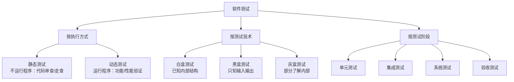

### 6.3 测试方法

#### 6.3.1 白盒测试

白盒测试也称 ==结构测试== / ==逻辑驱动测试==，主要用于 ==单元测试==。

!!! tip "核心思想"

    按照程序内部逻辑结构设计测试用例，检验程序中每条路径是否都能按预定要求正确工作。

**覆盖标准（从弱到强）**：

| 覆盖级别 | 要求 | 说明 |
|---------|------|------|
| **语句覆盖** | 每条语句至少执行一次 | 最弱，只要求执行到 |
| **判定覆盖** | 每个判断的真/假分支各执行一次 | 也称分支覆盖 |
| **条件覆盖** | 每个判断中每个条件的真/假各取一次 | 不一定满足判定覆盖 |
| **条件/判定覆盖** | 同时满足判定覆盖和条件覆盖 | — |
| **条件组合覆盖** | 每个判断中条件结果的所有组合各出现一次 | 较强 |
| **路径覆盖** | 覆盖程序中所有可能的执行路径 | 最强，用例数量最多 |

??? example "举例：用同一段代码理解各覆盖级别"

    **示例代码**（伪代码）：

    ```
    if (A > 0 AND B > 0):   // 判断1，含两个条件：A>0、B>0
        执行语句 X
    else:
        执行语句 Y

    if (C == 1):             // 判断2，含一个条件：C==1
        执行语句 Z
    ```

    该代码共有 **2 个判断**，**3 个条件**（A>0、B>0、C==1），**4 条可能路径**：

    ```
    路径1: 判断1=真 → X → 判断2=真 → Z
    路径2: 判断1=真 → X → 判断2=假 → (不执行Z)
    路径3: 判断1=假 → Y → 判断2=真 → Z
    路径4: 判断1=假 → Y → 判断2=假 → (不执行Z)
    ```

    ---

    **① 语句覆盖**：让每条语句（X、Y、Z）都至少执行一次即可。

    | 用例 | A | B | C | 执行路径 |
    |-----|---|---|---|---------|
    | T1 | 1 | 1 | 1 | 路径1：X → Z |
    | T2 | -1 | 1 | 0 | 路径3：Y → (不执行Z) |

    > T1 覆盖了 X 和 Z，T2 覆盖了 Y，语句全覆盖 ✓  
    > **但判断2的"假"分支从未执行，存在漏洞。**

    ---

    **② 判定覆盖（分支覆盖）**：每个判断的真/假分支各走一次。

    | 用例 | A | B | C | 判断1 | 判断2 |
    |-----|---|---|---|------|------|
    | T1 | 1 | 1 | 1 | 真 | 真 |
    | T2 | -1 | 1 | 0 | 假 | 假 |

    > 判断1 真/假都覆盖，判断2 真/假都覆盖 ✓  
    > **但条件 A>0 和 B>0 各自的取值组合没有全部测到。**

    ---

    **③ 条件覆盖**：每个条件的真/假各取一次（A>0 取真/假，B>0 取真/假，C==1 取真/假）。

    | 用例 | A | B | C | A>0 | B>0 | C==1 |
    |-----|---|---|---|-----|-----|------|
    | T1 | 1 | -1 | 1 | 真 | **假** | 真 |
    | T2 | -1 | 1 | 0 | **假** | 真 | 假 |

    > 三个条件的真/假都覆盖了 ✓  
    > **但注意：T1 和 T2 中判断1都是"假"（因为 AND 有一个假就是假），判断1的"真"分支从未执行！**  
    > 这就是"条件覆盖不一定满足判定覆盖"的原因。

    ---

    **④ 条件/判定覆盖**：同时满足判定覆盖 + 条件覆盖，需要增加用例：

    | 用例 | A | B | C | A>0 | B>0 | C==1 | 判断1 | 判断2 |
    |-----|---|---|---|-----|-----|------|------|------|
    | T1 | 1 | 1 | 1 | 真 | 真 | 真 | **真** | 真 |
    | T2 | -1 | -1 | 0 | 假 | 假 | 假 | **假** | 假 |

    > 判断真/假都覆盖，条件真/假也都覆盖 ✓  
    > **但 A>0=真、B>0=假 这种组合从未出现，条件组合不完整。**

    ---

    **⑤ 条件组合覆盖**：判断1中 A>0 和 B>0 的所有组合（真真/真假/假真/假假）都要出现。

    | 用例 | A | B | C | A>0 | B>0 | 判断1 |
    |-----|---|---|---|-----|-----|------|
    | T1 | 1 | 1 | 1 | 真 | 真 | 真 |
    | T2 | 1 | -1 | 0 | 真 | 假 | 假 |
    | T3 | -1 | 1 | 1 | 假 | 真 | 假 |
    | T4 | -1 | -1 | 0 | 假 | 假 | 假 |

    > A>0 和 B>0 的 4 种组合全部覆盖 ✓  
    > **但路径3（判断1=假 → Y → 判断2=真）和路径4（判断1=假 → Y → 判断2=假）都走了，而路径1和路径2只有T1走了路径1，路径2（X → 不执行Z）从未出现。**

    ---

    **⑥ 路径覆盖**：4 条路径全部覆盖，需要 4 个用例：

    | 用例 | A | B | C | 路径 |
    |-----|---|---|---|------|
    | T1 | 1 | 1 | 1 | 路径1：X → Z |
    | T2 | 1 | 1 | 0 | 路径2：X → (不执行Z) |
    | T3 | -1 | 1 | 1 | 路径3：Y → Z |
    | T4 | -1 | 1 | 0 | 路径4：Y → (不执行Z) |

    > 所有可能的执行路径都覆盖 ✓，是最强的覆盖标准。

    ---

    **总结对比**：

    | 覆盖级别 | 本例最少用例数 | 关注点 |
    |---------|-------------|-------|
    | 语句覆盖 | 2 | 语句有没有执行到 |
    | 判定覆盖 | 2 | 分支走没走到 |
    | 条件覆盖 | 2 | 每个条件真/假各取过 |
    | 条件/判定覆盖 | 2 | 以上两者都满足 |
    | 条件组合覆盖 | 4 | 条件的所有组合都出现 |
    | 路径覆盖 | 4 | 每条完整路径都走过 |

!!! warning "注意"

    覆盖强度越高，所需测试用例越多，但不代表能发现所有错误。**路径覆盖** ⊇ **条件组合覆盖** ⊇ **条件/判定覆盖**。

#### 6.3.2 黑盒测试

黑盒测试也称 ==功能测试== / ==数据驱动测试==，主要用于 ==集成测试和系统测试==。

!!! tip "核心思想"

    完全不考虑程序内部结构，只依据需求规格说明书，检验程序功能是否符合要求。

| 方法 | 说明 | 适用场景 |
|-----|------|---------|
| **等价类划分** | 将输入域划分为若干等价类，从每类中取一个代表值 | 输入范围明确 |
| **边界值分析** | 重点测试边界条件（最小值、最大值、边界±1） | 配合等价类使用 |
| **因果图** | 分析输入条件（因）与输出结果（果）的组合关系 | 输入条件多且有依赖 |
| **正交试验** | 用正交表设计用例，以最少用例达到最高覆盖 | 多因素多水平组合 |
| **判定表** | 列出所有条件组合及对应动作 | 复杂业务规则 |

??? example "举例：用「用户注册」场景理解各黑盒测试方法"

    **场景**：某注册页面，要求用户填写 **年龄** 和 **手机号**，规则如下：

    - 年龄：必须是 1～120 之间的整数
    - 手机号：必须是 11 位数字，且以 1 开头

    ---

    **① 等价类划分**

    将输入域划分为"有效等价类"和"无效等价类"，每类只取一个代表值测试即可。

    **年龄字段的等价类划分**：

    | 等价类 | 范围 | 代表值 | 类型 |
    |-------|------|-------|------|
    | 有效年龄 | 1～120 的整数 | 25 | 有效 |
    | 过小 | < 1 | 0 | 无效 |
    | 过大 | > 120 | 200 | 无效 |
    | 非整数 | 小数 | 18.5 | 无效 |
    | 非数字 | 字母/符号 | "abc" | 无效 |

    > 只需 5 个用例就能覆盖所有等价类，不必测试 1～120 中的每一个数字。

    ---

    **② 边界值分析**

    在等价类划分的基础上，重点测试 **边界点及其附近**（边界值、边界-1、边界+1）。

    **年龄字段的边界值**：

    | 测试点 | 值 | 说明 |
    |-------|---|------|
    | 最小边界 - 1 | 0 | 刚好不合法 |
    | 最小边界 | 1 | 合法下限 |
    | 最小边界 + 1 | 2 | 合法范围内 |
    | 最大边界 - 1 | 119 | 合法范围内 |
    | 最大边界 | 120 | 合法上限 |
    | 最大边界 + 1 | 121 | 刚好不合法 |

    > 边界处最容易出现 `>` 写成 `>=` 这类 off-by-one 错误，边界值分析专门针对这类问题。

    ---

    **③ 判定表**

    当多个条件组合影响结果时，用判定表列出所有组合。

    **场景**：注册时，年龄和手机号都合法才能提交成功。

    | 条件 | 用例1 | 用例2 | 用例3 | 用例4 |
    |-----|------|------|------|------|
    | 年龄合法？ | ✓ | ✓ | ✗ | ✗ |
    | 手机号合法？ | ✓ | ✗ | ✓ | ✗ |
    | **结果：注册成功** | **✓** | **✗** | **✗** | **✗** |

    > 判定表确保所有条件组合都被测试到，不会遗漏"两个都错"这种情况。

    ---

    **④ 因果图**

    因果图用于分析 **输入条件（因）→ 输出结果（果）** 之间的逻辑关系，尤其适合条件之间有约束的场景。

    **场景**：注册结果取决于多个输入条件，且条件之间有互斥关系。

    ```
    因（输入条件）                    果（输出结果）
    ─────────────────────────────────────────────
    C1: 年龄合法 ──┐
                   ├─ AND ──→ E1: 注册成功
    C2: 手机号合法 ┘

    C3: 年龄非法 ──────────→ E2: 提示"年龄格式错误"
    C4: 手机号非法 ─────────→ E3: 提示"手机号格式错误"
    ```

    > 因果图比判定表更直观地展示条件间的逻辑关系（AND/OR/互斥），适合复杂业务规则分析。

    ---

    **⑤ 正交试验**

    当有 **多个因素、每个因素有多个取值** 时，用正交表设计最少的用例组合。

    **场景**：注册页面有 3 个因素，每个因素有 2 种取值：

    | 因素 | 取值1 | 取值2 |
    |-----|------|------|
    | 年龄 | 合法（25） | 非法（0） |
    | 手机号 | 合法（13800138000） | 非法（123） |
    | 验证码 | 正确 | 错误 |

    全组合需要 2³ = **8 个用例**，用正交表 L4(2³) 只需 **4 个用例**：

    | 用例 | 年龄 | 手机号 | 验证码 | 预期结果 |
    |-----|------|-------|-------|---------|
    | T1 | 合法 | 合法 | 正确 | 注册成功 |
    | T2 | 合法 | 非法 | 错误 | 失败 |
    | T3 | 非法 | 合法 | 错误 | 失败 |
    | T4 | 非法 | 非法 | 正确 | 失败 |

    > 正交试验用最少的用例覆盖最多的因素组合，适合参数多、全组合数量爆炸的场景。

    ---

    **总结对比**：

    | 方法 | 核心思路 | 本例用例数 | 最适合场景 |
    |-----|---------|----------|----------|
    | 等价类划分 | 同类输入效果相同，取代表值 | 5 | 输入有明确范围 |
    | 边界值分析 | 边界最容易出错，重点测边界 | 6 | 配合等价类使用 |
    | 判定表 | 列出所有条件组合 | 4 | 多条件影响同一结果 |
    | 因果图 | 分析条件间逻辑关系 | — | 条件间有约束/互斥 |
    | 正交试验 | 用正交表压缩组合数 | 4（原需8） | 多因素多水平 |

#### 6.3.3 白盒 vs 黑盒对比

| 对比项 | 白盒测试 | 黑盒测试 |
|-------|---------|---------|
| **别名** | 结构测试、逻辑驱动测试 | 功能测试、数据驱动测试 |
| **视角** | 内部结构（代码逻辑） | 外部功能（输入输出） |
| **主要阶段** | 单元测试 | 集成测试、系统测试 |
| **设计依据** | 程序代码 | 需求规格说明书 |
| **优点** | 覆盖代码逻辑，发现内部缺陷 | 不依赖实现，贴近用户视角 |
| **缺点** | 无法检验需求遗漏，用例数量大 | 无法保证内部逻辑覆盖 |

### 6.4 测试阶段

测试按照从小到大、从内到外的顺序进行：

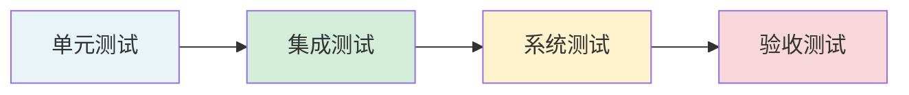

| 阶段 | 测试对象 | 主要方法 | 关注点 | 执行者 |
|-----|---------|---------|-------|-------|
| **单元测试** | 单个模块/函数 | 白盒为主 | 逻辑正确性、路径覆盖 | 开发人员 |
| **集成测试** | 模块组合/接口 | 白盒+黑盒 | 接口正确性、模块协作 | 开发/测试人员 |
| **系统测试** | 完整系统 | 黑盒为主 | 功能、性能、安全等 | 测试人员 |
| **验收测试** | 完整系统 | 黑盒 | 满足用户需求 | 用户/客户 |

#### 6.4.1 集成测试策略

| 策略 | 说明 | 优点 | 缺点 |
|-----|------|------|------|
| **非渐增式** | 所有模块一次性集成 | 简单 | 错误难定位 |
| **自顶向下** | 从主模块开始，逐步加入下层模块 | 早期验证主控逻辑 | 需要桩模块（Stub） |
| **自底向上** | 从底层模块开始，逐步向上集成 | 底层模块充分测试 | 需要驱动模块（Driver） |
| **混合式** | 上层自顶向下，下层自底向上 | 兼顾两者优点 | 复杂度较高 |

!!! note "桩模块 vs 驱动模块"

    - **桩模块（Stub）**：自顶向下集成时，用于模拟尚未开发的下层模块
    - **驱动模块（Driver）**：自底向上集成时，用于模拟调用被测模块的上层模块

#### 6.4.2 系统测试类型

| 类型 | 目的 |
|-----|------|
| **功能测试** | 验证系统功能是否符合需求规格 |
| **性能测试** | 验证响应时间、吞吐量等性能指标 |
| **压力测试** | 超负荷运行，检验系统极限能力 |
| **负载测试** | 逐步增加负载，找到性能瓶颈点 |
| **恢复测试** | 验证系统故障后的恢复能力 |
| **安全测试** | 验证系统的安全防护能力 |
| **兼容性测试** | 验证与其他软硬件的兼容性 |
| **可靠性测试** | 验证系统在规定条件下的稳定运行能力 |

#### 6.4.3 验收测试类型

| 类型 | 测试环境 | 执行者 | 说明 |
|-----|---------|-------|------|
| **α 测试** | ==开发环境==（受控） | 用户在开发方现场 | 开发人员在旁，可记录问题 |
| **β 测试** | ==实际使用环境==（不受控） | 用户在自己现场 | 开发人员不在场，用户自行测试 |
| **验收测试** | 用户环境 | 用户/客户 | 正式交付前的最终确认 |

!!! tip "α 与 β 的区别"

    - **α 测试**：开发方 "陪同" 用户测试，环境受控，问题可即时记录
    - **β 测试**：用户 "独立" 测试，真实环境，反馈给开发方后修复

---

## 七、逆向工程

逆向工程是分析已有程序，寻求更高级抽象表现形式的活动。

### 7.1 信息恢复级别

| 级别 | 内容 | 抽象程度 | 恢复难度 |
|-----|------|---------|---------|
| **实现级** | 语法树、符号表 | 低 | 低 |
| **结构级** | 调用图、结构图 | ↓ | ↓ |
| **功能级** | 功能与程序段关系 | ↓ | ↓ |
| **领域级** | 实体与应用域关系 | 高 | 高 |

### 7.2 相关概念

| 概念 | 说明 |
|-----|------|
| **设计恢复** | 从程序中抽象出设计信息 |
| **重构** | 在同一抽象级别转换描述 |
| **再工程** | 在逆向工程基础上修改重构 |

---

## 八、软件项目管理

### 8.1 项目管理过程


### 8.2 工作分解结构(WBS)

WBS 是以 ==可交付成果为导向== 的项目分解。

### 8.3 进度管理工具

| 工具 | 特点 | 适用 |
|-----|------|------|
| **PERT 图** | 网络图，显示任务依赖 | 任务依赖关系 |
| **Gantt 图** | 条形图，显示时间进度 | 任务重叠关系 |

### 8.4 关键路径

**关键路径**是项目中最长的路径，决定项目最短工期。

| 浮动时间 | 定义 | 计算方法 |
|---------|------|---------|
| **总浮动** | 不影响项目完工的最大延迟 | LS-ES 或 LF-EF |
| **自由浮动** | 不影响紧后活动的最大延迟 | 紧后活动 ES 最小值 - 本活动 EF |

### 8.5 配置管理

配置管理的核心内容是 ==版本控制== 和 ==变更控制==。

#### 8.5.1 配置项状态

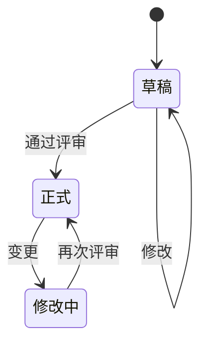

#### 8.5.2 版本号规则

| 状态 | 格式 | 示例 |
|-----|------|------|
| 草稿 | 0.YZ | 0.01, 0.99 |
| 正式 | X.Y | 1.0, 2.3 |
| 修改中 | X.YZ | 1.01, 2.31 |

### 8.6 质量管理

| 过程 | 内容 |
|-----|------|
| **质量计划** | 识别质量要求和标准 |
| **质量保证** | 通过 ==审计和评审== 保证质量 |
| **质量控制** | ==实时监控== 具体结果 |

### 8.7 风险管理


**风险分类**：

| 类型 | 影响 | 示例 |
|-----|------|------|
| **项目风险** | 威胁项目计划 | 进度、预算、人员 |
| **技术风险** | 威胁系统质量 | 设计、实现、测试 |
| **商业风险** | 威胁系统生存 | 市场、策略、预算 |

---

## 九、软件度量

### 9.1 McCabe 环路复杂度

计算公式：

$$V(G) = E - N + 2$$

其中：E = 边数，N = 节点数

**其他计算方法**：

1. 程序图中的区域数（封闭区域 + 1）
2. $V(G) = P + 1$，P 为判定节点数

---

## 总结

```mermaid
mindmap
  root((软件工程))
    过程模型
      瀑布/原型/螺旋
      敏捷/RUP
      CMM/CMMI
    需求工程
      获取/分析
      规格化/验证
      变更/跟踪
    分析设计
      结构化方法
      面向对象方法
      UML建模
    软件测试
      白盒/黑盒
      各阶段测试
      测试策略
    项目管理
      进度/配置
      质量/风险
```

!!! note "学习建议"

    1. **过程模型**要能区分各模型的特点和适用场景
    2. **UML 图**要熟悉各种图的用途和基本画法
    3. **测试方法**要理解白盒和黑盒的区别和适用阶段
    4. **项目管理**关注关键路径计算和配置管理流程
