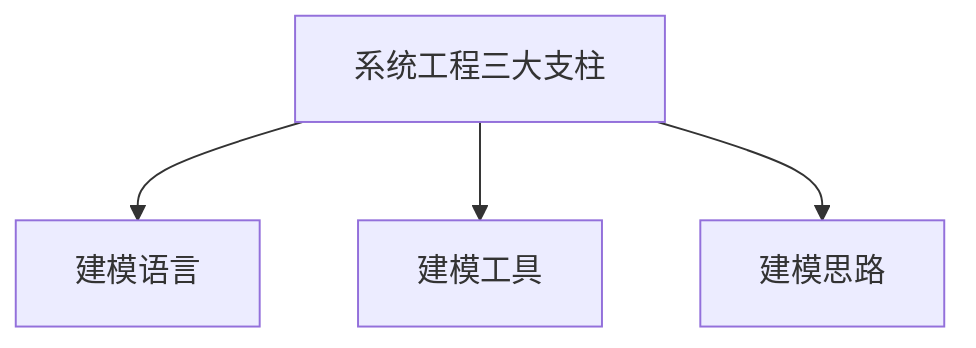
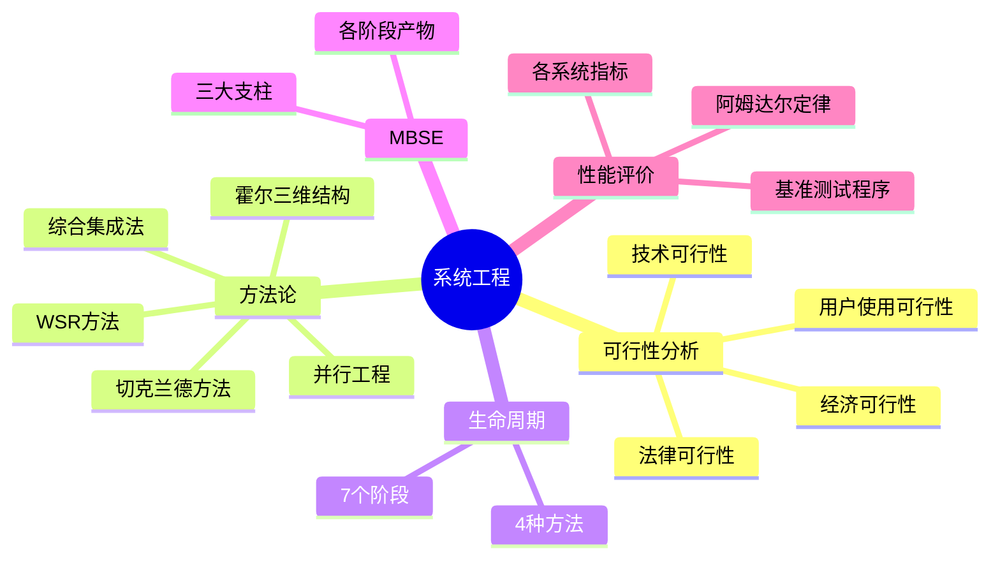

# 系统工程

!!! abstract "本章导读"
    系统工程是软考架构师考试的基础内容，涵盖系统工程方法论、生命周期、性能评价等核心知识点。本章将帮助考生建立系统性思维，理解如何运用科学方法解决复杂问题。

    **学习目标**：
    
    - 掌握霍尔三维结构的三个维度及其内容
    - 理解各种系统工程方法论的特点和适用场景
    - 熟悉系统性能评价指标和计算方法
    - 了解基准测试程序的类型和准确程度排序

## 可行性分析

可行性分析是所有项目投资、工程建设或重大改革在开始阶段必须进行的工作，是对多因素、多目标系统进行分析、评价和决策的过程。

### 可行性分析四个方面

| 类型 | 别名 | 分析内容 |
|:---:|:---|:---|
| **经济可行性** | 投资收益分析/成本效益分析 | 建设成本、运行成本、经济收益（直接/间接/有形/无形） |
| **技术可行性** | 技术风险分析 | 功能、性能需求，技术能力约束 |
| **法律可行性** | 社会可行性 | 政策、法律、道德、制度等社会因素 |
| **用户使用可行性** | 执行可行性 | 行政管理、工作制度、人员素质、培训要求 |

!!! warning "高频考点"
    可行性研究通常从**经济可行性、技术可行性、法律可行性和用户使用可行性**四个方面进行分析。

## 系统工程方法论

系统工程是运用系统方法，对系统进行规划、研究、设计、制造、试验和使用的组织管理技术。

### 方法论特点

系统工程方法的特点是：**整体性、综合性、协调性、科学性和实践性**。

### 五种方法论对比

=== "霍尔的三维结构"

    美国系统工程专家霍尔（A.D.Hall）于 1969 年提出，由**时间维、逻辑维和知识维**组成的三维空间结构。

    ```mermaid
    graph LR
        subgraph 时间维[时间维 - 7个阶段]
            T1[规划] --> T2[拟订方案] --> T3[研制] --> T4[生产] --> T5[安装] --> T6[运行] --> T7[更新]
        end
    ```

    | 维度 | 内容（7个） |
    |:---:|:---|
    | **时间维** | 规划、拟订方案、研制、生产、安装、运行、更新 |
    | **逻辑维** | 明确问题、确定目标、系统综合、系统分析、优化、决策、实施 |
    | **知识维** | 工程、医学、建筑、商业、法律、管理、社会科学、艺术等 |

    !!! tip "记忆技巧"
        - 时间维：**规方研生安运更**（规划方案研制生产安装运行更新）
        - 逻辑维：**明确综分优决实**（明确目标综合分析优化决策实施）

=== "切克兰德方法"

    核心思想是**"比较"与"探寻"**，而不是"最优化"。
    
    工作过程 7 个步骤：
    
    1. 认识问题
    2. 根底定义
    3. 建立概念模型
    4. 比较及探寻
    5. 选择
    6. 设计与实施
    7. 评估与反馈

    !!! info "方法特点"
        切克兰德方法适用于**软系统**（社会、管理系统），强调问题情境的理解而非最优解。

=== "并行工程"

    **并行工程（Concurrent Engineering）** 是对产品及其相关过程（包括制造过程和支持过程）进行**并行、集成化处理**的系统方法和综合技术。
    
    **目标**：提高质量、降低成本、缩短产品开发周期和产品上市时间

    ```mermaid
    gantt
        title 传统工程 vs 并行工程
        dateFormat  X
        axisFormat %s
        
        section 传统串行
        设计 :a1, 0, 3
        制作 :a2, after a1, 3
        测试 :a3, after a2, 2
        
        section 并行工程
        设计 :b1, 0, 3
        制作 :b2, 1, 3
        测试 :b3, 2, 3
    ```

=== "综合集成法"

    钱学森等提出，将系统分为**简单系统和巨系统**两大类。
    
    **开放的复杂巨系统基本原则**：整体论、相互联系、有序性、动态
    
    **主要性质**：开放性、复杂性、进化与涌现性、层次性和巨量性

=== "WSR 系统方法"

    **WSR** 是物理—事理—人理方法论的简称，具有中国传统哲学的思辨思想。
    
    | 维度 | 含义 | 关注点 |
    |:---:|:---|:---|
    | **物理（W）** | 物质世界的规律 | 技术可行性 |
    | **事理（S）** | 事务运作的规律 | 管理可行性 |
    | **人理（R）** | 人际关系的规律 | 人文可行性 |
    
    工作过程 7 步：理解意图、制定目标、调查分析、构造策略、选择方案、协调关系、实现构想

## 系统工程生命周期

### 生命周期阶段


### 生命周期方法

| 方法 | 特点 | 适用场景 |
|:---:|:---|:---|
| **计划驱动方法** | 预先详细规划，按计划执行 | 需求明确、变化少的项目 |
| **渐进迭代式开发** | 分阶段交付，逐步完善 | 需求逐步明确的项目 |
| **精益开发** | 消除浪费，价值驱动 | 资源受限的项目 |
| **敏捷开发** | 快速响应变化，持续交付 | 需求变化频繁的项目 |

## 基于模型的系统工程（MBSE）

**MBSE（Model-Based Systems Engineering）** 是建模方法的形式化应用，贯穿系统全生命周期。

### 系统工程三大支柱



### 各阶段产物

| 阶段 | 产物 |
|:---:|:---|
| **需求分析阶段** | 需求图、用例图、包图 |
| **功能分析与分配阶段** | 顺序图、活动图、状态机图 |
| **设计综合阶段** | 模块定义图、内部块图、参数图 |

## 系统性能评价

### 各类系统性能指标

| 系统类型 | 主要性能指标 |
|:---:|:---|
| **计算机** | 时钟频率（主频）、运算速度、运算精度、数据处理速率（PDR）、吞吐率 |
| **路由器** | 设备吞吐量、端口吞吐量、全双工线速转发能力、路由表能力、背板能力、丢包率、时延 |
| **交换机** | 端口速率、背板吞吐量、缓冲区大小、MAC 地址表大小 |
| **网络** | 设备级/网络级/应用级/用户级性能指标、吞吐量 |
| **操作系统** | 上下文切换、响应时间、吞吐率、资源利用率、可靠性、可移植性 |
| **数据库** | 最大并发事务处理能力、负载均衡能力、最大连接数 |
| **Web 服务器** | **最大并发连接数、响应延迟、吞吐量** |

!!! warning "高频考点"
    评价 **Web 服务器**的主要性能指标：**最大并发连接数、响应延迟、吞吐量**。
    
    常见的 Web 服务器性能评测方法：**基准性能测试、压力测试、可靠性测试**。

### 性能调整

**性能调整由查找和消除瓶颈组成。**

=== "数据库系统"

    - CPU/内存使用状况
    - 优化数据库设计
    - 优化数据库管理
    - 进程/线程状态
    - 硬盘 I/O 及剩余空间
    - 日志文件大小

=== "应用系统"

    - 可用性
    - 响应时间
    - 并发用户数
    - 特定应用的系统资源占用

## 阿姆达尔定律

阿姆达尔定律（Amdahl's Law）用来预测采用某种技术后系统性能的提升。

### 核心公式

$$加速比 = \frac{不使用增强部件时完成任务的时间}{使用增强部件时完成任务的时间}$$

$$新执行时间 = 原执行时间 \times \left[(1-增强比例) + \frac{增强比例}{增强加速比}\right]$$

$$总加速比 = \frac{1}{(1-增强比例) + \frac{增强比例}{增强加速比}}$$

!!! tip "关键理解"
    阿姆达尔定律指出：在并行计算中，**性能提高的速度取决于串行部分所占比例**。即使并行部分无限加速，总加速比仍受限于串行部分。

### 影响因素

| 因素 | 说明 |
|:---:|:---|
| **增强比例** | 能被改进的部分在总执行时间中所占比例（≤1） |
| **增强加速比** | 改进部分的加速倍数 |

## 基准测试程序

### 基准程序定义

**基准测试程序（Benchmark）**：应用程序中用得最多、最频繁的那部分**核心程序**。

### 评测准确程度排序

!!! warning "高频考点"
    基准测试程序中，评测的准确程度**依次递减**：
    
    **真实的程序 > 核心程序 > 小型基准程序 > 合成基准程序**

### 常见基准测试程序

| 程序类型 | 名称 | 用途 |
|:---:|:---|:---|
| **整数测试** | Dhrystone | 测试整数运算性能（MIPS） |
| **浮点测试** | Linpack、Whetstone | 测试浮点运算性能（MFLOPS） |
| **综合测试** | SPEC Benchmark | 面向处理器性能的基准程序集 |
| **事务处理** | TPC Benchmark | 测试数据库、决策支持系统性能 |

### TPC 基准程序系列

| 程序 | 用途 |
|:---:|:---|
| **TPC-C** | 在线事务处理（OLTP）基准程序 |
| **TPC-D** | 决策支持基准程序 |
| **TPC-E** | 大型企业信息服务基准程序 |

## 本章小结



!!! tip "备考建议"
    1. **重点记忆**：霍尔三维结构的三个维度及其各 7 个内容
    2. **理解公式**：阿姆达尔定律的加速比计算
    3. **记住排序**：基准测试程序准确程度：真实 > 核心 > 小型 > 合成
    4. **关注细节**：Web 服务器的三个核心性能指标
